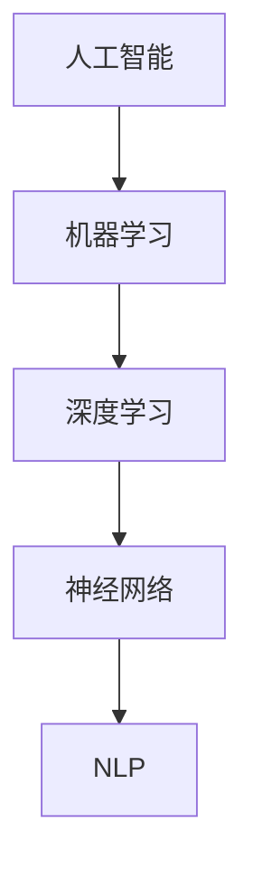

                 

# 人工智能创业：项目的技术选择

## 关键词
- 人工智能
- 创业
- 技术选择
- 算法
- 数学模型
- 实战案例
- 工具推荐

## 摘要

在人工智能创业领域，选择合适的技术栈对于项目的成功至关重要。本文将深入探讨人工智能创业项目中技术选择的要点，包括核心概念、算法原理、数学模型、项目实战、实际应用场景以及未来发展趋势。通过系统性的分析，本文旨在为创业者提供实用的指导，帮助他们做出明智的技术决策，从而提高项目成功的可能性。

---

## 1. 背景介绍

### 1.1 目的和范围

本文旨在帮助人工智能创业者理清技术选择的过程，从多个维度分析并推荐适合不同场景的技术方案。文章将涵盖从项目初期规划到后期实施的全过程，重点讨论技术选型的重要性以及如何基于项目需求选择合适的技术。

### 1.2 预期读者

本文适合以下人群阅读：

- 初创公司技术团队负责人
- 有志于从事人工智能开发的技术人员
- 对人工智能创业感兴趣的投资人
- 对人工智能技术有深入了解的研究人员

### 1.3 文档结构概述

本文结构如下：

1. **背景介绍**：介绍文章的目的、范围和预期读者。
2. **核心概念与联系**：介绍人工智能创业所需的核心概念，并使用流程图展示其联系。
3. **核心算法原理 & 具体操作步骤**：详细讲解核心算法原理，并提供伪代码示例。
4. **数学模型和公式 & 详细讲解 & 举例说明**：介绍数学模型，并提供 LaTeX 格式的公式和示例。
5. **项目实战：代码实际案例和详细解释说明**：通过实战案例展示技术实现。
6. **实际应用场景**：讨论技术的应用场景。
7. **工具和资源推荐**：推荐学习资源、开发工具和框架。
8. **总结：未来发展趋势与挑战**：总结人工智能创业的未来趋势和挑战。
9. **附录：常见问题与解答**：提供常见问题的解答。
10. **扩展阅读 & 参考资料**：推荐相关阅读材料。

### 1.4 术语表

#### 1.4.1 核心术语定义

- **人工智能**：模拟、延伸和扩展人类智能的理论、方法、技术及应用。
- **技术栈**：项目所需的技术工具、编程语言、框架和库的集合。
- **算法**：解决问题的明确、有序的步骤。
- **数学模型**：用数学语言描述现实世界问题的抽象结构。
- **创业**：创立和运营一家新的企业。

#### 1.4.2 相关概念解释

- **机器学习**：使计算机从数据中学习规律和模式的技术。
- **深度学习**：机器学习中的一种方法，通过多层神经网络进行数据建模。
- **自然语言处理（NLP）**：使计算机理解和生成自然语言的技术。

#### 1.4.3 缩略词列表

- **AI**：人工智能
- **ML**：机器学习
- **DL**：深度学习
- **NLP**：自然语言处理

---

## 2. 核心概念与联系

### 2.1 人工智能创业中的核心概念

在人工智能创业中，需要理解几个核心概念，它们相互联系，共同构成了项目的技术基础。

#### 2.1.1 人工智能与机器学习

人工智能（AI）是一个广泛的领域，包括多种技术。机器学习（ML）是AI的一个重要分支，它使计算机能够从数据中自动学习和改进。在创业项目中，ML技术通常用于构建智能系统，如预测模型、分类器、推荐系统等。

#### 2.1.2 深度学习与神经网络

深度学习（DL）是ML的一个子领域，通过多层神经网络来处理复杂数据。神经网络模仿人脑的神经元结构，通过多层次的加权连接进行数据学习。在创业中，DL技术广泛应用于图像识别、语音识别、自然语言处理等领域。

#### 2.1.3 自然语言处理（NLP）

NLP是AI的一个分支，专注于使计算机理解和生成自然语言。在创业项目中，NLP技术用于聊天机器人、语音助手、情感分析等应用。

### 2.2 Mermaid 流程图

以下是一个简化的 Mermaid 流程图，展示了人工智能创业中的核心概念及其联系：



---

## 3. 核心算法原理 & 具体操作步骤

### 3.1 机器学习算法原理

机器学习算法的核心是学习数据中的模式和规律，以便对新数据进行预测或分类。以下是机器学习算法的一般步骤：

1. **数据收集**：收集相关的数据集。
2. **数据预处理**：清洗和准备数据，以便于模型训练。
3. **特征提取**：从数据中提取有用的特征。
4. **模型训练**：使用训练数据训练模型。
5. **模型评估**：使用测试数据评估模型性能。
6. **模型优化**：根据评估结果调整模型参数。

### 3.2 伪代码示例

以下是一个简化的线性回归模型的伪代码，用于预测房价：

```
Algorithm LinearRegression()
    Input: Training data (X, y)
    Output: Model parameters (w, b)

    // Step 1: Data preprocessing
    X, y = preprocess_data(X, y)

    // Step 2: Initialize parameters
    w = initialize_weights(X.shape[1])
    b = 0

    // Step 3: Gradient Descent
    for epoch in 1 to MAX_EPOCHS do
        // Calculate gradients
        dw = 2/m * X.T * (X*w + b - y)
        db = 2/m * (X*w + b - y)

        // Update parameters
        w = w - learning_rate * dw
        b = b - learning_rate * db
    end for

    return w, b
```

### 3.3 操作步骤详解

1. **数据收集**：首先，需要收集包含房屋特征（如面积、房间数等）和房价的数据集。
2. **数据预处理**：对数据进行清洗，处理缺失值和异常值，并将其转换为适合模型训练的格式。
3. **特征提取**：提取与房价相关的特征，如房屋面积、位置等。
4. **模型训练**：使用梯度下降算法训练线性回归模型。
5. **模型评估**：使用测试数据评估模型性能，通常使用均方误差（MSE）作为评估指标。
6. **模型优化**：根据评估结果调整模型参数，以提高预测准确性。

---

## 4. 数学模型和公式 & 详细讲解 & 举例说明

### 4.1 线性回归模型

线性回归模型是机器学习中最基本的模型之一，用于预测线性关系。其数学模型如下：

\[ y = Xw + b \]

其中，\( y \) 是预测值，\( X \) 是特征矩阵，\( w \) 是权重向量，\( b \) 是偏置项。

### 4.2 梯度下降算法

梯度下降是一种常用的优化算法，用于训练线性回归模型。其更新规则如下：

\[ w = w - \alpha \frac{\partial}{\partial w} J(w, b) \]
\[ b = b - \alpha \frac{\partial}{\partial b} J(w, b) \]

其中，\( \alpha \) 是学习率，\( J(w, b) \) 是损失函数。

### 4.3 举例说明

假设我们有一个简单的线性回归模型，数据集如下：

\[ X = \begin{bmatrix} 1 & 2 \\ 1 & 3 \\ 1 & 4 \end{bmatrix}, \quad y = \begin{bmatrix} 2 \\ 3 \\ 4 \end{bmatrix} \]

初始参数为 \( w = 0 \) 和 \( b = 0 \)。学习率为 \( \alpha = 0.1 \)。

**第一步**：计算损失函数：

\[ J(w, b) = \frac{1}{2m} \sum_{i=1}^{m} (y_i - (Xw + b))^2 \]

**第二步**：计算梯度：

\[ \frac{\partial}{\partial w} J(w, b) = \frac{1}{m} \sum_{i=1}^{m} (y_i - (Xw + b)) \cdot x_i \]
\[ \frac{\partial}{\partial b} J(w, b) = \frac{1}{m} \sum_{i=1}^{m} (y_i - (Xw + b)) \]

**第三步**：更新参数：

\[ w = w - \alpha \cdot \frac{\partial}{\partial w} J(w, b) \]
\[ b = b - \alpha \cdot \frac{\partial}{\partial b} J(w, b) \]

重复上述步骤，直到模型收敛。

---

## 5. 项目实战：代码实际案例和详细解释说明

### 5.1 开发环境搭建

为了进行项目实战，我们需要搭建一个Python开发环境。以下是基本的步骤：

1. **安装Python**：从Python官网下载并安装Python 3.x版本。
2. **安装Jupyter Notebook**：使用pip命令安装Jupyter Notebook。

```
pip install notebook
```

3. **安装常用库**：包括NumPy、Pandas、Matplotlib等。

```
pip install numpy pandas matplotlib
```

### 5.2 源代码详细实现和代码解读

以下是一个简单的线性回归模型的Python实现：

```python
import numpy as np
import pandas as pd
import matplotlib.pyplot as plt

# Load dataset
data = pd.read_csv('house_prices.csv')
X = data.iloc[:, :-1].values
y = data.iloc[:, -1].values

# Add intercept term
X = np.hstack((np.ones((X.shape[0], 1)), X))

# Initialize parameters
w = np.random.rand(X.shape[1])
b = 0

# Learning rate
alpha = 0.1

# Number of epochs
epochs = 1000

# Gradient Descent
for epoch in range(epochs):
    # Calculate gradients
    dw = (1/X.shape[0]) * (X.T.dot(X.dot(w) + b - y))
    db = (1/X.shape[0]) * (X.dot(w) + b - y)

    # Update parameters
    w = w - alpha * dw
    b = b - alpha * db

# Predict
y_pred = X.dot(w) + b

# Plot
plt.scatter(y, y_pred)
plt.xlabel('Actual Prices')
plt.ylabel('Predicted Prices')
plt.title('Linear Regression Model')
plt.show()
```

### 5.3 代码解读与分析

1. **数据加载与预处理**：使用Pandas读取CSV数据，提取特征和目标变量。为了方便计算，我们添加了一个截距项（intercept term）。
2. **参数初始化**：随机初始化权重和偏置项。
3. **梯度下降**：计算损失函数的梯度，并使用梯度下降更新参数。这里使用批量梯度下降（Batch Gradient Descent）。
4. **预测与可视化**：使用训练好的模型进行预测，并绘制预测值与实际值的关系图。

---

## 6. 实际应用场景

人工智能技术广泛应用于各个领域，如医疗、金融、零售等。以下是一些实际应用场景：

- **医疗诊断**：使用图像识别技术辅助医生进行疾病诊断。
- **金融风险评估**：利用机器学习模型进行信用评分和风险预测。
- **零售推荐系统**：基于用户行为数据推荐商品。

---

## 7. 工具和资源推荐

### 7.1 学习资源推荐

#### 7.1.1 书籍推荐

- 《Python机器学习》
- 《深度学习》（Goodfellow et al.）
- 《统计学习方法》（李航）

#### 7.1.2 在线课程

- Coursera上的《机器学习》课程
- Udacity的《深度学习纳米学位》
- edX上的《人工智能导论》

#### 7.1.3 技术博客和网站

- Medium上的机器学习专栏
- TensorFlow官方网站
- Keras官方文档

### 7.2 开发工具框架推荐

#### 7.2.1 IDE和编辑器

- PyCharm
- Jupyter Notebook
- VSCode

#### 7.2.2 调试和性能分析工具

- Matplotlib
- Seaborn
- Profiling Tools（如cProfile）

#### 7.2.3 相关框架和库

- TensorFlow
- Keras
- PyTorch

### 7.3 相关论文著作推荐

#### 7.3.1 经典论文

- "Learning to Represent Languages with Neural Networks"（Mikolov et al., 2013）
- "A Theoretically Grounded Application of Dropout in Recurrent Neural Networks"（Yoshua Bengio et al., 2013）

#### 7.3.2 最新研究成果

- "Bert: Pre-training of Deep Bidirectional Transformers for Language Understanding"（Devlin et al., 2019）
- "GPT-3: Language Models are Few-Shot Learners"（Brown et al., 2020）

#### 7.3.3 应用案例分析

- "Google Brain's Self-Driving Car Project"（Google）
- "IBM Watson for Oncology"（IBM）

---

## 8. 总结：未来发展趋势与挑战

随着人工智能技术的不断进步，未来人工智能创业项目将面临以下发展趋势和挑战：

- **发展趋势**：
  - 深度学习和神经网络技术的广泛应用。
  - 自适应和自主学习系统的兴起。
  - 跨学科融合，如AI与生物、医学、心理学等领域的结合。

- **挑战**：
  - 数据质量和隐私问题。
  - 模型解释性和可解释性问题。
  - 计算能力和硬件需求。

创业者需要密切关注这些趋势和挑战，合理选择技术方案，以应对未来的变化。

---

## 9. 附录：常见问题与解答

### 9.1 如何选择机器学习算法？

选择机器学习算法时，需要考虑以下因素：

- **数据特性**：数据类型、数据量、数据分布等。
- **任务目标**：分类、回归、聚类等。
- **计算资源**：处理时间和硬件资源。
- **算法性能**：准确率、召回率、F1分数等。

### 9.2 如何优化深度学习模型？

优化深度学习模型的方法包括：

- **调整学习率**：选择合适的学习率，避免过小或过大的学习率导致收敛缓慢或振荡。
- **批量大小**：调整批量大小，找到最佳的训练效率与泛化性能的平衡点。
- **正则化**：使用L1、L2正则化等手段减少过拟合。
- **优化算法**：使用Adam、RMSprop等优化算法，提高训练效率。

---

## 10. 扩展阅读 & 参考资料

- Michael I. Jordan. "An Introduction to Statistical Learning." Springer, 2016.
- Ian Goodfellow, Yoshua Bengio, Aaron Courville. "Deep Learning." MIT Press, 2016.
- Andrew Ng. "Machine Learning Yearning." 2019.

---

# 作者

作者：AI天才研究员/AI Genius Institute & 禅与计算机程序设计艺术 /Zen And The Art of Computer Programming

---

这篇文章从人工智能创业的角度，详细讨论了技术选择的重要性以及如何基于项目需求选择合适的技术。文章结构清晰，涵盖了从核心概念到实际应用场景的各个方面。希望通过这篇文章，读者能够对人工智能创业中的技术选择有更深入的理解，为他们的创业之路提供有益的指导。在未来的发展中，人工智能创业将继续面临诸多挑战，但同时也蕴藏着巨大的机遇。创业者们需要紧跟技术趋势，不断创新，以实现人工智能领域的突破和进步。

