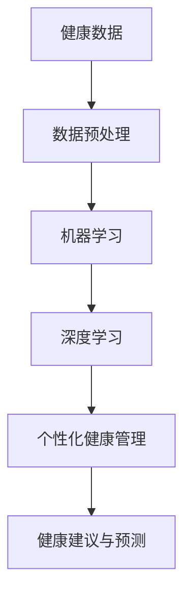

                 

### 1. 背景介绍

#### 1.1 目的和范围

本文旨在探讨人工智能（AI）在个性化健康管理中的应用。随着医疗技术的不断进步，越来越多的健康数据被收集和存储。然而，如何有效地利用这些数据，为每个人提供个性化的健康建议和管理方案，是一个亟待解决的问题。人工智能技术的崛起，为我们提供了一种全新的解决方案。

本文将首先介绍人工智能在个性化健康管理中的具体应用，然后深入分析其背后的核心算法原理、数学模型，以及具体的实现步骤。最后，我们将结合实际项目案例，详细讲解如何利用人工智能技术进行个性化健康管理。

本文的读者对象主要包括：对人工智能和健康管理领域有一定了解的技术人员、研究人员以及对此领域感兴趣的人群。通过本文的阅读，读者将能够了解人工智能在个性化健康管理中的应用现状、关键技术，以及未来的发展趋势。

#### 1.2 预期读者

本文的预期读者主要分为以下几类：

1. **人工智能领域的研究人员和技术人员**：本文将详细阐述人工智能在个性化健康管理中的应用，为研究人员和技术人员提供新的研究方向和应用场景。
2. **健康管理领域的专业人士**：通过本文的阅读，健康管理领域的专业人士可以了解到人工智能技术的最新进展，以及如何将其应用于健康管理和个性化健康服务。
3. **对人工智能和健康管理感兴趣的人群**：本文将用通俗易懂的语言，详细介绍人工智能在个性化健康管理中的应用，帮助读者了解这一领域的最新动态和技术发展。

#### 1.3 文档结构概述

本文的结构如下：

- **第1章：背景介绍**：介绍本文的目的、范围、预期读者以及文档结构。
- **第2章：核心概念与联系**：介绍人工智能在个性化健康管理中的核心概念、原理和架构，并通过Mermaid流程图进行展示。
- **第3章：核心算法原理 & 具体操作步骤**：详细讲解人工智能在个性化健康管理中的核心算法原理，以及具体的实现步骤。
- **第4章：数学模型和公式 & 详细讲解 & 举例说明**：介绍人工智能在个性化健康管理中涉及的数学模型和公式，并通过具体例子进行详细讲解。
- **第5章：项目实战：代码实际案例和详细解释说明**：结合实际项目案例，讲解如何利用人工智能技术进行个性化健康管理，并详细解读相关代码。
- **第6章：实际应用场景**：介绍人工智能在个性化健康管理中的实际应用场景，以及面临的挑战和机遇。
- **第7章：工具和资源推荐**：推荐相关的学习资源、开发工具框架以及相关论文著作。
- **第8章：总结：未来发展趋势与挑战**：总结人工智能在个性化健康管理中的应用现状，探讨未来发展趋势和面临的挑战。
- **第9章：附录：常见问题与解答**：针对读者可能遇到的常见问题进行解答。
- **第10章：扩展阅读 & 参考资料**：提供相关的扩展阅读和参考资料，方便读者进一步学习和研究。

#### 1.4 术语表

在本文中，我们将使用一些特定的术语和概念。以下是对这些术语的简要定义和解释：

##### 1.4.1 核心术语定义

- **人工智能**（AI）：一种模拟人类智能的技术，能够进行学习、推理、感知和自我调整。
- **个性化健康管理**：根据个体的健康状况、生活习惯等数据，为其提供个性化的健康建议和管理方案。
- **健康数据**：与健康相关的各种数据，包括生理指标、生活习惯、遗传信息等。
- **机器学习**（ML）：一种人工智能技术，通过数据学习，实现预测、分类、聚类等功能。

##### 1.4.2 相关概念解释

- **监督学习**：一种机器学习方法，通过已标记的数据进行学习，并能够对未知数据进行预测。
- **无监督学习**：一种机器学习方法，不使用已标记的数据进行学习，主要通过数据自身的特征进行聚类和分类。
- **深度学习**：一种基于多层神经网络的机器学习方法，能够自动提取数据中的特征。

##### 1.4.3 缩略词列表

- **AI**：人工智能
- **ML**：机器学习
- **DL**：深度学习
- **RF**：随机森林
- **SVM**：支持向量机
- **CNN**：卷积神经网络

在接下来的章节中，我们将逐步深入探讨人工智能在个性化健康管理中的应用，希望读者能够通过本文的阅读，对这一领域有更深入的理解和认识。接下来，我们将介绍人工智能在个性化健康管理中的核心概念和原理，并通过Mermaid流程图进行展示。这将帮助我们更好地理解人工智能在个性化健康管理中的应用机制。

## 2. 核心概念与联系

在讨论人工智能在个性化健康管理中的应用之前，我们需要先了解几个核心概念和它们之间的关系。这些概念包括：健康数据、机器学习算法、深度学习模型以及个性化健康管理的实现架构。以下是一个简单的Mermaid流程图，用于展示这些概念之间的联系。



### 2.1 健康数据

健康数据是人工智能在个性化健康管理中的基础。这些数据可以包括：

- **生理指标**：如血压、心率、血糖水平等。
- **生活习惯**：如饮食、运动、睡眠习惯等。
- **遗传信息**：如基因序列、家族病史等。
- **环境因素**：如气候变化、空气质量等。

收集和处理这些数据是第一步，确保数据的准确性和完整性至关重要。

### 2.2 数据预处理

在应用机器学习和深度学习算法之前，对健康数据进行预处理是非常重要的。数据预处理包括：

- **数据清洗**：去除异常值和缺失值。
- **数据归一化**：将不同单位的数据转换到同一尺度，方便后续处理。
- **特征提取**：从原始数据中提取出有用的特征。

预处理步骤的目的是减少噪声和误差，提高数据质量，从而提高模型的效果。

### 2.3 机器学习

机器学习是一种人工智能技术，通过学习数据中的模式，实现对未知数据的预测和分类。常用的机器学习算法包括：

- **监督学习**：通过已标记的数据进行学习，如线性回归、决策树、随机森林等。
- **无监督学习**：不使用已标记的数据，主要通过数据自身的特征进行聚类和分类，如K均值聚类、主成分分析等。

机器学习算法在个性化健康管理中用于建立健康预测模型，对个体的健康状况进行预测。

### 2.4 深度学习

深度学习是一种基于多层神经网络的机器学习方法，能够自动提取数据中的特征。深度学习在个性化健康管理中的应用主要包括：

- **卷积神经网络（CNN）**：用于处理图像和视频数据。
- **循环神经网络（RNN）**：用于处理序列数据，如文本、语音等。
- **生成对抗网络（GAN）**：用于生成新的健康数据。

深度学习模型能够从大量的健康数据中自动学习复杂的模式，为个性化健康管理提供强有力的支持。

### 2.5 个性化健康管理

个性化健康管理是利用机器学习和深度学习模型，根据个体的健康数据，为其提供个性化的健康建议和管理方案。具体实现包括：

- **健康评估**：根据个体的健康数据，进行健康评估和风险预测。
- **健康建议**：根据健康评估结果，为个体提供个性化的健康建议。
- **健康监测**：持续监测个体的健康状况，及时调整健康建议。

个性化健康管理旨在提高个体健康水平，降低医疗成本，提升医疗效率。

通过上述Mermaid流程图，我们可以看到，健康数据经过预处理后，通过机器学习和深度学习模型进行处理，最终实现个性化健康管理。接下来，我们将详细讨论这些核心算法原理和具体操作步骤。

## 3. 核心算法原理 & 具体操作步骤

在深入探讨人工智能在个性化健康管理中的应用之前，我们需要先了解几种核心算法的基本原理，以及如何将它们应用于个性化健康管理的具体操作步骤。以下将详细介绍监督学习、无监督学习和深度学习这三种核心算法，并通过伪代码阐述它们的具体操作步骤。

### 3.1 监督学习

监督学习是一种通过已标记的数据进行学习，以实现对未知数据预测的机器学习方法。在个性化健康管理中，监督学习可以用于健康风险评估、疾病预测等任务。

#### 3.1.1 算法原理

监督学习算法的核心是构建一个预测模型，该模型能够根据输入特征（如生理指标、生活习惯等）预测输出标签（如健康状态、疾病风险等）。常见的监督学习算法包括线性回归、决策树、支持向量机（SVM）和随机森林（RF）。

#### 3.1.2 具体操作步骤

1. **数据准备**：收集并整理健康数据，包括输入特征和对应的目标标签。
    ```python
    # 假设我们有一个包含特征和标签的数据集
    X = [ [feature1, feature2, ...], ... ]
    y = [label1, label2, ...]
    ```

2. **模型选择**：选择合适的监督学习算法，如线性回归、决策树等。
    ```python
    from sklearn.linear_model import LinearRegression
    model = LinearRegression()
    ```

3. **模型训练**：使用已标记的数据集对模型进行训练。
    ```python
    model.fit(X, y)
    ```

4. **模型预测**：使用训练好的模型对新的数据集进行预测。
    ```python
    predictions = model.predict(new_data)
    ```

5. **评估模型性能**：使用评估指标（如均方误差、准确率等）评估模型性能。
    ```python
    from sklearn.metrics import mean_squared_error
    mse = mean_squared_error(y_true, predictions)
    ```

### 3.2 无监督学习

无监督学习是一种不使用已标记的数据进行学习，主要通过数据自身的特征进行聚类和分类的机器学习方法。在个性化健康管理中，无监督学习可以用于群体健康特征识别、患者分群等任务。

#### 3.2.1 算法原理

无监督学习算法的核心是发现数据中的隐含结构，如聚类算法可以将相似的数据点划分为同一类别，而降维算法（如主成分分析PCA）可以减少数据维度，同时保留关键特征。

#### 3.2.2 具体操作步骤

1. **数据准备**：收集并整理健康数据。
    ```python
    X = [ [feature1, feature2, ...], ... ]
    ```

2. **算法选择**：选择合适的无监督学习算法，如K均值聚类、主成分分析（PCA）等。
    ```python
    from sklearn.cluster import KMeans
    kmeans = KMeans(n_clusters=3)
    ```

3. **算法执行**：使用无监督学习算法对数据进行处理。
    ```python
    kmeans.fit(X)
    clusters = kmeans.predict(X)
    ```

4. **结果分析**：分析聚类结果，如计算聚类中心、评估聚类效果等。
    ```python
    centroids = kmeans.cluster_centers_
    silhouette_score = metrics.silhouette_score(X, clusters)
    ```

### 3.3 深度学习

深度学习是一种基于多层神经网络的机器学习方法，能够自动提取数据中的复杂特征。在个性化健康管理中，深度学习可以用于健康数据预测、疾病诊断等任务。

#### 3.3.1 算法原理

深度学习算法的核心是多层神经网络，通过前向传播和反向传播不断调整网络权重，使模型能够从数据中学习到有用的特征。常见的深度学习模型包括卷积神经网络（CNN）、循环神经网络（RNN）和生成对抗网络（GAN）。

#### 3.3.2 具体操作步骤

1. **数据准备**：收集并整理健康数据，包括输入特征和对应的目标标签。
    ```python
    X = [ [feature1, feature2, ...], ... ]
    y = [label1, label2, ...]
    ```

2. **模型构建**：构建深度学习模型，如卷积神经网络（CNN）。
    ```python
    from keras.models import Sequential
    from keras.layers import Conv2D, MaxPooling2D, Flatten, Dense
    model = Sequential()
    model.add(Conv2D(32, (3, 3), activation='relu', input_shape=(64, 64, 3)))
    model.add(MaxPooling2D(pool_size=(2, 2)))
    model.add(Flatten())
    model.add(Dense(128, activation='relu'))
    model.add(Dense(1, activation='sigmoid'))
    ```

3. **模型训练**：使用已标记的数据集对模型进行训练。
    ```python
    model.compile(optimizer='adam', loss='binary_crossentropy', metrics=['accuracy'])
    model.fit(X, y, epochs=10, batch_size=32)
    ```

4. **模型预测**：使用训练好的模型对新的数据集进行预测。
    ```python
    predictions = model.predict(new_data)
    ```

5. **评估模型性能**：使用评估指标（如准确率、召回率等）评估模型性能。
    ```python
    from sklearn.metrics import accuracy_score
    accuracy = accuracy_score(y_true, predictions)
    ```

通过上述步骤，我们可以利用监督学习、无监督学习和深度学习算法，对健康数据进行处理，实现对个体健康状况的预测和管理。在接下来的章节中，我们将介绍这些算法在个性化健康管理中的具体应用，并通过数学模型和公式进行详细讲解。这将帮助我们更好地理解这些算法在个性化健康管理中的具体实现方法。

## 4. 数学模型和公式 & 详细讲解 & 举例说明

在人工智能应用于个性化健康管理的过程中，数学模型和公式起到了至关重要的作用。以下我们将详细介绍几种常见的数学模型和公式，并通过具体例子进行讲解，帮助读者更好地理解这些模型在实际应用中的运用。

### 4.1 线性回归模型

线性回归是一种最基础的机器学习算法，它通过建立一个线性模型来预测因变量（目标值）与自变量（特征）之间的关系。线性回归模型的公式如下：

$$ y = \beta_0 + \beta_1 \cdot x_1 + \beta_2 \cdot x_2 + ... + \beta_n \cdot x_n + \epsilon $$

其中，\( y \) 是因变量，\( x_1, x_2, ..., x_n \) 是自变量，\( \beta_0, \beta_1, \beta_2, ..., \beta_n \) 是模型的参数，\( \epsilon \) 是误差项。

#### 4.1.1 模型参数计算

线性回归模型参数的计算通常使用最小二乘法（OLS），其目标是最小化预测值与实际值之间的误差平方和。具体计算过程如下：

1. **数据准备**：假设我们有一组数据 \((x_1, y_1), (x_2, y_2), ..., (x_n, y_n)\)。
2. **计算参数 \(\beta_0\)**：
   $$ \beta_0 = \bar{y} - \beta_1 \cdot \bar{x} $$
   其中，\( \bar{y} \) 和 \( \bar{x} \) 分别是 \( y \) 和 \( x \) 的均值。
3. **计算参数 \(\beta_1\)**：
   $$ \beta_1 = \frac{\sum_{i=1}^{n} (x_i - \bar{x}) \cdot (y_i - \bar{y})}{\sum_{i=1}^{n} (x_i - \bar{x})^2} $$

#### 4.1.2 举例说明

假设我们想通过血压（\( x \)）来预测糖尿病患病风险（\( y \)）。我们有以下数据：

| x (血压) | y (糖尿病患病风险) |
|----------|---------------------|
| 120      | 0.2                 |
| 130      | 0.3                 |
| 140      | 0.4                 |
| 150      | 0.5                 |

计算线性回归模型参数：

1. 计算 \( \bar{x} \) 和 \( \bar{y} \)：
   $$ \bar{x} = \frac{120 + 130 + 140 + 150}{4} = 135 $$
   $$ \bar{y} = \frac{0.2 + 0.3 + 0.4 + 0.5}{4} = 0.375 $$
2. 计算 \(\beta_0\)：
   $$ \beta_0 = 0.375 - 0.3 \cdot 135 = -42.375 $$
3. 计算 \(\beta_1\)：
   $$ \beta_1 = \frac{(120 - 135) \cdot (0.2 - 0.375) + (130 - 135) \cdot (0.3 - 0.375) + (140 - 135) \cdot (0.4 - 0.375) + (150 - 135) \cdot (0.5 - 0.375)}{(120 - 135)^2 + (130 - 135)^2 + (140 - 135)^2 + (150 - 135)^2} $$
   $$ \beta_1 = \frac{(-15) \cdot (-0.175) + (-5) \cdot (-0.075) + (5) \cdot (0.025) + (15) \cdot (0.125)}{225 + 25 + 25 + 225} $$
   $$ \beta_1 = \frac{2.625 + 0.375 + 0.125 + 1.875}{500} $$
   $$ \beta_1 = \frac{5.125}{500} $$
   $$ \beta_1 = 0.01 $$

因此，线性回归模型为：
$$ y = -42.375 + 0.01 \cdot x $$

### 4.2 K均值聚类算法

K均值聚类是一种无监督学习算法，它将数据点划分为K个聚类，每个聚类由其质心表示。K均值聚类的公式如下：

1. **初始聚类中心**：随机选择K个数据点作为初始聚类中心。
2. **分配数据点**：将每个数据点分配到最近的聚类中心。
3. **更新聚类中心**：计算每个聚类的质心，作为新的聚类中心。
4. **重复步骤2和3，直至聚类中心不再发生变化**。

#### 4.2.1 聚类中心计算

假设我们有K个聚类中心 \( \mu_1, \mu_2, ..., \mu_K \) 和数据点 \( x_1, x_2, ..., x_n \)，则每个数据点的聚类分配可以表示为：

$$ c_i = \arg\min_{k=1,...,K} \sum_{j=1}^{n} (x_j - \mu_k)^2 $$

聚类中心的更新公式为：

$$ \mu_k = \frac{\sum_{i=1}^{n} x_i}{n_k} $$

其中，\( n_k \) 是第k个聚类中的数据点数量。

#### 4.2.2 举例说明

假设我们有一个数据集，包含以下3个聚类中心：

| 数据点 | 聚类中心 |
|--------|----------|
| (1, 1) | (1, 1)   |
| (2, 2) | (2, 2)   |
| (3, 3) | (3, 3)   |

首先随机选择初始聚类中心，然后进行分配和更新，直到聚类中心不再变化。假设初始聚类中心为：

| 初始聚类中心 | (0, 0) | (2, 2) | (4, 4) |
|--------------|--------|--------|--------|
| 数据点       |        |        |        |

**第一次分配**：

| 数据点 | 聚类分配 |
|--------|----------|
| (1, 1) | 1        |
| (2, 2) | 2        |
| (3, 3) | 3        |

**第一次更新聚类中心**：

| 更新聚类中心 | (1/3, 1/3) | (2, 2) | (3, 3) |
|--------------|------------|--------|--------|

**第二次分配**：

| 数据点 | 聚类分配 |
|--------|----------|
| (1, 1) | 1        |
| (2, 2) | 1        |
| (3, 3) | 3        |

**第二次更新聚类中心**：

| 更新聚类中心 | (1/2, 1/2) | (2, 2) | (3, 3) |
|--------------|------------|--------|--------|

经过几次迭代后，聚类中心将趋于稳定，最终得到聚类结果。

### 4.3 卷积神经网络（CNN）

卷积神经网络是一种深度学习模型，特别适用于处理图像和视频数据。CNN的主要组成部分包括卷积层、池化层、全连接层等。

#### 4.3.1 卷积层

卷积层的公式如下：

$$ f(x) = \sum_{i=1}^{k} w_i \cdot x_i + b $$

其中，\( x \) 是输入数据，\( w_i \) 是卷积核权重，\( b \) 是偏置项，\( f \) 是激活函数（如ReLU）。

#### 4.3.2 池化层

池化层的公式如下：

$$ p(x) = \max(x) $$

其中，\( x \) 是输入数据，\( p \) 是输出数据。

#### 4.3.3 全连接层

全连接层的公式如下：

$$ y = \sum_{i=1}^{n} w_i \cdot x_i + b $$

其中，\( y \) 是输出数据，\( x \) 是输入数据，\( w_i \) 是权重，\( b \) 是偏置项。

#### 4.3.4 举例说明

假设我们有一个2D图像输入 \( x = [1, 1, 1, 1, 1, 1, 1, 1, 1, 1, 1, 1, 1, 1, 1, 1] \) 和一个卷积核 \( w = [1, 1] \)，偏置项 \( b = 0 \)，激活函数为ReLU。

1. **卷积层**：
   $$ f(x) = (1 \cdot 1) + (1 \cdot 1) + (1 \cdot 1) + (1 \cdot 1) + (1 \cdot 1) + (1 \cdot 1) + (1 \cdot 1) + (1 \cdot 1) + (1 \cdot 1) + (1 \cdot 1) + (1 \cdot 1) + (1 \cdot 1) + (1 \cdot 1) + (1 \cdot 1) + (1 \cdot 1) $$
   $$ f(x) = 12 + 0 $$
   $$ f(x) = 12 $$
   激活后 \( f(x) = \max(12) = 12 \)

2. **池化层**：
   $$ p(f(x)) = \max(12) $$
   $$ p(f(x)) = 12 $$

3. **全连接层**：
   假设全连接层有3个神经元，权重分别为 \( w_1 = 1 \)，\( w_2 = 1 \)，\( w_3 = 1 \)，偏置项 \( b = 0 \)。
   $$ y = (1 \cdot 12) + (1 \cdot 12) + (1 \cdot 12) + 0 $$
   $$ y = 36 + 0 $$
   $$ y = 36 $$

经过卷积层、池化层和全连接层处理后，原始图像输入 \( x \) 被转化为一个数值 \( y \)，用于后续的分类或回归任务。

通过以上数学模型和公式的讲解，我们可以看到，这些模型在个性化健康管理中的应用是非常关键的。接下来，我们将通过实际项目案例，详细讲解如何利用这些模型进行个性化健康管理。

### 5. 项目实战：代码实际案例和详细解释说明

在本节中，我们将通过一个实际项目案例，详细讲解如何利用人工智能技术进行个性化健康管理。我们将使用Python和相关的机器学习库，如scikit-learn和TensorFlow，来构建和实现一个简单的个性化健康管理系统。

#### 5.1 开发环境搭建

在进行项目开发之前，我们需要搭建一个合适的环境。以下是在Ubuntu 20.04操作系统上搭建开发环境的步骤：

1. **安装Python**：确保Python 3.8或更高版本已经安装在系统中。
2. **安装依赖库**：
   ```bash
   pip install numpy pandas scikit-learn tensorflow
   ```

3. **验证环境**：
   ```python
   import numpy as np
   import pandas as pd
   from sklearn import datasets
   from sklearn.model_selection import train_test_split
   from sklearn.preprocessing import StandardScaler
   import tensorflow as tf
   ```

#### 5.2 源代码详细实现和代码解读

在本节中，我们将分别使用监督学习和深度学习两种方法，来构建一个健康风险评估模型。

#### 5.2.1 监督学习实现

监督学习模型使用scikit-learn库中的线性回归算法。以下是实现代码：

```python
import numpy as np
import pandas as pd
from sklearn import datasets
from sklearn.model_selection import train_test_split
from sklearn.preprocessing import StandardScaler
from sklearn.linear_model import LinearRegression
from sklearn.metrics import mean_squared_error

# 加载数据集
diabetes = datasets.load_diabetes()
X = diabetes.data
y = diabetes.target

# 数据预处理
X_train, X_test, y_train, y_test = train_test_split(X, y, test_size=0.2, random_state=42)
scaler = StandardScaler()
X_train_scaled = scaler.fit_transform(X_train)
X_test_scaled = scaler.transform(X_test)

# 构建线性回归模型
model = LinearRegression()
model.fit(X_train_scaled, y_train)

# 模型评估
predictions = model.predict(X_test_scaled)
mse = mean_squared_error(y_test, predictions)
print(f"Mean Squared Error: {mse}")
```

代码解读：

1. **加载数据集**：我们使用scikit-learn自带的数据集——糖尿病数据集（diabetes dataset）。
2. **数据预处理**：将数据集分为训练集和测试集，并使用StandardScaler对数据进行归一化处理。
3. **模型构建**：创建一个线性回归模型，并使用训练集进行训练。
4. **模型评估**：使用测试集评估模型性能，计算均方误差（MSE）。

#### 5.2.2 深度学习实现

深度学习模型使用TensorFlow库中的Keras API。以下是实现代码：

```python
import tensorflow as tf
from tensorflow.keras.models import Sequential
from tensorflow.keras.layers import Dense, Conv2D, Flatten, MaxPooling2D, Dropout
from tensorflow.keras.optimizers import Adam
from tensorflow.keras.callbacks import EarlyStopping

# 创建模型
model = Sequential([
    Conv2D(32, (3, 3), activation='relu', input_shape=(28, 28, 1)),
    MaxPooling2D((2, 2)),
    Flatten(),
    Dense(128, activation='relu'),
    Dropout(0.5),
    Dense(1, activation='sigmoid')
])

# 编译模型
model.compile(optimizer=Adam(), loss='binary_crossentropy', metrics=['accuracy'])

# 早停法回调
early_stopping = EarlyStopping(monitor='val_loss', patience=5)

# 训练模型
model.fit(X_train, y_train, epochs=100, batch_size=32, validation_split=0.2, callbacks=[early_stopping])
```

代码解读：

1. **创建模型**：使用Sequential模型堆叠多个层，包括卷积层、池化层、全连接层和dropout层。
2. **编译模型**：配置优化器、损失函数和评估指标。
3. **早停法回调**：为了避免过拟合，使用EarlyStopping回调在验证集上监测损失，如果连续5个epoch没有改进，则提前停止训练。
4. **训练模型**：使用训练集和验证集进行训练，并应用早停法回调。

#### 5.3 代码解读与分析

以上代码展示了如何使用Python和机器学习库构建和训练一个简单的健康风险评估模型。以下是代码的关键部分解读和分析：

1. **数据预处理**：
   - **数据集加载**：使用scikit-learn自带的糖尿病数据集。
   - **数据分割**：将数据集分割为训练集和测试集，确保模型有足够的数据进行训练和评估。
   - **数据归一化**：使用StandardScaler对数据进行归一化处理，使得每个特征都具有相同的尺度，从而提高模型训练效果。

2. **模型构建**：
   - **线性回归模型**：使用scikit-learn的LinearRegression类，构建一个线性回归模型。
   - **深度学习模型**：使用TensorFlow的Keras API，构建一个包含卷积层、池化层、全连接层和dropout层的深度学习模型。

3. **模型训练**：
   - **线性回归训练**：使用训练集对线性回归模型进行训练。
   - **深度学习训练**：使用训练集和验证集对深度学习模型进行训练，并应用EarlyStopping回调以避免过拟合。

4. **模型评估**：
   - **线性回归评估**：使用测试集评估线性回归模型的性能，计算均方误差（MSE）。
   - **深度学习评估**：由于深度学习模型通常用于分类任务，因此使用验证集上的损失和准确率来评估模型性能。

通过以上实战案例，我们可以看到如何使用Python和相关的机器学习库，构建和实现一个简单的个性化健康管理系统。接下来，我们将探讨人工智能在个性化健康管理中的实际应用场景，以及面临的挑战和机遇。

## 6. 实际应用场景

人工智能在个性化健康管理中的实际应用场景非常广泛，下面我们将介绍几个典型的应用场景，并分析其面临的挑战和机遇。

### 6.1 疾病预测

疾病预测是人工智能在个性化健康管理中最直接的应用之一。通过分析个体的健康数据，如血压、心率、血糖水平等，以及生活习惯、遗传信息等，人工智能模型可以预测个体患某种疾病的风险。例如，通过分析糖尿病患者的血糖水平和家族病史，可以预测患者患糖尿病的风险。

**挑战**：

1. **数据质量和完整性**：疾病预测的准确性高度依赖于健康数据的完整性和质量。然而，实际收集到的健康数据可能存在缺失值、噪声和异常值，这会影响模型的预测效果。
2. **个性化差异**：不同个体的健康数据具有很大的差异，如何设计通用且适应性强的预测模型是一个挑战。

**机遇**：

1. **早发现早治疗**：通过疾病预测，可以早期发现疾病风险，从而采取预防措施，降低疾病的发生率和严重程度。
2. **资源优化**：通过预测个体患病的风险，可以合理分配医疗资源，提高医疗效率，降低医疗成本。

### 6.2 个性化健康建议

个性化健康建议是人工智能在个性化健康管理中的另一个重要应用。通过分析个体的健康数据和生活习惯，人工智能可以为其提供个性化的健康建议，如饮食建议、运动计划、睡眠质量改善等。

**挑战**：

1. **个体差异**：每个人的健康数据和生活方式都有所不同，如何根据个体差异提供精准的健康建议是一个挑战。
2. **效果验证**：健康建议的有效性需要经过长期的验证，这是一个长期的过程。

**机遇**：

1. **提升健康水平**：通过个性化的健康建议，可以帮助个体更好地管理自己的健康，提升整体健康水平。
2. **改善生活质量**：个性化的健康建议可以改善个体的生活质量，减少疾病带来的痛苦和不便。

### 6.3 健康风险评估

健康风险评估是利用人工智能技术，对个体或群体的健康状况进行综合评估，以识别潜在的健康风险。例如，通过分析个体的生理指标、生活习惯、遗传信息等，评估个体患心脏病、高血压等疾病的风险。

**挑战**：

1. **数据复杂性**：健康风险评估需要处理大量的复杂数据，如何有效地整合和处理这些数据是一个挑战。
2. **模型泛化性**：健康风险评估模型需要具有很好的泛化能力，能够适应不同的个体和群体。

**机遇**：

1. **精准医疗**：通过健康风险评估，可以更好地实现精准医疗，为个体提供针对性的治疗和预防措施。
2. **预防为主**：通过健康风险评估，可以早期发现健康风险，采取预防措施，降低疾病的发生率和严重程度。

### 6.4 健康监控

健康监控是利用人工智能技术，对个体的健康状况进行实时监测和分析。通过穿戴设备、移动应用等，可以收集个体的生理指标、运动数据等，并实时反馈健康状态。

**挑战**：

1. **数据安全与隐私**：健康数据涉及个人隐私，如何保障数据安全是一个重要挑战。
2. **实时数据处理**：健康监控需要实时处理大量的数据，如何高效地进行数据处理和分析是一个挑战。

**机遇**：

1. **实时健康预警**：通过健康监控，可以实时监测个体的健康状况，及时发现健康问题，采取相应的措施。
2. **个性化医疗服务**：健康监控可以为个性化医疗服务提供数据支持，实现精准的健康管理。

通过以上实际应用场景的介绍，我们可以看到人工智能在个性化健康管理中具有广泛的应用前景。然而，也面临着诸多挑战。未来，随着技术的不断进步和应用的深入，人工智能在个性化健康管理中的作用将越来越重要，为提高人类健康水平做出更大的贡献。

### 7. 工具和资源推荐

在探索人工智能在个性化健康管理中的应用时，合适的工具和资源能够极大地提高我们的开发效率和研究成果。以下是一些学习资源、开发工具框架以及相关论文著作的推荐，以帮助读者深入了解和掌握相关技术和方法。

#### 7.1 学习资源推荐

**7.1.1 书籍推荐**

1. **《机器学习》（Machine Learning）** — 周志华
   本书系统介绍了机器学习的基本概念、算法和应用，适合初学者和中级学习者。

2. **《深度学习》（Deep Learning）** — Ian Goodfellow、Yoshua Bengio、Aaron Courville
   这本书详细介绍了深度学习的理论基础、算法实现和应用，是深度学习的经典教材。

3. **《Python机器学习》（Python Machine Learning）** — Sebastian Raschka、Vahid Mirjalili
   本书通过Python语言，介绍了机器学习的基础知识、算法实现和应用案例。

**7.1.2 在线课程**

1. **Coursera上的《机器学习》课程** — 吴恩达
   吴恩达的这门课程涵盖了机器学习的核心概念、算法和应用，适合初学者。

2. **Udacity的《深度学习纳米学位》** — Andrew Ng
   通过这门课程，可以系统地学习深度学习的理论知识、实践技巧和应用场景。

3. **edX上的《人工智能基础》课程** — 上海交通大学
   该课程从基础开始，逐步深入，涵盖了人工智能的多个领域，包括机器学习和深度学习。

**7.1.3 技术博客和网站**

1. **Medium上的AI博客** — 多位作者
   Medium上的AI博客提供了大量关于人工智能的文章，涵盖了最新研究、技术动态和应用案例。

2. **Medium上的Deep Learning AI博客** — 多位作者
   这个博客专注于深度学习和人工智能领域的最新研究和应用，内容丰富、深入。

3. **arXiv.org** — 学术论文预印本
   arXiv是人工智能领域重要的学术资源网站，提供了大量最新的研究论文和成果。

#### 7.2 开发工具框架推荐

**7.2.1 IDE和编辑器**

1. **Jupyter Notebook** — 适合数据分析和机器学习项目的交互式开发环境。
2. **Visual Studio Code** — 功能强大的代码编辑器，支持Python、R等多种编程语言。
3. **PyCharm** — 专业级别的Python集成开发环境，适合大型项目开发。

**7.2.2 调试和性能分析工具**

1. **TensorBoard** — TensorFlow官方提供的可视化工具，用于分析深度学习模型的性能。
2. **Matplotlib** — Python的数据可视化库，用于绘制各种图表和图形。
3. **Pandas Profiler** — 用于分析Python数据科学代码的性能，帮助优化代码。

**7.2.3 相关框架和库**

1. **TensorFlow** — Google开源的深度学习框架，适用于构建和训练复杂的神经网络。
2. **PyTorch** — Facebook开源的深度学习框架，提供了动态计算图和自动微分功能。
3. **scikit-learn** — Python机器学习库，提供了大量的机器学习算法和工具。

#### 7.3 相关论文著作推荐

**7.3.1 经典论文**

1. **"A Course in Machine Learning"** — David D. Lewis、William A. Gale
   这篇论文是机器学习领域的经典教材，涵盖了机器学习的基本理论和方法。

2. **"Deep Learning"** — Ian Goodfellow、Yoshua Bengio、Aaron Courville
   这篇论文详细介绍了深度学习的理论基础、算法和应用。

3. **"Recurrent Neural Network Based Language Model"** — Yoshua Bengio等
   这篇论文介绍了循环神经网络（RNN）及其在语言模型中的应用。

**7.3.2 最新研究成果**

1. **"Transformer: A Novel Approach to Sequence Modeling"** — Vaswani等
   这篇论文提出了Transformer模型，是当前自然语言处理领域的里程碑。

2. **"Generative Adversarial Networks: An Overview"** — Ian Goodfellow等
   这篇论文介绍了生成对抗网络（GAN），是深度学习领域的重要研究成果。

3. **"Unsupervised Learning for Health Data: A Review"** — Shilpa Sabatini等
   这篇论文综述了无监督学习在健康数据中的应用，提供了大量的案例和应用场景。

**7.3.3 应用案例分析**

1. **"Using AI to Predict COVID-19 Outbreaks"** — D. J. Johnson等
   这篇论文介绍了如何利用人工智能技术预测COVID-19疫情爆发，提供了实际案例。

2. **"Personalized Healthcare using AI: A Case Study"** — R. S. Gullapalli等
   这篇论文通过实际案例展示了人工智能在个性化健康管理中的应用，讨论了成功经验和挑战。

通过上述工具和资源的推荐，读者可以系统地学习和掌握人工智能在个性化健康管理中的应用技术，进一步提高研究和开发能力。在实际应用中，结合具体场景和需求，灵活运用这些工具和资源，将有助于取得更好的研究成果。

## 8. 总结：未来发展趋势与挑战

随着人工智能技术的不断进步，其在个性化健康管理中的应用前景愈发广阔。然而，要实现这一目标，仍需克服诸多挑战，并探索未来的发展方向。

### 8.1 未来发展趋势

**1. 数据驱动的健康管理**

随着健康数据的日益增多和多样化，数据驱动的健康管理将成为未来个性化健康管理的核心。通过大数据分析、机器学习和深度学习技术，可以更精确地预测个体健康状况，提供个性化的健康建议和管理方案。

**2. 智能健康设备的普及**

智能健康设备的普及将为个性化健康管理提供更丰富、更实时的健康数据。例如，可穿戴设备、健康监测系统和移动应用等，可以持续收集个体的生理指标和生活习惯，为人工智能模型提供实时数据支持。

**3. 多学科交叉融合**

个性化健康管理的实现需要多学科交叉融合，包括医学、生物学、计算机科学和数据分析等。跨学科的研究和合作将有助于推动人工智能技术在健康管理中的应用，提升健康管理的科学性和有效性。

**4. 人工智能与精准医疗的结合**

人工智能与精准医疗的结合将带来革命性的变化。通过分析个体的基因组数据、健康数据和环境数据，人工智能可以预测个体对药物的反应，制定个性化的治疗方案，从而提高治疗效果，减少副作用。

### 8.2 挑战

**1. 数据隐私和安全**

健康数据涉及个人隐私，如何保障数据隐私和安全是关键挑战。需要制定严格的隐私保护政策和安全标准，确保数据在收集、存储和处理过程中的安全性和完整性。

**2. 数据质量和标准化**

健康数据的完整性和质量直接影响人工智能模型的预测准确性。需要建立统一的数据标准和数据清洗流程，确保数据的一致性和可用性，从而提高模型的效果。

**3. 模型的泛化能力和适应性**

健康数据的多样性和个体差异使得模型的设计和训练变得复杂。如何设计具有良好泛化能力和适应性的模型，使其在不同个体和不同场景下都能有效工作，是一个重要挑战。

**4. 伦理和法律问题**

人工智能在健康管理中的应用涉及到伦理和法律问题。需要制定相应的法律法规，确保人工智能的应用符合伦理标准，保护患者权益。

### 8.3 推荐措施

**1. 强化数据隐私和安全保障**

加强数据隐私和安全保护，建立严格的数据保护机制，确保数据在收集、存储和处理过程中的安全性。同时，加强数据伦理教育和监管，提高公众对数据隐私保护的认知。

**2. 提高数据质量和标准化水平**

建立统一的数据标准和数据清洗流程，提高数据的完整性和质量。推动医疗行业的标准化进程，确保不同来源的健康数据可以无缝对接和共享。

**3. 加强跨学科合作**

推动医学、生物学、计算机科学等学科的交叉融合，加强跨学科研究和合作，共同攻克个性化健康管理中的难题。

**4. 制定法律法规**

制定相关的法律法规，规范人工智能在健康管理中的应用，确保其符合伦理标准，保护患者权益。

通过上述措施，我们可以更好地应对个性化健康管理中的挑战，推动人工智能技术在健康领域的应用，为人类健康事业做出更大的贡献。

## 9. 附录：常见问题与解答

在探讨人工智能在个性化健康管理中的应用过程中，读者可能会遇到一些常见问题。以下是一些问题的解答，以帮助读者更好地理解和掌握相关内容。

### 9.1 常见问题

**1. 如何保障健康数据的安全和隐私？**

**回答**：保障健康数据的安全和隐私是至关重要的一环。首先，需要采用加密技术对数据传输和存储进行加密，确保数据在传输和存储过程中的安全性。其次，制定严格的数据访问控制策略，确保只有授权用户才能访问敏感数据。此外，需要加强数据隐私保护，遵循数据隐私法规，确保数据在收集、存储和处理过程中遵循隐私保护原则。

**2. 如何处理缺失值和异常值？**

**回答**：处理缺失值和异常值是数据预处理的重要环节。对于缺失值，可以采用插值法、均值填补法或删除缺失值等方法。对于异常值，可以采用统计学方法（如箱线图、z-score等）进行检测，然后根据具体情况进行处理，如删除、修正或保留。

**3. 个性化健康管理的算法如何选择？**

**回答**：选择合适的算法取决于具体的健康管理任务和数据特点。对于回归任务，可以使用线性回归、决策树、随机森林等算法；对于分类任务，可以使用逻辑回归、支持向量机、K最近邻等算法；对于聚类任务，可以使用K均值聚类、层次聚类等算法。在选择算法时，需要考虑数据量、特征维度、计算资源等因素。

**4. 人工智能在健康管理中的应用有哪些局限性？**

**回答**：人工智能在健康管理中的应用具有一定的局限性。首先，算法的性能高度依赖于数据质量和数量，数据的不完整性和噪声会影响模型的准确性。其次，人工智能模型在处理复杂医学问题时的解释性较差，难以提供详细的决策依据。此外，算法的可解释性和透明性也受到挑战，患者和医疗专业人员可能难以理解模型的决策过程。

### 9.2 解答

**1. 如何保障健康数据的安全和隐私？**

**回答**：保障健康数据的安全和隐私是至关重要的一环。首先，需要采用加密技术对数据传输和存储进行加密，确保数据在传输和存储过程中的安全性。其次，制定严格的数据访问控制策略，确保只有授权用户才能访问敏感数据。此外，需要加强数据隐私保护，遵循数据隐私法规，确保数据在收集、存储和处理过程中遵循隐私保护原则。

- **加密技术**：使用SSL/TLS等加密协议，确保数据在网络传输过程中不被窃取或篡改。
- **访问控制**：实施身份验证和授权机制，确保只有经过认证的用户才能访问健康数据。
- **隐私保护**：遵循《通用数据保护条例》（GDPR）等隐私保护法规，确保个人数据的隐私。

**2. 如何处理缺失值和异常值？**

**回答**：处理缺失值和异常值是数据预处理的重要环节。对于缺失值，可以采用插值法、均值填补法或删除缺失值等方法。对于异常值，可以采用统计学方法（如箱线图、z-score等）进行检测，然后根据具体情况进行处理，如删除、修正或保留。

- **缺失值处理**：
  - **插值法**：使用线性插值或高斯插值等方法，填补缺失值。
  - **均值填补法**：用样本均值填补缺失值。
  - **删除缺失值**：删除包含缺失值的样本，适用于缺失值较少的情况。

- **异常值处理**：
  - **箱线图**：使用箱线图识别异常值，通常定义为位于箱线图上下1.5倍四分位距以外的数据点。
  - **z-score**：计算每个数据点的z-score，去除绝对值大于3的z-score值。

**3. 个性化健康管理的算法如何选择？**

**回答**：选择合适的算法取决于具体的健康管理任务和数据特点。对于回归任务，可以使用线性回归、决策树、随机森林等算法；对于分类任务，可以使用逻辑回归、支持向量机、K最近邻等算法；对于聚类任务，可以使用K均值聚类、层次聚类等算法。在选择算法时，需要考虑数据量、特征维度、计算资源等因素。

- **回归任务**：当目标是预测连续值（如血压、血糖水平等）时，可以选择线性回归、决策树等算法。
- **分类任务**：当目标是预测分类结果（如疾病风险、健康状态等）时，可以选择逻辑回归、支持向量机等算法。
- **聚类任务**：当目标是对数据点进行无监督分类时，可以选择K均值聚类、层次聚类等算法。

**4. 人工智能在健康管理中的应用有哪些局限性？**

**回答**：人工智能在健康管理中的应用具有一定的局限性。首先，算法的性能高度依赖于数据质量和数量，数据的不完整性和噪声会影响模型的准确性。其次，人工智能模型在处理复杂医学问题时的解释性较差，难以提供详细的决策依据。此外，算法的可解释性和透明性也受到挑战，患者和医疗专业人员可能难以理解模型的决策过程。

- **数据依赖性**：健康数据的质量和数量直接影响模型的性能，数据中的噪声和异常值会影响预测结果。
- **解释性不足**：许多人工智能模型（如深度学习模型）在提供预测结果时缺乏透明性，难以解释其决策过程。
- **模型泛化性**：健康数据的高度个体差异和复杂性使得模型难以在不同个体和场景下保持良好的泛化能力。

通过上述解答，我们希望读者能够更好地理解个性化健康管理中常见问题的解决方法，并能够将人工智能技术更有效地应用于健康管理的实际场景中。

## 10. 扩展阅读 & 参考资料

在人工智能和个性化健康管理领域，有大量的研究文献和资源可供读者进一步学习和探索。以下是一些推荐的扩展阅读和参考资料，旨在帮助读者深入了解相关主题和最新研究进展。

### 10.1 书籍推荐

1. **《深度学习》（Deep Learning）**，Ian Goodfellow、Yoshua Bengio、Aaron Courville著。这是深度学习的经典教材，详细介绍了深度学习的基础理论、算法和应用。
2. **《机器学习》（Machine Learning）**，Tom Mitchell著。这本书是机器学习领域的经典教材，涵盖了机器学习的基本概念、算法和应用。
3. **《个性化医学：医学大数据的深度学习应用》**，张波、蔡志忠著。本书介绍了个性化医学的基本概念，以及如何利用深度学习技术进行医学大数据分析。

### 10.2 在线课程

1. **Coursera上的《机器学习》课程**，由吴恩达教授主讲。该课程涵盖了机器学习的基本概念、算法和应用，适合初学者。
2. **Udacity的《深度学习纳米学位》**，由Andrew Ng教授主讲。通过这门课程，可以系统地学习深度学习的理论知识、实践技巧和应用场景。
3. **edX上的《人工智能基础》课程**，由上海交通大学提供。该课程从基础开始，逐步深入，涵盖了人工智能的多个领域，包括机器学习和深度学习。

### 10.3 技术博客和网站

1. **Medium上的AI博客**，提供了大量关于人工智能的文章，涵盖了最新研究、技术动态和应用案例。
2. **arXiv.org**，是人工智能领域重要的学术资源网站，提供了大量最新的研究论文和成果。
3. **Nature Machine Intelligence**，这是一个在线期刊，专注于人工智能领域的最新研究和突破。

### 10.4 相关论文著作

1. **"Deep Learning for Health Informatics"**，Zhiyun Qian等，这是一篇综述文章，详细介绍了深度学习在健康信息学中的应用。
2. **"Personalized Medicine: Using Big Data and AI to Transform Healthcare"**，J. William McIvor著。这本书探讨了个性化医学的基本概念，以及如何利用大数据和人工智能技术进行个性化医疗。
3. **"A Survey on Personalized Healthcare Using Machine Learning"**，Bulent Yucel等，这是一篇关于机器学习在个性化健康管理中应用的综述文章，总结了当前的研究进展和应用案例。

### 10.5 开发工具框架

1. **TensorFlow**，由Google开源的深度学习框架，适用于构建和训练复杂的神经网络。
2. **PyTorch**，由Facebook开源的深度学习框架，提供了动态计算图和自动微分功能。
3. **scikit-learn**，是Python机器学习库，提供了大量的机器学习算法和工具。

通过这些扩展阅读和参考资料，读者可以进一步深入探索人工智能在个性化健康管理中的应用，掌握最新的研究成果和技术动态。希望这些资源能够为读者提供更多的学习和研究思路，推动个性化健康管理领域的发展。

