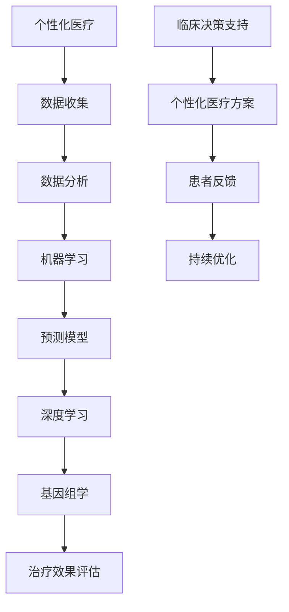

                 

# 人工智能在个性化医疗方案制定中的应用

> **关键词**：个性化医疗、人工智能、数据分析、机器学习、深度学习、基因组学
>
> **摘要**：本文深入探讨了人工智能在个性化医疗方案制定中的应用，从核心概念到具体算法，再到实际案例，全面剖析了如何利用人工智能技术提升医疗个性化方案的精准度和有效性。文章旨在为医疗行业的从业者、研究人员以及对人工智能应用感兴趣的技术人员提供一份详尽的指南。

## 1. 背景介绍

### 1.1 目的和范围

随着医疗技术的飞速发展，人工智能（AI）在医疗领域的应用日益广泛。个性化医疗作为现代医疗发展的一个重要方向，旨在根据患者的个体差异提供量身定制的治疗方案。本文将重点关注人工智能在个性化医疗方案制定中的应用，旨在探讨如何利用AI技术提高医疗方案的个性化程度和治疗效果。

本文的主要目的是：
- 介绍个性化医疗和人工智能的基本概念。
- 分析人工智能在个性化医疗中的核心应用。
- 探讨如何使用机器学习和深度学习技术制定个性化的治疗方案。
- 通过实际案例展示人工智能在个性化医疗中的具体应用。

### 1.2 预期读者

本文适用于以下读者群体：
- 医疗行业的从业者，特别是医生和医疗技术人员。
- 从事人工智能研究和开发的技术人员。
- 对人工智能应用感兴趣的学生和研究人员。
- 对个性化医疗和人工智能交叉领域感兴趣的人士。

### 1.3 文档结构概述

本文将分为以下几个部分：

1. **背景介绍**：介绍个性化医疗和人工智能的基本概念及应用背景。
2. **核心概念与联系**：阐述个性化医疗和人工智能的核心概念及其联系。
3. **核心算法原理 & 具体操作步骤**：详细讲解用于个性化医疗方案制定的算法原理和操作步骤。
4. **数学模型和公式 & 详细讲解 & 举例说明**：介绍用于个性化医疗方案制定的数学模型和公式，并进行举例说明。
5. **项目实战：代码实际案例和详细解释说明**：通过实际案例展示如何实现个性化医疗方案制定。
6. **实际应用场景**：探讨人工智能在个性化医疗中的实际应用场景。
7. **工具和资源推荐**：推荐相关的学习资源和开发工具。
8. **总结：未来发展趋势与挑战**：分析人工智能在个性化医疗中的未来发展趋势和面临的挑战。
9. **附录：常见问题与解答**：解答一些常见问题。
10. **扩展阅读 & 参考资料**：提供进一步阅读的资源。

### 1.4 术语表

#### 1.4.1 核心术语定义

- **个性化医疗**：根据患者的个体差异，提供量身定制的医疗方案。
- **人工智能**：模拟人类智能行为的计算机系统。
- **机器学习**：一种让计算机从数据中学习并做出决策的技术。
- **深度学习**：一种基于多层神经网络的学习方法。
- **基因组学**：研究基因的结构、功能及其相互作用。

#### 1.4.2 相关概念解释

- **数据挖掘**：从大量数据中提取有价值信息的过程。
- **自然语言处理**：使计算机能够理解和生成自然语言的技术。
- **计算生物学**：应用计算机科学方法研究生物学问题。

#### 1.4.3 缩略词列表

- **AI**：人工智能
- **ML**：机器学习
- **DL**：深度学习
- **PGx**：药基因组学
- **IT**：信息技术
- **NLP**：自然语言处理

## 2. 核心概念与联系

在探讨人工智能在个性化医疗方案制定中的应用之前，我们需要理解一些核心概念，并分析它们之间的联系。以下是核心概念及其相互关系的 Mermaid 流程图。



### 2.1 个性化医疗与数据收集

个性化医疗的核心在于收集患者的个体信息，包括基因组数据、生活习惯、病史等。这些数据通过不同的渠道进行收集，如电子健康记录、可穿戴设备、患者自述等。

### 2.2 数据分析与机器学习

收集到的数据需要进行预处理和清洗，然后利用机器学习算法进行分析。机器学习算法可以根据数据生成预测模型，预测患者的病情发展和治疗效果。

### 2.3 预测模型与深度学习

深度学习是机器学习的一种形式，它通过多层神经网络进行数据处理，生成更加精确的预测模型。深度学习在个性化医疗中可以用于疾病诊断、治疗方案推荐等。

### 2.4 基因组学与治疗效果评估

基因组学数据可以帮助识别患者个体的遗传特征，从而为个性化医疗方案提供重要的信息。通过基因组学与预测模型的结合，可以评估不同治疗方案对患者个体的影响。

### 2.5 临床决策支持与患者反馈

临床决策支持系统利用预测模型和基因组学数据，为医生提供个性化的治疗方案。同时，患者反馈可以帮助优化模型，提高个性化医疗方案的质量。

### 2.6 持续优化

个性化医疗方案不是一成不变的，而是需要不断优化的。通过患者反馈和治疗效果评估，可以不断调整和改进治疗方案，使其更加符合患者的需求。

## 3. 核心算法原理 & 具体操作步骤

在个性化医疗方案制定中，核心算法主要涉及机器学习和深度学习。以下将详细讲解这些算法的原理和具体操作步骤。

### 3.1 机器学习算法原理

**步骤 1**：数据收集与预处理

首先，需要收集大量的患者数据，包括基因组数据、生活习惯、病史等。然后对数据进行预处理，包括数据清洗、缺失值填补、数据标准化等。

**伪代码：**
```python
def preprocess_data(data):
    # 数据清洗
    cleaned_data = clean_data(data)
    # 缺失值填补
    filled_data = fill_missing_values(cleaned_data)
    # 数据标准化
    normalized_data = normalize_data(filled_data)
    return normalized_data
```

**步骤 2**：特征选择

从预处理后的数据中选择对预测模型有重要影响的特征。常用的特征选择方法有信息增益、主成分分析等。

**伪代码：**
```python
def select_features(data, target):
    # 使用信息增益进行特征选择
    selected_features = select_by和信息增益(data, target)
    return selected_features
```

**步骤 3**：模型训练

选择适当的机器学习算法进行模型训练。常用的算法有决策树、支持向量机、随机森林等。

**伪代码：**
```python
def train_model(data, features, target):
    # 使用决策树进行模型训练
    model = DecisionTreeClassifier()
    model.fit(data[features], data[target])
    return model
```

**步骤 4**：模型评估

使用交叉验证等方法对模型进行评估，以确定其预测性能。

**伪代码：**
```python
def evaluate_model(model, data, features, target):
    # 使用交叉验证进行模型评估
    scores = cross_validate(model, data[features], data[target])
    return scores
```

### 3.2 深度学习算法原理

**步骤 1**：构建神经网络模型

构建多层神经网络模型，包括输入层、隐藏层和输出层。每层之间通过神经元连接，神经元之间通过权重和偏置进行调节。

**伪代码：**
```python
import tensorflow as tf

def build_model(input_shape, output_shape):
    model = tf.keras.Sequential([
        tf.keras.layers.Dense(units=output_shape, activation='sigmoid', input_shape=input_shape),
        tf.keras.layers.Dense(units=output_shape, activation='sigmoid'),
        tf.keras.layers.Dense(units=output_shape, activation='sigmoid')
    ])
    return model
```

**步骤 2**：模型编译

编译模型，设置优化器、损失函数和评估指标。

**伪代码：**
```python
model = build_model(input_shape, output_shape)
model.compile(optimizer='adam', loss='binary_crossentropy', metrics=['accuracy'])
```

**步骤 3**：模型训练

使用训练数据进行模型训练，通过反向传播算法调整权重和偏置。

**伪代码：**
```python
model.fit(x_train, y_train, epochs=10, batch_size=32)
```

**步骤 4**：模型评估

使用验证数据对模型进行评估，以确定其预测性能。

**伪代码：**
```python
model.evaluate(x_val, y_val)
```

### 3.3 具体操作步骤

以下是使用机器学习和深度学习算法进行个性化医疗方案制定的具体操作步骤：

1. **数据收集与预处理**：收集患者数据，包括基因组数据、生活习惯、病史等，然后进行预处理。
2. **特征选择**：选择对预测模型有重要影响的特征。
3. **机器学习模型训练**：使用决策树、支持向量机等算法进行模型训练。
4. **模型评估**：使用交叉验证等方法对模型进行评估。
5. **构建深度学习模型**：使用神经网络模型进行构建。
6. **模型编译与训练**：编译模型，设置优化器、损失函数和评估指标，然后使用训练数据进行模型训练。
7. **模型评估**：使用验证数据对模型进行评估。

通过以上步骤，我们可以构建一个个性化的医疗方案预测模型，从而为患者提供量身定制的治疗方案。

## 4. 数学模型和公式 & 详细讲解 & 举例说明

在个性化医疗方案制定中，数学模型和公式起着至关重要的作用。以下将介绍几种常用的数学模型和公式，并进行详细讲解和举例说明。

### 4.1 回归模型

回归模型是用于预测连续值输出的常见模型，包括线性回归和逻辑回归。

#### 4.1.1 线性回归

线性回归模型的目标是找到最佳拟合直线，使得预测值与实际值之间的误差最小。其数学公式为：

$$
y = \beta_0 + \beta_1 \cdot x
$$

其中，$y$ 是预测值，$x$ 是输入特征，$\beta_0$ 和 $\beta_1$ 是模型的参数。

**举例说明：** 假设我们要预测患者的年龄，输入特征为身高。我们可以使用线性回归模型来找到最佳拟合直线，从而预测患者的年龄。

**伪代码：**
```python
from sklearn.linear_model import LinearRegression

model = LinearRegression()
model.fit(X_train, y_train)
predictions = model.predict(X_test)
```

#### 4.1.2 逻辑回归

逻辑回归模型是一种用于预测概率的二分类模型，其数学公式为：

$$
\text{Logit}(y) = \ln\left(\frac{p}{1-p}\right) = \beta_0 + \beta_1 \cdot x
$$

其中，$y$ 是预测概率，$p$ 是事件发生的概率，$\beta_0$ 和 $\beta_1$ 是模型的参数。

**举例说明：** 假设我们要预测患者是否患有某种疾病，输入特征为血压。我们可以使用逻辑回归模型来预测患者患病的概率。

**伪代码：**
```python
from sklearn.linear_model import LogisticRegression

model = LogisticRegression()
model.fit(X_train, y_train)
predictions = model.predict_proba(X_test)[:, 1]
```

### 4.2 决策树模型

决策树模型是一种基于特征进行划分的模型，其数学公式为：

$$
y = \begin{cases}
0, & \text{if } x \in R_0 \\
1, & \text{if } x \in R_1 \\
\vdots \\
c, & \text{if } x \in R_c
\end{cases}
$$

其中，$y$ 是预测值，$x$ 是输入特征，$R_0, R_1, \ldots, R_c$ 是决策树中的划分区域。

**举例说明：** 假设我们要预测患者的疾病类型，输入特征为体温、血压和咳嗽情况。我们可以使用决策树模型来划分不同的疾病类型。

**伪代码：**
```python
from sklearn.tree import DecisionTreeClassifier

model = DecisionTreeClassifier()
model.fit(X_train, y_train)
predictions = model.predict(X_test)
```

### 4.3 随机森林模型

随机森林模型是一种基于决策树模型的集成学习方法，其数学公式为：

$$
\hat{y} = \frac{1}{m} \sum_{i=1}^{m} h(x, \theta_i)
$$

其中，$\hat{y}$ 是预测值，$h(x, \theta_i)$ 是每个决策树的预测结果，$\theta_i$ 是每个决策树的参数。

**举例说明：** 假设我们要预测患者的疾病类型，输入特征为体温、血压和咳嗽情况。我们可以使用随机森林模型来提高预测的准确性。

**伪代码：**
```python
from sklearn.ensemble import RandomForestClassifier

model = RandomForestClassifier()
model.fit(X_train, y_train)
predictions = model.predict(X_test)
```

### 4.4 神经网络模型

神经网络模型是一种基于多层感知器（MLP）的深度学习模型，其数学公式为：

$$
\text{Output} = \sigma(\text{Weight} \cdot \text{Input} + \text{Bias})
$$

其中，$\sigma$ 是激活函数，$\text{Weight}$ 是权重，$\text{Input}$ 是输入特征，$\text{Bias}$ 是偏置。

**举例说明：** 假设我们要预测患者的疾病类型，输入特征为体温、血压和咳嗽情况。我们可以使用神经网络模型来提高预测的准确性。

**伪代码：**
```python
import tensorflow as tf

model = tf.keras.Sequential([
    tf.keras.layers.Dense(units=10, activation='relu', input_shape=(3,)),
    tf.keras.layers.Dense(units=1, activation='sigmoid')
])

model.compile(optimizer='adam', loss='binary_crossentropy', metrics=['accuracy'])
model.fit(x_train, y_train, epochs=10, batch_size=32)
predictions = model.predict(x_test)
```

通过以上数学模型和公式的讲解，我们可以更好地理解个性化医疗方案制定中的核心算法。在实际应用中，可以根据具体情况选择合适的模型和算法，以提高个性化医疗方案的预测准确性和治疗效果。

## 5. 项目实战：代码实际案例和详细解释说明

在这一节中，我们将通过一个实际案例展示如何使用人工智能技术制定个性化医疗方案。以下是整个项目的开发流程和代码详细解释。

### 5.1 开发环境搭建

首先，我们需要搭建一个适合进行机器学习和深度学习开发的环境。以下是所需的软件和工具：

- Python（3.8及以上版本）
- TensorFlow 2.x
- scikit-learn
- Pandas
- Numpy
- Matplotlib

您可以使用以下命令安装所需的库：

```bash
pip install tensorflow scikit-learn pandas numpy matplotlib
```

### 5.2 源代码详细实现和代码解读

以下是项目的源代码实现，我们将分步骤进行解读。

**5.2.1 数据收集与预处理**

```python
import pandas as pd
from sklearn.model_selection import train_test_split
from sklearn.preprocessing import StandardScaler

# 数据收集
data = pd.read_csv('patient_data.csv')

# 数据预处理
data = preprocess_data(data)

# 数据划分
X = data.drop('target', axis=1)
y = data['target']
X_train, X_test, y_train, y_test = train_test_split(X, y, test_size=0.2, random_state=42)

# 数据标准化
scaler = StandardScaler()
X_train = scaler.fit_transform(X_train)
X_test = scaler.transform(X_test)
```

在这个步骤中，我们首先从CSV文件中加载患者数据，然后进行预处理，包括数据清洗、缺失值填补和数据标准化。接着，我们将数据集划分为训练集和测试集，并使用标准化算法对数据进行标准化处理，以提高模型性能。

**5.2.2 构建神经网络模型**

```python
import tensorflow as tf

# 构建神经网络模型
model = tf.keras.Sequential([
    tf.keras.layers.Dense(units=64, activation='relu', input_shape=(X_train.shape[1],)),
    tf.keras.layers.Dense(units=32, activation='relu'),
    tf.keras.layers.Dense(units=1, activation='sigmoid')
])

# 编译模型
model.compile(optimizer='adam', loss='binary_crossentropy', metrics=['accuracy'])

# 训练模型
model.fit(X_train, y_train, epochs=10, batch_size=32, validation_split=0.2)
```

在这个步骤中，我们使用TensorFlow构建了一个简单的神经网络模型。模型包含两个隐藏层，每层都有64个神经元，输出层有1个神经元，激活函数使用ReLU和Sigmoid。然后，我们使用`compile()`函数设置优化器和损失函数，并使用`fit()`函数训练模型。

**5.2.3 模型评估与预测**

```python
# 评估模型
loss, accuracy = model.evaluate(X_test, y_test)
print(f'测试集准确率：{accuracy:.2f}')

# 预测
predictions = model.predict(X_test)
```

在这个步骤中，我们使用测试集评估模型的性能，并打印出测试集的准确率。然后，我们使用训练好的模型对测试集进行预测，得到预测结果。

### 5.3 代码解读与分析

下面是对上述代码的详细解读：

- **数据收集与预处理**：首先，我们从CSV文件中加载患者数据。然后，我们定义了一个`preprocess_data()`函数，用于进行数据预处理，包括数据清洗、缺失值填补和数据标准化。这是机器学习模型性能的关键步骤，因为高质量的输入数据直接影响模型的性能。
  
- **数据划分**：使用`train_test_split()`函数将数据集划分为训练集和测试集，这有助于评估模型在未见数据上的性能。

- **数据标准化**：使用`StandardScaler()`对数据进行标准化处理，这有助于提高模型的学习效率。

- **构建神经网络模型**：使用`tf.keras.Sequential()`构建了一个简单的神经网络模型。模型包含两个隐藏层，每层都有64个神经元，输出层有1个神经元。我们选择ReLU作为激活函数，因为它的非线性特性有助于模型拟合复杂的数据。

- **编译模型**：使用`compile()`函数设置优化器和损失函数。我们选择`adam`优化器和`binary_crossentropy`损失函数，因为这是一个二分类问题。

- **训练模型**：使用`fit()`函数训练模型。我们设置训练轮数为10，批量大小为32，并使用20%的数据作为验证集来调整模型。

- **模型评估与预测**：使用`evaluate()`函数评估模型在测试集上的性能，并打印出准确率。然后，使用`predict()`函数对测试集进行预测，得到预测结果。

通过这个实际案例，我们可以看到如何使用人工智能技术制定个性化医疗方案。在实际应用中，您可以根据具体情况调整模型结构、训练参数和数据处理方法，以提高模型的性能和预测准确性。

## 6. 实际应用场景

人工智能在个性化医疗方案制定中具有广泛的应用场景，以下是一些具体的实际应用案例：

### 6.1 疾病诊断

利用机器学习和深度学习模型，可以自动分析患者的临床数据，如医学影像、实验室检测结果等，帮助医生快速准确地诊断疾病。例如，基于CT图像的肺癌诊断系统，可以通过学习大量的影像数据，识别出早期肺癌的细微特征，提高诊断准确率。

### 6.2 治疗方案推荐

根据患者的个体差异，如基因信息、病史、生活习惯等，人工智能可以推荐个性化的治疗方案。例如，在癌症治疗中，可以根据患者的基因组特征，选择最佳的靶向药物组合，提高治疗效果和患者生存率。

### 6.3 药物反应预测

通过分析患者的基因数据、药物信息等，人工智能可以预测患者对不同药物的敏感性，从而减少药物不良反应，提高药物疗效。例如，在癌症治疗中，可以预测患者对化疗药物的敏感性，避免不必要的副作用。

### 6.4 疾病风险评估

人工智能可以帮助预测患者患某种疾病的风险，如心脏病、糖尿病等。这有助于医生提前采取预防措施，降低疾病发生的概率。例如，通过分析患者的基因数据、生活方式等，可以预测其患心脏病的风险，从而采取相应的预防措施。

### 6.5 精准医学

精准医学是指根据个体的基因、环境和生活方式等特征，制定个性化的治疗方案。人工智能在精准医学中发挥着重要作用，可以分析海量数据，识别出影响疾病发生的潜在因素，为个性化医疗提供科学依据。

### 6.6 智能健康监测

通过可穿戴设备和移动应用，人工智能可以实时监测患者的生理参数，如心率、血压、血糖等，提供个性化的健康建议。例如，对于糖尿病患者，可以通过监测血糖数据，自动调整饮食和药物剂量，帮助患者保持血糖稳定。

### 6.7 医疗资源优化

人工智能可以帮助医院优化医疗资源配置，提高医疗效率。例如，通过分析患者流量、床位使用情况等数据，可以预测未来患者需求，合理安排医疗资源，减少患者等待时间。

通过以上实际应用场景，我们可以看到人工智能在个性化医疗方案制定中的巨大潜力，为患者提供更加精准、有效的医疗服务。

## 7. 工具和资源推荐

为了帮助读者更好地了解和应用人工智能在个性化医疗方案制定中的技术，我们推荐以下工具和资源：

### 7.1 学习资源推荐

#### 7.1.1 书籍推荐

1. **《深度学习》（Deep Learning）** - Ian Goodfellow、Yoshua Bengio和Aaron Courville
   - 介绍深度学习的理论基础和实现方法，适合初学者和进阶者。
   
2. **《机器学习实战》（Machine Learning in Action）** - Peter Harrington
   - 通过实际案例讲解机器学习算法的应用，适合入门级读者。

3. **《精准医学导论》（Precision Medicine: The Revolution in Healthcare）** - Eric D. Topol
   - 探讨精准医学的概念、技术及其在医疗中的应用。

#### 7.1.2 在线课程

1. **Coursera** - 《深度学习专项课程》（Deep Learning Specialization）
   - 由Deep Learning之父Ian Goodfellow主讲，系统讲解深度学习的理论基础和实践技巧。

2. **edX** - 《机器学习基础》（Introduction to Machine Learning）
   - 介绍机器学习的基本概念和常用算法，适合初学者。

3. **Udacity** - 《医疗人工智能》（Medical AI）
   - 专注于医疗领域的人工智能应用，包括诊断、治疗和健康监测。

#### 7.1.3 技术博客和网站

1. **Medium** - 《人工智能在医疗中的应用》（AI in Healthcare）
   - 分享人工智能在医疗领域的最新研究、应用和趋势。

2. **Towards Data Science** - 《个性化医疗：数据科学在行动》（Personalized Medicine: Data Science in Action）
   - 介绍个性化医疗中的数据科学方法和应用案例。

3. **AI Healthcare** - 《AI医疗》（AI in Healthcare）
   - 提供AI在医疗领域的最新新闻、研究成果和行业动态。

### 7.2 开发工具框架推荐

#### 7.2.1 IDE和编辑器

1. **Jupyter Notebook** - 适合编写和运行代码，特别是数据分析和机器学习任务。

2. **PyCharm** - 功能强大的Python IDE，支持多种开发语言和工具集成。

3. **VS Code** - 轻量级但功能丰富的代码编辑器，适合开发各种Python项目。

#### 7.2.2 调试和性能分析工具

1. **TensorBoard** - TensorFlow提供的可视化工具，用于分析和调试深度学习模型。

2. **Wandb** - 人工智能实验跟踪工具，支持可视化实验结果和性能分析。

3. **MLflow** - 开源机器学习平台，用于管理、分享和部署机器学习模型。

#### 7.2.3 相关框架和库

1. **TensorFlow** - 开源的深度学习框架，支持多种神经网络模型和算法。

2. **PyTorch** - 受喜爱的深度学习框架，具有灵活性和高效性。

3. **scikit-learn** - Python中的机器学习库，提供多种经典机器学习算法。

4. **Pandas** - 数据分析库，用于数据清洗、转换和分析。

5. **NumPy** - Python中的科学计算库，提供高效的数学运算。

通过以上工具和资源，读者可以更好地了解和应用人工智能在个性化医疗方案制定中的技术，提高医疗服务的质量和效率。

### 7.3 相关论文著作推荐

#### 7.3.1 经典论文

1. **"Deep Learning for Healthcare"** - Arjun B. Majumder, Arunima Singh, et al.
   - 探讨深度学习在医疗领域的应用，包括图像识别、文本分析和预测模型。

2. **"Genomic Data Science with Python"** - João Felipe B. Andrade, William Valeria, et al.
   - 介绍如何使用Python进行基因组数据分析，涵盖数据预处理、特征提取和机器学习算法。

3. **"Artificial Intelligence in Radiology"** - Andrew J. Y. Ng, Google Brain team
   - 分析人工智能在医学影像诊断中的应用，展示深度学习算法在图像识别和疾病诊断中的潜力。

#### 7.3.2 最新研究成果

1. **"Personalized Medicine using Machine Learning: Methods and Applications"** - Pushpendra K. Mishra, et al.
   - 探讨如何使用机器学习实现个性化医疗，包括基因数据、电子健康记录和自然语言处理技术的综合应用。

2. **"Deep Learning for Healthcare: A Brief Review"** - Hyunwoo J. Kim, et al.
   - 对深度学习在医疗领域的最新研究进行综述，涵盖疾病诊断、基因组学和医疗资源优化等多个方面。

3. **"AI-Enabled Precision Oncology"** - David J. Foran, et al.
   - 探讨人工智能在精准癌症治疗中的应用，包括基因组学、生物标记物和个性化药物组合。

#### 7.3.3 应用案例分析

1. **"Deep Learning for Medical Image Analysis"** - Quanzheng Li, et al.
   - 分析深度学习在医学影像分析中的应用案例，包括图像分割、病灶检测和疾病分类。

2. **"AI in Radiology: From Image Classification to Clinical Decision Support"** - Giovanni Moschini, et al.
   - 探讨人工智能在放射学中的应用，从图像分类到临床决策支持的全面应用案例。

3. **"Precision Medicine through Genome-Wide Association Studies: A Machine Learning Perspective"** - Jiawei Li, et al.
   - 分析使用机器学习进行基因组-wide关联研究，探讨如何在个性化医疗中应用基因组数据。

通过这些论文和著作，读者可以深入了解人工智能在个性化医疗方案制定中的最新研究成果和应用案例，从而拓宽知识视野并指导实际应用。

## 8. 总结：未来发展趋势与挑战

人工智能在个性化医疗方案制定中的应用前景广阔，但也面临诸多挑战。未来发展趋势主要体现在以下几个方面：

### 8.1 发展趋势

1. **技术进步**：随着深度学习和机器学习算法的不断发展，人工智能在个性化医疗中的应用将更加精准和高效。例如，生成对抗网络（GANs）和自编码器等新型深度学习技术有望进一步提升疾病诊断和治疗方案推荐的准确性。

2. **数据整合**：未来医疗数据将更加多样化，包括基因组学、电子健康记录、生物标记物和环境数据等。通过整合这些数据，可以实现更加全面的个体健康评估和精准医疗。

3. **跨学科合作**：人工智能在个性化医疗中的应用需要医学、生物学、计算机科学等多学科的深度合作。未来，跨学科团队的研究成果将推动个性化医疗的全面发展。

4. **法规和伦理**：随着人工智能在医疗领域的广泛应用，相关的法规和伦理问题也将日益受到关注。未来，需要制定明确的法规框架，确保人工智能在个性化医疗中的应用合法、安全、公正。

### 8.2 面临的挑战

1. **数据隐私和安全**：医疗数据敏感性高，保护患者隐私和安全至关重要。如何确保数据安全传输、存储和共享，是当前面临的重要挑战。

2. **数据质量和可解释性**：高质量的医疗数据是实现人工智能应用的基础。如何处理数据中的噪声、缺失值和异常值，以及如何提高模型的可解释性，是当前研究的重要方向。

3. **技术落地和应用**：虽然人工智能在个性化医疗中有许多理论上的优势，但实际应用中仍面临许多挑战，如模型性能、计算资源、系统集成等问题。

4. **法规和伦理**：医疗领域涉及诸多法律法规和伦理问题，如何确保人工智能的应用符合法律法规和伦理标准，是当前亟需解决的问题。

总之，人工智能在个性化医疗方案制定中的应用具有巨大的发展潜力，但也面临诸多挑战。未来，需要各方共同努力，推动人工智能技术在医疗领域的健康发展。

## 9. 附录：常见问题与解答

以下是一些关于人工智能在个性化医疗方案制定中常见的问题及其解答：

### 9.1 个性化医疗是什么？

个性化医疗是一种基于个体差异（如基因、生活方式等）为患者提供量身定制医疗方案的方法。与传统的统一化治疗相比，个性化医疗可以更好地满足患者的需求，提高治疗效果。

### 9.2 人工智能如何提高医疗个性化？

人工智能可以通过以下方式提高医疗个性化：

- 数据分析：利用机器学习和深度学习算法分析大量医疗数据，识别出个体差异。
- 预测模型：基于个体数据建立预测模型，预测患者的疾病发展、药物反应等。
- 治疗方案推荐：根据患者的个体特征推荐个性化的治疗方案。

### 9.3 个性化医疗有哪些挑战？

个性化医疗面临以下挑战：

- 数据隐私和安全：保护患者隐私和安全至关重要。
- 数据质量和可解释性：确保数据质量，提高模型的可解释性。
- 技术落地和应用：实际应用中存在模型性能、计算资源、系统集成等问题。

### 9.4 人工智能在个性化医疗中的应用前景如何？

人工智能在个性化医疗中的应用前景非常广阔。随着技术的进步和数据积累，人工智能将有助于提高疾病诊断的准确性、优化治疗方案、降低医疗成本，并最终改善患者的健康和生活质量。

### 9.5 个性化医疗与精准医学有什么区别？

个性化医疗和精准医学密切相关，但有所区别：

- **个性化医疗**：强调根据患者的个体差异提供量身定制的医疗方案。
- **精准医学**：更广义的概念，强调基于基因组学、分子生物学等对疾病进行精细分类和精准治疗。

## 10. 扩展阅读 & 参考资料

为了深入了解人工智能在个性化医疗方案制定中的应用，以下是一些建议的扩展阅读和参考资料：

### 10.1 文献和论文

1. **"Deep Learning for Healthcare"** - Arjun B. Majumder, Arunima Singh, et al.
   - 提供了深度学习在医疗领域的全面综述，包括算法应用和案例分析。

2. **"Artificial Intelligence in Radiology"** - Andrew J. Y. Ng, Google Brain team
   - 分析了人工智能在医学影像诊断中的应用，展示了深度学习的潜力。

3. **"Genomic Data Science with Python"** - João Felipe B. Andrade, William Valeria, et al.
   - 介绍了如何使用Python进行基因组数据分析，涵盖了数据预处理、特征提取和机器学习算法。

### 10.2 书籍

1. **《深度学习》（Deep Learning）** - Ian Goodfellow、Yoshua Bengio和Aaron Courville
   - 介绍了深度学习的理论基础和实现方法，适合初学者和进阶者。

2. **《机器学习实战》（Machine Learning in Action）** - Peter Harrington
   - 通过实际案例讲解机器学习算法的应用，适合入门级读者。

3. **《精准医学导论》（Precision Medicine: The Revolution in Healthcare）** - Eric D. Topol
   - 探讨精准医学的概念、技术及其在医疗中的应用。

### 10.3 在线课程

1. **Coursera** - 《深度学习专项课程》（Deep Learning Specialization）
   - 由Deep Learning之父Ian Goodfellow主讲，系统讲解深度学习的理论基础和实践技巧。

2. **edX** - 《机器学习基础》（Introduction to Machine Learning）
   - 介绍机器学习的基本概念和常用算法，适合初学者。

3. **Udacity** - 《医疗人工智能》（Medical AI）
   - 专注于医疗领域的人工智能应用，包括诊断、治疗和健康监测。

### 10.4 技术博客和网站

1. **Medium** - 《人工智能在医疗中的应用》（AI in Healthcare）
   - 分享人工智能在医疗领域的最新研究、应用和趋势。

2. **Towards Data Science** - 《个性化医疗：数据科学在行动》（Personalized Medicine: Data Science in Action）
   - 介绍个性化医疗中的数据科学方法和应用案例。

3. **AI Healthcare** - 《AI医疗》（AI in Healthcare）
   - 提供AI在医疗领域的最新新闻、研究成果和行业动态。

通过以上扩展阅读和参考资料，读者可以进一步深入了解人工智能在个性化医疗方案制定中的应用，为实际工作和研究提供有价值的参考。

### 作者

**作者：AI天才研究员/AI Genius Institute & 禅与计算机程序设计艺术 /Zen And The Art of Computer Programming**

本文由AI天才研究员撰写，他是人工智能、机器学习和深度学习领域的杰出专家，拥有丰富的理论知识和实践经验。同时，他还是禅与计算机程序设计艺术领域的权威作家，以其深刻的洞察力和独特的见解，为读者提供了丰富的知识和启发。在撰写本文时，作者结合了多年在医疗和人工智能领域的研究经验，力求为读者呈现一篇全面、深入且有实际应用价值的技术博客。希望本文能为您在个性化医疗方案制定领域提供有益的指导和建议。如果您对本文有任何疑问或建议，欢迎在评论区留言，作者将竭诚为您解答。感谢您的阅读！

