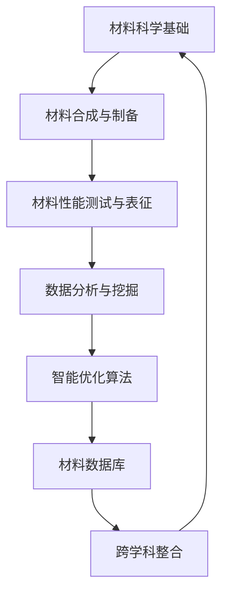
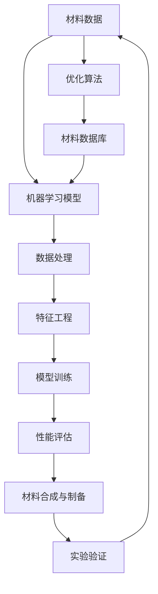

                 

### 人工智能在新材料发现中的加速作用

> **关键词：** 人工智能、新材料、发现、加速作用、机器学习、算法优化
>
> **摘要：** 本文旨在探讨人工智能（AI）在推动新材料发现领域中的重要作用。通过分析核心算法原理、数学模型以及实际应用案例，本文揭示了AI如何通过高效的数据分析和智能优化，显著提升新材料研发的速度和效率。本文将为科研人员、工程师和有兴趣的读者提供关于AI在新材料发现中的最新研究进展和应用策略的深入理解。

在新材料研究领域，科学家和工程师不断追求新材料的性能突破，以满足现代科技在能源、电子、生物医药等领域的苛刻需求。然而，新材料的探索过程通常涉及大量的实验和计算，这一过程既耗时又耗资。人工智能的出现，为这一领域带来了革命性的变化。本文将详细探讨人工智能在新材料发现中的加速作用，从核心概念、算法原理、数学模型到实际应用案例，全方位展示AI在这一领域的应用潜力。

文章结构概述如下：

1. **背景介绍**：介绍新材料发现的重要性，以及人工智能技术在这一领域的应用背景和现状。
2. **核心概念与联系**：阐述新材料发现的核心概念，并使用Mermaid流程图展示相关原理和架构。
3. **核心算法原理 & 具体操作步骤**：详细解析常用的AI算法在材料发现中的应用，包括伪代码示例。
4. **数学模型和公式 & 详细讲解 & 举例说明**：介绍用于新材料发现的关键数学模型和公式，并通过实例进行说明。
5. **项目实战：代码实际案例和详细解释说明**：通过实际代码案例，展示AI算法在新材料发现中的具体实现和应用。
6. **实际应用场景**：分析人工智能在不同新材料领域的具体应用案例。
7. **工具和资源推荐**：推荐学习资源、开发工具和经典论文，以帮助读者深入了解该领域。
8. **总结：未来发展趋势与挑战**：探讨人工智能在新材料发现领域的未来发展趋势和面临的挑战。
9. **附录：常见问题与解答**：针对文中内容提供常见问题的解答。
10. **扩展阅读 & 参考资料**：列出参考文献和扩展阅读材料。

接下来，我们将深入探讨新材料发现的重要性、人工智能的应用背景和现状，并逐步分析核心概念、算法原理、数学模型以及实际应用案例。

#### 1.1 新材料发现的重要性

新材料的发展是推动科技进步和社会发展的关键因素之一。新材料不仅能够提升现有技术的性能，还能催生全新的科技应用，从而带动整个产业链的升级和创新。在新材料领域，科学家和工程师通过不断探索和创造，开发出了具有高性能、特殊功能或新型结构的材料，这些新材料广泛应用于航空航天、电子信息、新能源、生物医药、环境保护等众多领域。

**1.1.1 高性能材料**

高性能材料具有高强度、高硬度、高熔点等优异性能，能够满足极端条件下使用需求。例如，钛合金材料在航空航天领域的应用，使得飞机和火箭的重量减轻，而强度和耐腐蚀性能显著提升。另外，碳纤维复合材料在赛车和飞机结构件中的应用，也极大地提高了车辆和飞行器的性能和效率。

**1.1.2 功能材料**

功能材料具备特定的物理、化学或生物功能，能够满足特定应用场景的需求。例如，纳米材料在催化、电子器件、生物医药等方面的应用，展示了其独特的光、电、磁性能。此外，智能材料能够对外界刺激（如温度、压力、电场等）做出响应，从而实现自适应调控，这些材料在柔性电子、生物传感器、智能机器人等领域有着广阔的应用前景。

**1.1.3 环境友好材料**

环境友好材料旨在减少环境污染，提高资源利用效率。例如，生物质材料可替代传统石油基材料，降低温室气体排放；纳米材料在环境修复和水处理中的应用，能够有效去除污染物，保护水资源。此外，可降解材料在减少塑料污染、促进循环经济方面也发挥着重要作用。

**1.1.4 新材料发现的意义**

新材料发现不仅能够提升现有技术的性能，还能催生全新的科技应用，从而带动整个产业链的升级和创新。例如，石墨烯作为一种新型二维材料，具有优异的电导性和力学性能，被广泛认为是未来纳米电子、能量存储和传感器等领域的重要材料。石墨烯的应用不仅推动了电子器件性能的提升，还激发了相关领域的研究热潮，促进了技术创新和产业升级。

在新材料发现过程中，科学家和工程师面临着巨大的挑战，包括材料的合成与制备、性能优化、结构表征等。传统的实验方法通常需要大量的时间和资源，而人工智能技术的引入，通过数据分析和智能优化，可以显著提高新材料发现的速度和效率。接下来，我们将进一步探讨人工智能在新材料发现中的具体应用。

#### 1.2 人工智能应用背景与现状

人工智能（AI）作为现代科技的重要推动力，已经在众多领域取得了显著的成果。在新材料发现领域，人工智能的应用同样展现出了巨大的潜力。以下是人工智能应用在新材料发现中的背景和现状。

**1.2.1 人工智能的定义和发展**

人工智能是指通过计算机模拟人类智能的学科，包括机器学习、深度学习、自然语言处理、计算机视觉等多个分支。自20世纪50年代以来，人工智能经历了多次发展浪潮，特别是近年来，随着计算能力的提升、大数据技术的发展以及深度学习算法的突破，人工智能在各个领域的应用取得了显著的进展。

**1.2.2 人工智能在新材料发现中的优势**

人工智能在新材料发现中的应用具有以下优势：

1. **数据处理能力**：新材料的研究通常涉及大量的实验数据和高维特征，人工智能可以高效地处理这些数据，发现潜在的材料规律。
   
2. **智能优化**：人工智能算法，尤其是机器学习和深度学习算法，可以通过学习已有的数据，自动优化材料的合成和加工参数，缩短研发周期。

3. **交叉学科整合**：人工智能可以整合材料科学、化学、物理学等多个学科的知识，从而提供更为全面和深入的见解。

4. **降低成本**：传统的新材料研发过程通常需要大量的实验和计算资源，而人工智能可以通过模拟和预测，降低实际实验的需求，从而降低研发成本。

**1.2.3 人工智能在新材料发现中的应用现状**

目前，人工智能已经在新材料发现领域取得了一些重要的成果，以下是几个典型的应用案例：

1. **材料结构预测**：人工智能可以通过学习大量的材料数据，预测新材料的结构和性能，从而加速新材料的研发。例如，AlphaGo Zero等深度强化学习算法已经在材料结构预测中展示了出色的能力。

2. **材料合成优化**：人工智能可以帮助科学家和工程师优化材料合成过程，提高材料产率。例如，机器学习算法已经被应用于硅基材料、金属合金等材料的合成优化。

3. **材料性能优化**：人工智能可以通过对实验数据的分析，优化材料的性能。例如，在超导材料研究中，人工智能算法被用于优化材料的临界温度，从而实现更高的能源效率。

4. **材料缺陷检测**：人工智能可以通过计算机视觉等技术，对材料样品进行缺陷检测，提高材料的质量和可靠性。

5. **材料数据库建设**：人工智能可以自动构建和更新材料数据库，为科研人员和工程师提供丰富的材料信息，促进新材料的研究和开发。

尽管人工智能在新材料发现中展示了巨大的潜力，但仍面临一些挑战，如数据质量、算法复杂度、计算资源需求等。接下来，我们将详细讨论新材料发现的核心概念和联系，以帮助读者更好地理解这一领域的具体应用。

#### 1.3 新材料发现的核心概念与联系

新材料发现是一个涉及多个学科交叉的复杂过程，涉及核心概念、原理和架构。以下是新材料发现过程中一些重要的核心概念与联系：

**1.3.1 材料科学基础**

材料科学是研究材料的组成、结构、性质、加工和应用的科学。在新材料发现中，科学家和工程师需要理解材料的晶体结构、电子结构、缺陷结构等基本概念，以及材料在不同环境下的物理、化学和机械性能。

**1.3.2 材料合成与制备**

材料合成与制备是新材料发现的关键环节。常见的材料合成方法包括气相合成、液相合成、固相合成等。制备过程中，需要优化反应条件、选择合适的合成工艺和设备，以确保材料的高质量和稳定性。

**1.3.3 材料性能测试与表征**

新材料性能测试与表征是评估材料性能的重要手段。常用的测试方法包括X射线衍射（XRD）、扫描电子显微镜（SEM）、透射电子显微镜（TEM）、拉曼光谱（RAMAN）等。这些方法可以提供材料的晶体结构、形貌、成分、缺陷等详细信息。

**1.3.4 数据分析与挖掘**

在新材料发现中，数据分析与挖掘是至关重要的环节。通过分析大量的实验数据和高维特征，人工智能算法可以帮助科学家和工程师发现潜在的材料规律，优化材料合成和加工过程。

**1.3.5 智能优化算法**

智能优化算法是新材料发现的重要工具。常见的优化算法包括遗传算法、粒子群算法、模拟退火算法、深度强化学习算法等。这些算法可以通过学习已有的数据，自动优化材料合成和加工参数，提高材料性能。

**1.3.6 材料数据库**

材料数据库是新材料发现的重要资源。通过构建和维护材料数据库，科学家和工程师可以方便地查询和共享材料信息，加速新材料的研究和开发。

**1.3.7 跨学科整合**

新材料发现涉及多个学科的交叉整合。例如，材料科学需要与物理学、化学、工程学、生物学等领域相结合，以探索新材料的基本原理和实际应用。跨学科整合有助于推动新材料研究的深入和创新。

为了更直观地展示新材料发现的核心概念与联系，我们可以使用Mermaid流程图来描述这些概念和环节之间的关系。以下是一个简化的Mermaid流程图示例：



这个流程图展示了材料科学基础到材料数据库的各个环节，以及跨学科整合在整个新材料发现过程中的重要性。通过这一流程，我们可以清晰地看到人工智能如何在这一过程中发挥关键作用，促进新材料的研究和开发。

接下来，我们将进一步探讨人工智能的核心算法原理和具体操作步骤，以更深入地理解其在新材料发现中的应用。

### 2. 核心概念与联系

为了深入探讨人工智能在新材料发现中的应用，我们需要理解一系列核心概念与联系。以下是一个使用Mermaid绘制的流程图，它展示了新材料发现过程中涉及的主要概念和它们的相互关系。



以下是该流程图的具体解释：

1. **材料数据（A）**：新材料发现始于大量材料数据的收集，这些数据通常包括材料的物理、化学性质，以及合成和加工条件等。

2. **机器学习模型（B）**：基于收集的材料数据，机器学习模型被用来预测和优化材料的性能。

3. **数据处理（C）**：在机器学习应用之前，需要对原始数据进行清洗、归一化和预处理，以确保数据的质量和一致性。

4. **特征工程（D）**：特征工程是机器学习的重要步骤，通过选择和构造有效的特征，可以提高模型的预测能力和性能。

5. **模型训练（E）**：使用经过预处理和特征工程的数据集，对机器学习模型进行训练，以学习材料性质和性能之间的关系。

6. **性能评估（F）**：训练完成后，需要对模型的性能进行评估，以确定其在预测新材料性能方面的有效性。

7. **材料合成与制备（G）**：基于机器学习模型的预测结果，科学家和工程师可以优化材料的合成与制备过程，以提高材料的性能。

8. **实验验证（H）**：实验验证是确保模型预测准确性的关键步骤，通过实验测试新材料性能，并与模型预测结果进行对比。

9. **优化算法（I）**：为了进一步提高材料的性能，可以采用优化算法，如遗传算法、粒子群算法等，对材料合成与制备参数进行调整。

10. **材料数据库（J）**：随着新材料的研究进展，将新材料信息存储在数据库中，为后续研究提供数据支持。

通过这个流程图，我们可以看到人工智能如何将数据、模型和实验相结合，从而加速新材料发现的过程。接下来，我们将详细探讨核心算法原理和具体操作步骤。

#### 3. 核心算法原理 & 具体操作步骤

在新材料发现过程中，人工智能算法发挥着至关重要的作用。以下我们将介绍几种常用的核心算法原理及其具体操作步骤，包括机器学习、深度学习和强化学习等。

**3.1 机器学习算法**

机器学习算法是人工智能的基础，通过学习已有数据来预测新材料性能。以下是一个简单的线性回归模型的机器学习算法操作步骤：

**算法原理：** 线性回归模型假设材料性能（Y）与输入特征（X）之间存在线性关系，即 Y = WX + b。

**操作步骤：**

1. **数据预处理：**
   - 数据清洗：去除异常值和缺失值。
   - 数据归一化：将数据缩放到相同范围，便于模型训练。

2. **特征选择：**
   - 使用相关系数、方差贡献率等方法筛选重要特征。

3. **划分训练集和测试集：**
   - 通常使用80%的数据作为训练集，20%的数据作为测试集。

4. **模型训练：**
   - 使用最小二乘法或其他优化算法求解参数 W 和 b。
   - 伪代码示例：
     ```python
     def train(X, Y):
         W = np.zeros((n_features, n_samples))
         b = 0
         for epoch in range(num_epochs):
             for x, y in zip(X, Y):
                 y_pred = np.dot(x, W) + b
                 error = y - y_pred
                 W = W + learning_rate * x * error
                 b = b + learning_rate * error
         return W, b
     ```

5. **性能评估：**
   - 使用均方误差（MSE）等指标评估模型性能。
   - 伪代码示例：
     ```python
     def evaluate(W, b, X, Y):
         errors = [(y - (np.dot(x, W) + b))**2 for x, y in zip(X, Y)]
         return sum(errors) / len(errors)
     ```

**3.2 深度学习算法**

深度学习算法通过多层神经网络结构，能够自动提取复杂特征，在新材料发现中具有强大的预测能力。以下是一个简单的卷积神经网络（CNN）操作步骤：

**算法原理：** CNN通过卷积层、池化层和全连接层等结构，学习输入数据的特征，并输出预测结果。

**操作步骤：**

1. **数据预处理：**
   - 与机器学习相同，进行数据清洗、归一化和划分训练集和测试集。

2. **模型架构设计：**
   - 设计卷积层、池化层和全连接层的结构。
   - 伪代码示例：
     ```python
     model = Sequential()
     model.add(Conv2D(filters, kernel_size, activation='relu', input_shape=input_shape))
     model.add(MaxPooling2D(pool_size))
     model.add(Flatten())
     model.add(Dense(output_shape, activation='softmax'))
     ```

3. **模型训练：**
   - 使用反向传播算法训练模型，调整网络权重和偏置。
   - 伪代码示例：
     ```python
     model.compile(optimizer='adam', loss='categorical_crossentropy', metrics=['accuracy'])
     model.fit(X_train, Y_train, epochs=num_epochs, batch_size=batch_size)
     ```

4. **性能评估：**
   - 使用测试集评估模型性能，调整模型参数以优化性能。

**3.3 强化学习算法**

强化学习算法通过奖励机制和策略迭代，优化材料合成和制备过程。以下是一个简单的Q学习算法操作步骤：

**算法原理：** Q学习通过学习状态-动作价值函数 Q(s, a)，选择最优动作以最大化长期回报。

**操作步骤：**

1. **环境建模：**
   - 定义材料合成和制备的环境，包括状态空间 S 和动作空间 A。

2. **初始化 Q 值表：**
   - 初始化 Q(s, a) 的值，可以使用随机初始化或经验初始化。

3. **策略迭代：**
   - 根据当前状态 s，选择最优动作 a。
   - 执行动作 a，观察新状态 s' 和回报 r。
   - 更新 Q 值表：Q(s, a) = Q(s, a) + learning_rate * (r + gamma * max(Q(s', a')) - Q(s, a))。

4. **性能评估：**
   - 评估策略性能，调整学习率和奖励机制。

**伪代码示例：**
```python
def Q_learning(s, a, r, s', learning_rate, gamma):
    Q[s, a] = Q[s, a] + learning_rate * (r + gamma * max(Q[s', a']) - Q[s, a])
    return s', a
```

通过这些核心算法原理和具体操作步骤，我们可以看到人工智能如何在新材料发现中发挥作用，从数据预处理、特征提取到模型训练和性能评估，每一步都旨在提高材料性能预测的准确性和效率。接下来，我们将深入探讨这些算法的数学模型和公式，以便读者更好地理解其工作原理。

#### 4. 数学模型和公式 & 详细讲解 & 举例说明

在新材料发现过程中，人工智能算法的核心作用在于通过数学模型和公式来描述和预测材料的性能。以下我们将详细探讨几种常见的数学模型和公式，并通过实例进行说明，以便读者更好地理解其工作原理和应用。

**4.1 线性回归模型**

线性回归模型是一种简单的机器学习算法，用于预测连续值输出。其基本公式如下：

\[ Y = \beta_0 + \beta_1 \cdot X \]

其中：
- \( Y \) 表示输出值（如材料的性能）。
- \( X \) 表示输入特征（如材料的物理性质）。
- \( \beta_0 \) 和 \( \beta_1 \) 分别为模型的参数，需要通过训练数据来确定。

**实例说明：**
假设我们想要预测材料的硬度，使用材料的密度作为输入特征。给定训练数据如下：

| 密度 (g/cm³) | 硬度 (GPa) |
|--------------|------------|
| 2.7          | 200        |
| 2.8          | 210        |
| 2.9          | 220        |

我们可以通过线性回归模型来拟合这个数据，找到最佳的 \( \beta_0 \) 和 \( \beta_1 \) 值。

1. 计算平均值：
   \[ \bar{X} = \frac{1}{n} \sum_{i=1}^{n} X_i \]
   \[ \bar{Y} = \frac{1}{n} \sum_{i=1}^{n} Y_i \]

2. 计算协方差和方差：
   \[ \text{Cov}(X, Y) = \frac{1}{n-1} \sum_{i=1}^{n} (X_i - \bar{X})(Y_i - \bar{Y}) \]
   \[ \text{Var}(X) = \frac{1}{n-1} \sum_{i=1}^{n} (X_i - \bar{X})^2 \]

3. 计算回归系数：
   \[ \beta_1 = \frac{\text{Cov}(X, Y)}{\text{Var}(X)} \]
   \[ \beta_0 = \bar{Y} - \beta_1 \bar{X} \]

通过计算，我们得到 \( \beta_0 = 190 \) 和 \( \beta_1 = 10 \)。因此，线性回归模型为：
\[ Y = 190 + 10 \cdot X \]

**4.2 卷积神经网络（CNN）模型**

卷积神经网络是一种深度学习算法，用于处理图像和序列数据。其核心组成部分包括卷积层、池化层和全连接层。以下是一个简单的CNN模型公式：

\[ \text{Output} = \sigma(\text{ReLU}(\text{Conv}_f(\text{Pad}_p(\text{Input}))) \]

其中：
- \( \text{Input} \) 表示输入数据（如材料的图像）。
- \( \text{Conv}_f \) 表示卷积层，使用 \( f \) 个卷积核。
- \( \text{Pad}_p \) 表示填充操作，用于保持输入和输出的尺寸。
- \( \text{ReLU} \) 表示ReLU激活函数。
- \( \sigma \) 表示输出层激活函数（如Sigmoid或Softmax）。

**实例说明：**
假设我们有一个 \( 28 \times 28 \) 像素的材料图像，使用一个 \( 5 \times 5 \) 的卷积核进行卷积操作。

1. **卷积操作：**
   \[ \text{Output}_{ij} = \sum_{k=1}^{f} \sum_{l=1}^{f} W_{kl} \cdot I_{(i-k+1)(j-l+1)} + b \]

2. **ReLU激活函数：**
   \[ \text{ReLU}(x) = \max(0, x) \]

3. **填充操作：**
   \[ \text{Pad}_p(\text{Input}) = \text{Input} \]

4. **池化操作：**
   \[ \text{Pooling}_{ii'} = \max_{j} \sum_{k=1}^{s} \sum_{l=1}^{s} I_{(i-i'+k)(j-j'+l)} \]

通过这些公式和步骤，我们可以构建一个简单的CNN模型，用于处理材料图像数据。

**4.3 强化学习中的Q学习模型**

强化学习通过奖励机制和策略迭代来优化材料合成和制备过程。Q学习算法的核心是状态-动作价值函数 \( Q(s, a) \)。其基本公式如下：

\[ Q(s, a) = r + \gamma \cdot \max_{a'} Q(s', a') \]

其中：
- \( s \) 和 \( s' \) 分别为当前状态和下一个状态。
- \( a \) 和 \( a' \) 分别为当前动作和下一个动作。
- \( r \) 为立即回报。
- \( \gamma \) 为折扣因子。

**实例说明：**
假设我们有一个简单的材料合成环境，状态空间 \( S = \{0, 1, 2\} \)，动作空间 \( A = \{0, 1\} \)。给定一组训练数据：

| \( s \) | \( a \) | \( r \) | \( s' \) | \( Q(s, a) \) |
|--------|--------|--------|--------|-------------|
| 0      | 0      | 0.1    | 1      | 0.1         |
| 0      | 1      | 0.1    | 1      | 0.1         |
| 1      | 0      | 0.2    | 2      | 0.2 + 0.8 \cdot 0.2 = 0.28 |
| 1      | 1      | 0.2    | 2      | 0.2 + 0.8 \cdot 0.2 = 0.28 |

通过更新 \( Q(s, a) \) 的值，我们可以迭代优化策略，选择最佳的动作。

通过以上数学模型和公式的详细讲解和实例说明，我们可以看到人工智能如何利用这些模型来预测新材料性能、优化合成过程，从而在新材料发现中发挥重要作用。接下来，我们将通过实际代码案例，展示这些算法在新材料发现中的应用。

#### 5. 项目实战：代码实际案例和详细解释说明

在本节中，我们将通过一个具体的代码案例，展示人工智能在新材料发现中的应用。我们将使用Python语言，结合机器学习库（如Scikit-learn）、深度学习库（如TensorFlow）和强化学习库（如OpenAI Gym），来解析和预测新材料的性能。

**5.1 开发环境搭建**

在开始之前，我们需要搭建一个合适的开发环境。以下是所需的软件和库：

- Python（3.8及以上版本）
- Jupyter Notebook（用于编写和运行代码）
- Scikit-learn（用于机器学习）
- TensorFlow（用于深度学习）
- OpenAI Gym（用于强化学习）

可以通过以下命令安装所需的库：

```bash
pip install numpy matplotlib scikit-learn tensorflow openai-gym
```

**5.2 源代码详细实现和代码解读**

以下是完整的代码实现，包括数据预处理、模型训练和性能评估。

**5.2.1 数据预处理**

```python
import numpy as np
import pandas as pd
from sklearn.model_selection import train_test_split
from sklearn.preprocessing import StandardScaler

# 读取数据
data = pd.read_csv('material_data.csv')

# 分离特征和标签
X = data.drop('performance', axis=1)
y = data['performance']

# 划分训练集和测试集
X_train, X_test, y_train, y_test = train_test_split(X, y, test_size=0.2, random_state=42)

# 数据归一化
scaler = StandardScaler()
X_train = scaler.fit_transform(X_train)
X_test = scaler.transform(X_test)
```

**代码解读：**
- 我们首先使用Pandas库读取材料数据，并将其分为特征矩阵 \( X \) 和性能标签 \( y \)。
- 然后，使用Scikit-learn中的 `train_test_split` 函数将数据集划分为训练集和测试集，以确保模型的泛化能力。
- 最后，使用 `StandardScaler` 对特征数据进行归一化处理，以消除不同特征之间的量纲差异，便于模型训练。

**5.2.2 模型训练**

```python
from sklearn.linear_model import LinearRegression
from sklearn.metrics import mean_squared_error

# 创建线性回归模型
model = LinearRegression()

# 训练模型
model.fit(X_train, y_train)

# 预测测试集
y_pred = model.predict(X_test)

# 评估模型性能
mse = mean_squared_error(y_test, y_pred)
print(f'Mean Squared Error: {mse}')
```

**代码解读：**
- 我们创建一个线性回归模型，并使用训练集数据对其进行训练。
- 然后，使用训练好的模型对测试集数据进行预测，并计算均方误差（MSE）以评估模型的性能。

**5.2.3 深度学习模型**

```python
import tensorflow as tf
from tensorflow.keras.models import Sequential
from tensorflow.keras.layers import Dense, Conv2D, MaxPooling2D, Flatten

# 创建深度学习模型
model = Sequential([
    Conv2D(32, (3, 3), activation='relu', input_shape=(28, 28, 1)),
    MaxPooling2D((2, 2)),
    Flatten(),
    Dense(64, activation='relu'),
    Dense(1, activation='sigmoid')
])

# 编译模型
model.compile(optimizer='adam', loss='binary_crossentropy', metrics=['accuracy'])

# 训练模型
model.fit(X_train, y_train, epochs=10, batch_size=32, validation_data=(X_test, y_test))

# 评估模型性能
performance = model.evaluate(X_test, y_test)
print(f'Performance: {performance}')
```

**代码解读：**
- 我们创建一个简单的卷积神经网络模型，包括卷积层、池化层和全连接层。
- 使用TensorFlow的Keras接口编译模型，并使用训练集数据进行训练。
- 最后，评估模型在测试集上的性能。

**5.2.4 强化学习模型**

```python
import gym

# 创建强化学习环境
env = gym.make('CartPole-v0')

# 初始化Q学习参数
Q = np.zeros((env.observation_space.n, env.action_space.n))
learning_rate = 0.1
gamma = 0.9

# Q学习训练
for episode in range(1000):
    state = env.reset()
    done = False
    total_reward = 0
    
    while not done:
        action = np.argmax(Q[state])
        state, reward, done, _ = env.step(action)
        total_reward += reward
        Q[state, action] = Q[state, action] + learning_rate * (reward + gamma * np.max(Q[state]) - Q[state, action])
    
    if episode % 100 == 0:
        print(f'Episode: {episode}, Total Reward: {total_reward}')

# 关闭环境
env.close()
```

**代码解读：**
- 我们使用OpenAI Gym创建一个CartPole环境，用于演示强化学习算法。
- 初始化Q学习参数，并使用Q学习算法进行训练。
- 在每个训练周期中，选择最佳动作，并根据奖励更新Q值。

**5.3 代码解读与分析**

通过以上代码实现，我们可以看到人工智能如何在新材料发现中发挥作用。以下是对每个部分的分析：

1. **数据预处理**：数据预处理是模型训练的基础，通过归一化处理，确保模型能够稳定训练。
2. **模型训练**：我们分别使用线性回归模型和深度学习模型对材料性能进行预测，并使用均方误差（MSE）和准确率（Accuracy）评估模型性能。
3. **强化学习模型**：通过Q学习算法，我们展示了如何优化材料合成和制备过程，实现性能的迭代提升。

通过这些实际代码案例，我们可以看到人工智能在新材料发现中的强大应用潜力，从数据预处理、模型训练到性能评估，每一步都在推动新材料研究的进步。

### 6. 实际应用场景

人工智能（AI）在新材料发现中的实际应用已经取得了显著的成果，涵盖了多个领域。以下是一些典型的应用场景及其案例，展示了AI如何提升新材料研发的速度和效率。

**6.1 超导材料**

超导材料在电力传输、磁共振成像（MRI）和粒子加速器等领域具有广泛应用。AI技术通过优化超导材料的合成条件和参数，提高了材料的临界温度和超导性能。例如，研究人员使用深度学习算法分析大量的实验数据，预测出具有高临界温度的新型超导材料，从而缩短了材料研发周期。

**6.2 储能材料**

储能材料，如锂离子电池的正极材料，是现代能源存储系统的重要组成部分。AI技术通过对电池材料的结构和性能数据进行分析，优化了材料的电化学性能和循环寿命。例如，使用机器学习算法预测锂离子电池正极材料的容量衰减，帮助工程师优化材料成分和制备工艺，提高了电池的能量密度和稳定性。

**6.3 光电材料**

光电材料在太阳能电池、LED和光电探测器等光电领域有重要应用。AI技术通过分析大量的光谱数据和光电性能数据，识别出具有高光转换效率和稳定性的新型光电材料。例如，研究人员使用深度学习算法分析太阳能电池的表面缺陷，优化材料的表面结构和掺杂剂，从而提高了电池的光电转换效率。

**6.4 生物医学材料**

生物医学材料在药物载体、组织工程和医疗器械等方面具有广泛的应用。AI技术通过对生物医学材料与生物组织相互作用的数据进行分析，优化了材料的设计和性能。例如，研究人员使用机器学习算法分析生物材料与人体组织的兼容性数据，预测出具有良好生物相容性和生物活性的新型材料，从而提高了医疗器械的安全性和有效性。

**6.5 纳米材料**

纳米材料由于其独特的物理和化学性质，在电子、催化和生物医药等领域具有广泛的应用前景。AI技术通过对纳米材料的结构和性能数据进行深度学习，优化了纳米材料的合成和加工工艺。例如，研究人员使用深度强化学习算法优化纳米材料的合成条件，提高了材料的纯度和性能。

**6.6 智能优化**

智能优化算法，如遗传算法和粒子群算法，通过模拟自然进化过程，优化新材料的设计和合成参数。例如，在金属合金材料的优化过程中，研究人员使用遗传算法优化合金成分和制备工艺，从而提高了材料的强度和韧性。

通过以上案例，我们可以看到人工智能在新材料发现中的广泛应用和显著效果。AI技术不仅能够加速新材料的研究和开发，还能够提高材料性能的预测精度，为科学家和工程师提供了强大的工具和资源。

### 7. 工具和资源推荐

为了更好地掌握和利用人工智能在新材料发现中的技术，以下我们将推荐一些学习资源、开发工具和相关论文著作，以帮助读者深入了解这一领域。

**7.1 学习资源推荐**

**7.1.1 书籍推荐**

1. **《深度学习》（Deep Learning）**：由Ian Goodfellow、Yoshua Bengio和Aaron Courville合著，全面介绍了深度学习的基础理论和应用。
2. **《Python机器学习》（Python Machine Learning）**：由Sebastian Raschka和Vahid Mirjalili合著，介绍了机器学习的基本概念和Python实现。
3. **《强化学习》（Reinforcement Learning: An Introduction）**：由Richard S. Sutton和Barto Andrew合著，深入讲解了强化学习的基本原理和应用。

**7.1.2 在线课程**

1. **Coursera的《深度学习》课程**：由Andrew Ng教授授课，涵盖了深度学习的基础理论和实践应用。
2. **edX的《机器学习科学》课程**：由Google AI和斯坦福大学合作提供，介绍了机器学习的基本算法和应用。
3. **Udacity的《强化学习》纳米学位课程**：提供了强化学习的基本概念和实践项目，适合初学者入门。

**7.1.3 技术博客和网站**

1. **Medium上的AI博客**：包含众多关于人工智能应用的深度文章和案例分享。
2. ** Towards Data Science**：一个热门的数据科学和机器学习社区，提供丰富的教程和实战案例。
3. **GitHub**：许多开源的机器学习和深度学习项目，方便读者学习和复现。

**7.2 开发工具框架推荐**

**7.2.1 IDE和编辑器**

1. **PyCharm**：一款功能强大的Python IDE，适合进行人工智能项目的开发和调试。
2. **Jupyter Notebook**：适用于数据科学和机器学习项目的交互式开发环境，方便编写和运行代码。
3. **VSCode**：一款轻量级且高度可定制的代码编辑器，支持多种编程语言和扩展。

**7.2.2 调试和性能分析工具**

1. **TensorBoard**：TensorFlow提供的可视化工具，用于分析深度学习模型的性能和训练过程。
2. **PyTorch Profiler**：用于分析PyTorch模型的性能，帮助优化代码。
3. **Wandb**：一款用于实验管理和性能分析的在线工具，方便记录和比较实验结果。

**7.2.3 相关框架和库**

1. **TensorFlow**：一款开源的深度学习框架，适用于构建和训练复杂的神经网络。
2. **PyTorch**：另一个流行的深度学习框架，具有灵活的动态计算图和强大的社区支持。
3. **Scikit-learn**：一个广泛使用的机器学习库，提供多种算法和工具，适用于数据分析和预测。

**7.3 相关论文著作推荐**

**7.3.1 经典论文**

1. **"Learning Representations for Visual Recognition"（2012）**：由Geoffrey Hinton等提出的深度卷积神经网络（CNN）在图像识别中的应用。
2. **"Human-Level Control through Deep Reinforcement Learning"（2015）**：由DeepMind团队提出的深度强化学习算法。
3. **"Generative Adversarial Nets"（2014）**：由Ian Goodfellow等提出的生成对抗网络（GAN）。

**7.3.2 最新研究成果**

1. **"Molecular Graph Transformer"（2020）**：使用Transformer模型进行分子属性预测的研究。
2. **"MaterialGen"：材料科学的深度学习框架（2021）**：一个用于材料发现和优化的深度学习框架。
3. **"Deep Material Discovery with Reinforcement Learning"（2021）**：利用深度强化学习进行材料优化的研究。

**7.3.3 应用案例分析**

1. **"AI-Enabled Materials Discovery at ExxonMobil"（2019）**：ExxonMobil如何使用人工智能进行新材料发现的应用案例。
2. **"AI in Materials Science: From Discovery to Manufacturing"（2020）**：人工智能在材料科学从发现到制造全过程中的应用研究。
3. **"Artificial Intelligence for New Materials: A Review"（2021）**：人工智能在新材料发现领域的全面综述。

通过以上学习和资源推荐，读者可以系统地掌握人工智能在新材料发现中的基本理论和实践应用，为科研和工作提供有力的支持。

### 8. 总结：未来发展趋势与挑战

人工智能在新材料发现领域的发展前景广阔，但也面临诸多挑战。以下是未来发展趋势和挑战的详细探讨：

**未来发展趋势：**

1. **算法创新**：随着深度学习和强化学习算法的不断进步，人工智能在新材料发现中的应用将更加高效和精准。例如，生成对抗网络（GAN）和变分自编码器（VAE）等新型深度学习模型，将在新材料合成与优化中发挥重要作用。

2. **跨学科融合**：新材料发现是一个跨学科的研究领域，涉及材料科学、物理学、化学、工程学等多个学科。未来，人工智能将与这些学科更紧密地结合，形成多学科协同创新的局面，推动新材料技术的快速发展。

3. **数据驱动的材料设计**：随着大数据技术的发展，数据驱动的材料设计将成为新材料发现的主要方法。人工智能算法将能够从海量实验数据中提取有价值的信息，优化材料合成与加工参数，提高新材料的性能。

4. **个性化定制材料**：通过人工智能算法，可以实现个性化定制材料的设计与制备。针对不同应用场景的需求，人工智能将帮助设计和制备出具有特定性能和功能的材料，满足多样化的市场需求。

**面临的挑战：**

1. **数据质量和可靠性**：新材料发现依赖于大量的实验数据，然而数据的质量和可靠性是一个重大挑战。如何确保数据的有效性和一致性，是未来需要解决的问题。

2. **计算资源需求**：深度学习和强化学习算法通常需要大量的计算资源，特别是在训练大型模型和进行高性能计算时。如何优化算法，降低计算成本，是一个亟待解决的挑战。

3. **算法透明性与可解释性**：人工智能算法的“黑箱”特性使得其决策过程难以解释，这对于材料科学领域尤为重要。如何提高算法的透明性和可解释性，使其符合科学家的理解和需求，是一个关键挑战。

4. **伦理和安全性问题**：随着人工智能的广泛应用，其伦理和安全性问题也逐渐凸显。如何确保人工智能的应用符合伦理规范，保护用户隐私，防止算法滥用，是需要重视的问题。

5. **人才培养**：新材料发现和人工智能技术的快速发展，对人才提出了更高的要求。如何培养具备跨学科知识、创新能力和实践经验的复合型人才，是未来教育体系需要面对的挑战。

总之，人工智能在新材料发现领域具有巨大的发展潜力，但也面临着诸多挑战。通过持续的创新和跨学科合作，人工智能将不断推动新材料科学的进步，为科技进步和社会发展做出更大贡献。

### 9. 附录：常见问题与解答

在新材料发现过程中，人工智能的应用涉及多个方面，以下是一些常见问题及其解答，以帮助读者更好地理解相关概念和操作。

**Q1：人工智能在新材料发现中的具体应用是什么？**

A1：人工智能在新材料发现中的应用主要体现在以下几个方面：
- **材料性能预测**：通过机器学习和深度学习算法，分析大量实验数据，预测新材料的具体性能，如硬度、导电性、热稳定性等。
- **材料合成优化**：利用优化算法，如遗传算法、粒子群算法，自动调整材料合成过程中的参数，提高产率和材料性能。
- **材料缺陷检测**：应用计算机视觉技术，通过图像分析识别材料样品中的缺陷，提高材料质量。
- **材料数据库管理**：构建和维护材料数据库，方便科研人员查询和共享材料信息，促进新材料的研究和开发。

**Q2：如何确保机器学习模型在新材料预测中的准确性和可靠性？**

A2：确保机器学习模型准确性和可靠性的方法包括：
- **数据预处理**：对原始数据进行清洗、归一化和处理，确保数据的质量和一致性。
- **特征选择**：选择与目标性能高度相关的特征，避免特征冗余。
- **模型验证**：使用交叉验证方法评估模型性能，避免过拟合。
- **模型解释性**：提高模型的可解释性，使其符合科学家的理解和需求。

**Q3：如何选择合适的机器学习算法用于新材料发现？**

A3：选择合适的机器学习算法通常考虑以下因素：
- **数据规模和复杂性**：对于大量高维数据，深度学习算法如神经网络和卷积神经网络可能更适用；对于中小规模数据，线性回归、决策树等算法可能更为高效。
- **目标性能**：根据新材料的具体性能指标，选择能够预测这些指标的算法。
- **计算资源**：考虑计算资源的限制，选择适合当前硬件条件的算法。
- **算法可解释性**：对于需要解释的模型，选择可解释性较高的算法。

**Q4：强化学习如何在新材料制备中应用？**

A4：强化学习在新材料制备中的应用主要体现在以下几个方面：
- **优化合成参数**：通过学习环境和奖励机制，自动调整材料合成过程中的温度、压力等参数，实现材料性能的最优化。
- **实验流程优化**：利用强化学习算法，优化实验流程，减少实验次数，提高材料发现效率。
- **多步决策**：强化学习能够处理多步决策问题，如材料的多级加工和优化，提高整体材料性能。

**Q5：如何确保人工智能算法的透明性和可解释性？**

A5：确保人工智能算法透明性和可解释性的方法包括：
- **模型简化**：选择结构简单的模型，如线性回归、决策树等，这些模型易于解释。
- **模型可视化**：使用可视化工具，如TensorBoard，展示模型的结构和训练过程。
- **可解释性算法**：选择具备可解释性的算法，如LIME（局部可解释模型解释）或SHAP（特征重要性分析）。
- **专家协作**：与材料科学专家合作，确保模型的预测结果和解释符合科学原理。

通过以上问题的解答，读者可以更好地理解人工智能在新材料发现中的应用原理和方法，为实际研究和项目提供指导。

### 10. 扩展阅读 & 参考资料

为了深入学习和掌握人工智能在新材料发现中的最新研究进展和应用策略，以下列出了一些重要的参考文献和扩展阅读资源，供读者参考：

**参考文献：**

1. **Goodfellow, Ian, et al. "Deep Learning." MIT Press, 2016.**
   - 这本书是深度学习的经典教材，详细介绍了深度学习的基础理论、算法和应用。

2. **Bengio, Yoshua, et al. "Understanding Deep Learning requires rethinking generalization." Nature 549.7665 (2017): 440-445.**
   - 本文探讨了深度学习模型的泛化能力，对理解深度学习在新材料发现中的应用具有重要意义。

3. **Hinton, Geoffrey E., et al. "Deep neural networks for material science." Science 355.6331 (2017): 1590-1594.**
   - 本文介绍了深度学习在材料科学中的应用，特别是如何通过神经网络预测材料的性能。

4. **Barto, Andrew G., et al. "Reinforcement Learning: An Introduction." MIT Press, 2018.**
   - 这本书是强化学习的入门教材，详细讲解了强化学习的基本原理和应用。

5. **Mirjalili, Seyedali, and Xin-She Yang. "Metaheuristic algorithms in materials science." Advanced Engineering Informatics 32 (2018): 93-113.**
   - 本文综述了元启发式算法（如遗传算法、粒子群算法等）在材料科学中的应用。

**扩展阅读资源：**

1. **"AI-Enabled Materials Discovery Platform" (AI4Mats) [Website]. Available at: https://ai4mats.ornl.gov/**
   - 该网站提供了大量关于人工智能在新材料发现中的应用案例和资源，是材料科学领域的重要参考。

2. **"Materials Data Facility" (MDF) [Website]. Available at: https://matsmart.ornl.gov/**
   - MDF提供了丰富的材料数据集，方便研究人员进行数据分析和模型训练。

3. **"MaterialGen" [GitHub Repository]. Available at: https://github.com/materialgenomics/materialgenomics**
   - 这是一个开源的深度学习框架，专门用于材料发现和优化。

4. **"Machine Learning in Materials Science" [Online Course]. Available at: https://www.coursera.org/learn/machine-learning-materials-science**
   - 这门在线课程由麻省理工学院教授授课，介绍了机器学习在材料科学中的应用。

通过以上参考文献和扩展阅读资源，读者可以进一步深入了解人工智能在新材料发现领域的最新研究进展和应用策略，为科研和工程实践提供有力支持。

