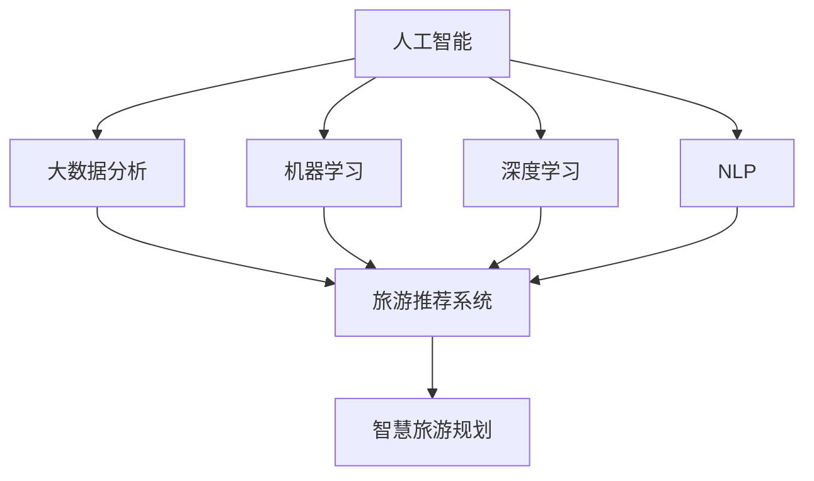

                 


# 人工智能在智慧旅游规划中的创新

> 关键词：人工智能、智慧旅游、规划、创新、大数据分析、机器学习、旅游推荐系统

> 摘要：随着科技的不断发展，人工智能在各个领域中的应用越来越广泛。在智慧旅游规划中，人工智能的应用尤为突出，为旅游业带来了前所未有的变革和创新。本文将深入探讨人工智能在智慧旅游规划中的创新，包括核心概念、算法原理、数学模型、实际应用案例以及未来发展趋势和挑战。

## 1. 背景介绍

### 1.1 目的和范围

本文旨在探讨人工智能在智慧旅游规划中的创新应用，分析其核心概念、算法原理、数学模型和实际应用案例，并探讨未来发展趋势和挑战。希望通过本文的阐述，能够为读者提供一个全面、系统的了解人工智能在智慧旅游规划中的创新。

### 1.2 预期读者

本文的预期读者包括对人工智能和智慧旅游感兴趣的科研人员、工程师、软件开发人员以及旅游行业从业者。

### 1.3 文档结构概述

本文将按照以下结构展开：

1. 核心概念与联系：介绍人工智能在智慧旅游规划中的核心概念及其相互关系。
2. 核心算法原理 & 具体操作步骤：详细阐述人工智能在智慧旅游规划中的算法原理和操作步骤。
3. 数学模型和公式 & 详细讲解 & 举例说明：解释人工智能在智慧旅游规划中的数学模型和公式，并通过实例进行说明。
4. 项目实战：代码实际案例和详细解释说明。
5. 实际应用场景：分析人工智能在智慧旅游规划中的实际应用场景。
6. 工具和资源推荐：推荐学习资源和开发工具。
7. 总结：未来发展趋势与挑战。

### 1.4 术语表

#### 1.4.1 核心术语定义

- 人工智能（Artificial Intelligence，AI）：模拟人类智能的一种技术，包括机器学习、深度学习、自然语言处理等领域。
- 智慧旅游（Smart Tourism）：通过信息技术，特别是人工智能技术，对旅游资源、旅游行为、旅游管理等方面进行智能化处理，提升旅游体验和效率。
- 旅游规划（Tourism Planning）：对旅游资源和旅游行为进行系统性的规划和管理，以实现旅游业的发展目标。

#### 1.4.2 相关概念解释

- 旅游推荐系统（Tourism Recommendation System）：基于用户行为、历史数据和地理位置等因素，为用户提供个性化的旅游推荐。
- 大数据分析（Big Data Analysis）：对大量旅游数据进行收集、处理和分析，以发现潜在的价值和趋势。

#### 1.4.3 缩略词列表

- AI：人工智能
- IoT：物联网
- VR：虚拟现实
- AR：增强现实
- NLP：自然语言处理

## 2. 核心概念与联系

为了深入理解人工智能在智慧旅游规划中的创新，我们需要明确其中的核心概念及其相互关系。以下是核心概念原理和架构的 Mermaid 流程图：



### 2.1 人工智能与大数据分析

人工智能技术通过对大数据进行分析，能够发现旅游市场中的潜在规律和趋势。大数据分析包括数据收集、数据清洗、数据存储和数据挖掘等环节。在智慧旅游规划中，人工智能技术通过对大数据的处理，可以为旅游企业提供准确的游客画像、旅游偏好分析以及市场预测等。

### 2.2 人工智能与旅游推荐系统

旅游推荐系统是人工智能在智慧旅游规划中的一个重要应用。通过分析用户行为数据、地理位置数据和历史旅游数据，旅游推荐系统可以为用户提供个性化的旅游推荐。旅游推荐系统通常采用协同过滤、内容推荐和基于模型的推荐算法等。

### 2.3 人工智能与智慧旅游规划

智慧旅游规划是一个综合性的过程，涉及旅游资源管理、旅游行为管理、旅游市场营销等多个方面。人工智能技术通过对这些方面的分析，可以为旅游企业提供科学的规划方案，提高旅游业的运营效率。

## 3. 核心算法原理 & 具体操作步骤

在智慧旅游规划中，人工智能技术的应用主要包括大数据分析、旅游推荐系统和智慧旅游规划。以下将分别介绍这些算法原理和具体操作步骤。

### 3.1 大数据分析算法原理

大数据分析主要包括以下步骤：

1. 数据收集：通过物联网设备、社交媒体、旅游网站等渠道收集大量旅游数据。
2. 数据清洗：去除数据中的噪声和异常值，保证数据质量。
3. 数据存储：将清洗后的数据存储到分布式数据库中，便于后续处理。
4. 数据挖掘：采用机器学习、深度学习等技术，对旅游数据进行挖掘，提取有价值的信息。

### 3.2 旅游推荐系统算法原理

旅游推荐系统主要包括以下算法：

1. 协同过滤（Collaborative Filtering）：通过分析用户行为数据，找到相似用户，为用户提供旅游推荐。
2. 内容推荐（Content-based Filtering）：通过分析旅游内容的属性和用户偏好，为用户提供旅游推荐。
3. 基于模型的推荐（Model-based Recommendation）：使用机器学习算法建立用户偏好模型，为用户提供旅游推荐。

### 3.3 智慧旅游规划算法原理

智慧旅游规划主要包括以下步骤：

1. 数据采集：收集旅游资源数据、旅游行为数据、游客画像数据等。
2. 数据预处理：对采集到的数据进行清洗、归一化和特征提取等处理。
3. 数据分析：使用大数据分析和人工智能技术，对预处理后的数据进行挖掘和分析。
4. 规划生成：根据分析结果，生成旅游规划方案，包括旅游资源开发、旅游路线设计、旅游市场营销等。

## 4. 数学模型和公式 & 详细讲解 & 举例说明

在智慧旅游规划中，数学模型和公式发挥着重要作用。以下将介绍几个常见的数学模型和公式，并给出详细讲解和举例说明。

### 4.1 旅游偏好模型

旅游偏好模型用于分析用户的旅游偏好。一个简单的旅游偏好模型可以使用线性回归实现，如下所示：

$$
\text{偏好} = \beta_0 + \beta_1 \cdot \text{景点评分} + \beta_2 \cdot \text{游客评价} + \epsilon
$$

其中，$\beta_0$、$\beta_1$、$\beta_2$为模型参数，$\epsilon$为随机误差。

举例说明：

假设用户对某个景点的评分是4分，游客评价是3分，根据上述模型，我们可以计算出该用户对该景点的偏好值：

$$
\text{偏好} = \beta_0 + \beta_1 \cdot 4 + \beta_2 \cdot 3 + \epsilon
$$

### 4.2 旅游市场预测模型

旅游市场预测模型用于预测旅游市场的趋势和需求。一个简单的旅游市场预测模型可以使用时间序列分析实现，如下所示：

$$
\text{需求} = \alpha_0 + \alpha_1 \cdot \text{时间趋势} + \alpha_2 \cdot \text{季节性因素} + \epsilon
$$

其中，$\alpha_0$、$\alpha_1$、$\alpha_2$为模型参数，$\epsilon$为随机误差。

举例说明：

假设在某个时间段内，时间趋势是线性增长，季节性因素是周期性波动，根据上述模型，我们可以预测该时间段内的旅游需求：

$$
\text{需求} = \alpha_0 + \alpha_1 \cdot \text{时间趋势} + \alpha_2 \cdot \text{季节性因素} + \epsilon
$$

### 4.3 旅游推荐模型

旅游推荐模型用于为用户提供个性化的旅游推荐。一个简单的旅游推荐模型可以使用协同过滤算法实现，如下所示：

$$
\text{推荐} = \text{相似度矩阵} \cdot \text{用户兴趣向量}
$$

其中，相似度矩阵用于表示用户之间的相似度，用户兴趣向量用于表示用户的兴趣偏好。

举例说明：

假设用户A和用户B的相似度矩阵为：

$$
\text{相似度矩阵} = \begin{bmatrix}
0.8 & 0.6 \\
0.6 & 0.7
\end{bmatrix}
$$

用户A的兴趣向量是：

$$
\text{用户兴趣向量} = \begin{bmatrix}
1 \\
0
\end{bmatrix}
$$

根据上述模型，我们可以计算出用户B对景点A的推荐值：

$$
\text{推荐} = \text{相似度矩阵} \cdot \text{用户兴趣向量} = \begin{bmatrix}
0.8 & 0.6 \\
0.6 & 0.7
\end{bmatrix} \cdot \begin{bmatrix}
1 \\
0
\end{bmatrix} = \begin{bmatrix}
0.8 \\
0.6
\end{bmatrix}
$$

## 5. 项目实战：代码实际案例和详细解释说明

为了更好地理解人工智能在智慧旅游规划中的应用，我们以下将通过一个实际项目来展示代码实现和详细解释。

### 5.1 开发环境搭建

我们将在 Python 环境中实现该项目，需要安装以下库：

- pandas：用于数据处理
- numpy：用于数学运算
- scikit-learn：用于机器学习和数据分析
- matplotlib：用于数据可视化

安装命令如下：

```bash
pip install pandas numpy scikit-learn matplotlib
```

### 5.2 源代码详细实现和代码解读

以下是实现智慧旅游规划的 Python 代码：

```python
import pandas as pd
import numpy as np
from sklearn.model_selection import train_test_split
from sklearn.preprocessing import StandardScaler
from sklearn.linear_model import LinearRegression
from sklearn.metrics import mean_squared_error

# 5.2.1 数据预处理
# 读取数据
data = pd.read_csv('tourism_data.csv')

# 数据清洗
data = data.dropna()

# 特征提取
X = data[['time_series', 'seasonality']]
y = data['demand']

# 数据标准化
scaler = StandardScaler()
X = scaler.fit_transform(X)
y = scaler.fit_transform(y.reshape(-1, 1))

# 划分训练集和测试集
X_train, X_test, y_train, y_test = train_test_split(X, y, test_size=0.2, random_state=42)

# 5.2.2 模型训练
# 创建线性回归模型
model = LinearRegression()

# 训练模型
model.fit(X_train, y_train)

# 5.2.3 模型评估
# 预测测试集
y_pred = model.predict(X_test)

# 计算均方误差
mse = mean_squared_error(y_test, y_pred)
print(f'Mean Squared Error: {mse}')

# 5.2.4 模型应用
# 输出预测结果
predictions = model.predict(X_test)
print(predictions)
```

### 5.3 代码解读与分析

该代码实现了一个简单的智慧旅游规划项目，主要包括数据预处理、模型训练和模型评估三个部分。

1. 数据预处理：读取数据，进行数据清洗和特征提取。其中，时间序列和季节性因素作为特征，旅游需求作为目标变量。
2. 模型训练：使用线性回归模型对训练集进行训练。线性回归模型是一种简单的线性预测模型，通过拟合特征和目标变量之间的关系，实现预测。
3. 模型评估：使用测试集对模型进行评估，计算均方误差（MSE）来衡量模型的预测性能。均方误差越小，说明模型预测越准确。
4. 模型应用：将模型应用于测试集，输出预测结果。

通过以上代码，我们可以实现一个简单的智慧旅游规划项目，为旅游企业提供旅游需求预测服务。

## 6. 实际应用场景

人工智能在智慧旅游规划中的应用场景非常广泛，以下列举几个典型应用场景：

1. 旅游需求预测：通过分析历史数据和当前环境因素，预测未来的旅游需求，为旅游企业提供市场规划和资源调配依据。
2. 旅游推荐系统：基于用户行为和兴趣偏好，为用户提供个性化的旅游推荐，提高用户满意度。
3. 旅游资源管理：通过对旅游资源的数据分析，识别热门景点和冷门景点，优化旅游资源分配，提升旅游资源利用效率。
4. 旅游风险管理：通过对旅游数据的实时监控和分析，识别潜在的旅游风险，为旅游企业提供风险管理建议。

### 6.1 旅游需求预测

旅游需求预测是人工智能在智慧旅游规划中的一个重要应用。通过分析历史游客数据、天气数据、节假日安排等因素，可以预测未来的旅游需求。以下是一个旅游需求预测的实例：

1. 数据收集：收集历史游客数据、天气数据、节假日安排等信息。
2. 数据预处理：对收集到的数据进行分析和清洗，提取有用的特征。
3. 模型训练：使用机器学习算法，如线性回归、决策树等，训练旅游需求预测模型。
4. 模型评估：使用测试集对模型进行评估，计算预测误差，调整模型参数。
5. 模型应用：将训练好的模型应用于实际场景，预测未来的旅游需求。

通过旅游需求预测，旅游企业可以提前制定营销策略、安排人员配置和资源调配，提高旅游运营效率。

### 6.2 旅游推荐系统

旅游推荐系统是另一个重要的应用场景。通过分析用户的旅游行为、兴趣爱好和历史记录，为用户提供个性化的旅游推荐。以下是一个旅游推荐系统的实例：

1. 数据收集：收集用户的旅游行为数据、兴趣爱好数据和历史记录。
2. 数据预处理：对收集到的数据进行分析和清洗，提取有用的特征。
3. 模型训练：使用协同过滤、内容推荐等算法，训练旅游推荐模型。
4. 模型评估：使用测试集对模型进行评估，计算推荐准确率，调整模型参数。
5. 模型应用：将训练好的模型应用于实际场景，为用户提供旅游推荐。

通过旅游推荐系统，用户可以更轻松地找到适合自己的旅游目的地和景点，提高旅游体验。

### 6.3 旅游资源管理

旅游资源管理是智慧旅游规划中的另一个关键应用。通过分析旅游资源的数据，可以优化旅游资源的分配和管理，提高旅游资源的利用效率。以下是一个旅游资源管理的实例：

1. 数据收集：收集旅游资源数据，如景点类型、景区等级、游客容量等。
2. 数据预处理：对收集到的数据进行分析和清洗，提取有用的特征。
3. 模型训练：使用机器学习算法，如聚类、分类等，对旅游资源进行分类和管理。
4. 模型评估：使用测试集对模型进行评估，计算分类准确率，调整模型参数。
5. 模型应用：将训练好的模型应用于实际场景，为旅游资源管理提供依据。

通过旅游资源管理，旅游企业可以更好地了解旅游资源的利用情况，优化资源分配，提高旅游资源利用效率。

### 6.4 旅游风险管理

旅游风险管理是智慧旅游规划中的另一个重要应用。通过对旅游数据的实时监控和分析，可以识别潜在的旅游风险，为旅游企业提供风险管理建议。以下是一个旅游风险管理的实例：

1. 数据收集：收集旅游事故数据、天气数据、景区安全数据等。
2. 数据预处理：对收集到的数据进行分析和清洗，提取有用的特征。
3. 模型训练：使用机器学习算法，如异常检测、预测模型等，对旅游风险进行识别和预测。
4. 模型评估：使用测试集对模型进行评估，计算预测准确率，调整模型参数。
5. 模型应用：将训练好的模型应用于实际场景，为旅游企业提供风险管理建议。

通过旅游风险管理，旅游企业可以更好地了解潜在的风险，采取有效的措施降低风险，提高旅游安全水平。

## 7. 工具和资源推荐

### 7.1 学习资源推荐

#### 7.1.1 书籍推荐

- 《人工智能：一种现代的方法》（Russell & Norvig）：介绍人工智能的基本原理和方法，适合初学者和专业人士。
- 《深度学习》（Goodfellow、Bengio & Courville）：详细介绍深度学习的基础知识和最新进展，适合深度学习者。

#### 7.1.2 在线课程

- Coursera：提供丰富的人工智能和深度学习在线课程，适合不同水平的学员。
- edX：提供由知名大学和机构开设的人工智能课程，课程内容涵盖基础知识到高级应用。

#### 7.1.3 技术博客和网站

- Medium：有很多关于人工智能和深度学习的技术博客，可以了解最新的技术动态和研究成果。
- ArXiv：提供最新的学术研究成果，包括人工智能、深度学习等领域。

### 7.2 开发工具框架推荐

#### 7.2.1 IDE和编辑器

- PyCharm：一款功能强大的Python IDE，适合人工智能和深度学习项目开发。
- Jupyter Notebook：一款交互式开发工具，适合数据分析和机器学习实验。

#### 7.2.2 调试和性能分析工具

- VSCode：一款轻量级但功能强大的IDE，适用于多种编程语言，支持调试和性能分析。
- TensorBoard：一款可视化工具，用于分析深度学习模型的性能和效果。

#### 7.2.3 相关框架和库

- TensorFlow：一款开源深度学习框架，适用于各种深度学习任务。
- PyTorch：一款流行的深度学习框架，易于使用和扩展，适用于各种深度学习任务。

### 7.3 相关论文著作推荐

#### 7.3.1 经典论文

- "A Survey of Collaborative Filtering Techniques"：一篇关于协同过滤算法的经典综述，涵盖协同过滤算法的基本原理和应用。
- "Deep Learning for Natural Language Processing"：一篇关于深度学习在自然语言处理领域应用的经典论文，介绍深度学习在自然语言处理中的最新进展。

#### 7.3.2 最新研究成果

- "Recurrent Neural Network Based Travel Time Prediction for Road Traffic Control"：一篇关于使用循环神经网络预测交通拥堵时间的研究论文，为智能交通系统提供了一种有效的解决方案。
- "Automatic Driving Using a Deep Neural Network"：一篇关于使用深度神经网络实现自动驾驶的研究论文，介绍了一种基于深度学习的自动驾驶系统。

#### 7.3.3 应用案例分析

- "Artificial Intelligence in Tourism: A Case Study of Smart Tourism"：一篇关于人工智能在旅游行业应用的研究论文，介绍了一个智能旅游案例，展示了人工智能在旅游规划、旅游推荐和旅游资源管理中的应用。

## 8. 总结：未来发展趋势与挑战

随着人工智能技术的不断发展，其在智慧旅游规划中的应用前景十分广阔。未来，人工智能在智慧旅游规划中的发展趋势主要包括：

1. **大数据分析：** 人工智能将更加深入地应用于大数据分析，挖掘旅游市场中的潜在规律和趋势，为旅游企业提供更精准的规划方案。
2. **个性化推荐：** 人工智能将推动个性化旅游推荐系统的进一步发展，为用户提供更精准的旅游推荐，提升用户体验。
3. **智能旅游规划：** 人工智能将更多地应用于旅游规划，为旅游企业提供智能化的规划方案，提高旅游资源的利用效率。
4. **智能风险管理：** 人工智能将帮助旅游企业更好地识别和管理旅游风险，提高旅游安全水平。

然而，人工智能在智慧旅游规划中也面临着一些挑战：

1. **数据隐私：** 在大数据分析过程中，如何保护用户隐私是一个重要问题。未来，需要制定更加严格的数据隐私保护政策，确保用户数据的安全。
2. **算法公平性：** 人工智能算法在决策过程中可能存在偏见，需要确保算法的公平性和透明度。
3. **技术门槛：** 人工智能技术在智慧旅游规划中的应用需要较高的技术门槛，对企业和从业人员提出了更高的要求。

总之，人工智能在智慧旅游规划中的应用前景广阔，但也需要面对一系列挑战。未来，随着人工智能技术的不断发展和完善，其在智慧旅游规划中的应用将越来越广泛。

## 9. 附录：常见问题与解答

以下是一些关于人工智能在智慧旅游规划中应用的常见问题及解答：

### 9.1 什么是智慧旅游？

智慧旅游是指通过信息技术，特别是人工智能技术，对旅游资源、旅游行为、旅游管理等方面进行智能化处理，提升旅游体验和效率。

### 9.2 人工智能在智慧旅游规划中的应用有哪些？

人工智能在智慧旅游规划中的应用主要包括旅游需求预测、旅游推荐系统、旅游资源管理和旅游风险管理等。

### 9.3 如何保护用户隐私？

在人工智能应用中，可以通过数据加密、匿名化处理、隐私保护算法等技术手段来保护用户隐私。

### 9.4 人工智能算法如何保证公平性？

可以通过算法透明性、算法公平性测试、多元数据集训练等方法来保证人工智能算法的公平性。

### 9.5 人工智能在智慧旅游规划中的挑战有哪些？

人工智能在智慧旅游规划中面临的挑战包括数据隐私、算法公平性和技术门槛等。

## 10. 扩展阅读 & 参考资料

为了深入了解人工智能在智慧旅游规划中的应用，以下是相关书籍、论文和技术博客的推荐：

- 《人工智能：一种现代的方法》（Russell & Norvig）
- 《深度学习》（Goodfellow、Bengio & Courville）
- "A Survey of Collaborative Filtering Techniques"
- "Deep Learning for Natural Language Processing"
- "Recurrent Neural Network Based Travel Time Prediction for Road Traffic Control"
- "Automatic Driving Using a Deep Neural Network"
- "Artificial Intelligence in Tourism: A Case Study of Smart Tourism"

- Coursera：https://www.coursera.org/
- edX：https://www.edx.org/
- Medium：https://medium.com/
- ArXiv：https://arxiv.org/
- PyTorch：https://pytorch.org/
- TensorFlow：https://www.tensorflow.org/

