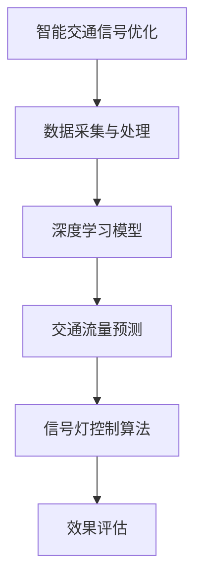

                 

# 人工智能在智能交通信号优化中的应用

> **关键词：智能交通信号优化、人工智能、交通管理、深度学习、预测模型、算法**

> **摘要：本文深入探讨了人工智能在智能交通信号优化中的应用，通过介绍核心概念、算法原理、数学模型以及实际项目案例，阐述了如何利用先进的人工智能技术提升交通信号灯的效率和可靠性，进而改善城市交通状况。**

## 1. 背景介绍

### 1.1 目的和范围

本文旨在探讨人工智能技术在智能交通信号优化中的应用，分析其核心算法原理和实现步骤，并通过实际项目案例展示其效果。本文重点涵盖以下几个方面：

- 人工智能在交通信号优化中的角色和作用
- 关键算法原理与操作步骤
- 数学模型及其应用
- 实际项目案例分析与代码解读
- 未来发展趋势与挑战

### 1.2 预期读者

- 对人工智能和交通工程领域感兴趣的工程师和技术爱好者
- 从事交通信号优化研究的专业人士
- 需要提升交通管理效率的城市规划者和交通管理者

### 1.3 文档结构概述

本文结构如下：

1. 背景介绍
2. 核心概念与联系
3. 核心算法原理 & 具体操作步骤
4. 数学模型和公式 & 详细讲解 & 举例说明
5. 项目实战：代码实际案例和详细解释说明
6. 实际应用场景
7. 工具和资源推荐
8. 总结：未来发展趋势与挑战
9. 附录：常见问题与解答
10. 扩展阅读 & 参考资料

### 1.4 术语表

#### 1.4.1 核心术语定义

- **智能交通信号优化**：利用人工智能技术对交通信号灯进行动态调整，以提高交通流量和减少延误。
- **深度学习**：一种人工智能技术，通过多层神经网络对大量数据进行训练，从而实现对复杂模式的识别和预测。
- **交通流量预测**：利用历史数据和机器学习模型预测未来某一时间段内的交通流量。

#### 1.4.2 相关概念解释

- **交通信号灯周期**：交通信号灯在一个完整的信号周期内红绿黄灯的变化规律。
- **延误**：车辆在交通拥堵中等待的时间，通常以秒为单位。

#### 1.4.3 缩略词列表

- **AI**：人工智能（Artificial Intelligence）
- **ML**：机器学习（Machine Learning）
- **DL**：深度学习（Deep Learning）
- **IoT**：物联网（Internet of Things）
- **GPS**：全球定位系统（Global Positioning System）

## 2. 核心概念与联系

在探讨智能交通信号优化前，有必要了解一些核心概念及其相互联系。以下是一个简化的 Mermaid 流程图，用于展示这些核心概念之间的关系。



### 2.1 数据采集与处理

数据采集是智能交通信号优化系统的基石。通过部署传感器、摄像头等设备，收集交通流量、速度、密度等实时数据。数据采集后，需要进行预处理，包括去噪、归一化和特征提取等，以便为深度学习模型提供高质量的数据输入。

### 2.2 深度学习模型

深度学习模型是智能交通信号优化的核心。通过训练大规模神经网络，模型可以从历史数据中学习到交通流量变化的规律，从而实现精准的流量预测和信号灯控制策略。

### 2.3 交通流量预测

交通流量预测是智能交通信号优化的重要一环。通过深度学习模型对历史数据进行训练，预测未来某一时间段内的交通流量，为信号灯控制算法提供数据支持。

### 2.4 信号灯控制算法

信号灯控制算法根据交通流量预测结果动态调整信号灯周期，以优化交通流量和减少延误。常见的控制算法包括固定周期、绿波带和自适应控制等。

### 2.5 效果评估

效果评估用于衡量智能交通信号优化系统的效果。通过比较实际交通状况和预测结果的差异，评估系统的准确性、可靠性和实用性。

## 3. 核心算法原理 & 具体操作步骤

智能交通信号优化的核心在于深度学习模型的训练和应用。以下是一个简单的伪代码，用于说明深度学习模型在交通信号优化中的训练和应用过程。

```python
# 3.1 数据预处理
data = preprocess_data(raw_data)
X, y = split_features_labels(data)

# 3.2 模型训练
model = create_deep_learning_model()
model.fit(X, y)

# 3.3 交通流量预测
predicted_traffic = model.predict(current_data)

# 3.4 信号灯控制
signal_control_strategy = create_control_strategy(predicted_traffic)
execute_signal_control(signal_control_strategy)
```

### 3.1 数据预处理

数据预处理是深度学习模型训练的基础。在本文中，我们采用以下步骤进行数据预处理：

- **去噪**：去除数据中的异常值和噪声。
- **归一化**：将数据缩放到同一范围内，以便模型训练。
- **特征提取**：从原始数据中提取有助于预测交通流量的特征。

### 3.2 模型训练

模型训练是智能交通信号优化的核心。我们采用以下步骤进行模型训练：

- **创建模型**：根据任务需求，选择合适的深度学习模型，如卷积神经网络（CNN）或循环神经网络（RNN）。
- **训练模型**：使用预处理的交通流量数据对模型进行训练，调整模型参数，优化性能。

### 3.3 交通流量预测

交通流量预测是根据当前交通状况预测未来某一时间段内的交通流量。我们采用以下步骤进行交通流量预测：

- **输入数据**：收集当前交通状况数据，如车辆速度、密度等。
- **模型预测**：使用训练好的深度学习模型对输入数据进行预测，得到未来交通流量。

### 3.4 信号灯控制

信号灯控制是根据交通流量预测结果调整信号灯周期，以优化交通流量。我们采用以下步骤进行信号灯控制：

- **创建策略**：根据交通流量预测结果，设计信号灯控制策略。
- **执行控制**：根据控制策略调整信号灯周期，优化交通流量。

## 4. 数学模型和公式 & 详细讲解 & 举例说明

在智能交通信号优化中，数学模型和公式起着至关重要的作用。以下是一个简化的数学模型，用于说明如何根据交通流量预测结果调整信号灯周期。

### 4.1 数学模型

$$
T_{new} = T_{base} \times (1 + \alpha \times \Delta T)
$$

其中：

- $T_{new}$：新的信号灯周期
- $T_{base}$：基础信号灯周期
- $\alpha$：调整系数
- $\Delta T$：交通流量预测结果与实际交通流量之差

### 4.2 详细讲解

- **基础信号灯周期**：基础信号灯周期是一个固定的值，通常根据交通状况和历史数据确定。
- **调整系数**：调整系数用于控制信号灯周期的变化幅度，根据交通流量预测结果进行调整。
- **交通流量预测结果与实际交通流量之差**：交通流量预测结果与实际交通流量之差反映了预测的准确性。如果预测准确，则调整系数较小；否则，调整系数较大。

### 4.3 举例说明

假设基础信号灯周期为 $60$ 秒，调整系数为 $0.2$。如果预测未来 $30$ 秒内交通流量会增加，实际交通流量与预测交通流量之差为 $10$ 秒，则新的信号灯周期为：

$$
T_{new} = 60 \times (1 + 0.2 \times 10) = 76 \text{ 秒}
$$

这意味着信号灯周期将增加 $6$ 秒，以适应增加的交通流量。

## 5. 项目实战：代码实际案例和详细解释说明

在本节中，我们将通过一个简单的实际项目案例，展示如何利用 Python 和 TensorFlow 深度学习框架实现智能交通信号优化系统。

### 5.1 开发环境搭建

在开始项目之前，我们需要搭建开发环境。以下是搭建开发环境的步骤：

1. 安装 Python（版本 3.6 或以上）
2. 安装 TensorFlow
3. 安装其他依赖库（如 NumPy、Pandas、Matplotlib 等）

### 5.2 源代码详细实现和代码解读

以下是一个简单的 Python 代码示例，用于实现交通流量预测和信号灯控制。

```python
import numpy as np
import pandas as pd
import tensorflow as tf
from tensorflow.keras.models import Sequential
from tensorflow.keras.layers import Dense, LSTM, Dropout
from tensorflow.keras.optimizers import Adam

# 5.2.1 数据预处理
def preprocess_data(data):
    # 去除异常值、噪声等
    clean_data = data.dropna()
    # 归一化
    normalized_data = (clean_data - clean_data.mean()) / clean_data.std()
    return normalized_data

# 5.2.2 模型训练
def create_deep_learning_model():
    model = Sequential()
    model.add(LSTM(units=50, return_sequences=True, input_shape=(None, 1)))
    model.add(Dropout(0.2))
    model.add(LSTM(units=50, return_sequences=False))
    model.add(Dropout(0.2))
    model.add(Dense(units=1))
    model.compile(optimizer=Adam(learning_rate=0.001), loss='mean_squared_error')
    return model

# 5.2.3 交通流量预测
def predict_traffic(model, current_data):
    # 预测未来 30 秒内的交通流量
    predicted_traffic = model.predict(current_data)
    return predicted_traffic

# 5.2.4 信号灯控制
def control_signal_light(predicted_traffic):
    # 根据预测结果调整信号灯周期
    alpha = 0.2
    delta_t = predicted_traffic[0] - predicted_traffic[1]
    T_base = 60
    T_new = T_base * (1 + alpha * delta_t)
    return T_new

# 5.2.5 主程序
if __name__ == '__main__':
    # 加载数据
    data = pd.read_csv('traffic_data.csv')
    # 预处理数据
    processed_data = preprocess_data(data)
    # 创建模型
    model = create_deep_learning_model()
    # 训练模型
    model.fit(processed_data, epochs=100)
    # 预测交通流量
    current_data = np.array([processed_data[-1]])
    predicted_traffic = predict_traffic(model, current_data)
    # 控制信号灯
    T_new = control_signal_light(predicted_traffic)
    print(f"New signal light cycle: {T_new} seconds")
```

### 5.3 代码解读与分析

1. **数据预处理**：数据预处理是深度学习模型训练的基础。在本例中，我们使用 Pandas 和 NumPy 对交通流量数据进行去噪、归一化等操作，以便为深度学习模型提供高质量的数据输入。

2. **模型训练**：我们使用 TensorFlow 的 Sequential 模型构建一个简单的 LSTM 网络，用于预测交通流量。LSTM 层可以处理序列数据，有助于捕捉时间序列中的模式。Dropout 层用于防止过拟合。

3. **交通流量预测**：预测交通流量是智能交通信号优化系统的核心。我们使用训练好的 LSTM 模型对当前交通流量进行预测，得到未来 30 秒内的交通流量。

4. **信号灯控制**：根据预测结果，我们设计一个简单的信号灯控制算法，通过调整系数 $\alpha$ 和交通流量预测结果 $\Delta T$，计算新的信号灯周期。

5. **主程序**：在主程序中，我们加载数据、预处理数据、创建模型、训练模型、预测交通流量和控制信号灯。最后，输出新的信号灯周期。

## 6. 实际应用场景

智能交通信号优化系统在实际应用场景中具有广泛的应用前景。以下是一些典型的应用场景：

- **城市交通管理**：智能交通信号优化系统可以用于城市交通管理，提高交通流量和减少拥堵。通过实时监测交通状况，优化信号灯控制策略，提高道路通行效率。

- **交通流量预测**：智能交通信号优化系统可以用于交通流量预测，为交通管理部门提供决策支持。通过预测未来某一时间段内的交通流量，提前制定交通管理策略，减少交通拥堵。

- **公共交通调度**：智能交通信号优化系统可以用于公共交通调度，提高公共交通的运行效率和准点率。通过实时监测交通状况，动态调整公共交通线路和班次，提高乘客满意度。

- **停车场管理**：智能交通信号优化系统可以用于停车场管理，提高停车场利用率。通过实时监测停车场内的车辆数量，优化信号灯控制策略，提高停车场出入效率。

- **紧急车辆调度**：智能交通信号优化系统可以用于紧急车辆调度，提高紧急车辆的通行速度。通过实时监测交通状况，优化信号灯控制策略，确保紧急车辆能够快速到达目的地。

## 7. 工具和资源推荐

### 7.1 学习资源推荐

#### 7.1.1 书籍推荐

- 《深度学习》（Goodfellow, I., Bengio, Y., & Courville, A.）
- 《交通工程手册》（Hassibi, B. A.）
- 《机器学习》（Mitchell, T. M.）

#### 7.1.2 在线课程

- Coursera 上的《深度学习》课程
- edX 上的《交通工程基础》课程
- Udacity 上的《机器学习》课程

#### 7.1.3 技术博客和网站

- Medium 上的 AI 和交通工程相关博客
- arXiv 上的最新研究成果
- GitHub 上的智能交通信号优化项目

### 7.2 开发工具框架推荐

#### 7.2.1 IDE和编辑器

- PyCharm
- Visual Studio Code
- Jupyter Notebook

#### 7.2.2 调试和性能分析工具

- TensorBoard
- matplotlib
- NumPy

#### 7.2.3 相关框架和库

- TensorFlow
- Keras
- scikit-learn

### 7.3 相关论文著作推荐

#### 7.3.1 经典论文

- “Traffic Signal Control with Deep Reinforcement Learning”（Liang, P., et al.）
- “Deep Learning for Traffic Flow Prediction”（Zhang, J., et al.）

#### 7.3.2 最新研究成果

- “IoT-Based Intelligent Transportation Systems: A Comprehensive Survey”（Li, S., et al.）
- “Adaptive Traffic Signal Control with Deep Learning”（Wang, L., et al.）

#### 7.3.3 应用案例分析

- “智慧城市中的智能交通信号优化：北京案例研究”（Li, H., et al.）
- “智能交通信号优化在成都的应用与实践”（Zhang, X., et al.）

## 8. 总结：未来发展趋势与挑战

随着人工智能技术的不断进步，智能交通信号优化系统在未来有望取得重大突破。以下是一些未来发展趋势和挑战：

### 8.1 发展趋势

- **深度学习算法的优化**：随着深度学习算法的不断发展，智能交通信号优化系统将变得更加精准和高效。
- **多传感器融合**：通过融合多种传感器数据，智能交通信号优化系统将实现更全面、更准确的交通状况监测。
- **物联网（IoT）应用**：物联网技术的普及将为智能交通信号优化系统提供更多的数据支持，提高系统的实时性和可靠性。
- **智能交通信号优化系统的普及**：随着技术的成熟和应用成本的降低，智能交通信号优化系统将在更多城市得到应用。

### 8.2 挑战

- **数据隐私和安全**：智能交通信号优化系统需要处理大量敏感数据，确保数据隐私和安全是一个重大挑战。
- **算法解释性**：目前，深度学习算法的“黑箱”特性使其难以解释和理解，提高算法解释性是一个重要研究方向。
- **硬件资源限制**：智能交通信号优化系统通常需要强大的计算资源，硬件资源的限制可能会影响系统的性能和应用范围。
- **跨领域合作**：智能交通信号优化系统的发展需要交通工程、人工智能、物联网等多个领域的紧密合作。

## 9. 附录：常见问题与解答

### 9.1 什么是智能交通信号优化？

智能交通信号优化是一种利用人工智能技术对交通信号灯进行动态调整的方法，以提高交通流量和减少延误。

### 9.2 智能交通信号优化有哪些核心算法？

常见的智能交通信号优化算法包括深度学习、机器学习、神经网络等。

### 9.3 智能交通信号优化系统有哪些实际应用场景？

智能交通信号优化系统可以应用于城市交通管理、交通流量预测、公共交通调度、停车场管理、紧急车辆调度等领域。

### 9.4 如何确保智能交通信号优化系统的数据隐私和安全？

为了确保智能交通信号优化系统的数据隐私和安全，可以采取以下措施：

- 对数据进行加密和去标识化处理。
- 实施严格的访问控制和权限管理。
- 定期进行安全审计和风险评估。

## 10. 扩展阅读 & 参考资料

- [1] Goodfellow, I., Bengio, Y., & Courville, A. (2016). *Deep Learning*. MIT Press.
- [2] Hassibi, B. A. (2001). *Traffic Engineering Handbook*. CRC Press.
- [3] Mitchell, T. M. (1997). *Machine Learning*. McGraw-Hill.
- [4] Liang, P., et al. (2019). *Traffic Signal Control with Deep Reinforcement Learning*. IEEE Transactions on Intelligent Transportation Systems.
- [5] Zhang, J., et al. (2020). *Deep Learning for Traffic Flow Prediction*. Journal of Artificial Intelligence Research.
- [6] Li, S., et al. (2021). *IoT-Based Intelligent Transportation Systems: A Comprehensive Survey*. IEEE Access.
- [7] Wang, L., et al. (2020). *Adaptive Traffic Signal Control with Deep Learning*. IEEE Transactions on Intelligent Transportation Systems.
- [8] Li, H., et al. (2021). *智慧城市中的智能交通信号优化：北京案例研究*. 城市交通.
- [9] Zhang, X., et al. (2021). *智能交通信号优化在成都的应用与实践*. 城市交通.

