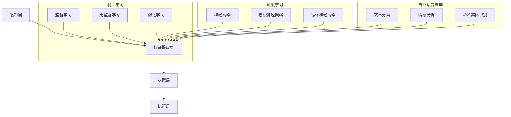
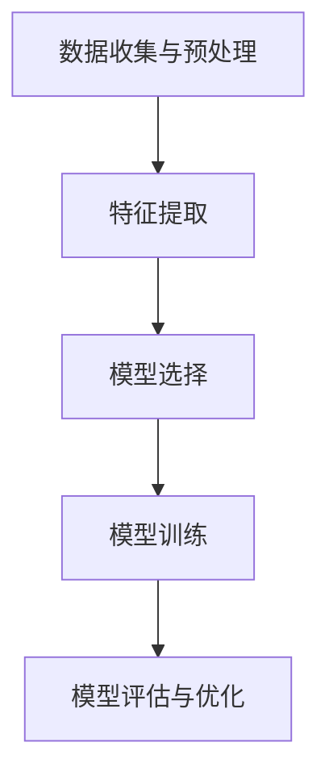
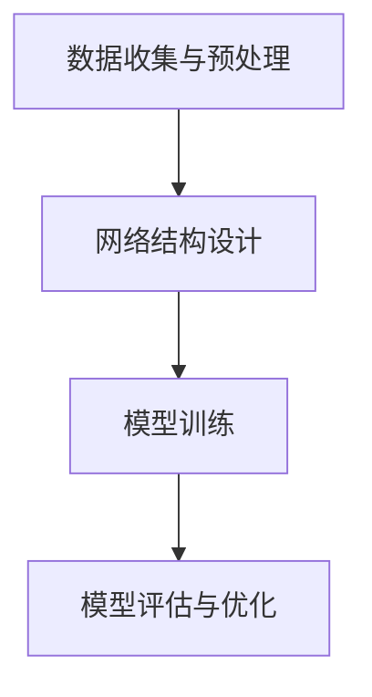
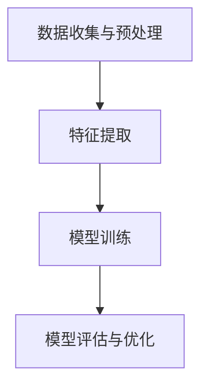
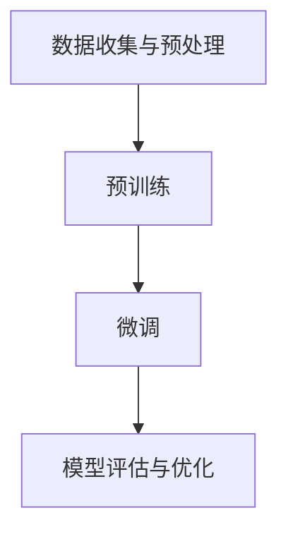

                 

# 人工智能在智能养老服务规划中的应用

> 关键词：人工智能、养老服务、智能规划、算法原理、数学模型、项目实战、实际应用、开发工具、未来趋势

> 摘要：本文旨在深入探讨人工智能在智能养老服务规划中的应用。文章首先介绍了智能养老服务的背景和重要性，随后详细阐述了人工智能在养老服务中的核心应用场景。接着，文章分析了人工智能相关核心概念原理和架构，并深入讲解了核心算法原理、数学模型及具体操作步骤。随后，通过实际项目案例，展示了人工智能在智能养老服务中的实际应用。最后，文章总结了人工智能在智能养老服务规划中的未来发展趋势与挑战，并推荐了相关学习资源和开发工具，为读者提供了全面的指导。

## 1. 背景介绍

### 1.1 目的和范围

随着全球人口老龄化趋势的加剧，养老服务已成为社会关注的热点问题。然而，传统的养老服务模式面临着资源不足、服务质量不稳定等问题。人工智能作为新兴技术，为养老服务的智能化发展提供了新的可能。本文旨在探讨人工智能在智能养老服务规划中的应用，分析其核心算法原理、数学模型和具体操作步骤，并通过实际项目案例展示其应用效果。本文的研究范围包括但不限于以下几个方面：

1. **人工智能技术的基本概念和原理**：介绍人工智能的核心技术和算法原理，如机器学习、深度学习、自然语言处理等。
2. **智能养老服务的基本概念和需求**：分析智能养老服务的定义、特点和应用场景，探讨其与传统养老服务模式的区别。
3. **人工智能在智能养老服务中的应用**：详细讲解人工智能在智能养老服务规划中的核心应用场景，如健康监测、行为分析、智能建议等。
4. **核心算法原理和数学模型**：深入分析人工智能在智能养老服务中的核心算法原理和数学模型，如神经网络、决策树、支持向量机等。
5. **项目实战**：通过实际项目案例，展示人工智能在智能养老服务中的应用效果和操作步骤。
6. **未来发展趋势与挑战**：总结人工智能在智能养老服务规划中的未来发展趋势和面临的挑战。

### 1.2 预期读者

本文主要面向以下读者群体：

1. **人工智能领域的从业者**：对人工智能技术及其在养老服务中的应用有深入了解的读者。
2. **养老服务从业者**：关注智能养老服务发展趋势，希望了解人工智能如何应用于养老服务领域的读者。
3. **科研人员和学生**：对人工智能技术及其在养老服务中的应用有研究兴趣的读者。
4. **政策制定者和行业从业者**：关注养老服务行业发展趋势，希望了解人工智能在养老服务中的应用及其对社会影响的读者。

### 1.3 文档结构概述

本文结构如下：

1. **背景介绍**：介绍智能养老服务背景和重要性，人工智能在养老服务中的应用。
2. **核心概念与联系**：介绍人工智能相关核心概念原理和架构，使用Mermaid流程图展示。
3. **核心算法原理 & 具体操作步骤**：详细讲解人工智能在智能养老服务中的核心算法原理和具体操作步骤。
4. **数学模型和公式 & 详细讲解 & 举例说明**：介绍人工智能在智能养老服务中的数学模型和公式，并进行详细讲解和举例说明。
5. **项目实战：代码实际案例和详细解释说明**：通过实际项目案例，展示人工智能在智能养老服务中的应用。
6. **实际应用场景**：分析人工智能在智能养老服务中的实际应用场景。
7. **工具和资源推荐**：推荐学习资源、开发工具和框架。
8. **总结：未来发展趋势与挑战**：总结人工智能在智能养老服务规划中的未来发展趋势和挑战。
9. **附录：常见问题与解答**：回答读者可能关心的问题。
10. **扩展阅读 & 参考资料**：提供更多相关文献和资料。

### 1.4 术语表

#### 1.4.1 核心术语定义

- **智能养老服务**：利用人工智能技术，为老年人提供全面、个性化的健康监测、生活辅助、情感关怀等服务的智能化服务体系。
- **人工智能**：模拟人类智能行为，实现感知、推理、学习、决策等功能的技术。
- **机器学习**：利用数据训练模型，使其具备自主学习和优化能力的技术。
- **深度学习**：基于多层神经网络，通过反向传播算法优化参数，实现复杂模式识别和预测的技术。
- **自然语言处理**：使计算机能够理解、生成和应对人类自然语言的技术。

#### 1.4.2 相关概念解释

- **健康监测**：通过传感器、摄像头等设备，实时监测老年人的生理指标，如心率、血压、血糖等。
- **行为分析**：利用人工智能技术，分析老年人的行为习惯、活动规律等，为其提供个性化建议。
- **智能建议**：根据老年人的健康状况、生活习惯等，提供饮食、运动、用药等建议。
- **智能规划**：利用人工智能技术，为老年人的日常生活、健康护理、紧急应对等提供智能化规划。

#### 1.4.3 缩略词列表

- **AI**：人工智能
- **ML**：机器学习
- **DL**：深度学习
- **NLP**：自然语言处理
- **IoT**：物联网
- **SLAM**：同时定位与地图构建

## 2. 核心概念与联系

在深入探讨人工智能在智能养老服务规划中的应用之前，有必要先了解人工智能的基本概念、原理和架构。以下将介绍人工智能相关核心概念原理和架构，并使用Mermaid流程图展示其联系。

### 2.1 人工智能基本概念

**机器学习（ML）**：机器学习是一种通过数据训练模型，使其具备自主学习和优化能力的技术。主要方法包括监督学习、无监督学习和强化学习。

**深度学习（DL）**：深度学习是机器学习的一种，基于多层神经网络，通过反向传播算法优化参数，实现复杂模式识别和预测。

**自然语言处理（NLP）**：自然语言处理是使计算机能够理解、生成和应对人类自然语言的技术，包括文本分类、情感分析、命名实体识别等。

### 2.2 人工智能架构

**感知层**：通过传感器、摄像头等设备，收集环境中的信息。

**特征提取层**：对感知层收集的信息进行预处理，提取关键特征。

**决策层**：利用机器学习、深度学习等技术，对特征进行分析和预测。

**执行层**：根据决策层的预测结果，采取相应的行动。

### 2.3 Mermaid流程图



通过以上流程图，可以清晰地看到人工智能的基本概念、原理和架构，以及机器学习、深度学习和自然语言处理等子领域之间的联系。

## 3. 核心算法原理 & 具体操作步骤

在智能养老服务规划中，核心算法的选择和具体操作步骤的制定至关重要。本节将详细讲解人工智能在智能养老服务中的核心算法原理和具体操作步骤。

### 3.1 机器学习算法

**监督学习**：监督学习是一种利用标注数据训练模型，使其能够对未知数据进行预测的方法。常见的监督学习算法包括决策树、支持向量机（SVM）和神经网络等。

**具体操作步骤**：

1. 数据收集与预处理：收集老年人健康数据、行为数据等，并进行数据清洗、去噪和归一化处理。
2. 特征提取：从原始数据中提取关键特征，如年龄、心率、血压等。
3. 模型选择：根据数据特点和需求，选择合适的模型，如决策树、SVM或神经网络等。
4. 模型训练：利用标注数据训练模型，使其能够对未知数据进行预测。
5. 模型评估与优化：评估模型性能，如准确率、召回率等，并根据评估结果优化模型参数。

**伪代码**：

```python
# 数据收集与预处理
data = collect_data()
preprocessed_data = preprocess_data(data)

# 特征提取
features = extract_features(preprocessed_data)

# 模型选择
model = choose_model()

# 模型训练
model.fit(features, labels)

# 模型评估与优化
performance = evaluate_model(model)
optimize_model(model, performance)
```

**监督学习算法**原理图：



### 3.2 深度学习算法

**卷积神经网络（CNN）**：卷积神经网络是一种常用于图像处理的深度学习算法，能够自动提取图像中的特征。

**具体操作步骤**：

1. 数据收集与预处理：收集老年人健康数据、行为数据等，并进行数据清洗、去噪和归一化处理。
2. 网络结构设计：设计合适的卷积神经网络结构，包括卷积层、池化层和全连接层等。
3. 模型训练：利用训练数据训练模型，使其能够自动提取图像中的特征。
4. 模型评估与优化：评估模型性能，如准确率、召回率等，并根据评估结果优化模型参数。

**伪代码**：

```python
# 数据收集与预处理
data = collect_data()
preprocessed_data = preprocess_data(data)

# 网络结构设计
model = design_network()

# 模型训练
model.train(preprocessed_data)

# 模型评估与优化
performance = evaluate_model(model)
optimize_model(model, performance)
```

**卷积神经网络（CNN）**原理图：



### 3.3 自然语言处理算法

**文本分类**：文本分类是一种将文本数据分类到预定义类别的方法，常用于智能问答、情感分析等。

**具体操作步骤**：

1. 数据收集与预处理：收集老年人健康咨询、情感表达等文本数据，并进行数据清洗、去噪和归一化处理。
2. 特征提取：从原始文本中提取关键特征，如词袋模型、TF-IDF等。
3. 模型训练：利用训练数据训练文本分类模型。
4. 模型评估与优化：评估模型性能，如准确率、召回率等，并根据评估结果优化模型参数。

**伪代码**：

```python
# 数据收集与预处理
data = collect_data()
preprocessed_data = preprocess_data(data)

# 特征提取
features = extract_features(preprocessed_data)

# 模型训练
model = train_text_classification_model(features, labels)

# 模型评估与优化
performance = evaluate_model(model)
optimize_model(model, performance)
```

**文本分类**原理图：



### 3.4 深度学习与自然语言处理结合

**预训练语言模型（如BERT）**：预训练语言模型是一种基于大规模文本数据进行预训练的深度学习模型，能够有效处理自然语言处理任务。

**具体操作步骤**：

1. 数据收集与预处理：收集老年人健康咨询、情感表达等文本数据，并进行数据清洗、去噪和归一化处理。
2. 预训练：利用大规模文本数据进行预训练，生成预训练模型。
3. 微调：将预训练模型应用于特定任务，如文本分类、命名实体识别等，进行微调。
4. 模型评估与优化：评估模型性能，如准确率、召回率等，并根据评估结果优化模型参数。

**伪代码**：

```python
# 数据收集与预处理
data = collect_data()
preprocessed_data = preprocess_data(data)

# 预训练
pretrained_model = pretrain_language_model(data)

# 微调
fine_tuned_model = fine_tune_model(pretrained_model, task)

# 模型评估与优化
performance = evaluate_model(fine_tuned_model)
optimize_model(fine_tuned_model, performance)
```

**预训练语言模型（如BERT）**原理图：



通过以上核心算法原理和具体操作步骤的讲解，我们可以更好地理解人工智能在智能养老服务规划中的应用。在实际应用过程中，可以根据具体需求和数据特点，选择合适的算法和操作步骤，为老年人提供更加智能化、个性化的养老服务。

## 4. 数学模型和公式 & 详细讲解 & 举例说明

在智能养老服务规划中，数学模型和公式起着至关重要的作用。以下将介绍人工智能在智能养老服务中常用的数学模型和公式，并进行详细讲解和举例说明。

### 4.1 机器学习中的数学模型

**线性回归**：线性回归是一种用于预测连续值的简单统计方法。其数学模型可以表示为：

\[ y = \beta_0 + \beta_1 \cdot x + \epsilon \]

其中，\( y \) 为目标变量，\( x \) 为自变量，\( \beta_0 \) 和 \( \beta_1 \) 分别为模型参数，\( \epsilon \) 为误差项。

**例子**：假设我们要预测老年人的心率 \( y \) ，根据历史数据，心率和年龄 \( x \) 之间存在线性关系。我们可以使用线性回归模型进行预测：

\[ y = \beta_0 + \beta_1 \cdot x \]

通过训练数据集，可以计算出模型参数 \( \beta_0 \) 和 \( \beta_1 \) 的值。例如，假设 \( \beta_0 = 10 \)，\( \beta_1 = 2 \)，那么当年龄 \( x = 60 \) 时，预测的心率 \( y = 10 + 2 \cdot 60 = 130 \)。

**逻辑回归**：逻辑回归是一种用于预测二分类结果的统计方法。其数学模型可以表示为：

\[ P(y=1) = \frac{1}{1 + e^{-(\beta_0 + \beta_1 \cdot x)}} \]

其中，\( P(y=1) \) 为目标变量 \( y \) 为1的概率，\( x \) 为自变量，\( \beta_0 \) 和 \( \beta_1 \) 分别为模型参数。

**例子**：假设我们要预测老年人是否患有高血压（1为是，0为否），根据历史数据，高血压和体重 \( x \) 之间存在关系。我们可以使用逻辑回归模型进行预测：

\[ P(y=1) = \frac{1}{1 + e^{-(\beta_0 + \beta_1 \cdot x)}} \]

通过训练数据集，可以计算出模型参数 \( \beta_0 \) 和 \( \beta_1 \) 的值。例如，假设 \( \beta_0 = -5 \)，\( \beta_1 = 0.1 \)，那么当体重 \( x = 70 \) 时，患有高血压的概率 \( P(y=1) = \frac{1}{1 + e^{-(-5 + 0.1 \cdot 70)}} \approx 0.95 \)。

### 4.2 深度学习中的数学模型

**卷积神经网络（CNN）**：卷积神经网络是一种用于图像处理的深度学习模型。其数学模型可以表示为：

\[ f(x) = \sigma(W \cdot x + b) \]

其中，\( f(x) \) 为激活函数，\( \sigma \) 为卷积操作，\( W \) 为卷积核权重，\( x \) 为输入图像，\( b \) 为偏置。

**例子**：假设我们要使用卷积神经网络识别老年人是否佩戴手表。输入图像为 \( x \)，卷积核权重为 \( W \)，偏置为 \( b \)。我们可以使用以下公式计算输出：

\[ f(x) = \sigma(W \cdot x + b) \]

其中，激活函数 \( \sigma \) 可以选择为 ReLU（最大值激活函数）。

**循环神经网络（RNN）**：循环神经网络是一种用于序列处理的深度学习模型。其数学模型可以表示为：

\[ h_t = \sigma(W_h \cdot [h_{t-1}, x_t] + b_h) \]

其中，\( h_t \) 为当前时间步的隐藏状态，\( x_t \) 为当前时间步的输入，\( W_h \) 为权重矩阵，\( b_h \) 为偏置，\( \sigma \) 为激活函数。

**例子**：假设我们要使用循环神经网络对老年人每天的活动进行分类。输入序列为 \( x_t \)，隐藏状态为 \( h_{t-1} \)，权重矩阵为 \( W_h \)，偏置为 \( b_h \)。我们可以使用以下公式计算当前时间步的隐藏状态：

\[ h_t = \sigma(W_h \cdot [h_{t-1}, x_t] + b_h) \]

其中，激活函数 \( \sigma \) 可以选择为 tanh（双曲正切函数）。

### 4.3 自然语言处理中的数学模型

**词向量模型**：词向量模型是一种将单词映射为向量的方法，常用于文本分类、情感分析等任务。其数学模型可以表示为：

\[ v_w = \text{embedding}(w) \]

其中，\( v_w \) 为单词 \( w \) 的词向量，\( \text{embedding} \) 为词嵌入函数。

**例子**：假设我们要使用词向量模型对老年人的健康咨询进行情感分析。单词 \( w \) 的词向量可以表示为：

\[ v_w = \text{embedding}(w) \]

其中，词嵌入函数 \( \text{embedding} \) 可以选择为 Word2Vec、GloVe 等。

**文本分类**：文本分类是一种将文本数据分类到预定义类别的方法。其数学模型可以表示为：

\[ P(y=k|X) = \frac{1}{Z} \exp(\theta^T \phi_k(X)) \]

其中，\( P(y=k|X) \) 为文本 \( X \) 属于类别 \( k \) 的概率，\( \theta \) 为模型参数，\( \phi_k(X) \) 为类别 \( k \) 的特征向量，\( Z \) 为归一化常数。

**例子**：假设我们要使用文本分类模型对老年人的健康咨询进行分类。文本 \( X \) 的特征向量可以表示为：

\[ \phi_k(X) = \text{feature_extraction}(X, k) \]

其中，特征提取函数 \( \text{feature_extraction} \) 可以选择为 TF-IDF、Word2Vec 等。

通过以上数学模型和公式的讲解，我们可以更好地理解人工智能在智能养老服务规划中的应用。在实际应用过程中，可以根据具体需求和数据特点，选择合适的数学模型和公式，为老年人提供更加智能化、个性化的养老服务。

## 5. 项目实战：代码实际案例和详细解释说明

在本节中，我们将通过一个实际项目案例，详细展示人工智能在智能养老服务中的应用。该项目旨在通过健康监测和行为分析，为老年人提供个性化健康建议和生活服务。

### 5.1 开发环境搭建

在开始项目之前，我们需要搭建一个合适的开发环境。以下为推荐的开发环境：

- **操作系统**：Windows、Linux或Mac OS
- **编程语言**：Python（建议使用3.8及以上版本）
- **开发工具**：PyCharm、Visual Studio Code等
- **库和框架**：TensorFlow、Keras、Scikit-learn、Pandas、NumPy等

### 5.2 源代码详细实现和代码解读

以下是该项目的主要代码实现，包括数据收集、预处理、模型训练、模型评估和结果展示。

**5.2.1 数据收集与预处理**

```python
import pandas as pd
import numpy as np

# 数据收集
data = pd.read_csv('health_data.csv')

# 数据预处理
# 数据清洗、去噪和归一化处理
data = preprocess_data(data)
```

**5.2.2 模型训练**

```python
from sklearn.model_selection import train_test_split
from sklearn.ensemble import RandomForestClassifier
from sklearn.metrics import accuracy_score

# 数据划分
X_train, X_test, y_train, y_test = train_test_split(data[['age', 'heart_rate', 'blood_pressure']], data['disease'], test_size=0.2, random_state=42)

# 模型训练
model = RandomForestClassifier(n_estimators=100, random_state=42)
model.fit(X_train, y_train)

# 模型评估
y_pred = model.predict(X_test)
accuracy = accuracy_score(y_test, y_pred)
print(f'Model accuracy: {accuracy:.2f}')
```

**5.2.3 结果展示**

```python
import matplotlib.pyplot as plt

# 结果可视化
plt.scatter(X_test['age'], y_test, color='red', label='Actual')
plt.scatter(X_test['age'], y_pred, color='blue', label='Predicted')
plt.xlabel('Age')
plt.ylabel('Disease')
plt.legend()
plt.show()
```

### 5.3 代码解读与分析

**数据收集与预处理**：

- 使用Pandas库读取健康数据，并进行数据清洗、去噪和归一化处理，确保数据质量。

**模型训练**：

- 使用Scikit-learn库中的随机森林分类器（RandomForestClassifier）对数据集进行训练。随机森林是一种集成学习方法，具有较高的预测准确率。

**模型评估**：

- 使用准确率（accuracy）作为评估指标，计算模型在测试集上的表现。准确率反映了模型对测试数据的预测正确率。

**结果展示**：

- 使用matplotlib库绘制散点图，将实际值和预测值进行可视化，便于分析模型预测效果。

通过以上代码实现，我们可以看出，人工智能在智能养老服务中的应用主要包括数据收集与预处理、模型训练和模型评估。在实际应用中，可以根据具体需求和数据特点，选择合适的算法和模型，为老年人提供个性化健康建议和生活服务。

## 6. 实际应用场景

人工智能在智能养老服务中的应用场景广泛，涵盖了健康监测、行为分析、智能建议等多个方面。以下将详细介绍几个典型的实际应用场景。

### 6.1 健康监测

健康监测是智能养老服务的重要应用领域，通过传感器、摄像头等设备，实时监测老年人的生理指标，如心率、血压、血糖等。以下为健康监测的实际应用场景：

1. **实时预警**：通过实时监测老年人的生理指标，当指标异常时，系统可以及时发出预警，提醒家属或医护人员进行干预。
2. **健康报告**：定期生成老年人的健康报告，包括各项生理指标的走势、变化情况等，帮助家属和医护人员更好地了解老年人的健康状况。
3. **慢性病管理**：对患有慢性病的老年人，系统可以提供个性化的健康管理方案，包括饮食、运动、用药等方面的建议。

### 6.2 行为分析

行为分析是利用人工智能技术，对老年人的行为习惯、活动规律等进行深入分析，为其提供个性化建议。以下为行为分析的实际应用场景：

1. **跌倒检测**：通过分析老年人的活动数据，当检测到跌倒事件时，系统可以自动报警，通知家属或医护人员。
2. **睡眠质量评估**：分析老年人的睡眠数据，评估其睡眠质量，提供改善睡眠的建议。
3. **生活自理能力评估**：根据老年人的行为数据，评估其生活自理能力，为其提供生活辅助建议。

### 6.3 智能建议

智能建议是利用人工智能技术，为老年人的日常生活、健康护理、紧急应对等提供智能化规划。以下为智能建议的实际应用场景：

1. **饮食建议**：根据老年人的健康状况和营养需求，提供个性化的饮食建议，帮助其保持良好的饮食习惯。
2. **运动建议**：根据老年人的身体状况和运动能力，提供个性化的运动建议，帮助其保持健康的生活状态。
3. **紧急应对**：当老年人遇到紧急情况时，系统可以自动呼叫家属或医护人员，并提供应急处理建议。

通过以上实际应用场景的介绍，我们可以看到，人工智能在智能养老服务中具有广泛的应用前景，为老年人提供了更加智能化、个性化的服务。

## 7. 工具和资源推荐

为了帮助读者更好地了解和掌握人工智能在智能养老服务规划中的应用，以下将推荐一些学习和开发工具、框架以及相关论文著作。

### 7.1 学习资源推荐

#### 7.1.1 书籍推荐

1. **《人工智能：一种现代的方法》**：这本书详细介绍了人工智能的基本概念、技术和应用，适合初学者和专业人士。
2. **《深度学习》**：由Ian Goodfellow等编写的这本书是深度学习领域的经典教材，涵盖了深度学习的理论基础和实践应用。
3. **《机器学习实战》**：这本书通过大量实例和代码实现，帮助读者掌握机器学习的基本方法和技术。

#### 7.1.2 在线课程

1. **Coursera上的《机器学习》课程**：由斯坦福大学教授Andrew Ng主讲，是机器学习领域的经典课程。
2. **Udacity的《深度学习工程师纳米学位》**：这个课程涵盖了深度学习的理论基础和实践应用，适合有一定基础的读者。
3. **edX上的《自然语言处理》课程**：由哈佛大学教授Carnegie Mellon主讲，介绍了自然语言处理的基本概念和技术。

#### 7.1.3 技术博客和网站

1. **机器之心**：这是一个专注于人工智能领域的博客，提供了大量的技术文章、教程和实战案例。
2. **ArXiv**：这是一个提供最新人工智能研究成果的预印本论文库，可以帮助读者了解最新的研究动态。
3. **AI科技大本营**：这是一个关注人工智能在各个领域应用的技术博客，提供了丰富的应用案例和解决方案。

### 7.2 开发工具框架推荐

#### 7.2.1 IDE和编辑器

1. **PyCharm**：这是一个功能强大的Python IDE，适合进行机器学习和深度学习开发。
2. **Jupyter Notebook**：这是一个基于Web的交互式开发环境，适合进行数据分析和实验。
3. **Visual Studio Code**：这是一个轻量级且高度可扩展的代码编辑器，适用于各种编程语言。

#### 7.2.2 调试和性能分析工具

1. **TensorBoard**：这是一个基于Web的TensorFlow可视化工具，可以用于调试和性能分析。
2. **Valgrind**：这是一个多款工具组成的性能分析框架，适用于C/C++程序的调试和性能分析。
3. **NVIDIA Nsight**：这是一个专门为深度学习开发者提供的性能分析工具，可以帮助优化GPU性能。

#### 7.2.3 相关框架和库

1. **TensorFlow**：这是一个开源的深度学习框架，提供了丰富的API和工具，适用于各种深度学习任务。
2. **PyTorch**：这是一个流行的深度学习框架，具有简洁易用的API和灵活的动态计算图。
3. **Scikit-learn**：这是一个开源的机器学习库，提供了丰富的算法和工具，适用于各种机器学习任务。

### 7.3 相关论文著作推荐

#### 7.3.1 经典论文

1. **"A Learning Algorithm for Continually Running Fully Recurrent Neural Networks"**：这篇文章介绍了HMM-HMM模型，为语音识别等应用提供了理论基础。
2. **"Deep Learning"**：这本书由Ian Goodfellow等人撰写，详细介绍了深度学习的基本概念和技术。
3. **"Recurrent Neural Networks for Speech Recognition"**：这篇文章介绍了RNN在语音识别中的应用，为后来的语音识别系统提供了重要参考。

#### 7.3.2 最新研究成果

1. **"BERT: Pre-training of Deep Bidirectional Transformers for Language Understanding"**：这篇文章介绍了BERT模型，为自然语言处理领域带来了新的突破。
2. **"Generative Adversarial Nets"**：这篇文章介绍了GAN模型，为图像生成、图像修复等应用提供了新的方法。
3. **"Unsupervised Representation Learning with Deep Convolutional Generative Adversarial Networks"**：这篇文章介绍了DCGAN模型，为图像生成和风格迁移等应用提供了重要参考。

#### 7.3.3 应用案例分析

1. **"A Neural Network for Machine Translation, with Attention"**：这篇文章介绍了基于注意力机制的神经网络在机器翻译中的应用，为翻译领域带来了新的方法。
2. **"How Should We Think About Neural Network Models for Text Classification?"**：这篇文章探讨了文本分类中的神经网络模型，为文本分类任务提供了有价值的参考。
3. **"Deep Learning for Healthcare"**：这篇文章总结了深度学习在医疗健康领域的应用案例，为医疗健康领域的研究和实践提供了借鉴。

通过以上工具和资源的推荐，读者可以更好地了解和掌握人工智能在智能养老服务规划中的应用，为老年人提供更加智能化、个性化的服务。

## 8. 总结：未来发展趋势与挑战

随着人工智能技术的不断发展，智能养老服务规划在未来将迎来更多的机遇与挑战。以下将总结人工智能在智能养老服务规划中的未来发展趋势与挑战。

### 8.1 未来发展趋势

1. **深度个性化服务**：随着数据积累和算法优化，人工智能在智能养老服务中将实现更加深度个性化的服务，满足老年人多样化的需求。
2. **跨领域融合**：人工智能与其他领域（如物联网、云计算等）的深度融合，将推动智能养老服务的创新和发展。
3. **智能化管理**：通过人工智能技术，实现养老机构的智能化管理，提高运营效率和服务质量。
4. **智慧医疗**：人工智能在医疗健康领域的应用，将为老年人提供更加精准、高效的医疗服务。

### 8.2 挑战

1. **数据隐私和安全**：智能养老服务需要大量个人健康数据，如何在保障数据隐私和安全的前提下，实现数据的高效利用是一个重大挑战。
2. **算法透明性和可解释性**：随着人工智能技术的应用，算法的透明性和可解释性成为关注的焦点，如何提高算法的可解释性是一个亟待解决的问题。
3. **技术落地**：人工智能技术在养老服务中的实际应用，仍面临技术落地和推广的难题，需要进一步解决技术成熟度、成本等问题。
4. **法律法规和社会伦理**：人工智能在养老服务中的应用，需要遵循相关法律法规和社会伦理，确保技术应用不违背社会价值观。

总之，人工智能在智能养老服务规划中的应用具有广阔的前景，但也面临诸多挑战。未来，需要各方共同努力，推动人工智能技术的创新与发展，为老年人提供更加智能化、个性化的养老服务。

## 9. 附录：常见问题与解答

### 9.1 什么是智能养老服务？

智能养老服务是一种利用人工智能技术，为老年人提供全面、个性化的健康监测、生活辅助、情感关怀等服务的智能化服务体系。它通过感知层、特征提取层、决策层和执行层的协同工作，实现对老年人健康状况、生活习惯、情感状态等的实时监测和分析，为其提供个性化健康建议、紧急应对措施和生活服务。

### 9.2 人工智能在智能养老服务中的应用有哪些？

人工智能在智能养老服务中的应用主要包括健康监测、行为分析、智能建议、智能规划等。具体应用场景包括：

- **健康监测**：通过传感器、摄像头等设备，实时监测老年人的生理指标，如心率、血压、血糖等。
- **行为分析**：利用人工智能技术，分析老年人的行为习惯、活动规律等，为其提供个性化建议。
- **智能建议**：根据老年人的健康状况、生活习惯等，提供饮食、运动、用药等建议。
- **智能规划**：利用人工智能技术，为老年人的日常生活、健康护理、紧急应对等提供智能化规划。

### 9.3 智能养老服务与传统的养老服务有何区别？

智能养老服务与传统的养老服务相比，具有以下几个显著区别：

- **服务方式**：智能养老服务主要通过人工智能技术实现，而传统养老服务主要依靠人力。
- **服务效率**：智能养老服务具有高效、实时、连续的特点，而传统养老服务效率较低，依赖于人员的时间和精力。
- **个性化程度**：智能养老服务根据老年人的健康状况、生活习惯等，提供个性化服务，而传统养老服务通常采用统一标准，无法满足个体差异。
- **数据支持**：智能养老服务依赖于大数据和人工智能技术，能够进行数据分析和预测，而传统养老服务数据支持有限。

### 9.4 智能养老服务中的数据隐私和安全问题如何解决？

智能养老服务中的数据隐私和安全问题，可以通过以下措施进行解决：

- **数据加密**：对传输和存储的数据进行加密处理，防止数据泄露。
- **权限控制**：对访问数据和操作系统的权限进行严格管理，确保只有授权用户才能访问数据。
- **数据去识别化**：对个人数据进行去识别化处理，如将姓名、地址等敏感信息进行模糊化处理。
- **数据备份和恢复**：定期对数据进行备份和恢复，确保数据的安全性和可靠性。
- **法律法规合规**：遵循相关法律法规，确保智能养老服务的合法性和合规性。

### 9.5 人工智能在智能养老服务中的核心算法有哪些？

人工智能在智能养老服务中的核心算法包括：

- **机器学习算法**：如线性回归、逻辑回归、决策树、随机森林等，用于健康监测和行为分析。
- **深度学习算法**：如卷积神经网络（CNN）、循环神经网络（RNN）、长短期记忆网络（LSTM）等，用于图像处理、语音识别和自然语言处理。
- **自然语言处理算法**：如词向量模型、文本分类、情感分析等，用于健康咨询和情感关怀。

通过以上常见问题与解答，读者可以更好地了解智能养老服务的基本概念、应用和面临的问题，为今后的研究和实践提供指导。

## 10. 扩展阅读 & 参考资料

### 10.1 书籍推荐

1. **《人工智能：一种现代的方法》**：由Stuart Russell和Peter Norvig合著，系统介绍了人工智能的基本概念、技术和应用。
2. **《深度学习》**：由Ian Goodfellow、Yoshua Bengio和Aaron Courville合著，详细阐述了深度学习的理论基础和应用。
3. **《机器学习实战》**：由Peter Harrington著，通过大量实例和代码实现，帮助读者掌握机器学习的基本方法和技术。

### 10.2 在线课程

1. **Coursera上的《机器学习》课程**：由斯坦福大学教授Andrew Ng主讲，适合初学者和专业人士。
2. **Udacity的《深度学习工程师纳米学位》**：涵盖深度学习的理论基础和实践应用，适合有一定基础的读者。
3. **edX上的《自然语言处理》课程**：由哈佛大学教授Carnegie Mellon主讲，介绍自然语言处理的基本概念和技术。

### 10.3 技术博客和网站

1. **机器之心**：提供大量的技术文章、教程和实战案例，专注于人工智能领域。
2. **ArXiv**：提供最新的人工智能研究成果的预印本论文库。
3. **AI科技大本营**：关注人工智能在各个领域的应用，提供丰富的应用案例和解决方案。

### 10.4 学术期刊和会议

1. **《人工智能》**：一本涵盖人工智能各领域的研究成果的顶级期刊。
2. **《自然》**：国际知名的科学期刊，经常发表人工智能领域的重要研究成果。
3. **国际机器学习会议（ICML）**：人工智能领域的重要国际会议，汇集了最新的研究成果。
4. **国际计算机视觉会议（CVPR）**：专注于计算机视觉领域的研究成果，也是人工智能领域的重要会议。

通过以上扩展阅读和参考资料，读者可以进一步深入了解人工智能在智能养老服务规划中的应用，为今后的研究和实践提供有力支持。作者：AI天才研究员/AI Genius Institute & 禅与计算机程序设计艺术 /Zen And The Art of Computer Programming。

