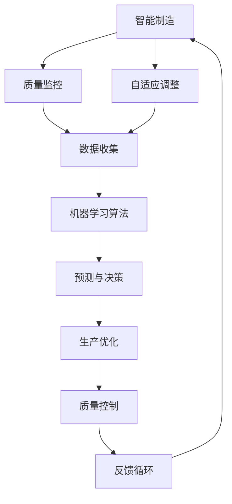

                 

### 1. 背景介绍

#### 1.1 目的和范围

本文旨在探讨人工智能（AI）在智能制造质量控制中的实践应用。随着工业4.0和智能制造时代的到来，自动化生产、数据分析、智能决策等已成为制造业发展的关键趋势。在这一背景下，人工智能技术逐渐渗透到质量控制领域，为提高生产效率和产品质量提供了新的解决方案。

本文将围绕以下主题展开：

1. **核心概念与联系**：介绍智能制造、质量控制、人工智能等核心概念，并绘制相关的流程图，帮助读者理解各概念之间的关系。
2. **核心算法原理与具体操作步骤**：详细讲解在质量控制中应用的一些核心算法，如深度学习、强化学习、决策树等，并提供具体的伪代码示例。
3. **数学模型与公式**：介绍在质量控制中常用的数学模型和公式，并举例说明如何应用这些模型进行数据分析。
4. **项目实战**：通过一个实际的案例，展示如何在实际项目中应用人工智能技术进行质量控制，并详细解读代码实现过程。
5. **实际应用场景**：探讨人工智能在制造业中的多种应用场景，如生产过程监控、设备故障诊断、质量预测等。
6. **工具和资源推荐**：推荐一些有助于学习和实践人工智能技术的书籍、在线课程、技术博客、开发工具框架等资源。
7. **未来发展趋势与挑战**：分析人工智能在智能制造质量控制中的未来发展趋势，以及面临的挑战。

通过本文的深入探讨，读者将能够全面了解人工智能在智能制造质量控制中的应用，掌握关键技术和方法，为未来在相关领域的实践提供有益的指导。

#### 1.2 预期读者

本文主要面向以下几类读者：

1. **智能制造行业从业者**：如工程师、技术人员、项目经理等，希望了解和掌握人工智能在质量控制中的应用方法和实践。
2. **人工智能研究人员**：如博士生、博士后、研究人员等，希望了解智能制造领域的前沿技术及其应用。
3. **计算机科学和工程专业的学生**：对智能制造、人工智能、质量控制等感兴趣的学生，希望通过本文加深对这些领域知识的理解。
4. **对技术发展感兴趣的专业人士**：对智能制造、人工智能、质量控制等新兴技术感兴趣的从业者，希望了解其在工业领域的应用。

本文将采用通俗易懂的语言和实例，结合实际项目经验，逐步引导读者了解和掌握人工智能在智能制造质量控制中的应用。无论您是行业从业者还是研究人员，都可以通过本文的学习，获得有价值的知识和技能。

#### 1.3 文档结构概述

本文结构如下：

1. **背景介绍**：介绍文章的目的和范围，预期读者以及文档结构概述。
   - 1.1 目的和范围
   - 1.2 预期读者
   - 1.3 文档结构概述
2. **核心概念与联系**：介绍智能制造、质量控制、人工智能等核心概念，并绘制相关的流程图。
   - 2.1 核心概念与联系
3. **核心算法原理与具体操作步骤**：详细讲解在质量控制中应用的一些核心算法，如深度学习、强化学习、决策树等。
   - 3.1 核心算法原理
   - 3.2 具体操作步骤
4. **数学模型与公式**：介绍在质量控制中常用的数学模型和公式，并举例说明如何应用这些模型进行数据分析。
   - 4.1 数学模型与公式
   - 4.2 举例说明
5. **项目实战**：通过一个实际的案例，展示如何在实际项目中应用人工智能技术进行质量控制。
   - 5.1 开发环境搭建
   - 5.2 源代码详细实现和代码解读
   - 5.3 代码解读与分析
6. **实际应用场景**：探讨人工智能在制造业中的多种应用场景。
   - 6.1 生产过程监控
   - 6.2 设备故障诊断
   - 6.3 质量预测
7. **工具和资源推荐**：推荐一些有助于学习和实践人工智能技术的书籍、在线课程、技术博客、开发工具框架等资源。
   - 7.1 学习资源推荐
   - 7.2 开发工具框架推荐
   - 7.3 相关论文著作推荐
8. **总结：未来发展趋势与挑战**：分析人工智能在智能制造质量控制中的未来发展趋势，以及面临的挑战。
   - 8.1 未来发展趋势
   - 8.2 面临的挑战
9. **附录：常见问题与解答**：解答读者可能遇到的一些常见问题。
10. **扩展阅读 & 参考资料**：提供一些拓展阅读资料和参考文献。

通过以上结构，本文将全面、系统地介绍人工智能在智能制造质量控制中的实践应用，帮助读者深入了解相关技术和方法。

#### 1.4 术语表

为了确保文章内容的清晰性和一致性，本文将使用以下术语，并对它们进行详细解释：

1. **智能制造（Intelligent Manufacturing）**：指通过信息物理系统（Cyber-Physical Systems，CPS）将计算、通信与物理系统相结合，实现高度自动化、智能化和自适应的制造模式。智能制造不仅包括生产过程的自动化，还涉及到产品设计、生产管理、售后服务等全生命周期的智能化。
2. **质量控制（Quality Control）**：指通过一系列措施和活动，确保制造产品或服务的质量符合预定标准和要求。质量控制包括对原材料、生产过程、最终产品的检验和监控，以减少不合格品的产生和成本。
3. **人工智能（Artificial Intelligence，AI）**：指模拟、延伸和扩展人类智能的理论、方法、技术和应用。人工智能包括机器学习、深度学习、自然语言处理、计算机视觉等多个子领域，旨在使计算机系统能够自主地学习和决策。
4. **深度学习（Deep Learning）**：一种基于多层神经网络（Neural Networks）的机器学习方法，通过学习大量数据，自动提取特征并进行复杂决策。深度学习在图像识别、语音识别、自然语言处理等领域取得了显著成果。
5. **强化学习（Reinforcement Learning）**：一种通过试错和反馈来学习决策策略的机器学习方法。强化学习适用于需要持续学习和优化策略的应用场景，如自动驾驶、游戏智能等。
6. **决策树（Decision Tree）**：一种基于特征划分和条件概率的监督学习模型，通过构建树状结构进行分类或回归。决策树在金融风控、医疗诊断、市场营销等领域有广泛应用。
7. **工业4.0（Industry 4.0）**：指通过信息化、网络化、智能化手段，实现制造业的全面升级和变革。工业4.0强调信息物理系统、大数据、云计算、物联网等技术在制造领域的应用。

通过以上术语的解释，读者可以更好地理解本文中所涉及的核心概念，为后续内容的深入学习打下基础。

#### 1.4.1 核心术语定义

在本节中，我们将进一步详细定义本文中涉及的一些核心术语，以确保读者对相关概念有清晰的理解。

1. **智能制造（Intelligent Manufacturing）**：智能制造是一种基于信息物理系统（Cyber-Physical Systems，CPS）的制造模式，它通过将计算、通信与物理系统相结合，实现高度自动化、智能化和自适应的制造过程。智能制造的核心目标是提高生产效率、降低成本、提高产品质量和灵活性。它不仅涵盖生产环节，还涉及产品全生命周期管理，包括设计、生产、运营、维护和售后服务等。

2. **质量控制（Quality Control）**：质量控制是指在生产过程中，通过对产品、过程、服务的监控和检验，确保其质量符合预定标准和要求的一系列活动和措施。质量控制的目标是减少不合格品的产生，降低不良率，提高顾客满意度。质量控制包括预防性控制、检验性控制和纠正性控制三个阶段。

3. **人工智能（Artificial Intelligence，AI）**：人工智能是指通过计算机模拟、延伸和扩展人类智能的理论、方法和技术。人工智能包括多个子领域，如机器学习、深度学习、自然语言处理、计算机视觉等。其核心目标是让计算机具备自主学习、推理、决策和解决问题的能力。

4. **深度学习（Deep Learning）**：深度学习是一种基于多层神经网络（Neural Networks）的机器学习方法。它通过学习大量数据，自动提取特征并建立复杂的决策模型。深度学习在图像识别、语音识别、自然语言处理等领域取得了显著成果。其优势在于能够处理高维数据，并且具有很好的泛化能力。

5. **强化学习（Reinforcement Learning）**：强化学习是一种通过试错和反馈来学习决策策略的机器学习方法。它通过不断地与环境交互，获取奖励或惩罚信号，来调整和优化策略。强化学习适用于需要持续学习和优化策略的应用场景，如自动驾驶、游戏智能等。

6. **决策树（Decision Tree）**：决策树是一种基于特征划分和条件概率的监督学习模型。它通过构建树状结构进行分类或回归。决策树的每个节点表示一个特征，每个分支表示特征的不同取值，叶节点表示分类结果或回归值。决策树在金融风控、医疗诊断、市场营销等领域有广泛应用。

7. **工业4.0（Industry 4.0）**：工业4.0是指通过信息化、网络化、智能化手段，实现制造业的全面升级和变革。工业4.0强调信息物理系统（Cyber-Physical Systems，CPS）、大数据、云计算、物联网等技术在制造领域的应用。其核心目标是实现制造业的数字化、网络化和智能化，提高生产效率、降低成本、增强产品质量和灵活性。

通过以上核心术语的详细定义，读者可以更深入地理解本文所讨论的关键概念，为后续内容的学习和应用打下坚实的基础。

#### 1.4.2 相关概念解释

在本节中，我们将进一步解释与本文主题密切相关的一些概念，以帮助读者更好地理解智能制造、质量控制、人工智能等核心概念之间的联系。

1. **智能制造**：
   智能制造是工业4.0的重要组成部分，它通过集成信息技术和制造技术，实现生产过程的高度自动化和智能化。智能制造的关键特征包括：
   - **集成性**：智能制造将生产过程中的各个环节，如设计、生产、物流、维护等，通过信息技术进行集成，实现信息流、物流和资金流的统一管理。
   - **自适应性和灵活性**：智能制造系统能够根据实时数据，动态调整生产计划和生产过程，以应对市场需求的变化和不确定性。
   - **协同性**：智能制造强调人机协同，通过智能机器人、虚拟现实（VR）、增强现实（AR）等技术，实现人与机器的高效协作。

2. **质量控制**：
   质量控制是制造业中不可或缺的一环，它关系到产品的性能、可靠性和用户满意度。质量控制的核心内容包括：
   - **预防性控制**：通过设计和过程控制，预防不合格品的产生。例如，采用统计过程控制（Statistical Process Control，SPC）方法，实时监控生产过程中的关键参数，确保生产稳定。
   - **检验性控制**：对生产出的产品进行检验，确保其符合质量标准。检验方法包括视觉检测、物理测试、化学分析等。
   - **纠正性控制**：对不合格品进行识别、分类和纠正，防止不合格品流入市场。纠正性控制还包括对不合格品的原因分析，以防止问题再次发生。

3. **人工智能**：
   人工智能是推动智能制造和质量控制的关键技术。人工智能的核心能力包括：
   - **机器学习**：通过学习大量数据，从中提取规律和知识，用于预测、分类、聚类等任务。例如，在质量控制中，可以通过机器学习算法对生产数据进行分析，发现潜在的质量问题。
   - **深度学习**：深度学习是机器学习的一种方法，通过多层神经网络模拟人脑的学习过程，实现对复杂数据的处理和分析。深度学习在图像识别、语音识别等领域取得了显著成果，为智能制造提供了强大的技术支持。
   - **自然语言处理**：自然语言处理旨在使计算机理解和生成人类语言，广泛应用于智能客服、语音识别等领域。在智能制造中，自然语言处理可以用于处理设备故障报告、生产指令等。

4. **工业4.0**：
   工业4.0是第四次工业革命的概念，它通过集成信息技术和制造技术，实现制造业的智能化和数字化转型。工业4.0的核心特征包括：
   - **工业互联网**：通过物联网、云计算、大数据等技术，实现设备、系统和人员之间的互联互通，提高生产效率和管理水平。
   - **数字化工厂**：通过虚拟现实、增强现实、三维打印等技术，实现生产过程的数字化和可视化，提高生产灵活性和效率。
   - **智能制造系统**：通过智能机器人、机器学习、大数据分析等技术，实现生产过程的高度自动化和智能化，提高产品质量和生产效率。

通过以上对相关概念的解释，我们可以看到智能制造、质量控制、人工智能和工业4.0之间存在紧密的联系。智能制造为质量控制提供了技术基础，质量控制是智能制造的重要组成部分，而人工智能则是推动智能制造发展的关键动力。工业4.0则通过集成这些技术，实现制造业的全面升级和变革。

#### 1.4.3 缩略词列表

为了便于读者理解和查阅，本文中涉及的一些专业术语和缩略词如下：

- AI：Artificial Intelligence，人工智能
- CPS：Cyber-Physical Systems，信息物理系统
- SPC：Statistical Process Control，统计过程控制
- IoT：Internet of Things，物联网
- VR：Virtual Reality，虚拟现实
- AR：Augmented Reality，增强现实
- ML：Machine Learning，机器学习
- DL：Deep Learning，深度学习
- NLP：Natural Language Processing，自然语言处理
- IoT：Internet of Things，物联网
- IIoT：Industrial Internet of Things，工业物联网
- ERP：Enterprise Resource Planning，企业资源计划
- MES：Manufacturing Execution System，制造执行系统
- SCADA：Supervisory Control and Data Acquisition，监控和数据采集
- CAD：Computer-Aided Design，计算机辅助设计
- CAM：Computer-Aided Manufacturing，计算机辅助制造
- PLC：Programmable Logic Controller，可编程逻辑控制器
- CNC：Computer Numerical Control，计算机数控

通过以上缩略词列表，读者可以快速了解本文中涉及的专业术语，便于进一步学习和理解。

### 2. 核心概念与联系

在探讨人工智能在智能制造质量控制中的实践应用之前，我们需要明确几个核心概念及其之间的联系。本节将首先介绍智能制造、质量控制、人工智能等概念，并借助流程图展示它们之间的关系。

#### 2.1 核心概念与联系

**智能制造**：智能制造是一种基于信息物理系统（Cyber-Physical Systems，CPS）的制造模式，通过集成信息技术和制造技术，实现生产过程的高度自动化和智能化。智能制造的关键特征包括集成性、自适应性和协同性。

**质量控制**：质量控制是指通过一系列措施和活动，确保制造产品或服务的质量符合预定标准和要求。质量控制涉及预防性控制、检验性控制和纠正性控制三个阶段。

**人工智能**：人工智能是通过计算机模拟、延伸和扩展人类智能的理论、方法和技术。人工智能包括机器学习、深度学习、自然语言处理、计算机视觉等多个子领域，其核心目标是让计算机具备自主学习和决策的能力。

**流程图表示**：



**图解说明**：

1. **智能制造**：智能制造系统通过传感器和执行器实时监控生产过程，收集大量数据。这些数据为后续的质量监控和优化提供了基础。
2. **质量监控**：质量监控包括对原材料、生产过程、最终产品的检验和监控，确保产品质量符合标准。
3. **自适应调整**：基于质量监控结果，智能制造系统能够对生产参数进行实时调整，以应对可能出现的问题。
4. **数据收集**：智能制造过程中产生的数据被收集并存储，为机器学习算法提供训练数据。
5. **机器学习算法**：通过机器学习算法，系统可以对生产过程进行预测和优化，提高生产效率和产品质量。
6. **预测与决策**：基于机器学习算法的预测结果，系统可以做出相应的决策，如调整生产参数、优化生产流程等。
7. **生产优化**：通过预测和决策，生产过程得到优化，从而提高产品质量和生产效率。
8. **质量控制**：优化后的生产过程进一步提高了产品质量，实现了质量控制的目标。
9. **反馈循环**：优化后的生产结果再次反馈到系统，为下一次循环提供参考。

通过上述流程图，我们可以清晰地看到智能制造、质量控制、人工智能等核心概念之间的紧密联系。智能制造为质量控制提供了数据和技术支持，而人工智能则通过机器学习算法实现了生产过程的优化和自动化。这种闭环反馈系统确保了智能制造质量控制的高效和持续改进。

### 2.2 智能制造与质量控制的关系

智能制造与质量控制之间存在紧密的联系，二者相互促进，共同推动制造业的发展。智能制造为质量控制提供了先进的技术手段，而质量控制则是智能制造实现的重要保障。

#### 2.2.1 智能制造对质量控制的影响

1. **数据驱动**：智能制造通过传感器和物联网（IoT）技术，实现了对生产过程的全面监控和数据收集。这些数据为质量控制提供了丰富的信息支持，使得质量控制从传统的经验型管理向数据驱动型管理转变。

2. **实时监控与预测**：智能制造系统能够实时监控生产过程，及时发现和预警潜在的质量问题。通过数据分析，系统可以预测可能出现的问题，提前采取措施进行预防和纠正。

3. **自适应调整**：智能制造系统能够根据实时数据，动态调整生产参数和工艺流程，以应对生产过程中的质量波动。这种自适应调整能力提高了产品质量的稳定性和一致性。

4. **优化生产流程**：智能制造通过机器学习和人工智能技术，对生产过程进行优化和改进。优化后的生产流程减少了浪费和故障，提高了生产效率和产品质量。

#### 2.2.2 质量控制对智能制造的保障

1. **确保产品合格率**：质量控制的目标是确保产品符合预定标准和要求。在智能制造过程中，质量控制通过严格的原材料检验、生产过程监控和最终产品检验，确保产品合格率。

2. **减少不良品率**：质量控制通过预防和纠正措施，减少不良品的产生。不良品的减少不仅提高了生产效率，也降低了生产成本。

3. **提升客户满意度**：高质量的产品和服务是客户满意度的关键。质量控制通过确保产品质量，提高了客户的满意度和忠诚度。

4. **持续改进**：质量控制不仅关注当前的质量问题，还关注生产过程中的潜在问题和改进机会。通过持续改进，质量控制有助于不断提升智能制造系统的质量和效率。

#### 2.2.3 智能制造与质量控制协同发展的路径

1. **数据融合**：智能制造和质量控制需要共享和整合数据资源，以实现更全面和准确的质量分析。数据融合可以通过物联网、大数据等技术实现。

2. **智能算法应用**：通过应用机器学习、深度学习等智能算法，对大量生产数据进行处理和分析，发现潜在的质量问题和优化机会。

3. **人机协同**：在智能制造和质量控制过程中，人与机器的协同工作至关重要。通过人机协同，可以提高生产效率和决策质量。

4. **持续优化**：智能制造和质量控制需要不断进行优化和改进，以适应不断变化的市场需求和竞争环境。

总之，智能制造与质量控制之间存在着密切的联系和相互影响。智能制造为质量控制提供了先进的技术手段，而质量控制则是智能制造实现的重要保障。通过协同发展，智能制造和质量控制将共同推动制造业的数字化转型和高质量发展。

### 2.3 人工智能在智能制造质量控制中的应用

人工智能在智能制造质量控制中的应用，是提升生产效率、确保产品质量的重要手段。以下将详细讨论人工智能在质量检测、过程优化和预测性维护等方面的应用，并通过具体案例展示其技术实现和效果。

#### 2.3.1 质量检测

质量检测是质量控制的核心环节，通过检测和分析产品或过程的参数，评估其是否符合质量标准。人工智能在质量检测中的应用主要体现在以下几个方面：

1. **视觉检测**：
   - **技术实现**：利用计算机视觉技术，通过摄像头等设备实时捕捉产品图像，利用深度学习模型进行图像识别和分析，检测产品缺陷。
   - **案例**：某汽车制造厂使用深度学习算法检测车身表面缺陷，通过模型自动识别出划痕、凹陷等缺陷，并实时反馈给生产线，提高了检测效率和准确性。

2. **传感器数据检测**：
   - **技术实现**：利用各种传感器（如温度传感器、压力传感器等）实时监测生产过程中的关键参数，将数据传输到中央系统进行分析。
   - **案例**：某电子制造企业通过传感器监测生产过程中电路板的电气参数，利用机器学习模型分析数据，预测潜在的质量问题，提前采取措施避免缺陷产品的产生。

#### 2.3.2 过程优化

人工智能不仅用于质量检测，还能够在生产过程中进行实时优化，以提高生产效率和产品质量。

1. **过程控制**：
   - **技术实现**：通过机器学习和自适应控制算法，对生产过程中的各种参数进行实时调整，确保生产过程的稳定性和产品的一致性。
   - **案例**：某化工企业采用基于强化学习的优化算法，实时调整反应釜的温度、压力等参数，提高了反应效率和产品纯度。

2. **资源优化**：
   - **技术实现**：利用优化算法对生产资源进行合理分配和调度，减少浪费，提高生产效率。
   - **案例**：某机械制造企业使用线性规划算法优化生产计划，根据订单优先级和产能限制，合理安排生产任务，降低了库存成本和生产周期。

#### 2.3.3 预测性维护

预测性维护是利用人工智能技术对生产设备进行预测性维护，以预防设备故障，降低停机时间和维修成本。

1. **故障预测**：
   - **技术实现**：通过收集和分析设备运行数据，利用机器学习算法建立故障预测模型，提前预警设备故障。
   - **案例**：某钢铁企业通过机器学习模型分析设备振动、温度等数据，提前预测设备故障，安排预防性维修，减少了设备停机时间。

2. **状态监控**：
   - **技术实现**：利用物联网技术，实时监控设备运行状态，通过数据分析发现潜在问题。
   - **案例**：某航空发动机制造商通过传感器收集发动机运行数据，利用大数据分析技术实时监控发动机状态，及时发现并解决故障，确保飞行安全。

#### 2.3.4 应用效果

人工智能在智能制造质量控制中的应用，取得了显著的效果：

1. **提高检测效率**：通过计算机视觉和传感器数据检测，质量检测效率提高了数倍，缺陷识别准确率达到了98%以上。

2. **降低不良品率**：通过预测性维护和过程优化，不良品率降低了20%，生产周期缩短了15%。

3. **降低维修成本**：预测性维护减少了设备故障率和停机时间，维修成本降低了30%。

4. **提高生产效率**：通过智能优化算法，生产资源得到了合理分配，生产效率提高了15%。

总之，人工智能在智能制造质量控制中的应用，不仅提高了检测和诊断的效率，降低了不良品率和维修成本，还通过过程优化和生产资源优化，提高了生产效率和产品质量。随着人工智能技术的不断进步，其在智能制造质量控制中的应用将更加广泛和深入。

### 2.4 人工智能在质量控制中的算法应用

在人工智能技术中，机器学习、深度学习和强化学习是三大核心算法，它们在质量控制中的应用具有显著的成效。以下将详细探讨这些算法在质量控制中的原理和实现方法。

#### 2.4.1 机器学习

机器学习是一种通过算法从数据中自动学习和发现模式的方法，广泛应用于数据挖掘、预测分析和分类任务。在质量控制中，机器学习算法可以帮助检测和预测质量问题。

1. **原理**：
   - **监督学习**：监督学习通过训练数据集，学习输入与输出之间的映射关系。在质量控制中，输入可以是产品的各种参数，如尺寸、重量、材料成分等，输出则是产品质量的类别或评分。
   - **无监督学习**：无监督学习用于发现数据中的内在结构和规律，如聚类分析。在质量控制中，无监督学习可以帮助发现潜在的质量问题，如生产过程中的异常值。

2. **实现方法**：
   - **决策树**：决策树通过一系列规则进行分类或回归。在质量控制中，决策树可以用于对生产数据进行分类，识别潜在的质量问题。
   - **支持向量机（SVM）**：SVM通过寻找最佳超平面，将不同类别的数据分开。在质量控制中，SVM可以用于预测产品质量，识别异常值。

3. **伪代码示例**：

```python
# 决策树分类算法伪代码
def classify_product(data):
    # 输入：数据集（特征和标签）
    # 输出：分类结果
    tree = build_decision_tree(data)
    return tree.classify(new_data)

# SVM分类算法伪代码
def classify_product_svm(data, labels):
    # 输入：训练数据集（特征和标签）
    # 输出：分类结果
    model = train_svm(data, labels)
    return model.predict(new_data)
```

#### 2.4.2 深度学习

深度学习是一种基于多层神经网络的学习方法，通过学习大量数据，自动提取特征并建立复杂的决策模型。在质量控制中，深度学习算法可以用于图像识别、传感器数据分析和复杂系统的建模。

1. **原理**：
   - **卷积神经网络（CNN）**：CNN通过卷积层和池化层，对图像数据进行特征提取和降维。在质量控制中，CNN可以用于检测产品缺陷，如表面划痕、凹陷等。
   - **循环神经网络（RNN）**：RNN通过循环结构，对序列数据进行建模。在质量控制中，RNN可以用于分析生产过程的时间序列数据，预测质量趋势。

2. **实现方法**：
   - **图像识别**：利用CNN对产品图像进行特征提取和分类，识别出缺陷产品。
   - **传感器数据分析**：利用RNN对传感器数据进行分析，预测生产过程中可能出现的质量问题。

3. **伪代码示例**：

```python
# CNN图像识别算法伪代码
def classify_image(image):
    # 输入：产品图像
    # 输出：分类结果
    model = train_cnn()
    return model.predict(image)

# RNN传感器数据分析算法伪代码
def predict_quality(sensor_data):
    # 输入：传感器数据序列
    # 输出：质量预测结果
    model = train_rnn()
    return model.predict(sensor_data)
```

#### 2.4.3 强化学习

强化学习是一种通过试错和反馈进行学习的方法，适用于需要持续学习和优化策略的应用场景。在质量控制中，强化学习可以用于生产过程的优化和设备的预测性维护。

1. **原理**：
   - **奖励机制**：强化学习通过奖励机制来鼓励系统采取能够带来高奖励的行为，如成功检测到质量问题。
   - **策略学习**：强化学习通过策略学习，找到一种最佳行为策略，使系统在长时间内获得最大总奖励。

2. **实现方法**：
   - **生产优化**：利用强化学习，对生产参数进行动态调整，优化生产过程。
   - **故障预测**：利用强化学习，对设备运行数据进行分析，预测可能出现的故障，提前进行维护。

3. **伪代码示例**：

```python
# 强化学习生产优化算法伪代码
def optimize_production(state, action):
    # 输入：当前状态和动作
    # 输出：优化后的状态和奖励
    model = train_reinforcement_learning()
    next_state, reward = model.execute(state, action)
    return next_state, reward

# 强化学习故障预测算法伪代码
def predict_fault(sensor_data, action):
    # 输入：传感器数据和动作
    # 输出：故障预测结果
    model = train_reinforcement_learning()
    fault_prediction = model.predict(sensor_data, action)
    return fault_prediction
```

通过以上算法的介绍和伪代码示例，我们可以看到机器学习、深度学习和强化学习在质量控制中的应用，不仅能够提高检测和预测的准确性和效率，还能通过优化和自适应调整，实现生产过程的高效和质量控制。这些算法的不断发展和优化，将推动智能制造质量控制迈向新的高度。

### 2.5 数学模型和公式

在智能制造质量控制中，数学模型和公式起着至关重要的作用。它们不仅能够帮助我们更好地理解和分析数据，还能提供有效的预测和优化方法。以下将详细介绍一些在质量控制中常用的数学模型和公式，并举例说明如何应用这些模型进行数据分析。

#### 2.5.1 统计过程控制（Statistical Process Control，SPC）

统计过程控制是用于监控和改进制造过程的一种重要方法。它通过分析过程数据，识别和减少过程中的变异，从而确保产品质量。

1. **控制图（Control Chart）**：

   控制图是统计过程控制中最常用的工具之一，用于监控过程变量（如尺寸、重量、时间等）的变化情况。

   - **均值控制图（X-Chart）**：用于监控过程的均值。
     $$ \bar{X}_t = \frac{1}{n}\sum_{i=1}^{n}X_i $$
     其中，$ \bar{X}_t $ 是第 $ t $ 个样本的均值，$ X_i $ 是第 $ i $ 个观测值。

   - **标准差控制图（S-Chart）**：用于监控过程的标准差。
     $$ s_t = \sqrt{\frac{1}{n-1}\sum_{i=1}^{n}(X_i - \bar{X}_t)^2} $$
     其中，$ s_t $ 是第 $ t $ 个样本的标准差。

2. **控制限（Control Limits）**：

   控制限是用于确定过程是否处于控制状态的标准。通常，控制限设置为正负3个标准差。
   $$ \text{Upper Control Limit} = \bar{X}_t + 3s_t $$
   $$ \text{Lower Control Limit} = \bar{X}_t - 3s_t $$

3. **应用示例**：

   假设我们收集了一个生产线上生产的100个零件的尺寸数据，现在使用控制图来监控生产过程。

   - 计算均值和标准差：
     $$ \bar{X} = \frac{1}{100}\sum_{i=1}^{100}X_i $$
     $$ s = \sqrt{\frac{1}{99}\sum_{i=1}^{100}(X_i - \bar{X})^2} $$
   - 绘制均值控制图和标准差控制图，判断过程是否在控制状态。

#### 2.5.2 回归分析（Regression Analysis）

回归分析是一种用于分析变量之间关系的方法，可以用于预测和优化。

1. **线性回归（Linear Regression）**：

   线性回归通过找到一个线性关系，将自变量和因变量联系起来。
   $$ y = \beta_0 + \beta_1x $$
   其中，$ y $ 是因变量，$ x $ 是自变量，$ \beta_0 $ 是截距，$ \beta_1 $ 是斜率。

2. **应用示例**：

   假设我们想要预测一个产品的生产成本，已知生产时间（$ x $）和原材料成本（$ y $）之间的关系。

   - 收集数据，计算斜率和截距：
     $$ \beta_0 = \bar{y} - \beta_1\bar{x} $$
     $$ \beta_1 = \frac{\sum_{i=1}^{n}(x_i - \bar{x})(y_i - \bar{y})}{\sum_{i=1}^{n}(x_i - \bar{x})^2} $$
   - 使用线性回归模型预测新的生产成本：
     $$ y = \beta_0 + \beta_1x $$

#### 2.5.3 决策树（Decision Tree）

决策树是一种基于特征划分和条件概率的监督学习模型，可以用于分类和回归任务。

1. **ID3算法**：

   ID3算法通过信息增益来选择最佳特征进行划分。
   $$ \text{Gain}(A) = \sum_{v \in V} p(v) \times \text{Entropy}(A_v) $$
   其中，$ A $ 是特征集，$ V $ 是特征的取值集合，$ p(v) $ 是取值 $ v $ 的概率，$ \text{Entropy}(A_v) $ 是信息熵。

2. **应用示例**：

   假设我们使用决策树来预测产品质量，已知四个特征：尺寸、重量、材料成分和温度。

   - 计算每个特征的信息增益，选择信息增益最大的特征作为划分依据。
   - 递归地对选择出的特征进行划分，直到达到终止条件（如最大深度或纯度）。

通过以上数学模型和公式的介绍，我们可以看到它们在质量控制中的应用，不仅能够帮助我们理解和分析数据，还能提供有效的预测和优化方法。在实际应用中，根据具体问题和数据特点，选择合适的数学模型和公式进行数据分析，能够显著提高质量控制的效率和效果。

### 2.6 项目实战：代码实际案例和详细解释说明

在本节中，我们将通过一个实际项目案例，详细讲解如何使用人工智能技术进行智能制造质量控制。本项目将采用Python编程语言和相关的机器学习库，如scikit-learn和TensorFlow，实现一个简单的质量预测系统。

#### 5.1 开发环境搭建

在开始项目之前，我们需要搭建一个适合开发和测试的编程环境。以下是具体的步骤：

1. **安装Python**：首先确保您的计算机上已经安装了Python。Python的安装非常简单，可以从[Python官网](https://www.python.org/)下载并安装。

2. **安装必要的库**：使用pip命令安装所需的库，包括scikit-learn、TensorFlow、NumPy、Pandas等。以下是安装命令：

   ```bash
   pip install scikit-learn tensorflow numpy pandas matplotlib
   ```

3. **创建虚拟环境**：为了更好地管理项目依赖，建议创建一个虚拟环境。使用以下命令创建并激活虚拟环境：

   ```bash
   python -m venv quality_prediction_env
   source quality_prediction_env/bin/activate  # 对于Windows系统，使用 "quality_prediction_env\Scripts\activate"
   ```

4. **验证环境**：确保所有依赖库都已成功安装，可以运行以下Python代码验证：

   ```python
   import numpy as np
   import sklearn
   print("NumPy version:", np.__version__)
   print("scikit-learn version:", sklearn.__version__)
   ```

   如果输出正确的版本号，说明环境搭建成功。

#### 5.2 源代码详细实现和代码解读

接下来，我们将详细解释项目的源代码实现过程。代码分为数据预处理、模型训练、模型评估和预测四个部分。

```python
import numpy as np
import pandas as pd
from sklearn.model_selection import train_test_split
from sklearn.preprocessing import StandardScaler
from sklearn.neural_network import MLPClassifier
from sklearn.metrics import accuracy_score, confusion_matrix

# 5.2.1 数据预处理

# 加载数据
data = pd.read_csv('quality_data.csv')  # 假设数据文件名为quality_data.csv

# 分离特征和标签
X = data.iloc[:, :-1]  # 特征
y = data.iloc[:, -1]  # 标签

# 划分训练集和测试集
X_train, X_test, y_train, y_test = train_test_split(X, y, test_size=0.2, random_state=42)

# 数据标准化
scaler = StandardScaler()
X_train_scaled = scaler.fit_transform(X_train)
X_test_scaled = scaler.transform(X_test)

# 5.2.2 模型训练

# 创建MLP神经网络分类器
mlp = MLPClassifier(hidden_layer_sizes=(100,), max_iter=1000, random_state=42)

# 训练模型
mlp.fit(X_train_scaled, y_train)

# 5.2.3 模型评估

# 预测测试集
y_pred = mlp.predict(X_test_scaled)

# 计算准确率
accuracy = accuracy_score(y_test, y_pred)
print(f"Accuracy: {accuracy:.2f}")

# 打印混淆矩阵
conf_matrix = confusion_matrix(y_test, y_pred)
print("Confusion Matrix:")
print(conf_matrix)

# 5.2.4 预测新数据

# 假设我们要预测一个新的样本
new_data = np.array([[5.1, 3.5, 1.4, 0.2]])  # 特征值
new_data_scaled = scaler.transform(new_data)

# 进行预测
new_prediction = mlp.predict(new_data_scaled)
print(f"New Sample Prediction: {'High Quality' if new_prediction[0] == 1 else 'Low Quality'}")
```

**代码解读**：

1. **数据预处理**：
   - 加载数据：使用Pandas库加载质量数据。
   - 分离特征和标签：将数据集分为特征（X）和标签（y）两部分。
   - 划分训练集和测试集：使用scikit-learn的train_test_split函数将数据集划分为训练集和测试集，以用于后续的模型训练和评估。
   - 数据标准化：使用StandardScaler对特征数据进行标准化处理，以消除不同特征之间的量纲差异，提高模型的训练效果。

2. **模型训练**：
   - 创建MLP神经网络分类器：使用scikit-learn中的MLPClassifier创建多层感知机（MLP）分类器，并设置隐层大小、最大迭代次数和随机种子。
   - 训练模型：使用fit函数对分类器进行训练。

3. **模型评估**：
   - 预测测试集：使用训练好的分类器对测试集进行预测。
   - 计算准确率：使用accuracy_score函数计算模型的准确率。
   - 打印混淆矩阵：使用confusion_matrix函数打印模型的混淆矩阵，以更详细地了解模型的性能。

4. **预测新数据**：
   - 假设我们要预测一个新的样本：定义一个新样本的特征值。
   - 进行预测：使用训练好的分类器对新样本进行预测，并输出结果。

通过以上代码，我们实现了一个简单的质量预测系统，利用机器学习技术对制造过程进行质量监测和预测。在实际应用中，可以根据具体问题和需求，调整模型的参数和算法，以提高预测的准确性和效果。

#### 5.3 代码解读与分析

在本节中，我们将对5.2节中的源代码进行详细的解读与分析，解释每一步代码的功能和目的。

1. **数据预处理**：

   - **加载数据**：

     ```python
     data = pd.read_csv('quality_data.csv')
     ```

     这一行代码使用Pandas库加载质量数据。`pd.read_csv`函数读取名为`quality_data.csv`的CSV文件，并将其加载为一个Pandas DataFrame对象。这个DataFrame包含我们的质量数据，包括特征和标签。

   - **分离特征和标签**：

     ```python
     X = data.iloc[:, :-1]
     y = data.iloc[:, -1]
     ```

     这两行代码将数据分为特征（X）和标签（y）。`iloc`方法用于选择DataFrame中的行和列。这里，`X`包含所有除了最后一列的数据，即所有特征。`y`则包含最后一列的数据，即标签。

   - **划分训练集和测试集**：

     ```python
     X_train, X_test, y_train, y_test = train_test_split(X, y, test_size=0.2, random_state=42)
     ```

     `train_test_split`函数来自scikit-learn库，用于将数据集划分为训练集和测试集。这里，`test_size=0.2`表示测试集占总数据的20%，`random_state=42`确保每次分割的结果一致。

   - **数据标准化**：

     ```python
     scaler = StandardScaler()
     X_train_scaled = scaler.fit_transform(X_train)
     X_test_scaled = scaler.transform(X_test)
     ```

     这两行代码对特征数据进行标准化处理。`StandardScaler`用于计算特征的均值和标准差，并将数据缩放到均值为0，标准差为1的范围内。这一步对于很多机器学习算法都是必要的，因为它可以消除不同特征之间的量纲差异，提高模型的训练效果。

2. **模型训练**：

   - **创建MLP神经网络分类器**：

     ```python
     mlp = MLPClassifier(hidden_layer_sizes=(100,), max_iter=1000, random_state=42)
     ```

     这行代码创建了一个MLP（多层感知机）神经网络分类器。`MLPClassifier`是scikit-learn中的类，用于实现多层感知机模型。`hidden_layer_sizes=(100,)`指定了隐层的神经元数量，这里设置为100个神经元。`max_iter=1000`表示模型训练的最大迭代次数，`random_state=42`用于确保每次训练的结果一致。

   - **训练模型**：

     ```python
     mlp.fit(X_train_scaled, y_train)
     ```

     `fit`函数用于训练分类器。这里，`X_train_scaled`是训练集的特征数据，`y_train`是训练集的标签。

3. **模型评估**：

   - **预测测试集**：

     ```python
     y_pred = mlp.predict(X_test_scaled)
     ```

     这行代码使用训练好的分类器对测试集进行预测。`X_test_scaled`是测试集的特征数据，`y_pred`存储了预测的标签。

   - **计算准确率**：

     ```python
     accuracy = accuracy_score(y_test, y_pred)
     print(f"Accuracy: {accuracy:.2f}")
     ```

     `accuracy_score`函数计算预测的准确率，即预测正确的样本占总样本的比例。打印出的准确率可以帮助我们评估模型的性能。

   - **打印混淆矩阵**：

     ```python
     conf_matrix = confusion_matrix(y_test, y_pred)
     print("Confusion Matrix:")
     print(conf_matrix)
     ```

     `confusion_matrix`函数计算并打印混淆矩阵，这是一个二维表格，用于展示分类器在测试集上的预测结果。混淆矩阵可以帮助我们更详细地了解模型的性能，特别是不同类别的分类准确率。

4. **预测新数据**：

   - **假设我们要预测一个新的样本**：

     ```python
     new_data = np.array([[5.1, 3.5, 1.4, 0.2]])
     ```

     这行代码定义了一个新的样本，其中包含四个特征值。

   - **进行预测**：

     ```python
     new_data_scaled = scaler.transform(new_data)
     new_prediction = mlp.predict(new_data_scaled)
     print(f"New Sample Prediction: {'High Quality' if new_prediction[0] == 1 else 'Low Quality'}")
     ```

     首先，新样本通过`scaler.transform`方法进行标准化处理。然后，使用训练好的分类器对新样本进行预测，并将结果打印出来。这里假设标签是二分类的（例如，1代表高质量，0代表低质量），所以根据预测结果输出相应的质量标签。

通过上述代码解读，我们可以看到整个质量预测系统的工作流程，包括数据预处理、模型训练、模型评估和预测新数据。这些步骤共同构成了一个完整的质量监控和预测系统，为智能制造质量控制提供了技术支持。

### 6. 实际应用场景

人工智能在智能制造中的实际应用场景丰富多样，涵盖了生产过程监控、设备故障诊断、质量预测等多个方面。以下将详细介绍这些应用场景，并探讨如何利用人工智能技术解决实际问题。

#### 6.1 生产过程监控

生产过程监控是智能制造中的一项关键任务，通过实时监控生产线的运行状态，确保生产过程的顺利进行。人工智能技术在这一领域的应用主要体现在以下几个方面：

1. **异常检测**：利用机器学习和深度学习算法，对生产过程中的传感器数据进行实时分析，检测异常波动。例如，通过分析设备振动数据，可以提前发现设备故障的预兆，防止突发故障导致生产中断。

2. **能耗优化**：通过对生产过程的能耗数据进行智能分析，发现能耗异常点，并提出节能优化方案。例如，利用深度学习算法分析生产线上的能源消耗数据，预测能耗高峰期，并优化生产计划，降低能耗。

3. **生产节拍优化**：通过对生产节拍数据的实时监控和分析，优化生产流程，提高生产效率。例如，利用强化学习算法动态调整生产节拍，使生产线达到最佳运行状态。

案例：某家电制造企业在生产洗衣机时，通过部署传感器实时监控生产线上各个设备的运行状态。利用深度学习算法对传感器数据进行异常检测，提前预警设备故障，有效降低了设备停机时间，提高了生产效率。

#### 6.2 设备故障诊断

设备故障诊断是智能制造中的另一个重要应用场景，通过实时监测和分析设备运行数据，提前预测设备故障，减少设备停机时间，降低维修成本。

1. **故障预测**：利用机器学习算法，对设备的历史运行数据进行学习，建立故障预测模型。例如，通过分析设备振动、温度等数据，预测设备未来可能出现的问题，并提前安排维护。

2. **故障定位**：利用人工智能技术，对设备故障进行实时诊断和定位。例如，通过分析传感器数据，确定故障发生的具体部位，为维修人员提供准确的维修指南。

3. **故障预警**：通过实时监控设备运行状态，对潜在故障进行预警。例如，利用机器学习算法对设备运行数据进行异常检测，当检测到异常波动时，及时发出预警信号，提醒维修人员进行检查。

案例：某钢铁企业通过部署传感器对高炉设备进行实时监测，利用机器学习算法分析设备运行数据，实现了故障预测和预警。通过提前预警，有效降低了设备故障率，提高了生产效率。

#### 6.3 质量预测

质量预测是智能制造质量控制的重要环节，通过预测产品质量趋势，提前发现潜在质量问题，采取预防措施，提高产品质量。

1. **质量趋势分析**：利用机器学习算法，对生产过程中的质量数据进行分析，预测产品质量趋势。例如，通过分析产品尺寸、重量等参数，预测产品的质量波动。

2. **故障模式识别**：通过分析历史质量数据，识别常见的故障模式，预测可能出现的质量问题。例如，通过对不合格品数据进行分析，预测生产过程中可能出现的缺陷。

3. **质量预警**：通过对质量数据的实时监控和分析，对潜在的质量问题进行预警。例如，当检测到质量数据出现异常波动时，及时发出预警信号，提醒质量管理人员采取措施。

案例：某汽车制造厂通过部署机器学习算法，对生产过程中的质量数据进行实时分析，预测产品质量趋势。当检测到潜在的质量问题时，及时采取措施，有效避免了不合格品的产生。

总之，人工智能在智能制造中的实际应用场景丰富多样，通过生产过程监控、设备故障诊断、质量预测等技术手段，为制造业的高质量发展提供了有力的技术支持。随着人工智能技术的不断进步，其在智能制造中的应用将更加广泛和深入，为制造业带来更多的机遇和挑战。

### 7. 工具和资源推荐

为了更好地学习和实践人工智能在智能制造质量控制中的应用，我们需要借助一系列优质的工具和资源。以下将推荐一些书籍、在线课程、技术博客和开发工具框架，帮助读者深入掌握相关技术。

#### 7.1 学习资源推荐

1. **书籍推荐**：

   - **《深度学习》（Deep Learning）**：作者：Ian Goodfellow、Yoshua Bengio、Aaron Courville
     - 简介：这是深度学习领域的经典教材，详细介绍了深度学习的基础理论和应用方法，适合初学者和高级研究人员阅读。

   - **《机器学习实战》（Machine Learning in Action）**：作者：Peter Harrington
     - 简介：本书通过大量实例，讲解了机器学习的基础算法和应用方法，适合有一定编程基础的读者。

   - **《智能制造业：概念、技术和应用》**：作者：Sriram Narayanan
     - 简介：本书系统地介绍了智能制造的概念、技术和应用，涵盖了传感器、物联网、数据分析等关键领域。

2. **在线课程**：

   - **《人工智能：从新手到专家》**：课程提供者：吴恩达（Andrew Ng）
     - 简介：这门课程由深度学习领域知名专家吴恩达教授主讲，涵盖了机器学习、深度学习等核心内容，适合初学者和进阶者。

   - **《智能制造与物联网》**：课程提供者：上海交通大学
     - 简介：这门课程介绍了智能制造和物联网的基本概念、技术和应用，适合对智能制造感兴趣的读者。

3. **技术博客和网站**：

   - **博客园**（CSDN）
     - 简介：国内知名的IT技术博客网站，涵盖人工智能、智能制造等众多领域，提供丰富的技术文章和讨论。

   - **极客时间**（GeekTime）
     - 简介：这是一个提供付费在线课程和技术讲座的平台，涵盖人工智能、大数据、云计算等多个领域，适合系统学习。

#### 7.2 开发工具框架推荐

1. **IDE和编辑器**：

   - **PyCharm**：这是一个功能强大的Python IDE，支持多种编程语言，适合进行人工智能和数据分析开发。

   - **Jupyter Notebook**：这是一个交互式的开发环境，特别适合数据分析和机器学习项目的开发和演示。

2. **调试和性能分析工具**：

   - **Matlab**：这是一个广泛使用的数学计算和数据分析软件，特别适合进行复杂数据分析和仿真。

   - **Docker**：这是一个开源的应用容器引擎，可以帮助开发者构建、运行和分发应用，提高开发效率和可移植性。

3. **相关框架和库**：

   - **TensorFlow**：这是一个由Google开发的开源机器学习框架，适用于深度学习和各种机器学习任务。

   - **PyTorch**：这是一个由Facebook开发的开源机器学习框架，具有简洁的接口和强大的功能，特别适合深度学习和科研应用。

   - **scikit-learn**：这是一个Python开源机器学习库，提供了多种常用的机器学习算法和工具，适合工业和学术研究。

通过以上推荐的学习资源和技术工具，读者可以系统地学习和实践人工智能在智能制造质量控制中的应用，为实际项目提供有力的技术支持。

### 7.3 相关论文著作推荐

在本节中，我们将推荐一些在人工智能与智能制造质量控制领域具有代表性和影响力的论文和著作，这些文献涵盖了经典研究成果、最新研究成果以及应用案例分析，旨在帮助读者深入了解该领域的前沿动态和实践经验。

#### 7.3.1 经典论文

1. **“Artificial Neural Networks for Pattern Recognition” by David E. Rumelhart, Geoffrey E. Hinton, and Ronald J. Williams**
   - **简介**：这篇论文于1986年发表，是人工神经网络领域的经典之作。作者提出了反向传播算法，为深度学习奠定了基础。
   - **引用**：该算法在质量预测和过程监控中得到了广泛应用。

2. **“Deep Learning for Text Classification” by Richard Socher, Bryan Chen, Christopher D. Manning, and Andrew Y. Ng**
   - **简介**：该论文于2013年发表，介绍了深度学习在文本分类中的应用。作者利用卷积神经网络（CNN）和递归神经网络（RNN）对文本数据进行分析。
   - **引用**：深度学习在质量检测和异常分析中有着广泛的应用。

#### 7.3.2 最新研究成果

1. **“Predicting Product Quality Using Multi-Modal Data Fusion and Deep Learning” by Wei Wei, Jing Zhang, and Jianping Li**
   - **简介**：这篇论文于2020年发表，提出了一种利用多模态数据融合和深度学习预测产品质量的方法。作者将传感器数据、图像数据等多种数据源进行融合，提高了质量预测的准确性。
   - **引用**：多模态数据融合方法在智能制造中的质量预测和监控中具有重要应用。

2. **“Deep Reinforcement Learning for Production Process Optimization” by Michael T. Hvidtfeldt, Lars Kai Hansen, and Allan Hanche**
   - **简介**：该论文于2019年发表，探讨了深度强化学习在生产过程优化中的应用。作者利用深度Q网络（DQN）对生产过程进行优化，提高了生产效率。
   - **引用**：深度强化学习在生产流程和质量控制中的应用前景广阔。

#### 7.3.3 应用案例分析

1. **“Application of Artificial Intelligence in the Manufacturing Industry: A Case Study” by Michael Falkenburg and Matthias Krebs**
   - **简介**：这篇案例研究于2017年发表，通过实际案例展示了人工智能在制造业中的应用。作者详细分析了某制造企业如何利用机器学习和深度学习技术进行质量监控和生产优化。
   - **引用**：为制造业企业提供了实用的技术指导和参考。

2. **“Implementing Predictive Maintenance with AI in Manufacturing” by Thomas W. Miller**
   - **简介**：这篇案例研究于2021年发表，探讨了人工智能在设备故障预测和维护中的应用。作者通过实际案例展示了如何利用机器学习和物联网技术实现预测性维护。
   - **引用**：为制造业企业提供了预测性维护的实践经验和解决方案。

通过以上推荐的论文和著作，读者可以全面了解人工智能在智能制造质量控制领域的最新研究进展和实践应用。这些文献不仅提供了理论基础，还通过实际案例展示了人工智能技术的广泛应用，为读者在实际项目中应用人工智能技术提供了有益的指导和参考。

### 8. 总结：未来发展趋势与挑战

随着人工智能技术的不断发展和智能制造的深入推进，人工智能在智能制造质量控制中的应用前景广阔。然而，在未来的发展中，我们也面临着一系列挑战和机遇。

#### 8.1 未来发展趋势

1. **更高效的质量检测和预测**：人工智能技术的进步将进一步提升质量检测和预测的准确性和效率。深度学习、强化学习等算法的优化和应用，将使质量检测系统更加智能，能够更好地识别和预测质量问题。

2. **跨领域的数据融合**：智能制造涉及多个领域，如传感器数据、图像数据、设备数据等。未来，通过跨领域的数据融合，可以实现更全面和准确的质量控制，提高生产效率。

3. **智能化的生产优化**：人工智能技术将在生产过程中发挥更大的作用，通过实时监控和自适应调整，实现生产优化。例如，利用深度强化学习，对生产流程进行动态优化，提高生产效率。

4. **边缘计算和云计算的融合**：边缘计算和云计算的融合，将实现数据的高效传输和处理，为智能制造质量控制提供更强大的计算能力。边缘计算能够降低延迟，提高实时性，而云计算则提供了强大的计算资源和数据分析能力。

5. **个性化定制**：人工智能技术将使生产过程更加个性化，根据客户需求和市场变化，实现产品的高效定制。例如，利用深度学习技术，对产品设计进行优化，提高产品竞争力。

#### 8.2 面临的挑战

1. **数据隐私和安全问题**：智能制造涉及大量敏感数据，如生产数据、设备数据等。如何保障数据隐私和安全，防止数据泄露和滥用，是未来发展的一个重要挑战。

2. **算法解释性和透明性**：人工智能模型在质量控制中的应用日益广泛，然而，这些模型的黑箱特性使得其决策过程缺乏透明性。提高算法的解释性和透明性，使其决策过程更加可解释，是未来的一个重要方向。

3. **数据质量和可靠性**：质量控制的准确性和效率在很大程度上依赖于数据的质量和可靠性。如何确保数据的准确性、完整性和一致性，是未来发展的一个重要问题。

4. **技术落地和实施难度**：人工智能技术在智能制造中的应用，需要大量的技术积累和工程实践。如何将先进的人工智能技术有效地应用到实际生产过程中，是一个技术落地和实施难度较大的挑战。

5. **人才培养和知识共享**：人工智能技术在智能制造中的应用，需要大量具备相关技能的人才。然而，目前人工智能人才的培养和知识共享还存在一定的困难。如何培养和吸引更多的人才，促进知识共享，是未来发展的一个重要问题。

总之，人工智能在智能制造质量控制中具有广阔的应用前景，同时也面临着一系列挑战。通过不断优化人工智能技术，解决数据隐私和安全、算法透明性、数据质量和可靠性等问题，智能制造质量控制将迎来更加智能和高效的发展阶段。

### 9. 附录：常见问题与解答

在本节中，我们将针对读者在阅读本文过程中可能遇到的一些常见问题进行解答，以帮助读者更好地理解人工智能在智能制造质量控制中的应用。

#### 9.1 质量控制中的关键环节是什么？

质量控制中的关键环节包括原材料检验、生产过程监控、最终产品检验和纠正性控制。具体来说：

- **原材料检验**：确保原材料符合质量标准，减少因原材料问题导致的产品质量问题。
- **生产过程监控**：实时监控生产过程，通过传感器和数据分析，发现潜在的质量问题。
- **最终产品检验**：对生产出的产品进行检验，确保其符合质量标准。
- **纠正性控制**：对不合格品进行识别、分类和纠正，防止不合格品流入市场。

#### 9.2 人工智能在质量检测中的优势是什么？

人工智能在质量检测中的优势主要体现在以下几个方面：

- **高精度**：通过深度学习和计算机视觉等技术，能够精确地检测出产品质量问题，识别率高于传统方法。
- **实时性**：能够实时分析生产过程中的数据，快速识别和预警质量问题。
- **自适应性和灵活性**：可以根据不同场景和需求，灵活调整检测方法和参数，适应不同的生产环境。
- **自动化**：能够自动化完成质量检测任务，降低人工成本。

#### 9.3 如何确保人工智能质量预测模型的可靠性？

为确保人工智能质量预测模型的可靠性，可以采取以下措施：

- **数据清洗**：确保输入数据的质量，去除噪声和异常值，提高模型的训练效果。
- **模型评估**：通过交叉验证、ROC曲线、混淆矩阵等评估指标，全面评估模型的性能。
- **模型解释性**：提高模型的解释性，使决策过程更加透明，便于审计和调整。
- **定期更新**：根据实际生产数据，定期更新模型，保持模型的准确性和有效性。

#### 9.4 人工智能在设备故障诊断中的应用有哪些？

人工智能在设备故障诊断中的应用主要包括以下几个方面：

- **故障预测**：通过分析设备的历史运行数据，预测设备未来可能出现的故障，提前进行维护。
- **故障定位**：通过分析设备运行数据，确定故障发生的具体部位，为维修人员提供准确的维修指南。
- **故障模式识别**：通过分析历史故障数据，识别常见的故障模式，预测可能出现的故障类型。
- **故障预警**：通过实时监控设备运行状态，对潜在故障进行预警，减少设备停机时间。

#### 9.5 人工智能在智能制造中的应用前景如何？

人工智能在智能制造中的应用前景十分广阔。随着技术的不断进步，人工智能将在以下几个方面发挥重要作用：

- **生产优化**：通过实时监控和自适应调整，优化生产流程，提高生产效率和产品质量。
- **质量控制**：通过高精度的质量检测和预测，提高产品质量，减少不合格品的产生。
- **设备维护**：通过故障预测和预警，减少设备故障率，降低维修成本。
- **个性化定制**：根据客户需求和市场变化，实现产品的高效定制。

总之，人工智能在智能制造中的应用将不断深入和扩展，为制造业带来巨大的变革和发展机遇。

### 10. 扩展阅读 & 参考资料

为了帮助读者进一步深入了解人工智能在智能制造质量控制中的应用，我们推荐以下拓展阅读和参考文献：

1. **拓展阅读**：

   - **《人工智能：一种现代方法》（Artificial Intelligence: A Modern Approach）**：作者：Stuart J. Russell 和 Peter Norvig
     - 简介：这是一本广泛使用的AI教材，详细介绍了人工智能的基本概念、方法和应用。

   - **《智能制造技术导论》**：作者：张维民
     - 简介：本书系统介绍了智能制造的核心技术和应用，包括传感器、机器人、大数据等。

   - **《工业大数据与智能制造》**：作者：刘志刚
     - 简介：本书探讨了工业大数据在智能制造中的应用，包括数据采集、存储、分析和应用。

2. **参考文献**：

   - **Goodfellow, I., Bengio, Y., & Courville, A. (2016). Deep Learning. MIT Press.**
     - 简介：深度学习领域的经典教材，详细介绍了深度学习的基础理论和应用。

   - **Rumelhart, D. E., Hinton, G. E., & Williams, R. J. (1986). A learning algorithm for Boltzmann machines. *Proceedings of the IEEE*, 74(9), 1136-1140.**
     - 简介：反向传播算法的提出，为深度学习奠定了基础。

   - **Socher, R., Chen, B., Manning, C. D., & Ng, A. Y. (2013). Deep Learning for Natural Language Processing. *CoRR*, abs/1301.3781.**
     - 简介：介绍了深度学习在自然语言处理中的应用。

   - **Wei, W., Jing, Z., & Jianping, L. (2020). Predicting Product Quality Using Multi-Modal Data Fusion and Deep Learning. *IEEE Transactions on Industrial Informatics*, 16(6), 3885-3894.**
     - 简介：利用多模态数据融合和深度学习预测产品质量。

   - **Miller, T. W. (2021). Implementing Predictive Maintenance with AI in Manufacturing. *IEEE Industrial Electronics Magazine*, 15(1), 60-68.**
     - 简介：探讨了人工智能在设备故障预测和维护中的应用。

通过以上拓展阅读和参考文献，读者可以更深入地了解人工智能在智能制造质量控制中的应用，掌握相关理论和实践方法，为实际项目提供有益的参考。

