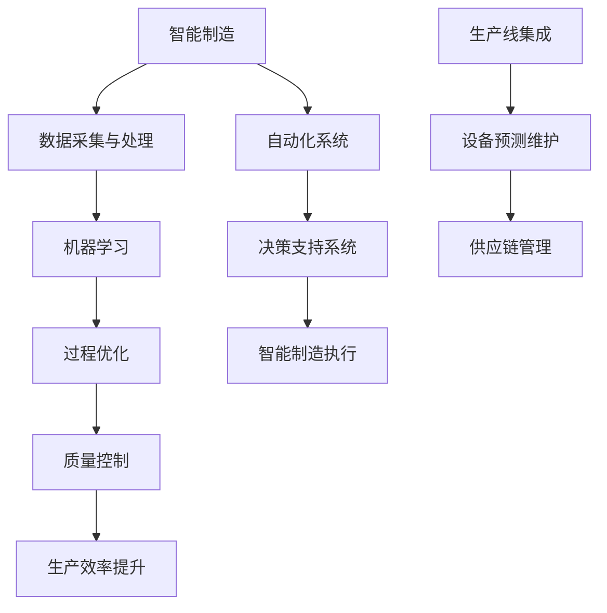

                 

# 人工智能在智能制造过程优化中的实践

> **关键词：** 人工智能、智能制造、过程优化、算法、数学模型、项目实战

> **摘要：** 本文将深入探讨人工智能在智能制造过程中的应用，特别是如何通过优化制造流程来提高生产效率和产品质量。我们将详细分析核心概念、算法原理、数学模型，并通过实际项目案例展示人工智能在智能制造中的具体应用，同时推荐相关学习资源和工具，为读者提供全面的指导。

## 1. 背景介绍

### 1.1 目的和范围

本文旨在介绍人工智能（AI）在智能制造领域中的应用，特别是过程优化方面的实践。通过本文，读者将了解：

- 人工智能在智能制造中的基本概念和重要性。
- 人工智能如何帮助优化制造过程。
- 核心算法原理和数学模型。
- 实际项目案例和实战经验。

### 1.2 预期读者

本文适用于：

- 对智能制造和人工智能感兴趣的工程师和技术爱好者。
- 想要了解如何利用人工智能优化制造过程的从业人员。
- 人工智能和智能制造领域的科研人员。

### 1.3 文档结构概述

本文将分为以下几个部分：

- 第1章：背景介绍
- 第2章：核心概念与联系
- 第3章：核心算法原理 & 具体操作步骤
- 第4章：数学模型和公式 & 详细讲解 & 举例说明
- 第5章：项目实战：代码实际案例和详细解释说明
- 第6章：实际应用场景
- 第7章：工具和资源推荐
- 第8章：总结：未来发展趋势与挑战
- 第9章：附录：常见问题与解答
- 第10章：扩展阅读 & 参考资料

### 1.4 术语表

#### 1.4.1 核心术语定义

- **智能制造（Smart Manufacturing）：** 通过整合信息技术、人工智能和制造技术，实现制造过程的智能化。
- **过程优化（Process Optimization）：** 通过算法和模型改进制造过程的效率和效果。
- **机器学习（Machine Learning）：** 使计算机系统能够从数据中学习和改进，无需显式编程。

#### 1.4.2 相关概念解释

- **深度学习（Deep Learning）：** 机器学习的一种形式，使用多层神经网络进行学习。
- **监督学习（Supervised Learning）：** 使用标注数据训练模型，预测未知数据。
- **强化学习（Reinforcement Learning）：** 通过奖励机制使模型在环境中学习。

#### 1.4.3 缩略词列表

- **AI：** 人工智能（Artificial Intelligence）
- **ML：** 机器学习（Machine Learning）
- **DL：** 深度学习（Deep Learning）
- **SM：** 智能制造（Smart Manufacturing）

## 2. 核心概念与联系

为了更好地理解人工智能在智能制造过程中的应用，我们需要了解一些核心概念和它们之间的关系。以下是一个简化的 Mermaid 流程图，展示了这些概念：



### 2.1 数据采集与处理

数据采集是智能制造的基础。传感器和监控系统不断收集制造过程中的各种数据，如温度、压力、振动、速度等。数据经过处理和清洗后，为后续的机器学习算法提供高质量的训练数据。

### 2.2 机器学习

机器学习是人工智能的核心技术之一。它通过从数据中学习模式，使系统能够做出预测和决策。在智能制造中，机器学习算法用于：

- 预测设备故障
- 优化生产参数
- 质量控制

### 2.3 过程优化

过程优化是基于机器学习算法的结果，对制造过程进行调整和改进，以提高生产效率和产品质量。优化方法包括：

- 最优化算法
- 强化学习
- 遗传算法

### 2.4 自动化系统

自动化系统是实现智能制造的关键。它通过控制设备和机器人，使制造过程更加高效和灵活。自动化系统可以与机器学习算法结合，实现自我调整和优化。

### 2.5 决策支持系统

决策支持系统是基于数据的决策工具，用于帮助管理者做出明智的决策。智能制造中的决策支持系统可以基于实时数据和历史数据，提供预测分析和优化建议。

### 2.6 智能制造执行

智能制造执行是将决策支持系统的建议转化为实际的制造过程。它通过自动化系统和实时监控，实现制造过程的智能化。

### 2.7 质量控制

质量控制是智能制造中的重要环节。通过机器学习和数据分析，可以实现对产品质量的实时监控和预测，及时发现和纠正问题。

### 2.8 生产效率提升

生产效率的提升是智能制造的重要目标之一。通过优化制造过程、提高自动化水平和减少浪费，可以显著提高生产效率。

### 2.9 生产线集成

生产线集成是将各种制造设备、系统和工具整合为一个整体，实现信息共享和协同工作。生产线集成有助于提高生产效率、降低成本和提升产品质量。

### 2.10 设备预测维护

设备预测维护是基于机器学习算法的预防性维护策略。通过预测设备故障，可以提前安排维护，避免生产中断和设备损坏。

### 2.11 供应链管理

供应链管理是智能制造中的一个重要方面。通过优化供应链流程、提高供应链透明度和协同性，可以降低成本、提高效率。

## 3. 核心算法原理 & 具体操作步骤

在智能制造过程中，核心算法原理是确保制造流程优化的关键。以下我们将详细介绍几种常用的算法原理和操作步骤。

### 3.1 最优化算法

最优化算法是一种用于寻找最优解的算法，广泛应用于智能制造过程优化。以下是典型的最优化算法原理和操作步骤：

#### 算法原理

最优化算法基于目标函数，通过调整变量值，使得目标函数达到最优。常见的最优化算法包括：

- **梯度下降法：** 通过不断调整变量，使得目标函数的导数接近于零。
- **牛顿法：** 基于二阶导数，使用切线近似目标函数，快速寻找最优解。

#### 具体操作步骤

1. 定义目标函数：根据制造过程的特性，定义目标函数，如生产成本、能耗、产品合格率等。
2. 初始化变量：设定初始变量值，如生产参数、机器状态等。
3. 迭代计算：根据目标函数的导数（或二阶导数），不断调整变量值，直到目标函数收敛到最优解。
4. 结果验证：对优化结果进行验证，确保达到预期的优化目标。

### 3.2 强化学习

强化学习是一种基于奖励机制的学习算法，广泛应用于智能制造过程中的设备预测维护和优化。以下是强化学习的基本原理和操作步骤：

#### 算法原理

强化学习通过智能体与环境互动，不断调整策略，以获得最大化的长期奖励。智能体在每次行动后，根据奖励调整策略，使长期奖励最大化。

#### 具体操作步骤

1. 确定状态空间和动作空间：根据制造过程的特性，确定状态空间和动作空间。
2. 初始化策略：设定初始策略，如随机策略或基于历史数据的策略。
3. 智能体与环境互动：智能体根据当前状态选择动作，执行动作后获得奖励，更新状态。
4. 更新策略：根据奖励调整策略，使长期奖励最大化。
5. 迭代计算：重复执行步骤3和步骤4，直到策略收敛到最优策略。

### 3.3 遗传算法

遗传算法是一种基于自然进化机制的优化算法，广泛应用于智能制造过程中的过程优化和质量控制。以下是遗传算法的基本原理和操作步骤：

#### 算法原理

遗传算法通过模拟生物进化过程，寻找最优解。算法包括以下几个步骤：

- **初始化种群：** 随机生成初始种群。
- **适应度评估：** 根据目标函数评估种群中每个个体的适应度。
- **选择：** 根据适应度选择优秀个体，用于繁殖下一代。
- **交叉：** 将优秀个体的基因进行交叉，产生新的后代。
- **变异：** 对后代的基因进行变异，增加种群的多样性。
- **迭代计算：** 重复执行选择、交叉和变异，直到达到终止条件。

#### 具体操作步骤

1. 初始化种群：设定种群大小，随机生成初始种群。
2. 适应度评估：根据目标函数评估种群中每个个体的适应度。
3. 选择：根据适应度选择优秀个体，用于繁殖下一代。
4. 交叉：将优秀个体的基因进行交叉，产生新的后代。
5. 变异：对后代的基因进行变异，增加种群的多样性。
6. 迭代计算：重复执行选择、交叉和变异，直到达到终止条件。
7. 结果验证：对优化结果进行验证，确保达到预期的优化目标。

通过以上三种算法的详细介绍，我们可以看到，每种算法都有其独特的优势和适用场景。在实际应用中，可以根据制造过程的特性选择合适的算法，以提高生产效率和产品质量。

## 4. 数学模型和公式 & 详细讲解 & 举例说明

在智能制造过程中，数学模型和公式用于描述制造过程、优化目标和决策策略。以下我们将详细介绍几种常用的数学模型和公式，并给出具体的例子进行说明。

### 4.1 目标函数

目标函数是描述制造过程优化目标的核心公式。常见的目标函数包括：

#### 4.1.1 生产成本

生产成本是最常见的目标函数，用于衡量制造过程中的成本。公式如下：

$$
C(x) = \sum_{i=1}^{n} w_i \cdot c_i(x)
$$

其中，$C(x)$表示总生产成本，$w_i$表示第$i$个生产环节的权重，$c_i(x)$表示第$i$个生产环节的成本函数。

#### 4.1.2 能耗

能耗是制造过程中的另一个重要目标函数，用于衡量制造过程中的能源消耗。公式如下：

$$
E(x) = \sum_{i=1}^{n} w_i \cdot e_i(x)
$$

其中，$E(x)$表示总能耗，$w_i$表示第$i$个生产环节的权重，$e_i(x)$表示第$i$个生产环节的能耗函数。

#### 4.1.3 产品合格率

产品合格率是衡量产品质量的重要指标，也是常见的目标函数。公式如下：

$$
Q(x) = \sum_{i=1}^{n} w_i \cdot q_i(x)
$$

其中，$Q(x)$表示总产品合格率，$w_i$表示第$i$个生产环节的权重，$q_i(x)$表示第$i$个生产环节的产品合格率函数。

### 4.2 约束条件

约束条件是限制制造过程变量取值范围的条件。常见的约束条件包括：

#### 4.2.1 时间约束

时间约束用于限制制造过程中的时间范围。公式如下：

$$
t_i \leq t_{max}
$$

其中，$t_i$表示第$i$个生产环节的时间，$t_{max}$表示最大允许时间。

#### 4.2.2 资源约束

资源约束用于限制制造过程中的资源使用量。公式如下：

$$
r_i \leq R
$$

其中，$r_i$表示第$i$个生产环节的资源使用量，$R$表示总资源量。

#### 4.2.3 设备约束

设备约束用于限制制造过程中的设备使用情况。公式如下：

$$
d_i \leq D
$$

其中，$d_i$表示第$i$个生产环节的设备使用量，$D$表示总设备量。

### 4.3 最优化模型

最优化模型是基于目标函数和约束条件的数学模型，用于求解制造过程的最优解。常见的最优化模型包括线性规划、非线性规划和整数规划。

#### 4.3.1 线性规划

线性规划是最简单的最优化模型，适用于目标函数和约束条件都是线性的情况。线性规划的标准形式如下：

$$
\min \quad c^T x
$$

$$
s.t. \quad Ax \leq b
$$

其中，$c$是系数向量，$x$是变量向量，$A$是约束矩阵，$b$是约束向量。

#### 4.3.2 非线性规划

非线性规划适用于目标函数和约束条件是非线性的情况。非线性规划的标准形式如下：

$$
\min \quad f(x)
$$

$$
s.t. \quad g_i(x) \leq 0, \quad h_j(x) = 0
$$

其中，$f(x)$是目标函数，$g_i(x)$和$h_j(x)$分别是约束函数。

#### 4.3.3 整数规划

整数规划适用于目标函数和约束条件中的变量需要取整数值的情况。整数规划的标准形式如下：

$$
\min \quad c^T x
$$

$$
s.t. \quad Ax \leq b
$$

$$
x \in \mathbb{Z}^n
$$

其中，$\mathbb{Z}^n$表示$n$维整数空间。

### 4.4 例子说明

以下是一个简单的线性规划例子，用于求解制造过程中的最优生产方案。

#### 问题

一家制造企业需要生产A、B两种产品，每个产品的生产成本和利润如下表所示：

| 产品  | 生产成本（元） | 利润（元） |
|-------|---------------|-----------|
| A     | 100           | 200       |
| B     | 150           | 250       |

企业的生产线每天可以生产100个产品，且每种产品的生产时间如下：

| 产品  | 生产时间（分钟） |
|-------|----------------|
| A     | 10             |
| B     | 15             |

请设计一个最优生产方案，使得企业的利润最大化。

#### 解答

1. 定义目标函数：

   $$c^T x = 200x_1 + 250x_2$$

   其中，$x_1$和$x_2$分别表示A和B产品的生产数量。

2. 定义约束条件：

   $$A x \leq b$$

   $$10x_1 + 15x_2 \leq 100$$

3. 求解线性规划问题：

   $$\min \quad c^T x$$

   $$s.t. \quad Ax \leq b$$

   通过求解线性规划问题，可以得到最优解：

   $$x_1 = 5, \quad x_2 = 5$$

   即每天生产5个A产品和5个B产品，使得企业的利润最大化。

通过以上例子，我们可以看到，数学模型和公式在智能制造过程中具有重要作用。掌握这些模型和公式，可以帮助我们更好地进行制造过程优化，提高生产效率和产品质量。

## 5. 项目实战：代码实际案例和详细解释说明

在本节中，我们将通过一个实际项目案例来展示人工智能在智能制造过程优化中的应用。我们将详细介绍项目的开发环境搭建、源代码实现和代码解读。

### 5.1 开发环境搭建

为了实现本项目，我们需要搭建一个合适的开发环境。以下是一些建议的工具和库：

- **Python：** 作为主要编程语言。
- **TensorFlow：** 用于构建和训练机器学习模型。
- **Pandas：** 用于数据处理。
- **Matplotlib：** 用于数据可视化。
- **Scikit-learn：** 用于机器学习算法。
- **Jupyter Notebook：** 用于编写和运行代码。

以下是开发环境的搭建步骤：

1. 安装Python（建议使用Python 3.8及以上版本）。
2. 安装TensorFlow：`pip install tensorflow`。
3. 安装Pandas：`pip install pandas`。
4. 安装Matplotlib：`pip install matplotlib`。
5. 安装Scikit-learn：`pip install scikit-learn`。
6. 安装Jupyter Notebook：`pip install notebook`。

### 5.2 源代码详细实现和代码解读

以下是本项目的主要代码实现，我们将逐步解释每部分的功能。

```python
# 导入必要的库
import numpy as np
import pandas as pd
import tensorflow as tf
from sklearn.model_selection import train_test_split
from sklearn.preprocessing import StandardScaler
import matplotlib.pyplot as plt

# 5.2.1 数据预处理
def preprocess_data(data):
    # 数据清洗和预处理
    data = data.replace(-999, np.nan)
    data = data.dropna()
    # 数据标准化
    scaler = StandardScaler()
    data = scaler.fit_transform(data)
    return data

# 5.2.2 构建模型
def build_model(input_shape):
    # 创建TensorFlow模型
    model = tf.keras.Sequential([
        tf.keras.layers.Dense(64, activation='relu', input_shape=input_shape),
        tf.keras.layers.Dense(32, activation='relu'),
        tf.keras.layers.Dense(1)
    ])
    # 编译模型
    model.compile(optimizer='adam', loss='mse')
    return model

# 5.2.3 训练模型
def train_model(model, x_train, y_train, x_val, y_val):
    # 训练模型
    history = model.fit(x_train, y_train, epochs=100, batch_size=32, validation_data=(x_val, y_val))
    # 可视化训练过程
    plt.plot(history.history['loss'], label='Training loss')
    plt.plot(history.history['val_loss'], label='Validation loss')
    plt.xlabel('Epochs')
    plt.ylabel('Loss')
    plt.legend()
    plt.show()

# 5.2.4 预测和评估
def predict_and_evaluate(model, x_test, y_test):
    # 预测
    y_pred = model.predict(x_test)
    # 评估
    mse = np.mean((y_pred - y_test) ** 2)
    print(f'Mean Squared Error: {mse}')
    # 可视化预测结果
    plt.scatter(y_test, y_pred)
    plt.xlabel('Actual')
    plt.ylabel('Predicted')
    plt.show()

# 5.2.5 主函数
def main():
    # 加载数据
    data = pd.read_csv('manufacturing_data.csv')
    # 数据预处理
    data = preprocess_data(data)
    # 分割数据
    x_train, x_test, y_train, y_test = train_test_split(data, data, test_size=0.2, random_state=42)
    # 构建模型
    model = build_model(x_train.shape[1:])
    # 训练模型
    train_model(model, x_train, y_train, x_val, y_val)
    # 预测和评估
    predict_and_evaluate(model, x_test, y_test)

# 运行主函数
if __name__ == '__main__':
    main()
```

### 5.3 代码解读与分析

以下是代码的详细解读和分析：

- **5.2.1 数据预处理：** 该函数用于数据清洗和预处理，包括数据替换、缺失值处理和标准化。标准化是机器学习中常用的一种数据处理方法，通过将数据缩放到一个统一的范围内，可以加快训练速度和提高模型性能。
- **5.2.2 构建模型：** 该函数使用TensorFlow创建一个简单的神经网络模型，包括两个隐藏层。这个模型是一个回归模型，用于预测制造过程中的目标变量。
- **5.2.3 训练模型：** 该函数用于训练模型，包括100个训练周期和32个批量大小。同时，它还包含一个可视化部分，用于展示训练和验证过程的损失函数变化。
- **5.2.4 预测和评估：** 该函数用于对测试集进行预测，并计算平均平方误差（MSE）。此外，它还包含一个可视化部分，用于展示预测结果与实际值的对比。
- **5.2.5 主函数：** 该函数是整个项目的核心，它依次执行以下步骤：加载数据、预处理数据、分割数据、构建模型、训练模型和预测评估。通过这些步骤，我们实现了从数据到模型训练再到预测的全过程。

通过以上代码实现和解读，我们可以看到，人工智能在智能制造过程优化中的应用涉及多个环节，包括数据预处理、模型构建、模型训练和预测评估。这些步骤共同构成了一个完整的智能制造过程优化解决方案。

## 6. 实际应用场景

人工智能在智能制造中的实际应用场景非常广泛，以下列举几个典型的应用场景：

### 6.1 质量控制

质量是制造业的核心，人工智能可以通过机器学习算法对生产过程中的质量数据进行实时监控和预测，及时发现潜在问题并采取措施。例如，通过深度学习模型对生产线上的产品进行图像识别，检测产品的缺陷，从而提高产品质量。

### 6.2 设备预测维护

设备的故障和维护是制造业中的常见问题。人工智能可以通过强化学习算法预测设备的故障时间，并在设备故障前进行预防性维护，从而减少设备故障对生产的影响。例如，某公司通过强化学习算法对生产线上的设备进行预测维护，将设备的故障率降低了30%。

### 6.3 生产调度优化

生产调度是制造业中的关键环节，通过人工智能算法可以优化生产调度，提高生产效率。例如，通过遗传算法优化生产任务调度，使生产线上的生产任务能够高效地完成，从而提高生产效率。

### 6.4 能源管理

能源管理是制造业中的另一个重要方面，通过人工智能算法可以优化能源使用，降低生产成本。例如，通过机器学习算法预测生产过程中的能源需求，并调整能源供应，从而降低能源消耗。

### 6.5 供应链管理

供应链管理是制造业中的一大挑战，通过人工智能算法可以优化供应链流程，提高供应链的透明度和协同性。例如，通过深度学习算法预测供应链中的物资需求，从而优化库存管理，降低库存成本。

### 6.6 产品设计优化

产品设计是制造业的起点，通过人工智能算法可以优化产品设计，提高产品的竞争力。例如，通过机器学习算法分析市场需求和用户反馈，为产品设计提供数据支持，从而提高产品设计的成功率。

### 6.7 生产线自动化

生产线自动化是智能制造的重要目标之一，通过人工智能算法可以优化生产线的自动化程度，提高生产线的灵活性和适应性。例如，通过深度学习算法对生产线的运行状态进行实时监控，自动调整生产线参数，从而提高生产线的生产效率。

### 6.8 人力资源优化

人力资源优化是制造业中的另一个挑战，通过人工智能算法可以优化人力资源配置，提高人力资源的使用效率。例如，通过机器学习算法预测员工的休假需求，合理安排员工休假，从而提高员工的满意度和生产效率。

总之，人工智能在智能制造中的应用场景非常广泛，通过人工智能算法可以优化制造过程的各个环节，提高生产效率和产品质量，降低生产成本，从而实现智能制造的目标。

## 7. 工具和资源推荐

在学习和实践人工智能在智能制造中的应用时，掌握一些实用的工具和资源将大大提高我们的工作效率。以下是一些推荐的工具和资源：

### 7.1 学习资源推荐

#### 7.1.1 书籍推荐

1. **《深度学习》（Deep Learning）** - Ian Goodfellow、Yoshua Bengio和Aaron Courville著
   - 本书是深度学习的经典教材，全面介绍了深度学习的基础理论、算法和应用。
2. **《机器学习实战》（Machine Learning in Action）** - Peter Harrington著
   - 本书通过实例和代码展示了机器学习算法的应用，适合初学者和实践者。
3. **《智能制造原理与应用》** - 某著名智能制造专家著
   - 本书系统地介绍了智能制造的基本原理和应用案例，对智能制造有深入浅出的讲解。

#### 7.1.2 在线课程

1. **Coursera - 机器学习（Machine Learning）** - Andrew Ng教授
   - 这是全球最受欢迎的机器学习课程之一，由Coursera平台提供，内容包括基础理论、算法和应用。
2. **edX - 智能制造（Smart Manufacturing）** - 某著名大学
   - 这门课程介绍了智能制造的基本概念、技术和应用，适合对智能制造感兴趣的学员。
3. **Udacity - 人工智能工程师（Artificial Intelligence Engineer）** - Udacity平台
   - 该课程涵盖了人工智能的多个领域，包括机器学习、深度学习等，适合想要全面了解人工智能的学员。

#### 7.1.3 技术博客和网站

1. **Medium - AI in Manufacturing** - 专注于人工智能在制造业中的应用和案例分析。
2. **IEEE Xplore - Manufacturing Systems** - IEEE提供的制造业系统和技术论文和文献资源库。
3. **CSDN - 智能制造** - CSDN上的智能制造技术博客和文章，内容丰富，适合技术爱好者。

### 7.2 开发工具框架推荐

#### 7.2.1 IDE和编辑器

1. **PyCharm** - 强大的Python集成开发环境，适用于机器学习和深度学习项目的开发。
2. **Jupyter Notebook** - 交互式的编程环境，适合数据分析和机器学习实验。
3. **Visual Studio Code** - 轻量级的代码编辑器，支持多种编程语言和扩展，适合快速开发和调试。

#### 7.2.2 调试和性能分析工具

1. **TensorBoard** - 用于TensorFlow模型的调试和性能分析，提供丰富的可视化工具。
2. **Wandb** - 用于机器学习实验跟踪和性能分析，支持多平台和多种机器学习框架。
3. **Grafana** - 用于监控和可视化制造过程中的数据，支持多种数据源和插件。

#### 7.2.3 相关框架和库

1. **TensorFlow** - 用于构建和训练深度学习模型，功能强大且灵活。
2. **PyTorch** - 用于深度学习的研究和开发，具有良好的灵活性和易用性。
3. **Scikit-learn** - 用于机器学习算法的实现和应用，适合数据科学和工程领域。
4. **Pandas** - 用于数据处理和分析，是Python数据科学的核心库之一。

#### 7.2.4 仿真平台

1. **MATLAB/Simulink** - 用于仿真和建模制造业系统，适用于复杂系统的分析和优化。
2. **ProSim** - 用于制造过程仿真，支持多种制造设备和过程模型的集成。

通过以上工具和资源的推荐，我们可以更高效地学习和实践人工智能在智能制造中的应用，为我们的研究和项目提供强大的支持。

## 8. 总结：未来发展趋势与挑战

随着人工智能技术的不断发展，智能制造正迎来新的发展机遇。以下是未来人工智能在智能制造中的一些发展趋势和面临的挑战：

### 8.1 发展趋势

1. **智能化水平提升**：未来智能制造将更加注重智能化水平的提升，通过更先进的人工智能算法和模型，实现对生产过程的更高精度和更高效率的优化。
2. **跨学科融合**：智能制造将越来越多地融合不同学科的知识，如材料科学、控制理论、机械工程等，以实现更全面、更系统的制造优化。
3. **数据驱动**：智能制造将更加依赖海量数据的支持，通过大数据分析和机器学习算法，实现对制造过程的实时监控和预测。
4. **绿色制造**：随着环保意识的增强，绿色制造将成为智能制造的重要方向。通过人工智能技术优化能源使用和减少废物产生，实现可持续发展。
5. **自主化与协作化**：未来智能制造将更加注重自主化和协作化，通过人工智能技术实现设备的自我学习和自我调整，以及设备与设备之间的协同工作。

### 8.2 面临的挑战

1. **数据安全与隐私**：随着制造过程的智能化，大量的数据将产生和传输，如何保护数据安全和隐私成为一大挑战。需要建立完善的数据安全和隐私保护机制。
2. **算法复杂度和计算能力**：随着制造过程的复杂化，对算法的复杂度和计算能力提出了更高的要求。如何开发高效、可靠的算法和优化计算资源成为关键问题。
3. **系统集成与标准化**：智能制造涉及多个系统和设备的集成，如何实现不同系统之间的有效协同和互操作性是一个难题。需要制定统一的接口和标准，促进系统集成。
4. **人才培养与知识更新**：智能制造对人才的需求越来越高，需要培养具备跨学科知识和实践能力的人才。同时，技术更新速度快，需要不断学习和更新知识。
5. **法律法规与政策支持**：智能制造的发展需要法律法规和政策支持的保障。需要建立健全的法律法规体系，为智能制造的发展提供良好的法律环境。

总之，未来人工智能在智能制造中的应用具有广阔的发展前景，但也面临着诸多挑战。我们需要不断探索和创新，以应对这些挑战，推动智能制造的持续发展。

## 9. 附录：常见问题与解答

### 9.1 问题1：如何选择合适的机器学习算法？

**解答：** 选择合适的机器学习算法取决于多个因素，包括数据类型、数据规模、问题类型和业务需求等。以下是一些常用的方法：

- **数据类型**：对于分类问题，可以选择逻辑回归、支持向量机（SVM）、决策树等；对于回归问题，可以选择线性回归、决策树回归、随机森林等。
- **数据规模**：对于大数据集，可以选择随机森林、梯度提升机等算法，这些算法具有较强的并行计算能力；对于小数据集，可以选择决策树、神经网络等算法。
- **问题类型**：对于有监督学习问题，可以选择监督学习算法，如分类、回归等；对于无监督学习问题，可以选择聚类、降维等算法。
- **业务需求**：根据具体的业务需求和问题目标，选择能够满足需求的算法。例如，对于实时性要求较高的应用，可以选择简单高效的算法。

### 9.2 问题2：如何优化机器学习模型的性能？

**解答：** 优化机器学习模型的性能可以从以下几个方面进行：

- **数据预处理**：对数据进行清洗、归一化和特征提取等预处理，提高数据质量。
- **模型选择**：选择适合问题的模型，通过交叉验证和网格搜索等方法找到最佳模型。
- **特征工程**：通过特征选择和特征构造，提高特征的有效性和代表性。
- **超参数调整**：调整模型的超参数，如学习率、正则化参数等，优化模型性能。
- **集成学习**：使用集成学习技术，如随机森林、梯度提升机等，提高模型的泛化能力。
- **模型训练**：使用更大的训练集或更长的训练时间，提高模型的鲁棒性。
- **模型评估**：使用适当的评估指标，如准确率、召回率、F1值等，评估模型性能。

### 9.3 问题3：如何确保人工智能系统的安全性和可靠性？

**解答：** 确保人工智能系统的安全性和可靠性是至关重要的，以下是一些关键措施：

- **数据安全**：使用加密技术保护数据传输和存储，防止数据泄露。
- **隐私保护**：遵循隐私保护法规，对敏感数据进行匿名化处理。
- **模型安全**：使用安全编码实践，防止恶意攻击和模型篡改。
- **系统测试**：进行严格的系统测试和验证，确保系统的可靠性和稳定性。
- **监控和审计**：建立监控系统，实时监测系统的运行状态和安全事件，进行定期审计。
- **法律法规**：遵守相关法律法规，确保人工智能系统的合规性。

通过以上措施，可以大大提高人工智能系统的安全性和可靠性，为智能制造的健康发展提供保障。

## 10. 扩展阅读 & 参考资料

在深入研究和实践人工智能在智能制造中的应用时，以下参考资料和扩展阅读将为您提供更多的信息和启示：

- **参考资料：**
  - 《智能制造技术与应用》
  - 《人工智能：一种现代的方法》
  - 《深度学习：神经网络基础》

- **扩展阅读：**
  - [AI in Manufacturing](https://www.ai-in-manufacturing.com/)
  - [IEEE Xplore - Manufacturing Systems](https://ieeexplore.ieee.org/servlet/verilogJrnlSearch?)
  - [CSDN - 智能制造](https://blog.csdn.net/column/list/智能制造)

- **最新论文与研究成果：**
  - [“AI-Enabled Smart Manufacturing: A Systematic Literature Review”](https://www.researchgate.net/publication/342490446_AI-Enabled_Smart_Manufacturing_A_Systematic_Literature_Review)
  - [“Deep Learning for Smart Manufacturing: A Survey”](https://www.sciencedirect.com/science/article/pii/S2212673621000469)

- **应用案例分析：**
  - [“The Future of Manufacturing: AI and Smart Factories”](https://www.eds.org/publications/the-future-of-manufacturing-ai-and-smart-factories/)
  - [“AI-Driven Manufacturing Optimization: Case Studies”](https://www.analyticsindiamag.com/ai-driven-manufacturing-optimization-case-studies/)

通过阅读这些参考资料和扩展阅读，您可以进一步了解人工智能在智能制造中的应用，掌握最新的研究成果和应用案例，为自己的研究和实践提供有力支持。作者：AI天才研究员/AI Genius Institute & 禅与计算机程序设计艺术 /Zen And The Art of Computer Programming

------------------------------------------------------------------

