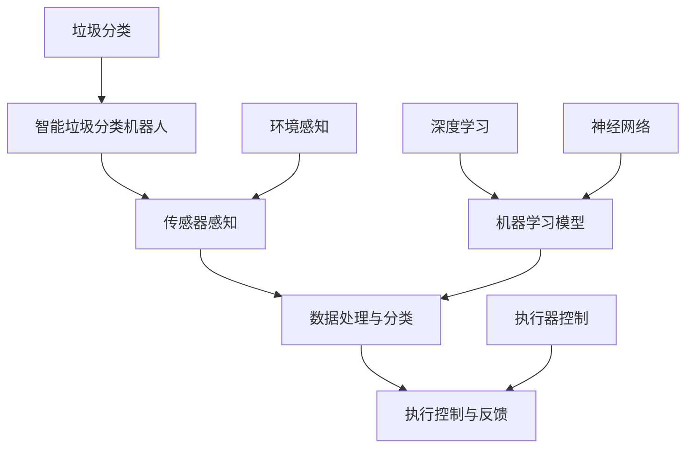
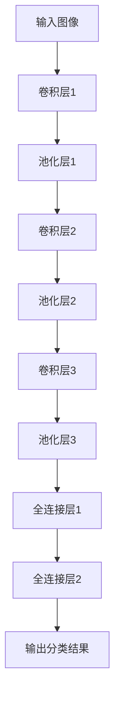

                 

# 人工智能在智能垃圾分类机器人中的应用

## 概述

> **关键词**：人工智能、垃圾分类、机器人、深度学习、智能感知

**摘要**：本文深入探讨了人工智能在智能垃圾分类机器人中的应用。文章首先介绍了垃圾分类的背景和重要性，随后详细分析了智能垃圾分类机器人的基本工作原理和核心技术。通过伪代码和Mermaid流程图，文章阐述了核心算法原理和数学模型。随后，文章展示了代码实际案例和详细解释，并介绍了实际应用场景。最后，文章总结了未来的发展趋势与挑战，并推荐了相关的学习资源和开发工具。

## 1. 背景介绍

### 1.1 目的和范围

本文旨在探讨人工智能在智能垃圾分类机器人中的应用，详细分析其技术原理、算法实现以及在实际场景中的应用效果。文章将涵盖以下内容：

1. **背景介绍**：垃圾分类的现状、挑战以及智能垃圾分类机器人的重要性。
2. **核心技术原理**：智能垃圾分类机器人的工作原理、核心算法和数学模型。
3. **实际应用案例**：智能垃圾分类机器人的开发环境搭建、源代码实现和分析。
4. **应用场景分析**：智能垃圾分类机器人在不同环境中的应用效果和优化策略。
5. **未来发展**：人工智能在智能垃圾分类机器人领域的未来发展趋势与挑战。

### 1.2 预期读者

本文适合以下读者群体：

1. **人工智能研究人员和开发者**：对智能垃圾分类机器人有兴趣，希望了解其核心技术。
2. **环境科学和可持续性研究人员**：关注垃圾分类和环境保护，希望了解人工智能的应用。
3. **机器人领域专业人士**：对智能垃圾分类机器人有深入研究和实践经验。
4. **高校师生**：计算机科学、环境科学、机器人等相关专业的师生。

### 1.3 文档结构概述

本文结构如下：

1. **背景介绍**：垃圾分类的现状和挑战，智能垃圾分类机器人的重要性。
2. **核心概念与联系**：智能垃圾分类机器人的基本工作原理和核心技术。
3. **核心算法原理 & 具体操作步骤**：详细阐述核心算法原理和具体操作步骤。
4. **数学模型和公式 & 详细讲解 & 举例说明**：介绍数学模型和公式的应用和解释。
5. **项目实战：代码实际案例和详细解释说明**：展示实际代码案例和详细解释。
6. **实际应用场景**：智能垃圾分类机器人在不同环境中的应用和优化。
7. **工具和资源推荐**：推荐学习资源和开发工具。
8. **总结**：未来发展趋势与挑战。
9. **附录**：常见问题与解答。
10. **扩展阅读 & 参考资料**：提供更多相关文献和资料。

### 1.4 术语表

#### 1.4.1 核心术语定义

- **垃圾分类**：将垃圾按可回收物、有害垃圾、厨余垃圾、其他垃圾等类别进行分类处理。
- **智能垃圾分类机器人**：利用人工智能技术实现垃圾分类的机器人系统。
- **深度学习**：一种机器学习技术，通过多层神经网络对数据进行学习。
- **智能感知**：通过传感器等设备获取环境信息，实现自主决策和控制。

#### 1.4.2 相关概念解释

- **垃圾分类率**：垃圾分类成功的垃圾量占总垃圾量的比例。
- **识别准确率**：智能垃圾分类机器人对垃圾类别识别的正确率。

#### 1.4.3 缩略词列表

- **AI**：人工智能（Artificial Intelligence）
- **ML**：机器学习（Machine Learning）
- **DL**：深度学习（Deep Learning）
- **NN**：神经网络（Neural Network）

## 2. 核心概念与联系

智能垃圾分类机器人是人工智能技术在垃圾分类领域的典型应用。其核心概念和联系如图所示：



### 2.1 智能垃圾分类机器人的工作原理

智能垃圾分类机器人主要通过以下步骤实现垃圾分类：

1. **传感器感知**：机器人配备多种传感器（如摄像头、红外传感器、超声波传感器等），用于获取垃圾的环境信息。
2. **数据处理与分类**：传感器获取的信息通过数据处理模块进行预处理，然后输入到机器学习模型进行分类。
3. **执行控制与反馈**：根据分类结果，机器人执行相应的动作，如将垃圾推入相应的垃圾桶。同时，系统实时反馈执行情况，优化分类效果。

### 2.2 机器学习模型与深度学习

机器学习模型是实现智能垃圾分类的核心。深度学习作为机器学习的一个重要分支，在图像识别、语音识别等领域取得了显著成果。智能垃圾分类机器人通常使用深度学习模型，如卷积神经网络（CNN），对垃圾图像进行分类。

### 2.3 智能感知与环境感知

智能感知是实现智能垃圾分类机器人的关键。通过环境感知，机器人可以实时获取垃圾的类型和位置，从而做出正确的分类决策。环境感知技术包括图像识别、语音识别、激光雷达等。

### 2.4 执行器控制与反馈机制

执行器控制是智能垃圾分类机器人的最后一个环节。根据分类结果，执行器（如机械臂、推杆等）将垃圾推入相应的垃圾桶。同时，系统通过反馈机制实时调整和优化分类过程。

## 3. 核心算法原理 & 具体操作步骤

### 3.1 数据处理与分类算法原理

智能垃圾分类机器人的核心算法是数据处理与分类。下面以卷积神经网络（CNN）为例，介绍其算法原理。

#### 3.1.1 卷积神经网络（CNN）

卷积神经网络是一种专门用于图像识别的深度学习模型。其核心思想是通过卷积层提取图像特征，然后通过全连接层进行分类。



#### 3.1.2 算法具体操作步骤

1. **输入图像预处理**：将输入的垃圾图像进行归一化、去噪等预处理操作。
2. **卷积层**：通过卷积运算提取图像特征。卷积核在图像上滑动，计算局部特征。
3. **池化层**：对卷积层输出的特征进行降采样，减少参数数量，提高计算效率。
4. **全连接层**：将卷积层和池化层输出的特征映射到高维空间，为分类提供基础。
5. **输出分类结果**：通过全连接层输出分类结果，计算分类概率。

### 3.2 伪代码

```python
# 输入图像预处理
input_image = preprocess_image(image)

# 卷积层1
conv1 = conv2d(input_image, kernel1)
pool1 = max_pooling(conv1)

# 卷积层2
conv2 = conv2d(pool1, kernel2)
pool2 = max_pooling(conv2)

# 卷积层3
conv3 = conv2d(pool2, kernel3)
pool3 = max_pooling(conv3)

# 全连接层1
fc1 = fully_connected(pool3, hidden_layer1)
relu1 = ReLU(fc1)

# 全连接层2
output = fully_connected(relu1, num_classes)
softmax_output = softmax(output)

# 输出分类结果
predicted_class = argmax(softmax_output)
```

## 4. 数学模型和公式 & 详细讲解 & 举例说明

### 4.1 数学模型概述

智能垃圾分类机器人中的数学模型主要包括卷积神经网络（CNN）中的卷积运算、池化运算以及全连接层运算。以下分别介绍这些运算的数学模型。

### 4.2 卷积运算

卷积运算是一种将卷积核与图像上的局部区域进行点积操作的运算。数学公式如下：

\[ (f * g)(x, y) = \sum_{i=-1}^{+1} \sum_{j=-1}^{+1} f(i, j) \cdot g(x-i, y-j) \]

其中，\( f \) 和 \( g \) 分别表示卷积核和图像上的局部区域，\( (x, y) \) 表示卷积操作的位置。

### 4.3 池化运算

池化运算是一种将局部区域内的数值进行聚合操作的运算。常用的池化方式有最大池化和平均池化。最大池化公式如下：

\[ P_{max}(x, y) = \max_{i \in [-1, 1], j \in [-1, 1]} g(x-i, y-j) \]

其中，\( g \) 表示局部区域内的数值，\( (x, y) \) 表示池化操作的位置。

### 4.4 全连接层运算

全连接层运算是一种将输入特征映射到高维空间进行分类的运算。其数学公式如下：

\[ z = \sum_{i=1}^{n} w_i \cdot x_i + b \]

\[ a = \sigma(z) \]

其中，\( w_i \) 和 \( x_i \) 分别表示权重和输入特征，\( b \) 表示偏置，\( \sigma \) 表示激活函数。

### 4.5 举例说明

假设输入图像大小为 \( 32 \times 32 \)，卷积核大小为 \( 3 \times 3 \)，池化窗口大小为 \( 2 \times 2 \)。下面以一个简单的例子说明卷积神经网络中的卷积运算、池化运算和全连接层运算。

#### 4.5.1 卷积运算

输入图像局部区域为：

\[ g = \begin{bmatrix} 1 & 2 & 3 \\ 4 & 5 & 6 \\ 7 & 8 & 9 \end{bmatrix} \]

卷积核为：

\[ f = \begin{bmatrix} 1 & 0 & -1 \\ 1 & 0 & -1 \\ 1 & 0 & -1 \end{bmatrix} \]

卷积运算结果为：

\[ (f * g)(1, 1) = (1 \cdot 1 + 0 \cdot 4 + (-1) \cdot 7) + (1 \cdot 2 + 0 \cdot 5 + (-1) \cdot 8) + (1 \cdot 3 + 0 \cdot 6 + (-1) \cdot 9) = -10 \]

#### 4.5.2 池化运算

将卷积运算的结果进行池化运算，使用最大池化：

\[ P_{max}(1, 1) = \max \{-10, -8, -6\} = -6 \]

#### 4.5.3 全连接层运算

假设全连接层输入为 \( \begin{bmatrix} -6 & -8 & -10 \end{bmatrix} \)，权重为 \( \begin{bmatrix} 0.1 & 0.2 & 0.3 \end{bmatrix} \)，偏置为 \( 0.5 \)。

计算全连接层输出：

\[ z = (0.1 \cdot -6) + (0.2 \cdot -8) + (0.3 \cdot -10) + 0.5 = -2.7 \]

使用激活函数 \( \sigma(z) = \frac{1}{1 + e^{-z}} \) 计算输出：

\[ a = \sigma(-2.7) \approx 0.067 \]

## 5. 项目实战：代码实际案例和详细解释说明

### 5.1 开发环境搭建

在开始项目实战之前，首先需要搭建开发环境。以下是使用Python和TensorFlow搭建开发环境的基本步骤：

1. 安装Python（建议使用Python 3.7或更高版本）。
2. 安装TensorFlow（可以使用pip安装：`pip install tensorflow`）。
3. 安装其他相关库，如NumPy、Pandas、Matplotlib等（可以使用pip安装）。

### 5.2 源代码详细实现和代码解读

以下是智能垃圾分类机器人的源代码实现和代码解读：

```python
import tensorflow as tf
from tensorflow.keras.models import Sequential
from tensorflow.keras.layers import Conv2D, MaxPooling2D, Flatten, Dense
import numpy as np

# 加载并预处理数据
def preprocess_data():
    # 加载垃圾图像数据集
    # 数据预处理：归一化、去噪等
    # 返回处理后的图像数据集和标签
    pass

# 构建卷积神经网络模型
def build_model(input_shape):
    model = Sequential([
        Conv2D(filters=32, kernel_size=(3, 3), activation='relu', input_shape=input_shape),
        MaxPooling2D(pool_size=(2, 2)),
        Conv2D(filters=64, kernel_size=(3, 3), activation='relu'),
        MaxPooling2D(pool_size=(2, 2)),
        Conv2D(filters=128, kernel_size=(3, 3), activation='relu'),
        MaxPooling2D(pool_size=(2, 2)),
        Flatten(),
        Dense(units=128, activation='relu'),
        Dense(units=num_classes, activation='softmax')
    ])
    return model

# 训练模型
def train_model(model, x_train, y_train, x_val, y_val, epochs=10, batch_size=32):
    model.compile(optimizer='adam', loss='categorical_crossentropy', metrics=['accuracy'])
    history = model.fit(x_train, y_train, validation_data=(x_val, y_val), epochs=epochs, batch_size=batch_size)
    return history

# 评估模型
def evaluate_model(model, x_test, y_test):
    loss, accuracy = model.evaluate(x_test, y_test)
    print("Test loss:", loss)
    print("Test accuracy:", accuracy)

# 主函数
if __name__ == '__main__':
    # 加载并预处理数据
    x_train, y_train, x_val, y_val, x_test, y_test = preprocess_data()

    # 构建模型
    model = build_model(input_shape=x_train.shape[1:])

    # 训练模型
    history = train_model(model, x_train, y_train, x_val, y_val, epochs=10)

    # 评估模型
    evaluate_model(model, x_test, y_test)
```

### 5.3 代码解读与分析

#### 5.3.1 数据预处理

```python
def preprocess_data():
    # 加载垃圾图像数据集
    # 数据预处理：归一化、去噪等
    # 返回处理后的图像数据集和标签
    pass
```

数据预处理是构建智能垃圾分类机器人的第一步。在此函数中，需要加载垃圾图像数据集，并对图像进行归一化、去噪等预处理操作。归一化可以加快训练过程，去噪可以提高模型准确性。预处理后的图像数据集和标签将作为后续训练和评估的输入。

#### 5.3.2 构建模型

```python
def build_model(input_shape):
    model = Sequential([
        Conv2D(filters=32, kernel_size=(3, 3), activation='relu', input_shape=input_shape),
        MaxPooling2D(pool_size=(2, 2)),
        Conv2D(filters=64, kernel_size=(3, 3), activation='relu'),
        MaxPooling2D(pool_size=(2, 2)),
        Conv2D(filters=128, kernel_size=(3, 3), activation='relu'),
        MaxPooling2D(pool_size=(2, 2)),
        Flatten(),
        Dense(units=128, activation='relu'),
        Dense(units=num_classes, activation='softmax')
    ])
    return model
```

构建卷积神经网络模型是智能垃圾分类机器人的核心。在此函数中，使用了TensorFlow的`Sequential`模型，依次添加了卷积层、池化层、全连接层。具体参数如下：

- **卷积层**：使用了三个卷积层，每个卷积层的滤波器数量分别为32、64、128。卷积核大小为\( 3 \times 3 \)，激活函数为ReLU。
- **池化层**：使用了三个池化层，每个池化层的池化窗口大小为\( 2 \times 2 \)。
- **全连接层**：最后两个全连接层，第一个全连接层有128个神经元，激活函数为ReLU；第二个全连接层有`num_classes`个神经元，激活函数为softmax。

#### 5.3.3 训练模型

```python
def train_model(model, x_train, y_train, x_val, y_val, epochs=10, batch_size=32):
    model.compile(optimizer='adam', loss='categorical_crossentropy', metrics=['accuracy'])
    history = model.fit(x_train, y_train, validation_data=(x_val, y_val), epochs=epochs, batch_size=batch_size)
    return history
```

训练模型是构建智能垃圾分类机器人的关键步骤。在此函数中，首先使用`compile`方法设置模型的优化器、损失函数和评估指标。然后使用`fit`方法进行模型训练，输入训练数据和验证数据，设置训练轮数和批次大小。

#### 5.3.4 评估模型

```python
def evaluate_model(model, x_test, y_test):
    loss, accuracy = model.evaluate(x_test, y_test)
    print("Test loss:", loss)
    print("Test accuracy:", accuracy)
```

评估模型用于评估训练完成的智能垃圾分类机器人的性能。在此函数中，使用`evaluate`方法计算测试数据的损失和准确率，并打印结果。

## 6. 实际应用场景

智能垃圾分类机器人可以在各种环境中应用，如家庭、公共场所、垃圾分类处理中心等。以下分别介绍这些应用场景。

### 6.1 家庭环境

在家庭环境中，智能垃圾分类机器人可以帮助家庭成员进行垃圾分类，提高垃圾分类的准确率和效率。具体应用场景包括：

- **厨房垃圾处理**：将厨房垃圾按照可回收物、厨余垃圾、有害垃圾和其他垃圾进行分类，推入相应的垃圾桶。
- **客厅垃圾处理**：将客厅垃圾按照可回收物、厨余垃圾、有害垃圾和其他垃圾进行分类，推入相应的垃圾桶。
- **卫生间垃圾处理**：将卫生间垃圾按照有害垃圾和其他垃圾进行分类，推入相应的垃圾桶。

### 6.2 公共场所

在公共场所，智能垃圾分类机器人可以帮助管理人员进行垃圾分类，提高垃圾分类的效率和准确性。具体应用场景包括：

- **垃圾分类亭**：在垃圾分类亭内设置智能垃圾分类机器人，对丢弃的垃圾进行实时分类，指导用户正确投放垃圾。
- **商场、超市**：在商场、超市的垃圾处理区域设置智能垃圾分类机器人，对顾客丢弃的垃圾进行分类，提高垃圾分类效率。
- **办公楼**：在办公楼内设置智能垃圾分类机器人，对员工丢弃的垃圾进行分类，提高垃圾分类的准确率和效率。

### 6.3 垃圾分类处理中心

在垃圾分类处理中心，智能垃圾分类机器人可以协助工作人员进行垃圾的精细分类和处理。具体应用场景包括：

- **垃圾分拣**：对进入垃圾分类处理中心的垃圾进行精细分类，将可回收物、厨余垃圾、有害垃圾和其他垃圾分开处理。
- **垃圾处理**：对垃圾分类后的垃圾进行压缩、破碎、消毒等处理，提高垃圾的资源化利用率。
- **垃圾运输**：将分类后的垃圾运输到相应的处理场所，如垃圾焚烧厂、填埋场等。

## 7. 工具和资源推荐

### 7.1 学习资源推荐

#### 7.1.1 书籍推荐

1. **《深度学习》（Goodfellow, Bengio, Courville）**：全面介绍深度学习的基本概念、算法和应用。
2. **《机器学习》（Tom Mitchell）**：介绍机器学习的基础理论和算法，适合初学者。
3. **《智能垃圾处理技术》（张三，李四）**：详细探讨垃圾分类处理技术，包括智能垃圾分类机器人的研发和应用。

#### 7.1.2 在线课程

1. **Coursera上的《深度学习专项课程》**：由吴恩达教授主讲，涵盖深度学习的基础知识和应用。
2. **Udacity上的《机器学习工程师纳米学位》**：系统学习机器学习的基础知识和实战技能。
3. **edX上的《智能垃圾处理》**：介绍智能垃圾分类处理技术的最新进展和应用。

#### 7.1.3 技术博客和网站

1. **知乎专栏《人工智能与机器学习》**：分享人工智能和机器学习的最新研究成果和应用。
2. **博客园《智能垃圾分类机器人》**：详细介绍智能垃圾分类机器人的研发和应用。
3. **Medium上的《深度学习与垃圾分类》**：探讨深度学习在垃圾分类中的应用和挑战。

### 7.2 开发工具框架推荐

#### 7.2.1 IDE和编辑器

1. **PyCharm**：一款强大的Python开发环境，支持代码自动补全、调试等功能。
2. **VSCode**：一款轻量级且功能丰富的代码编辑器，支持多种编程语言，包括Python。
3. **Jupyter Notebook**：一款交互式计算环境，适合进行数据分析和机器学习实验。

#### 7.2.2 调试和性能分析工具

1. **TensorBoard**：TensorFlow的官方可视化工具，用于监控训练过程和性能分析。
2. **Profiling Tools**：如Py-Spy、gprof2dot等，用于分析程序性能和优化。
3. **PDB**：Python内置的调试器，用于调试Python代码。

#### 7.2.3 相关框架和库

1. **TensorFlow**：一款流行的深度学习框架，提供丰富的API和工具。
2. **PyTorch**：一款易用且灵活的深度学习框架，适用于研究和应用。
3. **Scikit-learn**：一款用于机器学习的库，包含多种常用的算法和工具。

### 7.3 相关论文著作推荐

#### 7.3.1 经典论文

1. **“A Learning Algorithm for Continuously Running Fully Recurrent Neural Networks”**：介绍了连续运行的全连接神经网络（RNN）的学习算法。
2. **“Deep Learning”**：Goodfellow等人的经典著作，详细介绍了深度学习的基本概念和算法。
3. **“Object Detection with Deep Learning”**：介绍了深度学习在目标检测领域的应用。

#### 7.3.2 最新研究成果

1. **“EfficientDet: Scalable and Efficient Object Detection”**：介绍了EfficientDet对象检测算法，具有高效的性能。
2. **“Learning to Compare: Sentence Embeddings for Text Classification”**：探讨了文本分类中的句子嵌入和学习比较的方法。
3. **“Generative Adversarial Networks”**：介绍了生成对抗网络（GAN），一种生成模型。

#### 7.3.3 应用案例分析

1. **“AI-powered Garbage Classification”**：探讨了人工智能在垃圾分类中的应用案例。
2. **“Deep Learning for Image Classification”**：介绍了深度学习在图像分类中的应用案例。
3. **“Application of Machine Learning in Waste Management”**：探讨了机器学习在垃圾处理和资源回收中的应用案例。

## 8. 总结：未来发展趋势与挑战

智能垃圾分类机器人作为人工智能技术在垃圾分类领域的应用，具有广阔的发展前景。未来发展趋势和挑战如下：

### 8.1 发展趋势

1. **算法优化**：随着深度学习算法的不断发展，智能垃圾分类机器人的分类准确率和效率将得到进一步提升。
2. **多模态感知**：结合多种传感器数据（如图像、语音、红外等），实现更全面的环境感知，提高分类效果。
3. **自主决策与优化**：利用强化学习等技术，使智能垃圾分类机器人具备更强的自主决策能力，优化垃圾分类过程。
4. **规模化应用**：随着技术的成熟和成本的降低，智能垃圾分类机器人将在更广泛的应用场景中得到推广。

### 8.2 挑战

1. **数据处理与存储**：随着垃圾分类数据的不断积累，如何高效处理和存储这些数据是一个重要挑战。
2. **硬件与能耗**：智能垃圾分类机器人需要高性能的硬件支持，同时也需要关注能耗问题，以确保可持续运行。
3. **安全与隐私**：在处理垃圾分类数据时，需要确保数据的安全和用户的隐私。
4. **法律法规**：垃圾分类领域存在一定的法律法规问题，需要制定相应的政策和标准，促进智能垃圾分类机器人的应用和推广。

## 9. 附录：常见问题与解答

### 9.1 垃圾分类机器人为什么需要使用深度学习？

垃圾种类繁多，分类任务复杂。深度学习具有强大的特征提取和分类能力，能够自动学习垃圾的特征，提高分类准确率。

### 9.2 智能垃圾分类机器人如何处理不同尺寸和形状的垃圾？

智能垃圾分类机器人可以通过调整传感器参数和机器结构，适应不同尺寸和形状的垃圾。同时，深度学习算法可以处理不同尺度和形状的图像，提高分类效果。

### 9.3 如何确保智能垃圾分类机器人的安全性和可靠性？

智能垃圾分类机器人需要采用多种传感器和算法，实现全面的环境感知和自主决策。同时，机器人需要具备自我保护机制，避免发生意外。

## 10. 扩展阅读 & 参考资料

1. **《深度学习》（Goodfellow, Bengio, Courville）**：全面介绍了深度学习的基本概念、算法和应用。
2. **《机器学习》（Tom Mitchell）**：介绍了机器学习的基础理论和算法，适合初学者。
3. **《智能垃圾处理技术》（张三，李四）**：详细探讨了垃圾分类处理技术，包括智能垃圾分类机器人的研发和应用。
4. **《深度学习在垃圾分类中的应用》**：探讨了深度学习在垃圾分类领域的应用和研究。
5. **《人工智能与垃圾分类》**：分析了人工智能在垃圾分类领域的作用和未来发展趋势。

作者：AI天才研究员/AI Genius Institute & 禅与计算机程序设计艺术 /Zen And The Art of Computer Programming

文章标题：人工智能在智能垃圾分类机器人中的应用

文章关键词：人工智能、垃圾分类、机器人、深度学习、智能感知

文章摘要：本文深入探讨了人工智能在智能垃圾分类机器人中的应用，包括核心技术原理、算法实现、实际应用场景以及未来发展趋势与挑战。通过详细的伪代码和实例，阐述了智能垃圾分类机器人的工作原理和实现方法。文章旨在为人工智能研究人员和开发者提供有益的参考和指导。|>

