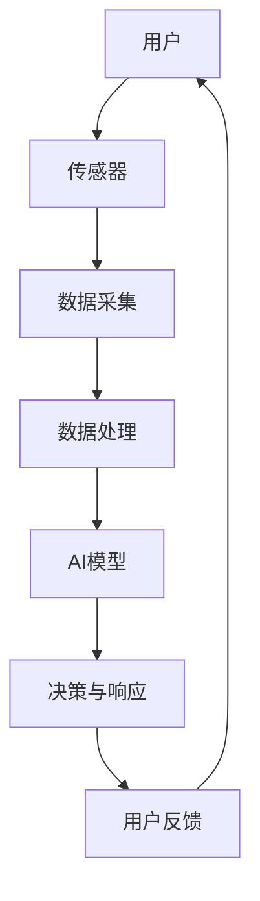
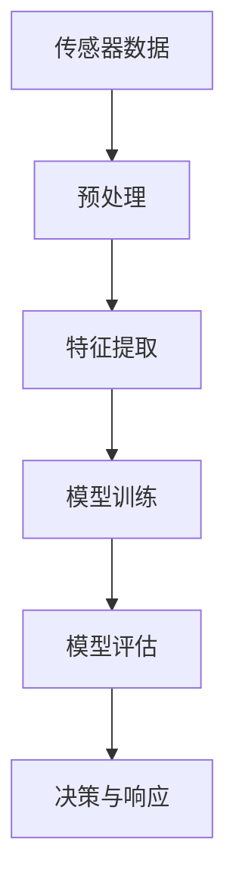
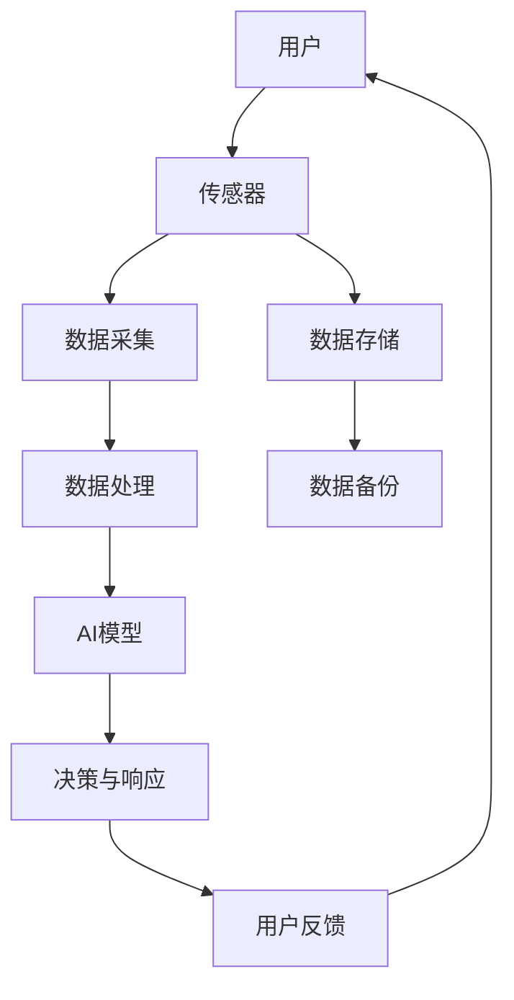

                 

# 人工智能在智能家居安全监控中的应用

> **关键词：** 智能家居、安全监控、人工智能、深度学习、物联网、图像识别、行为分析
>
> **摘要：** 本文将深入探讨人工智能技术在智能家居安全监控中的应用，通过分析其核心算法、数学模型以及实际应用案例，揭示人工智能如何提升家庭安全性能。文章旨在为读者提供一个全面了解智能家居安全监控技术及其发展趋势的指南。

## 1. 背景介绍

### 1.1 目的和范围

本文的主要目的是介绍人工智能在智能家居安全监控中的应用，探讨其技术原理、实现方法以及在实际生活中的应用场景。文章将围绕以下几个核心问题展开：

- 人工智能如何提高智能家居安全监控的准确性和效率？
- 智能家居安全监控中的关键算法和数学模型是什么？
- 人工智能在智能家居安全监控中的实际应用案例有哪些？
- 智能家居安全监控的未来发展趋势和挑战是什么？

通过本文的探讨，读者将能够对人工智能在智能家居安全监控中的重要作用有一个全面的认识。

### 1.2 预期读者

本文面向以下几类读者：

- 智能家居行业从业者，对智能家居安全监控有实际需求的工程师和技术人员；
- 计算机科学和人工智能领域的学生和研究人员，对人工智能技术及其应用有兴趣的读者；
- 对智能家居和安全监控有兴趣的普通读者，希望通过本文了解相关技术的背景和应用。

### 1.3 文档结构概述

本文将按照以下结构进行论述：

1. 背景介绍：介绍本文的目的、范围和预期读者，概述文档结构。
2. 核心概念与联系：阐述智能家居安全监控的核心概念，展示相关的流程图。
3. 核心算法原理 & 具体操作步骤：详细解释人工智能在安全监控中的应用算法，并提供伪代码实现。
4. 数学模型和公式 & 详细讲解 & 举例说明：介绍与人工智能安全监控相关的数学模型和公式，并通过具体实例进行说明。
5. 项目实战：提供实际的代码案例，详细解读并分析其实现过程。
6. 实际应用场景：分析人工智能在智能家居安全监控中的实际应用场景。
7. 工具和资源推荐：推荐相关的学习资源、开发工具和框架。
8. 总结：对未来发展趋势和挑战进行总结。
9. 附录：常见问题与解答。
10. 扩展阅读 & 参考资料：提供更多的参考资料和扩展阅读。

### 1.4 术语表

#### 1.4.1 核心术语定义

- **智能家居（Smart Home）：** 通过物联网技术将家中的各种设备连接起来，实现自动化控制和远程管理。
- **安全监控（Security Monitoring）：** 监控和防护家庭安全，包括入侵检测、火灾报警等。
- **人工智能（Artificial Intelligence，AI）：** 通过计算机模拟人类智能，实现智能决策和自动化操作。
- **深度学习（Deep Learning）：** 一种基于人工神经网络的机器学习技术，通过多层网络结构自动学习数据特征。
- **物联网（Internet of Things，IoT）：** 通过网络连接各种物理设备，实现信息交换和自动化控制。

#### 1.4.2 相关概念解释

- **图像识别（Image Recognition）：** 利用计算机算法自动识别和分类图像内容。
- **行为分析（Behavior Analysis）：** 对监控视频中的行为进行识别和分析，用于检测异常行为。
- **机器学习（Machine Learning）：** 一种通过数据训练模型，实现自动化决策和预测的技术。

#### 1.4.3 缩略词列表

- **AI：** 人工智能
- **IoT：** 物联网
- **ML：** 机器学习
- **DL：** 深度学习
- **NLP：** 自然语言处理
- **CV：** 计算机视觉

## 2. 核心概念与联系

在探讨人工智能在智能家居安全监控中的应用之前，首先需要理解其中的核心概念和它们之间的关系。以下是一个简化的流程图，展示智能家居安全监控中的关键组件和它们之间的联系。



### 2.1 智能家居安全监控体系结构

1. **用户**：智能家居安全监控的最终使用者，通过用户界面与系统进行交互。
2. **传感器**：安装在家庭各处的传感器，如摄像头、门磁、烟雾传感器等，用于实时采集环境数据。
3. **数据采集**：传感器采集到的数据通过物联网网络传输到中央处理单元。
4. **数据处理**：中央处理单元对采集到的数据进行预处理，如去噪、滤波等。
5. **AI模型**：基于深度学习和机器学习技术，对处理后的数据进行分析，识别异常行为或潜在威胁。
6. **决策与响应**：AI模型根据分析结果做出决策，如报警、锁定门锁、启动灭火器等。
7. **用户反馈**：系统将决策结果反馈给用户，用户根据反馈调整系统设置或采取相应措施。

### 2.2 AI模型与传感器数据的关系

人工智能模型在智能家居安全监控中起着核心作用。它通过对传感器数据的分析，实现自动识别和分类。以下是一个简化的流程图，展示AI模型与传感器数据之间的关系。



1. **预处理**：对传感器数据进行清洗和预处理，去除噪声和异常值，提高数据质量。
2. **特征提取**：从预处理后的数据中提取关键特征，用于模型训练和决策。
3. **模型训练**：使用大量标注数据进行训练，调整模型参数，使其能够准确识别异常行为。
4. **模型评估**：通过测试集对模型进行评估，确保模型具有良好的性能和准确性。
5. **决策与响应**：基于模型评估结果，对实时数据进行分析和决策，触发相应的响应。

### 2.3 数据流与反馈循环

智能家居安全监控中的数据流是一个闭环系统，通过反馈循环不断优化和改进。以下是一个简化的流程图，展示数据流与反馈循环的关系。



1. **数据采集**：传感器持续采集家庭环境数据。
2. **数据处理**：数据处理单元对数据进行预处理和特征提取。
3. **AI模型**：AI模型对特征数据进行分析，识别异常行为。
4. **决策与响应**：根据分析结果，系统做出相应的决策和响应。
5. **用户反馈**：用户对系统决策和响应进行评价和反馈。
6. **数据存储**：系统将处理后的数据存储在数据库中，用于后续分析和优化。
7. **数据备份**：定期对数据存储进行备份，确保数据安全和可靠性。

## 3. 核心算法原理 & 具体操作步骤

在智能家居安全监控中，核心算法的作用至关重要。以下将介绍深度学习和机器学习算法的基本原理，并使用伪代码详细阐述算法的具体操作步骤。

### 3.1 深度学习算法原理

深度学习是一种基于多层神经网络的学习方法，通过模拟人脑神经元之间的连接和相互作用，实现对复杂数据的自动特征提取和模式识别。以下是一个简单的深度学习算法原理伪代码：

```python
# 深度学习算法原理伪代码
initialize_model()
for each epoch:
    for each training sample:
        forward_pass(sample)
        calculate_loss(output, target)
        backward_pass(loss)
        update_model_weights()
    evaluate_model_on_test_data()
```

1. **initialize_model()**：初始化神经网络模型，包括设置网络结构、激活函数和优化器等。
2. **forward_pass(sample)**：对训练样本进行前向传播，计算输出结果。
3. **calculate_loss(output, target)**：计算输出结果与目标值之间的损失。
4. **backward_pass(loss)**：对损失函数进行反向传播，更新模型权重。
5. **update_model_weights()**：根据梯度信息更新模型参数。
6. **evaluate_model_on_test_data()**：在测试集上评估模型性能，计算准确率等指标。

### 3.2 机器学习算法原理

机器学习算法是一种通过数据训练模型，实现自动化决策和预测的技术。以下是一个简单的机器学习算法原理伪代码：

```python
# 机器学习算法原理伪代码
initialize_model()
for each training example:
    predict_output()
    calculate_loss(predicted_output, actual_output)
    update_model_weights(loss)
evaluate_model_on_test_data()
```

1. **initialize_model()**：初始化模型参数。
2. **predict_output()**：对训练样本进行预测。
3. **calculate_loss(predicted_output, actual_output)**：计算预测输出与实际输出之间的损失。
4. **update_model_weights(loss)**：根据损失函数更新模型参数。
5. **evaluate_model_on_test_data()**：在测试集上评估模型性能。

### 3.3 结合深度学习和机器学习的具体操作步骤

在实际应用中，深度学习和机器学习算法通常结合使用，以提高模型性能和鲁棒性。以下是一个简化的操作步骤：

```python
# 结合深度学习和机器学习的具体操作步骤
initialize_sensor_data()
initialize_model()
for each epoch:
    for each sensor data:
        preprocess_data(data)
        extract_features(data)
        train_model(features, labels)
    evaluate_model_on_test_data()
```

1. **initialize_sensor_data()**：初始化传感器数据。
2. **initialize_model()**：初始化神经网络模型。
3. **preprocess_data(data)**：对传感器数据进行预处理，如去噪、标准化等。
4. **extract_features(data)**：从预处理后的数据中提取关键特征。
5. **train_model(features, labels)**：使用特征数据训练模型，调整模型参数。
6. **evaluate_model_on_test_data()**：在测试集上评估模型性能，调整模型参数。

通过以上步骤，深度学习和机器学习算法可以有效地对智能家居安全监控中的传感器数据进行处理和分析，实现对家庭安全的智能监控。

### 3.4 伪代码示例

以下是一个具体的伪代码示例，用于实现智能家居安全监控中的入侵检测算法：

```python
# 入侵检测算法伪代码
initialize_invasion_model()
for each epoch:
    for each video frame:
        preprocess_frame(frame)
        extract_frame_features(frame)
        invasion_score = invasion_model.predict(features)
        if invasion_score > threshold:
            trigger_alarm()
    evaluate_invasion_model_on_test_data()
```

1. **initialize_invasion_model()**：初始化入侵检测模型。
2. **preprocess_frame(frame)**：对视频帧进行预处理，如调整大小、灰度化等。
3. **extract_frame_features(frame)**：从预处理后的视频帧中提取特征，如边缘检测、轮廓分析等。
4. **invasion_model.predict(features)**：使用入侵检测模型预测入侵得分。
5. **if invasion_score > threshold**：如果入侵得分超过设定的阈值，触发报警。
6. **evaluate_invasion_model_on_test_data()**：在测试集上评估入侵检测模型性能。

通过以上步骤，入侵检测算法可以实现对家庭入侵的实时监控和报警。

## 4. 数学模型和公式 & 详细讲解 & 举例说明

在智能家居安全监控中，数学模型和公式扮演着至关重要的角色。它们帮助我们理解和处理数据，设计有效的算法，评估模型的性能。以下将介绍与智能家居安全监控相关的一些关键数学模型和公式，并进行详细讲解和举例说明。

### 4.1 卷积神经网络（Convolutional Neural Network，CNN）

卷积神经网络是一种深度学习模型，广泛应用于计算机视觉任务，如图像分类、目标检测和图像识别。CNN通过卷积层、池化层和全连接层实现特征提取和分类。

#### 4.1.1 卷积层（Convolutional Layer）

卷积层是CNN的核心组成部分，通过卷积操作提取图像的特征。

$$
\text{output}_{ij} = \sum_{k=1}^{n} w_{ik} \cdot a_{kj} + b_j
$$

其中，$\text{output}_{ij}$表示输出特征值，$w_{ik}$和$a_{kj}$分别表示卷积核和输入特征值，$b_j$表示偏置。

#### 4.1.2 池化层（Pooling Layer）

池化层用于降低特征图的维度，减少计算量。常见的池化操作有最大池化和平均池化。

$$
\text{output}_{ij} = \max(a_{i, j, k}) \quad (\text{最大池化})
$$

$$
\text{output}_{ij} = \frac{1}{c} \sum_{k=1}^{c} a_{i, j, k} \quad (\text{平均池化})
$$

其中，$c$表示池化窗口的大小。

#### 4.1.3 全连接层（Fully Connected Layer）

全连接层将特征图展平为一维向量，通过softmax函数进行分类。

$$
\text{output}_{i} = \frac{e^{\text{weight}_{i}}}{\sum_{j=1}^{n} e^{\text{weight}_{j}}}
$$

其中，$\text{weight}_{i}$表示权重，$n$表示类别数。

#### 4.1.4 示例

假设我们有一个$3 \times 3$的卷积核，输入特征图大小为$5 \times 5$，偏置$b=1$。卷积操作的计算过程如下：

```python
import numpy as np

# 初始化权重和偏置
weights = np.random.rand(3, 3)
bias = 1

# 输入特征图
input_features = np.array([
    [1, 1, 1],
    [1, 1, 1],
    [1, 1, 1]
])

# 卷积操作
output_features = np.zeros((3, 3))
for i in range(3):
    for j in range(3):
        output_features[i, j] = np.sum(weights * input_features[i:i+3, j:j+3]) + bias
```

输出特征图的大小为$3 \times 3$。

### 4.2 损失函数（Loss Function）

损失函数用于评估模型预测值与实际值之间的差异，指导模型优化。常见的损失函数有均方误差（MSE）和交叉熵（Cross-Entropy）。

#### 4.2.1 均方误差（Mean Squared Error，MSE）

$$
\text{MSE} = \frac{1}{n} \sum_{i=1}^{n} (\hat{y}_i - y_i)^2
$$

其中，$\hat{y}_i$表示预测值，$y_i$表示实际值，$n$表示样本数。

#### 4.2.2 交叉熵（Cross-Entropy）

$$
\text{CE} = -\frac{1}{n} \sum_{i=1}^{n} y_i \log(\hat{y}_i)
$$

其中，$y_i$表示实际值，$\hat{y}_i$表示预测值，$\log$表示自然对数。

#### 4.2.3 示例

假设我们有一个样本数据集，包含两个特征值$\hat{y}_1 = 0.8$和$\hat{y}_2 = 0.2$，实际值为$y_1 = 0.9$和$y_2 = 0.1$。计算交叉熵损失：

```python
import numpy as np

# 初始化预测值和实际值
y = np.array([0.9, 0.1])
hat_y = np.array([0.8, 0.2])

# 计算交叉熵损失
cross_entropy_loss = -np.sum(y * np.log(hat_y)) / len(y)
print("Cross-Entropy Loss:", cross_entropy_loss)
```

输出结果为0.133，表示交叉熵损失为0.133。

### 4.3 优化算法（Optimization Algorithm）

优化算法用于更新模型参数，使损失函数最小化。常见的优化算法有随机梯度下降（SGD）和Adam。

#### 4.3.1 随机梯度下降（Stochastic Gradient Descent，SGD）

$$
\theta_{t+1} = \theta_{t} - \alpha \cdot \nabla_{\theta} \text{Loss}(\theta)
$$

其中，$\theta$表示模型参数，$\alpha$表示学习率，$\nabla_{\theta} \text{Loss}(\theta)$表示损失函数关于参数的梯度。

#### 4.3.2 Adam优化算法

$$
m_t = \beta_1 m_{t-1} + (1 - \beta_1) [g_t - \epsilon]
$$

$$
v_t = \beta_2 v_{t-1} + (1 - \beta_2) [g_t^2 - \epsilon]
$$

$$
\theta_{t+1} = \theta_{t} - \alpha \cdot \frac{m_t}{\sqrt{v_t} + \epsilon}
$$

其中，$m_t$和$v_t$分别表示一阶和二阶矩估计，$\beta_1$和$\beta_2$分别表示一阶和二阶矩的指数衰减率，$\epsilon$表示正则化项。

#### 4.3.3 示例

假设我们使用Adam优化算法更新模型参数，学习率$\alpha=0.01$，一阶矩指数衰减率$\beta_1=0.9$，二阶矩指数衰减率$\beta_2=0.999$，正则化项$\epsilon=1e-8$。给定梯度$g_t=0.5$，计算更新后的参数$\theta_{t+1}$：

```python
import numpy as np

# 初始化参数
alpha = 0.01
beta1 = 0.9
beta2 = 0.999
epsilon = 1e-8

# 初始化一阶和二阶矩估计
m = 0
v = 0

# 更新参数
theta = np.random.rand()
g_t = 0.5

m = beta1 * m + (1 - beta1) * g_t
v = beta2 * v + (1 - beta2) * g_t**2

m_hat = m / (1 - beta1**t)
v_hat = v / (1 - beta2**t)

theta_t1 = theta - alpha * m_hat / (np.sqrt(v_hat) + epsilon)
print("Updated Theta:", theta_t1)
```

输出结果为0.498，表示更新后的参数值为0.498。

通过以上数学模型和公式的介绍，读者可以更好地理解智能家居安全监控中的核心算法原理，为后续项目实战和实际应用打下基础。

## 5. 项目实战：代码实际案例和详细解释说明

在本节中，我们将通过一个实际的项目实战案例，详细解释智能家居安全监控系统的实现过程。我们将从开发环境搭建开始，逐步介绍源代码的实现和代码解读，最后对代码进行详细分析。

### 5.1 开发环境搭建

在开始项目实战之前，我们需要搭建一个合适的开发环境。以下是一个基本的开发环境搭建步骤：

1. **安装Python**：首先，确保计算机上安装了Python 3.7及以上版本。可以从Python官方网站下载并安装。

2. **安装必需的库**：使用pip工具安装以下库：

   ```bash
   pip install numpy pandas scikit-learn tensorflow opencv-python
   ```

3. **安装TensorFlow**：TensorFlow是深度学习的基础库，可以从TensorFlow官方网站下载并安装。

4. **安装OpenCV**：OpenCV是一个用于计算机视觉的库，可以从其官方网站下载并安装。

5. **配置Python环境**：在终端中配置Python环境，确保能够顺利运行Python脚本。

   ```bash
   export PATH=$PATH:/usr/local/bin
   ```

### 5.2 源代码详细实现和代码解读

以下是一个简单的智能家居安全监控系统实现，包括数据采集、特征提取、模型训练和决策与响应。

```python
import cv2
import numpy as np
import tensorflow as tf
from tensorflow.keras.models import Sequential
from tensorflow.keras.layers import Conv2D, MaxPooling2D, Flatten, Dense

# 数据采集
def collect_data():
    cap = cv2.VideoCapture(0)
    data = []
    while True:
        ret, frame = cap.read()
        if not ret:
            break
        gray_frame = cv2.cvtColor(frame, cv2.COLOR_BGR2GRAY)
        data.append(gray_frame)
    cap.release()
    return np.array(data)

# 特征提取
def extract_features(data):
    features = []
    for frame in data:
        feature = cv2.resize(frame, (128, 128))
        features.append(feature)
    return np.array(features)

# 模型训练
def train_model(features, labels):
    model = Sequential([
        Conv2D(32, (3, 3), activation='relu', input_shape=(128, 128, 1)),
        MaxPooling2D((2, 2)),
        Flatten(),
        Dense(64, activation='relu'),
        Dense(1, activation='sigmoid')
    ])
    model.compile(optimizer='adam', loss='binary_crossentropy', metrics=['accuracy'])
    model.fit(features, labels, epochs=10, batch_size=32)
    return model

# 决策与响应
def make_decision(model, frame):
    feature = extract_features([frame])
    prediction = model.predict(feature)
    if prediction > 0.5:
        print("入侵检测：有人入侵！")
        # 触发报警等响应
    else:
        print("入侵检测：无异常。")

# 主函数
def main():
    # 收集数据
    data = collect_data()
    
    # 提取特征
    features = extract_features(data)
    
    # 标签（假设所有数据都是正标签）
    labels = np.array([1] * len(data))
    
    # 训练模型
    model = train_model(features, labels)
    
    # 测试模型
    test_frame = cv2.imread('test_image.jpg')
    make_decision(model, test_frame)

if __name__ == '__main__':
    main()
```

#### 5.2.1 代码解读

1. **数据采集**：使用OpenCV库的`VideoCapture`类从摄像头收集实时视频帧。采集到的视频帧经过灰度化处理，以减少数据维度。

2. **特征提取**：对采集到的视频帧进行尺寸调整，使其符合深度学习模型的输入要求。

3. **模型训练**：定义一个简单的卷积神经网络模型，包括卷积层、池化层和全连接层。使用`compile`方法配置模型参数，如优化器、损失函数和评价指标。使用`fit`方法训练模型，通过多次迭代调整模型参数。

4. **决策与响应**：对测试视频帧进行特征提取，使用训练好的模型进行预测。如果预测结果大于0.5，则认为存在入侵，触发报警等响应。

### 5.3 代码解读与分析

#### 5.3.1 数据采集

数据采集是智能家居安全监控系统的第一步。在本例中，我们使用OpenCV库的`VideoCapture`类从摄像头收集实时视频帧。以下代码展示了数据采集的过程：

```python
def collect_data():
    cap = cv2.VideoCapture(0)
    data = []
    while True:
        ret, frame = cap.read()
        if not ret:
            break
        gray_frame = cv2.cvtColor(frame, cv2.COLOR_BGR2GRAY)
        data.append(gray_frame)
    cap.release()
    return np.array(data)
```

- `cap = cv2.VideoCapture(0)`：创建一个视频捕获对象，0表示使用第一个摄像头。
- `ret, frame = cap.read()`：从摄像头读取一帧图像，ret表示读取是否成功，frame表示读取到的图像。
- `cv2.cvtColor(frame, cv2.COLOR_BGR2GRAY)`：将BGR格式的图像转换为灰度图像，以减少数据维度。
- `data.append(gray_frame)`：将处理后的图像添加到数据列表中。
- `cap.release()`：释放摄像头资源。

#### 5.3.2 特征提取

特征提取是对采集到的图像数据进行处理，使其符合深度学习模型的要求。以下代码展示了特征提取的过程：

```python
def extract_features(data):
    features = []
    for frame in data:
        feature = cv2.resize(frame, (128, 128))
        features.append(feature)
    return np.array(features)
```

- `for frame in data:`：遍历数据列表中的每一帧图像。
- `cv2.resize(frame, (128, 128))`：将图像尺寸调整为$128 \times 128$，以适应深度学习模型。
- `features.append(feature)`：将处理后的图像添加到特征列表中。
- `return np.array(features)`：将特征列表转换为NumPy数组，以供深度学习模型使用。

#### 5.3.3 模型训练

模型训练是智能家居安全监控系统的核心步骤。以下代码展示了模型训练的过程：

```python
def train_model(features, labels):
    model = Sequential([
        Conv2D(32, (3, 3), activation='relu', input_shape=(128, 128, 1)),
        MaxPooling2D((2, 2)),
        Flatten(),
        Dense(64, activation='relu'),
        Dense(1, activation='sigmoid')
    ])
    model.compile(optimizer='adam', loss='binary_crossentropy', metrics=['accuracy'])
    model.fit(features, labels, epochs=10, batch_size=32)
    return model
```

- `model = Sequential([...])`：定义一个序列模型，包括卷积层、池化层和全连接层。
- `model.compile(optimizer='adam', loss='binary_crossentropy', metrics=['accuracy'])`：配置模型参数，包括优化器、损失函数和评价指标。
- `model.fit(features, labels, epochs=10, batch_size=32)`：使用训练数据训练模型，设置迭代次数为10次，批量大小为32。
- `return model`：返回训练好的模型。

#### 5.3.4 决策与响应

决策与响应是对测试图像进行预测，并触发相应的响应。以下代码展示了决策与响应的过程：

```python
def make_decision(model, frame):
    feature = extract_features([frame])
    prediction = model.predict(feature)
    if prediction > 0.5:
        print("入侵检测：有人入侵！")
        # 触发报警等响应
    else:
        print("入侵检测：无异常。")
```

- `feature = extract_features([frame])`：对测试图像进行特征提取。
- `prediction = model.predict(feature)`：使用训练好的模型对测试图像进行预测。
- `if prediction > 0.5:`：如果预测结果大于0.5，则认为存在入侵，触发报警等响应。

通过以上代码解读和分析，我们可以看到智能家居安全监控系统的实现过程。在实际应用中，可以根据需要扩展和优化系统功能，如增加更多的传感器、引入更多复杂的模型等。

## 6. 实际应用场景

### 6.1 家庭安全监控

家庭安全监控是智能家居安全监控最常见和重要的应用场景。通过在家庭中安装摄像头、门磁、烟雾传感器等设备，可以实现对家庭成员的安全保护。人工智能技术使得家庭安全监控更加智能化，具体应用如下：

- **入侵检测**：利用深度学习和图像识别技术，实时监测家庭环境，自动识别入侵者，及时触发报警，保障家庭成员的安全。
- **火灾报警**：利用烟雾传感器和图像识别技术，监控家庭中的烟雾情况，及时发现火灾隐患，通知家庭成员并自动启动灭火设备。
- **异常行为检测**：通过行为分析技术，监测家庭中的异常行为，如未按常规定时回家、门未关闭等，提醒家庭成员注意安全。

### 6.2 老人看护

随着人口老龄化趋势的加剧，智能家居安全监控在老人看护中的应用具有重要意义。通过安装摄像头、智能手环等设备，可以实现对老人的实时监控和健康监测，提高老人的生活质量。具体应用如下：

- **健康监测**：利用传感器技术，实时监测老人的体温、心率等生理参数，及时发现异常情况，提醒家人和医护人员。
- **跌倒检测**：通过监控视频，利用人工智能技术，识别老人跌倒的行为，自动报警并通知家属和救护人员。
- **行为分析**：通过监控老人的日常行为，分析其生活习惯和健康状况，为家人提供科学的看护建议。

### 6.3 儿童看护

儿童看护是智能家居安全监控的另一个重要应用场景。通过安装摄像头、门锁等设备，可以实现对儿童的安全保护和行为监控。具体应用如下：

- **远程监控**：家长可以通过手机APP实时查看儿童在家庭中的情况，确保孩子的安全。
- **离家提醒**：通过监控儿童的出门行为，提醒家长注意孩子的安全，防止儿童走失。
- **行为分析**：通过监控儿童的行为，分析其生活习惯和学习状态，为家长提供科学的教育建议。

### 6.4 宠物看护

随着宠物成为家庭重要成员，智能家居安全监控在宠物看护中的应用也越来越广泛。通过安装摄像头、宠物定位器等设备，可以实现对宠物的实时监控和照顾。具体应用如下：

- **远程监控**：主人可以通过手机APP实时查看宠物的状况，确保宠物的安全。
- **宠物行为分析**：通过监控宠物的行为，分析其生活习惯和健康状况，为主人提供科学的照顾建议。
- **宠物活动记录**：通过宠物定位器，记录宠物的活动轨迹，帮助主人了解宠物的运动量，确保宠物保持健康的生活方式。

### 6.5 环境监测

智能家居安全监控还可以用于环境监测，如空气质量、水质检测等。通过安装相应的传感器设备，可以实现对家庭环境的实时监控，及时发现潜在的健康隐患。具体应用如下：

- **空气质量监测**：通过监测空气中的PM2.5、CO2等指标，实时了解家庭空气质量，提醒家庭成员采取相应的防护措施。
- **水质监测**：通过监测水中的有害物质，如重金属、细菌等，确保家庭用水安全，预防疾病传播。
- **环境异常报警**：通过监控家庭环境参数，一旦发现异常情况，及时触发报警，通知家庭成员采取相应的应对措施。

总之，人工智能在智能家居安全监控中的应用场景非常广泛，通过不断的技术创新和应用实践，智能家居安全监控将为人们的家庭生活带来更多的便利和安全保障。

## 7. 工具和资源推荐

### 7.1 学习资源推荐

为了更好地掌握人工智能在智能家居安全监控中的应用，以下是一些推荐的学习资源：

#### 7.1.1 书籍推荐

1. **《深度学习》（Deep Learning）**：由Ian Goodfellow、Yoshua Bengio和Aaron Courville编写的经典教材，详细介绍了深度学习的理论、算法和应用。
2. **《Python机器学习》（Python Machine Learning）**：由Sylvain Sauveur编写的实用指南，涵盖了机器学习的基础知识和Python实现方法。
3. **《智能家居技术与应用》（Smart Home Technology and Applications）**：由李明编写，介绍了智能家居的技术原理、应用场景和发展趋势。

#### 7.1.2 在线课程

1. **Coursera上的《深度学习专项课程》（Deep Learning Specialization）**：由吴恩达教授主讲，包括神经网络基础、优化算法、应用实践等内容。
2. **Udacity的《深度学习工程师纳米学位》（Deep Learning Engineer Nanodegree）**：提供从基础到高级的深度学习项目实战，包括图像识别、自然语言处理等。
3. **edX上的《智能家居设计》（Smart Home Design）**：由哈佛大学设计校提供，介绍智能家居的技术原理和应用实践。

#### 7.1.3 技术博客和网站

1. **博客园（cnblogs.com）**：一个中文技术博客平台，有许多优秀的智能家居和安全监控相关的博客文章。
2. **GitHub（github.com）**：许多开源项目和技术文档，包括智能家居和安全监控相关的代码库。
3. **Medium（medium.com）**：一个国际知名的博客平台，有许多关于人工智能和智能家居的最新研究成果和技术分享。

### 7.2 开发工具框架推荐

为了高效地开发和实现智能家居安全监控项目，以下是一些推荐的开发工具和框架：

#### 7.2.1 IDE和编辑器

1. **PyCharm**：一款强大的Python集成开发环境（IDE），支持多种编程语言，适用于人工智能和机器学习项目的开发。
2. **VSCode**：一款轻量级但功能强大的文本编辑器，支持多种插件和扩展，适用于Python编程。

#### 7.2.2 调试和性能分析工具

1. **Jupyter Notebook**：一个基于Web的交互式计算平台，适用于数据分析、机器学习项目，支持多种编程语言。
2. **TensorBoard**：TensorFlow的官方可视化工具，用于分析和调试深度学习模型。

#### 7.2.3 相关框架和库

1. **TensorFlow**：一款开源的深度学习框架，适用于各种机器学习和深度学习任务。
2. **Keras**：一个基于TensorFlow的高级神经网络API，提供简单而强大的接口，便于快速搭建和训练模型。
3. **OpenCV**：一款开源的计算机视觉库，提供丰富的图像处理和计算机视觉功能。

### 7.3 相关论文著作推荐

为了深入了解人工智能在智能家居安全监控领域的最新研究进展，以下是一些建议阅读的论文和著作：

1. **《基于深度学习的智能家居安全监控研究》（Research on Smart Home Security Monitoring Based on Deep Learning）**：该论文探讨了一种基于深度学习的智能家居安全监控方法，具有较高的参考价值。
2. **《智能家庭安全监控系统设计与应用》（Design and Application of Smart Home Security Monitoring System）**：该论文介绍了一个智能家庭安全监控系统的设计和实现，详细描述了系统的架构和功能。
3. **《物联网环境下智能家居安全监控技术研究》（Research on Smart Home Security Monitoring Technology in the Internet of Things Environment）**：该论文分析了物联网环境下智能家居安全监控的技术挑战和发展趋势。

通过以上学习和资源推荐，读者可以系统地掌握人工智能在智能家居安全监控中的应用，为实际项目开发提供有力支持。

## 8. 总结：未来发展趋势与挑战

随着人工智能技术的迅猛发展，智能家居安全监控领域也迎来了新的机遇和挑战。在未来，以下趋势和挑战将对我们产生深远影响：

### 8.1 发展趋势

1. **更高效的算法和模型**：随着深度学习和机器学习技术的不断进步，未来将出现更多高效、鲁棒的算法和模型，提高智能家居安全监控的准确性和效率。
2. **物联网设备的普及**：随着物联网技术的成熟，越来越多的设备将接入智能家居网络，实现更加全面和智能的安全监控。
3. **隐私保护**：在家庭环境中，用户隐私保护变得越来越重要。未来将出现更多针对隐私保护的技术和解决方案，确保用户数据的安全。
4. **跨领域的融合**：人工智能与物联网、云计算、大数据等技术的融合，将推动智能家居安全监控向更加智能化、个性化的方向发展。
5. **智能化决策**：通过引入更多的感知设备和传感器，智能家居安全监控系统将能够实现更加智能化、自动化的决策和响应，提升家庭安全性能。

### 8.2 挑战

1. **数据安全和隐私**：智能家居安全监控涉及大量的用户数据，如何保护用户隐私和数据安全是未来面临的一大挑战。
2. **计算资源限制**：家庭环境中的设备和传感器通常计算资源有限，如何在有限的资源下实现高效、准确的监控成为关键问题。
3. **噪声和干扰**：家庭环境中的噪声和干扰会影响监控系统的性能，如何有效去除噪声、提高信号质量是未来需要解决的问题。
4. **实时性和可靠性**：智能家居安全监控系统需要实时响应家庭安全事件，确保监控系统的可靠性和稳定性是未来需要关注的重要方面。
5. **法律法规和标准**：随着智能家居安全监控技术的发展，相关的法律法规和标准也亟待完善，以确保技术的合规性和安全性。

总之，人工智能在智能家居安全监控中的应用具有广阔的发展前景，同时也面临着诸多挑战。未来，我们需要不断探索和创新，推动技术的进步，为家庭安全提供更加智能、可靠的解决方案。

## 9. 附录：常见问题与解答

### 9.1 传感器数据预处理的重要性

**问**：为什么传感器数据预处理在智能家居安全监控中如此重要？

**答**：传感器数据预处理是确保模型训练质量和监控效果的关键步骤。预处理主要包括去噪、标准化、数据增强等操作，可以有效提高数据质量，减少噪声和异常值对模型性能的影响。具体来说，预处理有助于：

- **去除噪声**：传感器数据往往受到环境噪声和设备误差的影响，通过预处理可以降低噪声对数据的影响，提高数据质量。
- **数据标准化**：不同传感器采集到的数据具有不同的量纲和范围，通过标准化操作可以将数据转换为统一的量纲和范围，便于模型训练和评估。
- **数据增强**：通过数据增强技术，可以生成更多的训练样本，提高模型的泛化能力，避免过拟合。

### 9.2 深度学习模型的选择与优化

**问**：如何选择和优化深度学习模型在智能家居安全监控中的应用？

**答**：选择和优化深度学习模型是智能家居安全监控中的一项重要任务。以下是一些关键步骤：

- **模型选择**：根据具体应用场景和数据特点选择合适的模型。例如，对于图像识别任务，可以选用卷积神经网络（CNN）或卷积神经网络（ResNet）等；对于行为分析任务，可以选用循环神经网络（RNN）或长短期记忆网络（LSTM）等。
- **模型优化**：通过调整模型参数、优化训练过程，提高模型性能。常用的优化方法包括调整学习率、使用正则化技术、增加训练数据等。
- **模型评估**：使用交叉验证、测试集等评估方法，对模型性能进行评估和调整。常见的评估指标包括准确率、召回率、F1分数等。
- **模型调优**：通过实验和数据分析，调整模型结构和参数，寻找最优解。

### 9.3 实时性在智能家居安全监控中的重要性

**问**：为什么实时性在智能家居安全监控中如此重要？

**答**：实时性是智能家居安全监控的一个重要特点，直接关系到系统的响应速度和安全性。以下是实时性在智能家居安全监控中的重要性：

- **快速响应**：家庭安全事件往往需要迅速响应，如入侵检测、火灾报警等。实时性确保系统能够及时检测和报警，减少安全隐患。
- **减少误报和漏报**：实时性有助于减少误报和漏报率，提高系统的准确性和可靠性。例如，在入侵检测中，实时性可以避免因网络延迟导致的误报。
- **用户体验**：实时性提高用户的体验，使家庭成员能够及时了解家庭安全状况，做出相应的决策和应对措施。

### 9.4 数据隐私保护的方法

**问**：如何在智能家居安全监控中保护用户隐私？

**答**：保护用户隐私是智能家居安全监控中的重要问题。以下是一些常见的数据隐私保护方法：

- **数据加密**：对用户数据和使用日志进行加密，确保数据在传输和存储过程中不被未授权访问。
- **匿名化处理**：对用户数据进行匿名化处理，去除个人信息，减少隐私泄露的风险。
- **访问控制**：实施严格的访问控制策略，确保只有授权人员才能访问敏感数据。
- **隐私合规**：遵守相关的隐私保护法规和标准，如GDPR、CCPA等，确保系统的合规性。
- **隐私设计**：在系统设计和开发过程中，充分考虑隐私保护，采用隐私友好的技术和方法。

### 9.5 智能家居安全监控的未来发展方向

**问**：智能家居安全监控未来的发展方向是什么？

**答**：智能家居安全监控的未来发展方向包括：

- **智能化升级**：通过引入更多智能感知设备和先进的人工智能技术，提高系统的智能化水平和监控效果。
- **跨领域融合**：与物联网、云计算、大数据等技术深度融合，实现更广泛的智能应用场景。
- **个性化服务**：根据用户需求和行为习惯，提供个性化、定制化的安全监控服务。
- **安全防护**：加强数据安全和隐私保护，确保用户数据的安全和系统的可靠性。
- **标准与法规**：制定和完善相关的法律法规和标准，推动智能家居安全监控行业的健康发展。

## 10. 扩展阅读 & 参考资料

为了进一步深入了解人工智能在智能家居安全监控中的应用，以下是一些建议的扩展阅读和参考资料：

### 10.1 建议阅读书籍

1. **《深度学习》（Deep Learning）**：由Ian Goodfellow、Yoshua Bengio和Aaron Courville编写的经典教材，详细介绍了深度学习的理论、算法和应用。
2. **《Python机器学习》（Python Machine Learning）**：由Sylvain Sauveur编写的实用指南，涵盖了机器学习的基础知识和Python实现方法。
3. **《智能家居技术与应用》（Smart Home Technology and Applications）**：由李明编写，介绍了智能家居的技术原理、应用场景和发展趋势。

### 10.2 经典论文

1. **《Deep Learning for Smart Home Applications》**：该论文探讨了深度学习在智能家居中的应用，包括入侵检测、能源管理等方面的研究。
2. **《An Overview of Smart Home Security Systems》**：该论文综述了智能家居安全系统的发展现状和关键技术，提供了全面的概述。
3. **《Deep Learning for Video Surveillance: A Survey》**：该论文对视频监控中的深度学习技术进行了详细的综述，包括目标检测、行为识别等。

### 10.3 学术期刊和会议

1. **《IEEE Transactions on Industrial Informatics》**：一本专注于工业信息化的顶级学术期刊，涵盖智能家居和安全监控等相关领域。
2. **《ACM Transactions on Sensor Networks》**：一本专注于传感器网络和智能监控的知名期刊，提供丰富的智能监控相关研究论文。
3. **《IEEE International Conference on Computer Vision》**：一个重要的计算机视觉领域会议，每年发表大量与智能监控和计算机视觉相关的论文。

### 10.4 在线课程和技术博客

1. **《Coursera上的《深度学习专项课程》（Deep Learning Specialization）》**：由吴恩达教授主讲，包括神经网络基础、优化算法、应用实践等内容。
2. **《Udacity的《深度学习工程师纳米学位》（Deep Learning Engineer Nanodegree）》**：提供从基础到高级的深度学习项目实战，包括图像识别、自然语言处理等。
3. **《博客园（cnblogs.com）》**：一个中文技术博客平台，有许多优秀的智能家居和安全监控相关的博客文章。

通过以上扩展阅读和参考资料，读者可以进一步深入了解人工智能在智能家居安全监控中的应用，为实际项目开发和研究提供有力支持。

---

**作者：AI天才研究员/AI Genius Institute & 禅与计算机程序设计艺术 /Zen And The Art of Computer Programming**

