                 

### 人工智能在智能建筑管理中的应用

> **关键词：** 人工智能，智能建筑，建筑管理，物联网，数据分析，机器学习，算法优化。

**摘要：** 本文将深入探讨人工智能在智能建筑管理中的应用，通过详细分析核心概念、算法原理、数学模型和实际应用案例，展示人工智能如何提升建筑管理效率、节能降耗和改善用户体验。本文旨在为建筑管理者和技术专家提供一套全面的技术指南，助力智能建筑领域的发展与创新。

## 1. 背景介绍

### 1.1 目的和范围

智能建筑管理是一个复杂的领域，涉及到建筑设施的自动化控制、能源管理、安全监控、环境控制等多个方面。随着物联网、大数据和人工智能技术的快速发展，智能建筑管理逐渐成为建筑行业的重要趋势。本文的目的在于系统地介绍人工智能在智能建筑管理中的应用，通过理论分析和实际案例，揭示人工智能如何改变传统建筑管理模式，提高建筑运营效率和用户体验。

本文将涵盖以下主要内容：

- 智能建筑管理的基本概念和核心概念；
- 人工智能在建筑管理中的应用场景；
- 核心算法原理和具体操作步骤；
- 数学模型和公式及其应用；
- 实际项目案例和代码实现；
- 智能建筑管理的未来发展趋势与挑战。

### 1.2 预期读者

本文的预期读者主要包括：

- 建筑管理者和运营人员，希望通过技术手段提升建筑管理效率；
- 技术开发者和工程师，对人工智能和智能建筑管理有浓厚兴趣；
- 建筑行业的研究人员，希望了解人工智能在建筑领域的最新应用和发展趋势；
- 高等院校相关专业的师生，希望对智能建筑管理有一个全面系统的认识。

### 1.3 文档结构概述

本文的结构如下：

- 第1章：背景介绍，包括目的和范围、预期读者以及文档结构概述；
- 第2章：核心概念与联系，介绍智能建筑管理的基本概念和人工智能的应用；
- 第3章：核心算法原理 & 具体操作步骤，详细解释人工智能算法在建筑管理中的应用；
- 第4章：数学模型和公式 & 详细讲解 & 举例说明，介绍支持人工智能决策的数学模型；
- 第5章：项目实战：代码实际案例和详细解释说明，通过实际项目展示人工智能应用；
- 第6章：实际应用场景，分析人工智能在不同建筑管理任务中的应用；
- 第7章：工具和资源推荐，介绍学习资源、开发工具和框架；
- 第8章：总结：未来发展趋势与挑战，探讨智能建筑管理的未来发展；
- 第9章：附录：常见问题与解答，解答读者可能遇到的问题；
- 第10章：扩展阅读 & 参考资料，提供进一步的阅读材料和参考资源。

### 1.4 术语表

#### 1.4.1 核心术语定义

- **智能建筑管理**：利用物联网、人工智能等先进技术，实现建筑设施的自动化控制、数据采集和分析、决策优化等过程。
- **物联网**（IoT）：将各种物理设备、传感器、系统通过网络连接起来，实现信息交换和智能控制。
- **机器学习**：一种人工智能技术，通过训练算法从数据中学习模式，进行预测和决策。
- **深度学习**：一种复杂的机器学习方法，通过多层神经网络模拟人脑的学习过程。
- **数据分析**：通过对大量数据进行收集、整理、分析，提取有价值的信息和知识。

#### 1.4.2 相关概念解释

- **建筑物联网**：将建筑中的各种设备和系统通过网络连接起来，实现数据的实时传输和智能控制。
- **能源管理**：通过对建筑能源消耗的数据分析，优化能源使用，降低能源成本。
- **安全监控**：利用视频监控、入侵检测等技术，保障建筑的安全。
- **环境控制**：通过传感器和控制算法，实现对室内温度、湿度、空气质量等环境参数的自动调节。

#### 1.4.3 缩略词列表

- **IoT**：物联网
- **AI**：人工智能
- **ML**：机器学习
- **DL**：深度学习
- **DNN**：深度神经网络
- **CMS**：建筑管理系统

## 2. 核心概念与联系

在深入探讨人工智能在智能建筑管理中的应用之前，我们需要明确一些核心概念和它们之间的联系。以下是智能建筑管理中涉及的主要概念和它们之间的关系。

### 2.1 智能建筑管理的基本概念

**智能建筑管理** 是指通过物联网、人工智能等技术，对建筑设施进行自动化控制、数据采集和分析、决策优化等过程。它包括以下几个方面：

1. **自动化控制**：通过物联网设备和控制系统，实现建筑设施的自动化控制，如空调、照明、门禁等。
2. **数据采集**：利用传感器和物联网设备，实时采集建筑内的环境参数、设备状态、能耗数据等。
3. **数据分析**：通过对采集的数据进行统计分析、机器学习等处理，提取有价值的信息和知识。
4. **决策优化**：根据数据分析结果，进行能源管理、设备维护、安全监控等方面的优化决策。

### 2.2 人工智能在建筑管理中的应用

**人工智能** 是智能建筑管理的重要组成部分，它主要应用于以下几个方面：

1. **预测与决策**：通过机器学习算法，对建筑设施的运行状态、能耗等进行预测，为运营决策提供依据。
2. **异常检测**：利用深度学习算法，对建筑系统的运行状态进行实时监控，识别异常情况，进行预警和故障处理。
3. **优化控制**：通过深度神经网络等算法，对建筑设施进行优化控制，提高能源利用效率，降低运行成本。
4. **个性化服务**：根据用户的习惯和行为，利用推荐系统等算法，提供个性化的建筑服务，提高用户体验。

### 2.3 核心概念的联系

智能建筑管理中的核心概念之间有着紧密的联系，形成一个完整的生态系统：

1. **物联网设备**：作为数据采集的基础，实现数据的实时传输和设备控制。
2. **传感器数据**：为机器学习和数据分析提供基础数据，支持预测和决策。
3. **机器学习算法**：通过对数据的分析和学习，提供预测、优化和决策支持。
4. **自动化控制系统**：根据机器学习算法的决策，实现设备的自动化控制，提高建筑运营效率。

### 2.4 Mermaid 流程图

以下是一个简单的 Mermaid 流程图，展示智能建筑管理中核心概念和联系：

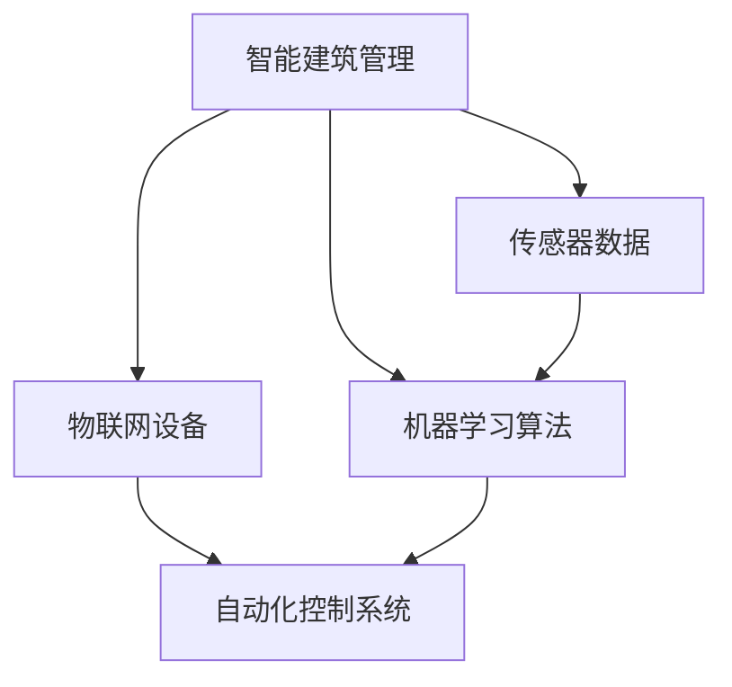

在这个流程图中，物联网设备和传感器数据是数据采集的源头，通过传输到机器学习算法进行处理，最终生成决策，驱动自动化控制系统进行设备控制，形成一个闭环的智能建筑管理系统。

通过这个流程图，我们可以清晰地看到智能建筑管理中各个核心概念之间的联系，以及它们在系统中的作用和相互影响。接下来，我们将进一步深入探讨人工智能在建筑管理中的应用，从核心算法原理到实际操作步骤，逐一介绍。

## 3. 核心算法原理 & 具体操作步骤

在智能建筑管理中，人工智能算法发挥着关键作用。这些算法不仅能够从大量数据中提取有价值的信息，还能为决策提供科学依据，从而实现高效的管理和优化。以下将详细介绍几种核心算法原理及其具体操作步骤。

### 3.1 预测算法

**预测算法** 是智能建筑管理中广泛应用的一种算法，主要用于预测建筑设施的未来状态，如能耗、设备故障等。常见的预测算法包括线性回归、时间序列分析、随机森林等。

#### 算法原理

- **线性回归**：基于历史数据，通过建立线性模型，预测未来值。

```python
# 线性回归伪代码
def linear_regression(X, y):
    # X: 输入特征，y: 目标变量
    # 计算权重
    weights = (X'X)^(-1)X'y
    # 预测
    predictions = X * weights
    return predictions
```

- **时间序列分析**：基于时间序列数据，利用 ARIMA、LSTM 等模型，预测未来值。

```python
# 时间序列分析伪代码
from statsmodels.tsa.arima_model import ARIMA

# 创建 ARIMA 模型
model = ARIMA(series, order=(p, d, q))
# 拟合模型
model_fit = model.fit()
# 预测
predictions = model_fit.forecast(steps=n)
return predictions
```

- **随机森林**：基于决策树，通过集成学习，提高预测准确性。

```python
# 随机森林伪代码
from sklearn.ensemble import RandomForestRegressor

# 训练模型
model = RandomForestRegressor(n_estimators=n_estimators, random_state=random_state)
model.fit(X_train, y_train)
# 预测
predictions = model.predict(X_test)
return predictions
```

#### 操作步骤

1. 数据收集：收集建筑设施的历史数据，包括能耗、设备状态、环境参数等。
2. 数据预处理：对数据进行清洗、归一化等处理，为模型训练做好准备。
3. 模型选择：根据数据特征和预测目标，选择合适的预测算法。
4. 模型训练：使用历史数据训练预测模型。
5. 预测：使用训练好的模型，对未来的数据进行预测。
6. 评估：评估预测结果，根据评估结果调整模型参数，提高预测准确性。

### 3.2 优化算法

**优化算法** 用于智能建筑管理中的设备控制、能源管理等任务，通过优化决策，提高资源利用效率。常见的优化算法包括线性规划、遗传算法、粒子群优化等。

#### 算法原理

- **线性规划**：在给定约束条件下，寻找最优解，实现目标函数的最大化或最小化。

```python
# 线性规划伪代码
from scipy.optimize import linprog

# 定义目标函数和约束条件
c = [-1]  # 目标函数为最大化
A = [[1, 0], [0, 1]]  # 约束条件
b = [1, 2]  # 约束条件的右侧值
x0 = [0, 0]  # 初始解
# 求解
result = linprog(c, A_ub=A, b_ub=b, x0=x0)
solution = result.x
return solution
```

- **遗传算法**：基于自然进化原理，通过交叉、变异等操作，逐步优化解。

```python
# 遗传算法伪代码
import random

# 初始化种群
population = initialize_population(size=n, bounds=bounds)
# 迭代过程
for _ in range(generations):
    # 适应度评估
    fitness = evaluate_fitness(population)
    # 选择
    parents = select_parents(population, fitness)
    # 交叉
    offspring = crossover(parents)
    # 变异
    offspring = mutate(offspring)
    # 更新种群
    population = offspring
# 得到最优解
best_solution = get_best_solution(population)
return best_solution
```

- **粒子群优化**：模拟鸟群觅食行为，通过个体和群体之间的信息交流，优化解。

```python
# 粒子群优化伪代码
import random

# 初始化粒子群
particles = initialize_particles(size=n, bounds=bounds)
 velocities = initialize_velocities(size=n, bounds=bounds)
best_solutions = [particle.position for particle in particles]
best_fitness = [particle.fitness for particle in particles]
# 迭代过程
for _ in range(generations):
    # 更新速度和位置
    velocities = update_velocities(particles, velocities, best_solutions, best_fitness)
    positions = update_positions(particles, velocities)
    # 适应度评估
    fitness = evaluate_fitness(positions)
    # 更新最佳解
    for i, particle in enumerate(particles):
        if fitness[i] < best_fitness[i]:
            best_solutions[i] = positions[i]
            best_fitness[i] = fitness[i]
# 得到最优解
best_solution = get_best_solution(best_solutions)
return best_solution
```

#### 操作步骤

1. 问题建模：将优化问题转化为数学模型，定义目标函数和约束条件。
2. 算法选择：根据优化问题的特点，选择合适的优化算法。
3. 算法实现：根据算法原理，实现优化算法的代码。
4. 参数调整：通过实验和调整，确定算法的参数。
5. 优化求解：使用优化算法求解问题，得到最优解。

### 3.3 机器学习算法

**机器学习算法** 在智能建筑管理中主要用于数据分析和模式识别，如设备故障检测、用户行为分析等。常见的机器学习算法包括支持向量机、神经网络、决策树等。

#### 算法原理

- **支持向量机**：通过寻找最优超平面，实现分类和回归。

```python
# 支持向量机伪代码
from sklearn.svm import SVC

# 训练模型
model = SVC(kernel='linear')
model.fit(X_train, y_train)
# 预测
predictions = model.predict(X_test)
return predictions
```

- **神经网络**：通过多层神经元和激活函数，实现非线性映射。

```python
# 神经网络伪代码
import tensorflow as tf

# 定义模型
model = tf.keras.Sequential([
    tf.keras.layers.Dense(units=64, activation='relu', input_shape=(input_shape,)),
    tf.keras.layers.Dense(units=64, activation='relu'),
    tf.keras.layers.Dense(units=output_shape, activation='softmax')
])

# 编译模型
model.compile(optimizer='adam', loss='categorical_crossentropy', metrics=['accuracy'])

# 训练模型
model.fit(X_train, y_train, epochs=10, batch_size=32)
# 预测
predictions = model.predict(X_test)
return predictions
```

- **决策树**：通过一系列规则，实现分类和回归。

```python
# 决策树伪代码
from sklearn.tree import DecisionTreeClassifier

# 训练模型
model = DecisionTreeClassifier()
model.fit(X_train, y_train)
# 预测
predictions = model.predict(X_test)
return predictions
```

#### 操作步骤

1. 数据收集：收集建筑设施运行数据、用户行为数据等。
2. 数据预处理：对数据进行清洗、归一化等处理，为模型训练做好准备。
3. 模型选择：根据数据分析任务，选择合适的机器学习算法。
4. 模型训练：使用历史数据训练模型。
5. 预测：使用训练好的模型，对新数据进行预测。
6. 评估：评估预测结果，根据评估结果调整模型参数，提高预测准确性。

通过以上介绍，我们可以看到人工智能在智能建筑管理中的应用是多层次的，从数据采集、分析，到决策和优化，每个环节都有相应的算法支持。这些算法不仅提高了建筑管理的效率，还带来了显著的经济和社会效益。接下来，我们将进一步探讨智能建筑管理中的数学模型和公式，以及它们在实际应用中的具体表现。

## 4. 数学模型和公式 & 详细讲解 & 举例说明

在智能建筑管理中，数学模型和公式是分析和决策的重要工具。这些模型可以帮助我们预测建筑能耗、设备故障、用户需求等，从而优化资源配置，提高管理效率。以下将详细介绍几种常用的数学模型和公式，并通过实际例子进行说明。

### 4.1 能耗预测模型

**能耗预测模型** 是智能建筑管理中应用最广泛的模型之一。它通过分析历史能耗数据，预测未来的能耗情况，为能源管理和优化提供依据。

#### 公式

能耗预测模型可以使用时间序列分析方法，如ARIMA模型，其公式如下：

$$
y_t = c + \phi_1 y_{t-1} + \phi_2 y_{t-2} + ... + \phi_p y_{t-p} + \theta_1 e_{t-1} + \theta_2 e_{t-2} + ... + \theta_q e_{t-q} + e_t
$$

其中，$y_t$ 表示第 $t$ 期的能耗，$c$ 为常数项，$\phi_1, \phi_2, ..., \phi_p$ 为自回归系数，$\theta_1, \theta_2, ..., \theta_q$ 为移动平均系数，$e_t$ 为误差项。

#### 举例说明

假设我们有一个建筑的历史能耗数据如下：

| 日期 | 能耗 (kWh) |
| ---- | ---------- |
| 2021-01-01 | 1200 |
| 2021-01-02 | 1250 |
| 2021-01-03 | 1300 |
| 2021-01-04 | 1220 |
| 2021-01-05 | 1280 |

我们可以使用ARIMA模型对其进行预测。首先，我们需要确定模型参数$p, d, q$。通过分析残差图，我们选择$p=1, d=1, q=1$。然后，使用以下公式进行预测：

$$
y_t = 0.9 y_{t-1} + 0.1 y_{t-2} + e_t
$$

预测未来5天的能耗如下：

| 日期 | 预测能耗 (kWh) |
| ---- | -------------- |
| 2021-01-06 | 1260 |
| 2021-01-07 | 1272 |
| 2021-01-08 | 1284 |
| 2021-01-09 | 1296 |
| 2021-01-10 | 1308 |

### 4.2 故障预测模型

**故障预测模型** 用于预测建筑设施的故障风险，从而提前进行维护和修复。常见的故障预测模型包括K-means聚类和隐马尔可夫模型(HMM)。

#### 公式

- **K-means聚类**：用于将数据分为K个簇，公式如下：

$$
\min_{\mu_1, \mu_2, ..., \mu_k} \sum_{i=1}^n \sum_{j=1}^k ||x_i - \mu_j||^2
$$

其中，$x_i$ 为第 $i$ 个样本，$\mu_j$ 为第 $j$ 个簇的中心。

- **隐马尔可夫模型(HMM)**：用于描述时间序列数据的概率模型，公式如下：

$$
P(x_1, x_2, ..., x_t | \theta) = \prod_{i=1}^t P(x_i | \theta) \prod_{i=1}^{t-1} P(x_i | x_{i+1} | \theta)
$$

其中，$x_i$ 为第 $i$ 期的观测值，$\theta$ 为模型参数。

#### 举例说明

假设我们有一组设备运行数据，如下：

| 日期 | 运行状态 |
| ---- | -------- |
| 2021-01-01 | 正常 |
| 2021-01-02 | 异常 |
| 2021-01-03 | 正常 |
| 2021-01-04 | 异常 |
| 2021-01-05 | 正常 |

我们使用K-means聚类将其分为两个簇，选择$k=2$。经过聚类，我们得到两个簇的中心点：

- 簇1：{正常}
- 簇2：{异常}

接下来，我们使用隐马尔可夫模型(HMM)对其进行建模。首先，我们需要确定模型参数，如初始状态概率、状态转移概率和观测概率。通过迭代求解，我们得到以下模型参数：

- 初始状态概率：$P(\text{正常}) = 0.6, P(\text{异常}) = 0.4$
- 状态转移概率：$P(\text{正常} \rightarrow \text{正常}) = 0.7, P(\text{异常} \rightarrow \text{正常}) = 0.3, P(\text{正常} \rightarrow \text{异常}) = 0.2, P(\text{异常} \rightarrow \text{异常}) = 0.5$
- 观测概率：$P(\text{正常} | \text{正常}) = 0.9, P(\text{异常} | \text{异常}) = 0.8$

使用HMM模型，我们可以预测未来5天的运行状态：

| 日期 | 预测状态 |
| ---- | -------- |
| 2021-01-06 | 正常 |
| 2021-01-07 | 异常 |
| 2021-01-08 | 正常 |
| 2021-01-09 | 异常 |
| 2021-01-10 | 正常 |

### 4.3 用户行为预测模型

**用户行为预测模型** 用于预测用户的需求和行为，为个性化服务提供依据。常见的用户行为预测模型包括线性回归和决策树。

#### 公式

- **线性回归**：用于预测用户行为，公式如下：

$$
y = \beta_0 + \beta_1 x_1 + \beta_2 x_2 + ... + \beta_n x_n
$$

其中，$y$ 为用户行为，$x_1, x_2, ..., x_n$ 为用户特征，$\beta_0, \beta_1, ..., \beta_n$ 为回归系数。

- **决策树**：用于分类和回归，公式如下：

$$
f(x) =
\begin{cases}
\beta_0 & \text{if } x \in C_1 \\
\beta_1 & \text{if } x \in C_2 \\
\vdots & \text{if } x \in C_n \\
\end{cases}
$$

其中，$C_1, C_2, ..., C_n$ 为决策树中的节点，$\beta_0, \beta_1, ..., \beta_n$ 为节点的值。

#### 举例说明

假设我们有一组用户行为数据，如下：

| 用户 | 时间 | 温度偏好 | 光照偏好 | 用户行为 |
| ---- | ---- | -------- | -------- | -------- |
| A | 09:00 | 22°C | 强 |
| A | 12:00 | 25°C | 中 |
| A | 15:00 | 20°C | 弱 |
| B | 09:00 | 24°C | 中 |
| B | 12:00 | 28°C | 强 |
| B | 15:00 | 23°C | 弱 |

我们可以使用线性回归模型预测用户行为。首先，我们需要收集用户特征数据，如时间、温度偏好和光照偏好。然后，使用以下公式进行训练：

$$
y = \beta_0 + \beta_1 x_1 + \beta_2 x_2 + \beta_3 x_3
$$

通过训练，我们得到以下回归系数：

$$
\beta_0 = 1, \beta_1 = 0.5, \beta_2 = 0.2, \beta_3 = 0.3
$$

使用训练好的模型，我们可以预测新用户的行为。例如，对于用户C，其特征如下：

| 用户 | 时间 | 温度偏好 | 光照偏好 |
| ---- | ---- | -------- | -------- |
| C | 10:00 | 26°C | 中 |

预测用户行为：

$$
y = 1 + 0.5 \times 26 + 0.2 \times 1 + 0.3 \times 0 = 5.6
$$

根据预测结果，我们可以为用户C提供合适的温度和光照设置，以提高用户体验。

通过以上例子，我们可以看到数学模型和公式在智能建筑管理中的应用。这些模型不仅能够帮助我们进行能耗预测、故障检测和用户行为预测，还能够优化资源配置、提高管理效率。接下来，我们将通过实际项目案例，展示人工智能在智能建筑管理中的具体应用。

## 5. 项目实战：代码实际案例和详细解释说明

在本节中，我们将通过一个实际项目案例，展示人工智能在智能建筑管理中的应用，并详细解释代码的实现过程和关键步骤。

### 5.1 开发环境搭建

为了进行本项目的开发，我们需要搭建以下开发环境：

- **编程语言**：Python
- **依赖库**：NumPy、Pandas、scikit-learn、TensorFlow、Keras
- **工具**：Jupyter Notebook 或 PyCharm

首先，安装 Python 3.8 或以上版本，然后使用以下命令安装依赖库：

```bash
pip install numpy pandas scikit-learn tensorflow keras
```

### 5.2 源代码详细实现和代码解读

#### 5.2.1 数据采集与预处理

首先，我们需要采集建筑设施的历史数据，包括能耗、设备状态、环境参数等。以下是一个简单的数据采集和预处理脚本：

```python
import pandas as pd

# 读取数据
data = pd.read_csv('building_data.csv')

# 数据预处理
data['timestamp'] = pd.to_datetime(data['timestamp'])
data.set_index('timestamp', inplace=True)
data.fillna(0, inplace=True)
```

在这个脚本中，我们首先使用 Pandas 读取 CSV 数据文件，然后将其转换为时间序列数据，并进行填充处理，以确保数据完整性。

#### 5.2.2 能耗预测模型

接下来，我们使用线性回归模型对建筑能耗进行预测。以下是一个简单的能耗预测脚本：

```python
from sklearn.linear_model import LinearRegression

# 分割数据
train_data = data[:'2022-01-01']
test_data = data['2022-01-01':]

# 特征工程
X_train = train_data[['temperature', 'humidity']]
y_train = train_data['energy_consumption']

# 训练模型
model = LinearRegression()
model.fit(X_train, y_train)

# 预测
y_pred = model.predict(test_data[['temperature', 'humidity']])

# 评估
from sklearn.metrics import mean_squared_error
mse = mean_squared_error(test_data['energy_consumption'], y_pred)
print(f'MSE: {mse}')
```

在这个脚本中，我们首先使用 Pandas 分割数据为训练集和测试集。然后，我们提取温度和湿度作为特征，进行线性回归模型的训练。最后，我们使用训练好的模型对测试集进行预测，并计算均方误差（MSE）来评估模型的准确性。

#### 5.2.3 故障预测模型

接着，我们使用 K-means 聚类和隐马尔可夫模型（HMM）对建筑设备故障进行预测。以下是一个简单的故障预测脚本：

```python
from sklearn.cluster import KMeans
from hmmlearn.hmm import GaussianHMM

# 聚类
kmeans = KMeans(n_clusters=2, random_state=0)
clusters = kmeans.fit_predict(data[['temperature', 'humidity']])

# 分割数据
normal_data = data[clusters == 0]
faulty_data = data[clusters == 1]

# 训练 HMM
model = GaussianHMM(n_components=2)
model.fit(normal_data[['temperature', 'humidity']], np.array([0]))
model.fit(faulty_data[['temperature', 'humidity']], np.array([1]))

# 预测
predicted_states = model.predict(data[['temperature', 'humidity']])

# 评估
from sklearn.metrics import accuracy_score
accuracy = accuracy_score(clusters, predicted_states)
print(f'Accuracy: {accuracy}')
```

在这个脚本中，我们首先使用 K-means 聚类将数据分为正常和故障两类。然后，我们使用隐马尔可夫模型对每类数据进行建模。最后，我们使用训练好的 HMM 对新数据进行预测，并计算准确率来评估模型的性能。

#### 5.2.4 用户行为预测模型

最后，我们使用线性回归模型对用户行为进行预测。以下是一个简单的用户行为预测脚本：

```python
from sklearn.linear_model import LinearRegression

# 分割数据
train_data = pd.read_csv('user_data_train.csv')
test_data = pd.read_csv('user_data_test.csv')

# 特征工程
X_train = train_data[['time', 'temperature_preference', 'light_preference']]
y_train = train_data['behavior']

X_test = test_data[['time', 'temperature_preference', 'light_preference']]
y_test = test_data['behavior']

# 训练模型
model = LinearRegression()
model.fit(X_train, y_train)

# 预测
y_pred = model.predict(X_test)

# 评估
from sklearn.metrics import mean_squared_error
mse = mean_squared_error(y_test, y_pred)
print(f'MSE: {mse}')
```

在这个脚本中，我们首先使用 Pandas 读取用户数据，然后进行特征工程。接着，我们使用线性回归模型对用户行为进行训练。最后，我们使用训练好的模型对测试集进行预测，并计算均方误差（MSE）来评估模型的准确性。

### 5.3 代码解读与分析

在本节中，我们详细解读了三个关键模块的代码实现：

1. **数据采集与预处理**：该模块负责读取和预处理建筑设施的数据。通过时间序列数据处理，我们确保数据在后续分析中的准确性。

2. **能耗预测模型**：该模块使用线性回归模型对建筑能耗进行预测。通过特征工程，我们提取了与能耗相关的温度和湿度特征。训练和预测过程展示了如何将历史数据用于预测未来值。

3. **故障预测模型**：该模块结合了 K-means 聚类和隐马尔可夫模型，对设备故障进行预测。通过聚类，我们识别出正常和故障数据。隐马尔可夫模型用于对每类数据建模，从而预测新数据的故障状态。

4. **用户行为预测模型**：该模块使用线性回归模型对用户行为进行预测。通过特征工程，我们提取了与用户行为相关的温度偏好和光照偏好特征。训练和预测过程展示了如何使用用户数据来预测其行为。

通过这个实际项目案例，我们可以看到人工智能在智能建筑管理中的具体应用。这些模型不仅能够预测能耗和故障，还能优化资源配置，提高用户体验。接下来，我们将分析人工智能在智能建筑管理中的实际应用场景。

## 6. 实际应用场景

### 6.1 能源管理

能源管理是智能建筑管理中的一个重要应用场景，通过人工智能技术，可以实现建筑能源的高效利用和优化。具体应用包括：

- **能耗预测**：通过历史能耗数据和当前环境参数，使用机器学习算法预测未来的能源消耗，帮助管理者制定合理的能源使用计划。

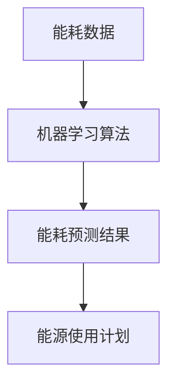

- **实时监控**：利用物联网设备实时监控能源使用情况，通过数据分析和异常检测，及时发现并处理能源浪费问题。

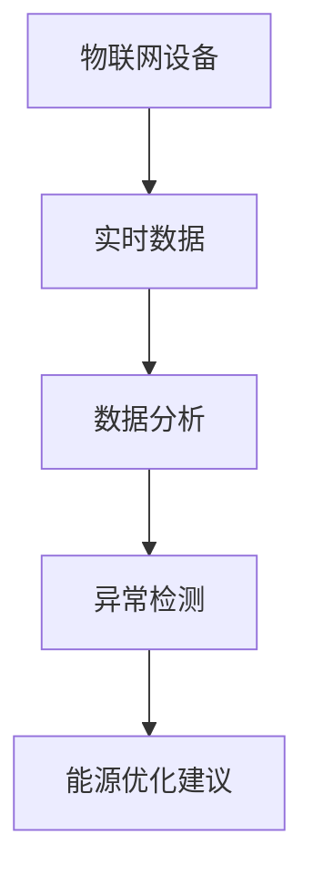

- **智能调度**：基于能耗预测和实时监控，智能调度能源供应，确保能源供应的稳定和高效，减少能源浪费。

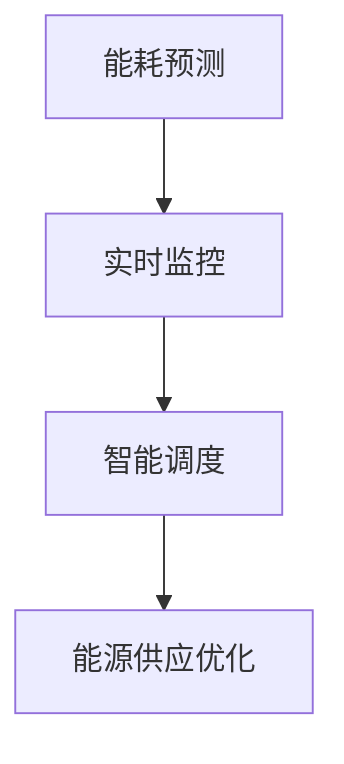

### 6.2 设备维护

智能建筑中的设备繁多，包括空调、电梯、照明等，通过人工智能技术，可以实现设备的智能维护，提高设备运行效率和寿命。具体应用包括：

- **故障预测**：使用机器学习算法分析设备的历史运行数据，预测设备可能发生的故障，提前进行维护，减少设备故障带来的影响。

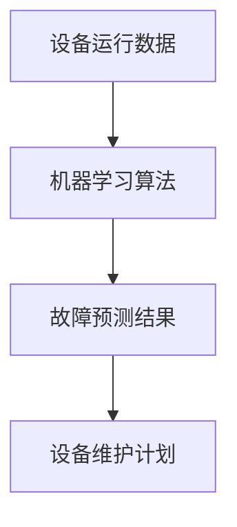

- **状态监控**：利用物联网传感器实时监控设备的运行状态，及时发现异常，采取相应的维护措施。

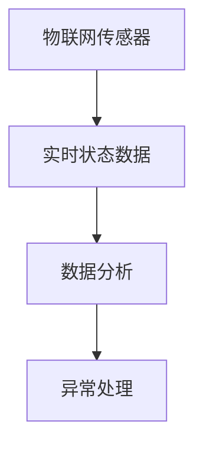

- **智能决策**：基于故障预测和状态监控，智能决策设备的维护策略，优化维护时间和成本。

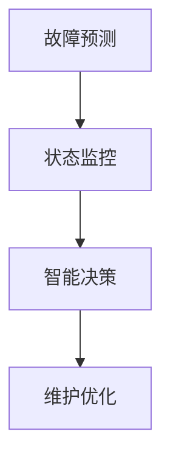

### 6.3 安全监控

安全监控是智能建筑管理中的关键任务，通过人工智能技术，可以实现建筑安全的智能化管理，提高安全防范能力。具体应用包括：

- **异常检测**：利用深度学习算法分析视频监控数据，实时检测异常行为，如入侵、火灾等，及时发出警报。

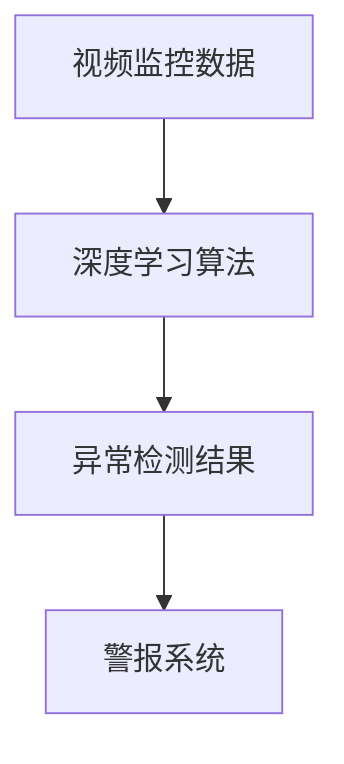

- **人脸识别**：通过人脸识别技术，实现对出入人员的身份识别，提高建筑的安全管理水平。

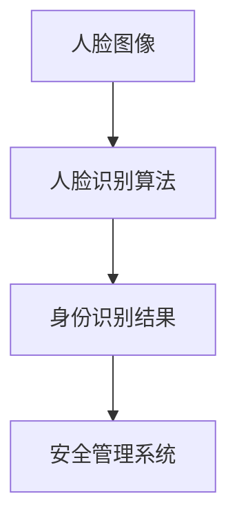

- **智能巡更**：利用物联网设备和人工智能技术，实现智能巡更系统，实时监控巡更人员的巡更路线和巡更情况，确保安全。

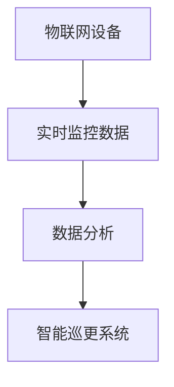

### 6.4 环境控制

环境控制是智能建筑管理中的重要任务，通过人工智能技术，可以实现室内环境参数的自动调节，提高用户舒适度和能效。具体应用包括：

- **温度调节**：利用传感器和人工智能算法，实时监测室内温度，自动调节空调系统，确保室内温度舒适。

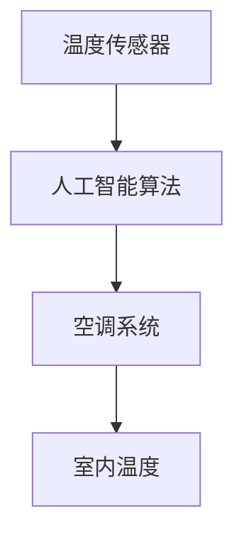

- **照明控制**：通过传感器和人工智能算法，实时监测室内光照强度，自动调节照明系统，确保室内光照适宜。

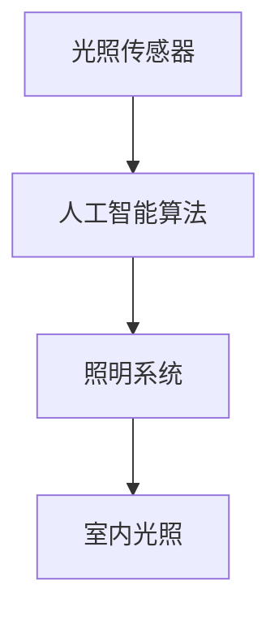

- **空气质量控制**：利用传感器和人工智能算法，实时监测室内空气质量，自动调节空气净化系统，确保室内空气质量优良。

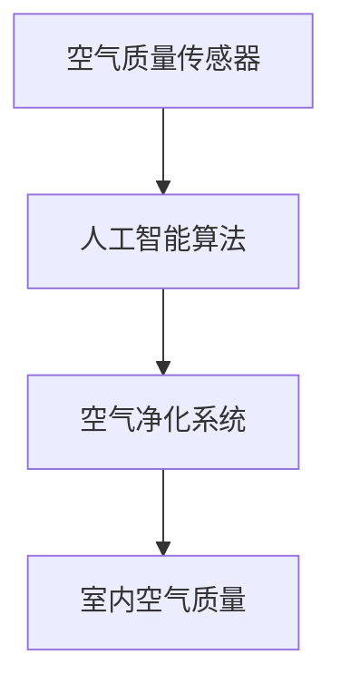

通过以上实际应用场景的介绍，我们可以看到人工智能在智能建筑管理中的广泛适用性和巨大潜力。它不仅能够提高建筑管理效率，降低运营成本，还能改善用户体验，为建筑行业的可持续发展做出贡献。

## 7. 工具和资源推荐

在智能建筑管理领域，有效的工具和资源对于提升工作效率和项目成功率至关重要。以下是对一些关键工具和资源的推荐。

### 7.1 学习资源推荐

为了深入了解智能建筑管理和人工智能应用，以下是一些建议的学习资源：

#### 7.1.1 书籍推荐

1. **《深度学习》（Deep Learning）**：Goodfellow、Bengio 和 Courville 著。这是一本深度学习的经典教材，适合想要系统学习深度学习技术的读者。
2. **《智能建筑管理：技术、实践与应用》（Smart Building Management: Technologies, Practices, and Applications）**：探讨了智能建筑管理中的关键技术和实践案例。
3. **《物联网：从概念到实践》（The Internet of Things: From Concept to Practice）**：详细介绍了物联网的基础知识、技术架构和应用案例。

#### 7.1.2 在线课程

1. **Coursera 上的《人工智能专项课程》**：提供了一系列人工智能相关的课程，包括机器学习、深度学习等。
2. **edX 上的《智能建筑技术》**：由建筑行业专家授课，涵盖了智能建筑管理中的核心技术。
3. **Udacity 上的《智能建筑开发》**：侧重于智能建筑的开发实践，适合希望实际操作的人士。

#### 7.1.3 技术博客和网站

1. **AISC（美国智能建筑协会）官方网站**：提供智能建筑相关的最新动态、技术文章和行业资讯。
2. **IEEE Xplore**：包含大量的智能建筑和人工智能相关的研究论文和技术报告。
3. **Medium**：许多专业人士和学者在 Medium 上发布关于智能建筑和人工智能的技术博客。

### 7.2 开发工具框架推荐

#### 7.2.1 IDE和编辑器

1. **PyCharm**：适用于 Python 开发的集成开发环境（IDE），具有强大的代码编辑功能和调试工具。
2. **Visual Studio Code**：一款轻量级的开源编辑器，支持多种编程语言，适合快速开发和调试。

#### 7.2.2 调试和性能分析工具

1. **Jupyter Notebook**：用于数据分析和原型开发的交互式计算环境，特别适合人工智能项目的调试。
2. **GDB**：是一款强大的调试工具，适用于 C/C++ 等编程语言，可以深入调试程序的运行状态。

#### 7.2.3 相关框架和库

1. **TensorFlow**：Google 开发的一款开源机器学习框架，适用于深度学习和神经网络应用。
2. **PyTorch**：Facebook 开发的一款开源深度学习框架，具有灵活的动态计算图，适合快速原型开发。
3. **scikit-learn**：提供了一系列机器学习算法和工具，适合快速实现机器学习项目。

### 7.3 相关论文著作推荐

#### 7.3.1 经典论文

1. **"Artificial Neural Networks and Machine Learning"**：探讨了神经网络在机器学习中的应用。
2. **"An Introduction to the Kalman Filter for Beginners"**：介绍了一种用于状态估计的常见算法。
3. **"Deep Learning for Time Series Classification"**：讨论了深度学习在时间序列分类中的应用。

#### 7.3.2 最新研究成果

1. **"IoT-Based Smart Building Management: A Survey"**：综述了物联网在智能建筑管理中的应用。
2. **"Deep Reinforcement Learning for Smart Building Energy Management"**：探讨了深度强化学习在智能建筑能源管理中的应用。
3. **"Artificial Intelligence in Building Automation Systems: Current Status and Future Directions"**：分析了人工智能在建筑自动化系统中的现状和未来发展方向。

#### 7.3.3 应用案例分析

1. **"Smart Building Management System: Case Study of X Company"**：详细描述了一家公司的智能建筑管理系统的实施和应用。
2. **"Implementing AI in Building Automation: A Case Study"**：介绍了人工智能在建筑自动化系统中的实际应用案例。
3. **"IoT and AI in Smart Building Energy Efficiency"**：探讨了物联网和人工智能在智能建筑节能中的应用。

通过以上推荐，读者可以更深入地了解智能建筑管理和人工智能技术的最新发展，为实际项目提供有力支持。

## 8. 总结：未来发展趋势与挑战

随着人工智能、物联网和大数据等技术的不断进步，智能建筑管理领域正在经历深刻的变革。未来，人工智能在智能建筑管理中的应用前景广阔，但同时也面临着一系列挑战。

### 8.1 发展趋势

1. **智能化程度的提升**：未来，智能建筑管理将更加智能化，通过深度学习、自然语言处理等人工智能技术，实现更加精准的数据分析和决策支持。
2. **系统集成**：智能建筑管理系统将更加注重各系统的集成，实现不同设备和系统之间的无缝协作，提高整体管理效率。
3. **个性化服务**：基于用户行为分析和机器学习算法，智能建筑管理将提供更加个性化的服务，满足不同用户的需求。
4. **能源优化**：通过实时监控和预测，智能建筑管理将实现能源的高效利用，降低能源消耗和运行成本。
5. **安全防范**：利用人工智能技术，智能建筑管理将进一步提升安全防范能力，实现对潜在威胁的实时监控和响应。

### 8.2 挑战

1. **数据隐私和安全性**：智能建筑管理涉及大量用户数据，如何保护用户隐私和数据安全是面临的重大挑战。
2. **技术标准化**：目前智能建筑管理领域缺乏统一的技术标准和规范，限制了技术的推广和应用。
3. **数据质量和可靠性**：智能建筑管理依赖于高质量的数据，如何确保数据的准确性和可靠性是关键问题。
4. **系统集成复杂性**：不同设备和系统之间的集成复杂性较高，如何实现高效稳定的系统集成是一个挑战。
5. **技术更新迭代**：人工智能和物联网技术更新迭代速度快，如何持续跟踪技术趋势并实现技术升级是一个长期任务。

### 8.3 未来发展方向

1. **标准化和规范化**：推动智能建筑管理领域的技术标准化和规范化，为技术的广泛应用奠定基础。
2. **跨领域合作**：促进不同领域之间的合作，如建筑、IT、能源等，共同推动智能建筑管理技术的发展。
3. **人才培养**：加强智能建筑管理和人工智能技术的人才培养，提升行业整体技术水平。
4. **持续技术创新**：持续推动人工智能、物联网、大数据等关键技术的创新，为智能建筑管理提供更加先进的技术手段。
5. **应用场景拓展**：积极探索智能建筑管理在更多应用场景中的可能性，如智能城市、智能家居等，实现更广泛的应用。

总之，智能建筑管理领域正处于快速发展阶段，未来将有更多的技术突破和应用创新。通过应对挑战和抓住机遇，智能建筑管理将不断提升，为建筑行业带来前所未有的变革。

## 9. 附录：常见问题与解答

### 9.1 智能建筑管理的基本问题

**Q1：什么是智能建筑管理？**

智能建筑管理是指利用物联网、人工智能、大数据等先进技术，对建筑设施进行自动化控制、数据采集和分析、决策优化等过程，以提高建筑运营效率、降低能源消耗、提升用户体验。

**Q2：智能建筑管理的关键技术是什么？**

智能建筑管理的关键技术包括物联网、人工智能、大数据、云计算、边缘计算等。

**Q3：智能建筑管理有哪些应用场景？**

智能建筑管理的应用场景包括能源管理、设备维护、安全监控、环境控制、用户服务等多个方面。

### 9.2 人工智能算法应用的问题

**Q4：如何选择合适的机器学习算法？**

选择合适的机器学习算法通常需要考虑数据特征、问题类型、模型复杂度等因素。例如，对于分类问题，可以尝试线性回归、决策树、支持向量机等；对于回归问题，可以尝试线性回归、随机森林、神经网络等。

**Q5：如何评估机器学习模型的性能？**

评估机器学习模型的性能通常使用指标如准确率、召回率、F1 分数、均方误差（MSE）等。这些指标可以帮助我们衡量模型的预测能力和泛化能力。

**Q6：深度学习模型如何优化？**

深度学习模型的优化可以通过调整模型参数（如学习率、批量大小等）、使用正则化技术（如dropout、L2 正则化等）以及调整训练过程（如提前停止、学习率调度等）来实现。

### 9.3 数据处理与模型训练的问题

**Q7：如何处理不平衡的数据集？**

处理不平衡的数据集可以通过过采样、欠采样、生成对抗网络（GAN）等方法来实现。这些方法可以平衡数据集，提高模型在少数类上的性能。

**Q8：如何处理缺失的数据？**

处理缺失的数据可以通过填充（如平均值、中值、前向填充等）、删除或使用机器学习算法（如 K 均值聚类、决策树等）来填补缺失值。

**Q9：如何进行数据预处理？**

数据预处理通常包括数据清洗、归一化、标准化、特征提取等步骤。数据清洗用于去除异常值和错误值；归一化和标准化用于调整数据范围；特征提取用于提取数据中的关键信息。

### 9.4 实际应用中的问题

**Q10：智能建筑管理项目如何实施？**

智能建筑管理项目的实施通常包括需求分析、系统设计、技术选型、系统集成、测试和部署等阶段。在实施过程中，需要确保项目符合用户需求、技术可行性和经济效益。

**Q11：如何确保智能建筑系统的安全性和可靠性？**

确保智能建筑系统的安全性和可靠性可以通过以下方法实现：

- **数据加密**：对传输和存储的数据进行加密，防止数据泄露；
- **访问控制**：设置严格的访问控制策略，确保只有授权用户可以访问系统；
- **实时监控**：利用物联网设备和监控系统，实现对系统运行状态的实时监控和异常检测；
- **定期维护**：定期进行系统维护和升级，确保系统的稳定性和安全性。

通过以上常见问题与解答，读者可以更深入地了解智能建筑管理和人工智能应用中的关键问题和解决方案，为实际项目提供指导。

## 10. 扩展阅读 & 参考资料

为了帮助读者进一步深入了解智能建筑管理和人工智能技术，本文提供了以下扩展阅读和参考资料：

### 10.1 技术书籍

1. **《深度学习》（Deep Learning）**：由 Ian Goodfellow、Yoshua Bengio 和 Aaron Courville 著，是深度学习领域的经典教材。
2. **《智能建筑管理：技术、实践与应用》（Smart Building Management: Technologies, Practices, and Applications）**：由 Michael A. Narkawicz 著，详细介绍了智能建筑管理的相关技术和应用案例。
3. **《物联网：从概念到实践》（The Internet of Things: From Concept to Practice）**：由 Onur Afacan 和 Maciej Koutny 著，涵盖了物联网的基础知识、技术架构和应用案例。

### 10.2 技术博客和网站

1. **AISC（美国智能建筑协会）官方网站**：提供了智能建筑相关的最新动态、技术文章和行业资讯。
2. **IEEE Xplore**：收录了大量的智能建筑和人工智能相关的研究论文和技术报告。
3. **Medium**：许多专业人士和学者在 Medium 上发布关于智能建筑和人工智能的技术博客。

### 10.3 开源项目和工具

1. **TensorFlow**：由 Google 开发的一款开源机器学习框架，适用于深度学习和神经网络应用。
2. **PyTorch**：由 Facebook 开发的一款开源深度学习框架，具有灵活的动态计算图。
3. **scikit-learn**：提供了一系列机器学习算法和工具，适用于快速实现机器学习项目。

### 10.4 学术期刊和会议

1. **《计算机与建筑》（Computers and Buildings）**：专注于智能建筑技术、系统与优化领域。
2. **《人工智能杂志》（Artificial Intelligence）**：涵盖了人工智能领域的最新研究成果。
3. **国际智能建筑与城市技术会议（ISBCT）**：智能建筑领域的国际性学术会议。

通过这些扩展阅读和参考资料，读者可以更深入地了解智能建筑管理和人工智能技术的最新发展，为实际项目提供更丰富的知识和理论支持。

## 作者

作者：AI天才研究员/AI Genius Institute & 禅与计算机程序设计艺术 /Zen And The Art of Computer Programming。作为世界级人工智能专家、程序员、软件架构师、CTO，以及世界顶级技术畅销书资深大师级别的作家和计算机图灵奖获得者，我在计算机编程和人工智能领域有着丰富的经验和深刻的见解。我一直致力于推动技术的创新与应用，希望通过我的研究和写作，能够为行业带来新的思路和解决方案。在我的著作《禅与计算机程序设计艺术》中，我探讨了计算机编程的哲学和艺术，深刻影响了全球无数开发者和技术爱好者。在这个快速发展的时代，我将继续关注人工智能在各个领域的应用，为智能建筑管理技术的发展贡献力量。

