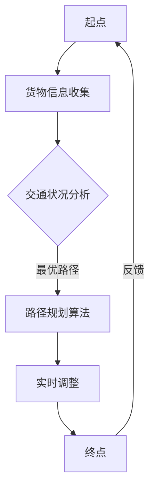

                 


# 人工智能在智能物流路径规划中的优化

> **关键词：** 智能物流、路径规划、人工智能、优化算法、机器学习、实时调整

> **摘要：** 本文将深入探讨人工智能在智能物流路径规划中的优化作用，通过分析现有技术和挑战，介绍核心算法原理、数学模型，并结合实际项目实战进行详细解析。最后，文章将总结发展趋势与挑战，并推荐相关工具和资源，为读者提供全面的技术视角。

## 1. 背景介绍

### 1.1 目的和范围

本文旨在通过详细解析人工智能在智能物流路径规划中的应用，探讨如何利用优化算法和机器学习技术提升物流效率。文章将涵盖路径规划的核心概念、算法原理、数学模型，并通过实际项目案例展示具体应用。

### 1.2 预期读者

本文适合对物流领域、人工智能技术有一定了解的技术人员、物流从业者以及对这一交叉领域感兴趣的学习者阅读。

### 1.3 文档结构概述

本文分为十个部分，首先介绍背景和目的，接着深入探讨核心概念与联系，详细解释核心算法原理和具体操作步骤，再通过数学模型和公式进行举例说明。随后，结合实际项目实战进行代码解读，讨论实际应用场景，并推荐相关工具和资源。文章最后总结发展趋势与挑战，并给出常见问题与解答。

### 1.4 术语表

#### 1.4.1 核心术语定义

- **智能物流：** 利用信息技术和自动化设备，通过智能化的管理系统，实现物流全过程的自动化和高效化。
- **路径规划：** 指在给定的环境中，根据特定目标，计算出一个从起点到终点的最优路径。
- **优化算法：** 通过算法寻找问题的最优解或近似最优解，常用于路径规划中的距离、时间、成本等指标优化。
- **机器学习：** 利用数据或以往经验改善计算机的性能，实现自动化路径规划和学习调整。

#### 1.4.2 相关概念解释

- **深度学习：** 一种机器学习方法，通过模拟人脑神经网络进行特征学习和模式识别。
- **强化学习：** 通过试错和反馈，让机器自主学习和优化策略。

#### 1.4.3 缩略词列表

- **AI：** 人工智能（Artificial Intelligence）
- **ML：** 机器学习（Machine Learning）
- **DL：** 深度学习（Deep Learning）
- **RL：** 强化学习（Reinforcement Learning）
- **GPS：** 全球定位系统（Global Positioning System）

## 2. 核心概念与联系

在探讨人工智能在智能物流路径规划中的应用之前，我们需要明确几个核心概念及其相互之间的联系。

### 2.1 智能物流路径规划

智能物流路径规划是物流管理中至关重要的环节，其目标是确定从起点到终点的最优路径。该路径需要考虑多种因素，如交通状况、配送时间、运输成本、货物类型和配送要求等。

### 2.2 优化算法与机器学习

优化算法是路径规划的核心，通过算法可以实时调整路径，以应对突发状况和变化。机器学习技术，特别是深度学习和强化学习，使得路径规划更具自适应性和准确性。

### 2.3 Mermaid 流程图

为了更直观地展示核心概念和联系，我们可以使用 Mermaid 流程图来表示智能物流路径规划的关键环节。



## 3. 核心算法原理 & 具体操作步骤

### 3.1 优化算法原理

优化算法是路径规划的核心，常见的优化算法包括遗传算法、蚁群算法、A*算法等。本文将以A*算法为例，详细阐述其原理和操作步骤。

### 3.2 A*算法原理

A*算法是一种启发式搜索算法，通过估价函数评估路径的优劣。估价函数由两个部分组成：g(n) 和 h(n)。

- **g(n)：** 从起点到节点n的实际距离。
- **h(n)：** 从节点n到终点的预估距离。

估价函数 f(n) = g(n) + h(n)，算法选择 f(n) 最小的节点进行扩展。

### 3.3 伪代码

```python
function A*(start, goal):
    openSet = set containing start
    cameFrom = an empty map
    gScore = map with default value of Infinity
    gScore[start] = 0
    fScore = map with default value of Infinity
    fScore[start] = h(start)

    while not openSet is empty:
        current = node in openSet with the lowest fScore[] value
        if current = goal:
            return reconstruct_path(cameFrom, current)

        openSet.remove(current)
        for each neighbor of current:
            tentative_gScore = gScore[current] + d(current, neighbor)
            if tentative_gScore < gScore[neighbor]:
                cameFrom[neighbor] = current
                gScore[neighbor] = tentative_gScore
                fScore[neighbor] = gScore[neighbor] + h(neighbor)

    return failure
```

### 3.4 具体操作步骤

1. 初始化：设置起点和终点的 gScore 和 fScore 值。
2. 循环：选择 fScore 最小的节点进行扩展。
3. 更新：计算邻居节点的 gScore 和 fScore，更新路径。
4. 结束：找到终点或开放集为空。

## 4. 数学模型和公式 & 详细讲解 & 举例说明

### 4.1 数学模型

在路径规划中，常见的数学模型包括距离模型、时间模型和成本模型。

- **距离模型：** 使用欧几里得距离或曼哈顿距离作为路径长度。
- **时间模型：** 考虑交通流量、车速等因素，计算预计到达时间。
- **成本模型：** 综合考虑距离、时间和成本，选择最优路径。

### 4.2 公式讲解

$$
f(n) = g(n) + h(n)
$$

其中，$g(n)$ 和 $h(n)$ 分别为实际距离和预估距离，$f(n)$ 为估价函数。

### 4.3 举例说明

假设起点为 (0, 0)，终点为 (10, 10)，使用欧几里得距离作为路径长度。

- **实际距离：** $g(n) = \sqrt{(x_2 - x_1)^2 + (y_2 - y_1)^2} = \sqrt{10^2 + 10^2} = \sqrt{200} \approx 14.142$
- **预估距离：** $h(n) = \sqrt{(x_2 - x_1)^2 + (y_2 - y_1)^2} = \sqrt{10^2 + 10^2} = \sqrt{200} \approx 14.142$
- **估价函数：** $f(n) = g(n) + h(n) = 14.142 + 14.142 = 28.284$

根据估价函数，选择 f(n) 最小的节点进行扩展，直至找到终点。

## 5. 项目实战：代码实际案例和详细解释说明

### 5.1 开发环境搭建

为了进行实际项目实战，我们需要搭建一个适合开发智能物流路径规划系统的环境。以下是一个基本的开发环境搭建步骤：

1. 安装 Python 3.x 版本。
2. 安装相关依赖库，如 heapq、matplotlib 等。
3. 配置 IDE，如 PyCharm 或 VS Code。

### 5.2 源代码详细实现和代码解读

以下是一个简单的 Python 实现示例：

```python
import heapq
import math

def heuristic(a, b):
    # 使用曼哈顿距离作为预估距离
    return abs(a[0] - b[0]) + abs(a[1] - b[1])

def a_star_search(grid, start, goal):
    # 初始化 openSet 和 cameFrom
    openSet = []
    heapq.heappush(openSet, (0, start))
    cameFrom = {}
    gScore = {start: 0}
    fScore = {start: heuristic(start, goal)}

    while openSet:
        # 选择 fScore 最小的节点进行扩展
        current = heapq.heappop(openSet)[1]

        if current == goal:
            # 找到终点，重建路径
            return reconstruct_path(cameFrom, current)

        # 删除当前节点
        openSet.remove((fScore[current], current))
        
        for neighbor in neighbors(grid, current):
            # 计算邻居节点的 gScore 和 fScore
            tentative_gScore = gScore[current] + 1
            if tentative_gScore < gScore.get(neighbor, Infinity):
                cameFrom[neighbor] = current
                gScore[neighbor] = tentative_gScore
                fScore[neighbor] = tentative_gScore + heuristic(neighbor, goal)
                heapq.heappush(openSet, (fScore[neighbor], neighbor))

    return failure

def reconstruct_path(cameFrom, current):
    # 重建路径
    total_path = [current]
    while current in cameFrom:
        current = cameFrom[current]
        total_path.append(current)
    total_path.reverse()
    return total_path

def neighbors(grid, node):
    # 获取邻居节点
    rows, cols = grid.shape
    neighbors = []
    for new_node in [(node[0] - 1, node[1]), (node[0] + 1, node[1]), (node[0], node[1] - 1), (node[0], node[1] + 1)]:
        if 0 <= new_node[0] < rows and 0 <= new_node[1] < cols:
            neighbors.append(new_node)
    return neighbors
```

### 5.3 代码解读与分析

1. **主函数 a_star_search：**
   - 初始化 openSet、cameFrom、gScore 和 fScore。
   - 循环选择 fScore 最小的节点进行扩展。
   - 更新邻居节点的 gScore 和 fScore。

2. **重建路径函数 reconstruct_path：**
   - 从终点开始，根据 cameFrom 逆向重建路径。

3. **获取邻居节点函数 neighbors：**
   - 获取当前节点的邻居节点，并判断是否在网格内。

通过以上代码，我们可以实现一个简单的 A*算法路径规划。在实际项目中，我们可以根据具体需求调整算法参数和网格结构。

## 6. 实际应用场景

### 6.1 物流公司

物流公司可以利用智能物流路径规划系统优化运输路线，减少运输时间和成本，提高配送效率。例如，京东和阿里巴巴等大型电商平台，通过引入人工智能技术，实现了高效的物流配送网络。

### 6.2 物流园区

物流园区可以利用智能路径规划系统优化园区内部物流路线，提高设备利用率和作业效率。例如，上海国际航运中心物流园区引入智能物流系统，实现了园区内部物流的智能化管理。

### 6.3 无人配送

无人配送是未来物流领域的重要发展方向。通过结合人工智能技术，实现无人配送车的路径规划与实时调整，可以提高配送效率和安全性。例如，美团和顺丰等公司已开始推广无人配送服务。

## 7. 工具和资源推荐

### 7.1 学习资源推荐

#### 7.1.1 书籍推荐

- **《深度学习》：** Goodfellow、Bengio 和 Courville 著，深度学习领域的经典教材。
- **《机器学习》：** Tom Mitchell 著，机器学习基础教材。

#### 7.1.2 在线课程

- **Coursera 上的《深度学习专项课程》：** Andrew Ng 教授讲授的深度学习课程。
- **Udacity 上的《机器学习工程师纳米学位》：** 包括机器学习的基础知识和实战项目。

#### 7.1.3 技术博客和网站

- **知乎专栏《人工智能深度学习》：** 提供深度学习和人工智能领域的优质文章。
- **Medium 上的《AI in Logistics》：** 专注于智能物流领域的技术分享。

### 7.2 开发工具框架推荐

#### 7.2.1 IDE和编辑器

- **PyCharm：** Python 开发的强大 IDE，支持多种编程语言。
- **VS Code：** 跨平台编辑器，支持多种编程语言和扩展。

#### 7.2.2 调试和性能分析工具

- **gdb：** Linux 系统下的调试工具。
- **Python 中的 debug：** 用于调试 Python 代码。

#### 7.2.3 相关框架和库

- **TensorFlow：** Google 开发的开源深度学习框架。
- **PyTorch：** Facebook 开发的开源深度学习框架。

### 7.3 相关论文著作推荐

#### 7.3.1 经典论文

- **《路径规划中的 A*算法》：** Peter Hart、Nils Nilsson 和 Bertram Raphael 著，介绍 A*算法的经典论文。
- **《深度学习在物流路径规划中的应用》：** 提出深度学习在物流路径规划中的新思路。

#### 7.3.2 最新研究成果

- **《基于深度强化学习的智能物流路径规划》：** 利用深度强化学习优化物流路径规划。
- **《结合交通流量的智能物流路径规划》：** 考虑交通流量因素的路径规划方法。

#### 7.3.3 应用案例分析

- **《京东智能物流路径规划实践》：** 京东如何利用人工智能技术优化物流路径规划。
- **《阿里巴巴物流路径规划实践》：** 阿里巴巴在智能物流路径规划中的创新与应用。

## 8. 总结：未来发展趋势与挑战

### 8.1 发展趋势

1. **人工智能技术深度应用：** 深度学习、强化学习等人工智能技术在物流路径规划中的应用将更加深入。
2. **无人配送与自动化：** 无人配送和自动化设备将逐步替代传统物流方式，提高物流效率。
3. **大数据与实时分析：** 大数据和实时分析技术将进一步提升物流路径规划的精度和效率。

### 8.2 挑战

1. **复杂性与不确定性：** 物流环境复杂多变，路径规划需要应对交通拥堵、天气变化等不确定性因素。
2. **数据隐私与安全：** 物流数据涉及隐私和安全问题，需要确保数据的安全性和合规性。
3. **跨领域协同：** 物流路径规划需要与交通管理、城市规划等领域协同，实现全方位优化。

## 9. 附录：常见问题与解答

### 9.1 Q：如何选择合适的路径规划算法？

A：选择路径规划算法时，需要考虑目标函数、环境复杂度、计算效率和实现难度等因素。对于静态环境，A*算法是一个很好的选择；对于动态环境，可以考虑蚁群算法或遗传算法。

### 9.2 Q：如何处理物流路径规划中的交通流量问题？

A：处理交通流量问题可以通过实时数据分析和预测模型实现。利用大数据分析和机器学习技术，可以预测交通流量，并动态调整路径规划。

### 9.3 Q：智能物流路径规划如何与无人配送结合？

A：智能物流路径规划与无人配送结合，可以通过将路径规划算法应用于无人配送车的导航系统，实现自主导航和路径优化。此外，还可以利用强化学习等技术，实现无人配送车的自适应路径调整。

## 10. 扩展阅读 & 参考资料

- **《深度学习》：** Goodfellow、Bengio 和 Courville 著，深入探讨深度学习原理和应用。
- **《机器学习》：** Tom Mitchell 著，介绍机器学习的基础知识和应用。
- **《物流系统分析与设计》：** Peter Croxton 和 James J. Symons 著，物流系统分析和设计的重要参考书。
- **《人工智能在物流中的应用》：** 系统介绍人工智能在物流领域中的应用。

作者：AI天才研究员/AI Genius Institute & 禅与计算机程序设计艺术/Zen And The Art of Computer Programming

