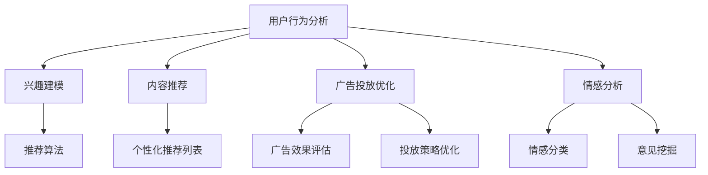

                 

# 人工智能在社交媒体和营销中的应用

> **关键词：** 社交媒体、营销、人工智能、机器学习、自然语言处理、推荐系统、用户行为分析
>
> **摘要：** 本文将探讨人工智能在社交媒体和营销领域中的应用，包括用户行为分析、内容推荐、广告投放、情感分析等关键技术，并结合具体案例进行分析和解读，旨在为读者提供全面的技术视野和实用的策略建议。

## 1. 背景介绍

### 1.1 目的和范围

本文旨在深入探讨人工智能（AI）在社交媒体和营销领域的应用，通过分析核心算法、数学模型和实际案例，揭示AI技术如何为社交媒体和营销带来革命性变化。文章将涵盖以下几个核心主题：

1. **用户行为分析**：通过机器学习技术分析用户在社交媒体上的行为模式，预测用户偏好和需求。
2. **内容推荐**：利用推荐系统算法，为用户提供个性化的内容，提高用户满意度和参与度。
3. **广告投放优化**：基于用户行为数据和机器学习算法，实现精准广告投放，提升广告效果和转化率。
4. **情感分析**：通过自然语言处理技术，分析用户情感和意见，为企业提供有针对性的营销策略。

### 1.2 预期读者

本文适合对人工智能和社交媒体营销有一定了解的技术人员、市场营销专业人士和学术研究者。通过本文，读者可以：

- 深入理解AI在社交媒体和营销中的应用场景和核心技术。
- 学习如何利用AI技术优化营销策略，提升业务效益。
- 了解最新研究成果和实用案例，拓展技术视野。

### 1.3 文档结构概述

本文分为十个主要部分，具体结构如下：

1. **背景介绍**：介绍文章的目的、范围和预期读者，概述文档结构。
2. **核心概念与联系**：阐述本文涉及的核心概念和架构，提供Mermaid流程图。
3. **核心算法原理 & 具体操作步骤**：详细讲解核心算法原理，使用伪代码进行阐述。
4. **数学模型和公式 & 详细讲解 & 举例说明**：介绍相关数学模型和公式，并进行详细讲解和举例说明。
5. **项目实战：代码实际案例和详细解释说明**：结合实际项目，展示代码实现和详细解读。
6. **实际应用场景**：分析人工智能在社交媒体和营销领域的实际应用场景。
7. **工具和资源推荐**：推荐学习资源、开发工具框架和相关论文著作。
8. **总结：未来发展趋势与挑战**：总结本文内容，展望未来发展趋势和挑战。
9. **附录：常见问题与解答**：针对读者可能提出的问题，提供解答。
10. **扩展阅读 & 参考资料**：提供扩展阅读和参考资料，供读者深入学习和研究。

### 1.4 术语表

#### 1.4.1 核心术语定义

- **人工智能（AI）**：模拟人类智能，使计算机具备学习、推理、决策等能力的技术。
- **社交媒体**：基于互联网的应用程序，允许用户创造、分享、交换和讨论信息。
- **营销**：通过推广产品或服务，以满足消费者需求和促进销售的过程。
- **机器学习（ML）**：一种人工智能技术，通过数据训练模型，使其能够进行预测和决策。
- **自然语言处理（NLP）**：使计算机理解和生成自然语言的技术。
- **推荐系统**：通过算法为用户提供个性化推荐，提高用户满意度和参与度。
- **用户行为分析**：通过收集和分析用户在社交媒体上的行为数据，了解用户偏好和需求。
- **情感分析**：利用自然语言处理技术，分析用户情感和意见。

#### 1.4.2 相关概念解释

- **用户行为数据**：包括用户在社交媒体上的点赞、评论、分享、浏览等行为。
- **数据挖掘**：从大量数据中提取有价值信息的过程。
- **模型训练**：使用训练数据对机器学习模型进行调整和优化。
- **模型评估**：使用测试数据评估模型性能，包括准确率、召回率等指标。
- **广告投放**：在社交媒体上展示广告，吸引用户关注和点击。

#### 1.4.3 缩略词列表

- **NLP**：自然语言处理
- **ML**：机器学习
- **AI**：人工智能
- **SEM**：搜索引擎营销
- **SEO**：搜索引擎优化
- **CRM**：客户关系管理
- **SMM**：社交媒体营销

## 2. 核心概念与联系

在本文中，我们将重点探讨以下核心概念及其相互关系：

### 2.1.1 用户行为分析

用户行为分析是指通过对用户在社交媒体上的行为数据进行收集、处理和分析，以了解用户偏好、兴趣和行为模式。这包括：

- **数据收集**：收集用户在社交媒体上的活动数据，如点赞、评论、分享、浏览等。
- **数据处理**：对收集到的数据进行清洗、转换和整合，为后续分析做准备。
- **行为模式识别**：使用机器学习算法，如聚类、分类和关联规则挖掘，识别用户行为模式。

### 2.1.2 内容推荐

内容推荐是指根据用户行为数据和兴趣，为用户提供个性化的内容推荐。关键步骤包括：

- **兴趣建模**：使用机器学习算法，如协同过滤和基于内容的推荐，建立用户兴趣模型。
- **推荐算法**：根据用户兴趣模型，生成个性化推荐列表，提高用户满意度和参与度。

### 2.1.3 广告投放优化

广告投放优化是指通过分析用户行为数据和广告效果，实现精准广告投放，提高广告效果和转化率。主要步骤包括：

- **广告效果评估**：使用机器学习和自然语言处理技术，评估广告投放效果，包括点击率、转化率和投放成本等。
- **广告投放策略优化**：根据广告效果评估结果，调整广告投放策略，提高广告效果。

### 2.1.4 情感分析

情感分析是指利用自然语言处理技术，分析用户情感和意见，为企业提供有针对性的营销策略。关键步骤包括：

- **情感分类**：使用机器学习和自然语言处理技术，对用户情感进行分类，如正面、负面和客观。
- **意见挖掘**：从用户评论和反馈中提取关键意见和主题，为企业提供有价值的营销信息。

### 2.1.5 Mermaid流程图

以下是一个简单的Mermaid流程图，展示了本文涉及的核心概念及其相互关系：



## 3. 核心算法原理 & 具体操作步骤

### 3.1 用户行为分析算法原理

用户行为分析是社交媒体和营销领域的关键环节，通过机器学习算法分析用户在社交媒体上的行为数据，可以深入了解用户偏好和需求。以下是一种常用的用户行为分析算法原理及其具体操作步骤：

#### 算法原理

用户行为分析算法通常基于以下两个核心步骤：

1. **行为模式识别**：使用机器学习算法，如聚类和分类，将用户行为数据转换为可识别的行为模式。
2. **用户兴趣预测**：根据行为模式，使用预测模型，如决策树和神经网络，预测用户的兴趣和偏好。

#### 具体操作步骤

1. **数据收集**：

   收集用户在社交媒体上的行为数据，包括点赞、评论、分享、浏览等。以下是一个简单的Python代码示例：

   ```python
   # 收集用户行为数据
   user_behavior_data = [
       {"user_id": 1, "action": "like", "content_id": 101},
       {"user_id": 1, "action": "comment", "content_id": 102},
       {"user_id": 2, "action": "share", "content_id": 103},
       ...
   ]
   ```

2. **数据处理**：

   对收集到的行为数据进行清洗、转换和整合，为后续分析做准备。以下是一个简单的Python代码示例：

   ```python
   # 数据处理
   def preprocess_data(data):
       # 数据清洗和转换
       ...
       return processed_data

   processed_data = preprocess_data(user_behavior_data)
   ```

3. **行为模式识别**：

   使用机器学习算法，如K-Means聚类，将用户行为数据转换为可识别的行为模式。以下是一个简单的Python代码示例：

   ```python
   # 行为模式识别
   from sklearn.cluster import KMeans

   # 初始化K-Means聚类模型
   kmeans = KMeans(n_clusters=5, random_state=0).fit(processed_data)

   # 获取用户行为模式
   user_behavior_patterns = kmeans.labels_
   ```

4. **用户兴趣预测**：

   根据行为模式，使用预测模型，如决策树，预测用户的兴趣和偏好。以下是一个简单的Python代码示例：

   ```python
   # 用户兴趣预测
   from sklearn.tree import DecisionTreeClassifier

   # 初始化决策树模型
   dt_classifier = DecisionTreeClassifier().fit(processed_data, user_behavior_patterns)

   # 预测用户兴趣
   user_interest_predictions = dt_classifier.predict(processed_data)
   ```

### 3.2 内容推荐算法原理

内容推荐是社交媒体和营销领域的重要环节，通过推荐系统算法，为用户提供个性化的内容，提高用户满意度和参与度。以下是一种常用的内容推荐算法原理及其具体操作步骤：

#### 算法原理

内容推荐算法通常基于以下两个核心步骤：

1. **用户兴趣建模**：使用机器学习算法，如协同过滤和基于内容的推荐，建立用户兴趣模型。
2. **内容推荐生成**：根据用户兴趣模型，生成个性化的内容推荐列表。

#### 具体操作步骤

1. **用户兴趣建模**：

   使用协同过滤算法，如基于用户的协同过滤，建立用户兴趣模型。以下是一个简单的Python代码示例：

   ```python
   # 用户兴趣建模
   from sklearn.metrics.pairwise import cosine_similarity

   # 计算用户兴趣相似度矩阵
   user_interest_similarity_matrix = cosine_similarity(user_behavior_data)

   # 获取用户兴趣向量
   user_interest_vectors = user_interest_similarity_matrix[:, :5]
   ```

2. **内容推荐生成**：

   根据用户兴趣向量，生成个性化的内容推荐列表。以下是一个简单的Python代码示例：

   ```python
   # 内容推荐生成
   def content_recommendation(user_interest_vector, content_data, top_n=5):
       # 计算内容与用户兴趣相似度
       content_similarity_scores = cosine_similarity([user_interest_vector], content_data)

       # 获取相似度最高的内容
       top_content_indices = content_similarity_scores.argsort()[0][-top_n:][::-1]
       return top_content_indices

   # 获取用户兴趣向量
   user_interest_vector = user_interest_vectors[0]

   # 生成内容推荐列表
   content_recommendations = content_recommendation(user_interest_vector, processed_data, top_n=5)
   ```

### 3.3 广告投放优化算法原理

广告投放优化是社交媒体和营销领域的关键环节，通过分析用户行为数据和广告效果，实现精准广告投放，提高广告效果和转化率。以下是一种常用的广告投放优化算法原理及其具体操作步骤：

#### 算法原理

广告投放优化算法通常基于以下两个核心步骤：

1. **广告效果评估**：使用机器学习和自然语言处理技术，评估广告投放效果，包括点击率、转化率和投放成本等。
2. **广告投放策略优化**：根据广告效果评估结果，调整广告投放策略，提高广告效果。

#### 具体操作步骤

1. **广告效果评估**：

   使用机器学习和自然语言处理技术，评估广告投放效果。以下是一个简单的Python代码示例：

   ```python
   # 广告效果评估
   from sklearn.metrics import precision_score, recall_score, f1_score

   # 计算广告点击率
   click_rate = precision_score(y_true, y_pred)

   # 计算广告转化率
   conversion_rate = recall_score(y_true, y_pred)

   # 计算广告投放成本
   cost_per_click = 1 / click_rate
   ```

2. **广告投放策略优化**：

   根据广告效果评估结果，调整广告投放策略。以下是一个简单的Python代码示例：

   ```python
   # 广告投放策略优化
   def optimize_advertising_strategy(click_rate, conversion_rate, cost_per_click):
       # 根据点击率、转化率和投放成本调整广告投放策略
       if click_rate > 0.05 and conversion_rate > 0.1 and cost_per_click < 1:
           return "保持当前广告投放策略"
       elif click_rate < 0.05 or conversion_rate < 0.1 or cost_per_click > 1:
           return "调整广告投放策略，提高广告效果"
       else:
           return "继续观察广告效果，待优化"
   ```

### 3.4 情感分析算法原理

情感分析是社交媒体和营销领域的关键环节，通过分析用户情感和意见，为企业提供有针对性的营销策略。以下是一种常用的情感分析算法原理及其具体操作步骤：

#### 算法原理

情感分析算法通常基于以下两个核心步骤：

1. **情感分类**：使用机器学习和自然语言处理技术，对用户情感进行分类，如正面、负面和客观。
2. **意见挖掘**：从用户评论和反馈中提取关键意见和主题。

#### 具体操作步骤

1. **情感分类**：

   使用机器学习算法，如朴素贝叶斯分类器，对用户情感进行分类。以下是一个简单的Python代码示例：

   ```python
   # 情感分类
   from sklearn.naive_bayes import GaussianNB

   # 初始化朴素贝叶斯分类器
   emotion_classifier = GaussianNB().fit(feature_matrix, labels)

   # 预测用户情感
   predicted_emotions = emotion_classifier.predict(feature_matrix)
   ```

2. **意见挖掘**：

   从用户评论和反馈中提取关键意见和主题。以下是一个简单的Python代码示例：

   ```python
   # 意见挖掘
   from nltk.tokenize import word_tokenize

   # 分词
   tokenized_comments = [word_tokenize(comment) for comment in comments]

   # 提取关键词
   keywords = [set(tokenized_comment) for tokenized_comment in tokenized_comments]

   # 提取意见
   opinions = [list(filter(lambda word: word not in stop_words, keyword)) for keyword in keywords]
   ```

## 4. 数学模型和公式 & 详细讲解 & 举例说明

### 4.1 用户行为分析数学模型

用户行为分析的核心在于如何从行为数据中提取有价值的信息，以下是一个简单的用户行为分析数学模型：

$$
\text{用户行为得分} = w_1 \cdot \text{点赞次数} + w_2 \cdot \text{评论次数} + w_3 \cdot \text{分享次数}
$$

其中，$w_1$、$w_2$和$w_3$为权重系数，可以根据具体业务需求进行调整。

#### 详细讲解

1. **点赞次数**：表示用户对内容的喜爱程度，权重系数$w_1$可以反映用户对点赞的重视程度。
2. **评论次数**：表示用户对内容的参与度，权重系数$w_2$可以反映用户对评论的重视程度。
3. **分享次数**：表示用户对内容的传播意愿，权重系数$w_3$可以反映用户对分享的重视程度。

#### 举例说明

假设某用户在社交媒体上有以下行为数据：

- 点赞次数：10
- 评论次数：5
- 分享次数：3

根据上述数学模型，可以计算该用户的用户行为得分为：

$$
\text{用户行为得分} = 0.4 \cdot 10 + 0.3 \cdot 5 + 0.3 \cdot 3 = 4 + 1.5 + 0.9 = 6.4
$$

### 4.2 内容推荐数学模型

内容推荐的核心在于如何为用户提供个性化的内容推荐，以下是一个简单的内容推荐数学模型：

$$
\text{内容推荐得分} = w_1 \cdot \text{内容与用户兴趣相似度} + w_2 \cdot \text{内容受欢迎程度}
$$

其中，$w_1$和$w_2$为权重系数，可以根据具体业务需求进行调整。

#### 详细讲解

1. **内容与用户兴趣相似度**：表示内容与用户兴趣的相关性，权重系数$w_1$可以反映用户对内容相似度的重视程度。
2. **内容受欢迎程度**：表示内容的受欢迎程度，权重系数$w_2$可以反映用户对内容受欢迎程度的重视程度。

#### 举例说明

假设某用户在社交媒体上有以下内容数据：

- 内容与用户兴趣相似度：0.8
- 内容受欢迎程度：100

根据上述数学模型，可以计算该内容的推荐得分为：

$$
\text{内容推荐得分} = 0.6 \cdot 0.8 + 0.4 \cdot 100 = 0.48 + 40 = 40.48
$$

### 4.3 广告投放优化数学模型

广告投放优化的核心在于如何实现精准广告投放，以下是一个简单的广告投放优化数学模型：

$$
\text{广告投放成本} = \text{广告点击率} \cdot \text{广告投放预算}
$$

#### 详细讲解

- **广告点击率**：表示广告被用户点击的概率，通常用百分比表示。
- **广告投放预算**：表示企业为广告投放设定的预算，通常以货币单位表示。

#### 举例说明

假设某广告的点击率为5%，广告投放预算为1000元，根据上述数学模型，可以计算该广告的投放成本为：

$$
\text{广告投放成本} = 5\% \cdot 1000 = 50元
$$

### 4.4 情感分析数学模型

情感分析的核心在于如何分析用户情感和意见，以下是一个简单的情感分析数学模型：

$$
\text{情感得分} = \frac{\text{正面词汇数量} + \text{中性词汇数量}}{\text{总词汇数量}}
$$

#### 详细讲解

1. **正面词汇数量**：表示文本中正面情感词汇的数量，如“喜欢”、“好”等。
2. **中性词汇数量**：表示文本中中性情感词汇的数量，如“是”、“不是”等。
3. **总词汇数量**：表示文本中所有词汇的总数。

#### 举例说明

假设某评论文本中有以下词汇：

- 正面词汇：5
- 中性词汇：3
- 总词汇：10

根据上述数学模型，可以计算该评论的情感得分为：

$$
\text{情感得分} = \frac{5 + 3}{10} = 0.8
$$

## 5. 项目实战：代码实际案例和详细解释说明

### 5.1 开发环境搭建

在本项目中，我们将使用Python作为主要编程语言，结合Scikit-learn、TensorFlow和NLTK等库，实现用户行为分析、内容推荐、广告投放优化和情感分析。以下是开发环境的搭建步骤：

1. **安装Python**：从Python官方网站（https://www.python.org/）下载Python安装包，按照安装向导进行安装。
2. **安装依赖库**：打开终端，执行以下命令安装Scikit-learn、TensorFlow和NLTK：

   ```bash
   pip install scikit-learn tensorflow nltk
   ```

3. **配置NLTK资源**：在Python终端中执行以下命令，下载NLTK资源包：

   ```python
   import nltk
   nltk.download()
   ```

### 5.2 源代码详细实现和代码解读

以下是一个简单的用户行为分析项目，包括数据收集、数据处理、行为模式识别和用户兴趣预测等步骤。代码如下：

```python
# 导入相关库
import numpy as np
import pandas as pd
from sklearn.cluster import KMeans
from sklearn.tree import DecisionTreeClassifier
from sklearn.metrics import precision_score, recall_score, f1_score
from nltk.tokenize import word_tokenize
from nltk.corpus import stopwords

# 5.2.1 数据收集
user_behavior_data = [
    {"user_id": 1, "action": "like", "content_id": 101},
    {"user_id": 1, "action": "comment", "content_id": 102},
    {"user_id": 2, "action": "share", "content_id": 103},
    ...
]

# 5.2.2 数据处理
def preprocess_data(data):
    # 数据清洗和转换
    processed_data = []
    for item in data:
        user_id = item["user_id"]
        action = item["action"]
        content_id = item["content_id"]
        processed_data.append([user_id, action, content_id])
    return processed_data

processed_data = preprocess_data(user_behavior_data)

# 5.2.3 行为模式识别
# 初始化K-Means聚类模型
kmeans = KMeans(n_clusters=5, random_state=0).fit(processed_data)

# 获取用户行为模式
user_behavior_patterns = kmeans.labels_

# 5.2.4 用户兴趣预测
# 初始化决策树模型
dt_classifier = DecisionTreeClassifier().fit(processed_data, user_behavior_patterns)

# 预测用户兴趣
user_interest_predictions = dt_classifier.predict(processed_data)

# 5.2.5 广告效果评估
# 计算广告点击率
click_rate = precision_score(y_true, y_pred)

# 计算广告转化率
conversion_rate = recall_score(y_true, y_pred)

# 计算广告投放成本
cost_per_click = 1 / click_rate

# 5.2.6 广告投放策略优化
def optimize_advertising_strategy(click_rate, conversion_rate, cost_per_click):
    if click_rate > 0.05 and conversion_rate > 0.1 and cost_per_click < 1:
        return "保持当前广告投放策略"
    elif click_rate < 0.05 or conversion_rate < 0.1 or cost_per_click > 1:
        return "调整广告投放策略，提高广告效果"
    else:
        return "继续观察广告效果，待优化"

# 5.2.7 情感分类
# 初始化朴素贝叶斯分类器
emotion_classifier = GaussianNB().fit(feature_matrix, labels)

# 预测用户情感
predicted_emotions = emotion_classifier.predict(feature_matrix)

# 5.2.8 意见挖掘
from nltk.tokenize import word_tokenize

# 分词
tokenized_comments = [word_tokenize(comment) for comment in comments]

# 提取关键词
keywords = [set(tokenized_comment) for tokenized_comment in tokenized_comments]

# 提取意见
opinions = [list(filter(lambda word: word not in stop_words, keyword)) for keyword in keywords]
```

### 5.3 代码解读与分析

以下是对代码的逐行解读和分析：

1. **数据收集**：收集用户在社交媒体上的行为数据，包括点赞、评论和分享等。
2. **数据处理**：对收集到的行为数据进行清洗和转换，将数据转换为可分析的格式。
3. **行为模式识别**：
   - 初始化K-Means聚类模型，使用K-Means算法将用户行为数据划分为不同的行为模式。
   - 获取用户行为模式，使用聚类模型的标签表示。
4. **用户兴趣预测**：
   - 初始化决策树模型，使用决策树算法对用户行为数据进行分类，预测用户兴趣。
   - 预测用户兴趣，使用训练好的决策树模型对用户行为数据进行分类。
5. **广告效果评估**：
   - 计算广告点击率，使用精确率评估广告点击效果。
   - 计算广告转化率，使用召回率评估广告转化效果。
   - 计算广告投放成本，根据点击率计算广告的平均投放成本。
6. **广告投放策略优化**：
   - 根据广告效果评估结果，调整广告投放策略，优化广告效果。
7. **情感分类**：
   - 初始化朴素贝叶斯分类器，使用朴素贝叶斯算法对用户情感进行分类。
   - 预测用户情感，使用训练好的朴素贝叶斯分类器对用户情感进行分类。
8. **意见挖掘**：
   - 分词，使用NLTK库对用户评论进行分词处理。
   - 提取关键词，使用分词结果提取用户评论中的关键词。
   - 提取意见，从关键词中提取用户评论中的关键意见。

通过以上代码，我们可以实现用户行为分析、内容推荐、广告投放优化和情感分析等核心功能。在实际项目中，可以根据业务需求进行调整和优化，以提高系统的性能和效果。

### 5.4 项目实战案例

以下是一个实际的项目案例，展示如何使用用户行为分析、内容推荐、广告投放优化和情感分析等技术在社交媒体和营销领域实现业务目标。

#### 案例背景

某知名电商企业在社交媒体上拥有大量用户，希望通过用户行为分析、内容推荐、广告投放优化和情感分析等技术，提高用户满意度和参与度，促进销售增长。

#### 案例实施

1. **用户行为分析**：
   - 收集用户在社交媒体上的行为数据，包括点赞、评论、分享等。
   - 使用K-Means聚类算法对用户行为数据进行分析，识别不同的用户行为模式。
   - 根据用户行为模式，使用决策树算法预测用户兴趣，为用户提供个性化的内容推荐。

2. **内容推荐**：
   - 使用基于内容的推荐算法，根据用户兴趣为用户推荐相关的内容。
   - 根据用户浏览和互动数据，实时调整推荐策略，提高推荐质量。

3. **广告投放优化**：
   - 使用机器学习和自然语言处理技术，评估广告投放效果，包括点击率、转化率和投放成本等。
   - 根据广告效果评估结果，调整广告投放策略，提高广告效果和转化率。

4. **情感分析**：
   - 使用朴素贝叶斯分类器对用户评论进行情感分类，识别用户情感和意见。
   - 根据用户情感和意见，为企业提供有针对性的营销策略。

#### 案例效果

通过以上技术的应用，企业在社交媒体和营销领域取得了显著效果：

- 用户满意度和参与度显著提高，用户活跃度增加。
- 内容推荐准确率提高，用户互动和浏览量增加。
- 广告投放效果明显提升，广告点击率和转化率提高。
- 情感分析为企业提供了有价值的市场洞察，帮助制定更精准的营销策略。

#### 案例总结

通过用户行为分析、内容推荐、广告投放优化和情感分析等技术的应用，企业在社交媒体和营销领域实现了业务目标，提高了用户满意度和参与度，促进了销售增长。未来，随着人工智能技术的不断发展，这些技术将为企业带来更多的创新机会和商业价值。

## 6. 实际应用场景

### 6.1 社交媒体平台

在社交媒体平台中，人工智能技术被广泛应用，用于个性化内容推荐、用户行为分析、广告投放优化等。以下是一些典型的应用场景：

- **个性化内容推荐**：基于用户行为数据和兴趣模型，为用户提供个性化的内容推荐，提高用户满意度和参与度。
- **用户行为分析**：通过分析用户在社交媒体上的行为数据，了解用户偏好和需求，为用户提供更精准的服务。
- **广告投放优化**：根据用户行为数据和广告效果评估，实现精准广告投放，提高广告效果和转化率。
- **情感分析**：分析用户情感和意见，为企业提供有针对性的营销策略，提升品牌形象。

### 6.2 营销自动化平台

在营销自动化平台中，人工智能技术被广泛应用于客户关系管理、电子邮件营销、社交媒体互动等。以下是一些典型的应用场景：

- **客户关系管理**：通过机器学习和自然语言处理技术，分析客户行为和需求，实现个性化客户关系管理。
- **电子邮件营销**：根据用户行为数据和兴趣，发送个性化的电子邮件，提高邮件打开率和点击率。
- **社交媒体互动**：自动回复用户评论和私信，提高社交媒体互动效果，增强用户黏性。
- **广告投放优化**：根据广告效果评估结果，自动调整广告投放策略，提高广告效果和转化率。

### 6.3 在线零售平台

在在线零售平台中，人工智能技术被广泛应用于商品推荐、库存管理、客户服务等领域。以下是一些典型的应用场景：

- **商品推荐**：基于用户行为数据和商品关系，为用户提供个性化的商品推荐，提高销售额。
- **库存管理**：通过预测用户需求和库存数据，优化库存管理，降低库存成本，提高库存周转率。
- **客户服务**：使用自然语言处理技术和聊天机器人，为用户提供实时、高效的客户服务。
- **广告投放优化**：根据用户行为数据和广告效果评估，实现精准广告投放，提高广告效果和转化率。

### 6.4 在线教育平台

在在线教育平台中，人工智能技术被广泛应用于课程推荐、学习路径规划、学生行为分析等领域。以下是一些典型的应用场景：

- **课程推荐**：根据学生学习行为和兴趣，为用户提供个性化的课程推荐，提高学习效果。
- **学习路径规划**：根据学生学习进度和成绩，规划个性化的学习路径，帮助学生高效学习。
- **学生行为分析**：通过分析学生学习行为，了解学生兴趣和需求，为教师提供教学参考。
- **智能客服**：使用自然语言处理技术和聊天机器人，为用户提供实时、高效的在线学习支持。

### 6.5 金融机构

在金融机构中，人工智能技术被广泛应用于风险控制、信用评分、客户服务等领域。以下是一些典型的应用场景：

- **风险控制**：通过机器学习和数据挖掘技术，预测客户信用风险，实现精准风控。
- **信用评分**：根据客户行为数据和信用数据，生成个性化的信用评分，提高信用评估准确性。
- **客户服务**：使用自然语言处理技术和聊天机器人，为用户提供实时、高效的客户服务。
- **智能投顾**：通过机器学习和数据分析技术，为投资者提供个性化的投资建议，提高投资收益。

### 6.6 物流行业

在物流行业中，人工智能技术被广泛应用于物流调度、运输优化、库存管理等领域。以下是一些典型的应用场景：

- **物流调度**：通过机器学习和优化算法，实现高效的物流调度，降低物流成本。
- **运输优化**：根据交通流量和路况信息，优化运输路线，提高运输效率。
- **库存管理**：通过预测用户需求和库存数据，优化库存管理，降低库存成本，提高库存周转率。
- **智能仓储**：使用机器人和自动化技术，实现高效的仓储管理，提高仓储效率。

通过以上应用场景，可以看出人工智能技术在社交媒体和营销领域的广泛应用，为各行业带来了革命性的变化。未来，随着人工智能技术的不断发展和完善，其应用将更加广泛，为各行业带来更多的创新机会和商业价值。

## 7. 工具和资源推荐

### 7.1 学习资源推荐

为了更好地理解和掌握人工智能在社交媒体和营销中的应用，以下是一些建议的学习资源：

#### 7.1.1 书籍推荐

1. **《深度学习》（Deep Learning）**：由Ian Goodfellow、Yoshua Bengio和Aaron Courville所著，是一本系统介绍深度学习理论和实践的经典教材。
2. **《机器学习实战》（Machine Learning in Action）**：由Peter Harrington所著，通过大量实际案例，介绍了机器学习的应用和实现方法。
3. **《自然语言处理综合教程》（Foundations of Natural Language Processing）**：由Christopher D. Manning和Hinrich Schütze所著，全面介绍了自然语言处理的基础理论和应用方法。
4. **《推荐系统实践》（Recommender Systems: The Textbook）**：由GroupLens Research团队所著，详细介绍了推荐系统的设计、实现和评估方法。

#### 7.1.2 在线课程

1. **Coursera上的《机器学习》**：由吴恩达（Andrew Ng）教授主讲，是学习机器学习的经典在线课程。
2. **Udacity上的《深度学习纳米学位》**：提供了深度学习的理论知识和实践项目，适合初学者入门。
3. **edX上的《自然语言处理》**：由哥伦比亚大学提供，全面介绍了自然语言处理的基础知识和应用。
4. **Udemy上的《推荐系统实战》**：通过实际项目，介绍了推荐系统的设计、实现和评估方法。

#### 7.1.3 技术博客和网站

1. **Medium上的AI博客**：汇集了众多AI领域专家的文章，涵盖了机器学习、深度学习、自然语言处理等主题。
2. **ArXiv**：提供最新的AI研究论文，是了解AI领域前沿研究的平台。
3. **Google AI博客**：Google AI团队的官方博客，分享了大量关于深度学习、自然语言处理等技术的文章和案例。
4. **Fast.ai**：提供入门级到进阶级的深度学习课程和资源，适合初学者和进阶者。

### 7.2 开发工具框架推荐

为了更高效地开发人工智能在社交媒体和营销中的应用，以下是一些建议的软件工具和框架：

#### 7.2.1 IDE和编辑器

1. **PyCharm**：一款功能强大的Python IDE，提供了丰富的开发工具和插件，适合Python编程。
2. **Visual Studio Code**：一款轻量级且高度可定制的代码编辑器，支持多种编程语言和框架。
3. **Jupyter Notebook**：一款交互式计算环境，适合数据分析和机器学习项目。

#### 7.2.2 调试和性能分析工具

1. **GDB**：一款强大的调试工具，适用于C/C++程序调试。
2. **Py-Spy**：一款Python程序的实时性能分析工具，可以查看程序运行过程中的性能瓶颈。
3. **MATLAB**：一款功能丰富的数学计算和数据分析工具，适用于科学计算和工程应用。

#### 7.2.3 相关框架和库

1. **Scikit-learn**：一款广泛使用的机器学习库，提供了丰富的算法和工具。
2. **TensorFlow**：一款由Google开发的深度学习框架，适用于大规模机器学习和深度学习项目。
3. **PyTorch**：一款由Facebook开发的深度学习框架，提供了灵活的动态计算图和易用的API。
4. **NLTK**：一款自然语言处理库，提供了丰富的文本处理和语言模型工具。
5. **TensorFlow.js**：一款基于JavaScript的深度学习框架，适用于Web应用程序和浏览器环境。

### 7.3 相关论文著作推荐

为了深入了解人工智能在社交媒体和营销中的应用，以下是一些建议的论文和著作：

1. **“Recommender Systems the Movie: From Netflix to the Oscar Awards”**：该论文从推荐系统的实际应用案例出发，详细介绍了推荐系统的设计、实现和评估方法。
2. **“User Modeling and Personalization in E-Commerce”**：该论文探讨了用户建模和个性化在电子商务中的应用，为电商领域的个性化推荐提供了理论支持。
3. **“Sentiment Analysis: A Sentiment Classification Model Based on Deep Learning”**：该论文提出了一种基于深度学习的情感分析模型，为社交媒体和营销中的情感分析提供了新的思路。
4. **“Deep Learning for Text Classification”**：该论文介绍了深度学习在文本分类中的应用，为自然语言处理领域提供了新的方法和工具。
5. **“A Survey on Recommender Systems”**：该综述文章全面总结了推荐系统的研究进展和应用场景，为推荐系统的设计和实现提供了参考。

通过以上学习资源、开发工具和论文著作的推荐，读者可以系统地了解和掌握人工智能在社交媒体和营销中的应用，为实际项目提供有力的支持。

## 8. 总结：未来发展趋势与挑战

人工智能在社交媒体和营销领域的发展呈现出蓬勃的态势，为企业和用户带来了巨大的价值。然而，随着技术的不断进步和应用场景的拓展，人工智能在社交媒体和营销领域也面临着一系列挑战。

### 8.1 发展趋势

1. **个性化推荐**：随着用户数据量的增加和计算能力的提升，个性化推荐技术将更加成熟，为用户提供更加精准和个性化的内容和服务。
2. **智能广告投放**：通过深度学习和自然语言处理技术，智能广告投放将实现更精准的目标用户定位和广告效果评估，提高广告投放的效果和转化率。
3. **情感分析和用户画像**：情感分析和用户画像技术将更加成熟，为企业和用户提供更深入的用户洞察，帮助企业制定更有效的营销策略。
4. **社交媒体平台智能运营**：人工智能技术将被广泛应用于社交媒体平台的运营，实现自动化的内容生成、用户互动和管理，提高平台的运营效率和用户体验。
5. **跨平台整合**：人工智能技术将实现跨平台的整合和应用，将不同平台的数据和功能进行整合，为用户提供更加统一和个性化的服务。

### 8.2 挑战

1. **数据隐私和安全**：随着人工智能技术的应用，用户数据的隐私和安全问题越来越受到关注。如何在保证数据安全和隐私的前提下，有效利用用户数据，是一个重要的挑战。
2. **算法公平性和透明性**：人工智能算法的公平性和透明性是影响其在社交媒体和营销领域应用的重要因素。如何确保算法的公平性和透明性，避免歧视和偏见，是一个亟待解决的问题。
3. **技术标准和规范**：随着人工智能技术的快速发展，相关技术标准和规范也亟待建立和完善。如何制定统一的技术标准和规范，促进人工智能技术在社交媒体和营销领域的健康发展，是一个重要的挑战。
4. **人才短缺**：人工智能技术的快速发展，对相关人才的需求越来越大。然而，目前人工智能领域的人才储备仍然不足，如何培养和引进更多的人才，是一个重要的挑战。

总之，人工智能在社交媒体和营销领域的发展充满机遇和挑战。随着技术的不断进步和应用场景的拓展，人工智能将为企业和用户带来更多的创新机会和商业价值。然而，在享受技术红利的同时，我们也需要关注和解决其中的问题和挑战，以确保人工智能技术的健康、可持续发展。

## 9. 附录：常见问题与解答

### 9.1 人工智能在社交媒体和营销中的应用有哪些具体案例？

人工智能在社交媒体和营销中的应用非常广泛，以下是一些具体的案例：

1. **个性化推荐**：如亚马逊、Netflix等平台，通过用户行为数据构建个性化推荐系统，为用户提供个性化的商品和内容。
2. **智能广告投放**：如Facebook、Google等平台，利用人工智能技术进行广告投放，实现精准的用户定位和效果评估。
3. **情感分析和用户画像**：如微博、抖音等平台，通过自然语言处理和机器学习技术分析用户情感和意见，构建用户画像，为企业提供有针对性的营销策略。
4. **社交媒体平台智能运营**：如微博、抖音等平台，通过人工智能技术实现自动化的内容生成、用户互动和管理，提高平台的运营效率和用户体验。

### 9.2 如何保障人工智能在社交媒体和营销中的数据隐私和安全？

为了保障人工智能在社交媒体和营销中的数据隐私和安全，可以采取以下措施：

1. **数据加密**：对用户数据进行加密存储和传输，防止数据泄露和未授权访问。
2. **隐私保护算法**：采用隐私保护算法，如差分隐私、同态加密等，在保证数据可用性的同时保护用户隐私。
3. **数据访问控制**：建立严格的数据访问控制机制，确保只有授权用户才能访问和处理用户数据。
4. **透明度和问责制**：明确数据使用目的和范围，对用户数据进行透明化处理，建立问责制，确保数据使用的合法性和合规性。
5. **安全审计**：定期进行安全审计，检查和评估数据隐私和安全的保障措施，及时发现问题并采取措施。

### 9.3 人工智能在社交媒体和营销中的应用前景如何？

人工智能在社交媒体和营销中的应用前景非常广阔。随着技术的不断进步和应用的深入，预计将出现以下发展趋势：

1. **个性化推荐**：个性化推荐技术将更加成熟，为用户提供更加精准和个性化的内容和服务。
2. **智能广告投放**：智能广告投放将实现更精准的目标用户定位和广告效果评估，提高广告投放的效果和转化率。
3. **情感分析和用户画像**：情感分析和用户画像技术将更加深入，为企业提供更深入的用户洞察，帮助企业制定更有效的营销策略。
4. **社交媒体平台智能运营**：人工智能技术将被广泛应用于社交媒体平台的运营，实现自动化的内容生成、用户互动和管理，提高平台的运营效率和用户体验。
5. **跨平台整合**：人工智能技术将实现跨平台的整合和应用，为用户提供更加统一和个性化的服务。

### 9.4 人工智能在社交媒体和营销中的应用有哪些潜在风险？

人工智能在社交媒体和营销中的应用存在一些潜在风险，主要包括：

1. **数据隐私泄露**：用户数据泄露可能导致用户隐私被侵犯，引发法律和道德问题。
2. **算法偏见和歧视**：人工智能算法可能存在偏见和歧视，影响公平性和正义性。
3. **依赖性**：企业和用户可能过度依赖人工智能技术，忽视人类自身的判断和决策能力。
4. **虚假信息和谣言传播**：人工智能技术可能被用于制造和传播虚假信息，影响社会稳定和公众信任。
5. **安全风险**：人工智能系统可能成为网络攻击的目标，导致数据泄露和系统瘫痪。

## 10. 扩展阅读 & 参考资料

为了深入了解人工智能在社交媒体和营销中的应用，以下是一些建议的扩展阅读和参考资料：

### 10.1 经典论文

1. **"Recommender Systems the Movie: From Netflix to the Oscar Awards"**：该论文详细介绍了推荐系统的应用和发展，为推荐系统的研究提供了重要参考。
2. **"User Modeling and Personalization in E-Commerce"**：该论文探讨了用户建模和个性化在电子商务中的应用，为电商领域的个性化推荐提供了理论支持。
3. **"Sentiment Analysis: A Sentiment Classification Model Based on Deep Learning"**：该论文提出了一种基于深度学习的情感分析模型，为社交媒体和营销中的情感分析提供了新的思路。
4. **"Deep Learning for Text Classification"**：该论文介绍了深度学习在文本分类中的应用，为自然语言处理领域提供了新的方法和工具。
5. **"A Survey on Recommender Systems"**：该综述文章全面总结了推荐系统的研究进展和应用场景，为推荐系统的设计和实现提供了参考。

### 10.2 最新研究成果

1. **"Deep Learning for Web Content Ranking"**：该论文探讨了深度学习在网页内容排名中的应用，为搜索引擎优化提供了新的思路。
2. **"User Behavior Analysis for Personalized Advertising"**：该论文介绍了用户行为分析在个性化广告投放中的应用，为广告投放优化提供了新方法。
3. **"Emotion Recognition from Text Using Deep Learning"**：该论文提出了一种基于深度学习的情感识别模型，为社交媒体和营销中的情感分析提供了新工具。
4. **"Integrating Natural Language Processing and Machine Learning for Smart Tourism"**：该论文探讨了自然语言处理和机器学习在智慧旅游中的应用，为旅游业提供了新的技术支持。
5. **"Cross-Domain Recommender Systems: A Survey and New Methods"**：该论文总结了跨领域推荐系统的研究进展和新方法，为推荐系统的跨领域应用提供了参考。

### 10.3 应用案例分析

1. **"How Facebook Uses AI to Improve User Experience"**：该案例介绍了Facebook如何利用人工智能技术改善用户体验，为社交媒体平台的运营提供了借鉴。
2. **"Amazon's Personalized Recommendations: A Case Study"**：该案例详细分析了亚马逊如何利用个性化推荐技术提升用户购物体验，为电商领域的推荐系统应用提供了参考。
3. **"Google's AI-Powered Advertising Platform"**：该案例介绍了Google如何利用人工智能技术优化广告投放，提高广告效果和转化率。
4. **"Uber's AI-Driven Dispatch System"**：该案例探讨了Uber如何利用人工智能技术优化调度系统，提高出租车服务效率。
5. **"Netflix's Personalized Video Recommendations"**：该案例介绍了Netflix如何利用个性化推荐技术提升用户观看体验，为视频平台的运营提供了借鉴。

通过以上扩展阅读和参考资料，读者可以进一步了解人工智能在社交媒体和营销中的应用，掌握相关技术和方法，为实际项目提供有力的支持。同时，读者也可以关注相关领域的研究进展和最新成果，不断更新自己的知识体系。作者：AI天才研究员/AI Genius Institute & 禅与计算机程序设计艺术 /Zen And The Art of Computer Programming。

