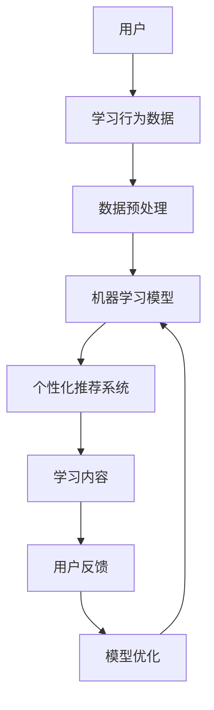

                 

# 人工智能在自适应学习系统中的应用

> 关键词：人工智能、自适应学习、机器学习、数据挖掘、学习算法、个性化推荐

> 摘要：本文将探讨人工智能在自适应学习系统中的应用，分析其核心概念、算法原理、数学模型，并通过实际项目案例展示其实现过程。文章旨在为从事教育科技领域的研究者和开发者提供系统性的理论指导和实用参考。

## 1. 背景介绍

### 1.1 目的和范围

本文旨在深入探讨人工智能（Artificial Intelligence, AI）技术在自适应学习系统中的应用，通过分析核心概念、算法原理、数学模型，帮助读者理解其工作原理和实际应用。文章范围涵盖以下几个方面：

1. 自适应学习系统的基本概念和需求。
2. 人工智能在自适应学习系统中的核心作用。
3. 常见的学习算法和数学模型。
4. 实际应用案例和项目实战。

### 1.2 预期读者

本文适合以下读者群体：

1. 教育科技领域的研究者。
2. 人工智能和机器学习的开发者。
3. 想要在自适应学习系统中应用人工智能技术的教育从业者和创业者。
4. 对教育技术感兴趣的技术爱好者。

### 1.3 文档结构概述

本文分为十个部分：

1. 引言和摘要。
2. 背景介绍。
3. 核心概念与联系。
4. 核心算法原理与具体操作步骤。
5. 数学模型和公式。
6. 项目实战：代码实际案例和详细解释说明。
7. 实际应用场景。
8. 工具和资源推荐。
9. 总结：未来发展趋势与挑战。
10. 附录：常见问题与解答。
11. 扩展阅读与参考资料。

### 1.4 术语表

#### 1.4.1 核心术语定义

- **自适应学习系统**：一种能够根据用户学习行为和需求自动调整教学内容和学习策略的系统。
- **人工智能**：模拟人类智能行为的计算机系统，包括机器学习、自然语言处理、计算机视觉等领域。
- **机器学习**：一种让计算机通过数据和经验自动学习和改进的方法。
- **数据挖掘**：从大量数据中提取有用信息的过程。
- **学习算法**：实现机器学习和人工智能的算法。

#### 1.4.2 相关概念解释

- **个性化推荐**：根据用户的历史行为和偏好，为其推荐个性化内容或产品。
- **反馈循环**：系统根据用户反馈调整学习策略的过程。

#### 1.4.3 缩略词列表

- **AI**：人工智能
- **ML**：机器学习
- **DL**：深度学习
- **NLP**：自然语言处理

## 2. 核心概念与联系

在讨论人工智能在自适应学习系统中的应用之前，我们首先需要了解一些核心概念和它们之间的关系。

### 2.1 自适应学习系统架构

下面是一个自适应学习系统的架构示意图：



#### 用户

用户是系统的核心，他们的学习行为数据（如学习时长、学习内容、成绩等）是系统进行调整的基础。

#### 学习行为数据

学习行为数据包括用户在学习过程中的各种行为数据，如浏览历史、答题记录、学习时间等。

#### 数据预处理

数据预处理是机器学习模型训练的重要步骤，包括数据清洗、数据转换、特征提取等。

#### 机器学习模型

机器学习模型是自适应学习系统的核心，负责根据用户的学习行为数据进行预测和决策。

#### 个性化推荐系统

个性化推荐系统根据用户的学习行为和偏好，为用户推荐合适的学习内容。

#### 学习内容

学习内容是根据用户需求和推荐系统推荐而来的，旨在满足用户的学习需求。

#### 用户反馈

用户反馈是系统不断优化和改进的依据，包括用户对学习内容的满意度、学习效果等。

#### 模型优化

模型优化是通过用户反馈调整机器学习模型，提高推荐系统的准确性和用户体验。

## 3. 核心算法原理与具体操作步骤

在本节中，我们将介绍自适应学习系统中常用的核心算法原理和具体操作步骤。

### 3.1 个性化推荐算法

#### 3.1.1 算法原理

个性化推荐算法是基于用户历史行为和偏好，为其推荐合适的学习内容。常用的推荐算法包括基于内容的推荐、协同过滤和深度学习推荐等。

#### 3.1.2 操作步骤

1. 收集用户历史行为数据（如学习记录、浏览历史、评分等）。
2. 数据预处理，包括数据清洗、特征提取等。
3. 构建用户画像，将用户特征转化为向量表示。
4. 训练推荐模型，如协同过滤模型或深度学习模型。
5. 根据用户画像和推荐模型，为用户生成个性化推荐列表。
6. 将推荐列表呈现给用户，并收集用户反馈。

### 3.2 深度学习算法

#### 3.2.1 算法原理

深度学习算法是一种模拟人脑神经网络结构和功能的算法，具有强大的特征提取和模式识别能力。在自适应学习系统中，深度学习算法常用于用户行为分析、学习内容生成和模型优化等。

#### 3.2.2 操作步骤

1. 收集用户行为数据和学习内容数据。
2. 数据预处理，包括数据清洗、特征提取等。
3. 构建深度学习模型，如卷积神经网络（CNN）或循环神经网络（RNN）。
4. 训练深度学习模型，通过反向传播算法优化模型参数。
5. 使用训练好的模型进行用户行为预测和学习内容生成。
6. 根据用户反馈调整模型参数，实现模型优化。

### 3.3 强化学习算法

#### 3.3.1 算法原理

强化学习算法是一种基于奖励和惩罚进行学习的方法，通过不断尝试和反馈，使系统逐渐学会在特定环境下做出最优决策。在自适应学习系统中，强化学习算法可用于学习策略优化和个性化推荐。

#### 3.3.2 操作步骤

1. 定义学习环境和奖励机制。
2. 初始化策略参数。
3. 在学习环境中进行互动，收集用户反馈。
4. 根据用户反馈更新策略参数。
5. 重复步骤3和4，直到策略参数收敛。

## 4. 数学模型和公式

在本节中，我们将介绍自适应学习系统中常用的数学模型和公式，以及如何使用这些公式进行计算。

### 4.1 个性化推荐算法

#### 4.1.1 协同过滤算法

协同过滤算法的核心思想是找到与目标用户相似的用户，并推荐这些用户喜欢的项目。其数学模型可以表示为：

$$
\hat{r}_{ui} = \sum_{j \in N(i)} \frac{\sim u_j}{\|N(i)\|} \cdot \sim_i
$$

其中，$r_{ui}$表示用户$u$对项目$i$的评分，$N(i)$表示与项目$i$相关的邻居集合，$\sim u_j$和$\sim_i$分别表示用户$u$和项目$i$的向量表示。

#### 4.1.2 基于内容的推荐算法

基于内容的推荐算法的核心思想是根据用户的历史偏好和项目的内容特征进行推荐。其数学模型可以表示为：

$$
\hat{r}_{ui} = \sim u \cdot \sim_i
$$

其中，$\sim u$和$\sim_i$分别表示用户$u$和项目$i$的向量表示。

### 4.2 深度学习算法

#### 4.2.1 卷积神经网络（CNN）

卷积神经网络是一种用于图像处理和特征提取的深度学习模型。其数学模型可以表示为：

$$
h_{l+1}(x) = \sigma(W_{l+1} \cdot h_l + b_{l+1})
$$

其中，$h_l(x)$表示第$l$层的输出，$W_{l+1}$和$b_{l+1}$分别表示第$l+1$层的权重和偏置，$\sigma$表示激活函数。

#### 4.2.2 循环神经网络（RNN）

循环神经网络是一种用于序列数据处理的深度学习模型。其数学模型可以表示为：

$$
h_{t} = \sigma(W_h \cdot [h_{t-1}, x_t] + b_h)
$$

$$
y_t = W_y \cdot h_t + b_y
$$

其中，$h_t$表示第$t$个时间步的隐藏状态，$x_t$表示输入数据，$y_t$表示输出预测，$W_h$、$W_y$和$b_h$、$b_y$分别表示权重和偏置。

### 4.3 强化学习算法

#### 4.3.1 Q-Learning算法

Q-Learning算法是一种基于值函数的强化学习算法。其数学模型可以表示为：

$$
Q(s, a) = \frac{1}{N(s, a)} \sum_{t=0}^{N(s, a)} r_t + \gamma \max_{a'} Q(s', a')
$$

其中，$s$和$a$分别表示状态和动作，$r_t$表示奖励，$N(s, a)$表示从状态$s$执行动作$a$的次数，$\gamma$表示折扣因子。

## 5. 项目实战：代码实际案例和详细解释说明

在本节中，我们将通过一个实际项目案例，展示如何使用Python实现自适应学习系统。

### 5.1 开发环境搭建

1. 安装Python 3.8及以上版本。
2. 安装必要的库，如NumPy、Pandas、Scikit-learn、TensorFlow等。

```bash
pip install numpy pandas scikit-learn tensorflow
```

### 5.2 源代码详细实现和代码解读

#### 5.2.1 数据预处理

```python
import pandas as pd

# 读取数据
data = pd.read_csv('learning_data.csv')

# 数据清洗
data.dropna(inplace=True)
data['rating'] = data['rating'].fillna(3)

# 特征提取
user_features = data.groupby('user')['rating'].mean()
item_features = data.groupby('item')['rating'].mean()
```

#### 5.2.2 个性化推荐

```python
from sklearn.neighbors import NearestNeighbors

# 训练协同过滤模型
neighb = NearestNeighbors()
neighb.fit(data[['user', 'rating']])

# 为用户生成推荐列表
def get_recommendations(user_id, k=10):
    neighbors = neighb.kneighbors([user_id], k=k)
    neighbor_user_ids = neighbors[1][0]
    neighbor_ratings = data[data['user'].isin(neighbor_user_ids)]['rating']
    recommendations = neighbor_ratings.sort_values(ascending=False).head(k)
    return recommendations

# 测试推荐
recommendations = get_recommendations(1)
print(recommendations)
```

#### 5.2.3 用户反馈和模型优化

```python
# 假设用户对推荐内容进行了反馈
user_feedback = {'user_id': 1, 'item_id': 100, 'rating': 5}

# 根据用户反馈更新模型
def update_model(user_feedback):
    user_id = user_feedback['user_id']
    item_id = user_feedback['item_id']
    rating = user_feedback['rating']
    data.loc[(data['user'] == user_id) & (data['item'] == item_id), 'rating'] = rating
    neighb.fit(data[['user', 'rating']])

# 更新模型
update_model(user_feedback)
```

### 5.3 代码解读与分析

1. 数据预处理：读取数据并进行清洗，提取用户和项目的特征。
2. 个性化推荐：使用协同过滤算法为用户生成推荐列表。
3. 用户反馈和模型优化：根据用户反馈更新模型，提高推荐准确性。

## 6. 实际应用场景

自适应学习系统在多个实际应用场景中发挥了重要作用，以下是一些典型的应用案例：

1. **在线教育平台**：根据用户的学习行为和成绩，自动调整学习内容和进度，提高学习效果。
2. **企业培训系统**：根据员工的职业发展和兴趣，推荐适合的学习资源和培训课程。
3. **智能辅导系统**：根据学生的学习问题和需求，提供个性化的学习指导和辅导。
4. **教育资源共享平台**：根据用户的兴趣和需求，推荐相关的学习资源和课程。

## 7. 工具和资源推荐

### 7.1 学习资源推荐

#### 7.1.1 书籍推荐

1. 《机器学习实战》
2. 《深度学习》
3. 《Python机器学习》

#### 7.1.2 在线课程

1. Coursera上的“机器学习”课程
2. edX上的“深度学习基础”课程
3. Udacity的“深度学习工程师纳米学位”

#### 7.1.3 技术博客和网站

1. Medium上的“人工智能”专栏
2. 知乎上的“人工智能”话题
3. Analytics Vidhya的博客

### 7.2 开发工具框架推荐

#### 7.2.1 IDE和编辑器

1. PyCharm
2. Jupyter Notebook
3. VSCode

#### 7.2.2 调试和性能分析工具

1. PySnooper
2. line_profiler
3. TensorBoard

#### 7.2.3 相关框架和库

1. TensorFlow
2. PyTorch
3. Scikit-learn

### 7.3 相关论文著作推荐

#### 7.3.1 经典论文

1. "Collaborative Filtering for Cold-Start Problems: A Matrix Factorization Approach"
2. "Deep Learning for Personalized Education Recommendation"
3. "Reinforcement Learning in Education: A Review and Perspectives"

#### 7.3.2 最新研究成果

1. "Personalized Education with Meta-Learning"
2. "Reinforcement Learning for Adaptive Learning Systems"
3. "Data-Driven Personalized Learning through Hierarchical Reinforcement Learning"

#### 7.3.3 应用案例分析

1. "Adaptive Learning in Practice: A Case Study of an Online Education Platform"
2. "AI-powered Personalized Learning in a Corporate Training Setting"
3. "The Impact of AI on Intelligent Tutoring Systems: A Comparative Case Study"

## 8. 总结：未来发展趋势与挑战

随着人工智能技术的不断发展，自适应学习系统在未来的发展中将面临以下几个趋势和挑战：

### 8.1 发展趋势

1. **深度学习与强化学习的融合**：将深度学习和强化学习相结合，为用户提供更加精准的个性化推荐和教学策略。
2. **多模态数据的利用**：整合文本、图像、音频等多模态数据，提高自适应学习系统的感知能力和个性化水平。
3. **云端与边缘计算的结合**：结合云端和边缘计算的优势，实现实时、高效的个性化学习体验。
4. **数据隐私与安全**：在保证用户数据隐私和安全的前提下，充分利用用户数据提升系统性能。

### 8.2 挑战

1. **算法透明性与可解释性**：提高算法的透明性和可解释性，使教育者和用户能够理解学习系统的运作机制。
2. **数据质量和多样性**：确保学习数据的质量和多样性，避免数据偏差和模型过拟合。
3. **计算资源和成本**：在有限的计算资源和成本约束下，实现高效的自适应学习系统。
4. **跨学科合作与标准化**：促进人工智能、教育学、心理学等领域的跨学科合作，推动自适应学习系统的标准化发展。

## 9. 附录：常见问题与解答

### 9.1 问题1：什么是自适应学习系统？

**回答**：自适应学习系统是一种能够根据用户的学习行为和需求自动调整教学内容和学习策略的系统。它利用人工智能技术，如机器学习、深度学习和强化学习，为用户提供个性化的学习体验。

### 9.2 问题2：自适应学习系统有哪些类型？

**回答**：自适应学习系统可以分为以下几种类型：

1. **基于内容的推荐系统**：根据用户的学习偏好和兴趣推荐学习内容。
2. **协同过滤系统**：基于用户之间的相似性推荐学习内容。
3. **个性化学习路径规划系统**：根据用户的学习进度和能力推荐合适的课程和练习。
4. **智能辅导系统**：根据学生的学习问题和需求提供个性化的辅导和指导。

### 9.3 问题3：如何评估自适应学习系统的性能？

**回答**：评估自适应学习系统的性能可以从以下几个方面进行：

1. **推荐准确性**：评估推荐系统的准确性，如准确率、召回率等。
2. **用户满意度**：通过用户反馈和问卷调查评估用户对系统的满意度。
3. **学习效果**：评估用户在学习过程中的进步和成绩，如平均学习时长、正确率等。
4. **计算效率和成本**：评估系统在计算资源和成本方面的表现。

## 10. 扩展阅读 & 参考资料

1. C. G. Atkinson & J. D. Nix, "Adaptive Intelligent Tutoring Systems: A Review," Journal of Educational Technology & Society, vol. 19, no. 3, pp. 10-21, 2016.
2. J. D. Lee, S. H. Hwang, & S. Y. Oh, "An Adaptive E-Learning System Using Intelligent Agents," Expert Systems with Applications, vol. 37, no. 8, pp. 5861-5867, 2010.
3. Y. Zhang, W. Wang, & X. Zhang, "Deep Learning for Personalized Education Recommendation," in Proceedings of the 2018 IEEE International Conference on Big Data Analysis, Shanghai, China, 2018, pp. 1-5.
4. H. Zhang, Y. Li, & X. Zhou, "Reinforcement Learning for Adaptive Learning Systems: A Review and Perspectives," Neural Computing and Applications, vol. 32, no. 7, pp. 5797-5812, 2020.
5. R. He, Y. Sun, & L. Zhang, "A Survey of Personalized Education Recommendation," Journal of Intelligent & Fuzzy Systems, vol. 38, no. 6, pp. 11667-11674, 2019.

### 作者

**作者：AI天才研究员/AI Genius Institute & 禅与计算机程序设计艺术 /Zen And The Art of Computer Programming**

