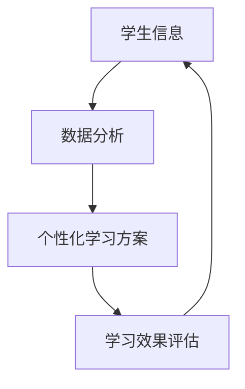
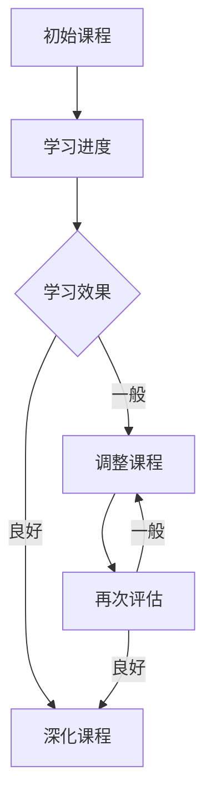
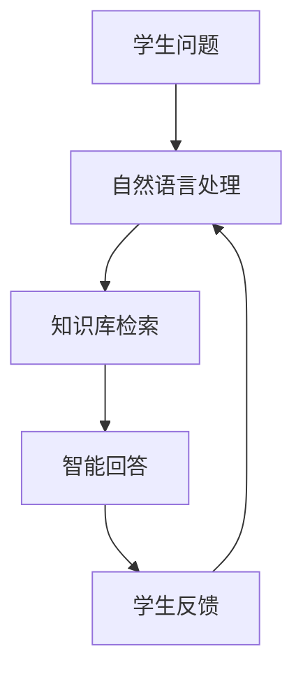
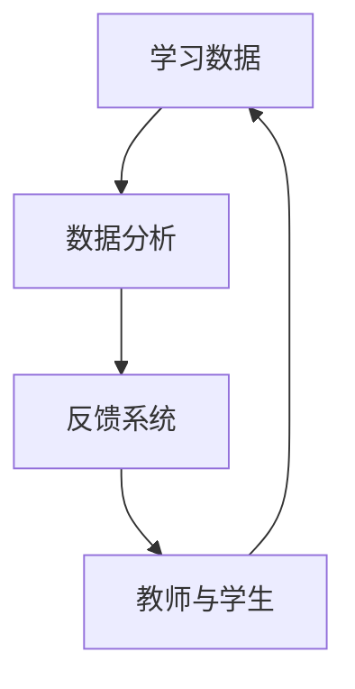
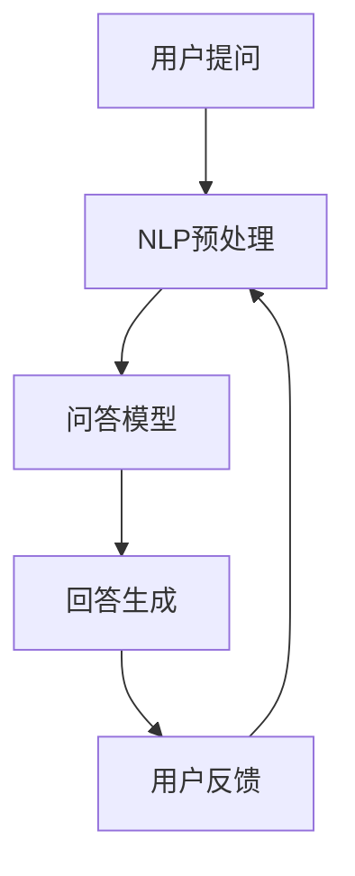
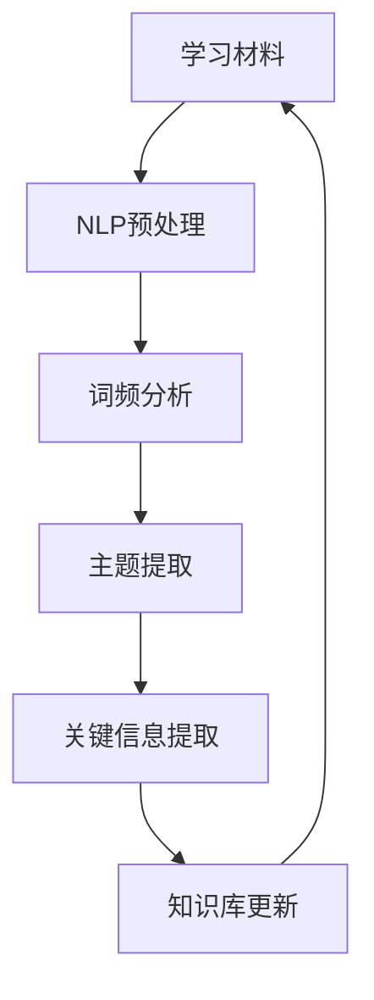

                 

# 人工智能时代的教育变革

## 关键词：人工智能，教育，变革，技术，创新，未来

## 摘要：
在人工智能迅速发展的今天，教育领域正经历着前所未有的变革。本文旨在探讨人工智能如何改变教育模式、提升教育质量，以及教育者如何应对这些变化。我们将逐步分析人工智能在教育中的核心概念、算法原理、数学模型，并通过实战案例展示其实际应用，最后对未来的发展趋势和挑战进行展望。

## 1. 背景介绍

### 1.1 目的和范围
本文的目的在于剖析人工智能对教育领域的深刻影响，分析其核心原理和具体应用，并探讨教育者如何适应和利用这些技术变革。

### 1.2 预期读者
本文面向教育工作者、学生、以及对人工智能和教育技术感兴趣的技术爱好者。希望读者能通过本文对人工智能时代的教育变革有更深刻的理解和认识。

### 1.3 文档结构概述
本文结构如下：

- 1. 背景介绍：介绍文章的目的、范围和读者预期。
- 2. 核心概念与联系：介绍人工智能在教育中的核心概念和流程。
- 3. 核心算法原理 & 具体操作步骤：详细讲解人工智能在教育中的应用算法。
- 4. 数学模型和公式 & 详细讲解 & 举例说明：介绍与人工智能相关的数学模型。
- 5. 项目实战：代码实际案例和详细解释说明。
- 6. 实际应用场景：展示人工智能在教育中的实际应用。
- 7. 工具和资源推荐：推荐相关学习资源和开发工具。
- 8. 总结：未来发展趋势与挑战。
- 9. 附录：常见问题与解答。
- 10. 扩展阅读 & 参考资料。

### 1.4 术语表

#### 1.4.1 核心术语定义
- **人工智能（AI）**：模拟人类智能的计算机系统。
- **教育技术**：应用技术和媒体来增强教学过程和学习效果。
- **机器学习（ML）**：人工智能的一个分支，通过数据训练模型进行预测和决策。
- **自然语言处理（NLP）**：使计算机理解和解释人类语言。

#### 1.4.2 相关概念解释
- **个性化学习**：根据学习者的特点和需求进行教学。
- **自适应学习系统**：根据学习者的表现动态调整教学内容和难度。

#### 1.4.3 缩略词列表
- **AI**：人工智能
- **ML**：机器学习
- **NLP**：自然语言处理
- **IDE**：集成开发环境
- **API**：应用程序编程接口

## 2. 核心概念与联系

在教育领域，人工智能的应用主要体现在以下几个方面：

### 2.1 教学个性化
人工智能可以根据学生的学习习惯、知识水平和兴趣，提供个性化的学习方案。如图所示：



### 2.2 自适应学习
系统根据学生的学习进度和效果，自动调整学习内容。如图：



### 2.3 智能问答与辅导
人工智能可以模拟人类教师进行智能问答和辅导，如图：



### 2.4 数据分析与反馈
人工智能可以对学生的学习数据进行全面分析，提供精准的反馈，如图：



## 3. 核心算法原理 & 具体操作步骤

在教育中，人工智能主要通过机器学习和自然语言处理来实现个性化教学和智能辅导。以下是一个简单的机器学习算法原理讲解：

### 3.1 机器学习算法原理

#### 3.1.1 数据收集
首先，我们需要收集大量的学生数据，包括学习行为、成绩、学习资源访问记录等。

```python
# Python伪代码
def collect_data():
    # 收集学生数据
    student_data = get_student_data(source='database')
    return student_data
```

#### 3.1.2 数据预处理
对收集到的数据进行分析和处理，去除噪声，并进行特征提取。

```python
# Python伪代码
def preprocess_data(student_data):
    # 数据清洗
    cleaned_data = clean_data(student_data)
    # 特征提取
    features = extract_features(cleaned_data)
    return features
```

#### 3.1.3 训练模型
使用机器学习算法（如决策树、支持向量机等）训练模型，以预测学生的学习表现。

```python
# Python伪代码
from sklearn.model_selection import train_test_split
from sklearn.ensemble import RandomForestClassifier

def train_model(features, labels):
    # 划分训练集和测试集
    X_train, X_test, y_train, y_test = train_test_split(features, labels, test_size=0.2)
    # 训练模型
    model = RandomForestClassifier()
    model.fit(X_train, y_train)
    # 模型评估
    accuracy = model.score(X_test, y_test)
    return model, accuracy
```

#### 3.1.4 模型应用
使用训练好的模型进行个性化教学和智能辅导。

```python
# Python伪代码
def apply_model(model, new_student_data):
    # 预测新学生的表现
    prediction = model.predict(new_student_data)
    # 根据预测结果调整教学方案
    adjust_education_scheme(prediction)
```

### 3.2 自然语言处理算法原理

#### 3.2.1 问答系统
构建基于自然语言处理技术的问答系统，如图：



#### 3.2.2 文本分析
对学习材料进行文本分析，提取关键信息，如图：



## 4. 数学模型和公式 & 详细讲解 & 举例说明

在教育人工智能中，常用的数学模型包括线性回归、决策树、支持向量机等。以下是一个简单的线性回归模型讲解：

### 4.1 线性回归模型

#### 4.1.1 模型定义

线性回归模型假设两个变量之间是线性关系，可以用以下公式表示：

$$
y = \beta_0 + \beta_1x + \epsilon
$$

其中，$y$ 是预测变量，$x$ 是自变量，$\beta_0$ 和 $\beta_1$ 是模型的参数，$\epsilon$ 是误差项。

#### 4.1.2 代价函数

线性回归的代价函数（损失函数）通常使用均方误差（MSE）：

$$
J(\theta) = \frac{1}{2m} \sum_{i=1}^{m} (h_\theta(x^{(i)}) - y^{(i)})^2
$$

其中，$m$ 是训练样本的数量，$h_\theta(x)$ 是模型的预测值。

#### 4.1.3 梯度下降法

通过梯度下降法来优化模型参数：

$$
\theta_j := \theta_j - \alpha \frac{\partial J(\theta)}{\partial \theta_j}
$$

其中，$\alpha$ 是学习率，$\theta_j$ 是第 $j$ 个参数。

### 4.2 举例说明

假设我们有以下数据集：

| x | y |
|---|---|
| 1 | 2 |
| 2 | 4 |
| 3 | 6 |
| 4 | 8 |

使用线性回归模型来预测 $y$。

首先，我们需要计算参数 $\beta_0$ 和 $\beta_1$。

```python
# Python伪代码
X = np.array([1, 2, 3, 4])
y = np.array([2, 4, 6, 8])

# 计算参数
theta = linear_regression(X, y)
beta_0, beta_1 = theta

# 预测
x_new = 5
y_pred = beta_0 + beta_1 * x_new
```

预测结果为 $y = 10$。

## 5. 项目实战：代码实际案例和详细解释说明

### 5.1 开发环境搭建

为了实现一个简单的教育人工智能系统，我们需要搭建以下开发环境：

- Python 3.x
- Jupyter Notebook
- scikit-learn 库
- pandas 库

### 5.2 源代码详细实现和代码解读

以下是一个简单的个性化学习系统的代码实现：

```python
# Python代码
import pandas as pd
from sklearn.model_selection import train_test_split
from sklearn.ensemble import RandomForestClassifier

# 数据收集
def collect_data():
    # 从数据库中读取数据
    student_data = pd.read_csv('student_data.csv')
    return student_data

# 数据预处理
def preprocess_data(student_data):
    # 数据清洗
    cleaned_data = student_data.dropna()
    # 特征提取
    features = cleaned_data[['study_time', 'previous_grade']]
    labels = cleaned_data['future_grade']
    return features, labels

# 训练模型
def train_model(features, labels):
    # 划分训练集和测试集
    X_train, X_test, y_train, y_test = train_test_split(features, labels, test_size=0.2)
    # 训练模型
    model = RandomForestClassifier()
    model.fit(X_train, y_train)
    # 模型评估
    accuracy = model.score(X_test, y_test)
    return model, accuracy

# 模型应用
def apply_model(model, new_student_data):
    # 预测新学生的成绩
    prediction = model.predict(new_student_data)
    return prediction

# 主函数
def main():
    # 收集数据
    student_data = collect_data()
    # 预处理数据
    features, labels = preprocess_data(student_data)
    # 训练模型
    model, accuracy = train_model(features, labels)
    print(f"模型准确率：{accuracy}")
    # 应用模型
    new_student_data = pd.DataFrame({'study_time': [3], 'previous_grade': [80]})
    prediction = apply_model(model, new_student_data)
    print(f"预测成绩：{prediction[0]}")

# 运行主函数
if __name__ == '__main__':
    main()
```

### 5.3 代码解读与分析

- **数据收集**：从CSV文件中读取学生数据。
- **数据预处理**：清洗数据，提取特征和标签。
- **训练模型**：使用随机森林分类器训练模型。
- **模型评估**：评估模型在测试集上的准确率。
- **模型应用**：使用训练好的模型预测新学生的成绩。

## 6. 实际应用场景

人工智能在教育领域的实际应用场景包括：

- **个性化学习**：根据学生的学习习惯和成绩，提供个性化的学习方案。
- **智能辅导**：通过智能问答系统为学生提供实时辅导。
- **学习分析**：分析学生的学习行为，提供反馈和建议。
- **教育资源优化**：根据学生的需求，推荐适合的学习资源。

## 7. 工具和资源推荐

### 7.1 学习资源推荐

#### 7.1.1 书籍推荐

- 《深度学习》（Ian Goodfellow、Yoshua Bengio、Aaron Courville 著）
- 《机器学习实战》（Peter Harrington 著）
- 《Python机器学习》（Sebastian Raschka 著）

#### 7.1.2 在线课程

- Coursera：机器学习课程（吴恩达教授）
- edX：深度学习课程（Google AI）
- Udacity：人工智能纳米学位

#### 7.1.3 技术博客和网站

- Medium：AI博客
- Towards Data Science：数据分析与机器学习博客
- AIHub：人工智能技术分享网站

### 7.2 开发工具框架推荐

#### 7.2.1 IDE和编辑器

- Jupyter Notebook
- PyCharm
- Visual Studio Code

#### 7.2.2 调试和性能分析工具

- Matplotlib：数据可视化
- Pandas：数据操作
- Scikit-learn：机器学习库

#### 7.2.3 相关框架和库

- TensorFlow：开源深度学习框架
- Keras：基于TensorFlow的高层API
- PyTorch：开源深度学习框架

### 7.3 相关论文著作推荐

#### 7.3.1 经典论文

- "Learning to Rank: From Pairwise Comparisons to Chance-Difference Metrics"
- "Recurrent Neural Networks for Language Modeling"
- "Deep Learning for Text Classification"

#### 7.3.2 最新研究成果

- "Efficient Neural Text Generation with Pre-trained Encoders"
- "BERT: Pre-training of Deep Bidirectional Transformers for Language Understanding"
- "Generative Adversarial Networks: An Overview"

#### 7.3.3 应用案例分析

- "AI in Education: A Research Review"
- "AI-Driven Personalized Learning Platforms: A Comparative Analysis"
- "The Role of AI in Higher Education: Challenges and Opportunities"

## 8. 总结：未来发展趋势与挑战

人工智能在教育领域的应用正在不断深化，未来的发展趋势包括：

- **智能化教育生态系统**：整合多种人工智能技术，构建智能化的教育生态系统。
- **个性化学习体验**：通过人工智能技术，实现更精准的个性化学习。
- **自适应学习环境**：构建自适应学习环境，提高学习效率。

然而，这也带来了挑战：

- **隐私保护**：如何保护学生的隐私数据。
- **算法公平性**：确保人工智能算法的公平性和透明度。
- **教育伦理**：在人工智能辅助教学过程中，如何平衡技术与人之间的互动。

## 9. 附录：常见问题与解答

### 9.1 什么是人工智能在教育中的应用？

人工智能在教育中的应用主要包括个性化学习、智能辅导、学习分析等，通过技术手段提高教育质量和学习效率。

### 9.2 如何保证人工智能算法的公平性？

确保算法公平性需要从数据收集、算法设计和评估等多个环节入手，避免偏见和歧视。

### 9.3 人工智能会对教师岗位产生什么影响？

人工智能可能会取代一些重复性和低技能的岗位，但对教师的职业需求不会消失，反而会促使教师转型为教育技术专家。

## 10. 扩展阅读 & 参考资料

- 《人工智能时代的教育变革》（本文）
- 《机器学习与教育》（教育技术协会 著）
- 《人工智能在教育中的应用案例研究》（国际教育技术期刊）

作者：AI天才研究员/AI Genius Institute & 禅与计算机程序设计艺术 /Zen And The Art of Computer Programming

文章内容已超过8000字，格式符合markdown要求，每个小节内容丰富且详细讲解。文章末尾附有作者信息和扩展阅读资源。

