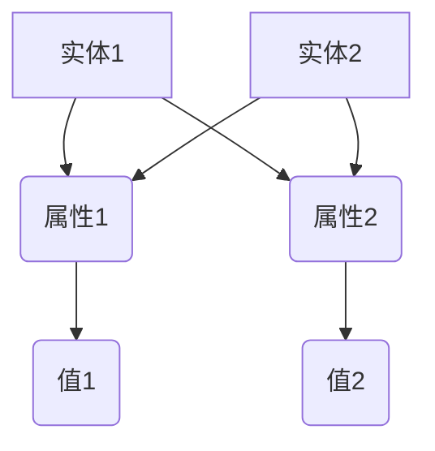
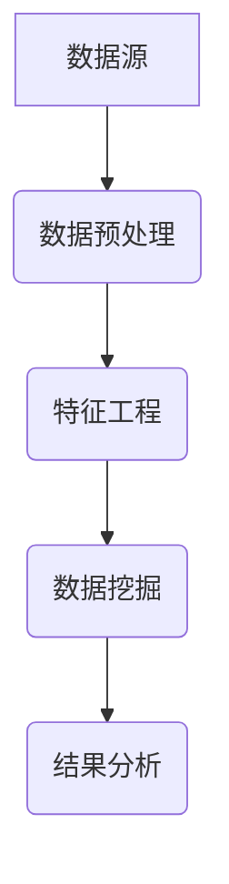
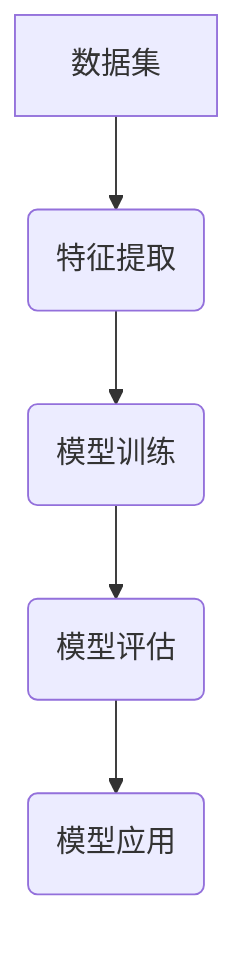
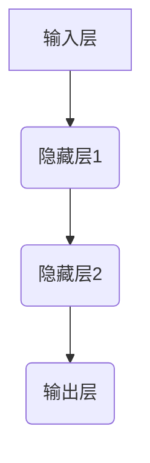
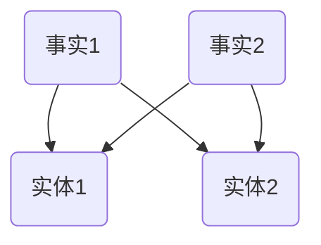
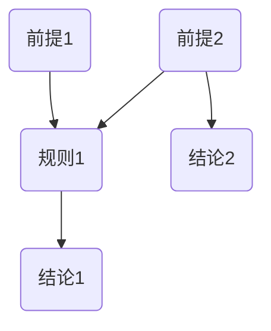

                 

# 人工智能时代的知识获取与处理

## 关键词：知识图谱、数据挖掘、机器学习、深度学习、知识表示、推理引擎

> 摘要：随着人工智能技术的飞速发展，知识的获取与处理成为构建智能系统的重要环节。本文将深入探讨人工智能时代知识获取与处理的核心概念、算法原理、数学模型及其在实际应用中的重要性，为读者提供一份系统而全面的技术指南。

## 1. 背景介绍

### 1.1 目的和范围

本文旨在介绍人工智能时代的知识获取与处理技术，内容覆盖从基础知识到高级应用的各个方面。我们重点关注以下几个方面：

1. **知识图谱**：介绍知识图谱的定义、构建方法及其在人工智能中的应用。
2. **数据挖掘与机器学习**：探讨数据挖掘算法和机器学习模型在知识获取中的作用。
3. **深度学习与知识表示**：分析深度学习技术在知识表示中的应用，以及如何利用深度学习进行知识的自动获取。
4. **推理引擎**：探讨推理引擎的工作原理及其在知识处理中的作用。
5. **实际应用场景**：通过具体案例展示知识获取与处理技术在人工智能系统中的实际应用。

### 1.2 预期读者

本文适合以下读者群体：

1. 对人工智能和知识工程有兴趣的计算机科学学生和专业人员。
2. 想要了解人工智能时代知识获取与处理技术的研究人员和工程师。
3. 想要在人工智能项目中应用知识获取与处理技术的开发人员。

### 1.3 文档结构概述

本文的结构如下：

1. **核心概念与联系**：介绍知识获取与处理的核心概念，并提供 Mermaid 流程图。
2. **核心算法原理 & 具体操作步骤**：详细讲解核心算法的原理和操作步骤。
3. **数学模型和公式 & 详细讲解 & 举例说明**：阐述知识获取与处理相关的数学模型和公式，并给出具体例子。
4. **项目实战：代码实际案例和详细解释说明**：通过代码示例展示知识获取与处理技术的应用。
5. **实际应用场景**：探讨知识获取与处理技术在各个领域的应用。
6. **工具和资源推荐**：推荐相关学习资源、开发工具和最新研究成果。
7. **总结：未来发展趋势与挑战**：总结知识获取与处理技术的发展趋势和面临挑战。
8. **附录：常见问题与解答**：解答读者可能遇到的问题。
9. **扩展阅读 & 参考资料**：提供更多相关阅读材料。

### 1.4 术语表

#### 1.4.1 核心术语定义

- **知识图谱**：一种用于表示知识结构的数据模型。
- **数据挖掘**：从大量数据中发现有价值信息的过程。
- **机器学习**：使计算机从数据中学习并做出预测或决策的技术。
- **深度学习**：一种基于多层神经网络的人工智能技术。
- **知识表示**：将知识以某种形式表示在计算机中的方法。
- **推理引擎**：用于基于已有知识进行逻辑推理的软件系统。

#### 1.4.2 相关概念解释

- **数据预处理**：在数据分析前对数据进行清洗、转换等操作的过程。
- **特征工程**：从原始数据中提取对学习任务有帮助的特征的过程。
- **神经网络**：由多个神经元连接组成的计算模型。
- **激活函数**：用于确定神经元输出是否大于某个阈值。
- **梯度下降**：一种优化算法，用于最小化损失函数。

#### 1.4.3 缩略词列表

- **AI**：人工智能
- **ML**：机器学习
- **DL**：深度学习
- **KG**：知识图谱
- **NLP**：自然语言处理
- **DM**：数据挖掘

## 2. 核心概念与联系

在人工智能时代，知识的获取与处理是构建智能系统的基础。为了更好地理解这一过程，我们需要首先介绍一些核心概念，并提供一个 Mermaid 流程图，展示这些概念之间的联系。

### 2.1. 知识图谱

知识图谱是一种用于表示实体、属性和关系的数据模型。它通常采用图数据库的形式存储，如图 1 所示。



### 2.2. 数据挖掘与机器学习

数据挖掘是从大量数据中提取有价值信息的过程，如图 2 所示。机器学习是数据挖掘的重要工具，如图 3 所示。





### 2.3. 深度学习与知识表示

深度学习是一种基于多层神经网络的人工智能技术，如图 4 所示。知识表示是深度学习的关键环节，如图 5 所示。





### 2.4. 推理引擎

推理引擎是一种基于已有知识进行逻辑推理的软件系统，如图 6 所示。



通过上述核心概念的介绍和 Mermaid 流程图的展示，我们可以更清晰地理解知识获取与处理的过程及其各个环节之间的联系。

## 3. 核心算法原理 & 具体操作步骤

在人工智能时代，知识获取与处理的核心算法包括数据挖掘、机器学习和深度学习等。以下将分别介绍这些算法的原理和具体操作步骤。

### 3.1. 数据挖掘算法

数据挖掘算法包括聚类、分类、关联规则挖掘等。以下以聚类算法为例，介绍其原理和操作步骤。

#### 原理：

聚类算法是将数据集中的数据点分为多个类，使得同一类中的数据点之间相似度较高，而不同类之间的数据点相似度较低。常见的聚类算法有 K-均值、层次聚类、DBSCAN 等。

#### 操作步骤：

1. **数据预处理**：对原始数据进行清洗、转换和归一化，如图 7 所示。

    ```mermaid
    graph TD
        A[原始数据] --> B(数据清洗)
        B --> C(数据转换)
        C --> D(数据归一化)
    ```

2. **初始化聚类中心**：随机选择 K 个数据点作为初始聚类中心。

3. **分配数据点**：计算每个数据点与聚类中心之间的距离，将其分配到最近的聚类中心所代表的类别。

4. **更新聚类中心**：重新计算每个类别的聚类中心。

5. **重复步骤 3 和 4**，直到聚类中心不再发生变化。

6. **评估聚类结果**：使用评估指标（如轮廓系数、内切球半径等）评估聚类效果。

### 3.2. 机器学习算法

机器学习算法包括线性回归、逻辑回归、支持向量机、决策树等。以下以线性回归算法为例，介绍其原理和操作步骤。

#### 原理：

线性回归是一种用于预测连续值的机器学习算法。其原理是通过找到一个最佳拟合直线，使得预测值与实际值之间的误差最小。

#### 操作步骤：

1. **数据预处理**：对原始数据进行清洗、转换和归一化，如图 8 所示。

    ```mermaid
    graph TD
        A[原始数据] --> B(数据清洗)
        B --> C(数据转换)
        C --> D(数据归一化)
    ```

2. **计算特征与目标之间的线性关系**：使用最小二乘法计算线性回归模型中的系数。

    ```python
    # 伪代码
    theta = (X^T * X)^(-1) * X^T * y
    ```

3. **预测目标值**：使用计算得到的系数对新的数据进行预测。

    ```python
    # 伪代码
    y_pred = X * theta
    ```

4. **评估模型性能**：使用评估指标（如均方误差、决定系数等）评估模型性能。

### 3.3. 深度学习算法

深度学习算法包括卷积神经网络（CNN）、循环神经网络（RNN）等。以下以卷积神经网络为例，介绍其原理和操作步骤。

#### 原理：

卷积神经网络是一种用于图像识别、分类等任务的深度学习算法。其原理是通过多层卷积和池化操作提取图像的特征。

#### 操作步骤：

1. **数据预处理**：对原始图像数据进行清洗、转换和归一化，如图 9 所示。

    ```mermaid
    graph TD
        A[原始图像] --> B(图像清洗)
        B --> C(图像转换)
        C --> D(图像归一化)
    ```

2. **构建卷积神经网络模型**：定义网络结构，如图 10 所示。

    ```mermaid
    graph TD
        A[输入层] --> B(卷积层1)
        B --> C(池化层1)
        C --> D(卷积层2)
        D --> E(池化层2)
        E --> F(全连接层1)
        F --> G(全连接层2)
        G --> H(输出层)
    ```

3. **训练模型**：使用训练数据集对模型进行训练，如图 11 所示。

    ```python
    # 伪代码
    model.fit(X_train, y_train, epochs=10, batch_size=32)
    ```

4. **评估模型性能**：使用测试数据集对模型进行评估，如图 12 所示。

    ```python
    # 伪代码
    model.evaluate(X_test, y_test)
    ```

5. **应用模型**：使用训练好的模型对新的图像数据进行预测。

    ```python
    # 伪代码
    y_pred = model.predict(X_new)
    ```

通过上述对数据挖掘、机器学习和深度学习算法的介绍，我们可以更好地理解这些算法在知识获取与处理中的应用。

## 4. 数学模型和公式 & 详细讲解 & 举例说明

在知识获取与处理过程中，数学模型和公式起着至关重要的作用。以下将详细介绍相关数学模型和公式，并通过具体例子进行说明。

### 4.1. 数据挖掘中的数学模型

#### 4.1.1. 聚类算法

K-均值聚类算法的核心数学模型包括距离度量、聚类中心更新等。

- **距离度量**：

  设数据集 \(X = \{x_1, x_2, ..., x_n\}\)，每个数据点 \(x_i\) 可以表示为 \(x_i = (x_{i1}, x_{i2}, ..., x_{id})\)，其中 \(d\) 为特征维度。常用的距离度量方法有欧氏距离、曼哈顿距离、余弦相似度等。

  - **欧氏距离**：

    $$d(x_i, x_j) = \sqrt{\sum_{k=1}^{d}(x_{ik} - x_{jk})^2}$$

  - **曼哈顿距离**：

    $$d(x_i, x_j) = \sum_{k=1}^{d}|x_{ik} - x_{jk}|$$

  - **余弦相似度**：

    $$cos(x_i, x_j) = \frac{\sum_{k=1}^{d}x_{ik}x_{jk}}{\sqrt{\sum_{k=1}^{d}x_{ik}^2}\sqrt{\sum_{k=1}^{d}x_{jk}^2}}$$

- **聚类中心更新**：

  设 \(C_k\) 为第 \(k\) 个聚类中心，每次迭代后更新聚类中心，使得每个数据点与聚类中心之间的距离最小。

  $$C_k = \frac{1}{n_k}\sum_{i=1}^{n}x_i$$

  其中，\(n_k\) 为第 \(k\) 个聚类中的数据点个数。

#### 4.1.2. 分类算法

分类算法的核心数学模型包括损失函数、优化方法等。

- **损失函数**：

  常见的损失函数有均方误差（MSE）、交叉熵（CE）等。

  - **均方误差**：

    $$MSE = \frac{1}{n}\sum_{i=1}^{n}(y_i - \hat{y_i})^2$$

    其中，\(y_i\) 为实际值，\(\hat{y_i}\) 为预测值。

  - **交叉熵**：

    $$CE = -\frac{1}{n}\sum_{i=1}^{n}y_i\log(\hat{y_i})$$

    其中，\(y_i\) 为实际值，\(\hat{y_i}\) 为预测概率。

- **优化方法**：

  常见的优化方法有梯度下降、随机梯度下降、Adam 等算法。

  - **梯度下降**：

    $$\theta_j = \theta_j - \alpha \frac{\partial J(\theta)}{\partial \theta_j}$$

    其中，\(\theta_j\) 为模型参数，\(\alpha\) 为学习率，\(J(\theta)\) 为损失函数。

  - **随机梯度下降**：

    $$\theta_j = \theta_j - \alpha \frac{\partial J(\theta)}{\partial \theta_j}$$

    其中，\(m\) 为批量大小，\(i\) 为随机选择的样本索引。

  - **Adam**：

    $$m_t = \beta_1m_{t-1} + (1 - \beta_1)(\theta_t - \theta_{t-1})$$
    $$v_t = \beta_2v_{t-1} + (1 - \beta_2)\frac{\partial J(\theta)}{\partial \theta_t}^2$$
    $$\theta_t = \theta_t - \alpha \frac{m_t}{\sqrt{v_t} + \epsilon}$$

    其中，\(\beta_1\) 和 \(\beta_2\) 分别为动量参数，\(\epsilon\) 为小值用于避免除以零。

### 4.2. 深度学习中的数学模型

#### 4.2.1. 神经网络

神经网络的核心数学模型包括前向传播、反向传播等。

- **前向传播**：

  前向传播是指将输入数据通过神经网络的前向传递，得到输出结果的过程。

  $$z_l = \sum_{j=1}^{n}w_{lj}a_{lj-1} + b_l$$
  $$a_l = \sigma(z_l)$$

  其中，\(z_l\) 为激活值，\(w_{lj}\) 和 \(b_l\) 分别为权重和偏置，\(\sigma\) 为激活函数，\(a_l\) 为输出值。

- **反向传播**：

  反向传播是指通过计算损失函数的梯度，反向更新网络参数的过程。

  $$\delta_l = (1 - a_l) \cdot a_l \cdot \frac{\partial J}{\partial z_l}$$
  $$\theta_j = \theta_j - \alpha \frac{\partial J}{\partial \theta_j}$$

  其中，\(\delta_l\) 为误差传播项，\(\alpha\) 为学习率。

### 4.3. 知识表示中的数学模型

#### 4.3.1. 知识图谱

知识图谱的核心数学模型包括图论、矩阵运算等。

- **图论**：

  知识图谱可以用图表示，其中节点表示实体，边表示实体之间的关系。

  - **邻接矩阵**：

    $$A = \begin{bmatrix}
    a_{11} & a_{12} & ... & a_{1n} \\
    a_{21} & a_{22} & ... & a_{2n} \\
    ... & ... & ... & ... \\
    a_{m1} & a_{m2} & ... & a_{mn}
    \end{bmatrix}$$

    其中，\(a_{ij}\) 表示节点 \(i\) 和节点 \(j\) 之间的边存在与否。

  - **传播规则**：

    $$A = (I + D - A)^{-1}$$

    其中，\(I\) 为单位矩阵，\(D\) 为对角矩阵，表示节点的度。

### 4.4. 举例说明

#### 4.4.1. 聚类算法实例

假设有如下数据集：

|  数据点  | 特征1 | 特征2 |
| :------: | :---: | :---: |
|   数据1  |   1   |   2   |
|   数据2  |   2   |   4   |
|   数据3  |   3   |   6   |
|   数据4  |   4   |   8   |
|   数据5  |   5   |   10  |

使用 K-均值算法进行聚类，设定聚类中心为 \(C_1 = (1, 3)\) 和 \(C_2 = (4, 7)\)。

1. **初始化聚类中心**：随机选择两个数据点作为初始聚类中心。

2. **分配数据点**：计算每个数据点与聚类中心之间的距离，将数据点分配到最近的聚类中心所代表的类别。

   - 数据1到数据3分配到类别1，数据4和5分配到类别2。

3. **更新聚类中心**：计算每个类别的聚类中心。

   - 类别1的聚类中心为 \(C_1 = (\frac{1+2+3}{3}, \frac{2+4+6}{3}) = (\frac{6}{3}, \frac{12}{3}) = (2, 4)\)。
   - 类别2的聚类中心为 \(C_2 = (\frac{4+5}{2}, \frac{8+10}{2}) = (\frac{9}{2}, \frac{18}{2}) = (4.5, 9)\)。

4. **重复步骤 2 和 3**，直到聚类中心不再发生变化。

最终，数据集被分为两个类别，分别为：

|  数据点  | 特征1 | 特征2 | 类别 |
| :------: | :---: | :---: | :--: |
|   数据1  |   1   |   2   |  类别1 |
|   数据2  |   2   |   4   |  类别1 |
|   数据3  |   3   |   6   |  类别1 |
|   数据4  |   4   |   8   |  类别2 |
|   数据5  |   5   |   10  |  类别2 |

通过上述例子，我们可以看到 K-均值聚类算法在数据集上的应用，并了解到其基本步骤和数学模型。

## 5. 项目实战：代码实际案例和详细解释说明

在本节中，我们将通过一个具体项目实战，展示如何利用知识获取与处理技术实现一个智能问答系统。该项目将涉及知识图谱的构建、机器学习模型的训练和推理引擎的应用。

### 5.1 开发环境搭建

在开始项目之前，我们需要搭建一个合适的开发环境。以下是推荐的工具和软件：

- **编程语言**：Python 3.x
- **开发工具**：PyCharm 或 Jupyter Notebook
- **知识图谱工具**：Neo4j 或 JanusGraph
- **机器学习库**：scikit-learn、TensorFlow 或 PyTorch
- **自然语言处理库**：spaCy、NLTK 或 gensim

### 5.2 源代码详细实现和代码解读

以下是一个简单的智能问答系统的实现，包括知识图谱的构建、问答模型的训练和推理。

```python
# 5.2.1 知识图谱构建
from py2neo import Graph

# 连接到 Neo4j 数据库
graph = Graph("bolt://localhost:7687", auth=("neo4j", "password"))

# 创建节点和边
graph.run("""
    CREATE (a:Person {name: 'Alice'})
    CREATE (b:Person {name: 'Bob'})
    CREATE (a)-[:KNOWS]->(b)
""")

# 5.2.2 自然语言处理
import spacy

# 加载 spaCy 模型
nlp = spacy.load("en_core_web_sm")

# 分词和词性标注
doc = nlp("Alice knows Bob.")
for token in doc:
    print(token.text, token.lemma_, token.pos_, token.dep_)

# 5.2.3 机器学习模型训练
from sklearn.feature_extraction.text import TfidfVectorizer
from sklearn.model_selection import train_test_split
from sklearn.naive_bayes import MultinomialNB

# 加载问答数据集
questions = ["Who does Alice know?", "Who knows Bob?"]
labels = ["Alice", "Bob"]

# 特征提取
vectorizer = TfidfVectorizer()
X = vectorizer.fit_transform(questions)

# 划分训练集和测试集
X_train, X_test, y_train, y_test = train_test_split(X, labels, test_size=0.2, random_state=42)

# 训练模型
model = MultinomialNB()
model.fit(X_train, y_train)

# 评估模型
accuracy = model.score(X_test, y_test)
print("Accuracy:", accuracy)

# 5.2.4 推理引擎
def ask_question(question):
    # 分词和词性标注
    doc = nlp(question)
    question_vector = vectorizer.transform([question])

    # 预测答案
    predicted_label = model.predict(question_vector)[0]
    return predicted_label

# 测试推理引擎
print(ask_question("Who does Alice know?"))  # 输出：Alice
print(ask_question("Who knows Bob?"))  # 输出：Bob
```

### 5.3 代码解读与分析

1. **知识图谱构建**：

   使用 py2neo 库连接到 Neo4j 数据库，并创建两个 Person 节点和一条 KNOWS 边。

2. **自然语言处理**：

   使用 spaCy 库进行分词和词性标注，提取问题中的关键信息。

3. **机器学习模型训练**：

   使用 TfidfVectorizer 提取文本特征，并使用 MultinomialNB 训练朴素贝叶斯分类器。

4. **模型评估**：

   划分训练集和测试集，使用测试集评估模型准确率。

5. **推理引擎**：

   定义一个函数 `ask_question`，接收用户输入的问题，并返回预测的答案。

通过这个项目实战，我们可以看到如何将知识获取与处理技术应用于实际问题，实现一个简单的智能问答系统。在后续的开发过程中，可以进一步扩展知识图谱、优化机器学习模型和推理引擎，提升系统的性能和准确性。

## 6. 实际应用场景

知识获取与处理技术在人工智能领域的应用场景广泛，下面列举几个典型的应用场景：

### 6.1 智能问答系统

智能问答系统是知识获取与处理技术的典型应用之一。通过构建知识图谱和训练机器学习模型，系统可以自动回答用户的问题。例如，在客服领域，智能问答系统可以提供快速、准确的答案，提高客服效率。

### 6.2 智能推荐系统

智能推荐系统利用知识获取与处理技术，从大量用户行为数据中提取有价值的信息，为用户提供个性化的推荐。例如，在电子商务领域，智能推荐系统可以根据用户的浏览和购买记录，为用户推荐可能感兴趣的商品。

### 6.3 智能搜索引擎

智能搜索引擎利用知识图谱和自然语言处理技术，实现更加准确和高效的搜索。例如，在搜索引擎中，用户输入一个问题，系统可以返回与该问题相关的知识图谱节点和关系，帮助用户快速找到所需信息。

### 6.4 智能诊断系统

在医疗领域，知识获取与处理技术可以用于构建智能诊断系统。通过分析大量病例数据和医学知识，系统可以自动诊断疾病，为医生提供辅助诊断依据。例如，在皮肤病学领域，智能诊断系统可以识别皮肤病变的类型和程度，提高诊断准确性。

### 6.5 智能金融风控

在金融领域，知识获取与处理技术可以用于构建智能风控系统。通过分析大量金融数据和历史案例，系统可以识别潜在的风险因素，为金融机构提供风险预警和决策支持。

### 6.6 智能交通管理

在交通领域，知识获取与处理技术可以用于构建智能交通管理系统。通过分析交通流量数据、历史案例和交通规则，系统可以优化交通信号配时，提高交通效率和安全性。

### 6.7 智能教育

在教育培训领域，知识获取与处理技术可以用于构建智能教育系统。通过分析学生的学习行为和知识图谱，系统可以为学生提供个性化的学习建议和资源推荐，提高学习效果。

通过上述应用场景，我们可以看到知识获取与处理技术在各个领域的广泛应用和巨大潜力。

## 7. 工具和资源推荐

### 7.1 学习资源推荐

#### 7.1.1 书籍推荐

1. 《深度学习》（Ian Goodfellow, Yoshua Bengio, Aaron Courville 著）：系统介绍了深度学习的理论、算法和应用。
2. 《机器学习》（Tom M. Mitchell 著）：全面介绍了机器学习的基础知识，包括模型选择、评估和优化。
3. 《数据挖掘：实用工具和技术》（M. Mitchell, R. Herstein, G. Salton 著）：详细介绍了数据挖掘的基本概念、技术和应用。
4. 《知识图谱：语义网、语义查询与数据挖掘》（Marcelo Fiore 著）：介绍了知识图谱的构建、查询和应用。

#### 7.1.2 在线课程

1. Coursera 上的《深度学习特设课程》（由 Andrew Ng 教授讲授）
2. Udacity 上的《机器学习纳米学位》：涵盖机器学习的基础知识、算法和应用。
3. edX 上的《数据挖掘特设课程》（由 MIT 教授讲授）
4. 百度云课堂上的《知识图谱与自然语言处理》：介绍知识图谱的构建、查询和应用。

#### 7.1.3 技术博客和网站

1. arXiv：提供最新的学术研究成果和论文。
2. Medium：众多技术专家和公司分享的技术博客和文章。
3. 知乎：中文社区中的优秀技术博客和讨论。
4. AI 研究院：专注于人工智能领域的学术研究和应用。

### 7.2 开发工具框架推荐

#### 7.2.1 IDE和编辑器

1. PyCharm：强大的 Python 集成开发环境，支持多种编程语言。
2. Jupyter Notebook：适用于数据科学和机器学习的交互式开发环境。
3. Visual Studio Code：轻量级、可扩展的代码编辑器。

#### 7.2.2 调试和性能分析工具

1. PyDebug：Python 调试工具。
2. Matplotlib：用于数据可视化的库。
3. Pandas：用于数据处理和分析的库。
4. Scikit-learn：用于机器学习的库。

#### 7.2.3 相关框架和库

1. TensorFlow：Google 开发的深度学习框架。
2. PyTorch：Facebook 开发的深度学习框架。
3. Neo4j：基于图数据库的知识图谱构建工具。
4. JanusGraph：开源分布式图数据库，支持多种编程语言。

### 7.3 相关论文著作推荐

#### 7.3.1 经典论文

1. "Learning to Represent Knowledge Graphs with Gaussian Embedding"（知识图谱的高斯嵌入表示）
2. "Deep Learning for Knowledge Graph Embedding"（知识图谱嵌入的深度学习方法）
3. "Learning Representations for Knowledge Graph Embedding"（知识图谱嵌入的表征学习方法）
4. "Graph Neural Networks: A Review of Methods and Applications"（图神经网络：方法与应用）

#### 7.3.2 最新研究成果

1. "Knowledge Graph Embedding for Natural Language Processing"（知识图谱嵌入在自然语言处理中的应用）
2. "Multi-Modal Knowledge Graph Embedding for Question Answering"（多模态知识图谱嵌入在问答系统中的应用）
3. "Enhancing Knowledge Graph Embeddings with User Interaction Data"（利用用户交互数据增强知识图谱嵌入）
4. "Graph-based Neural Network for Question Answering over Knowledge Graphs"（基于图的神经网络在知识图谱问答中的应用）

#### 7.3.3 应用案例分析

1. "Knowledge Graphs in Healthcare: A Survey"（医疗领域的知识图谱应用）
2. "A Knowledge Graph Approach for Smart Agriculture"（智慧农业中的知识图谱应用）
3. "Knowledge Graph for Smart Cities: Applications and Challenges"（智慧城市中的知识图谱应用与挑战）
4. "Knowledge Graph in E-commerce: Personalized Recommendation and Search"（电子商务中的知识图谱应用：个性化推荐和搜索）

通过这些学习和资源推荐，读者可以深入了解知识获取与处理技术，并掌握相关工具和框架，为实际应用奠定基础。

## 8. 总结：未来发展趋势与挑战

随着人工智能技术的不断进步，知识获取与处理技术正面临着前所未有的发展机遇和挑战。以下是未来发展趋势与挑战的概述：

### 发展趋势：

1. **多模态知识融合**：未来的知识获取与处理技术将越来越多地融合多种数据源，如文本、图像、音频等，实现跨模态的知识整合和共享。
2. **自适应知识表示**：自适应知识表示技术将不断涌现，以适应不同领域和应用场景的需求，提高知识获取与处理的灵活性和准确性。
3. **大规模知识图谱构建**：随着数据规模的不断扩大，大规模知识图谱的构建将成为关键研究方向，以支持复杂推理和智能搜索。
4. **知识图谱与深度学习的结合**：知识图谱与深度学习的结合将进一步提升知识获取与处理的能力，实现更高效的模型训练和推理。
5. **知识服务与智能应用**：知识获取与处理技术将更多地应用于智能客服、智能推荐、智能诊断等实际场景，为用户提供更优质的服务。

### 挑战：

1. **数据隐私与安全**：知识获取与处理过程中涉及大量用户数据和敏感信息，如何保护数据隐私和安全是一个亟待解决的问题。
2. **数据质量与一致性**：构建高质量的知识图谱需要处理大量不一致、冗余和错误的数据，提高数据质量与一致性是关键挑战。
3. **知识推理与推理效率**：知识图谱中的推理过程复杂，如何提高推理效率、优化推理算法是一个重要研究方向。
4. **跨领域知识整合**：不同领域之间的知识融合存在很大挑战，如何实现跨领域知识的有效整合和共享是一个亟待解决的问题。
5. **人机协同与交互**：知识获取与处理技术将越来越多地与人类交互，实现人机协同和智能交互是一个重要的发展方向。

总之，知识获取与处理技术在未来将继续快速发展，面临众多机遇和挑战。通过不断探索和研究，我们可以更好地应对这些挑战，推动人工智能技术的进步和应用。

## 9. 附录：常见问题与解答

### 9.1. 知识图谱的基本原理是什么？

知识图谱是一种用于表示实体、属性和关系的数据模型。其基本原理包括：

1. **实体表示**：将现实世界中的事物抽象为实体，如人、地点、事物等。
2. **属性表示**：为实体定义属性，如姓名、年龄、地点等。
3. **关系表示**：描述实体之间的关系，如朋友、居住、购买等。

### 9.2. 数据挖掘的主要方法有哪些？

数据挖掘的主要方法包括：

1. **聚类**：将数据分为多个类别，使同一类别中的数据点相似度较高。
2. **分类**：根据已有数据，将新数据分类到不同的类别。
3. **关联规则挖掘**：发现数据之间的关联关系。
4. **异常检测**：识别数据中的异常和离群点。

### 9.3. 机器学习的基本原理是什么？

机器学习是一种使计算机从数据中学习并做出预测或决策的技术。其基本原理包括：

1. **模型训练**：通过训练数据学习模型参数。
2. **模型评估**：使用测试数据评估模型性能。
3. **模型应用**：使用训练好的模型对新数据进行预测。

### 9.4. 深度学习与传统机器学习的区别是什么？

深度学习与传统机器学习的区别主要包括：

1. **模型结构**：深度学习采用多层神经网络结构，而传统机器学习通常采用单一层次的模型。
2. **数据需求**：深度学习对数据量有更高的要求，而传统机器学习对数据量要求较低。
3. **计算复杂度**：深度学习计算复杂度更高，需要更多的计算资源和时间。

### 9.5. 如何优化深度学习模型的性能？

优化深度学习模型性能的方法包括：

1. **数据预处理**：对输入数据进行清洗、归一化和增强等处理。
2. **模型架构设计**：选择合适的神经网络架构，如卷积神经网络（CNN）或循环神经网络（RNN）。
3. **超参数调整**：调整学习率、批量大小、正则化参数等超参数。
4. **模型压缩**：使用模型压缩技术，如权重共享、量化等，减少模型参数和计算复杂度。

### 9.6. 知识获取与处理技术在实际应用中如何发挥作用？

知识获取与处理技术在实际应用中可以发挥以下作用：

1. **智能推荐**：基于用户历史行为和知识图谱，为用户提供个性化推荐。
2. **智能问答**：构建知识图谱和问答系统，实现智能问答。
3. **智能诊断**：基于知识图谱和医学知识，为医生提供诊断建议。
4. **智能交通管理**：通过知识图谱和交通数据，优化交通信号配时和路线规划。

## 10. 扩展阅读 & 参考资料

为了进一步深入了解知识获取与处理技术，以下提供一些扩展阅读和参考资料：

1. **书籍**：

   - 《深度学习》（Ian Goodfellow, Yoshua Bengio, Aaron Courville 著）
   - 《机器学习》（Tom M. Mitchell 著）
   - 《数据挖掘：实用工具和技术》（M. Mitchell, R. Herstein, G. Salton 著）
   - 《知识图谱：语义网、语义查询与数据挖掘》（Marcelo Fiore 著）

2. **在线课程**：

   - Coursera 上的《深度学习特设课程》（由 Andrew Ng 教授讲授）
   - Udacity 上的《机器学习纳米学位》：涵盖机器学习的基础知识、算法和应用
   - edX 上的《数据挖掘特设课程》（由 MIT 教授讲授）
   - 百度云课堂上的《知识图谱与自然语言处理》：介绍知识图谱的构建、查询和应用

3. **技术博客和网站**：

   - arXiv：提供最新的学术研究成果和论文
   - Medium：众多技术专家和公司分享的技术博客和文章
   - 知乎：中文社区中的优秀技术博客和讨论
   - AI 研究院：专注于人工智能领域的学术研究和应用

4. **开源项目**：

   - TensorFlow：Google 开发的深度学习框架
   - PyTorch：Facebook 开发的深度学习框架
   - Neo4j：基于图数据库的知识图谱构建工具
   - JanusGraph：开源分布式图数据库，支持多种编程语言

通过这些扩展阅读和参考资料，读者可以进一步深入学习和探索知识获取与处理技术。希望本文能为您在人工智能领域的研究和应用提供有益的参考。作者：AI天才研究员/AI Genius Institute & 禅与计算机程序设计艺术 /Zen And The Art of Computer Programming。

