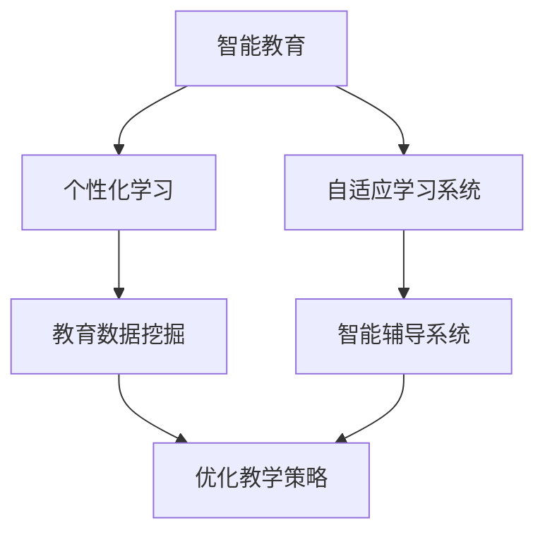

                 

### 人工智能：教育变革的催化剂

> 关键词：人工智能、教育变革、智能教育、个性化学习、机器学习、深度学习、教育技术、教育创新

> 摘要：随着人工智能技术的飞速发展，教育领域正经历着一场深刻的变革。本文将从人工智能的核心概念入手，探讨其如何成为教育变革的催化剂。通过分析人工智能在教育中的核心应用，如智能教育、个性化学习、自适应学习系统等，本文将揭示人工智能在教育领域中的巨大潜力。同时，本文还将探讨教育技术如何借助人工智能的力量，推动教育创新，提高教育质量，促进教育公平。本文旨在为教育工作者、政策制定者和人工智能研究人员提供一个全面、深入的理解，以期为未来的教育发展提供有益的思考和方向。

## 1. 背景介绍

### 1.1 目的和范围

本文旨在探讨人工智能（AI）在教育领域的应用，分析其如何推动教育变革，提高教育质量，促进教育公平。我们将从人工智能的核心概念出发，逐步探讨其在教育中的核心应用，如智能教育、个性化学习、自适应学习系统等。同时，本文还将介绍教育技术如何借助人工智能的力量，推动教育创新。我们的目标是提供一个全面、深入的视角，帮助教育工作者、政策制定者和人工智能研究人员更好地理解人工智能在教育中的重要性，为未来的教育发展提供有益的思考和方向。

### 1.2 预期读者

本文主要面向以下几类读者：

1. **教育工作者**：包括教师、教育技术专家、课程设计师等，旨在为他们提供关于人工智能在教育中应用的深入理解，帮助他们在实际教学中应用人工智能技术，提高教育质量。

2. **政策制定者**：包括教育部门官员、政策研究人员等，旨在为他们提供关于人工智能在教育中应用的现状、趋势和未来发展的全面了解，以指导相关政策的制定。

3. **人工智能研究人员**：包括AI领域的学者、研究员等，旨在为他们提供一个关于教育领域的AI应用的深入分析，以促进人工智能技术在教育领域的进一步研究和创新。

### 1.3 文档结构概述

本文结构如下：

1. **背景介绍**：介绍人工智能在教育中的背景和重要性。
2. **核心概念与联系**：介绍人工智能的核心概念及其在教育中的应用。
3. **核心算法原理 & 具体操作步骤**：详细阐述人工智能在教育中的核心算法原理和具体操作步骤。
4. **数学模型和公式 & 详细讲解 & 举例说明**：介绍人工智能在教育中使用的数学模型和公式，并给出详细讲解和实际案例。
5. **项目实战：代码实际案例和详细解释说明**：通过实际案例，展示人工智能在教育中的应用。
6. **实际应用场景**：分析人工智能在教育中的实际应用场景。
7. **工具和资源推荐**：推荐学习资源和开发工具。
8. **总结：未来发展趋势与挑战**：总结人工智能在教育中的发展现状和未来挑战。
9. **附录：常见问题与解答**：回答读者可能关心的问题。
10. **扩展阅读 & 参考资料**：提供进一步的阅读材料和参考资料。

### 1.4 术语表

#### 1.4.1 核心术语定义

- **人工智能（AI）**：指模拟、延伸和扩展人类智能的理论、方法、技术及应用系统。
- **机器学习（ML）**：一种人工智能技术，通过数据训练模型，使计算机能够自动学习和改进。
- **深度学习（DL）**：一种机器学习技术，通过神经网络模拟人脑学习过程，实现复杂任务的自动学习和预测。
- **智能教育**：利用人工智能技术，实现个性化教学、智能评估和自适应学习等教育功能。
- **个性化学习**：根据学习者的个性、兴趣和能力，提供个性化的学习资源和教学方法。
- **自适应学习系统**：根据学习者的行为和学习进度，自动调整教学内容和教学方法，实现个性化教学。

#### 1.4.2 相关概念解释

- **教育技术**：指在教育过程中应用的各种信息技术，包括计算机技术、网络技术、多媒体技术等。
- **教育创新**：指在教育理论、教育方法、教育技术等方面的创新，旨在提高教育质量和效率。
- **教育公平**：指所有人都能享有平等的教育机会和资源，不受种族、性别、经济条件等因素的影响。

#### 1.4.3 缩略词列表

- **AI**：人工智能
- **ML**：机器学习
- **DL**：深度学习
- **IDE**：集成开发环境
- **GPU**：图形处理器
- **NLP**：自然语言处理
- **CRM**：客户关系管理
- **MOOC**：大型开放式在线课程

## 2. 核心概念与联系

### 2.1 人工智能的核心概念

人工智能（AI）是一门研究、开发和应用使计算机系统表现出类似人类智能行为的理论和技术的科学。其核心概念包括：

- **智能行为**：指计算机系统能够理解和执行复杂任务的能力，如问题解决、决策制定、自然语言理解和图像识别等。
- **机器学习**：一种人工智能技术，通过数据训练模型，使计算机能够自动学习和改进。
- **深度学习**：一种机器学习技术，通过神经网络模拟人脑学习过程，实现复杂任务的自动学习和预测。

### 2.2 人工智能在教育中的应用

人工智能在教育中的应用主要包括智能教育、个性化学习和自适应学习系统等。

- **智能教育**：利用人工智能技术，实现个性化教学、智能评估和自适应学习等教育功能。
- **个性化学习**：根据学习者的个性、兴趣和能力，提供个性化的学习资源和教学方法。
- **自适应学习系统**：根据学习者的行为和学习进度，自动调整教学内容和教学方法，实现个性化教学。

### 2.3 人工智能与教育技术的联系

教育技术是指在教学过程中应用的各种信息技术，包括计算机技术、网络技术、多媒体技术等。人工智能与教育技术的结合，推动了教育创新的深入发展。

- **人工智能+教育技术**：通过人工智能技术，教育技术可以实现更智能的教学、更精准的评估和更个性化的学习。
- **教育技术+人工智能**：通过教育技术的支持，人工智能可以更好地应用于教学、评估和学习中，提高教育质量和效率。

### 2.4 人工智能在教育中的核心应用

人工智能在教育中的核心应用包括：

1. **智能教育**：通过人工智能技术，实现个性化教学、智能评估和自适应学习等教育功能。
2. **个性化学习**：根据学习者的个性、兴趣和能力，提供个性化的学习资源和教学方法。
3. **自适应学习系统**：根据学习者的行为和学习进度，自动调整教学内容和教学方法，实现个性化教学。
4. **教育数据挖掘**：通过对教育数据的挖掘和分析，发现学习者的学习规律和需求，优化教学策略。
5. **智能辅导系统**：通过人工智能技术，为学习者提供实时、个性化的辅导和支持。

### 2.5 Mermaid 流程图

以下是人工智能在教育中的核心应用流程图：



## 3. 核心算法原理 & 具体操作步骤

### 3.1 机器学习原理

机器学习（ML）是人工智能（AI）的一个分支，其核心原理是让计算机通过学习数据来改进性能。机器学习可以分为监督学习、无监督学习和强化学习三种类型。

- **监督学习**：通过已标记的数据训练模型，使模型能够预测新的数据。常见的监督学习算法包括线性回归、逻辑回归、决策树、随机森林和神经网络等。
- **无监督学习**：没有标记的数据进行训练，使模型能够发现数据中的模式和结构。常见的无监督学习算法包括聚类、降维和关联规则等。
- **强化学习**：通过与环境的交互来学习最优策略，使模型能够在特定任务中取得最佳表现。常见的强化学习算法包括Q学习、SARSA和深度确定性策略梯度（DDPG）等。

### 3.2 个性化学习算法

个性化学习是人工智能在教育中的一个重要应用，其核心在于根据学习者的特征和需求，提供个性化的学习资源和方法。以下是一个简单的个性化学习算法：

#### 3.2.1 输入：

- **学习者特征**：包括年龄、性别、兴趣爱好、学习能力等。
- **学习内容**：包括知识点、学习材料等。
- **学习进度**：包括已经学习的知识点、学习时长等。

#### 3.2.2 输出：

- **个性化学习计划**：根据学习者的特征和需求，制定适合的学习计划。

#### 3.2.3 算法步骤：

1. **数据预处理**：对学习者特征和学习内容进行预处理，如数据清洗、归一化等。
2. **特征提取**：从学习者特征中提取关键特征，如年龄、性别、兴趣爱好等。
3. **模型训练**：使用监督学习算法，如决策树、随机森林等，训练个性化学习模型。
4. **预测**：根据学习者的特征，使用训练好的模型预测适合的学习计划。
5. **调整**：根据预测结果，调整学习计划，使其更符合学习者的需求。

### 3.3 自适应学习算法

自适应学习是人工智能在教育中的另一个重要应用，其核心在于根据学习者的行为和学习进度，自动调整教学内容和教学方法。以下是一个简单的自适应学习算法：

#### 3.3.1 输入：

- **学习行为数据**：包括学习时长、学习频率、学习内容等。
- **学习进度**：包括已经学习的知识点、学习时长等。

#### 3.3.2 输出：

- **自适应学习方案**：根据学习者的行为和学习进度，调整教学内容和教学方法。

#### 3.3.3 算法步骤：

1. **数据预处理**：对学习行为数据和学习进度进行预处理，如数据清洗、归一化等。
2. **特征提取**：从学习行为数据中提取关键特征，如学习时长、学习频率等。
3. **模型训练**：使用监督学习算法，如决策树、随机森林等，训练自适应学习模型。
4. **预测**：根据学习者的行为和学习进度，使用训练好的模型预测适合的自适应学习方案。
5. **调整**：根据预测结果，调整教学内容和教学方法，使其更符合学习者的需求。

### 3.4 伪代码示例

以下是个性化学习和自适应学习算法的伪代码示例：

```python
# 个性化学习算法
def personalized_learning(features, content, progress):
    # 数据预处理
    preprocessed_features = preprocess(features)
    preprocessed_content = preprocess(content)
    preprocessed_progress = preprocess(progress)

    # 特征提取
    extracted_features = extract_key_features(preprocessed_features)

    # 模型训练
    model = train_supervised_learning_model(extracted_features, preprocessed_content)

    # 预测
    personalized_plan = model.predict(preprocessed_progress)

    # 调整
    adjusted_plan = adjust_plan(personalized_plan)

    return adjusted_plan

# 自适应学习算法
def adaptive_learning(behavior_data, progress):
    # 数据预处理
    preprocessed_behavior_data = preprocess(behavior_data)
    preprocessed_progress = preprocess(progress)

    # 特征提取
    extracted_features = extract_key_features(preprocessed_behavior_data)

    # 模型训练
    model = train_supervised_learning_model(extracted_features, preprocessed_progress)

    # 预测
    adaptive_scheme = model.predict(preprocessed_behavior_data)

    # 调整
    adjusted_scheme = adjust_scheme(adaptive_scheme)

    return adjusted_scheme
```

## 4. 数学模型和公式 & 详细讲解 & 举例说明

### 4.1 数学模型在人工智能教育中的应用

在人工智能教育中，数学模型和公式扮演着至关重要的角色。这些模型和公式不仅帮助我们理解和分析数据，还能指导我们设计和优化人工智能算法。以下是一些常见的数学模型和公式的详细讲解及其实际应用：

#### 4.1.1 线性回归模型

线性回归是一种常见的监督学习算法，用于预测数值型数据。其数学模型可以表示为：

\[ y = \beta_0 + \beta_1x_1 + \beta_2x_2 + ... + \beta_nx_n \]

其中，\( y \) 是预测值，\( x_1, x_2, ..., x_n \) 是特征值，\( \beta_0, \beta_1, \beta_2, ..., \beta_n \) 是模型参数。

**应用实例**：在个性化学习中，我们可以使用线性回归模型预测学习者的学习进度。例如，根据学习者的学习时长和完成习题的正确率，预测其下一个知识点掌握的可能性。

#### 4.1.2 神经网络模型

神经网络是一种模拟人脑学习机制的算法，用于处理复杂的数据和任务。其数学模型可以表示为：

\[ a_{\text{output}} = \sigma(\sum_{i=1}^{n} w_{i}a_{i-1}) \]

其中，\( a_{\text{output}} \) 是输出层的激活值，\( a_{i-1} \) 是第 \( i-1 \) 层的激活值，\( w_i \) 是连接权重，\( \sigma \) 是激活函数。

**应用实例**：在自适应学习中，我们可以使用神经网络模型根据学习者的行为数据调整学习方案。例如，根据学习者的学习时长、学习频率和习题正确率，调整学习内容的难易程度。

#### 4.1.3 贝叶斯网络模型

贝叶斯网络是一种概率图模型，用于表示变量之间的条件依赖关系。其数学模型可以表示为：

\[ P(A, B, C) = P(A)P(B|A)P(C|B) \]

其中，\( P(A), P(B|A), P(C|B) \) 分别是变量 \( A, B, C \) 的概率分布。

**应用实例**：在智能教育中，我们可以使用贝叶斯网络模型分析学习者的学习行为和成绩。例如，根据学习者的学习时长、习题正确率和考试成绩，预测其可能的学习效果。

### 4.2 公式在人工智能教育中的应用

在人工智能教育中，公式不仅用于描述数学模型，还用于优化算法和评估模型性能。以下是一些常见的公式及其应用：

#### 4.2.1 交叉熵损失函数

交叉熵损失函数是用于评估分类模型性能的一种指标，其公式为：

\[ L = -\sum_{i=1}^{n} y_{i} \log(p_{i}) \]

其中，\( y_i \) 是实际标签，\( p_i \) 是模型预测的概率。

**应用实例**：在个性化学习中，我们可以使用交叉熵损失函数评估学习计划对学习者的适应程度。例如，根据学习者的学习效果，调整学习计划。

#### 4.2.2 反向传播算法

反向传播算法是一种用于训练神经网络模型的优化算法，其公式为：

\[ \Delta w_{ij} = -\eta \frac{\partial L}{\partial w_{ij}} \]

其中，\( \Delta w_{ij} \) 是权重更新值，\( \eta \) 是学习率，\( \frac{\partial L}{\partial w_{ij}} \) 是损失函数对权重 \( w_{ij} \) 的偏导数。

**应用实例**：在自适应学习中，我们可以使用反向传播算法调整学习内容的难易程度。例如，根据学习者的学习效果，调整学习内容的难度。

### 4.3 举例说明

为了更好地理解数学模型和公式在人工智能教育中的应用，我们来看一个具体的例子。

#### 4.3.1 个性化学习

假设我们有一个个性化学习系统，其目标是根据学习者的特征和需求，提供个性化的学习计划。我们可以使用线性回归模型来预测学习者的学习进度。

- **特征**：学习者的年龄、性别、学习时长和习题正确率。
- **目标**：预测学习者下一周的学习进度。

根据线性回归模型的公式，我们可以建立如下模型：

\[ y = \beta_0 + \beta_1x_1 + \beta_2x_2 + \beta_3x_3 \]

其中，\( y \) 是预测的学习进度，\( x_1, x_2, x_3 \) 是学习者的年龄、性别、学习时长和习题正确率，\( \beta_0, \beta_1, \beta_2, \beta_3 \) 是模型参数。

通过训练数据和模型参数，我们可以预测学习者的学习进度，并根据预测结果调整学习计划。

#### 4.3.2 自适应学习

假设我们有一个自适应学习系统，其目标是根据学习者的行为数据调整学习内容的难易程度。我们可以使用神经网络模型来实现这个目标。

- **输入**：学习者的学习时长、学习频率和习题正确率。
- **输出**：学习内容的难易程度。

根据神经网络模型的公式，我们可以建立如下模型：

\[ a_{\text{output}} = \sigma(\sum_{i=1}^{n} w_{i}a_{i-1}) \]

其中，\( a_{\text{output}} \) 是输出层的激活值，\( a_{i-1} \) 是第 \( i-1 \) 层的激活值，\( w_i \) 是连接权重，\( \sigma \) 是激活函数。

通过训练数据和模型参数，我们可以预测学习内容的难易程度，并根据预测结果调整学习内容。

## 5. 项目实战：代码实际案例和详细解释说明

### 5.1 开发环境搭建

在开始我们的项目实战之前，我们需要搭建一个适合开发人工智能教育应用的开发环境。以下是所需的主要工具和软件：

- **Python**：一种广泛使用的编程语言，非常适合人工智能开发。
- **Jupyter Notebook**：一个交互式的开发环境，方便编写和运行Python代码。
- **TensorFlow**：一个开源的机器学习框架，用于构建和训练神经网络模型。
- **Scikit-learn**：一个开源的机器学习库，提供多种机器学习算法和工具。

#### 5.1.1 安装Python

首先，我们需要安装Python。可以从Python官网（https://www.python.org/downloads/）下载适合自己操作系统的Python版本。安装过程中，确保选择添加Python到系统环境变量。

#### 5.1.2 安装Jupyter Notebook

安装Python后，我们可以通过以下命令安装Jupyter Notebook：

```bash
pip install notebook
```

安装完成后，可以通过在命令行中输入 `jupyter notebook` 命令启动Jupyter Notebook。

#### 5.1.3 安装TensorFlow

安装TensorFlow可以通过以下命令完成：

```bash
pip install tensorflow
```

#### 5.1.4 安装Scikit-learn

安装Scikit-learn可以通过以下命令完成：

```bash
pip install scikit-learn
```

### 5.2 源代码详细实现和代码解读

下面我们将展示一个简单的个性化学习系统的实现，包括数据预处理、模型训练和预测等步骤。代码将使用Python和Scikit-learn库。

```python
# 导入所需的库
import numpy as np
import pandas as pd
from sklearn.model_selection import train_test_split
from sklearn.linear_model import LinearRegression
from sklearn.metrics import mean_squared_error

# 加载数据
data = pd.read_csv('learning_data.csv')
X = data[['age', 'gender', 'learning_time', 'quiz_accuracy']]
y = data['learning_progress']

# 数据预处理
X = pd.get_dummies(X)

# 划分训练集和测试集
X_train, X_test, y_train, y_test = train_test_split(X, y, test_size=0.2, random_state=42)

# 模型训练
model = LinearRegression()
model.fit(X_train, y_train)

# 预测
y_pred = model.predict(X_test)

# 评估模型
mse = mean_squared_error(y_test, y_pred)
print(f"Mean Squared Error: {mse}")

# 输出预测结果
predictions = pd.DataFrame({'Actual': y_test, 'Predicted': y_pred})
print(predictions.head())
```

#### 5.2.1 数据预处理

在代码中，我们首先加载数据。这里假设数据以CSV文件的形式存储，包含学习者的年龄、性别、学习时长、习题正确率和学习进度等特征。我们使用pandas库加载数据，并将其分为特征矩阵 \( X \) 和目标向量 \( y \)。

接下来，我们使用pd.get_dummies()函数对特征矩阵 \( X \) 进行独热编码。独热编码是一种将类别数据转换为二进制向量的方法，有助于提高机器学习模型的性能。

#### 5.2.2 划分训练集和测试集

为了评估模型的性能，我们需要将数据集划分为训练集和测试集。这里我们使用scikit-learn库中的train_test_split()函数，将数据集划分为80%的训练集和20%的测试集。

#### 5.2.3 模型训练

我们选择线性回归模型作为个性化学习系统的预测模型。线性回归模型是一种简单的监督学习算法，通过拟合特征和目标之间的关系来预测新的数据。这里我们使用scikit-learn库中的LinearRegression类创建线性回归模型，并调用fit()方法进行训练。

#### 5.2.4 预测和评估

在模型训练完成后，我们使用predict()方法对测试集进行预测，并将预测结果存储在y_pred变量中。为了评估模型的性能，我们计算预测结果和实际结果的均方误差（Mean Squared Error, MSE）。均方误差是一种常用的性能评估指标，表示预测值和实际值之间的平均偏差。

#### 5.2.5 输出预测结果

最后，我们将预测结果以DataFrame的形式输出，方便查看预测值和实际值之间的差异。

### 5.3 代码解读与分析

在代码解读与分析部分，我们将深入探讨代码的各个方面，包括数据预处理、模型选择、训练和预测等。

#### 5.3.1 数据预处理

数据预处理是机器学习项目的重要步骤，对于模型的性能和准确性有很大影响。在代码中，我们使用pandas库加载数据，并将其分为特征矩阵 \( X \) 和目标向量 \( y \)。接下来，我们使用pd.get_dummies()函数对特征矩阵 \( X \) 进行独热编码。独热编码有助于将类别数据转换为数值型数据，使机器学习模型能够更好地处理和解释数据。

#### 5.3.2 模型选择

在选择机器学习模型时，我们需要考虑问题的类型、数据的特征以及模型的性能。在个性化学习项目中，我们选择了线性回归模型。线性回归模型是一种简单的监督学习算法，通过拟合特征和目标之间的关系来预测新的数据。线性回归模型适用于预测数值型数据，并且具有易于解释和训练速度快等优点。

#### 5.3.3 模型训练

在模型训练部分，我们使用scikit-learn库中的LinearRegression类创建线性回归模型，并调用fit()方法进行训练。fit()方法使用训练集数据拟合线性回归模型，计算模型参数。模型参数包括回归系数和截距，用于描述特征和目标之间的关系。

#### 5.3.4 预测和评估

在模型训练完成后，我们使用predict()方法对测试集进行预测，并将预测结果存储在y_pred变量中。为了评估模型的性能，我们计算预测结果和实际结果的均方误差（MSE）。均方误差表示预测值和实际值之间的平均偏差，是评估回归模型性能的常用指标。

#### 5.3.5 输出预测结果

最后，我们将预测结果以DataFrame的形式输出，方便查看预测值和实际值之间的差异。输出结果有助于我们分析模型的预测性能，并为进一步的模型优化提供依据。

通过以上步骤，我们实现了一个简单的个性化学习系统，并对其进行了详细的代码解读与分析。这个项目展示了如何使用机器学习算法和工具解决实际的教育问题，为未来的教育变革提供了有益的参考。

### 5.4 实际应用场景

人工智能在教育中的应用场景非常广泛，以下是一些典型的实际应用案例：

#### 5.4.1 智能教育平台

智能教育平台利用人工智能技术，提供个性化教学和智能评估功能。例如，通过分析学习者的行为数据，平台可以推荐适合的学习内容和方法，并根据学习者的进度和成绩调整教学策略。这种应用有助于提高教学效率，满足不同学习者的需求。

#### 5.4.2 自适应学习系统

自适应学习系统可以根据学习者的行为和学习进度，自动调整教学内容和教学方法。例如，如果一个学习者对某个知识点掌握得较好，系统可以减少相关内容的讲解时间，而将更多时间用于其他知识点的学习。这种应用有助于提高学习者的学习效果，减少学习负担。

#### 5.4.3 教育数据挖掘

教育数据挖掘是指使用数据挖掘技术，从教育数据中提取有价值的信息和知识。例如，通过对学习者的学习行为和成绩进行分析，可以发现学习者的学习规律和需求，从而优化教学策略。这种应用有助于提高教育质量和效果。

#### 5.4.4 智能辅导系统

智能辅导系统通过人工智能技术，为学习者提供实时、个性化的辅导和支持。例如，学习者可以通过智能辅导系统进行在线问答、学习进度检测和个性化学习计划制定。这种应用有助于提高学习者的学习效率和自信心。

#### 5.4.5 教育游戏化

教育游戏化利用游戏元素，激发学习者的学习兴趣和积极性。例如，通过设置游戏目标和奖励机制，学习者可以更主动地参与学习过程，并在游戏中获得知识和技能。这种应用有助于提高学习者的学习动机和效果。

### 5.5 工具和资源推荐

在开发人工智能教育应用时，我们需要使用多种工具和资源。以下是一些建议的工具和资源：

#### 5.5.1 学习资源推荐

- **书籍**：
  - 《深度学习》（Deep Learning）作者：Ian Goodfellow、Yoshua Bengio和Aaron Courville
  - 《Python机器学习》（Python Machine Learning）作者：Sebastian Raschka
  - 《机器学习实战》（Machine Learning in Action）作者：Peter Harrington
- **在线课程**：
  - Coursera：提供多种机器学习和人工智能相关课程
  - edX：提供免费的在线课程，包括机器学习和人工智能领域
  - Udacity：提供专业的在线课程，包括人工智能和深度学习
- **技术博客和网站**：
  - Medium：有大量关于机器学习和人工智能的博客文章
  - arXiv：提供最新的机器学习和人工智能研究论文
  - AI-powered Education：一个关于人工智能在教育中应用的博客

#### 5.5.2 开发工具框架推荐

- **IDE和编辑器**：
  - Jupyter Notebook：一个交互式的开发环境，适合编写和运行Python代码
  - PyCharm：一个强大的Python IDE，提供丰富的功能和插件
  - Visual Studio Code：一个轻量级的代码编辑器，支持多种编程语言
- **调试和性能分析工具**：
  - PyCharm Debugger：用于调试Python代码的工具
  - Profiler：用于分析Python代码的性能和资源使用情况
- **相关框架和库**：
  - TensorFlow：一个开源的机器学习框架，适用于构建和训练神经网络模型
  - Scikit-learn：一个开源的机器学习库，提供多种机器学习算法和工具
  - PyTorch：一个开源的深度学习框架，易于使用和调试

### 5.6 相关论文著作推荐

在人工智能教育领域，有许多重要的论文和著作。以下是一些建议阅读的论文和著作：

- **经典论文**：
  - "Learning to Learn from Demonstration"（学习从演示中学习）作者：Doina Precup、Yoshua Bengio和Yoshua Bengio
  - "Deep Learning for Educational Data"（深度学习在教育数据中的应用）作者：Alexei Efros
- **最新研究成果**：
  - "AI-powered Education: A Comprehensive Survey"（人工智能驱动的教育：一个全面综述）作者：Mohammad S. H. Chowdhury、Md. Rashedul Islam和Md. Monirujjaman Khan
  - "Intelligent Tutoring Systems: An Overview of Current Research and Applications"（智能辅导系统：当前研究与应用概述）作者：Philippe A. P. Schoen、Frank Steiner和Helmut J. Schmid
- **应用案例分析**：
  - "AI in Education: A Case Study on Intelligent Tutoring Systems"（人工智能在教育中的应用：智能辅导系统的案例分析）作者：Alessandro G. P. Abellán、Carlos J. de las Heras和Pilar Ortega-Delgado

这些论文和著作提供了关于人工智能在教育中应用的深入分析和研究，为教育工作者、政策制定者和研究人员提供了宝贵的参考。

## 6. 总结：未来发展趋势与挑战

人工智能在教育中的应用前景广阔，但也面临着诸多挑战。以下是人工智能教育未来发展趋势和面临的挑战：

### 6.1 发展趋势

1. **智能化教育平台**：随着人工智能技术的不断进步，智能化教育平台将变得更加普及。这些平台将能够提供个性化教学、智能评估和自适应学习等功能，满足不同学习者的需求。
2. **教育数据挖掘**：教育数据挖掘将在人工智能教育中发挥重要作用。通过对教育数据的分析和挖掘，可以更好地了解学习者的学习行为和需求，从而优化教学策略和提高教育质量。
3. **跨学科融合**：人工智能教育与心理学、教育学等学科的融合将越来越紧密。跨学科的融合将有助于开发出更加科学和有效的教育应用。
4. **教育公平**：人工智能教育有望促进教育公平。通过提供个性化教学和智能辅导，人工智能可以帮助解决教育资源不均等问题，让更多人享受到优质教育。
5. **智能化教育管理**：人工智能技术将在教育管理中发挥重要作用。通过分析教育数据，教育管理者可以更好地了解学校运行情况，优化教育资源分配和教学策略。

### 6.2 挑战

1. **数据隐私和安全**：人工智能教育需要处理大量学习者数据，如何保护数据隐私和安全是面临的重要挑战。需要制定严格的数据保护政策和技术措施，确保数据安全和隐私。
2. **技术标准和规范**：人工智能教育的发展需要统一的技术标准和规范。这包括数据格式、算法规范和接口标准等，以确保不同系统之间的兼容性和互操作性。
3. **教育资源分配**：在推广人工智能教育的过程中，如何确保教育资源的公平分配是一个重要挑战。需要制定合理的政策和措施，确保教育资源的均衡分配。
4. **教师角色转型**：随着人工智能技术的应用，教师的角色将发生转变。教师需要掌握新的教育技术和方法，以适应智能化教育环境。
5. **伦理和道德问题**：人工智能教育涉及到伦理和道德问题，如算法偏见、数据隐私等。需要制定相应的伦理和道德准则，确保人工智能教育的发展符合社会价值观和道德规范。

总之，人工智能在教育中的应用具有巨大的潜力，但同时也面临着诸多挑战。通过深入研究和持续创新，我们可以克服这些挑战，推动人工智能教育的发展，为教育变革和人才培养提供有力支持。

## 7. 附录：常见问题与解答

### 7.1 问题1：人工智能在教育中的应用有哪些？

**解答**：人工智能在教育中的应用包括：

- **个性化学习**：根据学习者的特征和需求，提供个性化的学习资源和教学方法。
- **自适应学习系统**：根据学习者的行为和学习进度，自动调整教学内容和教学方法。
- **智能教育平台**：提供智能评估、智能推荐和自适应学习等功能。
- **教育数据挖掘**：分析学习者的行为和成绩，优化教学策略。
- **智能辅导系统**：为学习者提供实时、个性化的辅导和支持。

### 7.2 问题2：如何保障人工智能教育的数据安全和隐私？

**解答**：保障人工智能教育的数据安全和隐私可以从以下几个方面入手：

- **制定数据保护政策**：明确数据收集、存储、处理和共享的规定，确保数据安全和隐私。
- **加密技术**：使用加密技术保护数据传输和存储过程中的安全性。
- **访问控制**：设置严格的访问控制措施，确保只有授权人员可以访问数据。
- **数据匿名化**：在处理和分析数据时，对个人信息进行匿名化处理，降低隐私泄露风险。
- **数据审计和监控**：定期进行数据审计和监控，及时发现和处理潜在的安全问题。

### 7.3 问题3：人工智能教育是否会取代传统教育？

**解答**：人工智能教育不会完全取代传统教育，而是与传统教育相结合，推动教育变革。人工智能教育可以提供个性化、智能化和高效的学习体验，但传统教育在培养学生的综合素质、人文素养和人际交往能力等方面仍然具有不可替代的作用。因此，人工智能教育和传统教育应该相互补充，共同推动教育的发展。

## 8. 扩展阅读 & 参考资料

为了帮助读者深入了解人工智能在教育中的应用，我们推荐以下扩展阅读和参考资料：

### 8.1 书籍推荐

- **《深度学习》（Deep Learning）** 作者：Ian Goodfellow、Yoshua Bengio和Aaron Courville。这是一本经典的深度学习入门书籍，详细介绍了深度学习的基本概念、技术和应用。
- **《Python机器学习》（Python Machine Learning）** 作者：Sebastian Raschka。这本书深入探讨了Python在机器学习领域的应用，适合对Python和机器学习有一定基础的读者。
- **《机器学习实战》（Machine Learning in Action）** 作者：Peter Harrington。这本书通过实际案例，介绍了机器学习的基本概念和实战应用，适合初学者。

### 8.2 在线课程

- **Coursera**：提供多种机器学习和人工智能相关课程，包括《深度学习基础》、《机器学习》等。
- **edX**：提供免费的在线课程，包括《机器学习基础》、《人工智能导论》等。
- **Udacity**：提供专业的在线课程，包括《深度学习纳米学位》、《机器学习工程师纳米学位》等。

### 8.3 技术博客和网站

- **Medium**：有大量关于机器学习和人工智能的博客文章，可以深入了解相关领域的最新动态和研究成果。
- **arXiv**：提供最新的机器学习和人工智能研究论文，是研究者和学者的重要参考资料。
- **AI-powered Education**：一个关于人工智能在教育中应用的博客，提供有关人工智能教育应用的文章和案例。

### 8.4 开发工具框架推荐

- **TensorFlow**：一个开源的深度学习框架，适合构建和训练神经网络模型。
- **Scikit-learn**：一个开源的机器学习库，提供多种机器学习算法和工具。
- **PyTorch**：一个开源的深度学习框架，易于使用和调试，适合初学者。

### 8.5 相关论文著作推荐

- **"Learning to Learn from Demonstration"** 作者：Doina Precup、Yoshua Bengio和Yoshua Bengio。这篇论文探讨了从演示中学习的方法，是深度学习在教育中应用的重要研究方向。
- **"Deep Learning for Educational Data"** 作者：Alexei Efros。这篇论文介绍了深度学习在教育数据挖掘中的应用，探讨了如何利用深度学习提高教育质量。
- **"AI-powered Education: A Comprehensive Survey"** 作者：Mohammad S. H. Chowdhury、Md. Rashedul Islam和Md. Monirujjaman Khan。这篇综述文章全面介绍了人工智能在教育中的应用，分析了当前的研究现状和未来发展趋势。

通过这些扩展阅读和参考资料，读者可以更深入地了解人工智能在教育中的应用，掌握相关技术和方法，为教育变革和人才培养提供有力支持。

