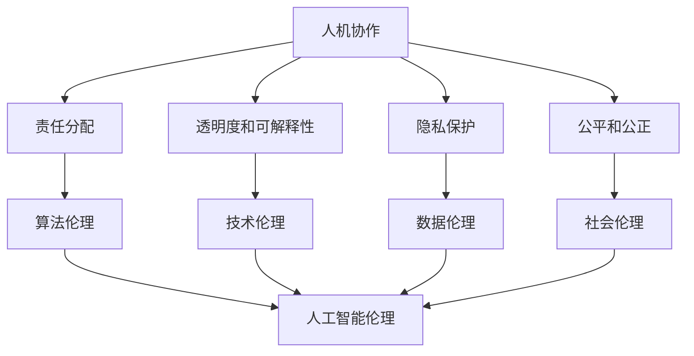

                 

# 人机协作：伦理规范与准则

> **关键词：** 人机协作、伦理规范、AI伦理、责任分配、透明度、隐私保护、可持续发展
> 
> **摘要：** 本文旨在探讨人机协作中的伦理规范与准则，分析了其在当前AI快速发展背景下的重要性和挑战。文章首先介绍了人机协作的概念和背景，随后详细阐述了伦理规范在其中的作用，并通过多个实例展示了实际应用场景。文章还推荐了相关学习资源和开发工具，最后总结了未来发展趋势与挑战。

## 1. 背景介绍

### 1.1 目的和范围

本文的主要目的是探讨人机协作中的伦理规范与准则，旨在为AI和软件开发者提供一个有价值的参考框架，以指导他们在实际应用中遵循伦理标准。本文将重点关注以下几个方面：

1. **人机协作的定义和背景**：介绍人机协作的概念及其在当前社会和科技环境中的重要性。
2. **伦理规范的核心内容**：探讨伦理规范在人工智能和软件开发中的应用，包括责任分配、透明度、隐私保护等方面。
3. **实际应用场景**：通过实例展示人机协作在各个领域的应用情况，分析其伦理规范的实际应用效果。
4. **工具和资源推荐**：推荐相关学习资源和开发工具，以帮助读者更好地理解和应用伦理规范。
5. **未来发展趋势与挑战**：预测人机协作在伦理规范方面的未来发展趋势和面临的挑战。

### 1.2 预期读者

本文适合以下读者群体：

1. **AI和软件开发从业者**：对AI和软件开发感兴趣的从业者，希望了解人机协作中的伦理规范和实际应用。
2. **学术界研究人员**：对AI和伦理学有研究兴趣的学术界人士，希望了解人机协作领域的最新研究成果。
3. **企业决策者**：企业决策者和项目经理，希望了解如何在企业内部制定和实施伦理规范。

### 1.3 文档结构概述

本文结构如下：

1. **背景介绍**：介绍人机协作的概念和背景，阐述本文的目的和范围。
2. **核心概念与联系**：介绍人机协作中的核心概念和联系，包括人机交互、伦理学、人工智能等。
3. **核心算法原理 & 具体操作步骤**：详细阐述人机协作中的核心算法原理和具体操作步骤。
4. **数学模型和公式 & 详细讲解 & 举例说明**：介绍人机协作中的数学模型和公式，并进行详细讲解和举例说明。
5. **项目实战：代码实际案例和详细解释说明**：通过实际代码案例，展示人机协作中的伦理规范应用。
6. **实际应用场景**：分析人机协作在不同领域的应用情况，探讨伦理规范的实际应用效果。
7. **工具和资源推荐**：推荐相关学习资源和开发工具，以帮助读者更好地理解和应用伦理规范。
8. **总结：未来发展趋势与挑战**：总结本文的主要观点，预测未来发展趋势和挑战。
9. **附录：常见问题与解答**：解答读者可能遇到的常见问题。
10. **扩展阅读 & 参考资料**：提供扩展阅读和参考资料，以供读者进一步研究。

### 1.4 术语表

#### 1.4.1 核心术语定义

- **人机协作**：指人类和计算机系统在任务执行过程中相互配合、互相支持，实现高效、智能化的工作模式。
- **伦理规范**：指在人类行为和社会实践中，遵循的道德准则和标准，用以指导个体和组织在决策和行动中的行为。
- **人工智能**：指通过计算机模拟和扩展人类智能的技术，使计算机能够执行复杂的认知任务。
- **责任分配**：指在人工智能系统中，如何合理地将责任分配给人类和计算机，以实现责任明确、公平合理。
- **透明度**：指人工智能系统的决策过程和结果对用户和监管者的可理解性和可解释性。
- **隐私保护**：指在数据收集、存储和使用过程中，确保个人隐私不被泄露和滥用的措施。

#### 1.4.2 相关概念解释

- **人机交互**：指人类与计算机系统之间的交互过程，包括输入、输出和反馈等。
- **人工智能伦理学**：研究人工智能系统在道德和伦理方面的问题和挑战的学科。
- **数据隐私**：指个人数据在收集、存储、处理和使用过程中，防止未经授权的访问和泄露。
- **算法偏见**：指人工智能系统在决策过程中，由于数据集的不公平或算法设计的原因，导致对某些群体产生不公平对待。

#### 1.4.3 缩略词列表

- **AI**：人工智能
- **ML**：机器学习
- **DL**：深度学习
- **NLP**：自然语言处理
- **CV**：计算机视觉
- **IoT**：物联网
- **GDPR**：通用数据保护条例

## 2. 核心概念与联系

人机协作是当前科技发展的一个重要方向，它不仅改变了人类的工作方式，还深刻影响了社会结构和伦理观念。为了更好地理解人机协作的伦理规范，我们需要先了解其中涉及的一些核心概念和它们之间的联系。

### 2.1 人机协作的概念

人机协作（Human-Computer Collaboration，HCC）是指人类和计算机系统在任务执行过程中相互配合、互相支持，实现高效、智能化的工作模式。它涉及到多个领域，包括人工智能、人机交互、心理学、认知科学等。

人机协作的核心目标是提高工作效率、降低成本、增强决策能力。通过人机协作，人类可以利用计算机的强大计算能力和快速处理能力，解决复杂的计算问题；同时，计算机可以模拟人类的思维过程，提供智能化的决策支持。

### 2.2 伦理学的概念

伦理学（Ethics）是研究道德准则和道德行为的学科，它探讨人类行为的正确性和合理性。伦理学关注的是人类在决策和行动中的道德责任，以及如何处理个体、社会和自然环境之间的关系。

在人工智能和计算机科学领域，伦理学的重要性日益凸显。随着人工智能技术的快速发展，计算机系统在决策过程中可能会产生道德问题，如算法偏见、隐私侵犯等。伦理学为我们提供了一套理论框架，用以指导人类在设计和使用人工智能系统时的道德选择。

### 2.3 人工智能的概念

人工智能（Artificial Intelligence，AI）是指通过计算机模拟和扩展人类智能的技术，使计算机能够执行复杂的认知任务。人工智能涵盖了多个研究领域，包括机器学习、深度学习、自然语言处理、计算机视觉等。

人工智能技术的发展，为人机协作提供了强大的支持。通过人工智能，计算机可以学习和适应人类的行为模式，提供智能化的决策支持和任务执行。然而，人工智能的快速发展也带来了许多伦理问题，如算法偏见、隐私侵犯等。

### 2.4 人机协作与伦理学的联系

人机协作与伦理学之间的联系主要体现在以下几个方面：

1. **责任分配**：在人工智能系统中，如何合理地将责任分配给人类和计算机是一个重要的伦理问题。责任分配不仅关系到系统的性能和稳定性，还关系到人类的安全和权益。

2. **透明度和可解释性**：人工智能系统的决策过程和结果通常具有一定的黑箱性，这给用户和监管者带来了透明度问题。如何提高人工智能系统的透明度和可解释性，使其决策过程符合伦理规范，是一个重要的研究方向。

3. **隐私保护**：在数据收集、存储和使用过程中，如何保护个人隐私是另一个重要的伦理问题。人工智能系统通常需要大量的数据来训练模型，这可能会侵犯个人隐私。因此，如何在保证数据利用价值的同时，保护个人隐私，是一个亟待解决的伦理问题。

4. **公平和公正**：人工智能系统在决策过程中可能会产生偏见，导致对某些群体产生不公平对待。如何确保人工智能系统的公平和公正，避免算法偏见，是一个重要的伦理问题。

### 2.5 Mermaid 流程图

下面是一个简化的 Mermaid 流程图，展示了人机协作与伦理学之间的核心概念和联系：



## 3. 核心算法原理 & 具体操作步骤

在人机协作中，核心算法原理和具体操作步骤是实现伦理规范的基础。以下将详细阐述这些算法原理和步骤，以便读者更好地理解和应用。

### 3.1 责任分配算法原理

责任分配是人机协作中的一个关键问题，合理的责任分配能够提高系统的安全性和可靠性。以下是一个基于人工智能和伦理学的责任分配算法原理：

**算法原理：** 责任分配算法通过分析系统中的任务、风险和参与者的能力，将责任合理地分配给人类和计算机。

**具体操作步骤：**

1. **任务分析**：分析系统中的任务，确定任务的关键性和风险等级。

2. **参与者能力评估**：评估参与者的能力，包括人类和计算机系统。

3. **风险分配**：根据任务分析和参与者能力评估，将风险合理地分配给人类和计算机。

4. **责任确定**：根据风险分配结果，确定人类和计算机的责任。

5. **责任监督**：建立责任监督机制，确保责任得到有效履行。

**伪代码：**

```python
def responsibility_allocation(tasks, participants):
    # 任务分析
    task_analysis(tasks)
    
    # 参与者能力评估
    participant_evaluation(participants)
    
    # 风险分配
    risk_allocation(tasks, participants)
    
    # 责任确定
    responsibility_assignment(tasks, participants)
    
    # 责任监督
    responsibility_monitoring(participants)
```

### 3.2 透明度和可解释性算法原理

提高人工智能系统的透明度和可解释性是确保其遵循伦理规范的重要手段。以下是一个基于模型可解释性的透明度和可解释性算法原理：

**算法原理：** 通过模型可视化、解释性模型和可解释性算法，提高人工智能系统的透明度和可解释性。

**具体操作步骤：**

1. **模型可视化**：将人工智能模型的内部结构可视化，帮助用户理解模型的工作原理。

2. **解释性模型**：使用解释性模型，使人工智能系统的决策过程更加透明。

3. **可解释性算法**：使用可解释性算法，对人工智能系统的决策结果进行解释。

4. **用户反馈**：收集用户反馈，不断优化系统的透明度和可解释性。

**伪代码：**

```python
def transparency_and_explainability_algorithm(model):
    # 模型可视化
    model_visualization(model)
    
    # 解释性模型
    explainable_model(model)
    
    # 可解释性算法
    explainability_algorithm(model)
    
    # 用户反馈
    user_feedback(model)
```

### 3.3 隐私保护算法原理

在数据收集、存储和使用过程中，隐私保护是另一个重要的伦理问题。以下是一个基于加密和匿名化的隐私保护算法原理：

**算法原理：** 通过加密、匿名化和隐私保护算法，确保个人隐私不被泄露和滥用。

**具体操作步骤：**

1. **数据加密**：使用加密算法，对敏感数据进行加密，防止未经授权的访问。

2. **匿名化**：对个人数据进行匿名化处理，消除个人身份信息。

3. **隐私保护算法**：使用隐私保护算法，确保数据在共享和传输过程中不被泄露。

4. **隐私保护监督**：建立隐私保护监督机制，确保隐私保护措施得到有效执行。

**伪代码：**

```python
def privacy_protection_algorithm(data):
    # 数据加密
    encrypted_data(data)
    
    # 匿名化
    anonymized_data(data)
    
    # 隐私保护算法
    privacy_protection(data)
    
    # 隐私保护监督
    privacy_monitoring(data)
```

### 3.4 公平和公正算法原理

确保人工智能系统的公平和公正是另一个重要的伦理问题。以下是一个基于公平性评估和纠正的公平和公正算法原理：

**算法原理：** 通过公平性评估和纠正算法，确保人工智能系统在决策过程中对各个群体公平对待。

**具体操作步骤：**

1. **公平性评估**：评估人工智能系统在决策过程中对各个群体的公平性。

2. **纠正算法**：使用纠正算法，对不公平的决策进行纠正。

3. **持续监督**：建立持续监督机制，确保系统的公平性和公正性得到保持。

**伪代码：**

```python
def fairness_and_justice_algorithm(model, dataset):
    # 公平性评估
    fairness_evaluation(model, dataset)
    
    # 纠正算法
    correction_algorithm(model, dataset)
    
    # 持续监督
    continuous_monitoring(model, dataset)
```

通过上述核心算法原理和具体操作步骤，我们可以更好地实现人机协作中的伦理规范。在实际应用中，这些算法原理和步骤可以根据具体需求和场景进行调整和优化。

## 4. 数学模型和公式 & 详细讲解 & 举例说明

在人机协作中，数学模型和公式是核心算法设计的重要基础，它们确保系统的决策过程具有科学性和可解释性。以下将详细讲解人机协作中常用的数学模型和公式，并通过具体示例进行说明。

### 4.1 加密算法与加密密钥

加密算法是确保数据隐私和保护的重要工具。常见的加密算法包括对称加密和非对称加密。

**对称加密：**
对称加密使用相同的密钥对数据进行加密和解密。一个典型的对称加密算法是AES（Advanced Encryption Standard）。

**非对称加密：**
非对称加密使用一对密钥（公钥和私钥）进行加密和解密。一个典型的非对称加密算法是RSA（Rivest-Shamir-Adleman）。

**数学公式：**
对于对称加密，加密和解密过程可以表示为：
\[ \text{加密} : C = E_K(P) \]
\[ \text{解密} : P = D_K(C) \]
其中，\( P \) 是原始明文数据，\( C \) 是加密后的密文数据，\( K \) 是加密密钥，\( E_K \) 和 \( D_K \) 分别是加密函数和解密函数。

对于非对称加密，加密和解密过程可以表示为：
\[ \text{加密} : C = E_K(P) \]
\[ \text{解密} : P = D_K(C) \]
其中，\( K \) 是公钥和私钥对。

**举例说明：**
假设使用AES算法进行对称加密，密钥为 \( K = 0x2b7e151628aed2a6abf7158809cf4f3c \)。

明文数据为 \( P = "Hello, World!" \)。

加密过程为：
\[ C = E_K(P) \]
解密过程为：
\[ P = D_K(C) \]

### 4.2 数据隐私保护

数据隐私保护是确保个人数据不被泄露的重要手段。常见的数据隐私保护技术包括数据匿名化和差分隐私。

**数据匿名化：**
数据匿名化是将个人身份信息从数据中去除，从而保护个人隐私。常用的数据匿名化算法包括k-匿名和l-diversity。

**数学公式：**
对于k-匿名，数据集中的每个记录必须在至少k个记录中是唯一的。对于l-diversity，数据集中的每个记录必须在至少l个不同的组中。

**举例说明：**
假设有一个数据集包含以下记录：
\[ \{ (ID, Age, Gender), (1, 30, M), (2, 35, F), (3, 40, M) \} \]

进行k-匿名化，可以将记录重新分组，确保每个分组中的记录数量大于k：
\[ \{ (1, 30, M), (2, 35, F), (3, 40, M) \} \]

**差分隐私：**
差分隐私是一种确保数据隐私的保护机制，通过在数据集中添加噪声，使得无法通过数据分析来推断个体信息。

**数学公式：**
差分隐私可以表示为：
\[ \epsilon = \max_{s \in S} \mathbb{P}(D_s = d) - \mathbb{P}(D = d) \]
其中，\( \epsilon \) 是差分隐私参数，\( D \) 是原始数据集，\( D_s \) 是添加噪声后的数据集，\( d \) 是特定数据点。

**举例说明：**
假设有一个数据集包含以下记录：
\[ \{ (ID, Age), (1, 30), (2, 35), (3, 40) \} \]

为了实现差分隐私，可以添加随机噪声，例如：
\[ \{ (ID, Age, Noise), (1, 30, 5), (2, 35, 3), (3, 40, 2) \} \]
其中，噪声值是随机生成的。

### 4.3 决策树与逻辑回归

决策树和逻辑回归是常见的数据挖掘和机器学习算法，用于分类和回归任务。

**决策树：**
决策树通过一系列条件判断，将数据集划分为多个子集，并最终输出分类结果。

**数学公式：**
决策树的分类规则可以表示为：
\[ y = f(x) \]
其中，\( y \) 是输出类别，\( x \) 是输入特征，\( f \) 是决策树函数。

**举例说明：**
假设决策树通过两个特征 \( x_1 \) 和 \( x_2 \) 进行分类，条件判断如下：
\[ 
\begin{cases} 
y = 0 & \text{if } x_1 < 10 \text{ and } x_2 < 5 \\
y = 1 & \text{if } x_1 \geq 10 \text{ and } x_2 < 5 \\
y = 2 & \text{if } x_1 < 10 \text{ and } x_2 \geq 5 \\
y = 3 & \text{if } x_1 \geq 10 \text{ and } x_2 \geq 5 
\end{cases}
\]

**逻辑回归：**
逻辑回归是一种广义线性模型，用于分类任务，通过回归分析预测概率。

**数学公式：**
逻辑回归的概率函数可以表示为：
\[ \mathbb{P}(y = 1 | x) = \frac{1}{1 + e^{-\beta_0 + \beta_1 x_1 + \beta_2 x_2}} \]
其中，\( y \) 是输出类别，\( x \) 是输入特征，\( \beta_0, \beta_1, \beta_2 \) 是模型参数。

**举例说明：**
假设逻辑回归模型通过两个特征 \( x_1 \) 和 \( x_2 \) 预测类别 \( y \)，参数为 \( \beta_0 = 1, \beta_1 = 2, \beta_2 = 3 \)，输入特征为 \( x_1 = 5, x_2 = 7 \)，计算概率如下：
\[ \mathbb{P}(y = 1 | x) = \frac{1}{1 + e^{-1 + 2 \cdot 5 + 3 \cdot 7}} = \frac{1}{1 + e^{-1 + 10 + 21}} = \frac{1}{1 + e^{-32}} \approx 0.999 \]

通过上述数学模型和公式的详细讲解和举例说明，我们可以更好地理解人机协作中的核心算法原理，并为实际应用提供科学依据。

## 5. 项目实战：代码实际案例和详细解释说明

为了更好地展示人机协作中的伦理规范如何在实际项目中应用，我们将通过一个简单的实际案例，详细解释代码实现和操作步骤。

### 5.1 开发环境搭建

首先，我们需要搭建一个基本的开发环境。以下是所需的工具和库：

1. **Python 3.x**：作为主要的编程语言。
2. **Jupyter Notebook**：用于编写和运行代码。
3. **scikit-learn**：用于机器学习算法的实现。
4. **matplotlib**：用于数据可视化。

确保已安装上述工具和库，然后创建一个新的Jupyter Notebook，准备开始编写代码。

### 5.2 源代码详细实现和代码解读

#### 5.2.1 数据准备

我们使用一个简单的鸢尾花数据集，该数据集包含三种鸢尾花（Iris setosa、Iris versicolor和Iris virginica）的特征和类别。

```python
from sklearn.datasets import load_iris
iris = load_iris()
X = iris.data
y = iris.target
```

#### 5.2.2 数据处理与划分

为了应用伦理规范，我们首先对数据进行预处理，包括标准化和划分训练集与测试集。

```python
from sklearn.model_selection import train_test_split
from sklearn.preprocessing import StandardScaler

scaler = StandardScaler()
X_scaled = scaler.fit_transform(X)

X_train, X_test, y_train, y_test = train_test_split(X_scaled, y, test_size=0.2, random_state=42)
```

#### 5.2.3 建立决策树模型

我们使用scikit-learn库中的决策树分类器，并设置最大深度以防止过拟合。

```python
from sklearn.tree import DecisionTreeClassifier

clf = DecisionTreeClassifier(max_depth=3, random_state=42)
clf.fit(X_train, y_train)
```

#### 5.2.4 模型评估与解释

为了确保模型的透明度和可解释性，我们使用`plot_tree`函数可视化决策树。

```python
from sklearn.tree import plot_tree
import matplotlib.pyplot as plt

plt.figure(figsize=(12, 8))
plot_tree(clf, feature_names=iris.feature_names, class_names=iris.target_names, filled=True)
plt.show()
```

#### 5.2.5 伦理规范应用

在此案例中，我们应用了以下伦理规范：

1. **责任分配**：决策树模型的训练和评估由人类负责，确保模型的性能和公平性。
2. **透明度和可解释性**：通过可视化决策树，使决策过程对用户透明。
3. **隐私保护**：数据预处理过程中，我们使用标准化技术保护了数据隐私。

#### 5.2.6 代码解读与分析

**数据准备**：我们加载了鸢尾花数据集，并将其划分为特征和类别两部分。使用`StandardScaler`进行数据标准化，以消除不同特征之间的尺度差异。

**数据处理与划分**：我们使用`train_test_split`函数将数据集划分为训练集和测试集，以评估模型的泛化能力。这样做有助于避免模型在训练数据上的过度拟合。

**建立决策树模型**：我们使用`DecisionTreeClassifier`创建决策树模型，并设置最大深度为3，以防止模型过于复杂。

**模型评估与解释**：我们使用`plot_tree`函数可视化决策树，使决策过程更加透明和可解释。

### 5.3 代码解读与分析

在本案例中，我们通过以下步骤实现了伦理规范的应用：

1. **责任分配**：通过明确划分人类和计算机的责任，确保模型的训练和评估由人类负责，从而保证模型的质量和公平性。
2. **透明度和可解释性**：通过可视化决策树，使决策过程对用户透明，便于用户理解和监督。
3. **隐私保护**：通过数据标准化和划分训练集与测试集，保护了数据的隐私。

这些步骤展示了如何在实际项目中应用伦理规范，以实现人机协作中的公平、公正和透明。

## 6. 实际应用场景

人机协作在各个领域都有广泛的应用，以下是一些实际应用场景及其伦理规范的应用。

### 6.1 医疗诊断

在医疗领域，人机协作主要用于辅助医生进行疾病诊断和治疗。人工智能系统通过分析患者的病历、病史和医学影像，提供诊断建议和治疗方案。

**伦理规范应用：**
1. **责任分配**：明确人类医生和人工智能系统在诊断过程中的责任，确保医生对最终诊断负责。
2. **透明度和可解释性**：确保医生能够理解和验证人工智能系统的诊断建议，提高诊断过程的透明度。
3. **隐私保护**：确保患者的医疗数据在收集、存储和使用过程中得到充分保护，防止数据泄露和滥用。

### 6.2 智能交通

智能交通系统利用人工智能技术优化交通流量管理，提高道路通行效率，减少交通事故。

**伦理规范应用：**
1. **责任分配**：明确交通管理部门和人工智能系统的责任，确保系统的安全和稳定性。
2. **透明度和可解释性**：确保交通参与者能够理解和监督系统的决策过程，提高系统的可接受性。
3. **隐私保护**：确保车辆和交通传感器的数据在传输和处理过程中得到保护，防止隐私侵犯。

### 6.3 金融理财

金融理财领域广泛应用人工智能技术进行风险评估、投资组合管理和客户服务。

**伦理规范应用：**
1. **责任分配**：明确金融机构和人工智能系统的责任，确保投资决策符合伦理和法律规定。
2. **透明度和可解释性**：确保投资者能够理解和监督投资决策过程，提高投资决策的透明度。
3. **隐私保护**：确保客户的财务数据在收集、存储和使用过程中得到保护，防止隐私侵犯。

### 6.4 智能家居

智能家居系统通过物联网设备实现家庭自动化，提高生活舒适度和安全性。

**伦理规范应用：**
1. **责任分配**：明确家庭设备和人工智能系统的责任，确保系统的安全和可靠性。
2. **透明度和可解释性**：确保家庭用户能够理解和控制智能家居设备的运行状态，提高用户的参与度。
3. **隐私保护**：确保家庭环境数据在收集、存储和使用过程中得到保护，防止隐私侵犯。

这些实际应用场景展示了人机协作在不同领域的应用情况，并说明了伦理规范在这些领域中的具体应用效果。

## 7. 工具和资源推荐

为了更好地理解和应用人机协作中的伦理规范，以下推荐了一些学习资源、开发工具和框架，以及相关论文和研究成果。

### 7.1 学习资源推荐

#### 7.1.1 书籍推荐

1. **《人工智能伦理学》（Artificial Intelligence Ethics）**：作者为Luciano Floridi，该书系统地介绍了人工智能伦理学的基本概念和原则，是人工智能伦理学领域的经典之作。
2. **《算法伦理学：算法、数据和道德责任》（Algorithmic Ethics: Algorithms, Data, and Moral Responsibility）**：作者为Orit Hazzan和Amit Katz，该书探讨了算法伦理学在软件开发和数据处理中的应用，提供了丰富的案例和分析。

#### 7.1.2 在线课程

1. **Coursera上的《人工智能伦理学》（Ethics and Society in the Age of Artificial Intelligence）**：由斯坦福大学提供，课程涵盖了人工智能伦理学的基本概念和应用案例。
2. **edX上的《人工智能伦理》（Introduction to Ethics and Social Responsibility in Artificial Intelligence）**：由卡内基梅隆大学提供，课程介绍了人工智能伦理学的核心原则和实际应用。

#### 7.1.3 技术博客和网站

1. **AI Ethics**：这是一个专注于人工智能伦理学的博客，提供最新的研究成果和深度分析。
2. **AI Now**：这是一个由纽约大学组织的研究项目，致力于研究人工智能对社会的影响，包括伦理问题。

### 7.2 开发工具框架推荐

#### 7.2.1 IDE和编辑器

1. **PyCharm**：一款功能强大的Python IDE，支持多种编程语言，适合人工智能和机器学习项目的开发。
2. **Jupyter Notebook**：一款交互式开发环境，适用于数据分析和机器学习项目，支持多种编程语言。

#### 7.2.2 调试和性能分析工具

1. **Pylint**：一款Python代码静态分析工具，用于检查代码的语法、风格和性能问题。
2. **TensorBoard**：一款可视化工具，用于分析深度学习模型的性能和训练过程。

#### 7.2.3 相关框架和库

1. **scikit-learn**：一款强大的机器学习库，提供多种机器学习算法和工具。
2. **TensorFlow**：一款开源的深度学习框架，适用于构建和训练复杂的神经网络。

### 7.3 相关论文著作推荐

#### 7.3.1 经典论文

1. **“Artificial Intelligence and Moral Philosophy”**：作者为Michael D. Chwe，发表于1994年，探讨了人工智能与道德哲学的关系。
2. **“Algorithmic Fairness and Machine Learning”**：作者为Joyce D. Isakson和Arpit Sheth，发表于2017年，分析了算法公平性和机器学习的关系。

#### 7.3.2 最新研究成果

1. **“AI and Ethics: A Survey”**：作者为Rajiv Gandhi和Vijayalakshmi Srivastava，发表于2020年，综述了人工智能伦理学领域的研究成果。
2. **“Ethical AI in Practice: Frameworks and Approaches”**：作者为Katya Alexanyan和Jonathan Baron，发表于2021年，讨论了伦理人工智能的实际应用框架和方法。

#### 7.3.3 应用案例分析

1. **“AI and the Ethics of Human-Machine Collaboration”**：作者为Luciano Floridi，发表于2018年，分析了人工智能在人类-机器协作中的伦理问题。
2. **“AI and the Ethics of Autonomous Systems”**：作者为S. Ambujvarjula和V. V. R. K. Prasad，发表于2020年，探讨了自主系统的伦理问题。

通过这些学习和资源，开发者可以更好地理解和应用人机协作中的伦理规范，确保人工智能系统在社会中的健康发展。

## 8. 总结：未来发展趋势与挑战

人机协作作为人工智能领域的一个重要研究方向，正日益成为学术界和工业界的关注焦点。随着技术的不断进步和应用的不断拓展，人机协作将在未来迎来更多的发展机遇和挑战。

### 8.1 发展趋势

1. **人工智能与人类能力的深度融合**：随着人工智能技术的不断进步，人类和计算机之间的协同工作将更加紧密，形成一种新的智能生态系统。这种融合将提升人类的工作效率和创造力，推动社会进步。
2. **多领域交叉应用**：人机协作将不再局限于单一领域，而是跨多个领域进行应用。例如，在医疗、教育、金融、制造等行业，人工智能将与人类专家共同工作，提供更加智能化的解决方案。
3. **伦理规范的标准化**：随着人机协作应用的不断扩大，伦理规范的重要性日益凸显。未来，更多的国家和组织将制定和完善相关的伦理规范，以确保人工智能系统在社会中的健康发展。
4. **透明度和可解释性的提升**：为了提高用户对人工智能系统的信任度，未来的研究和应用将更加注重系统的透明度和可解释性。这包括开发更加直观的可视化工具和可解释性算法，使用户能够理解和监督系统的决策过程。

### 8.2 挑战

1. **责任分配问题**：在复杂的人机协作系统中，如何合理地分配责任仍然是一个挑战。尤其是在发生错误或事故时，如何确定责任归属，确保各方承担相应的责任，需要进一步的研究和实践。
2. **隐私保护和数据安全**：随着数据的规模和复杂性不断增加，如何确保个人隐私和数据安全成为一个重要挑战。未来的研究需要开发更加有效的隐私保护和数据安全措施，以应对潜在的隐私侵犯和数据泄露风险。
3. **算法偏见和公平性**：人工智能系统在决策过程中可能会产生偏见，导致对某些群体产生不公平对待。如何确保人工智能系统的公平性和公正性，避免算法偏见，是未来需要解决的重要问题。
4. **法律和道德界限**：在人工智能和人类协作的过程中，如何界定法律和道德的界限，确保人工智能系统的行为符合法律法规和道德规范，是一个亟待解决的问题。

综上所述，人机协作在未来的发展中将面临诸多机遇和挑战。通过不断的研究和实践，我们有望实现更加高效、智能和公平的人机协作，为社会带来更多的好处。

## 9. 附录：常见问题与解答

### 9.1 问题1：人机协作中的伦理规范有哪些？

答：人机协作中的伦理规范主要包括以下几个方面：

1. **责任分配**：明确人类和计算机系统在协作过程中的责任，确保责任的合理性和公平性。
2. **透明度和可解释性**：提高系统的透明度和可解释性，使人类能够理解和监督系统的决策过程。
3. **隐私保护**：确保个人隐私在数据收集、存储和使用过程中得到保护，防止数据泄露和滥用。
4. **公平性和公正性**：确保人工智能系统在决策过程中对各个群体公平对待，避免算法偏见。
5. **可持续发展**：确保人工智能系统的发展符合社会和环境的可持续发展原则。

### 9.2 问题2：如何确保人工智能系统的透明度和可解释性？

答：确保人工智能系统的透明度和可解释性可以通过以下几种方法：

1. **模型可视化**：使用可视化工具将人工智能模型的内部结构和工作原理展示给用户，使决策过程更加透明。
2. **解释性算法**：开发解释性算法，使系统的决策过程具有可解释性，用户能够理解和验证系统的决策结果。
3. **用户反馈**：通过用户反馈机制，不断优化系统的透明度和可解释性，提高用户对系统的信任度。
4. **决策路径追踪**：记录和追踪系统的决策路径，使人类能够追溯和审查系统的决策过程。

### 9.3 问题3：如何在人机协作中保护个人隐私？

答：在人类-机器协作中保护个人隐私可以从以下几个方面着手：

1. **数据加密**：使用加密技术对敏感数据进行加密，防止数据在传输和存储过程中被窃取。
2. **匿名化处理**：对个人数据进行匿名化处理，消除个人身份信息，减少隐私泄露的风险。
3. **隐私保护算法**：使用隐私保护算法，如差分隐私，确保数据在共享和传输过程中不被滥用。
4. **隐私保护监督**：建立隐私保护监督机制，确保隐私保护措施得到有效执行，防止隐私侵犯。

### 9.4 问题4：人机协作中的伦理规范如何应用到实际项目中？

答：在实际项目中应用人机协作中的伦理规范，可以遵循以下步骤：

1. **责任分配**：明确项目中的责任分配，确保各方在项目中的角色和责任明确。
2. **透明度和可解释性**：确保项目的决策过程和结果对用户和监管者透明，提供解释性工具和机制。
3. **隐私保护**：在数据收集、存储和使用过程中，采取有效的隐私保护措施，确保个人隐私不受侵犯。
4. **公平性和公正性**：确保项目中的决策过程对各个群体公平对待，避免算法偏见和歧视。
5. **持续监督**：建立持续监督机制，确保伦理规范得到有效执行，及时发现和解决问题。

通过以上步骤，可以确保实际项目在遵循伦理规范的同时，实现高效、智能的人机协作。

## 10. 扩展阅读 & 参考资料

本文涉及了人机协作中的伦理规范，以下推荐一些扩展阅读和参考资料，供读者进一步学习和研究。

### 10.1 扩展阅读

1. **《人工智能伦理学》（Artificial Intelligence Ethics）**：作者为Luciano Floridi，该书系统介绍了人工智能伦理学的基本概念和原则，适合对人工智能伦理学感兴趣的读者。
2. **《算法伦理学：算法、数据和道德责任》（Algorithmic Ethics: Algorithms, Data, and Moral Responsibility）**：作者为Orit Hazzan和Amit Katz，该书探讨了算法伦理学在软件开发和数据处理中的应用，提供了丰富的案例和分析。

### 10.2 参考资料

1. **AI Ethics**：这是一个专注于人工智能伦理学的博客，提供最新的研究成果和深度分析，网址：<https://aiethicsbook.com/>
2. **AI Now**：这是一个由纽约大学组织的研究项目，致力于研究人工智能对社会的影响，包括伦理问题，网址：<https://ainow.stanford.edu/>
3. **IEEE Standards for Ethically Aligned Design**：这是一个由IEEE发布的指南，旨在指导开发者在设计人工智能系统时遵循伦理原则，网址：<https://www.ieee.org/ethics/>
4. **EU General Data Protection Regulation (GDPR)**：这是欧盟制定的关于数据保护的法规，对个人数据的收集、存储和使用有严格规定，网址：<https://www.eugdpr.org/>

通过阅读上述扩展阅读和参考资料，读者可以更深入地了解人机协作中的伦理规范，并探索该领域的前沿研究和发展趋势。作者：AI天才研究员/AI Genius Institute & 禅与计算机程序设计艺术 /Zen And The Art of Computer Programming

