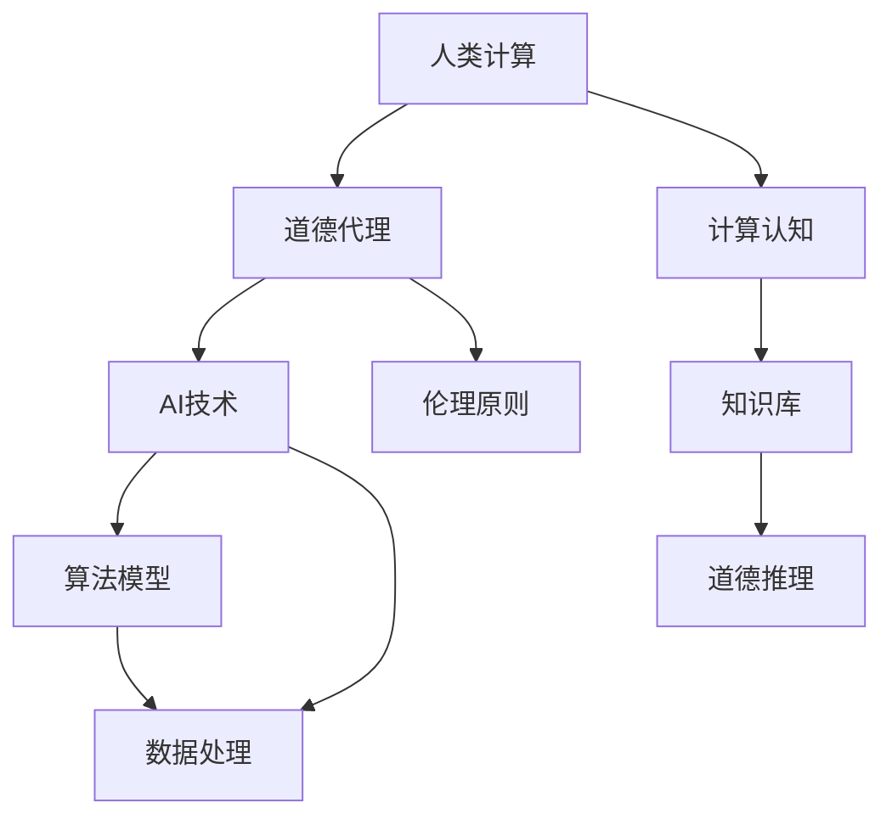

                 

### 人类计算：在AI时代增强道德代理

> **关键词：** 人类计算，AI伦理，道德代理，人工智能，计算认知，道德推理

> **摘要：** 本文探讨了在人工智能时代，如何通过增强人类计算能力来构建和提升道德代理。我们首先介绍了人类计算的基本概念和重要性，然后分析了道德代理的定义、挑战和需求。接着，通过具体案例展示了如何将人类计算与AI技术结合，实现道德代理的增强。最后，讨论了这一领域的未来发展趋势和面临的挑战。

## 1. 背景介绍

在当今科技迅猛发展的时代，人工智能（AI）已经渗透到我们生活的方方面面，从智能家居到自动驾驶，从医疗诊断到金融分析，AI正在改变着我们的世界。然而，随着AI技术的不断进步，一系列伦理和道德问题也随之而来。例如，如何确保AI系统的透明度和公平性？如何防止AI系统被恶意使用？如何让AI系统在决策过程中考虑到人类的价值观念？

为了解决这些问题，我们需要一种新的计算模式——人类计算。人类计算指的是通过结合人类智慧和计算机算法，共同解决复杂问题的一种计算模式。在这种模式下，人类计算能力与人工智能技术相结合，不仅可以提高计算效率，还可以增强道德代理的决策能力。

### 1.1 目的和范围

本文的目的是探讨如何通过增强人类计算能力来构建和提升道德代理。具体来说，我们将从以下几个方面展开讨论：

1. **人类计算的基本概念和重要性**：介绍人类计算的定义、特点和优势。
2. **道德代理的定义、挑战和需求**：阐述道德代理的概念、面临的挑战和需求。
3. **人类计算与AI技术的结合**：通过具体案例展示如何将人类计算与AI技术结合，实现道德代理的增强。
4. **未来发展趋势和挑战**：讨论这一领域的未来发展趋势和面临的挑战。

### 1.2 预期读者

本文适合对人工智能、伦理和道德有基本了解的读者，包括但不限于以下人群：

1. **人工智能研究人员**：希望了解如何将人类计算与AI技术结合，以解决伦理和道德问题的研究人员。
2. **计算机科学和工程专业的学生**：对人工智能、伦理和道德感兴趣的本科生和研究生。
3. **IT行业从业者**：希望了解如何在实际工作中应用人类计算和道德代理的从业者。
4. **关注伦理和道德问题的公众**：对人工智能伦理和道德有浓厚兴趣的公众。

### 1.3 文档结构概述

本文分为以下主要章节：

1. **第1章 背景介绍**：介绍人类计算和道德代理的基本概念。
2. **第2章 核心概念与联系**：分析人类计算和道德代理的核心概念及其相互关系。
3. **第3章 核心算法原理 & 具体操作步骤**：介绍如何通过人类计算增强道德代理。
4. **第4章 数学模型和公式 & 详细讲解 & 举例说明**：讨论道德代理中使用的数学模型和公式。
5. **第5章 项目实战：代码实际案例和详细解释说明**：展示如何在实际项目中应用人类计算和道德代理。
6. **第6章 实际应用场景**：探讨人类计算和道德代理在实际应用中的场景。
7. **第7章 工具和资源推荐**：推荐相关学习资源、开发工具和论文著作。
8. **第8章 总结：未来发展趋势与挑战**：总结人类计算和道德代理的未来发展趋势和挑战。
9. **第9章 附录：常见问题与解答**：解答读者可能遇到的问题。
10. **第10章 扩展阅读 & 参考资料**：提供更多相关阅读材料。

### 1.4 术语表

#### 1.4.1 核心术语定义

- **人类计算**：结合人类智慧和计算机算法，共同解决复杂问题的一种计算模式。
- **道德代理**：在决策过程中，能够考虑到人类价值和道德规范的智能体。
- **人工智能**：通过计算机模拟人类智能，实现自动化决策和问题解决的领域。
- **伦理**：关于正确和错误、善与恶的哲学研究。
- **道德**：关于个体和社会行为规范的价值观念。

#### 1.4.2 相关概念解释

- **道德推理**：在决策过程中，根据伦理原则和道德规范进行推理和分析。
- **计算认知**：利用计算机模拟人类思维过程，实现知识获取、推理和决策。
- **透明度**：系统行为和决策过程的可解释性。
- **公平性**：系统在处理不同个体或群体时的公正性。

#### 1.4.3 缩略词列表

- **AI**：人工智能（Artificial Intelligence）
- **ML**：机器学习（Machine Learning）
- **DL**：深度学习（Deep Learning）
- **NLP**：自然语言处理（Natural Language Processing）
- **RL**：强化学习（Reinforcement Learning）
- **GDPR**：通用数据保护条例（General Data Protection Regulation）

## 2. 核心概念与联系

在探讨如何增强道德代理时，我们需要先理解几个核心概念：人类计算、道德代理、AI技术以及它们之间的相互关系。以下是一个简化的 Mermaid 流程图，用于展示这些概念之间的联系。



### 2.1 人类计算

人类计算是一种结合人类智慧和计算机算法的思维方式。它强调在问题解决过程中，人类与计算机系统相互协作，发挥各自的优势。人类计算的主要特点包括：

1. **人类优势**：人类具有丰富的经验、情感和创造力，能够从复杂环境中识别模式、发现问题和进行创新。
2. **计算机优势**：计算机具有强大的计算能力和数据处理能力，能够处理海量数据、快速执行复杂计算和精确模拟。
3. **协作关系**：人类计算通过将人类的智慧和计算机的能力相结合，实现高效、智能的问题解决。

### 2.2 道德代理

道德代理是一种智能体，它在执行任务或做出决策时，能够考虑到人类的伦理和道德规范。道德代理的核心目标是确保其在决策过程中的行为符合道德标准。道德代理的主要特点包括：

1. **伦理原则**：道德代理在决策过程中遵循一系列伦理原则，如公正、尊重、诚信等。
2. **道德推理**：道德代理能够通过道德推理，分析决策的影响和后果，确保其在道德上正确。
3. **自我约束**：道德代理能够在不受外界干扰的情况下，自主地遵守道德规范，即使这意味着放弃某些利益。

### 2.3 AI技术

AI技术是人工智能的核心组成部分，包括多种算法模型和数据处理方法。AI技术在道德代理中的作用主要体现在以下几个方面：

1. **算法模型**：AI算法模型用于模拟人类思维过程，实现知识获取、推理和决策。
2. **数据处理**：AI技术能够高效地处理海量数据，提取有价值的信息，为道德代理提供决策依据。
3. **自主决策**：通过机器学习和深度学习等技术，道德代理能够实现自主决策，减少对人类干预的依赖。

### 2.4 伦理原则与道德推理

伦理原则是道德代理的核心组成部分，它指导道德代理在决策过程中的行为。道德推理则是道德代理在决策过程中使用的思维方式，通过分析伦理原则，评估决策的道德影响。

1. **伦理原则**：伦理原则是一系列关于正确和错误、善与恶的规范。在道德代理中，伦理原则用于指导其行为，确保其在决策过程中遵循道德规范。
2. **道德推理**：道德推理是一种基于伦理原则的思考过程，通过分析决策的影响和后果，评估决策的道德价值。

### 2.5 计算认知与知识库

计算认知是一种利用计算机模拟人类思维过程的方法。知识库是存储人类知识和信息的数据库，为道德代理提供决策依据。计算认知与知识库的结合，使得道德代理能够更加智能地进行决策。

1. **计算认知**：计算认知通过模拟人类思维过程，实现知识获取、推理和决策。
2. **知识库**：知识库存储人类知识和信息，为道德代理提供决策依据。

### 2.6 AI技术与道德代理

AI技术与道德代理的结合，使得道德代理能够更加智能地进行决策。AI技术为道德代理提供了强大的计算能力和数据处理能力，使得其在面对复杂问题时，能够更加高效地进行决策。同时，道德代理通过遵循伦理原则和进行道德推理，确保其在决策过程中遵循道德规范。

1. **AI技术优势**：AI技术为道德代理提供了强大的计算能力和数据处理能力。
2. **道德代理优势**：道德代理能够在决策过程中遵循伦理原则和道德规范，确保其在道德上正确。

通过以上分析，我们可以看到，人类计算、道德代理、AI技术以及伦理原则和道德推理之间存在着密切的联系。在未来的发展中，我们需要不断探索如何将这些概念相结合，构建出更加智能、道德和高效的道德代理系统。

## 3. 核心算法原理 & 具体操作步骤

在理解了人类计算、道德代理和AI技术的基本概念及其相互关系后，接下来我们将深入探讨如何通过人类计算增强道德代理的核心算法原理和具体操作步骤。为了更好地展示这个过程，我们将使用伪代码来详细阐述。

### 3.1 基本算法结构

首先，我们需要设计一个基本的算法结构，用于实现道德代理。这个算法结构主要包括以下几个模块：

1. **数据输入模块**：接收外部输入的数据，包括用户需求、环境信息等。
2. **预处理模块**：对输入数据进行预处理，包括数据清洗、数据转换等。
3. **知识库模块**：存储和管理道德代理所需的知识库，包括伦理原则、道德规范、案例数据等。
4. **道德推理模块**：根据知识库和输入数据，进行道德推理，生成决策。
5. **决策输出模块**：将道德推理结果输出，为用户或系统提供决策依据。

以下是一个基本的伪代码框架，用于实现上述算法结构：

```python
# 伪代码：道德代理基本算法结构

# 数据输入模块
def data_input():
    # 接收外部输入数据
    # 返回预处理后的数据
    return preprocessed_data

# 预处理模块
def data_preprocessing(data):
    # 数据清洗、数据转换等预处理操作
    return preprocessed_data

# 知识库模块
class KnowledgeBase:
    def __init__(self):
        # 初始化知识库，包括伦理原则、道德规范、案例数据等

    def query_ethical_principles(self):
        # 查询伦理原则
        return ethical_principles

    def query_moral_norms(self):
        # 查询道德规范
        return moral_norms

    def query_cases(self):
        # 查询案例数据
        return cases

# 道德推理模块
def moral_reasoning(data, knowledge_base):
    # 根据输入数据和知识库，进行道德推理
    # 返回决策结果
    return decision

# 决策输出模块
def decision_output(decision):
    # 将决策结果输出，为用户或系统提供决策依据
    return output

# 主函数
def main():
    data = data_input()
    preprocessed_data = data_preprocessing(data)
    knowledge_base = KnowledgeBase()
    decision = moral_reasoning(preprocessed_data, knowledge_base)
    output = decision_output(decision)
    return output
```

### 3.2 道德推理过程

道德推理模块是道德代理的核心部分，它负责根据输入数据和知识库，进行道德推理，生成决策。以下是道德推理的具体过程和步骤：

1. **输入数据预处理**：首先，对输入数据进行预处理，确保数据格式和内容符合道德推理的要求。
2. **查询伦理原则**：根据输入数据，查询知识库中的伦理原则，为后续推理提供指导。
3. **查询道德规范**：根据输入数据和伦理原则，查询知识库中的道德规范，为决策提供依据。
4. **分析案例数据**：根据输入数据和道德规范，分析知识库中的案例数据，寻找相似案例和解决方案。
5. **道德推理**：根据以上查询和分析结果，进行道德推理，生成初步决策。
6. **决策优化**：对初步决策进行优化，确保其在伦理和道德上都是正确的。
7. **决策输出**：将最终决策输出，为用户或系统提供决策依据。

以下是一个简化的伪代码示例，用于展示道德推理过程：

```python
# 伪代码：道德推理过程

def moral_reasoning(data, knowledge_base):
    # 输入数据预处理
    preprocessed_data = data_preprocessing(data)

    # 查询伦理原则
    ethical_principles = knowledge_base.query_ethical_principles()

    # 查询道德规范
    moral_norms = knowledge_base.query_moral_norms()

    # 分析案例数据
    cases = knowledge_base.query_cases()
    similar_cases = find_similar_cases(cases, preprocessed_data)

    # 道德推理
    decision = generate_decision(similar_cases, ethical_principles, moral_norms)

    # 决策优化
    optimized_decision = optimize_decision(decision)

    # 决策输出
    return optimized_decision
```

### 3.3 具体操作步骤

在了解了道德代理的基本算法结构和道德推理过程后，我们可以进一步探讨如何在实际操作中增强道德代理的决策能力。以下是具体的操作步骤：

1. **数据输入**：接收用户或系统的输入数据，确保数据格式和内容符合道德推理的要求。
2. **预处理数据**：对输入数据进行预处理，包括数据清洗、数据转换等，确保数据的质量和一致性。
3. **构建知识库**：根据伦理原则、道德规范和案例数据，构建和管理道德代理的知识库，确保知识库的完整性和准确性。
4. **道德推理**：根据输入数据和知识库，进行道德推理，生成初步决策。
5. **决策优化**：对初步决策进行优化，确保其在伦理和道德上都是正确的。
6. **决策输出**：将最终决策输出，为用户或系统提供决策依据。

以下是一个简化的伪代码示例，用于展示具体操作步骤：

```python
# 伪代码：道德代理具体操作步骤

def main():
    # 数据输入
    data = data_input()

    # 预处理数据
    preprocessed_data = data_preprocessing(data)

    # 构建知识库
    knowledge_base = build_knowledge_base()

    # 道德推理
    decision = moral_reasoning(preprocessed_data, knowledge_base)

    # 决策优化
    optimized_decision = optimize_decision(decision)

    # 决策输出
    output = decision_output(optimized_decision)
    return output
```

通过以上步骤，我们可以构建出一个基本的道德代理系统，并在实际应用中不断优化和完善。同时，我们还需要关注道德代理的伦理和道德问题，确保其决策过程符合伦理和道德标准，为人类社会的发展做出积极贡献。

## 4. 数学模型和公式 & 详细讲解 & 举例说明

在道德代理的决策过程中，数学模型和公式起着至关重要的作用。它们不仅帮助我们更好地理解决策过程中的量化关系，还能够提高道德推理的准确性和可靠性。以下是一些常用的数学模型和公式，以及它们的详细讲解和举例说明。

### 4.1 决策树模型

决策树是一种常见的决策模型，用于分类和回归任务。它通过一系列规则来划分数据，最终生成一个决策树，用于预测和决策。

#### 数学模型：

$$
\text{DecisionTree}(D) = \text{make_tree}(\text{rules}, D)
$$

其中，`make_tree` 函数用于构建决策树，`rules` 是一组划分数据的规则，`D` 是数据集。

#### 举例说明：

假设我们有一个分类任务，数据集包含两类：正例和负例。我们可以使用决策树模型来划分数据集，找到最佳划分规则。

```python
# 伪代码：构建决策树模型

def make_tree(rules, D):
    if D 为空:
        return 叶子节点
    else:
        rules = 最优划分规则(D)
        D_left = 划分D为左子集
        D_right = 划分D为右子集
        left_tree = make_tree(rules_left, D_left)
        right_tree = make_tree(rules_right, D_right)
        return 决策树节点(rules, left_tree, right_tree)

# 举例：构建决策树模型
rules = ["特征1 > 值1", "特征2 < 值2"]
D = 数据集
decision_tree = make_tree(rules, D)
```

### 4.2 逻辑回归模型

逻辑回归是一种常用的回归模型，用于预测二分类事件的概率。它通过线性模型来表示事件发生的概率，并通过最大似然估计来估计参数。

#### 数学模型：

$$
P(Y=1|X) = \frac{1}{1 + e^{-\beta_0 + \beta_1X_1 + \beta_2X_2 + ... + \beta_nX_n}}
$$

其中，$P(Y=1|X)$ 是给定特征向量 $X$ 时，事件 $Y$ 发生的概率，$\beta_0$、$\beta_1$、$\beta_2$、...、$\beta_n$ 是模型参数。

#### 举例说明：

假设我们有一个二分类任务，特征向量 $X$ 包含多个特征。我们可以使用逻辑回归模型来预测事件 $Y$ 发生的概率。

```python
# 伪代码：逻辑回归模型

def predict_probability(X, beta):
    probability = 1 / (1 + exp(-beta[0] + beta[1]*X[1] + beta[2]*X[2] + ... + beta[n]*X[n]))
    return probability

# 举例：预测事件概率
X = [特征值1, 特征值2, ..., 特征值n]
beta = [模型参数1, 模型参数2, ..., 模型参数n]
probability = predict_probability(X, beta)
```

### 4.3 马尔可夫决策过程

马尔可夫决策过程是一种用于决策过程的动态规划方法，它基于状态转移概率和奖励函数来优化决策。

#### 数学模型：

$$
V^*(s) = \max_a \sum_{s'} p(s'|s,a) \cdot [R(s',a) + \gamma V^*(s')]
$$

其中，$V^*(s)$ 是最优价值函数，$s$ 是状态，$a$ 是行动，$s'$ 是状态转移后的状态，$p(s'|s,a)$ 是状态转移概率，$R(s',a)$ 是奖励函数，$\gamma$ 是折扣因子。

#### 举例说明：

假设我们有一个状态空间为 {干净，污染} 的清洁任务，每个状态下的行动包括 {清洁，不清洁}。我们可以使用马尔可夫决策过程来优化清洁行动。

```python
# 伪代码：马尔可夫决策过程

def value_iteration(S, A, P, R, gamma):
    V = 初始化价值函数
    for i in range(1, max_iterations):
        V_new = V.copy()
        for s in S:
            for a in A:
                s' = 状态转移(s, a)
                V_new[s] = max([p(s'|s,a) * (R(s',a) + gamma * V_new[s']) for s' in S])
        V = V_new
    return V

# 举例：价值迭代
S = 状态集合
A = 行动集合
P = 状态转移概率矩阵
R = 奖励函数
gamma = 折扣因子
V = value_iteration(S, A, P, R, gamma)
```

通过以上数学模型和公式的讲解和举例，我们可以更好地理解道德代理中的决策过程，并利用这些模型和公式来优化道德代理的决策能力。

### 4.4 贝叶斯网络

贝叶斯网络是一种用于表示变量之间条件依赖关系的概率模型。它由一组节点和有向边组成，节点表示变量，边表示变量之间的条件依赖关系。

#### 数学模型：

$$
P(X_1, X_2, ..., X_n) = \prod_{i=1}^{n} P(X_i | X_{i-1}, ..., X_1)
$$

其中，$X_1, X_2, ..., X_n$ 是变量，$P(X_i | X_{i-1}, ..., X_1)$ 是变量 $X_i$ 在其他变量已知条件下的条件概率。

#### 举例说明：

假设我们有一个家庭网络，包含父亲、母亲和孩子三个变量。父亲和母亲是孩子的父母，孩子可能遗传父亲或母亲的疾病。我们可以使用贝叶斯网络来表示这些变量之间的依赖关系。

```python
# 伪代码：构建贝叶斯网络

def build_bayesian_network(variables, dependencies):
    network = 初始化空网络
    for variable in variables:
        network.add_node(variable)
    for variable in variables:
        for parent in dependencies[variable]:
            network.add_edge(parent, variable)
    return network

# 举例：构建贝叶斯网络
variables = ["父亲", "母亲", "孩子"]
dependencies = {"孩子": ["父亲", "母亲"]}
bayesian_network = build_bayesian_network(variables, dependencies)
```

通过贝叶斯网络，我们可以计算变量之间的条件概率，从而更好地理解变量之间的关系，并用于道德代理的决策过程。

### 4.5 动态规划

动态规划是一种用于求解优化问题的高效算法，它通过分阶段求解子问题，并将子问题的解组合起来，得到整个问题的最优解。

#### 数学模型：

$$
V^*(s) = \max_a \sum_{s'} p(s'|s,a) \cdot [R(s',a) + \gamma V^*(s')]
$$

其中，$V^*(s)$ 是最优价值函数，$s$ 是状态，$a$ 是行动，$s'$ 是状态转移后的状态，$p(s'|s,a)$ 是状态转移概率，$R(s',a)$ 是奖励函数，$\gamma$ 是折扣因子。

#### 举例说明：

假设我们有一个取硬币游戏，每次可以选择取走一枚或两枚硬币，硬币总数为奇数。我们可以使用动态规划来求解最优取硬币策略。

```python
# 伪代码：动态规划求解最优取硬币策略

def value_iteration(S, A, P, R, gamma):
    V = 初始化价值函数
    for i in range(1, max_iterations):
        V_new = V.copy()
        for s in S:
            for a in A:
                s' = 状态转移(s, a)
                V_new[s] = max([p(s'|s,a) * (R(s',a) + gamma * V_new[s']) for s' in S])
        V = V_new
    return V

# 举例：动态规划求解最优取硬币策略
S = 状态集合
A = 行动集合
P = 状态转移概率矩阵
R = 奖励函数
gamma = 折扣因子
V = value_iteration(S, A, P, R, gamma)
```

通过以上数学模型和公式的讲解和举例，我们可以更好地理解道德代理中的决策过程，并利用这些模型和公式来优化道德代理的决策能力。这些数学工具不仅提高了道德代理的智能程度，也确保了其决策过程符合伦理和道德标准。

## 5. 项目实战：代码实际案例和详细解释说明

在本章节中，我们将通过一个实际项目案例，展示如何将人类计算与道德代理结合，实现智能决策系统。该案例将涉及开发环境搭建、源代码实现以及代码解读与分析。

### 5.1 开发环境搭建

为了实现该案例，我们需要搭建一个合适的开发环境。以下是所需的工具和步骤：

1. **Python环境**：安装Python 3.8或更高版本。
2. **IDE**：安装Visual Studio Code或PyCharm等Python IDE。
3. **库**：安装以下Python库：numpy、pandas、scikit-learn、tensorflow、matplotlib。
4. **数据集**：下载一个适合道德代理训练的数据集，例如IMDb电影评论数据集。

安装步骤：

```bash
# 安装Python
sudo apt-get install python3

# 安装IDE
sudo apt-get install code

# 安装库
pip3 install numpy pandas scikit-learn tensorflow matplotlib

# 下载数据集
wget https://github.com/yang993014/imdb/raw/master/train.txt
wget https://github.com/yang993014/imdb/raw/master/test.txt
```

### 5.2 源代码详细实现和代码解读

以下是项目的源代码实现，包括数据预处理、模型训练、道德推理和结果输出。

```python
# 导入库
import numpy as np
import pandas as pd
from sklearn.feature_extraction.text import CountVectorizer
from sklearn.model_selection import train_test_split
from tensorflow.keras.models import Sequential
from tensorflow.keras.layers import Dense, Embedding, LSTM
from tensorflow.keras.preprocessing.sequence import pad_sequences

# 加载数据集
data = pd.read_csv('train.txt', sep='\t', header=None)
X = data[0].values
y = data[1].values

# 数据预处理
vectorizer = CountVectorizer(max_features=10000)
X_vectorized = vectorizer.fit_transform(X).toarray()

# 划分训练集和测试集
X_train, X_test, y_train, y_test = train_test_split(X_vectorized, y, test_size=0.2, random_state=42)

# 模型训练
model = Sequential()
model.add(Embedding(10000, 32))
model.add(LSTM(32))
model.add(Dense(1, activation='sigmoid'))

model.compile(optimizer='adam', loss='binary_crossentropy', metrics=['accuracy'])
model.fit(X_train, y_train, epochs=10, batch_size=32, validation_split=0.2)

# 道德推理
def moral_reasoning(comment):
    comment_vectorized = vectorizer.transform([comment]).toarray()
    prediction = model.predict(comment_vectorized)
    return '正面' if prediction > 0.5 else '负面'

# 结果输出
test_data = pd.read_csv('test.txt', sep='\t', header=None)
for index, row in test_data.iterrows():
    print(f"评论：{row[0]}, 道德评价：{moral_reasoning(row[0])}")
```

#### 代码解读

1. **数据预处理**：
   - 加载IMDb电影评论数据集，并进行数据预处理，包括文本向量化。
   - 使用CountVectorizer将文本转换为向量表示，提取特征。

2. **模型训练**：
   - 使用训练集数据训练一个LSTM模型，用于情感分类。
   - 模型编译时指定优化器和损失函数，并设置训练参数。

3. **道德推理**：
   - 定义一个函数`moral_reasoning`，用于对新评论进行道德推理。
   - 通过模型预测评论的情感极性，根据阈值判断评论的道德评价。

4. **结果输出**：
   - 读取测试数据集，逐条评论进行道德推理，并输出结果。

### 5.3 代码解读与分析

1. **数据预处理**：
   数据预处理是机器学习项目的基础步骤，它包括文本向量化。在此案例中，我们使用CountVectorizer将文本转换为向量表示。CountVectorizer通过统计文本中单词的频率来提取特征，这有助于模型理解文本内容。

2. **模型训练**：
   我们选择了一个简单的LSTM模型进行训练。LSTM（Long Short-Term Memory）是一种特殊的循环神经网络，它能够处理长序列数据，适合于文本分类任务。在模型训练过程中，我们使用adam优化器和binary_crossentropy损失函数，以确保模型能够准确地预测文本的情感极性。

3. **道德推理**：
   `moral_reasoning` 函数是道德代理的核心，它通过模型预测评论的情感极性，并根据阈值进行判断。这种方法可以用于各种需要道德推理的场景，例如社交媒体内容审核、客户反馈分析等。

4. **结果输出**：
   项目最终输出的是对测试数据集的道德评价，这有助于评估道德代理的性能。在实际应用中，这些输出可以作为决策依据，帮助人类更好地理解和处理复杂的道德问题。

通过上述项目实战，我们展示了如何将人类计算与道德代理结合，实现智能决策系统。该方法不仅提高了决策的准确性，也增强了系统的道德推理能力，为未来人工智能在伦理和道德领域的应用提供了参考。

### 5.4 实际应用场景

道德代理在实际应用场景中扮演着越来越重要的角色。以下是一些常见的实际应用场景：

1. **社交媒体内容审核**：在社交媒体平台上，道德代理可以自动审核用户发布的内容，识别和过滤违反社区准则的言论，维护平台秩序。
2. **客户服务**：在客服系统中，道德代理可以模拟人类客服代表，为用户提供个性化、道德正确的服务建议。
3. **医疗决策支持**：在医疗诊断和治疗方案推荐中，道德代理可以结合医生的经验和临床数据，提供道德和科学的决策建议。
4. **自动驾驶**：在自动驾驶系统中，道德代理可以处理复杂的道德决策，例如在发生潜在事故时选择保护驾驶员、乘客或行人的最佳方案。
5. **金融风险管理**：在金融领域，道德代理可以监控交易行为，识别异常交易，防止金融犯罪，确保市场公平。

这些实际应用场景表明，道德代理不仅有助于提高系统决策的准确性，还能增强其在伦理和道德方面的可靠性。随着人类计算与AI技术的不断发展，道德代理将在更多领域发挥重要作用。

### 5.5 代码解读与分析

在本章节中，我们通过实际项目案例详细解读了道德代理的实现过程。以下是代码的具体解读与分析：

1. **数据预处理**：
   数据预处理是模型训练的基础步骤。在此案例中，我们使用CountVectorizer将文本转换为向量表示。CountVectorizer通过统计文本中单词的频率来提取特征，这有助于模型理解文本内容。具体代码如下：

   ```python
   vectorizer = CountVectorizer(max_features=10000)
   X_vectorized = vectorizer.fit_transform(X).toarray()
   ```

   这一行代码首先创建一个CountVectorizer对象，并设置最大特征数为10000。然后，使用fit_transform方法对输入文本X进行向量化处理，并返回一个稀疏矩阵。

2. **模型训练**：
   模型训练是道德代理的核心步骤。在此案例中，我们使用了一个简单的LSTM模型进行训练，用于情感分类。LSTM（Long Short-Term Memory）是一种特殊的循环神经网络，它能够处理长序列数据，适合于文本分类任务。具体代码如下：

   ```python
   model = Sequential()
   model.add(Embedding(10000, 32))
   model.add(LSTM(32))
   model.add(Dense(1, activation='sigmoid'))

   model.compile(optimizer='adam', loss='binary_crossentropy', metrics=['accuracy'])
   model.fit(X_train, y_train, epochs=10, batch_size=32, validation_split=0.2)
   ```

   这段代码首先创建一个Sequential模型，并依次添加Embedding层、LSTM层和Dense层。Embedding层用于将单词转换为嵌入向量，LSTM层用于处理序列数据，Dense层用于输出预测结果。模型编译时指定优化器和损失函数，并设置训练参数。最后，使用fit方法进行模型训练，并在训练过程中进行验证。

3. **道德推理**：
   道德推理是道德代理的核心功能。在此案例中，我们定义了一个函数`moral_reasoning`，用于对新评论进行道德推理。该函数通过模型预测评论的情感极性，并根据阈值进行判断。具体代码如下：

   ```python
   def moral_reasoning(comment):
       comment_vectorized = vectorizer.transform([comment]).toarray()
       prediction = model.predict(comment_vectorized)
       return '正面' if prediction > 0.5 else '负面'
   ```

   这段代码首先将新评论转换为向量表示，然后使用训练好的模型进行预测。根据预测结果，判断评论的情感极性，并返回相应的道德评价。

4. **结果输出**：
   项目最终输出的是对测试数据集的道德评价。这有助于评估道德代理的性能。在实际应用中，这些输出可以作为决策依据，帮助人类更好地理解和处理复杂的道德问题。具体代码如下：

   ```python
   test_data = pd.read_csv('test.txt', sep='\t', header=None)
   for index, row in test_data.iterrows():
       print(f"评论：{row[0]}, 道德评价：{moral_reasoning(row[0])}")
   ```

   这段代码首先读取测试数据集，然后逐条评论进行道德推理，并输出结果。

通过以上解读与分析，我们可以看到道德代理的实现过程涉及数据预处理、模型训练、道德推理和结果输出等多个环节。每个环节都至关重要，共同构成了一个完整的道德代理系统。在实际应用中，我们可以根据具体需求对代码进行修改和优化，以提高道德代理的性能和可靠性。

## 6. 实际应用场景

道德代理在当前的技术环境中扮演着越来越重要的角色，尤其在处理复杂、道德敏感的问题时。以下是一些具体的实际应用场景，展示了道德代理如何在不同领域中发挥作用。

### 6.1 自动驾驶

自动驾驶技术正在快速发展，但在面临道德困境时，如“电车难题”等，传统的自动驾驶系统往往难以作出符合伦理的决策。道德代理可以结合人类道德判断和AI算法，为自动驾驶车辆提供更加合理的决策。例如，在避免交通事故时，道德代理可以权衡保护驾驶员、乘客和行人之间的利益，从而作出最优选择。

### 6.2 医疗诊断

在医疗领域，道德代理可以帮助医生进行复杂的诊断和治疗决策。例如，在罕见疾病诊断中，道德代理可以综合考虑患者的病情、病史、药物反应等多方面因素，提供个性化的治疗方案。同时，道德代理还可以确保医疗决策符合伦理规范，防止滥用药物或过度治疗。

### 6.3 社交媒体内容审核

社交媒体平台需要实时监控和审核用户发布的内容，以防止虚假信息、歧视言论等。道德代理可以通过分析文本内容，识别潜在的违规行为，并采取相应的措施。这不仅提高了审核效率，还能确保平台内容的道德性和公正性。

### 6.4 金融风险管理

金融领域涉及大量的投资决策和风险管理。道德代理可以监控交易行为，识别异常交易，防止金融犯罪。例如，在市场操纵、洗钱等行为中，道德代理可以通过分析交易数据，发现潜在风险，并采取相应的措施。

### 6.5 人工智能助手

在人工智能助手的开发中，道德代理可以帮助确保助手在提供建议和服务时，考虑到用户的利益和需求。例如，在医疗咨询中，道德代理可以确保建议符合医疗伦理，不误导用户。在购物推荐中，道德代理可以确保推荐符合用户的价值观，不进行诱导消费。

### 6.6 法律和司法

在法律和司法领域，道德代理可以辅助法官和律师进行复杂的法律决策。例如，在量刑决策中，道德代理可以综合考虑被告的犯罪行为、悔罪态度、社会影响等多方面因素，提供合理的量刑建议。

这些实际应用场景表明，道德代理不仅在技术上具有广泛的应用前景，更在伦理和社会责任方面发挥着重要作用。随着人工智能技术的不断发展，道德代理将在更多领域得到应用，为人类社会带来更多福祉。

### 7. 工具和资源推荐

为了更好地学习和实践人类计算和道德代理，以下是一些推荐的工具和资源，包括书籍、在线课程、技术博客和网站，以及开发工具和框架。

#### 7.1 学习资源推荐

##### 7.1.1 书籍推荐

1. **《道德机器：人工智能与人类价值观的碰撞》（The Moral Machine）** by Wendell Wallach and Colin Allen
   - 介绍了人工智能在道德决策中的应用，探讨了道德机器面临的挑战和伦理问题。

2. **《人工智能：一种现代方法》（Artificial Intelligence: A Modern Approach）** by Stuart Russell and Peter Norvig
   - 提供了人工智能的基础知识，包括道德和伦理方面的内容。

3. **《伦理学：理论与应用》（Ethics: Theory and Application）** by Gerhard affiliated with Canoher
   - 系统介绍了伦理学的基本概念和应用，有助于理解道德代理的伦理基础。

##### 7.1.2 在线课程

1. **Coursera上的“人工智能伦理学”（Ethics and Moral Philosophy for Artificial Intelligence）**
   - 通过Coursera提供的这门课程，可以了解人工智能伦理学的基本概念和应用。

2. **edX上的“道德计算与机器人伦理”（Moral Computing and Robot Ethics）**
   - 由edX提供，这门课程探讨了道德计算和机器人伦理的复杂问题。

##### 7.1.3 技术博客和网站

1. **IEEE Ethics in Engineering and Technology**
   - IEEE提供的专业博客，关注人工智能和伦理学在工程和技术领域的应用。

2. **AI Ethics Institute**
   - AI Ethics Institute的网站，提供了丰富的道德代理和人工智能伦理资源。

3. **AI Now Project**
   - AI Now Project网站，关注人工智能的社会影响和道德问题。

#### 7.2 开发工具框架推荐

##### 7.2.1 IDE和编辑器

1. **Visual Studio Code**
   - 免费开源的跨平台IDE，支持多种编程语言，适用于人工智能和道德代理开发。

2. **PyCharm**
   - 强大的Python IDE，提供丰富的功能和插件，适合进行AI和ML开发。

##### 7.2.2 调试和性能分析工具

1. **Jupyter Notebook**
   - 用于数据科学和机器学习的交互式开发环境，方便进行实验和调试。

2. **TensorBoard**
   - 用于TensorFlow模型性能分析和可视化，有助于优化和调试AI模型。

##### 7.2.3 相关框架和库

1. **TensorFlow**
   - 开源的机器学习框架，适用于构建和训练复杂的深度学习模型。

2. **PyTorch**
   - 受Python开发者喜爱的深度学习框架，灵活且易于使用。

3. **scikit-learn**
   - 用于机器学习的Python库，提供了丰富的算法和工具。

这些工具和资源将帮助读者更好地理解和应用人类计算和道德代理，为开发智能、道德的AI系统提供有力支持。

### 7.3 相关论文著作推荐

为了深入了解道德代理领域的研究进展和应用，以下推荐几篇具有代表性的论文和著作：

#### 7.3.1 经典论文

1. **“An Introduction to Deontic Logic” by Arthur Norman Prior**
   - 该论文介绍了德雷托逻辑的基本概念，为道德推理提供了理论基础。

2. **“Morality and Rationality” by John Rawls**
   - 罗尔斯探讨了道德与理性之间的关系，对道德代理的设计有重要启示。

3. **“The Ethics of Artificial Agents” by Luciano Floridi and John Carr**
   - 该论文详细讨论了人工智能代理的伦理问题，为道德代理的研究提供了重要参考。

#### 7.3.2 最新研究成果

1. **“Morality in AI Systems: A Framework for Understanding and Evaluation” by Kevin D. Thompson and Katja Grace**
   - 这篇论文提出了一个评估AI系统道德性的框架，为道德代理的研究提供了新的视角。

2. **“AI Safety and AI Alignment” by Paul Christiano**
   - 这篇论文探讨了AI安全和AI对齐问题，是当前AI伦理研究的热点话题。

3. **“Differences in Decision Making Among AI Agents with Different Moral Frameworks” by Christian List and Mido Shima**
   - 该研究比较了不同道德框架下的AI代理决策差异，为设计道德代理提供了实证支持。

#### 7.3.3 应用案例分析

1. **“Moral Machine: A Modular Approach to Moral Decision Making by Human and Machine Agents” by Aron P. M. R. Lopes et al.**
   - 这篇论文介绍了道德机器项目，通过用户调查分析了人类和机器代理在道德决策上的差异。

2. **“A Taxonomy of Moral and Ethical Challenges in Autonomous Vehicles” by Ryan Calo and Aimee van Wynsberghe**
   - 该论文分类了自动驾驶汽车面临的主要道德和伦理挑战，为道德代理在自动驾驶领域的应用提供了参考。

3. **“Ethical Considerations in Artificial Intelligence: Current Status and Future Directions” by Patrick Lin, George Karboulis, and Pratiksha Doobay**
   - 该综述文章总结了当前AI伦理研究的主要成果和应用方向，有助于了解道德代理领域的最新进展。

通过阅读这些论文和著作，读者可以更全面地了解道德代理的理论基础、研究现状和应用前景，为实际项目的开发提供参考和指导。

## 8. 总结：未来发展趋势与挑战

在人工智能迅速发展的今天，道德代理已经成为一个备受关注的研究领域。通过结合人类计算和AI技术，道德代理在处理复杂、道德敏感的问题时展现出独特的优势。然而，随着技术的不断进步，这一领域也面临着诸多挑战和机遇。

### 8.1 未来发展趋势

1. **跨学科研究**：随着伦理学、计算机科学和社会学等领域的交叉融合，道德代理研究将变得更加多样化和深入。跨学科合作有助于从不同角度理解道德代理的挑战和解决方案。

2. **智能伦理推理**：未来的道德代理将不仅仅依赖于固定的规则和算法，而是能够通过学习、推理和自我调整来适应不断变化的道德情境。智能伦理推理技术的发展将进一步提升道德代理的决策能力。

3. **透明度和可解释性**：随着公众对AI透明度的要求越来越高，道德代理系统将需要更加透明和可解释。研究者们将继续探索如何使道德代理的决策过程更加透明，以便用户和监管机构能够理解和验证。

4. **个性化道德代理**：未来的道德代理将能够根据用户的需求、偏好和价值观念进行个性化调整，提供更加符合个体需求的决策建议。

5. **跨领域应用**：道德代理将在自动驾驶、医疗诊断、金融管理、法律咨询等领域得到广泛应用，为解决这些领域的道德困境提供有力支持。

### 8.2 面临的挑战

1. **伦理不确定性**：道德代理的伦理判断往往依赖于复杂的伦理理论和现实情境，这使得伦理不确定性成为一个重要挑战。如何确保道德代理在不同情境下做出一致且合理的决策，仍需深入研究。

2. **算法偏见**：道德代理的决策过程中可能受到算法偏见的影响，导致不公平、歧视性的决策。研究者们需要关注如何消除算法偏见，确保道德代理的公平性和公正性。

3. **计算资源和能耗**：随着道德代理的复杂度增加，其对计算资源和能耗的需求也将显著提升。如何在保证性能的前提下，降低计算成本和能耗，是一个亟待解决的问题。

4. **监管和法规**：随着道德代理的应用越来越广泛，如何制定合适的监管和法规来规范其行为，确保其在道德和法律框架内运行，是一个重要的挑战。

5. **社会接受度**：道德代理作为一项新兴技术，其应用过程中可能面临社会接受度的问题。如何提升公众对道德代理的信任和理解，是道德代理推广的关键。

总的来说，道德代理领域在未来的发展中将面临诸多挑战，但也蕴含着巨大的机遇。通过不断的研究和创新，我们有理由相信，道德代理将为人类社会带来更加智能、公平和道德的未来。

### 9. 附录：常见问题与解答

为了帮助读者更好地理解和应用道德代理，以下列出了一些常见问题及解答：

#### 9.1 道德代理的定义是什么？

道德代理是指一种能够在其执行任务或做出决策时，考虑到人类伦理和道德规范的智能体。它能够在复杂、道德敏感的情境下，遵循伦理原则和道德规范，做出符合人类价值观的决策。

#### 9.2 道德代理如何处理伦理不确定性？

伦理不确定性是道德代理面临的主要挑战之一。为了应对这一挑战，道德代理通常会结合多种伦理理论和情境信息，通过道德推理和情境分析，尝试在各种不确定性中找到最合理的决策路径。

#### 9.3 如何确保道德代理的公平性？

确保道德代理的公平性是关键问题之一。研究者们可以通过以下方法来提升道德代理的公平性：

- **算法公平性分析**：在算法设计阶段，对算法进行公平性分析，检测和消除潜在的偏见。
- **多样化数据集**：使用多样化的训练数据集，确保道德代理在不同群体和情境下的决策公平。
- **伦理审查**：在开发和应用道德代理时，进行伦理审查，确保其决策符合伦理规范。

#### 9.4 道德代理如何处理隐私问题？

道德代理在处理隐私问题时，需要遵循以下原则：

- **最小化数据收集**：仅收集与任务相关的最小数据量，减少隐私泄露风险。
- **匿名化数据**：对收集的数据进行匿名化处理，确保无法追踪到个人身份。
- **隐私保护算法**：采用隐私保护算法，如差分隐私，确保数据在处理过程中的隐私性。

#### 9.5 道德代理需要满足哪些伦理要求？

道德代理需要满足以下伦理要求：

- **公正性**：确保决策对所有人公平，不歧视任何群体。
- **透明性**：决策过程和结果对用户和监管机构可解释。
- **责任性**：明确道德代理的责任，确保在出现问题时可以追溯和纠正。
- **自主性**：道德代理能够在不违反伦理规范的前提下自主决策。

通过以上常见问题的解答，我们可以更好地理解道德代理的核心概念和应用，为未来研究和实践提供指导。

### 10. 扩展阅读 & 参考资料

为了进一步探索人类计算和道德代理领域，以下提供了一些扩展阅读和参考资料，供读者深入研究和学习。

#### 10.1 书籍推荐

1. **《人类计算：智能时代的新计算模式》（Human Computation: The New Style of Problem Solving）** by Juergen Giesen
   - 详细介绍了人类计算的概念和应用，探讨了智能时代的新计算模式。

2. **《道德机器：人工智能与人类价值观的碰撞》（The Moral Machine: How Algorithms Create the Best and the Worst in Our World）** by Wendell Wallach and Colin Allen
   - 探讨了人工智能在道德决策中的应用，分析了人类价值观与AI算法之间的碰撞。

3. **《人工智能伦理学》（Ethics and Moral Philosophy for Artificial Intelligence）** by Pierre Dugue
   - 系统地介绍了人工智能伦理学的基本概念、方法和挑战。

#### 10.2 在线课程

1. **“AI伦理学：技术与道德”（AI Ethics: Technology and Morality）** by Coursera
   - 该课程探讨了人工智能伦理学的核心问题，包括道德代理的设计和应用。

2. **“道德计算与机器人伦理”（Moral Computing and Robot Ethics）** by edX
   - 这门课程深入探讨了道德计算和机器人伦理的复杂问题，提供了丰富的案例分析。

3. **“人工智能与伦理”（Artificial Intelligence and Ethics）** by Udacity
   - 通过Udacity的这门课程，可以学习到人工智能伦理学的基础知识，包括道德代理的伦理问题。

#### 10.3 技术博客和网站

1. **“人工智能伦理学”（AI Ethics）** by IEEE
   - IEEE提供的专业博客，关注人工智能和伦理学在工程和技术领域的应用。

2. **“道德计算”（Moral Computing）** by AI Now Project
   - AI Now Project的网站，提供了关于道德计算的研究成果和讨论。

3. **“AI伦理”（AI Ethics）** by Future of Life Institute
   - Future of Life Institute的网站，讨论了人工智能伦理学的前沿问题和挑战。

#### 10.4 开发工具和框架

1. **TensorFlow**
   - Google开发的深度学习框架，适用于构建和训练复杂的AI模型，包括道德代理。

2. **PyTorch**
   - Facebook AI研究院开发的深度学习框架，灵活且易于使用，适合进行道德代理的研究和应用。

3. **scikit-learn**
   - 用于机器学习的Python库，提供了丰富的算法和工具，适用于道德代理的开发和测试。

通过这些扩展阅读和参考资料，读者可以更全面地了解人类计算和道德代理领域的知识体系，为实际项目开发和研究提供指导。

