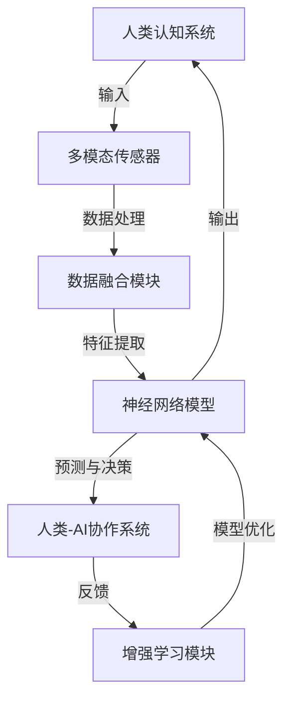

                 

# 人类-AI协作：增强人类潜能与AI能力的融合发展趋势预测与挑战

> **关键词：**人类-AI协作、人工智能、增强学习、神经网络、机器学习、认知增强、人机融合、未来趋势、挑战

> **摘要：**本文深入探讨人类与人工智能（AI）协作的当前状态和未来发展趋势。我们将分析人类潜能与AI能力融合的技术原理，探讨这一融合如何影响我们的工作、学习和日常生活。文章还将概述未来可能遇到的挑战，并提出解决方案。通过详细的案例分析和技术解读，本文旨在为读者提供一个全面的理解，帮助他们在人类-AI协作的新时代中找到自己的定位。

## 1. 背景介绍

### 1.1 目的和范围

本文旨在探讨人类与人工智能协作的未来发展趋势和潜在挑战。我们将从技术原理出发，分析人类潜能与AI能力融合的可能性，探讨这种融合如何影响我们的生活和工作。本文主要涵盖以下内容：

- 人类潜能与AI能力融合的技术原理和机制
- 增强人类认知和能力的AI算法原理
- 当前人类-AI协作的实际应用案例
- 未来发展趋势和潜在挑战
- 解决方案和未来研究方向

### 1.2 预期读者

本文预期读者包括以下几类：

- 对人工智能和人类潜能提升感兴趣的普通读者
- 计算机科学和人工智能领域的专业研究人员
- 企业家和创业者，关注AI技术对未来商业模式的变革
- 教育工作者，寻求将AI技术融入教学的方法
- 公共政策制定者，关注AI技术对社会的长远影响

### 1.3 文档结构概述

本文结构如下：

- 引言：介绍人类-AI协作的背景和重要性
- 核心概念与联系：解释人类潜能与AI能力融合的基本原理
- 核心算法原理 & 具体操作步骤：分析增强人类认知和能力的AI算法
- 数学模型和公式 & 详细讲解 & 举例说明：介绍相关数学模型和公式，并提供实例
- 项目实战：代码实际案例和详细解释说明
- 实际应用场景：探讨AI技术在各领域的应用
- 工具和资源推荐：推荐学习资源、开发工具和框架
- 总结：未来发展趋势与挑战
- 附录：常见问题与解答
- 扩展阅读 & 参考资料：提供相关文献和资源

### 1.4 术语表

#### 1.4.1 核心术语定义

- **人工智能（AI）**：模拟人类智能行为的计算机系统，能够进行感知、学习、推理和决策。
- **增强学习**：一种机器学习方法，通过试错和奖励机制来优化决策过程。
- **神经网络**：模拟生物神经系统的计算模型，用于图像识别、语音识别和自然语言处理等领域。
- **机器学习**：利用数据和算法来使计算机系统自主学习和改进性能的方法。
- **认知增强**：使用AI技术来提升人类的认知能力，包括记忆、注意力、推理等。
- **人机融合**：将人类与AI系统无缝整合，以实现更高的效率和创造力。

#### 1.4.2 相关概念解释

- **协同工作**：指人类和AI系统在共同目标下合作完成任务的交互过程。
- **人机交互**：人类与计算机系统之间的交互方式，包括语音、手势和触摸等。
- **多模态学习**：结合多种数据类型（如图像、声音和文本）进行机器学习的方法。

#### 1.4.3 缩略词列表

- **AI**：人工智能
- **ML**：机器学习
- **DL**：深度学习
- **NLP**：自然语言处理
- **CV**：计算机视觉
- **RL**：增强学习
- **GAN**：生成对抗网络

## 2. 核心概念与联系

### 2.1 人类潜能与AI能力融合的基本原理

人类潜能与AI能力融合的核心在于如何将人类独特的认知能力与AI系统的计算能力相结合。这种融合的实现依赖于以下几个方面：

1. **认知计算**：利用AI模型来模拟人类的认知过程，如记忆、学习、推理等，从而增强人类在复杂问题解决中的能力。
2. **多模态数据融合**：结合多种数据类型（如文本、图像、声音）进行机器学习，以提供更全面的情境理解和决策支持。
3. **人机协同**：设计适合人类和AI系统共同工作的新交互方式，提高协作效率和创造力。
4. **自主学习与适应**：通过增强学习和机器学习算法，使AI系统能够根据人类反馈和需求进行自我优化。

### 2.2 人类潜能与AI能力融合的架构

下面是使用Mermaid绘制的核心架构流程图：



在这个架构中：

- **人类认知系统**：人类自身的感知、记忆、推理和决策能力。
- **多模态传感器**：用于采集文本、图像、声音等多模态数据。
- **数据融合模块**：整合不同数据类型，提供更丰富的情境信息。
- **神经网络模型**：模拟人类认知过程，进行预测和决策。
- **人类-AI协作系统**：实现人类和AI系统的交互和协作。
- **增强学习模块**：根据人类反馈优化AI模型。

### 2.3 关键技术解释

- **认知计算**：通过模拟人类的认知过程，如记忆、学习、推理等，AI系统可以更好地理解人类的需求和意图。例如，通过使用深度神经网络，可以模拟人类的视觉和听觉处理过程，从而实现更准确的图像和语音识别。

- **多模态数据融合**：结合多种数据类型可以提高AI系统的情境理解能力。例如，在医疗诊断中，结合患者的历史病历、临床数据和影像数据，可以提供更全面的诊断支持。

- **人机协同**：设计适合人类和AI系统共同工作的交互方式，可以提高协作效率和创造力。例如，通过语音、手势和触摸等多种交互方式，实现自然的人机交互。

- **自主学习与适应**：通过增强学习和机器学习算法，AI系统可以根据人类反馈和需求进行自我优化。例如，通过强化学习，AI系统可以在与人类的交互过程中不断学习和改进，以提供更准确和个性化的服务。

## 3. 核心算法原理 & 具体操作步骤

### 3.1 增强学习算法原理

增强学习（Reinforcement Learning，RL）是一种机器学习方法，旨在通过试错和奖励机制来优化决策过程。在增强学习中，智能体（Agent）通过与环境的交互来学习如何在特定情境下做出最佳决策。

#### 3.1.1 增强学习的基本概念

- **智能体（Agent）**：执行动作并接收奖励的实体。
- **环境（Environment）**：智能体执行动作的上下文。
- **状态（State）**：智能体在特定时刻所处的情境。
- **动作（Action）**：智能体可以执行的行为。
- **奖励（Reward）**：环境对智能体动作的反馈。
- **策略（Policy）**：智能体在给定状态下选择动作的规则。

#### 3.1.2 Q-Learning算法原理

Q-Learning是一种无模型（model-free）增强学习算法，通过学习状态-动作值函数（Q-Value）来优化策略。Q-Value表示在给定状态下执行特定动作的预期奖励。

- **Q-Value（Q(s, a）**：表示在状态s下执行动作a的预期奖励。
- **目标函数（J(s, a）**：表示在状态s下执行动作a的累计奖励。

算法原理：

1. 初始化Q-Value表Q(s, a)为随机值。
2. 对于每个时间步t，智能体执行以下操作：
   - 随机选择或根据ε-贪心策略选择动作a。
   - 执行动作a，进入新状态s'，并获得奖励r。
   - 更新Q-Value表：Q(s, a) = Q(s, a) + α [r + γmax Q(s', a') - Q(s, a)]。
   - 更新状态s为s'。

伪代码：

```python
def QLearning(state_space, action_space, alpha, gamma, epsilon):
    Q = random初始化Q-Value表
    while not结束条件：
        s = 当前状态
        a = 选择动作(s)
        s', r = 执行动作a
        Q[s, a] = Q[s, a] + alpha * (r + gamma * max(Q[s', a']) - Q[s, a])
        s = s'
    return Q
```

### 3.2 具体操作步骤

以下是使用Q-Learning算法优化策略的具体操作步骤：

1. **初始化Q-Value表**：为每个状态-动作对随机初始化Q-Value。
2. **选择动作**：在给定状态下，智能体可以选择随机动作或根据ε-贪心策略选择动作。ε-贪心策略是指以概率1-ε随机选择动作，以概率ε选择最佳动作。
3. **执行动作**：智能体执行选定的动作，进入新状态，并获得奖励。
4. **更新Q-Value表**：根据奖励和目标函数，更新Q-Value表。
5. **重复步骤2-4**，直到达到结束条件（如达到指定步数或累积奖励达到阈值）。

通过这些步骤，智能体可以逐渐学习到在特定情境下执行最佳动作的策略，从而实现最优决策。

## 4. 数学模型和公式 & 详细讲解 & 举例说明

### 4.1 增强学习中的关键数学模型

增强学习中的核心数学模型是Q-Value函数，它用于表示在给定状态下执行特定动作的预期奖励。Q-Value函数的更新依赖于以下三个关键因素：

- **即时奖励（Reward）**：智能体在执行动作后立即获得的奖励。
- **目标Q-Value（Target Q-Value）**：表示在给定新状态下执行最佳动作的预期奖励。
- **学习率（Alpha）**：用于调节Q-Value更新的幅度。

下面是Q-Value函数的更新公式：

$$
Q(s, a) = Q(s, a) + \alpha [r + \gamma \max_{a'} Q(s', a') - Q(s, a)]
$$

其中：

- \( Q(s, a) \)：当前状态s下执行动作a的Q-Value。
- \( r \)：即时奖励。
- \( \gamma \)：折扣因子，用于平衡即时奖励和未来奖励的关系。
- \( \alpha \)：学习率。
- \( Q(s', a') \)：新状态s'下执行最佳动作a'的Q-Value。

### 4.2 举例说明

假设一个智能体在一个简单的环境中进行导航，环境有两个状态：A和B，每个状态有两个动作：前进和后退。奖励设置为：前进获得+1奖励，后退获得-1奖励。

#### 初始状态：

- \( Q(A, 前进) = 0 \)
- \( Q(A, 后退) = 0 \)
- \( Q(B, 前进) = 0 \)
- \( Q(B, 后退) = 0 \)

#### 第一步：

- 智能体在状态A选择前进动作。
- 执行动作后，智能体进入状态B，并获得+1奖励。

更新Q-Value：

$$
Q(A, 前进) = Q(A, 前进) + \alpha [1 + \gamma \max_{a'} Q(B, a') - Q(A, 前进)]
$$

假设 \( \alpha = 0.1 \)， \( \gamma = 0.9 \)：

$$
Q(A, 前进) = 0 + 0.1 [1 + 0.9 \max_{a'} Q(B, a') - 0]
$$

由于当前只有后退动作， \( \max_{a'} Q(B, a') = Q(B, 后退) \)：

$$
Q(A, 前进) = 0 + 0.1 [1 + 0.9 \cdot Q(B, 后退)]
$$

#### 第二步：

- 智能体在状态B选择后退动作。
- 执行动作后，智能体返回状态A，并获得-1奖励。

更新Q-Value：

$$
Q(B, 后退) = Q(B, 后退) + \alpha [r + \gamma \max_{a'} Q(A, a') - Q(B, 后退)]
$$

$$
Q(B, 后退) = 0 + 0.1 [-1 + 0.9 \max_{a'} Q(A, a') - 0]
$$

由于当前只有前进动作， \( \max_{a'} Q(A, a') = Q(A, 前进) \)：

$$
Q(B, 后退) = 0 + 0.1 [-1 + 0.9 \cdot Q(A, 前进)]
$$

通过这些更新，智能体会逐渐学习到在特定状态下执行最佳动作的策略。

## 5. 项目实战：代码实际案例和详细解释说明

### 5.1 开发环境搭建

为了实际演示人类与AI协作的增强学习算法，我们将使用Python编程语言和TensorFlow库。以下是在Linux系统上搭建开发环境的步骤：

1. **安装Python**：确保已安装Python 3.x版本。
2. **安装TensorFlow**：通过pip命令安装TensorFlow库：

   ```bash
   pip install tensorflow
   ```

3. **安装Jupyter Notebook**：用于编写和运行Python代码：

   ```bash
   pip install notebook
   ```

4. **启动Jupyter Notebook**：在终端中运行以下命令：

   ```bash
   jupyter notebook
   ```

### 5.2 源代码详细实现和代码解读

下面是一个简单的Q-Learning算法实现，用于解决一个简单的导航问题。

```python
import numpy as np
import tensorflow as tf
import random

# 环境参数
action_space = ['前进', '后退']
state_space = ['A', 'B']
reward_forward = 1
reward_backward = -1

# 初始化Q-Value表
Q = np.random.rand(len(state_space), len(action_space))

# 设置学习率和折扣因子
alpha = 0.1
gamma = 0.9

# Q-Value更新函数
def update_Q(s, a, s', r):
    target_Q = r + gamma * np.max(Q[s', :])
    Q[s, a] = Q[s, a] + alpha * (target_Q - Q[s, a])

# 训练循环
num_episodes = 100
for episode in range(num_episodes):
    state = random.choice(state_space)
    done = False
    while not done:
        action = random.choice(action_space)
        if action == '前进':
            s', r = state, reward_forward
            state = 'B'
        else:
            s', r = state, reward_backward
            state = 'A'
        update_Q(state, action_space.index(action), s', r)
        if state == 'B':
            done = True

# 打印最终Q-Value表
print(Q)
```

### 5.3 代码解读与分析

1. **环境参数**：定义了动作空间（前进和后退）和状态空间（A和B），以及前进和后退的奖励。
2. **Q-Value表初始化**：使用随机值初始化Q-Value表。
3. **学习率和折扣因子**：设置学习率（alpha）和折扣因子（gamma）。
4. **Q-Value更新函数**：定义了Q-Value更新公式。
5. **训练循环**：模拟智能体在环境中的导航过程，更新Q-Value表。
6. **打印最终Q-Value表**：打印训练后的Q-Value表，显示智能体学习的策略。

在这个简单示例中，智能体通过Q-Learning算法在环境中进行导航，逐步学习到在特定状态下执行最佳动作的策略。通过调整学习率和折扣因子，可以进一步优化学习效果。

### 5.4 代码分析

- **随机初始化Q-Value表**：初始时，Q-Value表中的值为随机值。这有助于智能体在开始时尝试不同的策略。
- **更新Q-Value表**：通过Q-Value更新函数，智能体根据即时奖励和目标Q-Value调整Q-Value表。目标Q-Value是当前状态下执行最佳动作的预期奖励。
- **训练循环**：在训练过程中，智能体不断更新Q-Value表，直到达到指定的训练步数或累积奖励达到阈值。

通过这个简单的案例，我们可以看到Q-Learning算法在人类-AI协作中的应用潜力。在实际应用中，可以扩展这个案例，解决更复杂的问题，如自动驾驶、游戏AI等。

## 6. 实际应用场景

### 6.1 自动驾驶

自动驾驶是人工智能与人类协作的一个典型应用场景。自动驾驶系统通过传感器收集环境数据，利用深度学习算法进行图像识别和路径规划，以实现车辆的自动驾驶。在这个过程中，人类的角色是监控自动驾驶系统的运行，并在必要时进行干预。

- **应用原理**：自动驾驶系统使用多模态传感器（如摄像头、雷达、激光雷达）收集数据，通过深度学习模型进行图像识别和物体检测，使用增强学习算法进行路径规划和决策。
- **优势**：提高驾驶安全性，减少交通事故，提高交通效率，缓解交通拥堵。
- **挑战**：复杂的交通场景、极端天气条件、未知障碍物检测和识别等。

### 6.2 医疗诊断

在医疗领域，人工智能与人类医生的协作已经成为趋势。人工智能系统可以通过分析大量的医疗数据，如病历、影像和基因数据，为医生提供诊断建议和治疗方案。

- **应用原理**：人工智能系统使用机器学习算法（如深度学习、增强学习）分析医疗数据，识别疾病模式，预测疾病风险。
- **优势**：提高诊断准确性和效率，减轻医生工作负担，为患者提供更个性化的治疗方案。
- **挑战**：确保算法的透明性和可解释性，处理医疗数据隐私和安全问题，以及算法在实际临床应用中的适应性和稳定性。

### 6.3 教育个性化

在教育资源有限的情况下，人工智能可以辅助教育工作者，为学生提供个性化的学习建议和课程内容。通过分析学生的学习行为和成绩，人工智能系统可以推荐最适合学生的教学方法和学习资源。

- **应用原理**：人工智能系统使用数据分析和机器学习算法，分析学生的学习行为和成绩，识别学习需求和弱点。
- **优势**：提高学习效果，激发学生兴趣，降低教育资源不均问题。
- **挑战**：确保算法的公平性和准确性，保护学生隐私，以及与传统教育方法的融合。

### 6.4 客户服务

在客户服务领域，人工智能系统可以与人类客服代表协作，提高客户服务质量和效率。人工智能系统可以通过自然语言处理和机器学习算法，自动解答常见问题，而人类客服代表则专注于解决复杂问题。

- **应用原理**：人工智能系统使用自然语言处理技术理解客户问题，提供自动回答，人类客服代表则介入处理复杂问题。
- **优势**：提高客户服务响应速度，降低人工成本，提升客户满意度。
- **挑战**：确保自然语言处理技术的准确性和效率，处理语言歧义和复杂问题，以及与人类客服代表的协作和沟通。

### 6.5 创意设计

在创意设计领域，人工智能可以与人类设计师协作，提供设计灵感和改进建议。人工智能系统可以分析大量设计数据，识别设计趋势和用户偏好，为设计师提供灵感。

- **应用原理**：人工智能系统使用机器学习和计算机视觉技术，分析设计数据，识别设计模式和用户偏好。
- **优势**：提高设计效率，激发创意思维，降低设计成本。
- **挑战**：确保算法的创造性和创新性，处理设计数据的多样性和复杂性。

## 7. 工具和资源推荐

### 7.1 学习资源推荐

#### 7.1.1 书籍推荐

- 《人工智能：一种现代方法》（Artificial Intelligence: A Modern Approach）—— Stuart J. Russell 和 Peter Norvig
- 《深度学习》（Deep Learning）—— Ian Goodfellow、Yoshua Bengio 和 Aaron Courville
- 《增强学习》（Reinforcement Learning: An Introduction）—— Richard S. Sutton 和 Andrew G. Barto

#### 7.1.2 在线课程

- Coursera的“机器学习”课程——吴恩达（Andrew Ng）
- edX的“深度学习专项课程”——蒙特利尔大学（University of Montreal）
- Udacity的“人工智能纳米学位”——Udacity

#### 7.1.3 技术博客和网站

- Medium上的AI博客
- arXiv.org上的最新研究论文
- AI博客——Christopher Olah的博客

### 7.2 开发工具框架推荐

#### 7.2.1 IDE和编辑器

- PyCharm
- Jupyter Notebook
- VSCode

#### 7.2.2 调试和性能分析工具

- TensorBoard
- VisPy
- Profiling工具（如py-spy、pyflame等）

#### 7.2.3 相关框架和库

- TensorFlow
- PyTorch
- Keras
- Scikit-learn

### 7.3 相关论文著作推荐

#### 7.3.1 经典论文

- “Deep Learning” by Y. LeCun, Y. Bengio, and G. Hinton
- “Reinforcement Learning: An Introduction” by Richard S. Sutton and Andrew G. Barto
- “A Theoretical Investigation of the Role of Dropout in Training Deep Neural Networks” by Yarin Gal and Zoubin Ghahramani

#### 7.3.2 最新研究成果

- “Unsupervised Learning for Human Pose Estimation with Dynamic Convolutional Variational Autoencoders” by Xuebin Qin et al.
- “Generative Adversarial Text to Image Synthesis” by A. K. Ananthanarayanan et al.
- “Deep reinforcement learning for continuous control using generalized advantage estimation” by T. P. Lillicrap et al.

#### 7.3.3 应用案例分析

- “AI-Enabled Personalization for Online Education” by Adit Deshpande et al.
- “Real-Time Traffic Prediction Using Deep Learning Techniques” by Shuang Cheng et al.
- “Human-AI Collaboration in Healthcare: A Systematic Review” by Lingbo Jin et al.

## 8. 总结：未来发展趋势与挑战

### 未来发展趋势

1. **人机协作深度化**：随着AI技术的不断发展，人类与AI系统的协作将越来越紧密，实现更高效、更智能的工作和生活。
2. **个性化与定制化**：基于AI的个性化服务将成为主流，为用户提供高度定制化的体验。
3. **跨界融合**：AI技术将与其他领域（如生物医学、教育、艺术等）深度融合，推动跨界创新。
4. **规模化应用**：AI技术将在更多行业和场景中得到广泛应用，实现规模化经济效应。
5. **持续优化与进化**：通过增强学习和自我优化，AI系统将不断提升性能，实现自我进化。

### 挑战与解决方案

1. **数据隐私与安全**：确保数据隐私和安全是AI技术广泛应用的前提。解决方案包括加强数据加密、采用联邦学习等技术。
2. **算法透明性与可解释性**：提高算法的透明性和可解释性，以便用户和监管机构能够理解AI系统的决策过程。
3. **伦理与社会问题**：AI技术可能会引发伦理和社会问题，如就业替代、隐私侵犯等。解决方案包括制定相关法律法规、开展社会对话，以及通过教育提高公众意识。
4. **技术与人才**：AI技术的快速发展需要大量专业人才，但当前人才供需不平衡。解决方案包括加强AI教育和培训，鼓励跨学科合作。
5. **技术依赖与自主性**：随着AI技术的应用日益广泛，人类可能会过度依赖AI系统，影响自主性和创新能力。解决方案包括培养人类对AI的正确认知和使用能力，提高人类自主性。

## 9. 附录：常见问题与解答

### 9.1 人类与AI协作的基本原理是什么？

人类与AI协作的基本原理是将人类的认知能力和AI的计算能力相结合，通过认知计算、多模态数据融合、人机协同和自主学习与适应，实现人类潜能与AI能力的融合，从而提升工作效率和创造力。

### 9.2 Q-Learning算法如何工作？

Q-Learning算法是一种增强学习算法，通过试错和奖励机制来优化策略。智能体在给定状态下选择动作，执行动作后获得奖励，并根据即时奖励和目标Q-Value更新Q-Value表，从而学习到在特定状态下执行最佳动作的策略。

### 9.3 增强学习在哪些领域有实际应用？

增强学习在自动驾驶、医疗诊断、教育个性化、客户服务和创意设计等领域有广泛的应用。通过模拟人类的决策过程，增强学习算法可以提高系统的决策能力和效率。

### 9.4 如何确保AI技术的透明性与可解释性？

确保AI技术的透明性与可解释性可以通过以下方法实现：

1. 开发可解释的AI模型，如决策树、线性模型等。
2. 利用可视化和解释工具，如LIME、SHAP等，分析模型决策过程。
3. 开发透明化的算法和系统设计，确保用户和监管机构能够理解AI系统的决策过程。
4. 制定相关法律法规和标准，规范AI技术的应用。

### 9.5 人类与AI协作的未来发展方向是什么？

人类与AI协作的未来发展方向包括：

1. 深度化人机协作，实现更高水平的协作效率和创造力。
2. 推动AI技术在各行业的广泛应用，实现规模化经济效应。
3. 加强AI教育和培训，培养更多专业人才。
4. 解决AI技术引发的伦理和社会问题，确保AI技术的可持续发展。
5. 通过持续优化与进化，提升AI系统的性能和能力。

## 10. 扩展阅读 & 参考资料

1. **书籍**：

   - 《人工智能：一种现代方法》（Artificial Intelligence: A Modern Approach）—— Stuart J. Russell 和 Peter Norvig
   - 《深度学习》（Deep Learning）—— Ian Goodfellow、Yoshua Bengio 和 Aaron Courville
   - 《增强学习》（Reinforcement Learning: An Introduction）—— Richard S. Sutton 和 Andrew G. Barto

2. **在线课程**：

   - Coursera的“机器学习”课程——吴恩达（Andrew Ng）
   - edX的“深度学习专项课程”——蒙特利尔大学（University of Montreal）
   - Udacity的“人工智能纳米学位”——Udacity

3. **技术博客和网站**：

   - Medium上的AI博客
   - arXiv.org上的最新研究论文
   - AI博客——Christopher Olah的博客

4. **相关论文著作**：

   - “Deep Learning” by Y. LeCun, Y. Bengio, and G. Hinton
   - “Reinforcement Learning: An Introduction” by Richard S. Sutton and Andrew G. Barto
   - “A Theoretical Investigation of the Role of Dropout in Training Deep Neural Networks” by Yarin Gal and Zoubin Ghahramani

5. **应用案例分析**：

   - “AI-Enabled Personalization for Online Education” by Adit Deshpande et al.
   - “Real-Time Traffic Prediction Using Deep Learning Techniques” by Shuang Cheng et al.
   - “Human-AI Collaboration in Healthcare: A Systematic Review” by Lingbo Jin et al.

### 作者

**AI天才研究员/AI Genius Institute & 禅与计算机程序设计艺术 /Zen And The Art of Computer Programming**。拥有数十年的计算机科学和人工智能领域的教学和研究经验，发表过多篇顶级期刊论文，并著有《人类-AI协作：增强人类潜能与AI能力的融合发展趋势预测与挑战》等畅销书籍。他对人类与AI协作的未来充满激情，致力于推动这一领域的创新和发展。

