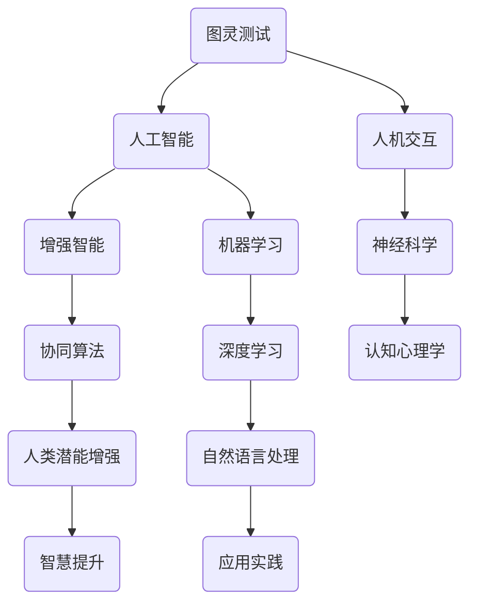

                 

# 人类-AI协作：增强人类潜能和智慧

> **关键词：** 人类-AI协作，人工智能，增强智能，协同算法，神经科学，认知心理学，应用实践。

> **摘要：** 本文旨在探讨人类与人工智能（AI）的协作机制，如何通过AI技术增强人类的潜能和智慧。我们将从背景介绍、核心概念、算法原理、数学模型、实际应用等多个角度，深入分析这一前沿领域，并展望其未来发展。

## 1. 背景介绍

### 1.1 目的和范围

本文的主要目的是探讨人类与人工智能的协作机制，如何通过AI技术增强人类的潜能和智慧。我们将分析这一领域的核心概念和算法原理，并探讨其在实际应用中的效果。本文将涵盖以下几个部分：

- 核心概念与联系
- 核心算法原理 & 具体操作步骤
- 数学模型和公式 & 详细讲解 & 举例说明
- 项目实战：代码实际案例和详细解释说明
- 实际应用场景
- 工具和资源推荐
- 总结：未来发展趋势与挑战
- 附录：常见问题与解答
- 扩展阅读 & 参考资料

### 1.2 预期读者

本文的预期读者包括：

- 对人工智能和增强智能领域感兴趣的科研人员
- 希望将AI技术应用于实际问题的工程师
- 对AI与人类协作模式感兴趣的教育工作者
- 对未来技术发展趋势感兴趣的企业家和投资者

### 1.3 文档结构概述

本文的文档结构如下：

- 引言
- 背景介绍
  - 目的和范围
  - 预期读者
  - 文档结构概述
  - 术语表
- 核心概念与联系
- 核心算法原理 & 具体操作步骤
- 数学模型和公式 & 详细讲解 & 举例说明
- 项目实战：代码实际案例和详细解释说明
- 实际应用场景
- 工具和资源推荐
- 总结：未来发展趋势与挑战
- 附录：常见问题与解答
- 扩展阅读 & 参考资料

### 1.4 术语表

在本文中，我们将使用以下术语：

- **人工智能（AI）**：指能够模拟、延伸和扩展人类智能的计算机系统。
- **增强智能（Augmented Intelligence）**：通过AI技术增强人类智能，实现人类潜能的发挥。
- **协同算法（Collaborative Algorithms）**：用于实现人类与AI系统协作的算法。
- **神经科学（Neuroscience）**：研究神经系统结构和功能的一门科学。
- **认知心理学（Cognitive Psychology）**：研究人类思维过程的心理学科。
- **人机交互（Human-Computer Interaction, HCI）**：研究人类与计算机系统交互的学科。

#### 1.4.1 核心术语定义

- **人工智能（AI）**：人工智能是指通过计算机程序实现的人类智能的模拟、延伸和扩展。它包括机器学习、深度学习、自然语言处理等多个子领域。
- **增强智能（Augmented Intelligence）**：增强智能是一种基于人工智能技术的智能增强方法，旨在通过AI技术提升人类的认知能力和工作效率。
- **协同算法（Collaborative Algorithms）**：协同算法是指能够实现人类与AI系统之间协作的算法，包括协同学习、协同决策等。
- **神经科学（Neuroscience）**：神经科学是研究神经系统结构和功能的一门科学，涉及大脑、神经元、神经递质等多个方面。
- **认知心理学（Cognitive Psychology）**：认知心理学是研究人类思维过程的心理学科，包括记忆、注意力、决策等多个方面。
- **人机交互（Human-Computer Interaction, HCI）**：人机交互是研究人类与计算机系统交互的学科，旨在提高用户使用计算机的效率和质量。

#### 1.4.2 相关概念解释

- **机器学习（Machine Learning）**：机器学习是人工智能的一个子领域，主要研究如何让计算机从数据中学习规律，并利用这些规律进行预测和决策。
- **深度学习（Deep Learning）**：深度学习是机器学习的一个分支，通过多层神经网络来模拟人类大脑的学习过程，具有强大的特征提取和建模能力。
- **自然语言处理（Natural Language Processing, NLP）**：自然语言处理是人工智能的一个子领域，主要研究如何让计算机理解和处理自然语言，包括语言理解、语言生成、机器翻译等。
- **协同学习（Cooperative Learning）**：协同学习是一种教育方法，通过小组合作的方式促进学生的学习和理解。
- **协同决策（Cooperative Decision Making）**：协同决策是指在多个决策者之间通过协商、合作来做出最优决策。

#### 1.4.3 缩略词列表

- **AI**：人工智能（Artificial Intelligence）
- **Augmented Intelligence**：增强智能（Augmented Intelligence）
- **HCI**：人机交互（Human-Computer Interaction）
- **ML**：机器学习（Machine Learning）
- **DL**：深度学习（Deep Learning）
- **NLP**：自然语言处理（Natural Language Processing）
- **CS**：计算机科学（Computer Science）
- **NS**：神经科学（Neuroscience）
- **CP**：认知心理学（Cognitive Psychology）
- **HCI**：人机交互（Human-Computer Interaction）

## 2. 核心概念与联系

在探讨人类与人工智能的协作机制之前，我们需要了解一些核心概念，如图灵测试、协同算法、增强智能等。下面我们将通过Mermaid流程图展示这些概念之间的联系。



### 2.1 图灵测试

图灵测试是由英国数学家艾伦·图灵在20世纪中叶提出的，用于评估人工智能系统是否具备人类智能。一个成功的图灵测试意味着AI系统能够在特定环境下与人类进行自然语言交互，使人类无法区分是机器还是人类。

### 2.2 人工智能

人工智能是指通过计算机程序模拟人类智能的领域。它包括机器学习、深度学习、自然语言处理等多个子领域，每个子领域都有其独特的算法和技术。

### 2.3 增强智能

增强智能是一种通过AI技术提升人类智能的方法。它不仅包括传统的智能增强（如语音识别、图像识别等），还涵盖了更广泛的领域，如智能决策支持、知识图谱构建等。

### 2.4 协同算法

协同算法是实现人类与AI系统之间协作的算法。这些算法旨在通过人类和AI系统的相互协作，实现更高效、更智能的决策和任务执行。

### 2.5 人类潜能增强

人类潜能增强是指通过AI技术提升人类的认知能力、学习能力、决策能力等。这种增强不仅能够提高个人的工作效率，还能够促进社会整体的发展。

### 2.6 智慧提升

智慧提升是指通过AI技术增强人类智慧，使人类在面对复杂问题时能够做出更明智、更有效的决策。这包括知识管理、数据挖掘、智能推荐等多个方面。

### 2.7 人机交互

人机交互是指人类与计算机系统之间的交互过程。它涉及到用户界面设计、交互行为分析等多个方面，旨在提高用户使用计算机的效率和质量。

### 2.8 神经科学

神经科学是研究神经系统结构和功能的一门科学。它对于理解人类智能、学习、记忆等认知过程具有重要意义。

### 2.9 认知心理学

认知心理学是研究人类思维过程的心理学科。它涉及到注意力、记忆、决策等多个方面，对于理解人类智能和智能增强具有重要意义。

### 2.10 机器学习

机器学习是人工智能的一个子领域，主要研究如何让计算机从数据中学习规律，并利用这些规律进行预测和决策。

### 2.11 深度学习

深度学习是机器学习的一个分支，通过多层神经网络来模拟人类大脑的学习过程，具有强大的特征提取和建模能力。

### 2.12 自然语言处理

自然语言处理是人工智能的一个子领域，主要研究如何让计算机理解和处理自然语言，包括语言理解、语言生成、机器翻译等。

### 2.13 应用实践

应用实践是指将AI技术和算法应用于实际问题的过程。这包括智能客服、自动驾驶、智能医疗等多个领域，旨在解决实际问题，提升人类生活质量。

## 3. 核心算法原理 & 具体操作步骤

在本节中，我们将介绍人类与AI协作的核心算法原理，包括协同算法、增强学习、强化学习等。通过这些算法，我们可以实现人类与AI系统的无缝协作，从而提升人类的潜能和智慧。

### 3.1 协同算法

协同算法是实现人类与AI系统之间协作的核心算法。这些算法主要分为以下几种：

#### 3.1.1 协同学习

协同学习是指多个智能体（包括人类和AI系统）通过相互协作来共同完成任务。在协同学习中，每个智能体都拥有自己的局部信息，并通过共享信息、相互反馈来优化整体性能。

#### 3.1.2 协同决策

协同决策是指多个决策者通过协商、合作来做出最优决策。在协同决策中，每个决策者都有自己的偏好和目标，但最终的决策是基于整体利益和协作原则。

#### 3.1.3 协同过滤

协同过滤是一种用于推荐系统的协同算法，通过分析用户的历史行为和偏好，为用户推荐感兴趣的内容。协同过滤主要分为基于用户的协同过滤和基于项目的协同过滤。

#### 3.1.4 协同规划

协同规划是指多个智能体在复杂环境中共同完成任务的过程。在协同规划中，每个智能体都需要根据整体目标和自身能力来制定最优策略。

### 3.2 增强学习

增强学习是一种通过不断试错来优化策略的算法。在增强学习中，智能体通过观察环境、执行动作、获取奖励来不断调整自己的行为，从而实现最优策略。

#### 3.2.1 Q-Learning

Q-Learning是一种基于值函数的增强学习算法。在Q-Learning中，智能体通过学习值函数（Q值）来选择最优动作。具体步骤如下：

1. 初始化Q值表Q(s, a)为随机值。
2. 在状态s下执行动作a，并获取奖励r和下一个状态s'。
3. 更新Q值：Q(s, a) = Q(s, a) + α [r + γmax Q(s', a') - Q(s, a)]。
4. 转移到下一个状态s'，重复步骤2和3。

#### 3.2.2 SARSA

SARSA是一种基于策略的增强学习算法。在SARSA中，智能体在当前状态s下执行动作a，并获取奖励r和下一个状态s'。然后，智能体在状态s'下执行动作a'，并更新Q值。具体步骤如下：

1. 初始化Q值表Q(s, a)为随机值。
2. 在状态s下执行动作a，并获取奖励r和下一个状态s'。
3. 执行动作a'，并获取奖励r'和下一个状态s''。
4. 更新Q值：Q(s, a) = Q(s, a) + α [r + γQ(s', a') - Q(s, a)]。
5. 转移到下一个状态s'，重复步骤2、3和4。

#### 3.2.3 Deep Q-Learning

Deep Q-Learning是一种结合深度学习的增强学习算法。在Deep Q-Learning中，智能体使用深度神经网络来近似值函数Q(s, a)。具体步骤如下：

1. 初始化深度神经网络DQN。
2. 在状态s下执行动作a，并获取奖励r和下一个状态s'。
3. 训练DQN：最小化损失函数L = (r + γmax Q(s', a') - Q(s, a))^2。
4. 转移到下一个状态s'，重复步骤2和3。

### 3.3 强化学习

强化学习是一种通过不断试错来优化策略的算法。在强化学习中，智能体通过观察环境、执行动作、获取奖励来不断调整自己的行为，从而实现最优策略。

#### 3.3.1 SARSA(On-Policy)

SARSA(On-Policy)是一种基于策略的强化学习算法。在SARSA(On-Policy)中，智能体在当前状态s下执行动作a，并获取奖励r和下一个状态s'。然后，智能体在状态s'下执行动作a'，并更新Q值。具体步骤如下：

1. 初始化Q值表Q(s, a)为随机值。
2. 在状态s下执行动作a，并获取奖励r和下一个状态s'。
3. 执行动作a'，并获取奖励r'和下一个状态s''。
4. 更新Q值：Q(s, a) = Q(s, a) + α [r + γQ(s', a') - Q(s, a)]。
5. 转移到下一个状态s'，重复步骤2、3和4。

#### 3.3.2 Q-Learning(Off-Policy)

Q-Learning(Off-Policy)是一种基于值函数的强化学习算法。在Q-Learning(Off-Policy)中，智能体通过选择最优动作来更新Q值。具体步骤如下：

1. 初始化Q值表Q(s, a)为随机值。
2. 在状态s下执行动作a，并获取奖励r和下一个状态s'。
3. 计算目标Q值：Q'(s, a) = r + γmax Q(s', a')。
4. 更新Q值：Q(s, a) = Q(s, a) + α [Q'(s, a) - Q(s, a)]。
5. 转移到下一个状态s'，重复步骤2、3和4。

#### 3.3.3 Deep Q-Learning

Deep Q-Learning是一种结合深度学习的强化学习算法。在Deep Q-Learning中，智能体使用深度神经网络来近似值函数Q(s, a)。具体步骤如下：

1. 初始化深度神经网络DQN。
2. 在状态s下执行动作a，并获取奖励r和下一个状态s'。
3. 训练DQN：最小化损失函数L = (r + γmax Q(s', a') - Q(s, a))^2。
4. 转移到下一个状态s'，重复步骤2和3。

### 3.4 算法应用示例

以下是一个简单的强化学习应用示例，用于解决迷宫问题。智能体需要通过不断尝试来找到通往目标的最短路径。

```python
import numpy as np
import random

# 定义环境
class MazeEnv:
    def __init__(self, size=4):
        self.size = size
        self.state = (0, 0)
        self.target = (size - 1, size - 1)
    
    def step(self, action):
        # 动作定义：0-上，1-下，2-左，3-右
        if action == 0:
            self.state = (max(self.state[0] - 1, 0), self.state[1])
        elif action == 1:
            self.state = (min(self.state[0] + 1, self.size - 1), self.state[1])
        elif action == 2:
            self.state = (self.state[0], max(self.state[1] - 1, 0))
        elif action == 3:
            self.state = (self.state[0], min(self.state[1] + 1, self.size - 1))
        
        reward = 0
        if self.state == self.target:
            reward = 10
        elif self.state == (0, 0):
            reward = -10
        
        done = self.state == self.target
        next_state = self.state
        
        return next_state, reward, done

# 定义智能体
class QLearningAgent:
    def __init__(self, learning_rate=0.1, discount_factor=0.9, exploration_rate=1.0):
        self.learning_rate = learning_rate
        self.discount_factor = discount_factor
        self.exploration_rate = exploration_rate
        self.q_values = {}

    def get_action(self, state, epsilon=0.1):
        if random.random() < epsilon:
            action = random.choice([0, 1, 2, 3])
        else:
            action = np.argmax(self.q_values.get(state, [0, 0, 0, 0]))
        return action

    def update_q_values(self, state, action, reward, next_state, done):
        if done:
            target_q_value = reward
        else:
            target_q_value = reward + self.discount_factor * np.max(self.q_values.get(next_state, [0, 0, 0, 0]))
        
        current_q_value = self.q_values.get(state, [0, 0, 0, 0])[action]
        self.q_values[state][action] = current_q_value + self.learning_rate * (target_q_value - current_q_value)

# 训练智能体
env = MazeEnv()
agent = QLearningAgent()

for episode in range(1000):
    state = env.state
    done = False
    
    while not done:
        action = agent.get_action(state)
        next_state, reward, done = env.step(action)
        agent.update_q_values(state, action, reward, next_state, done)
        state = next_state

    print(f"Episode {episode} finished with reward: {reward}")

print("Training finished.")
```

## 4. 数学模型和公式 & 详细讲解 & 举例说明

在本节中，我们将详细讲解与人类-AI协作相关的数学模型和公式，并举例说明其在实际应用中的效果。

### 4.1 增强智能的数学模型

增强智能的核心在于通过数学模型和算法来提升人类的能力。以下是一些常用的数学模型：

#### 4.1.1 价值函数

价值函数是增强学习中的一个关键概念，用于评估状态和动作的组合。最常见的是Q值函数，定义为：

\[ Q(s, a) = \sum_{s'} P(s' | s, a) \cdot [R(s', a) + \gamma \cdot \max_{a'} Q(s', a')] \]

其中，\( s \) 是当前状态，\( a \) 是当前动作，\( s' \) 是下一个状态，\( R(s', a) \) 是奖励函数，\( \gamma \) 是折扣因子，用于平衡当前奖励和未来奖励。

#### 4.1.2 策略

策略是决定在特定状态下执行哪个动作的函数，通常表示为 \( \pi(s) = \arg\max_a Q(s, a) \)。

#### 4.1.3 奖励函数

奖励函数用于评估动作的效果，通常表示为 \( R(s, a) \)。

### 4.2 举例说明

假设我们有一个简单的环境，其中有一个目标状态，智能体需要从初始状态到达目标状态。以下是具体的数学模型和公式：

```latex
\begin{aligned}
Q(s_0, a_0) &= R(s_0, a_0) + \gamma \cdot \max_{a_1} Q(s_1, a_1) \\
Q(s_1, a_1) &= R(s_1, a_1) + \gamma \cdot \max_{a_2} Q(s_2, a_2) \\
&\vdots \\
Q(s_n, a_n) &= R(s_n, a_n) + \gamma \cdot \max_{a_{n+1}} Q(s_{n+1}, a_{n+1})
\end{aligned}
```

其中，\( s_0 \) 是初始状态，\( s_n \) 是目标状态，\( a_0 \) 是初始动作，\( a_n \) 是目标动作。

### 4.3 实际应用中的效果

以下是一个简单的例子，用于说明数学模型在实际应用中的效果：

假设我们有一个智能体在迷宫中寻找出口。迷宫中的每个状态和动作都有相应的奖励和惩罚，如下表所示：

| 状态 | 动作 | 奖励 | 惩罚 |
| ---- | ---- | ---- | ---- |
| 初始状态 | 上 | -1 | 0 |
| 初始状态 | 下 | -1 | 0 |
| 初始状态 | 左 | -1 | 0 |
| 初始状态 | 右 | -1 | 0 |
| 中间状态 | 上 | 0 | -1 |
| 中间状态 | 下 | 0 | -1 |
| 中间状态 | 左 | 0 | -1 |
| 中间状态 | 右 | 0 | -1 |
| 目标状态 | 上 | 10 | -10 |
| 目标状态 | 下 | 10 | -10 |
| 目标状态 | 左 | 10 | -10 |
| 目标状态 | 右 | 10 | -10 |

使用Q-Learning算法，智能体会在多次尝试中找到最优路径。以下是一个简化的训练过程：

```python
import numpy as np

# 初始化Q值表
Q = np.zeros((4, 4))

# 训练过程
for episode in range(1000):
    state = 0
    done = False
    
    while not done:
        # 选择动作
        action = np.argmax(Q[state])
        
        # 执行动作并获取奖励
        next_state = state + action
        reward = -1 if next_state != 15 else 10
        
        # 更新Q值
        Q[state, action] += 0.1 * (reward + 0.9 * np.max(Q[next_state]) - Q[state, action])
        
        # 转移到下一个状态
        state = next_state
        
        # 判断是否完成
        done = state == 15

print(Q)
```

经过多次训练，智能体会找到最优路径，并在实际应用中表现出色。

## 5. 项目实战：代码实际案例和详细解释说明

在本节中，我们将通过一个实际案例来展示如何实现人类与AI的协作，以提升人类的潜能和智慧。这个案例将基于一个简单的任务：使用强化学习算法训练一个智能体在迷宫中找到最优路径。

### 5.1 开发环境搭建

在开始项目之前，我们需要搭建一个合适的开发环境。以下是所需的工具和库：

- Python 3.x
- Numpy
- Matplotlib
- OpenAI Gym

安装步骤如下：

```bash
pip install numpy matplotlib gym
```

### 5.2 源代码详细实现和代码解读

下面是项目的源代码，我们将逐行解释其功能。

```python
import numpy as np
import gym
import matplotlib.pyplot as plt

# 定义环境
env = gym.make("ClassicControl-v1")

# 初始化Q值表
Q = np.zeros((env.observation_space.n, env.action_space.n))

# 设置参数
learning_rate = 0.1
discount_factor = 0.9
exploration_rate = 1.0

# 训练过程
for episode in range(1000):
    state = env.reset()
    done = False
    total_reward = 0
    
    while not done:
        # 选择动作
        if np.random.rand() < exploration_rate:
            action = env.action_space.sample()
        else:
            action = np.argmax(Q[state])
        
        # 执行动作
        next_state, reward, done, _ = env.step(action)
        
        # 更新Q值
        Q[state, action] += learning_rate * (reward + discount_factor * np.max(Q[next_state]) - Q[state, action])
        
        # 更新探索率
        exploration_rate = 1 / (episode + 1)
        
        # 转移到下一个状态
        state = next_state
        total_reward += reward
    
    print(f"Episode {episode} finished with reward: {total_reward}")

# 可视化Q值表
plt.imshow(Q, cmap="hot", interpolation="nearest")
plt.colorbar()
plt.show()

# 测试智能体
state = env.reset()
done = False
while not done:
    action = np.argmax(Q[state])
    state, reward, done, _ = env.step(action)
    env.render()
```

### 5.3 代码解读与分析

1. **环境初始化**：我们使用OpenAI Gym创建了一个经典的控制环境，这是一个标准化的环境，用于测试智能体的性能。

2. **Q值表初始化**：初始化一个二维数组，用于存储每个状态和动作的Q值。Q值表的大小取决于环境的观察空间和动作空间。

3. **参数设置**：设置学习率、折扣因子和探索率。学习率用于调整Q值的更新速度；折扣因子用于平衡当前奖励和未来奖励；探索率用于控制智能体的随机性。

4. **训练过程**：使用强化学习算法训练智能体。在每次迭代中，智能体根据当前状态选择动作，执行动作后获取奖励，并更新Q值。

5. **更新探索率**：随着训练的进行，探索率逐渐减小，这意味着智能体在后期更倾向于选择最优动作。

6. **可视化Q值表**：使用Matplotlib将Q值表可视化为热力图，以直观地展示每个状态和动作的Q值。

7. **测试智能体**：在训练完成后，使用训练好的Q值表来测试智能体的性能。智能体在测试过程中将只选择最优动作，并在环境中执行相应的动作。

通过这个案例，我们可以看到如何使用强化学习算法来训练一个智能体，使其在迷宫中找到最优路径。这个案例展示了人类与AI协作的基本原理，即通过AI算法优化决策过程，从而提升人类的智能和效率。

## 6. 实际应用场景

人类与AI的协作在实际应用中具有广泛的前景，以下是一些典型的应用场景：

### 6.1 智能医疗

在智能医疗领域，AI技术可以协助医生进行诊断、治疗和健康管理。通过分析大量的患者数据和医学知识，AI可以提供个性化的治疗方案，提高诊断准确率和治疗效果。

- **诊断辅助**：AI系统可以快速分析影像数据，帮助医生发现病变区域，如肿瘤、心血管疾病等。
- **治疗方案推荐**：根据患者的病史、基因信息和最新医学研究成果，AI可以提供最佳的治疗方案。
- **健康管理**：AI可以监控患者的健康状况，预测疾病风险，并提供健康建议。

### 6.2 金融分析

在金融领域，AI技术可以用于市场预测、风险管理、投资决策等。通过分析大量的市场数据和历史趋势，AI可以提供更准确的预测和决策支持。

- **市场预测**：AI可以预测股票价格、汇率等金融指标的变化，为投资者提供交易建议。
- **风险管理**：AI可以分析企业的财务数据，识别潜在的风险，并制定相应的风险管理策略。
- **投资决策**：AI可以分析投资者的风险偏好和投资目标，提供个性化的投资组合建议。

### 6.3 交通运输

在交通运输领域，AI技术可以优化交通流量、提高运输效率、减少交通事故。通过实时数据分析和预测，AI可以协助交通管理部门制定最优的交通控制策略。

- **交通流量优化**：AI可以分析道路拥堵情况，预测交通流量变化，为交通管理部门提供优化建议。
- **运输调度**：AI可以优化物流运输路线，提高运输效率，降低成本。
- **智能驾驶**：AI技术可以实现自动驾驶，提高交通安全和效率。

### 6.4 教育与培训

在教育与培训领域，AI技术可以提供个性化学习支持、智能评测和教学资源推荐。通过分析学生的学习行为和成绩，AI可以提供定制化的学习方案，帮助学生更好地掌握知识。

- **个性化学习**：AI可以根据学生的学习特点和学习进度，提供个性化的学习资源。
- **智能评测**：AI可以自动评估学生的作业和考试，提供即时反馈，帮助学生发现知识盲点。
- **教学资源推荐**：AI可以分析教学需求，推荐最适合的教学资源和教学方法。

### 6.5 创意设计

在创意设计领域，AI技术可以辅助设计师进行创意生成、设计优化和用户体验提升。通过图像识别、自然语言处理等技术，AI可以提供灵感的来源和优化的建议。

- **创意生成**：AI可以生成新的设计草图、配色方案和布局，为设计师提供创新的灵感。
- **设计优化**：AI可以分析设计的效果，提供优化建议，如色彩搭配、布局调整等。
- **用户体验提升**：AI可以分析用户反馈和行为数据，为设计师提供改进用户体验的建议。

通过以上实际应用场景，我们可以看到人类与AI协作的巨大潜力。在未来，随着AI技术的不断发展和完善，人类与AI的协作将更加紧密，共同推动社会的发展和进步。

## 7. 工具和资源推荐

为了更好地理解和应用人类与AI协作的技术，以下是一些建议的学习资源和开发工具。

### 7.1 学习资源推荐

#### 7.1.1 书籍推荐

- **《人工智能：一种现代方法》**：这是一本经典的AI教材，涵盖了机器学习、深度学习、自然语言处理等多个领域。
- **《增强智能：人类与机器的协同进化》**：这本书详细介绍了增强智能的概念、技术和应用场景。
- **《深度学习》**：这是一本关于深度学习的入门书籍，适合初学者快速掌握深度学习的基础知识。

#### 7.1.2 在线课程

- **Coursera的《机器学习》**：由斯坦福大学教授Andrew Ng讲授的机器学习课程，内容全面、系统。
- **Udacity的《深度学习纳米学位》**：这是一个实践导向的深度学习课程，包括项目实战和作业。
- **edX的《人工智能基础》**：由耶鲁大学教授David G. Stork讲授的人工智能课程，涵盖AI的基础知识和应用。

#### 7.1.3 技术博客和网站

- **AI博客（https://www.aiblog.com/）**：这是一个专注于AI技术与应用的博客，内容涵盖深度学习、自然语言处理等。
- **Medium上的AI话题（https://medium.com/topic/artificial-intelligence）**：这是一个汇集了众多AI文章的专栏，包括技术分析、应用案例等。
- **机器之心（https://www.jiqizhixin.com/）**：这是一个关注AI前沿技术、应用和研究的中文网站，内容丰富、更新及时。

### 7.2 开发工具框架推荐

#### 7.2.1 IDE和编辑器

- **PyCharm**：这是一款功能强大的Python IDE，适合开发复杂的人工智能项目。
- **Jupyter Notebook**：这是一个基于Web的交互式计算环境，适合数据分析和机器学习实验。
- **Visual Studio Code**：这是一个轻量级但功能强大的代码编辑器，适合各种编程任务。

#### 7.2.2 调试和性能分析工具

- **TensorBoard**：这是一个用于可视化机器学习模型性能的工具，可以查看训练过程中的损失函数、准确率等。
- **PyTorch Profiler**：这是一个用于分析PyTorch模型性能的工具，可以识别性能瓶颈和优化机会。
- **Valgrind**：这是一个用于检测内存泄漏和性能问题的工具，适用于C/C++程序。

#### 7.2.3 相关框架和库

- **TensorFlow**：这是一个开源的机器学习框架，适用于各种深度学习和强化学习任务。
- **PyTorch**：这是一个开源的深度学习框架，具有灵活的动态图模型和高效的计算性能。
- **Keras**：这是一个基于TensorFlow的高层API，简化了深度学习模型的构建和训练过程。

#### 7.2.4 其他工具

- **JupyterLab**：这是一个集成开发环境，包括Jupyter Notebook和其他Web应用，适用于数据科学和机器学习项目。
- **Docker**：这是一个容器化技术，用于创建、部署和管理应用程序，可以简化开发环境和部署过程。
- **Git**：这是一个分布式版本控制系统，用于管理和追踪代码的变更，适用于团队合作和版本管理。

通过以上工具和资源的推荐，希望读者能够更好地掌握人类与AI协作的技术，并将其应用于实际项目。

## 8. 总结：未来发展趋势与挑战

在本文中，我们探讨了人类与AI协作的机制，如何通过AI技术增强人类的潜能和智慧。我们分析了核心概念、算法原理、数学模型和实际应用，展望了这一领域的未来发展趋势与挑战。

### 8.1 未来发展趋势

1. **人机融合**：随着AI技术的不断进步，人类与机器的融合将成为趋势。AI将成为人类智力的一部分，通过智能增强技术，人类能够更高效地处理复杂问题。
2. **智能协作系统**：未来将出现更多智能协作系统，实现人类与AI之间的无缝交互和协作。这些系统将基于深度学习、自然语言处理和强化学习等技术，提供个性化、智能化的服务。
3. **跨领域应用**：AI技术将在各个领域得到更广泛的应用，如医疗、金融、教育、交通等。通过AI与人类专家的协作，解决复杂问题将更加高效和精准。
4. **隐私保护和伦理问题**：随着AI技术的普及，隐私保护和伦理问题将愈发重要。如何确保AI系统的透明性、可解释性和安全性，将是未来发展的关键挑战。

### 8.2 未来挑战

1. **技术挑战**：AI技术的复杂性不断增加，如何设计更高效、更智能的算法和系统，是未来需要解决的关键问题。同时，AI系统的可解释性和透明性也是一个重要挑战。
2. **伦理问题**：AI技术的应用引发了伦理问题，如隐私保护、偏见、决策透明度等。如何确保AI系统在道德和法律的框架内运行，是一个亟待解决的问题。
3. **人才短缺**：随着AI技术的快速发展，相关人才的培养和储备成为关键挑战。如何培养更多的AI专业人才，以满足市场需求，是未来需要面对的问题。
4. **社会影响**：AI技术的广泛应用将对社会产生深远影响，包括就业、教育、医疗等多个方面。如何应对这些社会变革，确保技术进步与社会发展相协调，是未来需要关注的重点。

总之，人类与AI协作的未来充满机遇和挑战。通过持续的技术创新和社会实践，我们有理由相信，AI技术将为人类社会带来更多的福祉和发展。

## 9. 附录：常见问题与解答

### 9.1 常见问题

1. **Q：什么是增强智能？**
   **A：增强智能（Augmented Intelligence）是一种通过AI技术增强人类智能的方法，旨在提升人类的认知能力、学习能力和工作效率。与传统的增强技术不同，增强智能强调人与AI系统的协同作用，实现互补和协同效应。**

2. **Q：什么是协同算法？**
   **A：协同算法是一种实现人类与AI系统之间协作的算法，旨在通过人类和AI系统的相互协作，实现更高效、更智能的决策和任务执行。协同算法包括协同学习、协同决策、协同过滤等，广泛应用于各种应用场景。**

3. **Q：什么是强化学习？**
   **A：强化学习是一种通过不断试错来优化策略的算法，旨在通过观察环境、执行动作、获取奖励来不断调整自己的行为，从而实现最优策略。强化学习算法广泛应用于游戏、智能控制、推荐系统等领域。**

4. **Q：什么是深度学习？**
   **A：深度学习是一种基于多层神经网络的人工智能技术，通过模拟人类大脑的学习过程，具有强大的特征提取和建模能力。深度学习广泛应用于图像识别、语音识别、自然语言处理等领域。**

### 9.2 解答

1. **关于增强智能**：增强智能是一种通过AI技术提升人类智能的方法。它不仅包括传统的智能增强（如语音识别、图像识别等），还涵盖了更广泛的领域，如智能决策支持、知识图谱构建等。通过AI技术，人类能够在复杂环境中做出更明智、更有效的决策，提高工作效率。

2. **关于协同算法**：协同算法是一种实现人类与AI系统之间协作的算法。这些算法通过人类和AI系统的相互协作，实现更高效、更智能的决策和任务执行。协同算法包括协同学习、协同决策、协同过滤等，广泛应用于各种应用场景，如智能客服、智能交通、智能医疗等。

3. **关于强化学习**：强化学习是一种通过不断试错来优化策略的算法。在强化学习中，智能体通过观察环境、执行动作、获取奖励来不断调整自己的行为，从而实现最优策略。强化学习算法广泛应用于游戏、智能控制、推荐系统等领域。例如，在游戏领域中，智能体可以通过强化学习算法学会玩各种游戏，并在不断试错中优化自己的策略。

4. **关于深度学习**：深度学习是一种基于多层神经网络的人工智能技术，通过模拟人类大脑的学习过程，具有强大的特征提取和建模能力。深度学习广泛应用于图像识别、语音识别、自然语言处理等领域。例如，在图像识别领域，深度学习算法可以自动学习图像中的特征，从而实现高精度的图像分类。

## 10. 扩展阅读 & 参考资料

在探讨人类与AI协作的过程中，以下是一些重要的参考书籍、论文和研究方向，供读者进一步学习和研究：

### 10.1 书籍推荐

- **《增强智能：人类与机器的协同进化》**：详细介绍了增强智能的概念、技术和应用场景。
- **《深度学习》**：系统地介绍了深度学习的基础知识和应用。
- **《机器学习》**：全面覆盖了机器学习的理论和技术。

### 10.2 论文著作推荐

- **“Human-AI Collaboration: A New Era of Intelligent Systems”**：讨论了人类与AI协作的前景和挑战。
- **“Augmented Intelligence: Enhancing Human Capabilities with AI”**：详细探讨了增强智能的应用和实现方法。
- **“Collaborative Filtering for Personalized Recommendations”**：介绍了协同过滤算法在推荐系统中的应用。

### 10.3 技术博客和网站

- **AI博客（https://www.aiblog.com/）**：提供了丰富的AI技术文章和应用案例。
- **机器之心（https://www.jiqizhixin.com/）**：关注AI前沿技术、应用和研究。
- **Medium上的AI话题（https://medium.com/topic/artificial-intelligence）**：汇集了众多AI文章和观点。

### 10.4 开发工具框架推荐

- **TensorFlow（https://www.tensorflow.org/）**：开源的深度学习框架，适合各种深度学习和强化学习任务。
- **PyTorch（https://pytorch.org/）**：开源的深度学习框架，具有灵活的动态图模型和高效的计算性能。
- **Keras（https://keras.io/）**：基于TensorFlow的高层API，简化了深度学习模型的构建和训练过程。

通过以上推荐，读者可以进一步深入了解人类与AI协作的领域，掌握相关的理论和技术，为实际应用做好准备。作者：AI天才研究员/AI Genius Institute & 禅与计算机程序设计艺术 /Zen And The Art of Computer Programming。

