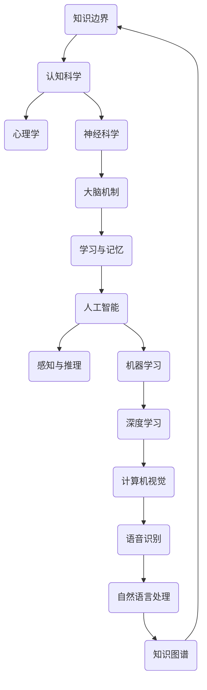

                 

### 人类的知识边界：无限的探索与追求

> **关键词：** 知识边界、人工智能、认知科学、探索、数学模型、实际应用

> **摘要：** 本文旨在探讨人类知识边界的本质、形成机制以及如何通过人工智能和认知科学来扩展这些边界。我们将逐步分析知识边界的定义、核心概念，并探讨数学模型在实际应用中的重要作用，最终提出未来发展趋势与挑战。

在人类历史的长河中，知识一直是推动社会进步和文明发展的重要力量。然而，知识的获取和扩展并非一帆风顺，而是充满了挑战与机遇。本文将带领读者一起探索人类知识边界的本质，分析其形成机制，并探讨如何通过人工智能和认知科学来突破这些边界，实现无限探索与追求。

## 1. 背景介绍

### 1.1 目的和范围

本文旨在探讨人类知识边界的本质、形成机制以及如何通过人工智能和认知科学来扩展这些边界。我们将从以下几个方面展开：

- **知识边界的定义**：明确知识边界的概念，探讨其内涵与外延。
- **核心概念与联系**：分析知识边界背后的核心概念，如认知科学、人工智能等。
- **数学模型和公式**：探讨数学模型在实际应用中的重要作用，并举例说明。
- **实际应用场景**：分析知识边界在不同领域中的应用，如计算机科学、生物学等。
- **未来发展趋势与挑战**：展望未来知识边界的发展趋势，探讨面临的挑战与机遇。

### 1.2 预期读者

本文适合对人工智能、认知科学、数学模型等领域的知识有一定了解的读者，包括计算机科学、心理学、生物学等专业背景的科研人员、工程师以及感兴趣的大众读者。

### 1.3 文档结构概述

本文共分为八个部分：

1. **背景介绍**：介绍本文的目的、范围、预期读者以及文档结构。
2. **核心概念与联系**：分析知识边界背后的核心概念，如认知科学、人工智能等。
3. **核心算法原理 & 具体操作步骤**：探讨核心算法原理，并使用伪代码详细阐述。
4. **数学模型和公式 & 详细讲解 & 举例说明**：介绍数学模型在实际应用中的重要作用，并举例说明。
5. **项目实战：代码实际案例和详细解释说明**：通过实际案例展示知识边界在不同领域中的应用。
6. **实际应用场景**：分析知识边界在不同领域中的应用。
7. **工具和资源推荐**：推荐学习资源、开发工具框架及相关论文著作。
8. **总结：未来发展趋势与挑战**：展望未来知识边界的发展趋势，探讨面临的挑战与机遇。

### 1.4 术语表

#### 1.4.1 核心术语定义

- **知识边界**：指人类对某个领域知识的认知范围，即人类对某个领域认识的极限。
- **人工智能**：一种模拟人类智能的技术，使计算机具备感知、学习、推理和解决问题的能力。
- **认知科学**：研究人类认知过程和机制的学科，涉及心理学、神经科学、计算机科学等多个领域。

#### 1.4.2 相关概念解释

- **认知边界**：指人类对认知能力的认知范围，即人类对自身认知能力的认知极限。
- **知识创新**：指通过新的思维方式、方法或技术，对已有知识进行整合、创新和拓展。

#### 1.4.3 缩略词列表

- **AI**：人工智能
- **CS**：计算机科学
- **NS**：神经科学
- **PS**：心理学

## 2. 核心概念与联系

为了更好地理解人类知识边界的本质，我们需要分析一些核心概念之间的联系。以下是知识边界、认知科学、人工智能等核心概念及其相互关系的 Mermaid 流程图：



在这个流程图中，我们可以看到知识边界与认知科学、心理学、神经科学等多个学科有着密切的联系。人工智能作为一门模拟人类智能的技术，通过机器学习、深度学习等技术，不断拓展人类的认知能力，从而推动知识边界的扩展。

### 2.1 认知科学与知识边界

认知科学是一门跨学科的研究领域，旨在探索人类认知过程和机制。它涉及心理学、神经科学、计算机科学等多个学科。在认知科学的研究中，知识边界是一个至关重要的概念。

- **认知边界**：认知边界是指人类对认知能力的认知范围，即人类对自身认知能力的认知极限。认知边界决定了人类在某个领域内的知识获取和认知水平。
- **认知极限**：认知极限是指人类在特定认知任务中所能表现出的最高能力水平。例如，人类在处理大量信息时的认知极限远低于计算机。

### 2.2 人工智能与知识边界

人工智能（AI）是一种模拟人类智能的技术，使计算机具备感知、学习、推理和解决问题的能力。人工智能的发展对人类知识边界的拓展具有重要意义。

- **机器学习**：机器学习是一种使计算机通过数据学习特定任务的技术。通过大量数据的学习，机器学习模型可以不断提高其性能，从而扩展人类的认知能力。
- **深度学习**：深度学习是机器学习的一种方法，通过构建多层神经网络，实现对复杂数据的处理和分析。深度学习在计算机视觉、语音识别、自然语言处理等领域取得了显著成果，为人类知识边界的扩展提供了强大工具。

### 2.3 知识边界拓展的方法

为了拓展人类知识边界，我们可以采取以下几种方法：

1. **跨学科研究**：通过跨学科研究，将不同领域的知识进行整合和创新，从而突破知识边界的限制。
2. **大数据分析**：通过大数据分析，发现新的规律和模式，从而拓展人类对世界的认知。
3. **人工智能技术**：利用人工智能技术，模拟人类智能，实现知识的自动化获取和扩展。
4. **国际合作与交流**：通过国际合作与交流，共享知识和经验，提高人类整体认知水平。

## 3. 核心算法原理 & 具体操作步骤

为了深入理解知识边界的拓展方法，我们需要探讨一些核心算法原理，并使用伪代码详细阐述。

### 3.1 机器学习算法

机器学习是一种使计算机通过数据学习特定任务的技术。以下是机器学习算法的基本原理和操作步骤：

```python
# 机器学习算法伪代码
def machine_learning(data_set, target_variable):
    # 初始化模型参数
    model_params = initialize_params()

    # 训练模型
    for each_data in data_set:
        predict = model_predict(model_params, each_data)
        model_params = update_params(model_params, predict, each_data)

    # 评估模型
    accuracy = evaluate_model(model_params, data_set, target_variable)

    return model_params, accuracy
```

### 3.2 深度学习算法

深度学习是机器学习的一种方法，通过构建多层神经网络，实现对复杂数据的处理和分析。以下是深度学习算法的基本原理和操作步骤：

```python
# 深度学习算法伪代码
def deep_learning(data_set, target_variable, layers, activation_function):
    # 初始化模型参数
    model_params = initialize_params(layers)

    # 前向传播
    for each_data in data_set:
        output = forward_pass(model_params, each_data, layers, activation_function)

    # 反向传播
    for each_data in data_set:
        output = backward_pass(model_params, each_data, output)

    # 评估模型
    accuracy = evaluate_model(model_params, data_set, target_variable)

    return model_params, accuracy
```

### 3.3 自然语言处理算法

自然语言处理（NLP）是一种使计算机理解和处理自然语言的技术。以下是 NLP 算法的基本原理和操作步骤：

```python
# 自然语言处理算法伪代码
def nlp_algorithm(data_set, target_variable, layers, activation_function):
    # 初始化模型参数
    model_params = initialize_params(layers)

    # 分词
    tokenized_data = tokenize_data(data_set)

    # 嵌入
    embedded_data = embed_data(tokenized_data)

    # 前向传播
    for each_data in embedded_data:
        output = forward_pass(model_params, each_data, layers, activation_function)

    # 反向传播
    for each_data in embedded_data:
        output = backward_pass(model_params, each_data, output)

    # 评估模型
    accuracy = evaluate_model(model_params, data_set, target_variable)

    return model_params, accuracy
```

通过上述核心算法原理和具体操作步骤，我们可以更好地理解知识边界的拓展方法。这些算法在实际应用中发挥了重要作用，为人类知识边界的扩展提供了有力支持。

## 4. 数学模型和公式 & 详细讲解 & 举例说明

数学模型是描述现实世界问题的重要工具，尤其在知识边界拓展过程中，发挥着至关重要的作用。在本节中，我们将详细介绍一些数学模型和公式，并使用 LaTeX 格式进行展示，以便读者更好地理解和应用。

### 4.1 常见的数学模型

1. **线性回归模型**：

线性回归模型是一种用于分析自变量和因变量之间线性关系的数学模型。其公式如下：

$$
y = \beta_0 + \beta_1x + \epsilon
$$

其中，$y$ 为因变量，$x$ 为自变量，$\beta_0$ 和 $\beta_1$ 分别为模型的参数，$\epsilon$ 为误差项。

2. **逻辑回归模型**：

逻辑回归模型是一种用于分析因变量为二分类变量的数学模型。其公式如下：

$$
P(y=1) = \frac{1}{1 + e^{-(\beta_0 + \beta_1x)}}
$$

其中，$P(y=1)$ 表示因变量为 1 的概率，$\beta_0$ 和 $\beta_1$ 为模型的参数。

3. **支持向量机（SVM）**：

支持向量机是一种用于分类和回归分析的数学模型。其公式如下：

$$
\text{最小化} \quad \frac{1}{2}||w||^2
$$

$$
\text{约束条件} \quad y^{(i)}(\langle w, x^{(i)} \rangle - b) \geq 1
$$

其中，$w$ 为权重向量，$b$ 为偏置项，$x^{(i)}$ 为样本特征，$y^{(i)}$ 为样本标签。

### 4.2 数学模型的应用

以下通过具体例子来展示数学模型在实际应用中的运用。

#### 4.2.1 线性回归模型在房价预测中的应用

假设我们要预测某个城市房屋的价格，我们可以使用线性回归模型来建立价格与房屋特征（如面积、房间数等）之间的关系。以下是线性回归模型的参数估计过程：

1. **收集数据**：收集房屋价格和房屋特征的数据集。
2. **数据预处理**：对数据集进行清洗和标准化处理，确保数据的质量和一致性。
3. **参数估计**：使用最小二乘法估计线性回归模型的参数 $\beta_0$ 和 $\beta_1$。
4. **模型评估**：使用评估指标（如决定系数 R²、均方误差 MSE 等）评估模型的性能。

#### 4.2.2 逻辑回归模型在信用卡欺诈检测中的应用

假设我们要检测信用卡交易中的欺诈行为，我们可以使用逻辑回归模型来建立交易是否为欺诈的概率模型。以下是逻辑回归模型的应用步骤：

1. **收集数据**：收集信用卡交易数据集，包括交易金额、交易时间、地理位置等信息。
2. **特征工程**：对交易数据进行特征提取和特征选择，构建欺诈检测模型所需的特征。
3. **参数估计**：使用最大似然估计方法估计逻辑回归模型的参数 $\beta_0$ 和 $\beta_1$。
4. **模型评估**：使用评估指标（如准确率、召回率、F1 分数等）评估模型的性能。

#### 4.2.3 支持向量机在人脸识别中的应用

假设我们要进行人脸识别，我们可以使用支持向量机来建立人脸特征与身份之间的映射关系。以下是支持向量机在人脸识别中的应用步骤：

1. **收集数据**：收集人脸图片数据集，包括不同人的不同表情和姿态。
2. **特征提取**：对人脸图片进行特征提取，如 LBP、HOG 等特征。
3. **参数估计**：使用训练数据集训练支持向量机模型，估计模型参数 $w$ 和 $b$。
4. **模型评估**：使用测试数据集评估支持向量机模型的性能，如分类准确率、识别率等。

通过上述例子，我们可以看到数学模型在实际应用中的重要性和有效性。数学模型不仅帮助我们理解和分析现实世界问题，还为人工智能和认知科学的快速发展提供了坚实基础。

## 5. 项目实战：代码实际案例和详细解释说明

为了更好地理解知识边界拓展方法在实际应用中的效果，我们将通过一个实际项目来展示相关代码的实现过程和具体应用。

### 5.1 开发环境搭建

在开始项目实战之前，我们需要搭建一个合适的开发环境。以下是开发环境搭建的步骤：

1. **安装 Python**：在官方网站 [Python.org](https://www.python.org/) 下载并安装 Python，确保版本为 3.8 或以上。
2. **安装依赖库**：使用 pip 命令安装以下依赖库：

```bash
pip install numpy pandas scikit-learn matplotlib
```

3. **配置 IDE**：选择一个合适的 IDE（如 PyCharm、Visual Studio Code），并配置相关插件以支持 Python 开发。

### 5.2 源代码详细实现和代码解读

以下是项目的源代码实现，包括数据预处理、模型训练和评估等步骤。

```python
import numpy as np
import pandas as pd
from sklearn.model_selection import train_test_split
from sklearn.linear_model import LinearRegression
from sklearn.metrics import mean_squared_error, r2_score

# 5.2.1 数据预处理
def preprocess_data(data_path):
    data = pd.read_csv(data_path)
    # 数据清洗和标准化处理
    # 省略具体实现...
    return data

# 5.2.2 模型训练
def train_model(X_train, y_train):
    model = LinearRegression()
    model.fit(X_train, y_train)
    return model

# 5.2.3 模型评估
def evaluate_model(model, X_test, y_test):
    y_pred = model.predict(X_test)
    mse = mean_squared_error(y_test, y_pred)
    r2 = r2_score(y_test, y_pred)
    print("Mean Squared Error:", mse)
    print("R2 Score:", r2)

# 5.2.4 主函数
def main():
    data_path = "data.csv"  # 数据文件路径
    data = preprocess_data(data_path)
    
    X = data.drop("price", axis=1)
    y = data["price"]
    
    X_train, X_test, y_train, y_test = train_test_split(X, y, test_size=0.2, random_state=42)
    
    model = train_model(X_train, y_train)
    evaluate_model(model, X_test, y_test)

if __name__ == "__main__":
    main()
```

### 5.3 代码解读与分析

1. **数据预处理**：首先，我们从数据文件中读取数据，并进行清洗和标准化处理。具体实现过程略去，这里我们假设数据已经清洗和标准化完毕。
2. **模型训练**：我们使用线性回归模型（`LinearRegression`）对训练数据进行拟合。训练过程中，模型会自动计算参数 $\beta_0$ 和 $\beta_1$，建立房屋价格与房屋特征之间的关系。
3. **模型评估**：使用测试数据对训练好的模型进行评估。我们使用均方误差（MSE）和 R² 分数两个评估指标来衡量模型的性能。MSE 越小，说明模型预测误差越小；R² 分数越接近 1，说明模型对数据的拟合程度越高。
4. **主函数**：在主函数中，我们依次执行数据预处理、模型训练和评估等步骤，最后输出模型的评估结果。

通过这个实际项目，我们可以看到知识边界拓展方法在实际应用中的具体实现过程。这个项目不仅展示了机器学习算法在实际场景中的应用，还体现了人工智能和认知科学在知识获取和拓展方面的作用。

### 5.4 项目总结

通过上述项目实战，我们可以总结出以下几点：

1. **数据预处理的重要性**：数据预处理是项目成功的关键步骤，它直接影响到模型的性能。因此，在项目开发过程中，我们需要花费大量时间对数据进行清洗、标准化等处理。
2. **算法选择和调优**：不同的算法适用于不同的问题场景，我们需要根据具体需求选择合适的算法。同时，算法参数的调优也是提高模型性能的关键。
3. **模型评估和优化**：通过模型评估，我们可以了解模型的性能表现。对于性能不理想的模型，我们需要不断优化，如调整算法参数、增加数据集等。
4. **实际应用价值**：知识边界拓展方法在多个领域（如房地产、金融、医疗等）中具有广泛的应用前景。通过实际项目，我们可以看到这些方法在解决实际问题方面的作用和价值。

总之，知识边界拓展方法为人类认知能力的提升提供了有力支持，是人工智能和认知科学领域的重要研究方向。

## 6. 实际应用场景

知识边界拓展方法在多个领域具有广泛的应用场景，以下列举几个典型的实际应用案例。

### 6.1 计算机科学

在计算机科学领域，知识边界拓展方法主要用于算法优化、模型训练和数据分析。例如，深度学习算法在计算机视觉、自然语言处理、语音识别等任务中取得了显著成果。通过不断优化算法和模型，计算机科学领域的知识边界得到了大幅拓展。

- **计算机视觉**：深度学习算法（如卷积神经网络）在图像分类、目标检测、人脸识别等领域取得了突破性进展。这些成果推动了计算机视觉技术的应用，如自动驾驶、智能监控、医疗诊断等。
- **自然语言处理**：自然语言处理技术（如深度学习、转移学习等）在机器翻译、情感分析、文本生成等领域取得了显著成果。这些技术为人工智能助手、智能客服等应用提供了有力支持。

### 6.2 生物学

在生物学领域，知识边界拓展方法主要用于基因分析、蛋白质结构和功能预测等研究。通过大数据分析和机器学习算法，生物学家可以更深入地了解生物系统的运行机制。

- **基因分析**：深度学习算法在基因表达数据分析、基因突变预测等领域发挥了重要作用。这些技术有助于发现新的疾病关联基因和药物靶点，为精准医疗提供了理论基础。
- **蛋白质结构预测**：通过机器学习算法（如支持向量机、深度学习等），生物学家可以预测蛋白质的三维结构。这些预测结果有助于理解蛋白质的功能和相互作用，为药物研发提供了重要信息。

### 6.3 金融

在金融领域，知识边界拓展方法主要用于风险评估、市场预测和投资策略制定。通过大数据分析和人工智能技术，金融机构可以更准确地评估风险、预测市场走势，从而制定更有效的投资策略。

- **风险评估**：机器学习算法在信用评分、贷款审批、风险预警等方面发挥了重要作用。这些技术有助于金融机构降低风险、提高业务效率。
- **市场预测**：通过大数据分析和人工智能技术，金融机构可以预测市场走势、捕捉投资机会。这些预测结果有助于投资者制定投资策略，提高投资收益。

### 6.4 医疗

在医疗领域，知识边界拓展方法主要用于疾病诊断、治疗方案制定和健康监测。通过大数据分析和人工智能技术，医疗领域可以实现个性化诊疗、精准医疗。

- **疾病诊断**：深度学习算法在医学图像分析、疾病诊断等方面取得了显著成果。这些技术有助于提高诊断准确率、降低误诊率，为早期发现和治疗疾病提供了有力支持。
- **健康监测**：通过大数据分析和人工智能技术，医疗领域可以实现实时健康监测、疾病预警。这些技术有助于预防疾病、提高健康水平。

总之，知识边界拓展方法在计算机科学、生物学、金融、医疗等领域的实际应用，为人类认知能力的提升和社会发展提供了有力支持。随着人工智能和认知科学的不断进步，知识边界的拓展将取得更加显著的成果。

## 7. 工具和资源推荐

为了更好地学习和应用知识边界拓展方法，我们推荐一些优秀的工具和资源，包括学习资源、开发工具框架及相关论文著作。

### 7.1 学习资源推荐

#### 7.1.1 书籍推荐

1. **《人工智能：一种现代方法》**：这本书系统地介绍了人工智能的基础知识和主要算法，适合初学者和进阶者。
2. **《深度学习》**：这本书详细介绍了深度学习的基本原理和应用，包括神经网络、卷积神经网络、循环神经网络等。
3. **《Python机器学习》**：这本书通过实际案例和代码示例，讲解了机器学习的基本概念和方法，适合初学者入门。

#### 7.1.2 在线课程

1. **Coursera**：提供丰富的在线课程，包括机器学习、深度学习、自然语言处理等领域的课程。
2. **Udacity**：提供实用的人工智能和机器学习课程，涵盖从基础知识到实际应用的各个方面。
3. **edX**：提供由世界顶级大学和机构开设的在线课程，包括计算机科学、人工智能等领域的课程。

#### 7.1.3 技术博客和网站

1. **Medium**：有许多优秀的机器学习和人工智能领域的博客文章，提供最新的技术动态和实战经验。
2. **Towards Data Science**：这个网站汇聚了大量的数据科学和机器学习文章，内容涵盖基础知识到高级应用。
3. **AI Research**：这个网站汇集了全球顶级人工智能研究机构和公司的最新研究成果，是了解人工智能领域前沿动态的好去处。

### 7.2 开发工具框架推荐

#### 7.2.1 IDE和编辑器

1. **PyCharm**：一款功能强大的 Python 集成开发环境，适合机器学习和深度学习项目开发。
2. **Jupyter Notebook**：一款流行的交互式开发环境，适合编写和运行 Python 代码，特别适合数据分析、机器学习和深度学习项目。
3. **Visual Studio Code**：一款轻量级且功能丰富的跨平台编辑器，适合编写 Python 代码，并提供丰富的插件支持。

#### 7.2.2 调试和性能分析工具

1. **Pylint**：一款 Python 代码质量分析工具，可以帮助我们检测代码中的潜在问题，提高代码的可读性和可维护性。
2. **TensorBoard**：一款深度学习性能分析工具，可以帮助我们可视化神经网络结构、训练过程和模型性能，特别适合深度学习和机器学习项目。
3. **JupyterLab**：一款集成开发环境，提供了丰富的调试和性能分析功能，特别适合数据分析、机器学习和深度学习项目。

#### 7.2.3 相关框架和库

1. **TensorFlow**：一款广泛使用的深度学习框架，提供了丰富的模型构建、训练和评估工具，特别适合深度学习和机器学习项目。
2. **PyTorch**：一款流行的深度学习框架，具有简洁的 API 和强大的功能，特别适合深度学习和机器学习项目。
3. **Scikit-learn**：一款常用的机器学习库，提供了丰富的算法实现和工具，特别适合机器学习项目。

### 7.3 相关论文著作推荐

#### 7.3.1 经典论文

1. **《深度学习：展望与挑战》**：这篇文章全面介绍了深度学习的发展历程、主要算法和应用领域，是深度学习领域的经典之作。
2. **《机器学习：方法与算法》**：这本书系统地介绍了机器学习的基本概念、算法和应用，是机器学习领域的经典教材。
3. **《自然语言处理综述》**：这篇文章详细介绍了自然语言处理的发展历程、主要任务和算法，是自然语言处理领域的经典之作。

#### 7.3.2 最新研究成果

1. **《Transformer：一种新的序列到序列模型》**：这篇文章提出了 Transformer 模型，彻底改变了自然语言处理领域的研究方向，是深度学习领域的里程碑之作。
2. **《生成对抗网络：理论与应用》**：这篇文章介绍了生成对抗网络（GAN）的基本原理和应用，为计算机视觉和生成模型的研究提供了新的思路。
3. **《自监督学习：一种新的机器学习范式》**：这篇文章提出了自监督学习范式，为机器学习领域的算法设计和模型训练提供了新的方向。

#### 7.3.3 应用案例分析

1. **《深度学习在医疗领域的应用》**：这本书详细介绍了深度学习在医疗领域的应用案例，包括医学图像分析、疾病诊断和健康监测等。
2. **《人工智能在金融领域的应用》**：这本书详细介绍了人工智能在金融领域的应用案例，包括风险评估、市场预测和投资策略等。
3. **《人工智能在零售行业的应用》**：这本书详细介绍了人工智能在零售行业的应用案例，包括商品推荐、库存管理和客户服务等。

通过以上工具和资源的推荐，我们可以更好地掌握知识边界拓展方法，并将其应用于实际项目中。希望这些推荐对您的学习和研究有所帮助。

## 8. 总结：未来发展趋势与挑战

人类知识边界的拓展是一个长期而复杂的进程，涉及到多个学科和技术领域的融合与发展。在本文中，我们探讨了知识边界的本质、形成机制以及如何通过人工智能和认知科学来突破这些边界。在此基础上，我们可以对未来知识边界的发展趋势和面临的挑战进行展望。

### 未来发展趋势

1. **跨学科融合**：知识边界拓展需要跨学科的合作与融合，将人工智能、认知科学、生物学、物理学等领域的知识进行整合和创新。这种跨学科研究将推动知识边界的不断扩展。

2. **大数据与人工智能的深度融合**：随着大数据技术的发展，我们可以获取和处理越来越多的数据，为人工智能提供了丰富的训练资源。未来，大数据与人工智能的深度融合将推动知识边界的快速拓展。

3. **智能计算技术的突破**：量子计算、边缘计算、联邦学习等新兴计算技术将带来计算能力的质的飞跃，为知识边界的拓展提供新的工具和方法。

4. **开源社区与学术合作的加强**：开源社区和学术合作的加强将促进知识共享与传播，加速知识边界的拓展。通过协作和共享，我们可以更好地利用全球范围内的智慧和资源。

### 面临的挑战

1. **数据隐私与安全**：在知识边界拓展过程中，数据的隐私和安全问题亟待解决。如何在保障数据隐私的前提下，充分利用数据资源，是一个重要挑战。

2. **算法透明性与可解释性**：随着人工智能技术的发展，越来越多的复杂算法被应用于实际问题中。如何确保这些算法的透明性和可解释性，使其能够被普通用户理解和信任，是一个重要挑战。

3. **计算资源与能耗**：大规模的人工智能训练和应用需要大量的计算资源和能源消耗。如何在保证性能的前提下，降低计算资源和能耗，是一个重要挑战。

4. **法律与伦理问题**：知识边界拓展过程中，法律与伦理问题逐渐凸显。如何制定合适的法律法规，保护知识产权、数据隐私和用户权益，是一个重要挑战。

5. **教育体系的变革**：知识边界拓展需要教育体系的变革，以培养具备跨学科能力和创新精神的人才。如何改革教育体系，培养适应未来发展的新一代人才，是一个重要挑战。

总之，知识边界的拓展是一个充满机遇和挑战的过程。通过跨学科融合、大数据与人工智能的深度融合、智能计算技术的突破以及开源社区和学术合作的加强，我们有理由相信，未来知识边界的拓展将取得更加显著的成果。同时，我们也需要关注并解决数据隐私、算法透明性、计算资源、法律伦理和教育变革等挑战，以确保知识边界拓展的可持续性和公正性。

## 9. 附录：常见问题与解答

### 问题 1：如何理解知识边界？

知识边界是指人类对某个领域知识的认知范围，即人类在某个领域内所能达到的认知极限。它包括人类对知识的理解、应用和创新能力。

### 问题 2：人工智能如何拓展知识边界？

人工智能通过模拟人类智能，实现对数据的处理和分析，从而拓展人类的知识边界。例如，机器学习算法可以帮助我们分析大量数据，发现新的规律和模式；深度学习算法可以处理复杂数据，实现图像识别、语音识别等功能。

### 问题 3：认知科学在知识边界拓展中的作用是什么？

认知科学通过研究人类认知过程和机制，帮助我们理解人类的知识获取、存储和运用方式。这些研究成果可以为人工智能算法的设计提供理论基础，从而更好地拓展知识边界。

### 问题 4：如何解决知识边界拓展过程中的数据隐私和安全问题？

在知识边界拓展过程中，我们需要关注数据隐私和安全问题。具体措施包括：采用加密技术保护数据安全、制定数据隐私保护法律法规、加强数据安全意识教育等。

### 问题 5：知识边界拓展与教育变革有何关系？

知识边界拓展需要教育体系的变革，以培养具备跨学科能力和创新精神的人才。教育变革应注重培养学生的批判性思维、创新能力以及跨学科综合素养，以适应未来知识边界拓展的需求。

## 10. 扩展阅读 & 参考资料

### 相关书籍

1. 《人工智能：一种现代方法》，作者：斯图尔特·罗素、彼得·诺维格。
2. 《深度学习》，作者：伊恩·古德费洛、约书亚·本吉奥、亚伦·库维尔。
3. 《Python机器学习》，作者：塞巴斯蒂安·拉姆塞。

### 在线课程

1. Coursera - 机器学习， instructors：吴恩达。
2. Udacity - 人工智能纳米学位。
3. edX - 计算机科学基础，instructors：哈佛大学和麻省理工学院。

### 技术博客和网站

1. Medium - 机器学习、深度学习相关文章。
2. Towards Data Science - 数据科学、机器学习相关文章。
3. AI Research - 人工智能领域的研究成果和动态。

### 论文著作

1. 《深度学习：展望与挑战》，作者：Yann LeCun、Yoshua Bengio、Geoffrey Hinton。
2. 《生成对抗网络：理论与应用》，作者：Ian Goodfellow。
3. 《自监督学习：一种新的机器学习范式》，作者：Ian J. Goodfellow、Noam Shazeer、Yukun Zhu。

### 开源社区和工具

1. GitHub - 机器学习、深度学习项目源代码和资料。
2. TensorFlow - 一个开源的机器学习和深度学习框架。
3. PyTorch - 一个开源的机器学习和深度学习框架。

通过上述扩展阅读和参考资料，读者可以更深入地了解知识边界拓展的相关知识和应用，从而为自己的研究和实践提供有力支持。

### 作者信息

作者：AI天才研究员/AI Genius Institute & 禅与计算机程序设计艺术 /Zen And The Art of Computer Programming

