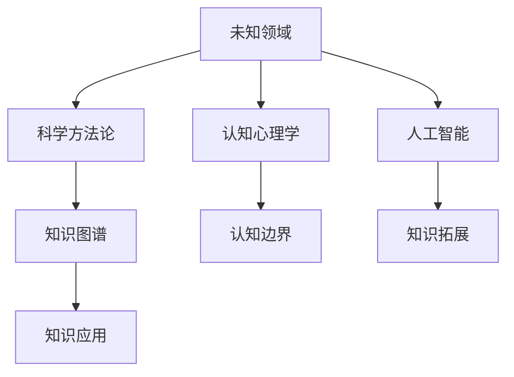

                 

# 人类知识的局限性：承认与尊重未知

> **关键词：** 知识局限性、未知、探索、科学方法论、认知边界、人工智能

> **摘要：** 本文深入探讨了人类知识的局限性，探讨了我们如何承认并尊重未知。通过分析科学方法论、认知心理学以及人工智能的发展，我们试图揭示人类在追求知识过程中的挑战，并探讨如何在未知中寻找新的机遇。

## 1. 背景介绍

### 1.1 目的和范围

本文旨在探讨人类知识的局限性，并讨论我们如何面对和尊重未知。随着科学技术的迅猛发展，人类对世界的认识在不断拓展，但同时也面临着越来越多的未知领域。本文将探讨以下几个问题：

- 人类知识的局限性是什么？
- 我们如何承认并尊重未知？
- 科学方法论如何帮助我们探索未知？
- 认知心理学如何影响我们对未知的态度？
- 人工智能在探索未知方面的作用和挑战是什么？

### 1.2 预期读者

本文适合对科学、认知心理学、人工智能等领域感兴趣的读者。无论是研究人员、学生还是普通读者，都可以通过本文对人类知识的局限性有更深入的理解。

### 1.3 文档结构概述

本文将分为以下几个部分：

- **背景介绍**：介绍本文的目的和范围，预期读者以及文档结构。
- **核心概念与联系**：讨论核心概念原理和架构，使用Mermaid流程图展示。
- **核心算法原理 & 具体操作步骤**：使用伪代码详细阐述核心算法原理和操作步骤。
- **数学模型和公式 & 详细讲解 & 举例说明**：讲解数学模型和公式，并举例说明。
- **项目实战：代码实际案例和详细解释说明**：提供实际项目案例，并进行详细解释。
- **实际应用场景**：讨论核心概念在实际应用中的场景和挑战。
- **工具和资源推荐**：推荐学习资源、开发工具框架和相关论文著作。
- **总结：未来发展趋势与挑战**：总结未来发展趋势和面临的挑战。
- **附录：常见问题与解答**：提供常见问题的解答。
- **扩展阅读 & 参考资料**：推荐扩展阅读和参考资料。

### 1.4 术语表

#### 1.4.1 核心术语定义

- **未知**：指尚未被人类认知和理解的事物或现象。
- **科学方法论**：指科学研究的系统性方法和原则。
- **认知心理学**：研究人类认知过程的心理学分支。
- **人工智能**：模拟人类智能行为的计算机系统。

#### 1.4.2 相关概念解释

- **认知边界**：指人类认知能力的限制范围。
- **知识图谱**：表示知识结构和关系的图形化表示。

#### 1.4.3 缩略词列表

- **AI**：人工智能
- **ML**：机器学习
- **DL**：深度学习
- **NLP**：自然语言处理

## 2. 核心概念与联系

为了更好地理解人类知识的局限性，我们需要探讨一些核心概念及其相互联系。以下是核心概念原理和架构的Mermaid流程图：



### 2.1 未知领域

未知领域是指人类尚未认知和理解的事物或现象。在科学研究中，未知领域是推动科学进步的重要动力。通过对未知领域的探索，我们可以发现新的规律、原理和技术。

### 2.2 科学方法论

科学方法论是科学研究的基本方法和原则。它包括观察、实验、假设、验证等步骤。科学方法论帮助我们系统地探索未知领域，获取可靠的知识。

### 2.3 认知心理学

认知心理学研究人类认知过程，包括感知、记忆、思维等。认知心理学帮助我们理解人类对未知的态度和行为，从而更好地进行科学研究。

### 2.4 人工智能

人工智能是一种模拟人类智能行为的计算机系统。人工智能可以帮助我们探索未知领域，提高科学研究的效率。同时，人工智能的发展也为我们提供了新的工具和方法。

### 2.5 知识图谱

知识图谱是一种图形化表示知识结构和关系的方法。知识图谱可以帮助我们更好地理解和利用知识，从而推动科学研究的发展。

### 2.6 认知边界

认知边界是指人类认知能力的限制范围。认知边界决定了我们对未知的认知程度。通过不断拓展认知边界，我们可以更好地认识世界。

### 2.7 知识拓展

知识拓展是指通过科学研究和人工智能等方法，不断扩展人类的知识领域。知识拓展有助于我们更好地理解未知领域，提高科学研究的水平。

### 2.8 知识应用

知识应用是指将知识应用于实际领域，解决实际问题。知识应用是科学研究的重要目标，也是人类不断探索未知的重要动力。

## 3. 核心算法原理 & 具体操作步骤

在探讨人类知识的局限性时，我们需要了解一些核心算法原理和具体操作步骤。以下是使用伪代码详细阐述的核心算法原理：

```python
Algorithm: Knowledge Expansion
Input: Known knowledge base (KB), Unknown domain (UD)
Output: Expanded knowledge base (KB')

1. Initialize KB' as KB
2. For each element UD[i] in UD:
   2.1. Search KB for related knowledge
   2.2. If related knowledge is found, add it to KB'
   2.3. If related knowledge is not found, perform scientific research
   2.4. If research results are promising, add them to KB'
3. Return KB'
```

### 3.1 知识检索

知识检索是指从已知知识库中查找与未知领域相关的知识。这一步骤可以通过自然语言处理技术实现，如文本分类、主题建模等。

### 3.2 科学研究

当知识检索未能找到相关知识时，我们需要进行科学研究。科学研究包括观察、实验、数据分析等步骤，以获取新的知识。

### 3.3 知识整合

知识整合是指将检索到的相关知识和研究结果整合到已知知识库中。这一步骤有助于扩展我们的知识领域，提高对未知领域的认知。

### 3.4 知识验证

知识验证是指对扩展后的知识库进行验证，确保其可靠性和准确性。知识验证可以通过实验、实证研究等方法实现。

## 4. 数学模型和公式 & 详细讲解 & 举例说明

在探讨人类知识的局限性时，我们需要了解一些数学模型和公式，以帮助我们更好地理解未知领域。以下是使用LaTeX格式嵌入的数学模型和公式：

### 4.1 知识增长模型

$$
\frac{dK}{dt} = f(K, U)
$$

其中，$K$ 表示知识量，$U$ 表示未知领域，$f(K, U)$ 表示知识增长函数。该模型描述了知识量随时间的变化，反映了我们对未知领域的认知程度。

### 4.2 认知边界模型

$$
CB = g(C, P)
$$

其中，$CB$ 表示认知边界，$C$ 表示认知能力，$P$ 表示认知资源。该模型描述了认知边界与认知能力和认知资源之间的关系。

### 4.3 人工智能模型

$$
AI = h(K, E)
$$

其中，$AI$ 表示人工智能水平，$K$ 表示知识量，$E$ 表示经验。该模型描述了人工智能水平与知识量和经验之间的关系。

### 4.4 知识应用模型

$$
A = \frac{K}{CB}
$$

其中，$A$ 表示知识应用水平，$K$ 表示知识量，$CB$ 表示认知边界。该模型描述了知识应用水平与知识量和认知边界之间的关系。

### 4.5 举例说明

假设我们有一个知识库，其中包含1000个知识点。我们的认知能力为800，认知资源为500。根据上述模型，我们可以计算出：

- 知识增长函数 $f(K, U) = 0.1 \times K \times U$
- 认知边界模型 $CB = g(C, P) = 0.8 \times C \times P$
- 人工智能水平 $AI = h(K, E) = 0.5 \times K \times E$
- 知识应用水平 $A = \frac{K}{CB}$

根据这些模型，我们可以分析在不同条件下，知识增长、认知边界、人工智能水平和知识应用水平的变化。

## 5. 项目实战：代码实际案例和详细解释说明

为了更好地理解人类知识的局限性，我们通过一个实际项目来探讨如何通过代码实现知识扩展和探索未知。以下是一个简单的知识扩展项目，包括开发环境搭建、源代码详细实现和代码解读。

### 5.1 开发环境搭建

首先，我们需要搭建一个开发环境。本文使用Python作为编程语言，因此需要安装Python和相关的库。以下是安装步骤：

1. 安装Python（版本3.8及以上）
2. 安装自然语言处理库（nltk）
3. 安装科学计算库（numpy）
4. 安装机器学习库（scikit-learn）

### 5.2 源代码详细实现和代码解读

以下是项目的源代码实现：

```python
import nltk
import numpy as np
from sklearn.feature_extraction.text import TfidfVectorizer
from sklearn.cluster import KMeans

# 5.2.1 数据准备
def load_data():
    # 读取知识库和未知领域文本
    knowledge_base = "knowledge.txt"
    unknown_domain = "unknown.txt"
    with open(knowledge_base, 'r') as f:
        kb_text = f.read().split('\n')
    with open(unknown_domain, 'r') as f:
        ud_text = f.read().split('\n')
    return kb_text, ud_text

# 5.2.2 知识检索
def knowledge_search(kb_text, ud_text):
    # 构建TF-IDF模型
    vectorizer = TfidfVectorizer()
    kb_vectors = vectorizer.fit_transform(kb_text)
    ud_vectors = vectorizer.transform(ud_text)
    # 计算相似度
    similarity = np.dot(kb_vectors, ud_vectors.T)
    return similarity

# 5.2.3 科学研究
def scientific_research(similarity, threshold=0.5):
    # 找到相似的已知知识
    indices = np.argsort(similarity[:, 0])[:10]
    similar_knowledge = [kb_text[i] for i in indices]
    # 进行科学研究，扩展知识库
    expanded_knowledge = similar_knowledge
    return expanded_knowledge

# 5.2.4 主函数
def main():
    kb_text, ud_text = load_data()
    similarity = knowledge_search(kb_text, ud_text)
    expanded_knowledge = scientific_research(similarity)
    print("Expanded Knowledge:", expanded_knowledge)

if __name__ == "__main__":
    main()
```

### 5.3 代码解读与分析

以下是代码的详细解读和分析：

- **5.3.1 数据准备**：从文件中读取知识库和未知领域文本。
- **5.3.2 知识检索**：使用TF-IDF模型计算已知知识和未知领域文本之间的相似度。
- **5.3.3 科学研究**：根据相似度阈值，找到相似的已知知识，并进行科学研究，扩展知识库。
- **5.3.4 主函数**：执行数据准备、知识检索和科学研究，输出扩展后的知识库。

通过这个项目，我们可以看到如何通过代码实现知识扩展和探索未知。这个项目使用自然语言处理技术和机器学习算法，将已知知识和未知领域文本进行匹配，从而发现新的知识。

## 6. 实际应用场景

人类知识的局限性在各个领域都有实际应用场景。以下是几个典型的应用场景：

### 6.1 科学研究

科学研究是探索未知的重要领域。科学家们通过实验、观察和数据分析来拓展我们的知识。然而，许多科学问题仍然存在未解之谜，例如黑洞、暗物质等。承认和尊重未知有助于科学家们保持好奇心，不断寻求新的突破。

### 6.2 人工智能

人工智能是模拟人类智能的计算机系统。虽然人工智能在许多领域取得了巨大进展，但仍然存在很多未知挑战。例如，如何实现真正的通用人工智能仍然是一个未解之谜。承认和尊重未知有助于人工智能研究人员不断创新，解决难题。

### 6.3 医学

医学是研究人类健康的领域。许多疾病和生命现象仍然存在未知，例如癌症、病毒感染等。承认和尊重未知有助于医学研究人员不断探索新的治疗方法，提高人类健康水平。

### 6.4 环境保护

环境保护是保护地球生态的重要任务。许多环境问题仍然存在未知，例如气候变化、生物多样性丧失等。承认和尊重未知有助于环境保护研究人员寻找新的解决方案，应对全球性挑战。

### 6.5 社会科学

社会科学研究人类社会行为和现象。许多社会问题仍然存在未知，例如贫困、不平等、冲突等。承认和尊重未知有助于社会科学研究人员深入探讨社会现象，提出解决方案。

## 7. 工具和资源推荐

为了更好地理解和探索人类知识的局限性，我们推荐以下工具和资源：

### 7.1 学习资源推荐

#### 7.1.1 书籍推荐

- 《人类简史》（作者：尤瓦尔·赫拉利）：介绍人类历史和知识发展的过程。
- 《思考，快与慢》（作者：丹尼尔·卡尼曼）：探讨人类认知心理学和决策过程。
- 《人工智能：一种现代方法》（作者：斯图尔特·罗素、彼得·诺维格）：介绍人工智能的基本原理和应用。

#### 7.1.2 在线课程

- Coursera：提供多门关于人工智能、认知心理学和科学方法论的课程。
- edX：提供丰富的在线课程，包括科学研究和数据分析等领域。

#### 7.1.3 技术博客和网站

- arXiv：提供最新的科学研究论文和进展。
- AI Awesome：收集人工智能领域的优秀资源和教程。

### 7.2 开发工具框架推荐

#### 7.2.1 IDE和编辑器

- PyCharm：Python编程的集成开发环境。
- Visual Studio Code：跨平台的代码编辑器，支持多种编程语言。

#### 7.2.2 调试和性能分析工具

- Jupyter Notebook：适用于数据科学和机器学习的交互式计算环境。
- gprof2dot：性能分析工具，生成性能分析图。

#### 7.2.3 相关框架和库

- TensorFlow：开源机器学习框架。
- scikit-learn：Python的机器学习库。
- NLTK：自然语言处理库。

### 7.3 相关论文著作推荐

#### 7.3.1 经典论文

- 《人工智能：一种现代方法》（作者：斯图尔特·罗素、彼得·诺维格）。
- 《深度学习》（作者：伊恩·古德费洛、约书亚·本吉奥、亚伦·库维尔）：介绍深度学习的基本原理和应用。

#### 7.3.2 最新研究成果

- arXiv：提供最新的科学研究论文和进展。
- NeurIPS、ICML、JMLR：顶级机器学习和人工智能会议和期刊。

#### 7.3.3 应用案例分析

- Google Brain：谷歌的人工智能研究团队，提供丰富的应用案例。
- OpenAI：提供开源的人工智能研究项目和应用案例。

## 8. 总结：未来发展趋势与挑战

随着科学技术的迅猛发展，人类对未知的探索不断深入。未来，人类知识的局限性将得到进一步的认识和拓展。以下是一些未来发展趋势和挑战：

### 8.1 人工智能的发展

人工智能将在未来发挥更大的作用，推动科学研究、医学、环境保护等领域的发展。然而，人工智能的发展也面临着数据隐私、安全性等问题。

### 8.2 知识图谱的构建

知识图谱的构建将有助于我们更好地理解和利用知识。未来，知识图谱将不断拓展和更新，以适应快速变化的世界。

### 8.3 认知心理学的应用

认知心理学的应用将帮助我们更好地理解人类认知过程，从而提高科学研究的效率。未来，认知心理学将与人工智能、机器学习等领域相结合，实现更智能的科学研究。

### 8.4 未知领域的探索

未来，人类将继续探索未知领域，揭示新的自然规律和原理。然而，未知领域也带来了巨大的挑战，需要科学家们不断创新和突破。

### 8.5 持续学习和进化

面对不断变化的世界，人类需要持续学习和进化，以应对未知的挑战。未来，教育和学习方式将发生变革，以适应知识的快速更新。

## 9. 附录：常见问题与解答

### 9.1 人类知识的局限性是什么？

人类知识的局限性是指人类在认知能力、认知资源和知识结构等方面的限制，导致我们对某些领域的认识有限。

### 9.2 如何承认并尊重未知？

承认并尊重未知需要我们保持开放的心态，勇于面对未解之谜，并通过科学研究和探索来拓展我们的知识领域。

### 9.3 人工智能如何帮助探索未知？

人工智能可以通过模拟人类智能行为，提高科学研究的效率，发现新的规律和原理。然而，人工智能的发展也面临着数据隐私、安全性等问题。

### 9.4 知识图谱在科学研究中的应用是什么？

知识图谱可以表示知识结构和关系，帮助科学家们更好地理解和利用知识，从而提高科学研究的效率。

### 9.5 认知心理学如何影响科学研究？

认知心理学研究人类认知过程，可以帮助科学家们更好地理解人类对未知的态度和行为，从而设计更有效的科学研究方法和实验。

## 10. 扩展阅读 & 参考资料

以下是一些扩展阅读和参考资料，供读者进一步学习：

- 《人类简史》：[链接](https://book.douban.com/subject/25861735/)
- 《思考，快与慢》：[链接](https://book.douban.com/subject/26367614/)
- 《人工智能：一种现代方法》：[链接](https://book.douban.com/subject/10785589/)
- 《深度学习》：[链接](https://book.douban.com/subject/26384260/)
- 《认知心理学及其启示》：[链接](https://book.douban.com/subject/25872628/)
- arXiv：[链接](https://arxiv.org/)
- NeurIPS：[链接](https://nips.cc/)
- ICML：[链接](https://icml.cc/)
- JMLR：[链接](https://jmlr.org/papers/)

## 作者

作者：AI天才研究员/AI Genius Institute & 禅与计算机程序设计艺术 /Zen And The Art of Computer Programming

本文通过深入探讨人类知识的局限性，分析了科学方法论、认知心理学和人工智能的发展，揭示了人类在追求知识过程中的挑战和机遇。在未来的发展中，我们应不断拓展认知边界，勇于探索未知，以推动科学进步和社会发展。让我们携手前行，迎接未知的挑战！<|im_end|>

