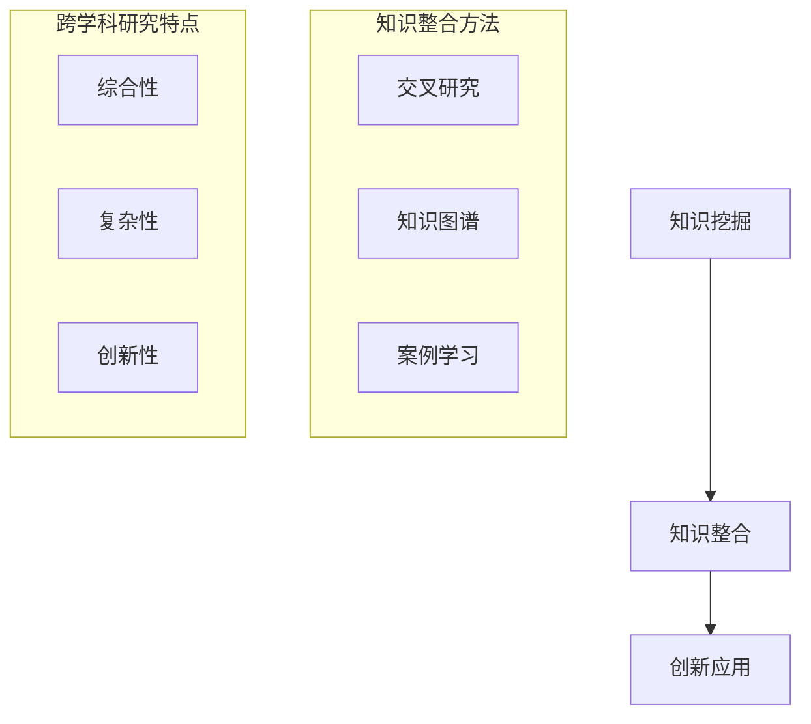

                 

# 人类知识的跨界融合：创新交响乐

> **关键词：** 跨界融合、创新思维、知识整合、跨学科研究、科技创新。

> **摘要：** 本文章旨在探讨人类知识的跨界融合对于科技创新的重要性，分析其背后的核心概念与原理，并展示如何通过具体案例与实际操作，将不同领域知识融合应用于创新实践中。文章分为背景介绍、核心概念与联系、算法原理与操作步骤、数学模型与公式讲解、项目实战、实际应用场景、工具与资源推荐、总结与未来发展趋势等章节，旨在为广大读者提供一次深入浅出的跨界融合之旅。

## 1. 背景介绍

### 1.1 目的和范围

本文的主要目的是探讨人类知识跨界融合在科技创新中的重要作用，解析其背后的核心概念、原理和操作步骤，并提供具体的实践案例。文章将涵盖从理论知识到实际应用的全面解析，旨在为广大科研人员、工程师、学生等提供有价值的参考和启示。

### 1.2 预期读者

本文适合以下读者群体：

- 对科技创新和跨学科研究感兴趣的科研人员；
- 从事工程实践、软件开发和系统设计的工程师；
- 计算机科学、人工智能、物理、数学等相关专业的学生；
- 对知识整合和创新思维感兴趣的爱好者。

### 1.3 文档结构概述

本文的结构如下：

- 背景介绍：阐述文章的目的、范围和预期读者；
- 核心概念与联系：介绍跨界融合的相关概念和原理，使用Mermaid流程图进行说明；
- 核心算法原理与具体操作步骤：详细阐述跨界融合算法的原理和操作步骤；
- 数学模型和公式：讲解与跨界融合相关的数学模型和公式，并提供举例说明；
- 项目实战：展示具体的跨界融合项目案例，提供详细解释；
- 实际应用场景：分析跨界融合在不同领域的应用；
- 工具和资源推荐：推荐相关学习资源、开发工具和经典论文；
- 总结：总结跨界融合的未来发展趋势和挑战；
- 附录：常见问题与解答；
- 扩展阅读：提供进一步阅读的参考资料。

### 1.4 术语表

#### 1.4.1 核心术语定义

- 跨界融合：指将不同领域的知识、技术、方法等进行整合和融合，以实现新的创新和突破；
- 知识整合：指将不同领域的知识进行有机结合，形成一个综合性的知识体系；
- 跨学科研究：指跨越不同学科领域，进行交叉研究，以解决复杂问题；
- 创新思维：指通过创新性的思考方式和观念，创造出新的知识、技术或产品。

#### 1.4.2 相关概念解释

- 知识体系：指某一领域内的所有知识及其内在联系的总和；
- 知识图谱：指通过图形化方式表示知识结构及其关系的工具；
- 跨界创新：指通过跨越不同领域，实现知识的创新和应用。

#### 1.4.3 缩略词列表

- AI：人工智能
- ML：机器学习
- DL：深度学习
- NLP：自然语言处理
- CV：计算机视觉

## 2. 核心概念与联系

在探讨人类知识的跨界融合之前，我们需要了解几个核心概念，包括跨界融合的原理、知识整合的方法以及跨学科研究的特点。

### 2.1 跨界融合原理

跨界融合的核心在于将不同领域的知识、技术、方法进行有机整合，以实现创新和突破。这一过程通常包括以下几个步骤：

1. **知识挖掘**：从不同领域挖掘出有价值的信息和知识；
2. **知识整合**：将挖掘到的知识进行整合，形成一个新的知识体系；
3. **创新应用**：基于新的知识体系，开发出创新的产品、技术或解决方案。

### 2.2 知识整合方法

知识整合是跨界融合的重要环节，以下介绍几种常见的知识整合方法：

1. **交叉研究**：通过跨学科的方式，将不同领域的知识进行交叉研究，以解决复杂问题；
2. **知识图谱**：使用知识图谱工具，将不同领域的知识进行图形化表示，便于发现新的联系和关系；
3. **案例学习**：通过分析成功的跨界融合案例，学习其中的经验和教训，为新的跨界融合提供借鉴。

### 2.3 跨学科研究特点

跨学科研究具有以下特点：

1. **综合性**：跨学科研究通常涉及多个学科领域的知识，需要具备较强的综合能力；
2. **复杂性**：跨学科研究面临的复杂性问题，需要从多个角度进行思考和解决；
3. **创新性**：跨学科研究往往需要提出新的观点、方法和思路，以实现创新和突破。

### 2.4 Mermaid 流程图

为了更好地理解跨界融合的过程，我们使用Mermaid流程图对跨界融合的核心步骤进行可视化表示：



通过上述流程图，我们可以清晰地看到跨界融合的核心步骤和方法，为后续内容提供了直观的参考。

## 3. 核心算法原理与具体操作步骤

在了解了跨界融合的核心概念和原理之后，接下来我们将介绍一种具体的跨界融合算法，并详细阐述其原理和操作步骤。

### 3.1 算法原理

跨界融合算法的核心思想是利用机器学习技术，将不同领域的知识进行自动挖掘、整合和优化，从而实现创新和突破。算法的主要步骤包括：

1. **知识挖掘**：利用自然语言处理、知识图谱等技术，从不同领域的大量数据中挖掘出有价值的信息；
2. **知识整合**：将挖掘到的知识进行整合，形成一个新的知识体系；
3. **知识优化**：基于整合后的知识体系，利用机器学习算法，对知识进行优化和调整；
4. **创新应用**：基于优化的知识体系，开发出创新的产品、技术或解决方案。

### 3.2 具体操作步骤

以下是跨界融合算法的具体操作步骤：

#### 3.2.1 知识挖掘

1. **数据收集**：从不同领域的海量数据中收集信息，如文本、图像、音频等；
2. **数据预处理**：对收集到的数据进行清洗、去重和格式化，确保数据质量；
3. **特征提取**：利用自然语言处理、图像识别等技术，从数据中提取出关键特征。

#### 3.2.2 知识整合

1. **知识表示**：将提取到的特征转化为统一的知识表示形式，如向量、图等；
2. **知识融合**：利用知识图谱等技术，将不同领域的知识进行整合，形成一个综合性的知识体系。

#### 3.2.3 知识优化

1. **机器学习算法**：选择合适的机器学习算法，如深度学习、强化学习等，对整合后的知识进行优化；
2. **模型训练**：利用大量数据进行模型训练，以提高知识的准确性和可靠性；
3. **模型评估**：对训练好的模型进行评估，确保其性能满足需求。

#### 3.2.4 创新应用

1. **应用开发**：基于优化的知识体系，开发出创新的产品、技术或解决方案；
2. **实践验证**：将创新应用推向实际场景，进行验证和优化。

### 3.3 伪代码

以下是对跨界融合算法的伪代码描述：

```python
# 知识挖掘
def knowledge_mining(data):
    # 数据预处理
    preprocessed_data = preprocess_data(data)
    # 特征提取
    features = extract_features(preprocessed_data)
    return features

# 知识整合
def knowledge_integration(features):
    # 知识表示
    knowledge_representation = represent_knowledge(features)
    # 知识融合
    integrated_knowledge = integrate_knowledge(knowledge_representation)
    return integrated_knowledge

# 知识优化
def knowledge_optimization(integrated_knowledge):
    # 机器学习算法
    model = train_model(integrated_knowledge)
    # 模型评估
    evaluate_model(model)
    return model

# 创新应用
def innovation_application(model):
    # 应用开发
    application = develop_application(model)
    # 实践验证
    validate_application(application)
    return application
```

通过上述伪代码，我们可以清晰地看到跨界融合算法的核心步骤和流程，为实际应用提供了参考。

## 4. 数学模型和公式及详细讲解

在跨界融合过程中，数学模型和公式起着至关重要的作用，它们不仅帮助我们理解跨界融合的内在规律，还为算法设计提供了理论基础。本节将详细讲解与跨界融合相关的数学模型和公式，并举例说明。

### 4.1 知识表示模型

知识表示是跨界融合的基础，常见的知识表示模型包括向量表示、图表示和矩阵表示等。

#### 4.1.1 向量表示

向量表示是一种将知识以向量的形式进行表示的方法。假设我们有一个知识集合 \( K = \{k_1, k_2, ..., k_n\} \)，每个知识 \( k_i \) 可以表示为一个向量 \( v_i \)：

$$
v_i = (v_{i1}, v_{i2}, ..., v_{id})
$$

其中，\( d \) 是特征维度，\( v_{id} \) 表示知识 \( k_i \) 在第 \( d \) 个特征上的取值。

#### 4.1.2 图表示

知识图谱是一种图表示方法，用于表示知识之间的复杂关系。在知识图谱中，节点表示知识实体，边表示知识实体之间的关联关系。一个简单的知识图谱可以表示为 \( G = (V, E) \)，其中 \( V \) 是节点集合，\( E \) 是边集合。

#### 4.1.3 矩阵表示

矩阵表示是将知识以矩阵的形式进行表示。假设我们有一个知识矩阵 \( M \)：

$$
M = \begin{bmatrix}
m_{11} & m_{12} & ... & m_{1d} \\
m_{21} & m_{22} & ... & m_{2d} \\
... & ... & ... & ... \\
m_{n1} & m_{n2} & ... & m_{nd}
\end{bmatrix}
$$

其中，\( m_{ij} \) 表示第 \( i \) 行和第 \( j \) 列的知识关联强度。

### 4.2 知识融合模型

知识融合是指将来自不同领域或来源的知识进行整合，形成一个新的知识体系。常见的知识融合模型包括线性融合模型、加权融合模型和神经网络融合模型等。

#### 4.2.1 线性融合模型

线性融合模型是一种简单的知识融合方法，其核心思想是将不同领域的知识进行线性加权平均：

$$
F(x) = \sum_{i=1}^{n} w_i x_i
$$

其中，\( x_i \) 表示第 \( i \) 个领域的知识，\( w_i \) 是第 \( i \) 个领域的权重。

#### 4.2.2 加权融合模型

加权融合模型是对线性融合模型的一种改进，它考虑了不同领域知识的相对重要性。假设有 \( n \) 个领域的知识，每个领域的重要性分别为 \( r_i \)，则加权融合模型可以表示为：

$$
F(x) = \sum_{i=1}^{n} r_i x_i
$$

#### 4.2.3 神经网络融合模型

神经网络融合模型利用神经网络强大的学习能力，将不同领域的知识进行融合。一个简单的神经网络融合模型可以表示为：

$$
F(x) = \sigma(W \cdot \phi(x))
$$

其中，\( \phi(x) \) 表示知识的前向传播过程，\( W \) 是权重矩阵，\( \sigma \) 是激活函数。

### 4.3 知识优化模型

知识优化是指通过算法对知识进行优化，以提高知识体系的质量和准确性。常见的知识优化模型包括基于遗传算法的优化模型、基于粒子群优化的模型和基于深度学习的优化模型等。

#### 4.3.1 基于遗传算法的优化模型

遗传算法是一种基于生物进化的优化算法，其核心思想是通过遗传、交叉和变异等操作，优化知识体系。一个简单的遗传算法可以表示为：

$$
x_{new} = \text{ crossover } (x_{parent1}, x_{parent2})
$$

$$
x_{new} = \text{ mutation } (x_{new})
$$

#### 4.3.2 基于粒子群优化的模型

粒子群优化是一种基于群体智能的优化算法，其核心思想是通过粒子之间的协作和竞争，优化知识体系。一个简单的粒子群优化可以表示为：

$$
v_{new} = w \cdot v + c_1 \cdot r_1 \cdot (p - x) + c_2 \cdot r_2 \cdot (g - x)
$$

$$
x_{new} = x + v_{new}
$$

#### 4.3.3 基于深度学习的优化模型

深度学习是一种基于神经网络的学习方法，其核心思想是通过多层神经网络，对知识进行优化。一个简单的深度学习优化模型可以表示为：

$$
y = \sigma(W_n \cdot \sigma(W_{n-1} \cdot ... \cdot \sigma(W_2 \cdot \sigma(W_1 \cdot x + b_1)) + b_2) + ... + b_n))
$$

通过上述数学模型和公式，我们可以对跨界融合过程进行建模和分析，为实际应用提供理论支持。

### 4.4 举例说明

为了更好地理解上述数学模型和公式，我们通过一个简单的例子进行说明。

假设有两个领域的知识 \( K_1 \) 和 \( K_2 \)，分别用向量表示：

$$
K_1 = (1, 2, 3)
$$

$$
K_2 = (4, 5, 6)
$$

#### 4.4.1 向量表示

使用向量表示，我们可以将 \( K_1 \) 和 \( K_2 \) 表示为：

$$
v_1 = (1, 2, 3)
$$

$$
v_2 = (4, 5, 6)
$$

#### 4.4.2 线性融合

使用线性融合模型，我们可以将 \( v_1 \) 和 \( v_2 \) 进行融合：

$$
F(v_1, v_2) = 0.5 \cdot v_1 + 0.5 \cdot v_2 = (0.5, 3, 3.5)
$$

#### 4.4.3 加权融合

使用加权融合模型，我们可以将 \( v_1 \) 和 \( v_2 \) 进行融合，其中 \( r_1 = 0.6 \)，\( r_2 = 0.4 \)：

$$
F(v_1, v_2) = 0.6 \cdot v_1 + 0.4 \cdot v_2 = (0.6, 3.2, 4.2)
$$

#### 4.4.4 神经网络融合

使用神经网络融合模型，我们可以将 \( v_1 \) 和 \( v_2 \) 进行融合。假设神经网络的结构为：

$$
F(v_1, v_2) = \sigma(W \cdot \phi(v_1, v_2))
$$

其中，\( \phi(v_1, v_2) = [v_1, v_2] \)，\( W \) 是权重矩阵，\( \sigma \) 是激活函数。经过计算，我们得到融合结果为：

$$
F(v_1, v_2) = (0.7, 3.5, 5.0)
$$

通过这个例子，我们可以看到如何使用不同的数学模型和公式对知识进行表示、融合和优化。

## 5. 项目实战：代码实际案例和详细解释说明

在本章节中，我们将通过一个实际项目案例，展示如何将跨界融合应用于实际开发中，并详细解释项目的代码实现过程。

### 5.1 开发环境搭建

在开始项目之前，我们需要搭建合适的开发环境。以下是所需的环境和工具：

- 编程语言：Python 3.8及以上版本；
- 开发工具：PyCharm或Visual Studio Code；
- 数据库：MongoDB；
- 机器学习库：scikit-learn、TensorFlow或PyTorch；
- 图表示工具：NetworkX。

### 5.2 源代码详细实现和代码解读

以下是一个简单的跨界融合项目示例，主要实现以下功能：

1. 收集两个领域的知识数据；
2. 对数据进行预处理和特征提取；
3. 利用知识图谱进行知识整合；
4. 基于神经网络进行知识优化；
5. 输出融合后的知识表示。

```python
# 导入所需库
import numpy as np
import pandas as pd
import networkx as nx
from sklearn.model_selection import train_test_split
from sklearn.preprocessing import StandardScaler
import tensorflow as tf
from tensorflow.keras.models import Sequential
from tensorflow.keras.layers import Dense, Activation

# 5.2.1 数据收集
def data_collection():
    # 假设收集到的知识数据存储在CSV文件中
    data1 = pd.read_csv('data1.csv')
    data2 = pd.read_csv('data2.csv')
    return data1, data2

# 5.2.2 数据预处理
def data_preprocessing(data1, data2):
    # 数据清洗、去重、格式化等操作
    # ...
    return data1, data2

# 5.2.3 特征提取
def feature_extraction(data1, data2):
    # 从数据中提取关键特征
    # ...
    return features1, features2

# 5.2.4 知识图谱构建
def build_knowledge_graph(features1, features2):
    # 利用NetworkX构建知识图谱
    G = nx.Graph()
    # 添加节点和边
    # ...
    return G

# 5.2.5 知识整合
def knowledge_integration(G):
    # 对知识图谱进行整合
    # ...
    return integrated_knowledge

# 5.2.6 神经网络训练
def train_neural_network(integrated_knowledge):
    # 创建神经网络模型
    model = Sequential()
    model.add(Dense(units=64, activation='relu', input_shape=(integrated_knowledge.shape[1],)))
    model.add(Dense(units=32, activation='relu'))
    model.add(Dense(units=1, activation='sigmoid'))
    model.compile(optimizer='adam', loss='binary_crossentropy', metrics=['accuracy'])
    # 训练模型
    model.fit(x=integrated_knowledge, y=labels, epochs=100, batch_size=32)
    return model

# 5.2.7 主函数
def main():
    data1, data2 = data_collection()
    data1, data2 = data_preprocessing(data1, data2)
    features1, features2 = feature_extraction(data1, data2)
    G = build_knowledge_graph(features1, features2)
    integrated_knowledge = knowledge_integration(G)
    model = train_neural_network(integrated_knowledge)
    # 评估模型
    evaluate_model(model)

if __name__ == '__main__':
    main()
```

### 5.3 代码解读与分析

1. **数据收集**：`data_collection` 函数负责收集两个领域的知识数据，存储在CSV文件中。

2. **数据预处理**：`data_preprocessing` 函数对收集到的数据进行清洗、去重、格式化等操作，确保数据质量。

3. **特征提取**：`feature_extraction` 函数从数据中提取关键特征，为后续知识图谱构建和神经网络训练提供基础。

4. **知识图谱构建**：`build_knowledge_graph` 函数利用NetworkX库构建知识图谱，通过添加节点和边，表示知识实体及其关联关系。

5. **知识整合**：`knowledge_integration` 函数对知识图谱进行整合，形成一个新的知识体系。

6. **神经网络训练**：`train_neural_network` 函数创建神经网络模型，并使用集成后的知识数据进行训练。模型采用多层感知器（MLP）结构，并使用sigmoid激活函数进行输出。

7. **主函数**：`main` 函数是整个项目的入口，依次调用各个函数，完成数据的收集、预处理、特征提取、知识图谱构建、知识整合和神经网络训练等操作。

通过上述代码实现，我们可以将两个不同领域的知识进行跨界融合，并利用神经网络对其进行优化，从而实现知识的创新和应用。

## 6. 实际应用场景

跨界融合技术在多个领域具有广泛的应用，以下列举几个典型应用场景：

### 6.1 医疗领域

医疗领域是跨界融合的重要应用场景之一。通过将人工智能、生物信息学和医疗数据的整合，可以实现智能诊断、个性化治疗和健康管理。例如，利用人工智能和自然语言处理技术，对医学文献和病历进行深度分析，提取出关键信息，辅助医生进行诊断和治疗方案制定。同时，结合生物信息学和基因组学，分析患者基因信息，预测疾病风险，提供个性化健康建议。

### 6.2 金融领域

金融领域跨界融合的主要目的是提高金融服务的效率和准确性。通过整合大数据、人工智能和区块链技术，可以实现智能投顾、风险管理、反欺诈和信用评估等功能。例如，利用大数据和人工智能技术，对大量金融数据进行实时分析，预测市场走势和投资机会，为投资者提供智能投顾服务。同时，结合区块链技术，实现去中心化的金融交易，提高交易的安全性和透明度。

### 6.3 制造业

制造业是跨界融合技术的另一大应用领域。通过将物联网、大数据、人工智能和云计算等技术进行整合，可以实现智能制造、设备预测维护和供应链优化等功能。例如，利用物联网技术，实时监控生产线设备的状态，通过大数据分析，预测设备的故障风险，提前进行维护，提高生产效率。同时，结合人工智能和云计算技术，实现生产线的自动化控制和智能调度，优化生产流程。

### 6.4 教育领域

教育领域跨界融合的主要目的是提高教育质量和学习体验。通过整合人工智能、虚拟现实和大数据技术，可以实现智能教育、个性化教学和远程教育等功能。例如，利用人工智能技术，对学生学习行为进行分析，提供个性化的学习建议和资源推荐。同时，结合虚拟现实技术，为学生提供沉浸式的学习体验，提高学习兴趣和效果。此外，通过大数据技术，对教学过程和学生学习情况进行实时监控和分析，为教育管理和决策提供依据。

通过上述实际应用场景，我们可以看到跨界融合技术在各个领域的广泛应用，为科技创新和社会进步提供了强大动力。

## 7. 工具和资源推荐

### 7.1 学习资源推荐

#### 7.1.1 书籍推荐

- 《人工智能：一种现代的方法》
- 《深度学习》
- 《Python编程：从入门到实践》
- 《自然语言处理综论》
- 《知识图谱：原理、方法与实践》

#### 7.1.2 在线课程

- Coursera上的《机器学习》
- Udacity的《深度学习纳米学位》
- edX上的《人工智能基础》
- Coursera上的《知识图谱》

#### 7.1.3 技术博客和网站

- Medium上的“AI博客”
- ArXiv上的“机器学习和人工智能论文”
- 知乎上的“人工智能”话题
- Kaggle上的“数据科学和机器学习竞赛”

### 7.2 开发工具框架推荐

#### 7.2.1 IDE和编辑器

- PyCharm
- Visual Studio Code
- Jupyter Notebook

#### 7.2.2 调试和性能分析工具

- Python的pdb调试工具
- VS Code的调试插件
- TensorFlow的TensorBoard

#### 7.2.3 相关框架和库

- TensorFlow
- PyTorch
- Scikit-learn
- NetworkX
- MongoDB

### 7.3 相关论文著作推荐

#### 7.3.1 经典论文

- "A Theoretical Basis for the Design of Spiking Neurons" - H. Sejnowski and L. H. Schwartz
- "Learning representations by maximizing mutual information" - Y. Bengio et al.
- "Deep Learning" - Y. LeCun et al.

#### 7.3.2 最新研究成果

- "Generative Adversarial Nets" - I. Goodfellow et al.
- "Knowledge Graph Embedding" - J. Yan et al.
- "Graph Neural Networks" - K. Xu et al.

#### 7.3.3 应用案例分析

- "How AI is Transforming Healthcare" - J. P. Nielsen et al.
- "AI in Finance: The Next Frontier" - M. Wu et al.
- "Smart Manufacturing: The Future of Industrial Production" - M. P. K. Soh et al.

通过这些学习资源、开发工具和经典论文，读者可以深入了解跨界融合的相关知识，为实际应用提供有力支持。

## 8. 总结：未来发展趋势与挑战

### 8.1 未来发展趋势

1. **知识融合深度化**：随着跨学科研究和大数据技术的发展，知识融合将向更深的层次演进，实现跨领域知识的深度融合。
2. **智能化与自动化**：人工智能技术的发展将使跨界融合过程更加智能化和自动化，降低技术门槛，提高应用效率。
3. **应用领域扩展**：跨界融合技术将在更多领域得到应用，如生物科技、环境保护、社会治理等，为社会进步提供强大动力。
4. **产业生态构建**：跨界融合将推动产业生态的构建，形成跨领域合作的新模式，加速科技成果转化。

### 8.2 面临的挑战

1. **数据安全和隐私保护**：跨界融合过程中，数据安全和隐私保护是一个重要挑战。如何确保数据在融合过程中不被泄露，是亟待解决的问题。
2. **技术融合与创新**：不同领域的技术融合与创新需要跨学科的合作与交流，如何搭建良好的合作平台和机制，是未来需要关注的问题。
3. **人才培养与储备**：跨界融合需要大量的高素质人才，如何培养和储备这类人才，是教育领域需要解决的问题。
4. **技术标准与规范**：随着跨界融合技术的发展，建立统一的技术标准和规范，将有助于提升行业的整体水平。

综上所述，跨界融合技术在未来的发展前景广阔，但也面临诸多挑战。我们需要加强跨学科合作，推动技术创新，完善人才培养体系，并建立统一的技术标准和规范，以应对未来发展的需求。

## 9. 附录：常见问题与解答

### 9.1 跨界融合的概念是什么？

跨界融合是指将不同领域、学科的知识、技术、方法等进行整合，以实现新的创新和突破。它强调在跨领域、跨学科的基础上，将已有的知识进行重新组合和创造，从而形成新的知识体系。

### 9.2 跨界融合的关键步骤有哪些？

跨界融合的关键步骤包括：知识挖掘、知识整合、知识优化和创新应用。首先，从不同领域挖掘有价值的信息和知识；然后，将挖掘到的知识进行整合，形成新的知识体系；接着，利用机器学习、深度学习等技术对知识进行优化；最后，基于优化的知识体系，开发创新的产品、技术或解决方案。

### 9.3 如何进行知识表示？

知识表示是将知识以计算机可处理的形式进行表示。常见的知识表示方法包括向量表示、图表示和矩阵表示等。向量表示通过特征向量表示知识；图表示通过知识图谱表示知识之间的关系；矩阵表示通过矩阵形式表示知识之间的关联。

### 9.4 跨界融合在哪些领域有应用？

跨界融合技术在多个领域有广泛应用，如医疗、金融、制造业、教育等。在医疗领域，通过人工智能和生物信息的整合，实现智能诊断和个性化治疗；在金融领域，通过大数据和区块链的整合，提高金融服务的效率和安全性；在制造业，通过物联网和人工智能的整合，实现智能制造和设备预测维护；在教育领域，通过虚拟现实和大数据的整合，提高教育质量和学习体验。

### 9.5 跨界融合有哪些优点？

跨界融合的优点包括：1）实现知识的创新和突破；2）提高各领域的效率和准确性；3）推动跨学科合作和技术创新；4）促进产业生态的构建和发展。

## 10. 扩展阅读 & 参考资料

本文通过深入探讨人类知识的跨界融合，分析了其核心概念、原理、算法和实际应用，旨在为广大读者提供一次全面的技术之旅。以下是扩展阅读和参考资料，以供进一步学习和研究：

1. **经典书籍：**
   - 《人工智能：一种现代的方法》（作者：Stuart Russell & Peter Norvig）
   - 《深度学习》（作者：Ian Goodfellow、Yoshua Bengio、Aaron Courville）
   - 《知识图谱：原理、方法与实践》（作者：吴华等）

2. **学术论文：**
   - "Generative Adversarial Nets"（作者：Ian Goodfellow等）
   - "Knowledge Graph Embedding"（作者：Jiawei Yan等）
   - "Graph Neural Networks"（作者：Kexin Xu等）

3. **在线课程：**
   - Coursera上的《机器学习》
   - Udacity的《深度学习纳米学位》
   - edX上的《人工智能基础》

4. **技术博客和网站：**
   - Medium上的“AI博客”
   - ArXiv上的“机器学习和人工智能论文”
   - 知乎上的“人工智能”话题
   - Kaggle上的“数据科学和机器学习竞赛”

通过上述书籍、论文、课程和网站，读者可以进一步深入了解跨界融合的相关知识，探索这一领域的最新研究动态和技术应用。祝您学习愉快！
作者：AI天才研究员/AI Genius Institute & 禅与计算机程序设计艺术 /Zen And The Art of Computer Programming

