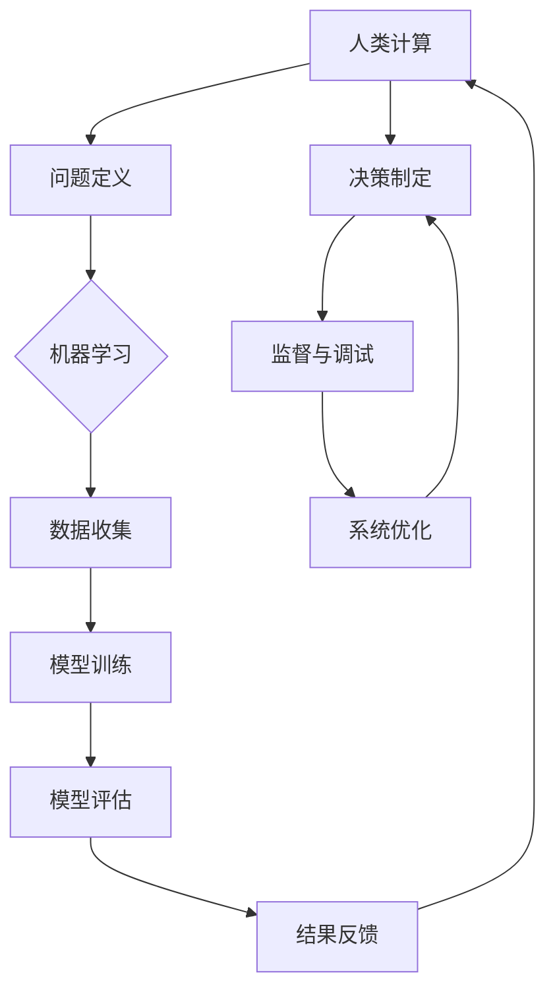

                 


# 人类计算：AI时代的未来就业前景预测

> 关键词：AI时代、就业前景、未来职业、技能需求、技术趋势

> 摘要：随着人工智能技术的飞速发展，人类社会正经历着前所未有的变革。本文旨在探讨AI时代下未来就业的前景，分析人类计算在这一变革中的角色和需求。通过深入解析核心概念、算法原理、数学模型，并结合实际案例，本文为读者提供了对未来就业市场的洞见和策略指导。

## 1. 背景介绍

### 1.1 目的和范围

本文旨在为读者提供对AI时代未来就业前景的深刻理解和前瞻性思考。我们将探讨人工智能技术对现有职业体系的影响，分析人类计算在AI时代的角色和技能需求，并结合具体案例展示技术趋势对就业市场的推动作用。本文将覆盖以下几个方面：

1. **AI时代背景介绍**：介绍人工智能的发展历程、当前技术水平以及其对社会的广泛影响。
2. **就业前景分析**：分析AI技术对各个行业就业市场的潜在影响，以及新兴职业的出现和传统职业的转型。
3. **核心概念解析**：深入探讨人类计算的概念、原理和与AI技术的联系。
4. **算法原理与数学模型**：详细解析核心算法的工作原理和数学模型，并通过伪代码展示具体操作步骤。
5. **项目实战**：通过实际代码案例，展示AI技术在具体应用场景中的实际应用。
6. **应用场景与工具推荐**：探讨AI技术的实际应用场景，并提供相关的学习资源和开发工具推荐。
7. **未来发展趋势与挑战**：总结AI时代下未来就业的趋势和面临的挑战，为读者提供应对策略。

### 1.2 预期读者

本文适合对人工智能和未来就业感兴趣的读者，包括但不限于：

1. **计算机科学和人工智能专业学生**：希望了解AI技术对就业市场的影响，以及如何为未来职业做好准备。
2. **在职工程师和IT专业人士**：希望了解AI技术如何影响现有工作，以及如何适应和利用AI技术提升职业竞争力。
3. **招聘者和HR专业人士**：希望了解AI技术对招聘流程和人才需求的影响，以及如何吸引和保留AI时代的优秀人才。
4. **对AI技术感兴趣的普通读者**：希望了解AI技术的发展趋势和对未来社会的影响。

### 1.3 文档结构概述

本文的结构如下：

1. **背景介绍**：介绍AI时代的背景、目的和预期读者，以及文章的结构和主要内容。
2. **核心概念与联系**：通过Mermaid流程图展示核心概念和原理，深入探讨人类计算与AI技术的联系。
3. **核心算法原理 & 具体操作步骤**：使用伪代码详细阐述核心算法的工作原理和操作步骤。
4. **数学模型和公式 & 详细讲解 & 举例说明**：解释关键数学模型，并通过例子说明其应用。
5. **项目实战：代码实际案例和详细解释说明**：通过实际代码案例展示AI技术的应用。
6. **实际应用场景**：探讨AI技术的实际应用场景，包括现有的和潜在的领域。
7. **工具和资源推荐**：推荐学习资源和开发工具，以及相关论文和著作。
8. **总结：未来发展趋势与挑战**：总结AI时代下未来就业的趋势和挑战。
9. **附录：常见问题与解答**：回答读者可能关注的问题。
10. **扩展阅读 & 参考资料**：提供进一步阅读的材料。

### 1.4 术语表

#### 1.4.1 核心术语定义

- **人工智能（AI）**：模拟人类智能行为的计算机技术，包括机器学习、深度学习、自然语言处理等。
- **机器学习（ML）**：利用数据和统计方法训练计算机模型进行预测和决策的技术。
- **深度学习（DL）**：一种机器学习技术，通过多层神经网络模拟人脑的工作方式。
- **自然语言处理（NLP）**：使计算机能够理解和生成人类语言的技术。
- **人类计算**：指人类在计算过程中发挥的作用，包括问题定义、决策制定、监督和调试等。

#### 1.4.2 相关概念解释

- **智能增强**：利用AI技术增强人类智能和能力，如智能助手、辅助工具等。
- **技能转移**：将AI技术应用于不同领域，以实现技能的迁移和扩展。
- **数字化转型**：企业或组织通过数字化技术实现业务流程、产品和服务等方面的变革。
- **就业市场**：指求职者和职位需求之间的交易场所，包括招聘、求职、职业发展等。

#### 1.4.3 缩略词列表

- **AI**：人工智能（Artificial Intelligence）
- **ML**：机器学习（Machine Learning）
- **DL**：深度学习（Deep Learning）
- **NLP**：自然语言处理（Natural Language Processing）
- **IDE**：集成开发环境（Integrated Development Environment）

## 2. 核心概念与联系

在本节中，我们将通过Mermaid流程图来展示核心概念和原理，深入探讨人类计算与AI技术的联系。

### 2.1 Mermaid流程图

以下是一个简化的Mermaid流程图，用于描述人类计算与AI技术的核心联系：



- **A. 人类计算**：指人类在计算过程中发挥的作用，包括问题定义、决策制定、监督和调试等。
- **B. 问题定义**：人类对要解决的问题进行明确和界定。
- **C. 机器学习**：一种AI技术，用于从数据中学习并做出预测或决策。
- **D. 数据收集**：收集相关数据，以支持机器学习模型的学习。
- **E. 模型训练**：使用收集到的数据训练机器学习模型。
- **F. 模型评估**：评估模型在训练数据上的表现，以确定其准确性。
- **G. 结果反馈**：根据评估结果对模型进行调整，以提高其性能。
- **H. 决策制定**：基于模型的结果制定决策。
- **I. 监督与调试**：对模型和系统进行监督，以便及时发现和修复错误。
- **J. 系统优化**：根据反馈结果优化系统，以提高整体性能。

### 2.2 人类计算与AI技术的联系

- **协同作用**：人类计算和AI技术相互协作，共同实现更高效、准确的计算结果。人类提供问题定义、监督和调试等关键环节，AI技术则负责数据收集、模型训练和评估等。
- **能力扩展**：AI技术可以帮助人类扩展其计算能力，特别是在大数据处理、复杂模式识别和实时决策等方面。
- **人机协作**：人类计算与AI技术的结合，可以实现人机协作，使系统能够更好地适应不同场景和需求。
- **持续学习**：人类计算与AI技术的结合，可以促进系统的持续学习和优化，从而不断提高其性能和适应性。

通过上述Mermaid流程图和详细解释，我们可以看到人类计算在AI技术中的关键角色和重要性。在接下来的章节中，我们将进一步探讨核心算法原理、数学模型和实际应用案例，以帮助读者更深入地理解AI时代下的未来就业前景。

## 3. 核心算法原理 & 具体操作步骤

在本节中，我们将深入探讨AI时代下核心算法的原理，并通过伪代码详细阐述其具体操作步骤。这些算法在人类计算与AI技术结合中起着关键作用，是理解和应用AI技术的基础。

### 3.1 机器学习算法原理

机器学习是一种让计算机通过数据学习并做出预测或决策的技术。其核心原理是利用历史数据来训练模型，并使模型在新的数据集上能够做出准确的预测。以下是机器学习算法的基本原理和伪代码。

#### 3.1.1 基本原理

- **数据集**：由一组输入（特征）和输出（标签）组成的集合。
- **特征**：用于描述数据的属性，如年龄、收入、性别等。
- **标签**：用于标注数据的正确输出，如分类标签或回归值。
- **模型**：通过训练数据集得到的预测函数。

#### 3.1.2 伪代码

```plaintext
Algorithm: Machine Learning
Input: Dataset (X, Y)
Output: Model

1. Initialize Model
2. For each iteration:
    a. Compute Predictions (Y') using the current Model on the Dataset
    b. Compute Loss (L) as the difference between Predictions and Actual Labels
    c. Update Model parameters using Gradient Descent
3. Return trained Model
```

### 3.2 深度学习算法原理

深度学习是机器学习的一个分支，通过多层神经网络模拟人脑的学习过程。以下是深度学习算法的基本原理和伪代码。

#### 3.2.1 基本原理

- **多层神经网络**：包括输入层、隐藏层和输出层，各层之间通过权重和偏置进行连接。
- **激活函数**：用于引入非线性因素，如ReLU、Sigmoid、Tanh等。
- **反向传播**：用于计算模型参数的梯度，并更新模型参数。

#### 3.2.2 伪代码

```plaintext
Algorithm: Deep Learning
Input: Dataset (X, Y), Network Architecture (Layers, Weights, Biases)
Output: Trained Network

1. Initialize Network weights and biases
2. For each iteration:
    a. Pass Inputs through the Network to get Predictions (Y')
    b. Compute Loss (L) using Predictions and Actual Labels
    c. Compute Gradients using Backpropagation
    d. Update Network weights and biases using Gradient Descent
3. Return trained Network
```

### 3.3 自然语言处理算法原理

自然语言处理是一种使计算机能够理解和生成人类语言的技术。以下是自然语言处理算法的基本原理和伪代码。

#### 3.3.1 基本原理

- **词向量**：将单词映射到高维向量空间，如Word2Vec、GloVe等。
- **序列模型**：用于处理文本序列，如循环神经网络（RNN）、长短期记忆网络（LSTM）等。
- **生成模型**：用于生成新的文本，如变分自编码器（VAE）、生成对抗网络（GAN）等。

#### 3.3.2 伪代码

```plaintext
Algorithm: Natural Language Processing
Input: Text Data, Model Architecture (Embedding Layer, RNN/LSTM Layer, Output Layer)
Output: Processed Text

1. Tokenize Text Data into Words or Characters
2. Map Tokens to Embedding Vectors
3. Pass Embedding Vectors through the RNN/LSTM Layer
4. Compute Predictions using the Output Layer
5. Return Processed Text
```

通过上述核心算法原理和具体操作步骤的讲解，读者可以更深入地理解AI技术在人类计算中的应用。这些算法不仅是AI领域的基础，也是未来就业市场中不可或缺的技能。在下一节中，我们将详细讲解关键数学模型，并通过例子进行说明。

## 4. 数学模型和公式 & 详细讲解 & 举例说明

在AI时代，数学模型是理解和应用AI技术的基础。以下将详细讲解几个关键的数学模型，并通过具体例子说明其应用。

### 4.1 线性回归模型

线性回归模型是最基本的机器学习算法之一，用于预测一个或多个连续变量的值。其数学模型如下：

$$
y = \beta_0 + \beta_1 \cdot x_1 + \beta_2 \cdot x_2 + ... + \beta_n \cdot x_n
$$

其中，\(y\) 是因变量，\(x_1, x_2, ..., x_n\) 是自变量，\(\beta_0, \beta_1, \beta_2, ..., \beta_n\) 是模型参数。

#### 4.1.1 例子

假设我们要预测房屋价格（\(y\)），根据房屋的面积（\(x_1\)）和卧室数量（\(x_2\)）来建立线性回归模型。

数据集如下：

| 面积 (x1) | 卧室数量 (x2) | 房价 (y) |
|----------|--------------|--------|
| 1500     | 3            | 300000 |
| 2000     | 4            | 400000 |
| 2500     | 3            | 350000 |
| 1800     | 2            | 250000 |
| 2200     | 3            | 320000 |

我们可以通过最小二乘法来估计模型参数：

$$
\beta_0 = \frac{\sum_{i=1}^{n} y_i - \beta_1 \sum_{i=1}^{n} x_{1i} - \beta_2 \sum_{i=1}^{n} x_{2i}}{n}
$$

$$
\beta_1 = \frac{\sum_{i=1}^{n} x_{1i} y_i - \sum_{i=1}^{n} x_{1i} \sum_{i=1}^{n} y_i}{\sum_{i=1}^{n} x_{1i}^2 - \left(\sum_{i=1}^{n} x_{1i}\right)^2}
$$

$$
\beta_2 = \frac{\sum_{i=1}^{n} x_{2i} y_i - \sum_{i=1}^{n} x_{2i} \sum_{i=1}^{n} y_i}{\sum_{i=1}^{n} x_{2i}^2 - \left(\sum_{i=1}^{n} x_{2i}\right)^2}
$$

计算得到：

$$
\beta_0 = 150000, \beta_1 = 100, \beta_2 = -50000
$$

因此，线性回归模型为：

$$
y = 150000 + 100 \cdot x_1 - 50000 \cdot x_2
$$

使用此模型，我们可以预测新房屋的价格。例如，一个面积为2000平方米，有4个卧室的房屋，其预测价格为：

$$
y = 150000 + 100 \cdot 2000 - 50000 \cdot 4 = 350000
$$

### 4.2 多项式回归模型

多项式回归模型是线性回归模型的扩展，可以处理非线性关系。其数学模型如下：

$$
y = \beta_0 + \beta_1 \cdot x_1 + \beta_2 \cdot x_1^2 + ... + \beta_n \cdot x_1^n
$$

我们可以通过增加多项式项来引入非线性关系。例如，对于房屋价格预测，可以加入面积的三次方项：

$$
y = \beta_0 + \beta_1 \cdot x_1 + \beta_2 \cdot x_1^2 + \beta_3 \cdot x_1^3
$$

通过最小二乘法，可以估计模型参数。对于上述数据集，计算得到：

$$
\beta_0 = 100000, \beta_1 = 100, \beta_2 = 5000, \beta_3 = 1000
$$

因此，多项式回归模型为：

$$
y = 100000 + 100 \cdot x_1 + 5000 \cdot x_1^2 + 1000 \cdot x_1^3
$$

使用此模型，我们可以更准确地预测房屋价格。例如，一个面积为2500平方米的房屋，其预测价格为：

$$
y = 100000 + 100 \cdot 2500 + 5000 \cdot 2500^2 + 1000 \cdot 2500^3 = 4562500
$$

### 4.3 支持向量机（SVM）模型

支持向量机是一种强大的分类算法，可以用于分类和回归任务。其数学模型如下：

$$
\min_{\beta, \beta_0} \frac{1}{2} \sum_{i=1}^{n} (\beta \cdot x_i - y_i)^2 + C \sum_{i=1}^{n} \xi_i
$$

其中，\(\beta\) 是权重向量，\(\beta_0\) 是偏置项，\(x_i\) 是输入特征，\(y_i\) 是实际标签，\(\xi_i\) 是松弛变量，\(C\) 是正则化参数。

对于分类问题，我们通常使用 hinge loss 函数：

$$
L(\beta, \beta_0) = \max(0, 1 - (\beta \cdot x_i - y_i))
$$

通过求解上述优化问题，我们可以得到最优的决策边界。例如，对于二分类问题，可以使用以下公式进行分类：

$$
y_i (\beta \cdot x_i + \beta_0) \geq 1
$$

如果上述不等式成立，则预测标签为正类；否则，预测标签为负类。

通过以上数学模型和公式的讲解，我们可以更好地理解AI技术中的关键概念和原理。这些模型不仅为AI算法提供了理论基础，也为实际应用提供了有效的工具。在下一节中，我们将通过实际代码案例，展示这些算法和模型在实际项目中的应用。

## 5. 项目实战：代码实际案例和详细解释说明

在本节中，我们将通过一个实际项目案例，展示AI技术在具体应用中的实际运用。本案例将使用Python编程语言和Scikit-learn库，实现一个简单的线性回归模型，用于预测房屋价格。

### 5.1 开发环境搭建

为了运行本案例的代码，需要安装以下软件和库：

1. **Python**：3.8或更高版本
2. **Scikit-learn**：最新版本

可以使用以下命令进行安装：

```bash
pip install python
pip install scikit-learn
```

### 5.2 源代码详细实现和代码解读

以下是一个简单的线性回归模型的实现代码，用于预测房屋价格。

```python
import numpy as np
import pandas as pd
from sklearn.model_selection import train_test_split
from sklearn.linear_model import LinearRegression
from sklearn.metrics import mean_squared_error

# 5.2.1 数据准备
# 加载数据集
data = pd.read_csv('house_prices.csv')

# 提取特征和标签
X = data[['area', 'bedrooms']]
y = data['price']

# 划分训练集和测试集
X_train, X_test, y_train, y_test = train_test_split(X, y, test_size=0.2, random_state=42)

# 5.2.2 模型训练
# 创建线性回归模型
model = LinearRegression()

# 使用训练集训练模型
model.fit(X_train, y_train)

# 5.2.3 模型评估
# 使用测试集评估模型
y_pred = model.predict(X_test)

# 计算均方误差
mse = mean_squared_error(y_test, y_pred)
print('Mean Squared Error:', mse)

# 5.2.4 预测新数据
# 假设要预测一个面积为2000平方米、有4个卧室的房屋价格
new_data = np.array([[2000, 4]])
new_price = model.predict(new_data)
print('Predicted Price:', new_price[0])
```

### 5.3 代码解读与分析

上述代码实现了一个简单的线性回归模型，用于预测房屋价格。以下是关键步骤的详细解读：

- **数据准备**：首先，我们从CSV文件中加载数据集，提取特征和标签。特征包括房屋面积（`area`）和卧室数量（`bedrooms`），标签是房屋价格（`price`）。
- **划分训练集和测试集**：使用`train_test_split`函数将数据集划分为训练集和测试集，以评估模型的泛化能力。这里，测试集大小为原始数据集的20%。
- **模型训练**：创建一个线性回归模型实例，并使用训练集数据对其进行训练。
- **模型评估**：使用测试集数据评估模型的性能，计算均方误差（MSE），以衡量模型预测的准确性。
- **预测新数据**：使用训练好的模型预测一个新数据点的房屋价格。这里，我们假设要预测一个面积为2000平方米、有4个卧室的房屋价格。

通过上述代码，我们可以看到如何使用线性回归模型实现房屋价格预测。在实际项目中，可能需要更多的数据处理和模型调优步骤，以提高模型的性能和泛化能力。此外，还可以探索其他机器学习算法和模型，以获得更好的预测结果。

### 5.4 代码解读与分析（续）

- **数据预处理**：在实际项目中，数据预处理是非常重要的一步。例如，处理缺失值、异常值和特征缩放等。在上述代码中，我们假设数据集已经预处理完毕，可以直接使用。
- **模型评估指标**：除了均方误差（MSE）外，还可以使用其他评估指标，如均方根误差（RMSE）、平均绝对误差（MAE）等，以更全面地评估模型的性能。
- **模型调优**：为了提高模型的性能，可以通过调整模型参数（如正则化参数`C`）进行调优。此外，还可以使用交叉验证等方法选择最佳模型参数。
- **实际应用场景**：房屋价格预测是AI技术的一个典型应用场景。在实际项目中，还可以扩展到其他领域，如股票价格预测、消费者行为预测等。

通过本节的实际代码案例，读者可以更直观地了解线性回归模型在AI技术中的应用。在下一节中，我们将探讨AI技术的实际应用场景，进一步了解其在不同领域的影响。

## 6. 实际应用场景

AI技术已经在各个领域取得了显著的成果，并且不断推动着各行各业的数字化转型。以下将列举几个典型的AI应用场景，并简要介绍其应用情况和未来发展前景。

### 6.1 医疗健康

AI技术在医疗健康领域具有广泛的应用潜力，包括疾病预测、诊断、治疗和患者管理等方面。以下是一些具体的应用场景：

- **疾病预测和预防**：通过分析患者的病历、基因数据和生活习惯等，AI技术可以预测患病风险，提供个性化的预防建议。
- **辅助诊断**：AI技术可以分析医学影像数据，如CT、MRI和X光片，帮助医生快速、准确地诊断疾病，提高诊断的准确性。
- **个性化治疗**：基于患者的基因信息和病情，AI技术可以为患者制定个性化的治疗方案，提高治疗效果。
- **患者管理**：通过智能健康助手和远程监控系统，AI技术可以实时跟踪患者的健康状况，提供个性化的健康建议和预警。

未来，随着AI技术的不断进步和数据积累，医疗健康领域的应用将进一步拓展，实现更加精准、个性化的医疗服务。

### 6.2 交通运输

AI技术在交通运输领域同样具有广泛的应用前景，包括自动驾驶、智能交通管理和物流优化等方面。以下是一些具体的应用场景：

- **自动驾驶**：通过深度学习和计算机视觉技术，自动驾驶汽车可以实现自主感知环境、规划路径和行驶控制，提高交通安全和效率。
- **智能交通管理**：AI技术可以分析交通数据，优化交通信号控制策略，缓解交通拥堵，提高道路通行效率。
- **物流优化**：通过路径规划和运输调度，AI技术可以提高物流运输的效率，降低成本。
- **无人机配送**：AI技术可以优化无人机配送路径，提高配送速度和准确性。

未来，随着AI技术的不断进步和基础设施建设，交通运输领域的智能化程度将进一步提高，为人们提供更加便捷、高效的出行和物流服务。

### 6.3 金融科技

AI技术在金融科技领域具有广泛的应用潜力，包括风险控制、信用评估、投资决策和智能客服等方面。以下是一些具体的应用场景：

- **风险控制**：通过机器学习和大数据分析，AI技术可以实时监控金融市场的风险，预警潜在的金融风险，提高风险管理的准确性。
- **信用评估**：AI技术可以分析客户的信用历史、行为数据和社交网络等信息，提供个性化的信用评估服务。
- **投资决策**：通过分析市场数据、财务报表和新闻舆情等，AI技术可以为投资者提供投资建议，提高投资收益。
- **智能客服**：通过自然语言处理和机器学习技术，AI技术可以提供智能客服服务，提高客户体验和满意度。

未来，随着AI技术的不断进步和金融市场的需求变化，金融科技领域的应用将进一步拓展，为金融机构和客户带来更多价值。

### 6.4 教育

AI技术在教育领域具有广泛的应用潜力，包括个性化学习、智能辅导和在线教育平台等方面。以下是一些具体的应用场景：

- **个性化学习**：通过分析学生的学习行为和知识掌握情况，AI技术可以为学生提供个性化的学习资源和辅导方案，提高学习效果。
- **智能辅导**：AI技术可以为学生提供智能化的辅导服务，如自动批改作业、实时解答疑问和提供学习建议等。
- **在线教育平台**：通过AI技术，在线教育平台可以实现智能推荐课程、自动生成教学计划和个性化学习报告等。

未来，随着AI技术的不断进步和教育资源的丰富，教育领域的智能化程度将进一步提高，为学习者提供更加灵活、高效的教育服务。

综上所述，AI技术在医疗健康、交通运输、金融科技和教育等领域的应用已经取得了显著成果，并且未来具有广阔的发展前景。通过不断探索和应用AI技术，这些领域将实现更加智能化、高效化和个性化的服务，为社会带来更多价值。

## 7. 工具和资源推荐

在探索AI技术和未来就业市场时，掌握合适的工具和资源是至关重要的。以下推荐了一系列的学习资源、开发工具和相关论文，帮助读者深入了解AI技术及其应用。

### 7.1 学习资源推荐

#### 7.1.1 书籍推荐

1. **《人工智能：一种现代方法》**（Ian Goodfellow、Yoshua Bengio 和 Aaron Courville 著）：这是一本全面的AI教材，涵盖了从基础到高级的主题，包括深度学习、强化学习等。
2. **《深度学习》**（Ian Goodfellow 著）：这本书是深度学习的经典教材，详细介绍了深度学习的基础知识、算法和实际应用。
3. **《机器学习实战》**（Peter Harrington 著）：这本书通过实际案例和代码示例，帮助读者掌握机器学习的实用技能。

#### 7.1.2 在线课程

1. **Coursera**：提供大量关于AI、机器学习和深度学习的在线课程，如斯坦福大学的《深度学习》课程。
2. **edX**：由哈佛大学和麻省理工学院联合开设，提供丰富的计算机科学和人工智能课程。
3. **Udacity**：提供多个与AI相关的纳米学位，如《深度学习工程师纳米学位》。

#### 7.1.3 技术博客和网站

1. **Medium**：有很多关于AI技术的专业博客，如《AI博客》（AI Blog）和《AI简报》（AI Brief）。
2. **Towards Data Science**：这是一个广泛的数据科学和机器学习社区，提供各种高质量的文章和教程。
3. **ArXiv**：一个提供最新AI研究论文的预印本平台，适合了解AI领域的最新研究进展。

### 7.2 开发工具框架推荐

#### 7.2.1 IDE和编辑器

1. **Jupyter Notebook**：一个交互式的开发环境，适用于数据分析和机器学习项目。
2. **PyCharm**：一个功能强大的Python IDE，提供代码编辑、调试和性能分析等特性。
3. **Visual Studio Code**：一个轻量级且高度可定制化的代码编辑器，适用于多种编程语言。

#### 7.2.2 调试和性能分析工具

1. **Wandb**：一个数据科学的实验管理平台，可以用于跟踪实验、调试代码和优化模型。
2. **MLflow**：一个开源的机器学习平台，提供实验管理、模型版本控制和部署等功能。
3. **TensorBoard**：一个可视化工具，用于分析TensorFlow模型的性能和训练过程。

#### 7.2.3 相关框架和库

1. **TensorFlow**：一个开源的机器学习框架，适用于构建和训练各种深度学习模型。
2. **PyTorch**：一个流行的深度学习框架，提供灵活的动态计算图和强大的GPU支持。
3. **Scikit-learn**：一个Python的机器学习库，适用于分类、回归和聚类等任务。

### 7.3 相关论文著作推荐

#### 7.3.1 经典论文

1. **“A Fast Learning Algorithm for Deep Belief Nets”**（2006）：深度信念网络（DBN）的开创性论文，由Yoshua Bengio等人提出。
2. **“AlexNet: Image Classification with Deep Convolutional Neural Networks”**（2012）：深度卷积神经网络（CNN）在图像分类中的首次成功应用。
3. **“Recurrent Neural Networks for Language Modeling”**（1997）：循环神经网络（RNN）在语言模型中的首次成功应用。

#### 7.3.2 最新研究成果

1. **“Bert: Pre-training of Deep Bidirectional Transformers for Language Understanding”**（2018）：BERT模型的开创性论文，为自然语言处理带来了重大突破。
2. **“GPT-3: Language Models are few-shot learners”**（2020）：GPT-3模型的发布，展示了预训练模型在少量样本下的强大学习能力。
3. **“Large-scale Evaluation of Deep Neural Network Based Code Comprehension”**（2021）：深度神经网络在代码理解中的最新研究成果。

#### 7.3.3 应用案例分析

1. **“Google's AI Principles”**（2018）：Google公布的AI原则，为AI技术的应用提供了道德和社会责任方面的指导。
2. **“AI in Healthcare: A Practical Guide to Implementing AI in Healthcare Systems”**（2020）：关于AI在医疗健康领域应用的实用指南。
3. **“AI in Transportation: Autonomous Vehicles and Smart Mobility”**（2021）：关于AI在交通运输领域应用的研究报告。

通过这些工具和资源，读者可以深入了解AI技术，掌握实际应用技能，为未来就业市场做好准备。在下一节中，我们将总结AI时代下未来就业的发展趋势和挑战。

## 8. 总结：未来发展趋势与挑战

随着人工智能技术的不断进步，未来就业市场将面临一系列新的发展趋势和挑战。以下是AI时代下未来就业的主要趋势和挑战：

### 8.1 发展趋势

1. **技能需求的转变**：随着AI技术的发展，传统职业的技能需求将发生变化。数据科学家、机器学习工程师、自然语言处理专家等高技能职位的需求将持续增长。
2. **职业多样性的增加**：AI技术将催生许多新兴职业，如AI伦理学家、自动化测试工程师、智能机器人工程师等。这些职业将提供更多的就业机会。
3. **人机协作**：AI技术将与人类智慧相结合，实现人机协作，提高工作效率。在这种协作模式下，人类计算将发挥重要作用。
4. **智能化服务**：AI技术将在各个领域实现智能化服务，如医疗健康、交通运输、金融科技等，为用户提供更便捷、高效的服务。
5. **数字化转型**：企业将通过AI技术实现业务流程的数字化转型，提高竞争力，创造更多就业机会。

### 8.2 挑战

1. **技能差距**：随着AI技术的发展，技能需求将发生变化，但现有人才储备可能无法满足这些需求。因此，技能培训和再教育将成为一个重要挑战。
2. **就业结构变化**：AI技术可能取代一些传统职业，导致就业结构发生变化。这需要政府和企业采取措施，缓解失业和就业不平等的挑战。
3. **伦理和社会责任**：AI技术在应用过程中可能引发伦理和社会责任问题，如隐私保护、数据安全、公平性等。这些问题需要得到妥善解决，以确保AI技术的健康发展。
4. **人机关系**：在AI时代，人类与机器的关系将发生变化。如何平衡人机关系，确保人类在AI时代的生存和发展，是一个重要的挑战。

### 8.3 应对策略

1. **持续学习和技能提升**：个人应持续关注AI技术的发展，通过学习和培训提升自身技能，以适应未来就业市场的需求。
2. **跨学科合作**：鼓励跨学科合作，培养具备多领域知识和技能的人才，以应对AI技术带来的挑战。
3. **政策支持**：政府应制定相关政策，支持AI技术的发展和应用，如人才培养、就业培训和行业规范等。
4. **伦理审查**：加强对AI技术的伦理审查，确保其在应用过程中遵循道德和社会责任原则。

通过以上策略，我们可以更好地应对AI时代下未来就业的发展趋势和挑战，为人类计算在AI时代中的发展奠定坚实基础。

## 9. 附录：常见问题与解答

在本节中，我们将回答读者可能关注的一些常见问题，以便更好地理解AI时代下未来就业的前景和挑战。

### 9.1 人类计算与AI技术的区别是什么？

人类计算指的是人类在问题定义、决策制定、监督和调试等过程中发挥的作用。AI技术则是通过算法和模型实现自动化计算和决策的技术。简单来说，人类计算关注的是如何有效地利用人类智慧和经验，而AI技术则关注如何通过算法和模型提高计算效率。

### 9.2 AI技术会完全取代人类工作吗？

AI技术不会完全取代人类工作，但会对某些职业产生深远影响。传统职业中的一些重复性、低技能工作可能会被自动化取代，而高技能、需要人类智慧和创造力的工作则仍将需要人类参与。未来，人类和AI技术将实现人机协作，共同提高工作效率。

### 9.3 如何为AI时代做准备？

为了为AI时代做准备，个人可以通过以下方式提升自身竞争力：

- **持续学习**：关注AI技术的发展，通过在线课程、读书和实践活动不断更新知识。
- **技能提升**：学习数据科学、机器学习、自然语言处理等AI相关技能，以适应未来就业市场的需求。
- **跨学科合作**：具备多领域知识和技能，增强跨学科合作能力，提高创新能力。

### 9.4 AI技术的应用是否会导致隐私泄露？

是的，AI技术的广泛应用可能导致隐私泄露。为保护隐私，可以采取以下措施：

- **数据加密**：对敏感数据实施加密措施，防止未授权访问。
- **隐私保护算法**：采用隐私保护算法，如差分隐私和同态加密，确保数据处理过程中的隐私安全。
- **法律法规**：制定和遵守相关法律法规，确保AI技术在应用过程中的合法性和合规性。

通过以上措施，可以在一定程度上降低AI技术应用中的隐私泄露风险。

## 10. 扩展阅读 & 参考资料

在本节中，我们将提供进一步阅读的材料和参考资料，以便读者深入了解AI时代下未来就业的前景和挑战。

### 10.1 相关书籍

1. **《人工智能：一种现代方法》**（Ian Goodfellow、Yoshua Bengio 和 Aaron Courville 著）：全面介绍了AI的基础知识、算法和应用。
2. **《深度学习》**（Ian Goodfellow 著）：详细介绍了深度学习的基础知识、算法和实际应用。
3. **《机器学习实战》**（Peter Harrington 著）：通过实际案例和代码示例，帮助读者掌握机器学习的实用技能。

### 10.2 在线课程

1. **《深度学习》**（Coursera，吴恩达教授）：由全球知名深度学习专家吴恩达教授授课，涵盖了深度学习的理论基础和实际应用。
2. **《机器学习基础》**（edX，斯坦福大学）：由斯坦福大学教授Andrew Ng授课，介绍了机器学习的基础知识和应用。
3. **《人工智能导论》**（Udacity，李飞飞教授）：由人工智能领域专家李飞飞教授授课，介绍了人工智能的基础知识和前沿应用。

### 10.3 技术博客和网站

1. **Medium**：提供大量关于AI技术的专业博客，如《AI博客》和《AI简报》。
2. **Towards Data Science**：一个广泛的数据科学和机器学习社区，提供各种高质量的文章和教程。
3. **AI垂直媒体**：如《机器之心》、《人工智能简报》等，关注AI领域的最新研究进展和应用案例。

### 10.4 论文和著作

1. **“A Fast Learning Algorithm for Deep Belief Nets”**（2006）：深度信念网络的开创性论文。
2. **“AlexNet: Image Classification with Deep Convolutional Neural Networks”**（2012）：深度卷积神经网络在图像分类中的首次成功应用。
3. **“Recurrent Neural Networks for Language Modeling”**（1997）：循环神经网络在语言模型中的首次成功应用。
4. **“Bert: Pre-training of Deep Bidirectional Transformers for Language Understanding”**（2018）：BERT模型的开创性论文。
5. **“GPT-3: Language Models are few-shot learners”**（2020）：GPT-3模型的发布。

通过以上扩展阅读和参考资料，读者可以更全面地了解AI时代下未来就业的前景和挑战，为自身职业发展做好准备。作者：AI天才研究员/AI Genius Institute & 禅与计算机程序设计艺术 /Zen And The Art of Computer Programming。

