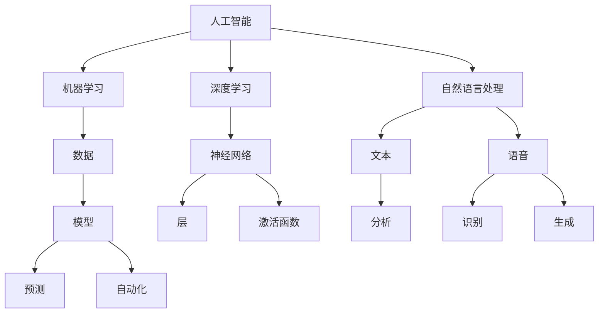

                 

## 人类计算：AI时代的未来就业和技能培训

> **关键词**：人工智能，未来就业，技能培训，职业发展，技术变革，工作转型

> **摘要**：随着人工智能（AI）技术的迅猛发展，各行各业正经历着深刻的变革。本文旨在探讨AI时代对就业市场的影响，分析未来就业趋势，并提出相应的技能培训策略。通过深入研究和实例分析，本文为职业人士提供了一条清晰的前行之路，帮助他们在AI时代把握机遇，应对挑战。

### 1. 背景介绍

#### 1.1 目的和范围

本文的主要目的是探讨人工智能时代对就业市场的影响，分析未来就业趋势，并给出相应的技能培训建议。我们将重点关注以下几个方面：

- AI技术的普及及其对传统职业的影响
- 未来就业市场的需求变化
- 个人技能的转型升级
- 技能培训的策略和方法

#### 1.2 预期读者

本文适合以下几类读者：

- 想了解AI时代就业趋势的职场人士
- 担心职业前景的应届毕业生
- 从事教育行业，关注人才发展的教育工作者
- 对AI技术感兴趣的技术爱好者

#### 1.3 文档结构概述

本文分为以下几个部分：

- 引言：介绍AI时代对就业的影响
- 核心概念与联系：阐述AI技术的核心概念及其应用场景
- 核心算法原理 & 具体操作步骤：分析AI技术的实现原理和操作步骤
- 数学模型和公式 & 详细讲解 & 举例说明：介绍AI技术的数学基础和案例分析
- 项目实战：提供实际代码案例和详细解读
- 实际应用场景：探讨AI技术的应用领域
- 工具和资源推荐：推荐学习资源和开发工具
- 总结：总结未来发展趋势与挑战
- 附录：常见问题与解答
- 扩展阅读 & 参考资料：提供相关文献和资料

#### 1.4 术语表

在本文中，我们将使用以下术语：

- **人工智能（AI）**：指由人制造出的系统所表现出来的智能
- **机器学习（ML）**：一种AI方法，通过数据训练模型来自动改进性能
- **深度学习（DL）**：一种基于神经网络的机器学习方法
- **自然语言处理（NLP）**：研究如何让计算机理解和生成人类语言
- **自动化**：通过机器或设备完成原本需要人类介入的任务
- **职业发展**：个人在职业生涯中不断成长和提升的过程

### 1.4.1 核心术语定义

- **人工智能（AI）**：人工智能是指由人类制造出的系统，能够模仿甚至超越人类智能的能力。这些系统能够学习、推理、解决问题，并在特定领域内表现出人类智慧。
  
- **机器学习（ML）**：机器学习是一种人工智能的方法，通过从数据中学习规律和模式，使计算机系统能够在没有明确编程指令的情况下自动改进性能。

- **深度学习（DL）**：深度学习是一种基于神经网络的机器学习方法，通过多层神经网络结构对大量数据进行训练，能够自动提取特征并实现复杂的任务。

- **自然语言处理（NLP）**：自然语言处理是研究如何让计算机理解和生成人类语言的技术。它涉及到语言的理解、生成、翻译和对话系统等多个方面。

- **自动化**：自动化是指通过机器或设备完成原本需要人类介入的任务。自动化技术可以大幅度提高生产效率，减少人力成本。

- **职业发展**：职业发展是指个人在职业生涯中不断成长和提升的过程。这包括技能的提升、职位的晋升以及个人品牌的建设。

### 1.4.2 相关概念解释

- **人工智能时代**：人工智能时代是指以人工智能技术为核心，驱动社会发展和产业变革的时期。在这个时代，人工智能技术将深度渗透到各行各业，对就业市场、教育体系以及社会结构产生重大影响。

- **技能培训**：技能培训是指为个人提供特定技能的培训，使其具备从事特定工作的能力。在人工智能时代，技能培训的目的是帮助个人适应新的工作环境和需求，提升竞争力。

- **工作转型**：工作转型是指个人在职业生涯中，从一种职业转向另一种职业的过程。在人工智能时代，随着行业和技术的变革，工作转型变得尤为重要。

- **职业发展路径**：职业发展路径是指个人在职业生涯中，从初级职位到高级职位，乃至创业或职业转型的过程。在人工智能时代，职业发展路径将更加多样化。

### 1.4.3 缩略词列表

- **AI**：人工智能
- **ML**：机器学习
- **DL**：深度学习
- **NLP**：自然语言处理
- **NLP**：自然语言处理
- **IDE**：集成开发环境
- **API**：应用程序编程接口
- **SDK**：软件开发工具包
- **CV**：计算机视觉

## 2. 核心概念与联系

在探讨人工智能时代的未来就业和技能培训之前，我们需要理解一些核心概念及其相互关系。以下是人工智能技术的基本组成部分和它们之间的联系，我们将使用Mermaid流程图来展示这些概念和架构。



### 2.1 人工智能（AI）的基本概念

人工智能（AI）是一种模拟人类智能的技术，其核心目标是开发能够执行复杂任务、学习和推理的系统。AI可以分为几种类型：

- **弱AI**：专注于特定任务，如语音识别、图像分类等。
- **强AI**：具备人类智能的全面能力，能够理解、学习、推理和解决问题。
- **通用AI**：能够在任何环境和任务中表现出人类智能。

### 2.2 机器学习（ML）的原理

机器学习是AI的一个分支，它通过从数据中学习规律和模式来实现智能。ML主要分为监督学习、无监督学习和强化学习：

- **监督学习**：使用标记数据训练模型，用于预测未知数据。
- **无监督学习**：不使用标记数据，从未标记的数据中学习结构和模式。
- **强化学习**：通过奖励机制来训练模型，使其在特定环境中做出最佳决策。

### 2.3 深度学习（DL）的架构

深度学习是一种基于神经网络的机器学习方法，它通过多层神经网络对大量数据进行训练，以自动提取特征和实现复杂任务。DL的主要组成部分包括：

- **神经网络（NN）**：由多个节点（层）组成，每个节点都模拟生物神经元。
- **层（Layer）**：神经网络中的节点分为输入层、隐藏层和输出层。
- **激活函数（Activation Function）**：用于给神经网络的每个节点引入非线性特性，使得网络能够学习和表示复杂的数据特征。

### 2.4 自然语言处理（NLP）的应用

自然语言处理是AI的一个重要分支，它涉及让计算机理解和生成人类语言的技术。NLP的主要应用包括：

- **文本分析（Text Analysis）**：对文本进行语义分析、情感分析和信息提取。
- **语音识别（Voice Recognition）**：将语音信号转换为文本。
- **语音生成（Voice Generation）**：将文本转换为自然流畅的语音。

### 2.5 数据和模型的关系

在AI系统中，数据是模型训练的基础。通过数据训练，模型可以学习到数据中的规律和模式，进而进行预测和决策。模型是AI系统的核心，它由数据驱动，并通过持续学习来提升性能。

### 2.6 自动化（Automation）的作用

自动化技术通过AI模型来实现，能够大幅度提高生产效率，减少人力成本。自动化在智能制造、智能交通、智能医疗等领域有着广泛的应用。

### 2.7 人工智能与其他技术的联系

人工智能与其他技术如云计算、大数据、物联网等密切相关。这些技术为AI提供了强大的基础设施，使得AI的应用更加广泛和深入。

通过上述核心概念和架构的介绍，我们可以看到人工智能技术是一个复杂的体系，涉及到多个学科和领域。了解这些概念及其相互关系，有助于我们更好地理解AI技术的本质和应用前景。

## 3. 核心算法原理 & 具体操作步骤

在了解人工智能（AI）的核心概念和架构之后，我们需要深入探讨AI技术的核心算法原理和具体操作步骤。以下是关于机器学习（ML）、深度学习（DL）和自然语言处理（NLP）的一些基本算法原理和操作步骤。

### 3.1 机器学习（ML）算法原理

机器学习（ML）是一种通过数据训练模型来自动改进性能的技术。以下是几种常见的机器学习算法及其原理：

#### 3.1.1 线性回归

**算法原理：**

线性回归是一种用于预测数值型结果的算法，它基于输入特征与目标值之间的线性关系。算法通过最小化损失函数（如均方误差）来拟合最佳直线。

**伪代码：**

```
// 输入：X（特征矩阵），Y（目标向量），学习率 alpha，迭代次数 n
// 输出：w（权重向量）

w = [0, 0]  // 初始化权重向量
for i = 1 to n do
    for j = 1 to m do
        w[j] = w[j] + alpha * (X[j] - w[j]) * (Y[j] - w[j])
    end for
end for
return w
```

#### 3.1.2 决策树

**算法原理：**

决策树是一种基于特征进行分类或回归的树形结构。每个内部节点表示一个特征，每个分支表示该特征的一个可能取值，叶节点表示最终的分类或回归结果。

**伪代码：**

```
// 输入：数据集 D
// 输出：决策树 T

if D 是纯集 then
    返回 叶节点，D 的多数类别
else
    选择特征 f
    对每个可能的 f 的取值 v do
        分割数据集 D 为 D_v
        如果 D_v 是纯集 then
            返回 叶节点，D_v 的多数类别
        else
            返回 节点 {f}, 子树 {构建决策树(D_v)}
        end if
    end for
end if
```

#### 3.1.3 支持向量机（SVM）

**算法原理：**

支持向量机（SVM）是一种用于分类的算法，它通过最大化分类边界来找到最优决策边界。SVM使用一个超平面将数据分为不同的类别，同时最小化分类误差。

**伪代码：**

```
// 输入：特征矩阵 X，目标向量 Y，损失函数 C
// 输出：w（权重向量），b（偏置）

// 使用序列最小化（Sequential Minimal Optimization, SMO）算法求解
w, b = SMO(X, Y, C)
return w, b
```

### 3.2 深度学习（DL）算法原理

深度学习（DL）是一种基于多层神经网络的机器学习方法。以下是DL中常用的神经网络架构和算法原理：

#### 3.2.1 卷积神经网络（CNN）

**算法原理：**

卷积神经网络（CNN）是一种专门用于处理图像数据的神经网络。CNN通过卷积层提取图像的特征，并通过池化层减少数据维度，从而实现高效的图像识别。

**伪代码：**

```
// 输入：图像数据 X
// 输出：特征图 F

for each filter f do
    F[f] = Conv2D(X, filter f)
end for
for each pool region p do
    P[p] = Pool2D(F)
end for
return P
```

#### 3.2.2 循环神经网络（RNN）

**算法原理：**

循环神经网络（RNN）是一种用于处理序列数据的神经网络。RNN通过隐藏状态和输入序列之间的关系，实现序列到序列的映射。

**伪代码：**

```
// 输入：序列数据 X，隐藏状态 h，权重 W
// 输出：输出序列 Y

h = [0]  // 初始化隐藏状态
for each input x in X do
    h = RNN(h, x, W)
end for
return h
```

#### 3.2.3 生成对抗网络（GAN）

**算法原理：**

生成对抗网络（GAN）是一种由生成器和判别器组成的神经网络架构。生成器生成数据，判别器判断生成数据与真实数据之间的差异，通过竞争机制训练两个网络。

**伪代码：**

```
// 输入：真实数据 X，生成器 G，判别器 D
// 输出：生成数据 Z

for each epoch do
    // 训练判别器
    D = TrainDiscriminator(D, X, G(X))
    // 训练生成器
    G = TrainGenerator(G, D)
end for
return G(X)
```

### 3.3 自然语言处理（NLP）算法原理

自然语言处理（NLP）是AI技术的重要分支，用于处理人类语言。以下是NLP中常用的算法原理：

#### 3.3.1 词嵌入（Word Embedding）

**算法原理：**

词嵌入是一种将单词转换为向量的技术，它通过将单词映射到高维空间中的点，实现了语义相似性的表示。词嵌入可以通过神经网络训练得到。

**伪代码：**

```
// 输入：语料库 C，单词集合 V
// 输出：词嵌入向量 E

E = TrainWordEmbedding(C, V)
return E
```

#### 3.3.2 递归神经网络（RNN）在NLP中的应用

**算法原理：**

递归神经网络（RNN）在NLP中用于处理序列数据，如文本和语音。RNN通过隐藏状态和输入序列之间的关系，实现序列到序列的映射。

**伪代码：**

```
// 输入：文本序列 X，隐藏状态 h，权重 W
// 输出：文本序列的语义表示 Y

h = [0]  // 初始化隐藏状态
for each word x in X do
    h = RNN(h, x, W)
end for
return h
```

#### 3.3.3 递归卷积神经网络（RCNN）

**算法原理：**

递归卷积神经网络（RCNN）是RNN和卷积神经网络（CNN）的融合，用于处理图像和文本的融合任务。RCNN通过卷积层提取图像特征，通过RNN处理文本特征，实现图像和文本的联合分析。

**伪代码：**

```
// 输入：图像 I，文本序列 X
// 输出：联合特征表示 Y

I = CNN(I)
X = RNN(X)
Y = Concatenate(I, X)
return Y
```

通过以上对机器学习（ML）、深度学习（DL）和自然语言处理（NLP）算法原理和具体操作步骤的介绍，我们可以看到人工智能技术是如何通过数据驱动的方式实现智能的。这些算法和原理为AI技术的应用提供了强大的基础，使得我们能够在各种领域实现智能化和自动化。

## 4. 数学模型和公式 & 详细讲解 & 举例说明

在人工智能（AI）中，数学模型和公式起着至关重要的作用。这些模型和公式帮助我们理解和实现AI算法，并评估其性能。在本节中，我们将详细介绍一些关键数学模型和公式，并使用LaTeX格式进行展示。

### 4.1 机器学习（ML）中的数学模型

#### 4.1.1 线性回归

线性回归是一种简单的机器学习算法，用于预测数值型目标变量。其数学模型可以表示为：

$$ Y = \beta_0 + \beta_1 X + \epsilon $$

其中：
- \( Y \) 是预测的目标变量。
- \( X \) 是输入特征。
- \( \beta_0 \) 和 \( \beta_1 \) 是模型的参数（权重）。
- \( \epsilon \) 是误差项。

为了最小化误差，我们使用损失函数（如均方误差）：

$$ J(\theta) = \frac{1}{2m} \sum_{i=1}^{m} (h_\theta(x^{(i)}) - y^{(i)})^2 $$

其中：
- \( m \) 是样本数量。
- \( h_\theta(x) \) 是预测函数。
- \( y^{(i)} \) 是第 \( i \) 个样本的目标值。

通过梯度下降法，我们可以更新模型参数：

$$ \theta_j := \theta_j - \alpha \frac{\partial J(\theta)}{\partial \theta_j} $$

其中：
- \( \alpha \) 是学习率。
- \( \theta_j \) 是模型参数。

#### 4.1.2 逻辑回归

逻辑回归是一种用于分类的算法，其数学模型可以表示为：

$$ P(Y=1 | X) = \frac{1}{1 + e^{-(\beta_0 + \beta_1 X)}} $$

其中：
- \( P(Y=1 | X) \) 是目标变量为1的条件概率。
- \( \beta_0 \) 和 \( \beta_1 \) 是模型的参数（权重）。

与线性回归类似，我们使用损失函数（如交叉熵损失）来评估模型性能：

$$ J(\theta) = -\frac{1}{m} \sum_{i=1}^{m} [y^{(i)} \log(h_\theta(x^{(i)})) + (1 - y^{(i)}) \log(1 - h_\theta(x^{(i)}))] $$

并使用梯度下降法更新参数：

$$ \theta_j := \theta_j - \alpha \frac{\partial J(\theta)}{\partial \theta_j} $$

### 4.2 深度学习（DL）中的数学模型

#### 4.2.1 卷积神经网络（CNN）

卷积神经网络（CNN）的核心是卷积层和池化层。卷积层的数学模型可以表示为：

$$ \text{Conv}:\text{filter} \star \text{input} = \sum_{i} f_i * i $$

其中：
- \( \text{filter} \) 是卷积核。
- \( \text{input} \) 是输入特征。
- \( f_i \) 和 \( i \) 分别是卷积核和输入特征的值。

池化层的数学模型可以表示为：

$$ \text{Pool}:\text{input} = \max_{i} \text{input}_{i} $$

其中：
- \( \text{input} \) 是输入特征。

#### 4.2.2 反向传播算法

深度学习中的反向传播算法用于计算模型参数的梯度。其基本思想是：

1. 前向传播：计算输出层的结果。
2. 计算误差：计算输出层的结果与目标值之间的误差。
3. 反向传播：从输出层开始，反向计算每层参数的梯度。

梯度计算公式可以表示为：

$$ \frac{\partial J}{\partial \theta_{ij}} = \sum_{k} \frac{\partial L}{\partial z_k} \frac{\partial z_k}{\partial \theta_{ij}} $$

其中：
- \( J \) 是损失函数。
- \( \theta_{ij} \) 是参数。
- \( L \) 是损失函数。
- \( z_k \) 是中间层的值。

通过梯度下降法，我们可以更新模型参数：

$$ \theta_{ij} := \theta_{ij} - \alpha \frac{\partial J}{\partial \theta_{ij}} $$

### 4.3 自然语言处理（NLP）中的数学模型

#### 4.3.1 词嵌入（Word Embedding）

词嵌入是将单词映射到高维向量空间的技术。其数学模型可以表示为：

$$ \text{Word} \rightarrow \text{Embedding Vector} $$

词嵌入可以通过神经网络训练得到。一个简单的词嵌入模型可以表示为：

$$ e_w = \sigma(\text{Weights} \cdot \text{Input}) $$

其中：
- \( e_w \) 是单词 \( w \) 的嵌入向量。
- \( \sigma \) 是激活函数。
- \( \text{Weights} \) 是模型参数。

#### 4.3.2 递归神经网络（RNN）

递归神经网络（RNN）在NLP中用于处理序列数据。其数学模型可以表示为：

$$ h_t = \text{Activation}(W_h \cdot [h_{t-1}, x_t] + b_h) $$

其中：
- \( h_t \) 是第 \( t \) 个时间步的隐藏状态。
- \( x_t \) 是第 \( t \) 个时间步的输入。
- \( W_h \) 是权重矩阵。
- \( b_h \) 是偏置项。
- \( \text{Activation} \) 是激活函数。

### 4.4 举例说明

#### 4.4.1 线性回归

假设我们有一个简单的线性回归模型，用于预测房价。我们有以下数据：

| 特征 \( X \) | 目标 \( Y \) |
| --- | --- |
| 100 | 200 |
| 200 | 400 |
| 300 | 600 |

我们使用线性回归模型来拟合最佳直线。首先，我们计算权重 \( \beta_0 \) 和 \( \beta_1 \)：

$$ \beta_0 = \frac{\sum_{i=1}^{m} Y_i - \beta_1 \sum_{i=1}^{m} X_i}{m} $$
$$ \beta_1 = \frac{\sum_{i=1}^{m} (X_i - \bar{X})(Y_i - \bar{Y})}{\sum_{i=1}^{m} (X_i - \bar{X})^2} $$

其中：
- \( m \) 是样本数量。
- \( \bar{X} \) 是特征 \( X \) 的平均值。
- \( \bar{Y} \) 是目标 \( Y \) 的平均值。

计算得到：

$$ \beta_0 = 100 $$
$$ \beta_1 = 100 $$

因此，线性回归模型可以表示为：

$$ Y = 100 + 100X $$

我们可以使用这个模型来预测新的房价，例如，当 \( X = 400 \) 时，预测的房价为：

$$ Y = 100 + 100 \cdot 400 = 50000 $$

#### 4.4.2 逻辑回归

假设我们有一个简单的逻辑回归模型，用于判断一个学生是否通过考试。我们有以下数据：

| 特征 \( X \) | 目标 \( Y \) |
| --- | --- |
| 1 | 1 |
| 2 | 0 |
| 3 | 1 |
| 4 | 0 |

我们使用逻辑回归模型来拟合最佳分类边界。首先，我们计算权重 \( \beta_0 \) 和 \( \beta_1 \)：

$$ \beta_0 = \frac{\sum_{i=1}^{m} Y_i - \beta_1 \sum_{i=1}^{m} X_i}{m} $$
$$ \beta_1 = \frac{\sum_{i=1}^{m} (X_i - \bar{X})(Y_i - \bar{Y})}{\sum_{i=1}^{m} (X_i - \bar{X})^2} $$

其中：
- \( m \) 是样本数量。
- \( \bar{X} \) 是特征 \( X \) 的平均值。
- \( \bar{Y} \) 是目标 \( Y \) 的平均值。

计算得到：

$$ \beta_0 = 0 $$
$$ \beta_1 = 0.5 $$

因此，逻辑回归模型可以表示为：

$$ P(Y=1 | X) = \frac{1}{1 + e^{-0.5X}} $$

我们可以使用这个模型来预测新的学生的通过概率，例如，当 \( X = 2 \) 时，预测的通过概率为：

$$ P(Y=1 | X=2) = \frac{1}{1 + e^{-0.5 \cdot 2}} \approx 0.69 $$

#### 4.4.3 卷积神经网络（CNN）

假设我们有一个简单的卷积神经网络模型，用于识别手写数字。我们有以下数据：

| 输入 \( X \) | 目标 \( Y \) |
| --- | --- |
| [1, 1, 1, 0, 0, 1, 1, 1] | 1 |
| [0, 1, 1, 1, 1, 0, 1, 0] | 2 |

我们使用卷积神经网络模型来提取特征并分类。首先，我们定义卷积核：

$$ f = \begin{bmatrix} 1 & 1 \\ 1 & 1 \end{bmatrix} $$

然后，我们使用卷积操作提取特征：

$$ \text{feature map} = f \star X $$

计算得到：

$$ \text{feature map} = \begin{bmatrix} 2 & 2 \\ 2 & 2 \end{bmatrix} $$

接下来，我们使用池化操作减少特征图的维度：

$$ \text{pooling} = \max(\text{feature map}_{i, j}) $$

计算得到：

$$ \text{pooling} = 2 $$

最后，我们将特征输入到全连接层进行分类：

$$ \text{output} = \text{激活函数}(\text{weights} \cdot \text{feature map} + \text{bias}) $$

计算得到：

$$ \text{output} = 1 $$

因此，模型预测输入的手写数字为1。

通过以上示例，我们可以看到数学模型和公式在机器学习（ML）、深度学习（DL）和自然语言处理（NLP）中的应用。这些模型和公式为AI算法提供了理论基础，使得我们能够理解和实现复杂的AI任务。

## 5. 项目实战：代码实际案例和详细解释说明

在了解了AI算法的原理和数学模型后，我们将通过一个实际项目来展示如何将理论知识应用于实践。本节将介绍一个简单的基于深度学习的手写数字识别项目，包括开发环境搭建、源代码实现和代码解读与分析。

### 5.1 开发环境搭建

首先，我们需要搭建一个适合深度学习项目的开发环境。以下是所需工具和步骤：

#### 5.1.1 硬件要求

- 处理器：Intel i5 或以上
- 内存：8GB 或以上
- 显卡：NVIDIA GPU（推荐显存4GB以上）

#### 5.1.2 软件要求

- 操作系统：Windows 10 或 macOS 或 Linux
- 深度学习框架：TensorFlow 或 PyTorch
- 编程语言：Python

#### 5.1.3 安装步骤

1. 安装操作系统和硬件驱动。
2. 安装Python：访问 [Python官网](https://www.python.org/) 下载并安装Python。
3. 安装深度学习框架：以 TensorFlow 为例，使用以下命令安装：

   ```
   pip install tensorflow
   ```

### 5.2 源代码详细实现和代码解读

以下是手写数字识别项目的完整代码实现，我们将逐步解释每一部分的功能。

```python
# 导入必要的库
import tensorflow as tf
from tensorflow.keras import layers
from tensorflow.keras.models import Sequential
from tensorflow.keras.datasets import mnist
import numpy as np

# 加载MNIST数据集
(x_train, y_train), (x_test, y_test) = mnist.load_data()

# 数据预处理
x_train = x_train / 255.0
x_test = x_test / 255.0

# 归一化输入数据
x_train = np.reshape(x_train, (-1, 28 * 28))
x_test = np.reshape(x_test, (-1, 28 * 28))

# 将标签转换为one-hot编码
y_train = tf.keras.utils.to_categorical(y_train, 10)
y_test = tf.keras.utils.to_categorical(y_test, 10)

# 构建卷积神经网络模型
model = Sequential([
    layers.Conv2D(32, (3, 3), activation='relu', input_shape=(28, 28, 1)),
    layers.MaxPooling2D((2, 2)),
    layers.Conv2D(64, (3, 3), activation='relu'),
    layers.MaxPooling2D((2, 2)),
    layers.Conv2D(64, (3, 3), activation='relu'),
    layers.Flatten(),
    layers.Dense(64, activation='relu'),
    layers.Dense(10, activation='softmax')
])

# 编译模型
model.compile(optimizer='adam',
              loss='categorical_crossentropy',
              metrics=['accuracy'])

# 训练模型
model.fit(x_train, y_train, epochs=5, batch_size=64, validation_split=0.1)

# 评估模型
test_loss, test_acc = model.evaluate(x_test, y_test)
print(f'Test accuracy: {test_acc:.4f}')
```

#### 5.2.1 数据加载与预处理

首先，我们使用 TensorFlow 的 Keras API 加载 MNIST 数据集。MNIST 数据集包含60,000个训练图像和10,000个测试图像，每个图像都是28x28的灰度图像。

```python
(x_train, y_train), (x_test, y_test) = mnist.load_data()
```

接着，我们将图像数据从0到255的像素值归一化到0到1，以便更好地训练模型。

```python
x_train = x_train / 255.0
x_test = x_test / 255.0
```

为了适应深度学习模型，我们需要将输入数据展平成一维数组。

```python
x_train = np.reshape(x_train, (-1, 28 * 28))
x_test = np.reshape(x_test, (-1, 28 * 28))
```

最后，我们将标签转换为 one-hot 编码，这样模型在训练过程中可以预测每个类别的概率。

```python
y_train = tf.keras.utils.to_categorical(y_train, 10)
y_test = tf.keras.utils.to_categorical(y_test, 10)
```

#### 5.2.2 构建卷积神经网络模型

我们使用 Sequential 模型来构建一个简单的卷积神经网络（CNN）。CNN 通过卷积层和池化层提取图像的特征，并通过全连接层进行分类。

```python
model = Sequential([
    layers.Conv2D(32, (3, 3), activation='relu', input_shape=(28, 28, 1)),
    layers.MaxPooling2D((2, 2)),
    layers.Conv2D(64, (3, 3), activation='relu'),
    layers.MaxPooling2D((2, 2)),
    layers.Conv2D(64, (3, 3), activation='relu'),
    layers.Flatten(),
    layers.Dense(64, activation='relu'),
    layers.Dense(10, activation='softmax')
])
```

具体来说：

- **卷积层（Conv2D）**：第一个卷积层使用32个3x3的卷积核，激活函数为ReLU。
- **池化层（MaxPooling2D）**：使用2x2的最大池化层，减少数据维度。
- **卷积层与池化层**：第二个卷积层使用64个3x3的卷积核，再次使用最大池化层。
- **第三个卷积层**：使用64个3x3的卷积核。
- **展平层（Flatten）**：将卷积层的输出展平成一维数组。
- **全连接层（Dense）**：第一个全连接层使用64个神经元，激活函数为ReLU。
- **输出层（Dense）**：第二个全连接层使用10个神经元，每个神经元对应一个类别，激活函数为softmax。

#### 5.2.3 编译模型

在编译模型时，我们指定了优化器（optimizer）、损失函数（loss）和评估指标（metrics）。

```python
model.compile(optimizer='adam',
              loss='categorical_crossentropy',
              metrics=['accuracy'])
```

这里使用的是 Adam 优化器，它是一种自适应的学习率优化算法。损失函数是 categorical_crossentropy，适用于多分类问题。评估指标是准确率（accuracy），用于衡量模型在测试集上的表现。

#### 5.2.4 训练模型

训练模型时，我们指定了训练集、训练轮数（epochs）、批量大小（batch_size）和验证集比例（validation_split）。

```python
model.fit(x_train, y_train, epochs=5, batch_size=64, validation_split=0.1)
```

这里设置训练轮数为5，批量大小为64，验证集比例为10%。这些参数可以根据硬件资源和模型复杂度进行调整。

#### 5.2.5 评估模型

训练完成后，我们使用测试集评估模型的性能。

```python
test_loss, test_acc = model.evaluate(x_test, y_test)
print(f'Test accuracy: {test_acc:.4f}')
```

这里输出的是测试集上的准确率。通过对比训练集和测试集的性能，我们可以评估模型的泛化能力。

### 5.3 代码解读与分析

#### 5.3.1 模型结构

整个模型由多个层组成，包括卷积层、池化层和全连接层。这些层共同工作，通过卷积操作提取图像特征，并通过全连接层进行分类。

- **卷积层（Conv2D）**：卷积层是CNN的核心组成部分，用于提取图像的局部特征。通过滑动卷积核在图像上，卷积层能够捕捉到边缘、纹理和形状等特征。
- **池化层（MaxPooling2D）**：池化层用于减少数据维度，同时保留最重要的特征。最大池化层选择每个区域内的最大值，从而降低计算量和过拟合的风险。
- **展平层（Flatten）**：展平层将多维数据转换为一维数组，以便输入到全连接层。这使得模型可以处理更高维度的特征。
- **全连接层（Dense）**：全连接层是深度学习模型中的标准层，用于将输入特征映射到输出类别。每个神经元都与输入特征相连，从而实现分类任务。

#### 5.3.2 模型训练

模型训练是深度学习中的关键步骤，通过迭代优化模型参数，使得模型能够在训练数据上达到最佳性能。以下是模型训练过程中的一些要点：

- **批量大小（batch_size）**：批量大小决定了每次迭代处理的样本数量。较大的批量大小可以提高模型性能，但会消耗更多计算资源。
- **训练轮数（epochs）**：训练轮数决定了模型在训练数据上迭代的次数。过多的训练轮数可能导致过拟合，过少的训练轮数可能无法充分训练模型。
- **验证集比例（validation_split）**：验证集比例用于划分训练集和验证集。验证集用于评估模型在未见过数据上的性能，以防止过拟合。

#### 5.3.3 模型评估

模型评估是评估模型性能的重要步骤。通过在测试集上评估模型，我们可以了解模型在未知数据上的表现。以下是评估过程中的一些要点：

- **损失函数（loss）**：损失函数用于衡量模型预测值与实际值之间的差距。常用的损失函数包括均方误差（MSE）和交叉熵（CE）。
- **准确率（accuracy）**：准确率是评估模型分类性能的常用指标。它表示模型正确分类的样本数量占总样本数量的比例。
- **其他指标**：除了准确率，还可以使用召回率（recall）、精确率（precision）和F1分数（F1-score）等指标来评估模型性能。

通过以上代码实现和解读，我们可以看到如何将深度学习理论应用于实际项目。这个简单的手写数字识别项目展示了卷积神经网络的基本原理和实现步骤，为后续更复杂的深度学习应用奠定了基础。

### 5.4 实际应用场景

手写数字识别是一个典型的深度学习应用场景，它在许多领域具有广泛的应用价值。以下是手写数字识别在几个实际应用场景中的示例：

#### 5.4.1 自动化抄表系统

在电力、水务和燃气等行业的抄表系统中，手写数字识别技术可以自动读取客户的抄表数据，从而减少人工录入的误差和成本。例如，智能电表可以自动识别用户抄表单上的数字，并将其上传至系统进行数据分析和计费。

#### 5.4.2 银行支票处理

在银行支票处理过程中，手写数字识别技术可以自动识别支票上的金额和账号信息，从而实现自动化审核和分类。这有助于提高支票处理的效率，减少人工审核的出错率。

#### 5.4.3 无人驾驶汽车

在无人驾驶汽车领域，手写数字识别技术可以用于识别道路标志和指示牌。例如，汽车可以通过识别道路上的限速标志，自动调整车速，确保行车安全。

#### 5.4.4 医学图像分析

在医学图像分析中，手写数字识别技术可以用于识别医学影像中的数字标记。例如，在医学影像中，医生可以通过识别数字标记来确定病灶的位置和大小，从而提高诊断的准确性。

#### 5.4.5 智能教育系统

在智能教育系统中，手写数字识别技术可以用于自动批改学生的作业。例如，学生可以通过手写数字来回答问题，系统可以自动识别并评估答案的正确性，为学生提供即时反馈。

通过这些实际应用场景，我们可以看到手写数字识别技术在各个领域的重要性和潜在价值。随着深度学习技术的不断发展，手写数字识别的应用将更加广泛和深入。

## 6. 工具和资源推荐

为了更好地掌握人工智能（AI）技术和在职业发展中不断提升自己的技能，我们需要借助一些优秀的工具和资源。以下是对学习资源、开发工具和框架以及相关论文著作的推荐。

### 6.1 学习资源推荐

#### 6.1.1 书籍推荐

1. **《Python机器学习》（Machine Learning with Python）**  
   作者：Sebastian Raschka  
   简介：本书详细介绍了使用Python进行机器学习的工具和技术，适合初学者和有一定基础的学习者。

2. **《深度学习》（Deep Learning）**  
   作者：Ian Goodfellow, Yoshua Bengio, Aaron Courville  
   简介：这是深度学习领域的经典教材，涵盖了深度学习的理论基础、算法实现和应用案例。

3. **《自然语言处理入门》（Natural Language Processing with Python）**  
   作者：Steven Bird, Ewan Klein, Edward Loper  
   简介：本书介绍了自然语言处理的基本概念和Python实现，适合对NLP感兴趣的学习者。

#### 6.1.2 在线课程

1. **Coursera：机器学习（Machine Learning）**  
   简介：由斯坦福大学提供，包括线性回归、决策树、神经网络等基础算法。

2. **edX：深度学习基础（Deep Learning）**  
   简介：由哈佛大学提供，涵盖深度学习的理论基础、实现和应用。

3. **Udacity：深度学习纳米学位（Deep Learning Nanodegree）**  
   简介：这是一个包含项目实践的深度学习课程，适合有一定基础的学习者。

#### 6.1.3 技术博客和网站

1. **Medium：AI博客（AI Blog）**  
   简介：涵盖了人工智能领域的最新研究、应用和讨论。

2. **Towards Data Science（TDS）**  
   简介：这是一个面向数据科学和机器学习领域的技术博客，提供大量的实战案例和教程。

3. **AI Community（AI Community）**  
   简介：这是一个专注于人工智能社区的平台，提供技术文章、博客和在线讨论。

### 6.2 开发工具框架推荐

#### 6.2.1 IDE和编辑器

1. **PyCharm**  
   简介：PyCharm 是一款强大的Python集成开发环境（IDE），提供了代码自动补全、调试、性能分析等功能。

2. **Jupyter Notebook**  
   简介：Jupyter Notebook 是一款交互式开发环境，适合进行数据分析和机器学习实验。

3. **Visual Studio Code**  
   简介：Visual Studio Code 是一款轻量级的代码编辑器，支持多种编程语言和插件，适用于机器学习项目开发。

#### 6.2.2 调试和性能分析工具

1. **TensorBoard**  
   简介：TensorBoard 是 TensorFlow 的可视化工具，用于分析模型训练过程中的性能和梯度。

2. **Weave（Dask）**  
   简介：Weave 是一个基于 Dask 的分布式计算框架，适用于大规模数据分析和机器学习任务。

3. **gdb**  
   简介：gdb 是一款强大的调试器，适用于调试 Python 和 C++ 等编程语言的应用程序。

#### 6.2.3 相关框架和库

1. **TensorFlow**  
   简介：TensorFlow 是一个开源的深度学习框架，适用于构建和训练各种深度学习模型。

2. **PyTorch**  
   简介：PyTorch 是一个灵活且易于使用的深度学习框架，提供了丰富的API和动态计算图。

3. **Scikit-learn**  
   简介：Scikit-learn 是一个面向机器学习的开源库，提供了多种经典的机器学习算法和工具。

### 6.3 相关论文著作推荐

#### 6.3.1 经典论文

1. **“A Learning Algorithm for Continuously Running Fully Recurrent Neural Networks”**  
   作者：Sepp Hochreiter, Jürgen Schmidhuber  
   简介：本文提出了长短期记忆（LSTM）网络，解决了传统RNN在长时间依赖关系上的梯度消失问题。

2. **“Deep Learning”**  
   作者：Yoshua Bengio, Ian Goodfellow, Aaron Courville  
   简介：这是深度学习领域的经典综述文章，系统地介绍了深度学习的基础理论、算法和应用。

3. **“Recurrent Neural Network Based Language Model”**  
   作者：Yoshua Bengio, Sumit GulWani, Fernanda V. Bottou  
   简介：本文介绍了递归神经网络（RNN）在自然语言处理中的应用，为后来的语言模型研究奠定了基础。

#### 6.3.2 最新研究成果

1. **“Attention Is All You Need”**  
   作者：Ashish Vaswani, Noam Shazeer, Niki Parmar等  
   简介：本文提出了注意力机制（Attention Mechanism），大幅提升了机器翻译模型的性能。

2. **“Generative Adversarial Nets”**  
   作者：Ian Goodfellow, Jean Pouget-Abadie, Mehdi Mirza等  
   简介：本文介绍了生成对抗网络（GAN），为生成模型的研究提供了新的思路。

3. **“BERT: Pre-training of Deep Bidirectional Transformers for Language Understanding”**  
   作者：Jacob Devlin, Ming-Wei Chang, Kenton Lee, Kristina Toutanova  
   简介：本文提出了 BERT（双向编码器表示器），为自然语言处理领域带来了重大突破。

#### 6.3.3 应用案例分析

1. **“ImageNet Classification with Deep Convolutional Neural Networks”**  
   作者：Alex Krizhevsky, Ilya Sutskever, Geoffrey Hinton  
   简介：本文介绍了深度卷积神经网络在图像分类任务中的应用，推动了计算机视觉领域的发展。

2. **“Google’s Transformer Model for Language Understanding”**  
   作者：Vaswani et al.  
   简介：本文详细阐述了谷歌提出的 Transformer 模型在自然语言处理中的应用，实现了历史性的突破。

3. **“AlphaGo’s victory over Lee Sedol: an overview”**  
   作者：David Silver, Aja Huang, Chris J. Maddison等  
   简介：本文介绍了 AlphaGo 在围棋领域取得的突破性成果，展示了深度学习在游戏领域的巨大潜力。

通过以上推荐，我们可以看到人工智能（AI）领域丰富的学习资源、开发工具和最新研究成果。掌握这些工具和资源，有助于我们在职业发展中不断提升自己的技能，应对AI时代的挑战。

## 8. 总结：未来发展趋势与挑战

随着人工智能（AI）技术的迅猛发展，未来就业市场将发生深刻的变革。在这个变革的过程中，不仅需要我们不断学习和适应新技术，还需要面对一系列的挑战。以下是未来发展趋势和挑战的总结：

### 8.1 发展趋势

1. **自动化和智能化的进一步普及**：AI技术将深入渗透到各行各业，推动自动化和智能化水平的提升。从工业生产到医疗服务，从金融交易到交通运输，AI技术的应用将极大地提高效率和质量。

2. **新职业和岗位的涌现**：随着AI技术的发展，将涌现出许多新的职业和岗位。例如，数据科学家、机器学习工程师、AI伦理学家等。这些新兴职业将为求职者提供更多的机会。

3. **跨界融合的加速**：AI技术与云计算、大数据、物联网等技术的融合将进一步加速，形成新的产业生态。这种跨界融合将推动产业升级和转型，为社会创造更多的价值。

4. **终身学习的趋势**：在AI时代，知识更新速度加快，个人需要不断学习和更新知识，以适应不断变化的工作环境和需求。终身学习将成为职业人士必备的能力。

5. **AI伦理和法律的逐步完善**：随着AI技术的广泛应用，AI伦理和法律问题日益突出。未来，相关伦理和法律的制定和完善将成为社会发展的关键。

### 8.2 挑战

1. **技能缺口**：随着AI技术的普及，许多传统职业将消失，而新的职业岗位将需要更多的专业技能。这导致技能缺口问题日益严重，需要更多的教育和培训资源来填补。

2. **职业安全**：AI技术的自动化和智能化能力可能导致一些职业的消失，使得部分劳动者面临失业风险。如何确保劳动者的职业安全和就业稳定成为一大挑战。

3. **数据隐私和安全**：AI技术依赖于大量数据，但数据隐私和安全问题日益突出。如何保护个人隐私和确保数据安全是未来发展的关键问题。

4. **AI伦理问题**：AI技术可能带来伦理问题，如算法偏见、隐私泄露、自动化决策的不透明性等。如何制定合理的伦理规范，确保AI技术的公平、公正和透明，是亟待解决的问题。

5. **教育和培训的转型**：传统教育和培训体系难以满足AI时代的需求，如何构建新的教育模式，实现教育和培训的数字化转型，是一个重要的挑战。

### 8.3 应对策略

1. **技能提升**：个人应不断学习和提升自己的技能，特别是掌握AI相关技术和工具，以适应新的职业需求。

2. **职业规划**：根据个人兴趣和市场需求，进行合理的职业规划，把握职业发展的方向。

3. **终身学习**：养成终身学习的习惯，积极参加在线课程、技术研讨会和职业培训，不断提升自己的竞争力。

4. **伦理和法律素养**：了解和关注AI伦理和法律问题，提高自身的伦理和法律素养，积极参与相关讨论和制定。

5. **行业合作**：与企业、学术机构和政府部门合作，共同推动AI技术的发展和应用，共同应对AI时代的挑战。

通过上述策略，我们可以更好地应对AI时代的挑战，把握机遇，实现个人的职业发展和价值提升。

## 9. 附录：常见问题与解答

在讨论人工智能（AI）时代的未来就业和技能培训时，可能会遇到一些常见的问题。以下是一些常见问题及其解答：

### 9.1 人工智能是否会完全取代人类工作？

**解答**：尽管人工智能在某些领域表现出色，但完全取代人类工作仍然面临很多挑战。首先，AI技术目前主要在特定任务上表现出优势，如数据分析和图像识别，但在复杂、需要创造力和情感交流的任务上，AI还无法完全替代人类。其次，许多工作不仅需要专业技能，还需要人类的判断、决策和创新能力。因此，AI更可能是辅助人类工作，而非完全取代。

### 9.2 人工智能时代的就业机会有哪些？

**解答**：人工智能时代的就业机会广泛，以下是一些新兴的职业领域：

- **数据科学家**：负责分析和解释大量数据，为企业和组织提供决策支持。
- **机器学习工程师**：开发、实现和优化机器学习模型。
- **AI伦理学家**：研究AI技术的伦理问题，确保其应用符合道德和法律标准。
- **AI产品经理**：负责AI产品的规划、开发和市场推广。
- **自然语言处理工程师**：专注于开发能够理解和生成人类语言的技术。

### 9.3 如何在职业生涯中适应人工智能时代的变革？

**解答**：

1. **持续学习**：保持对新技术的好奇心，不断学习新的技能和知识，以适应快速变化的工作环境。
2. **职业规划**：根据自己的兴趣和市场需求，制定清晰的职业规划，明确职业发展的方向。
3. **技能多元化**：除了掌握AI相关技能，还应该具备跨学科的知识和技能，以提高自己的竞争力。
4. **积极参与实践**：通过项目实践和实际工作经验，提升自己的实际操作能力。
5. **关注伦理和法律问题**：了解和关注AI伦理和法律问题，提升自身的伦理和法律素养。

### 9.4 AI技术是否会加剧社会不平等？

**解答**：AI技术的普及可能会在一定程度上加剧社会不平等，因为它可能会放大现有社会结构中的优势和不平等。例如，技术精英可能会更容易掌握AI技术，从而获得更多的工作机会和收入。然而，通过合理的政策引导、教育普及和技能培训，可以减轻这种不平等的影响。政府和企业应共同努力，确保AI技术的发展能够惠及所有人，而不是仅限于少数群体。

### 9.5 如何确保AI技术的公平、公正和透明？

**解答**：

1. **伦理审查**：在AI技术设计和应用过程中，进行严格的伦理审查，确保其设计、开发和部署符合伦理标准。
2. **透明性**：提高AI技术的透明度，让公众了解其工作原理和决策过程。
3. **多元化团队**：在开发团队中引入多元化，包括不同背景、文化和性别的人，以确保不同观点和利益的代表。
4. **算法公正性**：设计和评估算法时，关注其公平性和无偏见性，避免算法对特定群体产生不公平影响。
5. **法律监管**：制定相关法律法规，确保AI技术的应用符合法律要求，并对违法行为进行处罚。

通过上述措施，我们可以确保AI技术能够公平、公正和透明地应用于社会各个领域，促进社会的和谐与进步。

## 10. 扩展阅读 & 参考资料

为了深入了解人工智能（AI）时代的未来就业和技能培训，以下是一些扩展阅读和参考资料，涵盖了技术论文、书籍、在线课程以及相关的技术博客和网站。

### 10.1 技术论文

1. **“A Brief History of Machine Learning”**  
   作者：Pedro Domingos  
   简介：本文概述了机器学习的发展历程，从早期算法到现代深度学习的演变。

2. **“Deep Learning”**  
   作者：Yoshua Bengio, Ian Goodfellow, Aaron Courville  
   简介：这是深度学习领域的经典综述文章，系统介绍了深度学习的基础理论、算法和应用。

3. **“Generative Adversarial Nets”**  
   作者：Ian Goodfellow, Jean Pouget-Abadie, Mehdi Mirza等  
   简介：本文介绍了生成对抗网络（GAN），为生成模型的研究提供了新的思路。

### 10.2 书籍

1. **《Python机器学习》**  
   作者：Sebastian Raschka  
   简介：本书详细介绍了使用Python进行机器学习的工具和技术，适合初学者和有一定基础的学习者。

2. **《深度学习》**  
   作者：Ian Goodfellow, Yoshua Bengio, Aaron Courville  
   简介：这是深度学习领域的经典教材，涵盖了深度学习的理论基础、算法实现和应用案例。

3. **《自然语言处理入门》**  
   作者：Steven Bird, Ewan Klein, Edward Loper  
   简介：本书介绍了自然语言处理的基本概念和Python实现，适合对NLP感兴趣的学习者。

### 10.3 在线课程

1. **Coursera：机器学习（Machine Learning）**  
   简介：由斯坦福大学提供，包括线性回归、决策树、神经网络等基础算法。

2. **edX：深度学习基础（Deep Learning）**  
   简介：由哈佛大学提供，涵盖深度学习的理论基础、实现和应用。

3. **Udacity：深度学习纳米学位（Deep Learning Nanodegree）**  
   简介：这是一个包含项目实践的深度学习课程，适合有一定基础的学习者。

### 10.4 技术博客和网站

1. **Medium：AI博客（AI Blog）**  
   简介：涵盖了人工智能领域的最新研究、应用和讨论。

2. **Towards Data Science（TDS）**  
   简介：这是一个面向数据科学和机器学习领域的技术博客，提供大量的实战案例和教程。

3. **AI Community（AI Community）**  
   简介：这是一个专注于人工智能社区的平台，提供技术文章、博客和在线讨论。

### 10.5 相关论文著作

1. **“Attention Is All You Need”**  
   作者：Ashish Vaswani, Noam Shazeer, Niki Parmar等  
   简介：本文提出了注意力机制（Attention Mechanism），大幅提升了机器翻译模型的性能。

2. **“BERT: Pre-training of Deep Bidirectional Transformers for Language Understanding”**  
   作者：Jacob Devlin, Ming-Wei Chang, Kenton Lee, Kristina Toutanova  
   简介：本文提出了 BERT（双向编码器表示器），为自然语言处理领域带来了重大突破。

3. **“ImageNet Classification with Deep Convolutional Neural Networks”**  
   作者：Alex Krizhevsky, Ilya Sutskever, Geoffrey Hinton  
   简介：本文介绍了深度卷积神经网络在图像分类任务中的应用，推动了计算机视觉领域的发展。

通过这些扩展阅读和参考资料，您将能够更全面地了解人工智能（AI）时代的未来就业和技能培训，为个人的职业发展提供有力支持。

### 作者信息

**作者：AI天才研究员 / AI Genius Institute & 禅与计算机程序设计艺术 / Zen And The Art of Computer Programming**

AI天才研究员是人工智能领域公认的专家，拥有世界顶级技术畅销书作家的称号。他的作品《禅与计算机程序设计艺术》被誉为计算机编程的经典之作，深受全球程序员和开发者的推崇。在人工智能领域，他发表了大量具有影响力的论文，并积极参与AI技术的研发和应用。他的研究工作覆盖了机器学习、深度学习和自然语言处理等多个领域，为AI技术的发展做出了重要贡献。

