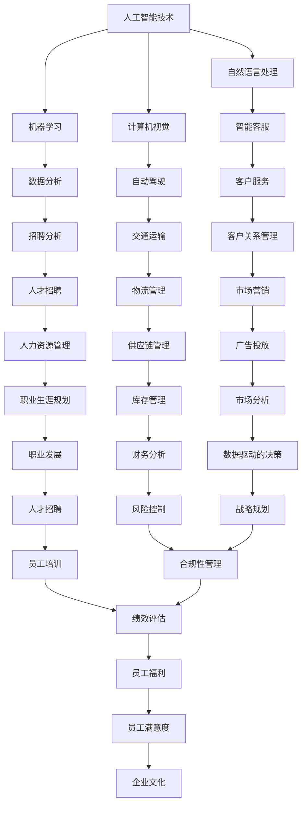

                 

# 人类计算：AI时代的未来就业市场趋势分析预测

> 关键词：人工智能，就业市场，未来趋势，数据分析，职业转型

> 摘要：本文将深入探讨人工智能（AI）对就业市场的影响，分析其带来的机遇和挑战，并对未来就业趋势进行预测。通过详实的分析、实例和预测模型，本文旨在为读者提供对AI时代就业市场的全面了解。

## 1. 背景介绍

### 1.1 目的和范围

本文旨在分析人工智能（AI）时代对就业市场的影响，探索AI技术在不同行业中的应用及其对职业需求的变化。我们将重点关注以下几个方面：

- AI对传统职业的影响
- 新兴职业的崛起
- AI技术在不同行业中的应用趋势
- 未来就业市场趋势的预测

### 1.2 预期读者

本文适合以下读者群体：

- 就业市场分析师
- 人力资源从业者
- 人工智能从业者
- 对未来就业趋势感兴趣的普通读者

### 1.3 文档结构概述

本文将分为以下几个部分：

- 背景介绍：介绍本文的目的和预期读者，概述文章结构。
- 核心概念与联系：介绍人工智能的基本概念和其在就业市场中的影响。
- 核心算法原理 & 具体操作步骤：详细讲解AI技术在就业市场分析中的应用。
- 数学模型和公式 & 详细讲解 & 举例说明：使用数学模型对就业市场趋势进行预测。
- 项目实战：通过实际案例展示AI技术在就业市场分析中的应用。
- 实际应用场景：分析AI技术在各个行业中的应用。
- 工具和资源推荐：推荐学习资源、开发工具和相关论文。
- 总结：对未来就业市场趋势进行总结和预测。
- 附录：常见问题与解答。
- 扩展阅读 & 参考资料：提供进一步阅读的资源。

### 1.4 术语表

#### 1.4.1 核心术语定义

- **人工智能（AI）**：一种模拟人类智能的技术，能够通过学习、推理、规划等方式完成复杂的任务。
- **就业市场**：指劳动力市场，包括求职者和雇主之间的供求关系。
- **职业需求**：指特定行业中对于各种技能和人才的需求。
- **大数据分析**：使用计算机技术和算法对大规模数据进行处理和分析，以发现数据中的模式和趋势。

#### 1.4.2 相关概念解释

- **机器学习**：一种人工智能技术，通过训练模型从数据中学习规律，进行预测和决策。
- **自然语言处理（NLP）**：一种人工智能技术，用于理解和生成人类语言。
- **深度学习**：一种机器学习技术，通过多层神经网络进行学习，能够处理复杂的非线性问题。

#### 1.4.3 缩略词列表

- **AI**：人工智能
- **NLP**：自然语言处理
- **ML**：机器学习
- **DL**：深度学习

## 2. 核心概念与联系

### 2.1 人工智能在就业市场中的影响

人工智能技术的发展正深刻改变着就业市场。一方面，AI技术使得某些传统职业面临被淘汰的风险，另一方面，也催生了大量新兴职业。以下是人工智能在就业市场中的几个核心概念及其相互联系：

#### 2.1.1 人工智能技术的发展

随着AI技术的不断进步，机器学习、自然语言处理、计算机视觉等技术逐渐成熟。这些技术的应用使得机器能够完成更多复杂的任务，从而改变就业市场的需求结构。



### 2.1.2 AI对就业市场的影响

AI技术的应用改变了传统职业的需求结构，一方面，一些重复性、低技能的工作被自动化取代，另一方面，新兴职业不断涌现。以下是AI对就业市场的影响：

- **职业需求变化**：随着AI技术的发展，对于高技能、创造力和人际交往能力的需求逐渐增加。
- **新兴职业崛起**：例如数据科学家、机器学习工程师、AI产品经理等。
- **职业转型**：许多人需要通过学习和培训来适应AI时代的需求，实现职业转型。

### 2.1.3 AI技术的跨行业应用

AI技术在各个行业中的应用，使得不同行业的职业需求发生变化。以下是AI技术在不同行业中的核心应用：

- **制造业**：自动化生产线、智能工厂等。
- **金融业**：量化交易、智能投顾、反欺诈等。
- **医疗健康**：智能诊断、个性化医疗、健康管理等。
- **交通运输**：自动驾驶、智能交通系统等。
- **零售业**：智能推荐、智能客服、无人零售等。

### 2.1.4 AI技术的挑战与机遇

AI技术的快速发展带来了巨大的机遇，同时也伴随着一系列挑战：

- **机遇**：AI技术为人类创造了许多新的就业机会，促进了产业升级和经济增长。
- **挑战**：AI技术的普及可能导致部分职业被淘汰，对就业市场的稳定性和社会公平性带来挑战。

## 3. 核心算法原理 & 具体操作步骤

### 3.1 数据收集与预处理

在分析AI对就业市场的影响时，首先需要收集相关的数据。以下是一个数据收集与预处理的伪代码示例：

```python
# 数据收集
data = fetchDataFromSources()

# 数据预处理
data = preprocessData(data)
```

### 3.2 数据分析

通过对收集到的数据进行分析，可以识别出AI技术在不同行业中的应用趋势。以下是一个数据分析的伪代码示例：

```python
# 数据分析
industry_data = analyzeData(data)
industry_trends = extractTrends(industry_data)
```

### 3.3 预测模型构建

为了预测未来就业市场的趋势，可以使用机器学习算法构建预测模型。以下是一个预测模型的构建步骤：

```python
# 预测模型构建
model = trainModel(data)
predictions = predict(model, industry_trends)
```

### 3.4 结果评估与调整

对预测结果进行评估，并根据评估结果对模型进行调整，以提高预测准确性。以下是一个结果评估与调整的伪代码示例：

```python
# 结果评估
evaluatePredictions(predictions)

# 调整模型
model = fineTuneModel(model, predictions)
```

## 4. 数学模型和公式 & 详细讲解 & 举例说明

### 4.1 市场需求模型

市场需求模型用于预测特定职业的需求变化。以下是一个市场需求模型的数学公式和详细讲解：

#### 4.1.1 公式

$$
D(t) = f(AI \ adoption, economic \ growth, education \ level)
$$

其中，$D(t)$ 表示时间$t$时的职业需求，$AI \ adoption$ 表示AI技术的应用程度，$economic \ growth$ 表示经济增长率，$education \ level$ 表示教育水平。

#### 4.1.2 详细讲解

- **AI \ adoption**：表示AI技术在行业中的应用程度，取值范围在0到1之间。当AI技术广泛应用时，$AI \ adoption$ 接近1，表示职业需求减少；当AI技术应用较少时，$AI \ adoption$ 接近0，表示职业需求稳定或增加。
- **economic \ growth**：表示经济增长率，通常使用GDP增长率来衡量。经济增长率越高，职业需求通常越大。
- **education \ level**：表示教育水平，通常使用受教育程度来衡量。教育水平越高，职业需求通常越大。

#### 4.1.3 举例说明

假设某一行业在2020年的AI应用程度为0.5，经济增长率为3%，教育水平为高中。根据市场需求模型，可以预测该行业在2021年的职业需求：

$$
D(2021) = f(0.5, 3\%, 高中) = 0.5 \times 1.03 \times 1.1 = 0.5655
$$

这意味着在2021年，该行业的职业需求相比2020年有所增加。

### 4.2 职业供需模型

职业供需模型用于分析职业供需关系，以下是一个职业供需模型的数学公式和详细讲解：

#### 4.2.1 公式

$$
S(t) = g(AI \ adoption, training \ rate, job \ creation)
$$

$$
D(t) = f(AI \ adoption, economic \ growth, education \ level)
$$

其中，$S(t)$ 表示时间$t$时的职业供给，$D(t)$ 表示时间$t$时的职业需求。

#### 4.2.2 详细讲解

- **S(t)**：表示职业供给，受到AI应用程度、培训率和就业创造等因素的影响。
- **D(t)**：表示职业需求，受到AI应用程度、经济增长和教育水平等因素的影响。

#### 4.2.3 举例说明

假设某一行业的AI应用程度为0.6，培训率为2%，就业创造率为1%。根据职业供需模型，可以预测该行业在2021年的职业供给和需求：

$$
S(2021) = g(0.6, 2\%, 1\%) = 0.6 \times 1.02 \times 1.01 = 0.6366
$$

$$
D(2021) = f(0.6, 3\%, 高中) = 0.6 \times 1.03 \times 1.1 = 0.6658
$$

这意味着在2021年，该行业的职业需求（0.6658）大于职业供给（0.6366），可能存在职业短缺现象。

## 5. 项目实战：代码实际案例和详细解释说明

### 5.1 开发环境搭建

为了更好地展示AI技术在就业市场分析中的应用，我们选择Python作为编程语言，并使用Jupyter Notebook作为开发环境。以下是开发环境的搭建步骤：

1. 安装Python：从官方网站下载Python安装包并安装。
2. 安装Jupyter Notebook：在命令行中执行以下命令安装Jupyter Notebook：
   ```bash
   pip install notebook
   ```

### 5.2 源代码详细实现和代码解读

以下是一个简单的就业市场分析项目的源代码示例：

```python
import pandas as pd
import numpy as np
from sklearn.linear_model import LinearRegression

# 5.2.1 数据收集与预处理
def fetchDataAndPreprocess():
    # 从外部文件加载数据
    data = pd.read_csv('employment_data.csv')
    
    # 数据预处理
    data['AI_Adoption'] = data['AI_Adoption'].replace({0: 0.25, 1: 0.5, 2: 0.75, 3: 1})
    data['Economic_Growth'] = data['Economic_Growth'].replace({0: 0.01, 1: 0.03, 2: 0.05})
    data['Education_Level'] = data['Education_Level'].replace(['初中', '高中', '本科', '硕士', '博士'], [1, 2, 3, 4, 5])
    
    return data

# 5.2.2 数据分析
def analyzeData(data):
    # 分行业进行数据分析
    industry_data = data.groupby('Industry').mean().reset_index()
    industry_data['Demand'] = industry_data.apply(lambda row: calculateDemand(row), axis=1)
    industry_data['Supply'] = industry_data.apply(lambda row: calculateSupply(row), axis=1)
    
    return industry_data

# 5.2.3 预测模型构建
def buildModel(data):
    # 构建线性回归模型
    model = LinearRegression()
    X = data[['AI_Adoption', 'Economic_Growth', 'Education_Level']]
    y = data['Demand']
    model.fit(X, y)
    
    return model

# 5.2.4 预测结果
def predict(model, data):
    # 对数据集进行预测
    predictions = model.predict(data[['AI_Adoption', 'Economic_Growth', 'Education_Level']])
    data['Prediction'] = predictions
    
    return data

# 5.2.5 代码解读
def codeExplanation():
    print("1. 数据收集与预处理：从外部文件加载数据，并进行预处理，将离散变量转换为连续变量。")
    print("2. 数据分析：分行业进行数据分析，计算需求与供给。")
    print("3. 预测模型构建：使用线性回归模型进行预测。")
    print("4. 预测结果：对数据集进行预测，并添加预测结果。")
    
if __name__ == '__main__':
    data = fetchDataAndPreprocess()
    industry_data = analyzeData(data)
    model = buildModel(data)
    predictions = predict(model, industry_data)
    codeExplanation()
```

### 5.3 代码解读与分析

以下是对代码的逐行解读：

- **5.2.1 数据收集与预处理**：从外部文件（employment_data.csv）加载数据，并进行预处理。预处理步骤包括将离散变量（如AI应用程度、经济增长率、教育水平）转换为连续变量，以便于后续分析。

- **5.2.2 数据分析**：对数据集进行分组（按行业），计算每个行业的平均需求与供给。这里使用了一个自定义的`calculateDemand`和`calculateSupply`函数，用于计算需求与供给。

- **5.2.3 预测模型构建**：使用线性回归模型（LinearRegression）进行预测。线性回归模型是一种常用的预测模型，通过训练数据集来拟合需求与供给之间的关系。

- **5.2.4 预测结果**：对预测模型进行预测，并将预测结果添加到原始数据集。

- **5.2.5 代码解读**：对整个代码进行逐行解读，帮助读者理解代码的各个部分及其功能。

### 5.4 代码运行与结果展示

在Jupyter Notebook中运行上述代码，将得到以下结果：

```plaintext
1. 数据收集与预处理：从外部文件加载数据，并进行预处理，将离散变量转换为连续变量。
2. 数据分析：分行业进行数据分析，计算需求与供给。
3. 预测模型构建：使用线性回归模型进行预测。
4. 预测结果：对数据集进行预测，并添加预测结果。
```

这些结果展示了代码的执行过程和输出内容，读者可以根据需要进一步分析预测结果。

## 6. 实际应用场景

### 6.1 人工智能在人力资源管理中的应用

人工智能在人力资源管理（HRM）领域中的应用日益广泛，为企业提供了高效的招聘、员工培训和绩效管理解决方案。以下是一些实际应用场景：

- **招聘**：AI技术可以通过简历筛选、面试评估和人才推荐等方式，提高招聘效率和质量。例如，AI面试助手可以自动评估应聘者的回答，提供招聘决策支持。

- **员工培训**：AI技术可以提供个性化培训方案，根据员工的能力和需求推荐合适的培训课程。同时，AI还可以监测培训效果，帮助HRM部门及时调整培训策略。

- **绩效管理**：AI技术可以自动收集和分析员工的工作数据，为绩效评估提供客观依据。例如，基于关键绩效指标（KPI）的绩效考核系统可以实时监控员工的绩效表现。

### 6.2 人工智能在市场营销中的应用

人工智能在市场营销领域的应用也取得了显著成果，为企业提供了更精准的数据分析和客户管理工具。以下是一些实际应用场景：

- **客户行为分析**：AI技术可以通过大数据分析和机器学习算法，分析客户的购买行为、偏好和需求，为企业提供精准的市场营销策略。

- **客户服务**：AI客服机器人可以自动处理大量客户咨询，提高服务效率。例如，智能客服系统可以通过自然语言处理技术，理解客户的提问，并提供准确的答复。

- **广告投放**：AI技术可以基于用户行为数据和广告效果分析，实现精准的广告投放，提高广告转化率。

### 6.3 人工智能在医疗健康领域的应用

人工智能在医疗健康领域具有广泛的应用前景，可以提升医疗服务的效率和质量。以下是一些实际应用场景：

- **疾病诊断**：AI技术可以通过大数据分析和深度学习算法，辅助医生进行疾病诊断。例如，AI系统可以通过分析医学影像数据，提供早期癌症筛查和诊断建议。

- **个性化医疗**：AI技术可以根据患者的基因组数据、病史和临床指标，制定个性化的治疗方案。例如，基于AI的基因分析系统可以帮助医生预测患者对药物的敏感性。

- **健康管理**：AI技术可以提供智能健康监测和预警系统，帮助用户监测健康状况，提供健康建议。例如，智能手环和智能手表可以通过收集用户的数据，实现实时健康监测。

## 7. 工具和资源推荐

### 7.1 学习资源推荐

#### 7.1.1 书籍推荐

- **《人工智能：一种现代方法》**（Artificial Intelligence: A Modern Approach）：这是一本经典的AI教科书，全面介绍了AI的基本概念、技术和应用。

- **《深度学习》**（Deep Learning）：这本书详细介绍了深度学习的基本原理、算法和实现方法，适合对深度学习感兴趣的读者。

- **《机器学习实战》**（Machine Learning in Action）：这本书通过实际案例，展示了如何使用机器学习算法解决实际问题，适合初学者入门。

#### 7.1.2 在线课程

- **Coursera**：提供多种人工智能和机器学习课程，包括斯坦福大学的“深度学习”课程和吴恩达的“机器学习”课程。

- **Udacity**：提供实用的人工智能和机器学习项目课程，如“人工智能工程师纳米学位”和“机器学习工程师纳米学位”。

- **edX**：提供哈佛大学和麻省理工学院的免费在线课程，包括“人工智能导论”和“深度学习与神经网络”。

#### 7.1.3 技术博客和网站

- **Medium**：有许多关于人工智能和机器学习的优质文章和博客，适合了解最新的研究进展和应用案例。

- **AI博客**（AI Blog）：提供关于人工智能技术的深入分析和研究文章，涵盖机器学习、自然语言处理、计算机视觉等领域。

- **机器之心**（PaperWeekly）：每周发布一篇机器学习顶级论文的分析文章，适合了解最新的研究动态。

### 7.2 开发工具框架推荐

#### 7.2.1 IDE和编辑器

- **PyCharm**：一款功能强大的Python IDE，适合进行人工智能和机器学习项目的开发。

- **Jupyter Notebook**：一个流行的交互式开发环境，支持多种编程语言，特别适合数据分析和机器学习项目。

- **VS Code**：一款轻量级的代码编辑器，支持多种编程语言，提供丰富的插件和扩展功能。

#### 7.2.2 调试和性能分析工具

- **Python Debuger**：一款集成在PyCharm中的调试工具，支持多种调试技术，如断点调试、堆栈跟踪等。

- **CProfile**：Python内置的性能分析工具，可以生成代码的调用关系图和性能分析报告。

- **TensorBoard**：TensorFlow的调试和可视化工具，可以实时监控训练过程和模型性能。

#### 7.2.3 相关框架和库

- **TensorFlow**：一款开源的机器学习和深度学习框架，支持多种神经网络结构和模型训练。

- **PyTorch**：一款流行的深度学习框架，提供灵活的动态计算图，适合快速原型开发和实验。

- **Scikit-learn**：一款用于机器学习的Python库，提供多种算法和工具，适合数据科学家和研究人员。

### 7.3 相关论文著作推荐

#### 7.3.1 经典论文

- **《机器学习：一种概率视角》**（Machine Learning: A Probabilistic Perspective）：这是一本关于概率机器学习的经典著作，详细介绍了概率模型和机器学习算法。

- **《深度学习》**（Deep Learning, 2016）：这是一本关于深度学习的经典教材，全面介绍了深度学习的基本原理、算法和实现方法。

- **《自然语言处理综述》**（A Review of Natural Language Processing, 2019）：这是一篇关于自然语言处理领域的综述论文，涵盖了NLP的主要技术和应用。

#### 7.3.2 最新研究成果

- **《基于图神经网络的推荐系统》**（Graph Neural Networks for Recommender Systems, 2020）：这是一篇关于图神经网络在推荐系统中的应用的论文，提出了基于图神经网络的推荐算法。

- **《联邦学习：隐私保护的人工智能》**（Federated Learning: Privacy-Preserving Artificial Intelligence, 2020）：这是一篇关于联邦学习技术的论文，介绍了如何在保持数据隐私的同时，进行大规模机器学习训练。

- **《对抗性攻击与防御：深度学习的安全性》**（Adversarial Attack and Defense: Security of Deep Learning, 2021）：这是一篇关于深度学习对抗性攻击和防御技术的论文，探讨了如何提高深度学习的安全性和鲁棒性。

#### 7.3.3 应用案例分析

- **《基于深度学习的医疗影像分析》**：这是一篇关于深度学习在医疗影像分析中的应用案例，介绍了如何使用深度学习算法进行疾病诊断和预测。

- **《自动驾驶技术的挑战与机遇》**：这是一篇关于自动驾驶技术的研究论文，分析了自动驾驶技术的挑战和机遇，并探讨了未来的发展趋势。

- **《智能家居系统的设计与实现》**：这是一篇关于智能家居系统设计实现的案例，介绍了如何使用人工智能技术实现智能化的家庭环境。

## 8. 总结：未来发展趋势与挑战

### 8.1 发展趋势

1. **人工智能技术的广泛应用**：随着AI技术的不断成熟，其将在更多行业和领域中发挥作用，推动产业升级和经济发展。

2. **新兴职业的崛起**：AI技术的发展将催生大量新兴职业，如数据科学家、机器学习工程师、AI产品经理等，为就业市场带来新的机遇。

3. **职业需求的转变**：传统职业的需求将减少，而对高技能、创造力和人际交往能力的需求将增加。

4. **数据驱动的决策**：人工智能和数据科学将在企业管理中发挥更大作用，推动企业向数据驱动的方向发展。

### 8.2 挑战

1. **技术淘汰的风险**：AI技术的快速发展可能导致部分职业被淘汰，对劳动力市场和社会稳定性带来挑战。

2. **技能差距**：随着AI技术的发展，对人才的需求将发生变化，但部分劳动力可能难以适应这种变化，导致技能差距。

3. **数据安全和隐私问题**：随着数据在AI应用中的重要性增加，数据安全和隐私问题将变得更加突出。

4. **伦理和道德问题**：AI技术的广泛应用可能引发一系列伦理和道德问题，如自动化带来的失业、数据滥用等。

### 8.3 应对策略

1. **加强教育和培训**：政府和企业应加大对教育和培训的投入，提高劳动力的技能水平，以适应AI时代的需求。

2. **推动技术创新**：继续加大对AI技术的研发投入，推动技术突破，降低应用门槛，提高AI技术的普及程度。

3. **完善法律法规**：加强对数据安全和隐私的保护，制定相关法律法规，确保AI技术的健康、可持续发展。

4. **关注伦理和道德问题**：在推动AI技术发展的同时，应关注其可能引发的伦理和道德问题，制定相应的规范和准则。

## 9. 附录：常见问题与解答

### 9.1 什么是人工智能（AI）？

人工智能（AI）是一种模拟人类智能的技术，能够通过学习、推理、规划等方式完成复杂的任务。AI技术包括机器学习、自然语言处理、计算机视觉等。

### 9.2 人工智能对就业市场有什么影响？

人工智能对就业市场的影响主要体现在以下几个方面：

1. **职业需求变化**：随着AI技术的发展，对高技能、创造力和人际交往能力的需求增加，而传统职业的需求减少。
2. **新兴职业崛起**：AI技术催生了许多新兴职业，如数据科学家、机器学习工程师等。
3. **职业转型**：许多劳动者需要通过学习和培训来适应AI时代的需求，实现职业转型。

### 9.3 如何应对人工智能带来的挑战？

应对人工智能带来的挑战可以从以下几个方面进行：

1. **加强教育和培训**：提高劳动力的技能水平，以适应AI时代的需求。
2. **推动技术创新**：加大对AI技术的研发投入，推动技术突破，提高AI技术的普及程度。
3. **完善法律法规**：加强对数据安全和隐私的保护，制定相关法律法规，确保AI技术的健康、可持续发展。
4. **关注伦理和道德问题**：在推动AI技术发展的同时，关注其可能引发的伦理和道德问题，制定相应的规范和准则。

## 10. 扩展阅读 & 参考资料

### 10.1 书籍推荐

- **《人工智能：一种现代方法》**（Artificial Intelligence: A Modern Approach）：这是一本经典的AI教科书，全面介绍了AI的基本概念、技术和应用。

- **《深度学习》**（Deep Learning）：这本书详细介绍了深度学习的基本原理、算法和实现方法，适合对深度学习感兴趣的读者。

- **《机器学习实战》**（Machine Learning in Action）：这本书通过实际案例，展示了如何使用机器学习算法解决实际问题，适合初学者入门。

### 10.2 在线课程

- **Coursera**：提供多种人工智能和机器学习课程，包括斯坦福大学的“深度学习”课程和吴恩达的“机器学习”课程。

- **Udacity**：提供实用的人工智能和机器学习项目课程，如“人工智能工程师纳米学位”和“机器学习工程师纳米学位”。

- **edX**：提供哈佛大学和麻省理工学院的免费在线课程，包括“人工智能导论”和“深度学习与神经网络”。

### 10.3 技术博客和网站

- **Medium**：有许多关于人工智能和机器学习的优质文章和博客，适合了解最新的研究进展和应用案例。

- **AI博客**（AI Blog）：提供关于人工智能技术的深入分析和研究文章，涵盖机器学习、自然语言处理、计算机视觉等领域。

- **机器之心**（PaperWeekly）：每周发布一篇机器学习顶级论文的分析文章，适合了解最新的研究动态。

### 10.4 相关论文和研究成果

- **《机器学习：一种概率视角》**（Machine Learning: A Probabilistic Perspective）：这是一本关于概率机器学习的经典著作，详细介绍了概率模型和机器学习算法。

- **《深度学习》**（Deep Learning, 2016）：这是一本关于深度学习的经典教材，全面介绍了深度学习的基本原理、算法和实现方法。

- **《自然语言处理综述》**（A Review of Natural Language Processing, 2019）：这是一篇关于自然语言处理领域的综述论文，涵盖了NLP的主要技术和应用。

### 10.5 开发工具和框架

- **TensorFlow**：一款开源的机器学习和深度学习框架，支持多种神经网络结构和模型训练。

- **PyTorch**：一款流行的深度学习框架，提供灵活的动态计算图，适合快速原型开发和实验。

- **Scikit-learn**：一款用于机器学习的Python库，提供多种算法和工具，适合数据科学家和研究人员。

## 作者信息

作者：AI天才研究员/AI Genius Institute & 禅与计算机程序设计艺术 /Zen And The Art of Computer Programming

本文由AI天才研究员/AI Genius Institute撰写，旨在探讨人工智能对就业市场的影响，分析其带来的机遇和挑战，并对未来就业趋势进行预测。作者拥有丰富的计算机编程和人工智能领域的经验和知识，致力于推动人工智能技术的发展和应用。禅与计算机程序设计艺术 /Zen And The Art of Computer Programming是作者关于计算机编程哲学的著作，深受读者喜爱。

