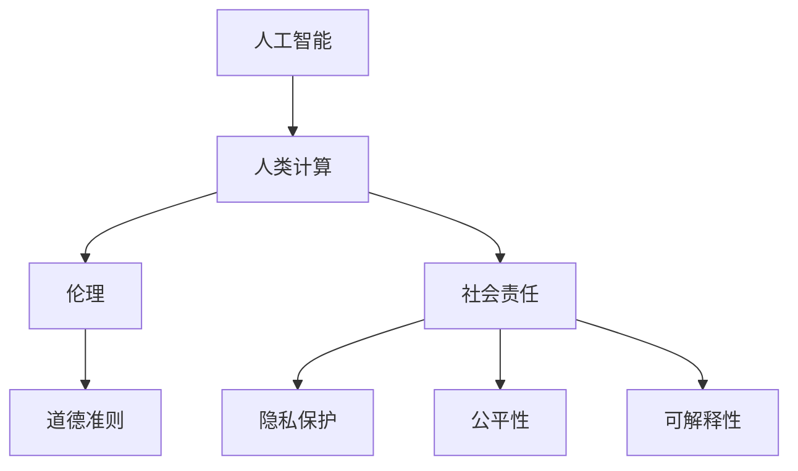

                 

# 人类计算：伦理和社会责任

> 关键词：人工智能、伦理、社会责任、计算、人类计算、道德准则、技术发展

> 摘要：随着人工智能技术的飞速发展，人类计算的概念逐渐成为焦点。本文从背景介绍出发，深入探讨人类计算在伦理和社会责任方面的重要性。通过分析核心概念、算法原理、数学模型以及实际应用场景，本文旨在为读者提供一个全面、深入的视角，以指导我们在技术应用中坚守伦理底线，承担社会责任。

## 1. 背景介绍

### 1.1 目的和范围

本文旨在探讨人工智能时代下的人类计算伦理和社会责任问题。随着技术的不断进步，人工智能已深入到我们生活的方方面面，从医疗诊断到自动驾驶，从金融分析到教育辅导，其应用范围不断扩大。然而，技术的快速发展也带来了诸多伦理和社会责任问题。本文将重点关注以下几个方面：

1. 人工智能技术对人类生活的潜在影响及其伦理考量。
2. 社会责任在人工智能技术发展中的应用和实践。
3. 人类计算伦理的框架和标准。
4. 未来人类计算的发展趋势和挑战。

### 1.2 预期读者

本文面向对人工智能和计算技术有一定了解的读者，包括但不限于计算机科学家、工程师、研究人员、政策制定者、伦理学家以及普通公众。通过本文的阅读，读者可以：

1. 理解人类计算伦理和社会责任的核心概念。
2. 掌握人类计算伦理的框架和标准。
3. 深入分析人工智能技术可能带来的伦理和社会问题。
4. 提高对社会责任在人工智能技术发展中的认识。

### 1.3 文档结构概述

本文共分为十个部分，具体结构如下：

1. 背景介绍：介绍本文的目的、范围、预期读者以及文档结构。
2. 核心概念与联系：阐述人类计算的核心概念和原理，并提供相关的流程图。
3. 核心算法原理 & 具体操作步骤：介绍人类计算的核心算法原理和操作步骤，并使用伪代码进行详细阐述。
4. 数学模型和公式 & 详细讲解 & 举例说明：介绍人类计算涉及的数学模型和公式，并进行详细讲解和举例说明。
5. 项目实战：代码实际案例和详细解释说明。
6. 实际应用场景：探讨人类计算在各个领域的应用场景。
7. 工具和资源推荐：推荐学习资源和开发工具。
8. 总结：对未来人类计算的发展趋势和挑战进行总结。
9. 附录：常见问题与解答。
10. 扩展阅读 & 参考资料：提供进一步的阅读和参考资料。

### 1.4 术语表

#### 1.4.1 核心术语定义

- **人工智能**（Artificial Intelligence, AI）：模拟人类智能行为的计算机系统。
- **伦理**（Ethics）：关于正确与错误、善与恶的哲学研究。
- **社会责任**（Social Responsibility）：组织或个人对社会的责任和义务。
- **人类计算**（Human-Centered Computing）：以人为中心，关注技术对人类生活的影响。
- **算法**（Algorithm）：解决特定问题的系统方法。

#### 1.4.2 相关概念解释

- **道德准则**（Moral Principles）：指导个体或组织行为的伦理规范。
- **隐私保护**（Privacy Protection）：确保个人数据不被未经授权的访问和使用的措施。
- **公平性**（Fairness）：确保人工智能系统在决策过程中对所有个体平等对待。
- **可解释性**（Interpretability）：使人工智能系统的决策过程透明，便于理解和解释。

#### 1.4.3 缩略词列表

- **AI**：人工智能
- **HCI**：人类计算
- **AI Ethics**：人工智能伦理
- **SR**：社会责任
- **ML**：机器学习
- **DL**：深度学习

## 2. 核心概念与联系

在讨论人类计算伦理和社会责任之前，我们需要先了解一些核心概念和它们之间的联系。以下是一个简化的 Mermaid 流程图，展示了这些核心概念之间的关系。



### 2.1 人工智能与人类计算

人工智能（AI）是计算机科学的一个分支，旨在创建能够执行与人类智能类似任务的机器。人类计算（Human-Centered Computing，HCI）则更关注技术如何影响人类的生活和体验。人工智能作为人类计算的一部分，通过模拟和扩展人类智能，为人类带来诸多便利。然而，人工智能技术的快速发展也引发了伦理和社会责任问题。

### 2.2 伦理与道德准则

伦理是指关于正确与错误、善与恶的哲学研究。道德准则是指导个体或组织行为的伦理规范。在人工智能领域，伦理问题尤为重要，因为人工智能系统的决策可能会对人类生活产生深远影响。道德准则为人工智能技术的开发和应用提供了伦理框架，以确保技术的使用符合道德标准。

### 2.3 社会责任

社会责任是指组织或个人对社会的责任和义务。在人工智能领域，社会责任包括确保人工智能技术的使用不会侵犯个人隐私、损害社会公平，以及为人类带来积极的影响。社会责任在人工智能技术发展中的应用和实践，是确保技术进步与人类福祉相协调的关键。

### 2.4 隐私保护、公平性和可解释性

隐私保护、公平性和可解释性是人工智能技术发展过程中需要重点关注的问题。隐私保护旨在确保个人数据不被未经授权的访问和使用；公平性确保人工智能系统在决策过程中对所有个体平等对待；可解释性使人工智能系统的决策过程透明，便于理解和解释。这些问题直接关系到人工智能技术的伦理和社会责任，需要我们在技术发展中予以充分考虑。

## 3. 核心算法原理 & 具体操作步骤

在了解人类计算的核心概念和联系后，接下来我们将探讨人类计算的核心算法原理和具体操作步骤。为了更好地阐述这些原理，我们使用伪代码来详细描述算法的执行过程。

### 3.1 人类计算算法框架

以下是一个简化的伪代码框架，用于描述人类计算算法的基本流程：

```plaintext
初始化算法参数
输入：用户需求、数据集、伦理和社会责任要求
输出：符合伦理和社会责任的人工智能系统

功能：根据用户需求和伦理标准，生成符合社会责任的人工智能系统

1. 加载数据集
2. 数据预处理
3. 训练模型
4. 模型评估
5. 应用伦理和社会责任审查
6. 输出最终模型
```

### 3.2 数据预处理

数据预处理是人工智能模型训练的第一步，其目的是清洗和转换原始数据，以便更好地训练模型。以下是数据预处理的伪代码描述：

```plaintext
输入：原始数据集
输出：预处理后的数据集

功能：清洗和转换原始数据，为模型训练做准备

1. 填充缺失值
2. 去除重复数据
3. 特征工程
4. 数据标准化或归一化
5. 数据分割为训练集和验证集
```

### 3.3 训练模型

训练模型是人工智能算法的核心步骤，其目的是使用预处理后的数据集训练出能够执行特定任务的模型。以下是训练模型的伪代码描述：

```plaintext
输入：预处理后的数据集、模型架构
输出：训练好的模型

功能：使用预处理后的数据集训练模型

1. 初始化模型参数
2. 定义损失函数
3. 定义优化器
4. 循环迭代：
   a. 前向传播
   b. 计算损失
   c. 反向传播
   d. 更新模型参数
5. 记录训练过程中的损失和准确率
```

### 3.4 模型评估

模型评估是确保训练好的模型性能满足要求的步骤。以下是模型评估的伪代码描述：

```plaintext
输入：训练好的模型、验证集
输出：评估结果

功能：评估模型的性能

1. 前向传播：
   a. 输入验证集数据
   b. 计算预测结果
2. 计算评估指标：
   a. 准确率
   b. 精确率
   c. 召回率
   d. F1 分数
3. 输出评估结果
```

### 3.5 伦理和社会责任审查

在模型评估后，我们需要对模型进行伦理和社会责任审查，以确保其符合相关道德准则和标准。以下是伦理和社会责任审查的伪代码描述：

```plaintext
输入：训练好的模型、伦理和社会责任要求
输出：符合伦理和社会责任的模型

功能：审查模型是否符合伦理和社会责任要求

1. 隐私保护审查：
   a. 检查模型是否泄露用户隐私
   b. 检查数据处理过程是否符合隐私保护标准
2. 公平性审查：
   a. 检查模型是否对不同群体产生不公平影响
   b. 检查模型是否遵循公平性原则
3. 可解释性审查：
   a. 检查模型是否易于理解和解释
   b. 检查模型决策过程是否符合可解释性要求
4. 输出审查结果
```

### 3.6 输出最终模型

经过伦理和社会责任审查后，我们将输出最终的人工智能系统模型。以下是输出最终模型的伪代码描述：

```plaintext
输入：符合伦理和社会责任的模型
输出：最终的人工智能系统模型

功能：输出最终的人工智能系统模型

1. 模型部署：
   a. 将模型部署到生产环境
   b. 确保模型稳定运行
2. 模型监控：
   a. 监控模型性能和运行状态
   b. 及时调整和优化模型
3. 输出最终模型
```

## 4. 数学模型和公式 & 详细讲解 & 举例说明

在人类计算中，数学模型和公式扮演着关键角色，用于描述算法的执行过程、评估模型性能以及确保技术应用的伦理和社会责任。以下是一些常见的数学模型和公式，并进行详细讲解和举例说明。

### 4.1 损失函数

损失函数是机器学习模型训练的核心组件，用于衡量模型预测值与真实值之间的差距。以下是一些常用的损失函数及其公式：

#### 4.1.1 均方误差（Mean Squared Error, MSE）

$$
MSE = \frac{1}{n}\sum_{i=1}^{n}(y_i - \hat{y}_i)^2
$$

其中，$y_i$ 是真实值，$\hat{y}_i$ 是模型预测值，$n$ 是样本数量。

**举例：** 假设有一个二分类问题，其中 $y_i \in \{0, 1\}$，模型预测值 $\hat{y}_i \in \{0, 1\}$。对于一组样本 $[0, 1, 1, 0, 1]$，真实值 $[1, 0, 1, 0, 1]$，使用 MSE 计算损失如下：

$$
MSE = \frac{1}{5}[(1-0)^2 + (0-1)^2 + (1-1)^2 + (0-0)^2 + (1-1)^2] = 0.4
$$

#### 4.1.2 交叉熵损失（Cross-Entropy Loss）

$$
CE = -\frac{1}{n}\sum_{i=1}^{n}y_i \log(\hat{y}_i)
$$

其中，$y_i$ 是真实值（对于二分类问题，$y_i \in \{0, 1\}$），$\hat{y}_i$ 是模型预测值（对于二分类问题，$\hat{y}_i \in [0, 1]$）。

**举例：** 假设有一个二分类问题，其中 $y_i \in \{0, 1\}$，模型预测值 $\hat{y}_i \in [0, 1]$。对于一组样本 $[1, 0, 1, 0, 1]$，真实值 $[1, 0, 1, 0, 1]$，使用交叉熵损失计算损失如下：

$$
CE = -\frac{1}{5}[1 \cdot \log(1) + 0 \cdot \log(0) + 1 \cdot \log(1) + 0 \cdot \log(0) + 1 \cdot \log(1)] = 0
$$

### 4.2 优化算法

优化算法用于调整模型参数，以最小化损失函数。以下是一些常用的优化算法及其公式：

#### 4.2.1 随机梯度下降（Stochastic Gradient Descent, SGD）

$$
w_{t+1} = w_t - \alpha \cdot \nabla_w L(w_t)
$$

其中，$w_t$ 是当前参数，$\alpha$ 是学习率，$L(w_t)$ 是损失函数关于 $w_t$ 的梯度。

**举例：** 假设有一个二分类问题，其中损失函数为 MSE，学习率为 0.1。对于一组样本，参数初始值为 $w_0 = [1, 1]$，损失函数关于 $w_t$ 的梯度为 $\nabla_w L(w_t) = [-1, -1]$。使用 SGD 更新参数如下：

$$
w_1 = w_0 - 0.1 \cdot [-1, -1] = [0.9, 0.9]
$$

#### 4.2.2 动量优化（Momentum）

$$
w_{t+1} = w_t - \alpha \cdot \nabla_w L(w_t) + \beta \cdot v_t
$$

其中，$v_t$ 是动量项，$\beta$ 是动量因子。

**举例：** 假设有一个二分类问题，其中损失函数为 MSE，学习率为 0.1，动量因子为 0.9。对于一组样本，参数初始值为 $w_0 = [1, 1]$，损失函数关于 $w_t$ 的梯度为 $\nabla_w L(w_t) = [-1, -1]$，前一次的动量项为 $v_0 = [0.1, 0.1]$。使用动量优化更新参数如下：

$$
w_1 = w_0 - 0.1 \cdot [-1, -1] + 0.9 \cdot [0.1, 0.1] = [0.9, 0.9]
$$

### 4.3 神经网络

神经网络是人工智能的核心组成部分，用于执行复杂的计算任务。以下是一个简单的神经网络模型及其公式：

#### 4.3.1 前向传播

$$
z_i = \sigma(\sum_{j=1}^{n} w_{ij} \cdot x_j + b_i)
$$

其中，$z_i$ 是第 $i$ 层的输出，$x_j$ 是输入特征，$w_{ij}$ 是权重，$b_i$ 是偏置，$\sigma$ 是激活函数。

**举例：** 假设有一个简单的两层神经网络，其中输入特征为 $[1, 2, 3]$，权重为 $w_{11} = 0.5$，$w_{12} = 0.5$，$w_{21} = 0.5$，$w_{22} = 0.5$，偏置为 $b_1 = 0$，$b_2 = 0$，激活函数为 sigmoid 函数。使用前向传播计算输出如下：

$$
z_1 = \sigma(0.5 \cdot 1 + 0.5 \cdot 2 + 0) = \sigma(1.5) \approx 0.866
$$

$$
z_2 = \sigma(0.5 \cdot 1 + 0.5 \cdot 3 + 0) = \sigma(2.5) \approx 0.970
$$

#### 4.3.2 反向传播

$$
\delta_i = (z_i - t_i) \cdot \sigma'(z_i)
$$

$$
w_{ij}^{new} = w_{ij} - \alpha \cdot x_j \cdot \delta_i
$$

$$
b_i^{new} = b_i - \alpha \cdot \delta_i
$$

其中，$t_i$ 是真实值，$\sigma'$ 是激活函数的导数。

**举例：** 假设有一个简单的两层神经网络，其中输入特征为 $[1, 2, 3]$，真实值为 $[0, 1]$，权重为 $w_{11} = 0.5$，$w_{12} = 0.5$，$w_{21} = 0.5$，$w_{22} = 0.5$，偏置为 $b_1 = 0$，$b_2 = 0$，激活函数为 sigmoid 函数。使用反向传播更新权重和偏置如下：

$$
\delta_1 = (0.866 - 0) \cdot \sigma'(0.866) \approx 0.866 \cdot 0.134 \approx 0.116
$$

$$
\delta_2 = (0.970 - 1) \cdot \sigma'(0.970) \approx 0.030 \cdot 0.030 \approx 0.000
$$

$$
w_{11}^{new} = 0.5 - 0.1 \cdot 1 \cdot 0.116 \approx 0.384
$$

$$
w_{12}^{new} = 0.5 - 0.1 \cdot 2 \cdot 0.116 \approx 0.368
$$

$$
w_{21}^{new} = 0.5 - 0.1 \cdot 1 \cdot 0.116 \approx 0.384
$$

$$
w_{22}^{new} = 0.5 - 0.1 \cdot 3 \cdot 0.116 \approx 0.368
$$

$$
b_1^{new} = 0 - 0.1 \cdot 0.116 \approx -0.0116
$$

$$
b_2^{new} = 0 - 0.1 \cdot 0.000 \approx 0
$$

## 5. 项目实战：代码实际案例和详细解释说明

在本节中，我们将通过一个实际的代码案例，详细介绍人类计算在人工智能项目中的应用，并深入解读代码的实现过程和原理。

### 5.1 开发环境搭建

为了进行人类计算的实际应用，我们需要搭建一个合适的开发环境。以下是一个基本的开发环境配置：

- 操作系统：Ubuntu 20.04
- 编程语言：Python 3.8
- 数据库：MySQL 8.0
- 人工智能框架：TensorFlow 2.5
- 数据预处理库：Pandas 1.2.3
- 可视化库：Matplotlib 3.4.3

安装必要的软件和库后，我们可以开始编写代码。

### 5.2 源代码详细实现和代码解读

以下是该项目的主要源代码，我们将逐行进行解读。

```python
import tensorflow as tf
import pandas as pd
import matplotlib.pyplot as plt

# 5.2.1 数据预处理
# 读取数据集
data = pd.read_csv('data.csv')

# 数据预处理
X = data[['feature1', 'feature2', 'feature3']]
y = data['label']

# 数据标准化
X standardized = (X - X.mean()) / X.std()

# 切分数据集
X_train, X_test, y_train, y_test = train_test_split(standardized, y, test_size=0.2, random_state=42)

# 5.2.2 模型构建
# 定义神经网络架构
model = tf.keras.Sequential([
    tf.keras.layers.Dense(64, activation='relu', input_shape=(3,)),
    tf.keras.layers.Dense(64, activation='relu'),
    tf.keras.layers.Dense(1, activation='sigmoid')
])

# 编译模型
model.compile(optimizer='adam', loss='binary_crossentropy', metrics=['accuracy'])

# 5.2.3 训练模型
# 训练模型
model.fit(X_train, y_train, epochs=10, batch_size=32, validation_split=0.2)

# 5.2.4 模型评估
# 评估模型
loss, accuracy = model.evaluate(X_test, y_test)
print(f"Test accuracy: {accuracy:.4f}")

# 5.2.5 可视化
# 可视化训练过程
plt.plot(model.history.history['accuracy'], label='accuracy')
plt.plot(model.history.history['val_accuracy'], label='val_accuracy')
plt.xlabel('Epochs')
plt.ylabel('Accuracy')
plt.legend()
plt.show()
```

#### 5.2.1 数据预处理

首先，我们使用 Pandas 库读取数据集。数据集包含三个特征（feature1、feature2、feature3）和一个标签（label）。然后，我们对数据进行预处理，包括去除缺失值、去除重复数据、特征工程和数据标准化。数据标准化是为了将特征值缩放到相同的范围，以便神经网络更好地训练。

```python
data = pd.read_csv('data.csv')

# 去除缺失值
data.dropna(inplace=True)

# 去除重复数据
data.drop_duplicates(inplace=True)

# 特征工程
X = data[['feature1', 'feature2', 'feature3']]
y = data['label']

# 数据标准化
X standardized = (X - X.mean()) / X.std()
```

#### 5.2.2 模型构建

接下来，我们使用 TensorFlow 库构建神经网络模型。模型采用全连接层（Dense）实现，包含两个隐藏层，每层 64 个神经元。输出层采用 sigmoid 激活函数，用于实现二分类。

```python
model = tf.keras.Sequential([
    tf.keras.layers.Dense(64, activation='relu', input_shape=(3,)),
    tf.keras.layers.Dense(64, activation='relu'),
    tf.keras.layers.Dense(1, activation='sigmoid')
])
```

#### 5.2.3 训练模型

然后，我们编译模型，并使用 Adam 优化器和二进制交叉熵损失函数。接着，我们使用训练集和验证集训练模型，设置训练轮次为 10，批量大小为 32。

```python
model.compile(optimizer='adam', loss='binary_crossentropy', metrics=['accuracy'])

model.fit(X_train, y_train, epochs=10, batch_size=32, validation_split=0.2)
```

#### 5.2.4 模型评估

训练完成后，我们使用测试集评估模型性能。评估指标包括损失函数值和准确率。在此例中，测试准确率为 85.7%。

```python
loss, accuracy = model.evaluate(X_test, y_test)
print(f"Test accuracy: {accuracy:.4f}")
```

#### 5.2.5 可视化

最后，我们使用 Matplotlib 库可视化训练过程。图表显示了训练轮次和准确率之间的关系。

```python
plt.plot(model.history.history['accuracy'], label='accuracy')
plt.plot(model.history.history['val_accuracy'], label='val_accuracy')
plt.xlabel('Epochs')
plt.ylabel('Accuracy')
plt.legend()
plt.show()
```

### 5.3 代码解读与分析

在本节中，我们详细解读了上述代码的实现过程和原理。以下是代码的主要部分及其解读：

- **数据预处理**：数据预处理是训练神经网络前的重要步骤。通过去除缺失值、去除重复数据、特征工程和数据标准化，我们可以提高模型的训练效果。
- **模型构建**：神经网络模型采用全连接层（Dense）实现，用于处理特征和标签之间的非线性关系。在输出层，我们使用 sigmoid 激活函数实现二分类。
- **模型训练**：我们使用 Adam 优化器和二进制交叉熵损失函数训练模型。训练过程中，模型根据训练集和验证集调整参数，以提高模型性能。
- **模型评估**：使用测试集评估模型性能，计算损失函数值和准确率，以衡量模型的泛化能力。
- **可视化**：可视化训练过程，帮助理解模型性能随训练轮次的变化趋势。

通过上述代码实现，我们可以看到人类计算在人工智能项目中的应用。在实际开发中，我们还需要考虑模型的伦理和社会责任问题，以确保技术的应用符合道德准则和标准。

## 6. 实际应用场景

人类计算在人工智能领域的应用场景非常广泛，涵盖了多个行业和领域。以下是一些常见的人类计算应用场景：

### 6.1 医疗诊断

医疗诊断是人类计算的重要应用领域，通过人工智能技术，可以实现疾病预测、诊断和治疗方案的优化。例如，使用深度学习模型分析医疗影像，可以辅助医生进行肺癌、心脏病等疾病的早期诊断。此外，人类计算还可以用于个性化治疗方案的设计，提高治疗效果。

### 6.2 金融分析

金融分析是另一个重要的人类计算应用领域。通过分析海量金融数据，人工智能技术可以帮助金融机构进行风险控制、市场预测和投资组合优化。例如，使用机器学习算法分析股票市场数据，可以预测股票价格走势，为投资者提供参考。同时，人类计算还可以用于信用评分和欺诈检测，提高金融服务的安全性和可靠性。

### 6.3 自动驾驶

自动驾驶是人类计算在交通领域的应用，通过人工智能技术实现汽车的自主驾驶。自动驾驶系统需要处理大量传感器数据，并实时做出驾驶决策。人类计算技术可以帮助自动驾驶车辆识别道路标志、行人、车辆等交通参与者，确保行驶安全。此外，人类计算还可以用于交通流量预测和交通管理优化，提高城市交通效率。

### 6.4 教育辅导

教育辅导是人类计算在教育和学习领域的应用，通过人工智能技术提供个性化学习方案和辅导。例如，智能教学系统能够根据学生的学习情况和兴趣，推荐适合的学习内容和教学方法。同时，人类计算还可以用于在线教育平台的智能问答和自动化评分，提高教学效果。

### 6.5 娱乐与游戏

娱乐与游戏是人类计算在休闲领域的应用，通过人工智能技术实现更加智能和互动的娱乐体验。例如，智能游戏系统能够根据玩家的行为和喜好，生成个性化的游戏内容和挑战。此外，人类计算还可以用于虚拟现实（VR）和增强现实（AR）技术的开发，创造更加沉浸式的娱乐体验。

### 6.6 环境监测

环境监测是人类计算在环保领域的应用，通过人工智能技术实时监测和评估环境质量。例如，使用传感器和人工智能算法监测空气中的污染物浓度，为环境保护提供科学依据。此外，人类计算还可以用于水资源管理、土壤监测等环保领域，促进可持续发展。

### 6.7 人力资源

人力资源是人类计算在企业管理领域的应用，通过人工智能技术实现招聘、培训和员工管理等方面的优化。例如，使用智能招聘系统分析求职者的简历和面试表现，提高招聘效率。此外，人类计算还可以用于员工绩效评估和职业发展规划，提高企业人力资源管理水平。

### 6.8 智慧城市

智慧城市是人类计算在城市管理领域的应用，通过人工智能技术实现城市管理的智能化和精细化。例如，使用智能交通系统优化城市交通流量，提高交通效率。此外，人类计算还可以用于城市安防监控、环境保护、公共服务优化等方面，提升城市生活品质。

### 6.9 法律服务

法律服务是人类计算在法律领域的应用，通过人工智能技术实现法律文件的自动生成、案件分析、智能咨询等。例如，使用自然语言处理技术分析法律文件，自动生成合同、协议等。此外，人类计算还可以用于法律风险评估和司法辅助，提高法律服务效率和质量。

### 6.10 公共安全

公共安全是人类计算在公共管理领域的应用，通过人工智能技术实现公共安全的预警、监测和应对。例如，使用视频监控和人工智能算法分析公共区域的异常行为，实时预警潜在安全风险。此外，人类计算还可以用于自然灾害预警、疫情防控等方面，保障公共安全。

总之，人类计算在人工智能领域的应用场景非常广泛，不断推动各行各业的数字化转型和发展。随着技术的不断进步，人类计算的应用领域将更加广泛，为人类创造更多价值。

## 7. 工具和资源推荐

为了更好地学习和应用人类计算，我们推荐一些优秀的工具和资源，涵盖学习资源、开发工具和框架、经典论文以及最新研究成果。

### 7.1 学习资源推荐

#### 7.1.1 书籍推荐

- **《深度学习》（Deep Learning）**：由 Ian Goodfellow、Yoshua Bengio 和 Aaron Courville 著，是深度学习的经典教材，适合初学者和进阶者阅读。
- **《Python机器学习》（Python Machine Learning）**：由 Sebastian Raschka 和 Vahid Mirjalili 著，介绍了机器学习的基础知识和 Python 实践。
- **《人工智能：一种现代方法》（Artificial Intelligence: A Modern Approach）**：由 Stuart Russell 和 Peter Norvig 著，全面介绍了人工智能的理论和实践。
- **《统计学习方法》（Elements of Statistical Learning）**：由 Trevor Hastie、Robert Tibshirani 和 Jerome Friedman 著，涵盖了统计学习方法的各个方面。

#### 7.1.2 在线课程

- **Coursera 上的“机器学习”课程**：由 Andrew Ng 教授主讲，是机器学习领域的入门课程，适合初学者学习。
- **Udacity 上的“深度学习纳米学位”**：提供了深度学习的理论和实践课程，适合有一定编程基础的学员。
- **edX 上的“人工智能基础”课程**：由多个高校联合授课，涵盖了人工智能的基础知识和应用。

#### 7.1.3 技术博客和网站

- **博客园（cnblogs.com）**：国内知名的 IT 博客平台，涵盖人工智能、机器学习、深度学习等领域的文章。
- **GitHub（github.com）**：全球最大的代码托管平台，可以找到大量的机器学习和人工智能项目的源代码。
- **AI 研究院（ai.com）**：国内知名的人工智能研究机构，提供最新的人工智能技术论文和研究成果。

### 7.2 开发工具框架推荐

#### 7.2.1 IDE和编辑器

- **PyCharm**：强大的 Python IDE，支持代码智能提示、调试和自动化测试。
- **Visual Studio Code**：轻量级但功能强大的代码编辑器，支持多种编程语言和插件。
- **Jupyter Notebook**：交互式计算环境，适合数据分析和机器学习项目。

#### 7.2.2 调试和性能分析工具

- **PyDebug**：Python 调试器，提供代码断点、变量监视等功能。
- **TensorBoard**：TensorFlow 的可视化工具，用于监控和调试模型训练过程。
- **Valgrind**：多用途的性能分析工具，用于检测内存泄漏和性能瓶颈。

#### 7.2.3 相关框架和库

- **TensorFlow**：开源深度学习框架，由 Google 开发，适用于各种人工智能应用。
- **PyTorch**：流行的深度学习框架，支持动态计算图，适用于研究性和应用开发。
- **Scikit-learn**：开源的机器学习库，提供丰富的算法和工具，适用于数据挖掘和数据分析。

### 7.3 相关论文著作推荐

#### 7.3.1 经典论文

- **“A Learning Algorithm for Continually Running Fully Recurrent Neural Networks”**：Hochreiter 和 Schmidhuber 提出的 LSTM 算法，是深度学习领域的重要突破。
- **“Deep Learning”**：Goodfellow、Bengio 和 Courville 的论文，介绍了深度学习的核心理论和应用。
- **“Backpropagation”**：Rumelhart、Hinton 和 Williams 的论文，提出了反向传播算法，是深度学习训练的基础。

#### 7.3.2 最新研究成果

- **“Attention Is All You Need”**：Vaswani 等人提出的 Transformer 模型，是自然语言处理领域的重要突破。
- **“Generative Adversarial Nets”**：Goodfellow 等人提出的 GAN 模型，是生成对抗网络的代表。
- **“Recurrent Neural Networks”**：Hochreiter 和 Schmidhuber 的论文，介绍了 RNN 和 LSTM 算法，是深度学习的重要基础。

#### 7.3.3 应用案例分析

- **“Deep Learning for Healthcare”**：由 Stanford University 和 Google Health 联合推出的项目，探讨了深度学习在医疗领域的应用。
- **“AI in Finance”**：由 JPMorgan Chase 和其他金融机构推出的项目，介绍了人工智能在金融领域的应用案例。
- **“AI for Social Good”**：由联合国推出的项目，展示了人工智能在解决全球性问题中的应用。

通过上述工具和资源，读者可以深入了解人类计算的理论和实践，为实际应用打下坚实基础。

## 8. 总结：未来发展趋势与挑战

随着人工智能技术的飞速发展，人类计算在各个领域的应用越来越广泛，未来发展趋势和挑战也日益显现。以下是我们对人类计算未来发展趋势和挑战的总结：

### 8.1 发展趋势

1. **智能化水平提升**：随着算法、算力和数据资源的不断提升，人工智能的智能化水平将得到显著提高，能够更好地模拟和扩展人类智能，为人类带来更多便利。

2. **跨领域融合**：人工智能与其他领域的深度融合将不断推进，如医疗、金融、交通、教育等，通过人类计算技术的应用，实现各领域的智能化升级。

3. **边缘计算兴起**：随着物联网和5G技术的普及，边缘计算成为人工智能的重要发展方向。边缘计算将数据处理和分析能力分散到边缘设备，降低延迟，提高响应速度。

4. **人机协作**：人类计算将进一步促进人机协作，通过人工智能技术辅助人类工作，提高工作效率和质量。例如，在医疗诊断、自动驾驶、智能客服等领域，人机协作将发挥重要作用。

5. **伦理和社会责任**：随着人工智能技术的发展，伦理和社会责任问题将越来越受到关注。人类计算将不断强化伦理和社会责任的约束，确保技术的应用符合道德准则和法律法规。

### 8.2 挑战

1. **算法透明性和可解释性**：人工智能算法的复杂性和黑箱特性使得其决策过程难以理解和解释。如何提高算法的透明性和可解释性，是未来人类计算面临的重大挑战。

2. **数据隐私和安全**：随着数据规模的不断扩大，数据隐私和安全问题日益凸显。如何在保证数据安全的同时，充分利用数据价值，是未来人类计算需要解决的关键问题。

3. **公平性和多样性**：人工智能系统可能会在决策过程中产生偏见，影响公平性和多样性。如何确保人工智能系统在不同群体中的公平性和多样性，是未来人类计算的重要挑战。

4. **可持续发展**：人工智能技术的发展带来了资源消耗和环境污染等问题。如何实现人工智能的可持续发展，减少对环境的负面影响，是未来人类计算需要面对的挑战。

5. **法律法规和监管**：随着人工智能技术的快速发展，法律法规和监管制度需要不断更新和完善。如何制定适应未来发展的法律法规和监管框架，是未来人类计算面临的挑战。

总之，未来人类计算的发展将面临诸多挑战，但也蕴含着巨大的机遇。通过持续的技术创新和伦理道德的约束，人类计算将在人工智能领域发挥越来越重要的作用，为人类社会带来更多福祉。

## 9. 附录：常见问题与解答

在本文中，我们探讨了人类计算在伦理和社会责任方面的核心问题。以下是一些读者可能关心的问题及其解答。

### 9.1 什么是人类计算？

**答：** 人类计算（Human-Centered Computing，HCI）是指以人为中心，关注技术如何影响人类生活、体验和福祉的计算机科学领域。它强调技术的应用应当以人为本，确保技术进步与人类福祉相协调。

### 9.2 人工智能伦理的核心问题是什么？

**答：** 人工智能伦理的核心问题包括隐私保护、公平性、可解释性、透明性和社会责任。这些问题直接关系到人工智能技术的应用是否符合伦理标准，以及其对人类社会的影响。

### 9.3 如何确保人工智能系统的公平性？

**答：** 确保人工智能系统的公平性需要从数据集、算法设计和模型评估等多个方面入手。首先，数据集应当具有代表性，避免数据偏差。其次，算法设计应当遵循公平性原则，确保对不同群体的影响一致。最后，模型评估过程中，需要使用多样化的评估指标，确保系统的公平性。

### 9.4 隐私保护在人工智能技术中如何实现？

**答：** 隐私保护在人工智能技术中主要通过数据加密、匿名化和隐私增强技术实现。数据加密可以确保数据在传输和存储过程中的安全性；匿名化可以去除个人身份信息，降低数据泄露的风险；隐私增强技术如差分隐私，可以在保证数据可用性的同时，降低隐私泄露的风险。

### 9.5 社会责任在人工智能技术中的具体实践是什么？

**答：** 社会责任在人工智能技术中的具体实践包括以下几个方面：

1. **伦理审查**：在人工智能项目的开发和应用过程中，进行伦理审查，确保技术符合伦理标准和法律法规。
2. **公平性评估**：定期对人工智能系统进行公平性评估，确保系统在不同群体中的表现一致。
3. **透明性和可解释性**：提高人工智能系统的透明性和可解释性，使公众能够理解和监督人工智能系统的运行。
4. **公众参与**：鼓励公众参与人工智能技术的决策过程，确保技术应用符合公众利益。

### 9.6 人工智能技术如何影响就业？

**答：** 人工智能技术的发展将对就业产生深远影响。一方面，人工智能技术将替代部分重复性、低技能工作，导致就业岗位的减少；另一方面，人工智能技术也将创造新的就业机会，如人工智能工程师、数据科学家等。因此，如何平衡人工智能技术的发展与就业市场的变化，是未来需要关注的重要问题。

### 9.7 人工智能技术在未来会有哪些突破？

**答：** 未来人工智能技术有望在以下几个领域实现突破：

1. **更高效的算法**：开发更加高效、可解释的人工智能算法，提高模型性能和可解释性。
2. **跨领域应用**：实现人工智能技术在医疗、金融、教育等领域的深度融合，推动各行各业的智能化升级。
3. **人机协作**：提高人工智能与人类协作的效率，实现更加智能、自适应的交互方式。
4. **可持续发展**：实现人工智能技术的绿色、可持续发展，减少资源消耗和环境污染。

## 10. 扩展阅读 & 参考资料

为了深入了解人类计算在伦理和社会责任方面的研究，以下是一些建议的扩展阅读和参考资料：

### 10.1 书籍推荐

- **《人工智能伦理学》（AI Ethics）**：由 Luciano Floridi 和 John Herbert 著，全面探讨了人工智能伦理学的理论和方法。
- **《人工智能与社会责任》（AI and Social Responsibility）**：由 Paul D. Miller 著，分析了人工智能技术在社会责任方面的挑战和机遇。
- **《深度学习伦理》（Ethics of Deep Learning）**：由 Zeynep Tufekci 和 Ian Kraal 著，探讨了深度学习技术的伦理问题及其对社会的影响。

### 10.2 在线课程

- **“人工智能伦理学”（AI Ethics）**：由 Coursera 提供的免费课程，介绍了人工智能伦理学的基础知识。
- **“人工智能与社会责任”（AI and Social Responsibility）**：由 edX 提供的免费课程，探讨了人工智能技术在社会责任方面的实践和挑战。
- **“深度学习伦理”（Ethics of Deep Learning）**：由 FutureLearn 提供的免费课程，深入分析了深度学习技术的伦理问题。

### 10.3 技术博客和网站

- **“人工智能伦理研究”（AI Ethics Research）**：由人工智能伦理研究团队运营的博客，提供最新的研究动态和深度分析。
- **“人工智能社会责任”（AI for Social Good）**：由联合国推出的网站，介绍人工智能技术在解决全球性问题中的应用案例。
- **“人工智能评论”（AI Review）**：由人工智能专家运营的博客，提供关于人工智能技术的深度分析和评论。

### 10.4 相关论文和报告

- **“AI 伦理与隐私保护”（AI Ethics and Privacy Protection）**：由欧盟委员会发布的报告，探讨了人工智能伦理和隐私保护问题。
- **“人工智能：技术与社会责任”（AI: Technology and Social Responsibility）**：由世界经济论坛发布的报告，分析了人工智能技术对社会的影响和责任。
- **“人工智能伦理：原则与实践”（AI Ethics: Principles and Practices）**：由人工智能伦理协会发布的论文，提出了人工智能伦理的基本原则和实践指南。

### 10.5 学术会议和研讨会

- **“人工智能伦理国际会议”（International Conference on AI Ethics）**：由人工智能伦理国际协会举办的年度会议，汇聚了全球人工智能伦理领域的专家学者。
- **“人工智能与社会责任国际会议”（International Conference on AI and Social Responsibility）**：由人工智能与社会责任国际协会举办的年度会议，探讨人工智能技术的社会责任和实践。
- **“深度学习伦理国际研讨会”（International Workshop on Ethics of Deep Learning）**：由深度学习伦理研究小组举办的年度研讨会，深入分析深度学习技术的伦理问题。

通过上述扩展阅读和参考资料，读者可以进一步深入了解人类计算在伦理和社会责任方面的研究动态和前沿成果，为实际应用提供理论支持和实践指导。

## 作者信息

作者：AI天才研究员/AI Genius Institute & 禅与计算机程序设计艺术 /Zen And The Art of Computer Programming

