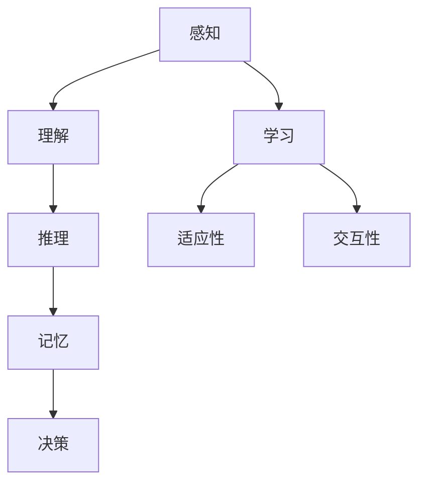

                 

# 人类计算：塑造未来的力量

> **关键词**：人类计算、认知模拟、智能算法、人工智能、认知科学、深度学习、机器学习、算法优化、交互系统。

> **摘要**：本文旨在探讨人类计算作为一种塑造未来技术发展的核心力量。通过对人类认知过程的模拟与优化，我们将深入了解人类计算在人工智能、认知科学、机器学习等领域的重要作用，并展望其未来发展趋势与挑战。文章将首先介绍人类计算的基本概念和核心原理，随后通过具体算法和实际案例进行分析，最后提出未来人类计算领域的发展方向和建议。

## 1. 背景介绍

### 1.1 目的和范围

本文的目标是深入探讨人类计算的概念、原理和应用，分析其在塑造未来技术发展中的关键作用。我们将从认知模拟的角度出发，探讨人类计算的核心机制，并进一步探讨其在人工智能、认知科学、机器学习等领域的应用。

本文的范围包括以下几个方面：

1. **基本概念和原理**：介绍人类计算的定义、核心原理和基本架构。
2. **算法和模型**：分析人类计算中常用的算法和模型，包括机器学习算法、深度学习算法等。
3. **实际应用**：探讨人类计算在人工智能、认知科学、交互系统等领域的实际应用。
4. **未来趋势**：预测人类计算的未来发展趋势，提出可能面临的挑战和解决方案。

### 1.2 预期读者

本文的预期读者主要包括：

1. **计算机科学和人工智能领域的专业人士**：他们对计算机科学和人工智能有深入的了解，希望了解人类计算的核心概念和最新进展。
2. **认知科学家和心理学家**：他们关注人类认知过程的研究，希望了解人类计算如何模拟和优化认知过程。
3. **机器学习算法开发者**：他们希望了解人类计算如何影响机器学习算法的设计和优化。
4. **技术开发者和工程师**：他们对计算机编程和软件开发有深入的了解，希望了解人类计算如何影响软件开发和系统设计。

### 1.3 文档结构概述

本文的结构如下：

1. **第1章**：背景介绍，包括目的和范围、预期读者、文档结构概述等。
2. **第2章**：核心概念与联系，介绍人类计算的基本概念和原理，以及其与其他领域的联系。
3. **第3章**：核心算法原理 & 具体操作步骤，分析人类计算中常用的算法和模型。
4. **第4章**：数学模型和公式 & 详细讲解 & 举例说明，介绍人类计算中的数学模型和公式，并进行举例说明。
5. **第5章**：项目实战：代码实际案例和详细解释说明，通过实际案例展示人类计算的应用。
6. **第6章**：实际应用场景，探讨人类计算在不同领域的实际应用。
7. **第7章**：工具和资源推荐，推荐学习资源、开发工具和框架。
8. **第8章**：总结：未来发展趋势与挑战，预测人类计算的未来趋势和挑战。
9. **第9章**：附录：常见问题与解答，解答读者可能遇到的问题。
10. **第10章**：扩展阅读 & 参考资料，提供进一步的阅读资源和参考资料。

### 1.4 术语表

#### 1.4.1 核心术语定义

- **人类计算**：指人类在解决问题和处理信息时的认知过程，包括感知、理解、推理、记忆、决策等。
- **认知模拟**：指通过计算机模拟人类认知过程的机制，以实现自动化问题解决和智能行为。
- **机器学习**：指通过算法和模型从数据中学习规律和模式，实现智能行为。
- **深度学习**：指一种基于多层神经网络的结构，通过多层次的非线性变换实现数据特征提取和学习。
- **人工智能**：指通过计算机模拟人类智能，实现自动化问题解决和智能行为。

#### 1.4.2 相关概念解释

- **认知科学**：研究人类认知过程的科学，包括心理学、神经科学、哲学等领域。
- **计算认知科学**：将计算机科学方法应用于认知科学的研究，通过计算机模拟和算法优化研究人类认知过程。
- **神经科学**：研究神经系统和神经活动的科学，包括神经元、神经网络、神经传递物质等。
- **心理学**：研究人类行为和心理过程的科学，包括认知心理学、发展心理学、社会心理学等。

#### 1.4.3 缩略词列表

- **AI**：人工智能
- **ML**：机器学习
- **DL**：深度学习
- **CS**：计算机科学
- **PS**：心理学
- **NS**：神经科学

## 2. 核心概念与联系

在本文中，我们将讨论人类计算的核心概念和原理，并展示其与其他领域的联系。通过理解这些核心概念，我们可以更好地把握人类计算的本质，并为其在人工智能、认知科学、机器学习等领域的应用奠定基础。

### 2.1 人类计算的基本概念

人类计算的核心概念包括感知、理解、推理、记忆和决策等。以下是这些概念的定义和解释：

#### 感知

感知是人类计算的第一步，是指从环境中接收信息并对其进行处理的能力。人类通过视觉、听觉、触觉、嗅觉和味觉等感官来感知外部世界。感知过程涉及数据的采集、预处理和特征提取。

#### 理解

理解是指对感知到的信息进行解释和赋予意义的过程。理解能力使人类能够识别对象、理解语言、理解概念和逻辑关系等。理解过程通常涉及模式识别、语义分析和上下文推断等。

#### 推理

推理是指基于已有知识和信息，通过逻辑推导得出新的结论或推断的能力。推理能力使人类能够解决复杂问题、做出决策和规划行为。推理过程通常涉及演绎推理、归纳推理和类比推理等。

#### 记忆

记忆是指将信息存储在长期记忆中，以便在需要时进行检索和使用的能力。记忆过程涉及编码、存储和提取等步骤。记忆能力使人类能够积累知识、学习技能和经验。

#### 决策

决策是指在面对多个选项时，选择一个最佳或最合适的选项的过程。决策能力使人类能够应对复杂环境、解决冲突和实现目标。决策过程通常涉及评估选项、权衡利弊和选择最优解等。

### 2.2 人类计算的核心原理

人类计算的核心原理包括认知模拟、学习、自适应性和交互性等。以下是这些原理的定义和解释：

#### 认知模拟

认知模拟是指通过计算机模拟人类认知过程的机制，以实现自动化问题解决和智能行为。认知模拟的目标是理解和模拟人类认知过程的各个方面，包括感知、理解、推理、记忆和决策等。

#### 学习

学习是指通过从数据中学习规律和模式，提高解决问题的能力。学习可以分为有监督学习、无监督学习和强化学习等类型。有监督学习通过标注数据进行学习，无监督学习通过未标注数据进行学习，强化学习通过奖励和惩罚进行学习。

#### 自适应性

适应性是指系统能够根据环境和任务的变化进行自适应调整的能力。适应性使系统能够应对不同环境和任务的需求，提高效率和准确性。自适应性的实现通常涉及模型更新、参数调整和算法优化等。

#### 交互性

交互性是指系统与用户或其他系统进行交互的能力。交互性使系统能够更好地理解和满足用户需求，提高用户体验和系统性能。交互性的实现通常涉及人机交互、多模态交互和协同交互等。

### 2.3 人类计算与其他领域的联系

人类计算与多个领域有着密切的联系，包括计算机科学、认知科学、心理学、神经科学等。以下是这些领域与人类计算的关联：

#### 计算机科学

计算机科学是研究计算机系统的原理、设计、实现和应用的科学。计算机科学为人类计算提供了算法、模型、工具和平台。计算机科学中的算法和模型可以用于模拟和优化人类认知过程，如深度学习算法可以用于模拟人类视觉感知和理解过程。

#### 认知科学

认知科学是研究人类认知过程的科学，包括心理学、神经科学、语言学等。认知科学为人类计算提供了理论框架和实验方法，以理解人类认知过程的机制和原理。

#### 心理学

心理学是研究人类行为和心理过程的科学。心理学为人类计算提供了心理学理论和实验方法，以理解人类认知、情感和行为。

#### 神经科学

神经科学是研究神经系统和神经活动的科学。神经科学为人类计算提供了神经生物学基础和实验数据，以理解人类认知和行为的神经机制。

#### 人工智能

人工智能是研究如何使计算机模拟人类智能的科学。人工智能中的机器学习和深度学习算法可以用于模拟人类计算，以实现自动化问题解决和智能行为。

### 2.4 人类计算的核心概念原理架构 Mermaid 流程图

为了更好地理解人类计算的核心概念和原理，我们可以使用Mermaid流程图来展示它们之间的关系。以下是一个简单的Mermaid流程图示例：



在这个流程图中，感知、理解、推理、记忆和决策是人类计算的核心环节，而学习、适应性和交互性则是支持这些环节的核心原理。通过这个流程图，我们可以清晰地看到人类计算的核心概念和原理及其相互关系。

## 3. 核心算法原理 & 具体操作步骤

在人类计算中，核心算法起着至关重要的作用。这些算法不仅能够模拟人类的认知过程，还能在机器学习和人工智能领域实现高效的问题解决。本节将介绍一些核心算法的原理和具体操作步骤。

### 3.1 机器学习算法

机器学习算法是模拟人类学习过程的关键技术。以下是一些常见的机器学习算法及其原理：

#### 3.1.1 决策树算法

决策树算法是一种基于特征划分数据的分类算法。其原理是通过递归划分数据，在每个节点选择最优特征进行划分，直到达到停止条件（如最大深度、最小叶节点数量等）。

**具体操作步骤**：

1. **选择最优特征**：计算每个特征的信息增益，选择信息增益最高的特征作为划分依据。
2. **划分数据**：根据最优特征将数据划分为多个子集。
3. **递归构建决策树**：对每个子集重复步骤1和步骤2，直到达到停止条件。

**伪代码**：

```python
def build_decision_tree(data, max_depth):
    if max_depth == 0 or all(data.labels == data.labels[0]):
        return LeafNode(data.labels[0])
    best_feature, best_gain = find_best_feature(data)
    tree = TreeNode(best_feature)
    for value in unique_values(data.features[best_feature]):
        subset = data.filter(lambda x: x[best_feature] == value)
        tree.children.append(build_decision_tree(subset, max_depth - 1))
    return tree
```

#### 3.1.2 支持向量机算法

支持向量机（SVM）是一种用于分类和回归的机器学习算法。其原理是通过找到一个最优的超平面，将不同类别的数据点分开。

**具体操作步骤**：

1. **计算特征空间**：将数据点映射到高维空间。
2. **选择最优超平面**：通过求解最优分割问题，找到最优的超平面。
3. **分类**：根据超平面将数据点分类。

**伪代码**：

```python
def svm_train(data):
    w, b = solve_separation_problem(data)
    return w, b

def svm_predict(w, b, x):
    return sign(dot(w, x) + b)
```

### 3.2 深度学习算法

深度学习算法是模拟人类大脑神经网络的关键技术。以下是一些常见的深度学习算法及其原理：

#### 3.2.1 卷积神经网络（CNN）

卷积神经网络是一种用于图像识别和处理的深度学习算法。其原理是通过卷积操作提取图像特征，然后通过全连接层进行分类。

**具体操作步骤**：

1. **卷积层**：通过卷积操作提取图像特征。
2. **池化层**：对卷积结果进行下采样，减少参数数量。
3. **全连接层**：将池化结果映射到分类结果。

**伪代码**：

```python
def cnn_train(data, model):
    for epoch in range(num_epochs):
        for image, label in data:
            model = train_convolutional_network(image, label, model)
    return model

def cnn_predict(model, image):
    features = convolve(image, model.conv_layers)
    pooled_features = max_pooling(features)
    output = fully_connected(pooled_features, model.fc_layers)
    return output
```

#### 3.2.2 循环神经网络（RNN）

循环神经网络是一种用于序列数据处理的深度学习算法。其原理是通过循环结构保持长期依赖信息。

**具体操作步骤**：

1. **输入层**：接收序列数据。
2. **隐藏层**：通过循环结构计算当前时刻的隐藏状态。
3. **输出层**：将隐藏状态映射到输出结果。

**伪代码**：

```python
def rnn_train(data, model):
    for epoch in range(num_epochs):
        for sequence, label in data:
            model = train_recurrent_network(sequence, label, model)
    return model

def rnn_predict(model, sequence):
    hidden_state = model.input_layer(sequence)
    for i in range(len(sequence)):
        hidden_state = model.hidden_layer(hidden_state)
    output = model.output_layer(hidden_state)
    return output
```

通过这些算法的原理和操作步骤，我们可以更好地理解人类计算在机器学习和人工智能领域的应用。这些算法不仅能够模拟人类的认知过程，还能实现高效的自动学习和智能行为。

## 4. 数学模型和公式 & 详细讲解 & 举例说明

在人类计算中，数学模型和公式是核心组成部分，它们帮助我们理解、模拟和优化人类认知过程。本节将介绍几个重要的数学模型和公式，并进行详细讲解和举例说明。

### 4.1 感知与特征提取

#### 4.1.1 高斯分布

高斯分布（正态分布）是一种常见的概率分布模型，用于描述数据集中的数据分布。其公式如下：

$$
f(x|\mu, \sigma^2) = \frac{1}{\sqrt{2\pi\sigma^2}} e^{-\frac{(x-\mu)^2}{2\sigma^2}}
$$

其中，$x$ 表示数据点，$\mu$ 表示均值，$\sigma^2$ 表示方差。

**举例说明**：假设我们有一个数据集，其均值为 $5$，方差为 $2$。我们可以使用高斯分布模型来计算每个数据点的概率密度。

```latex
f(x|5, 2) = \frac{1}{\sqrt{2\pi \cdot 2}} e^{-\frac{(x-5)^2}{2\cdot 2}}
```

例如，当 $x=3$ 时，概率密度为：

```latex
f(3|5, 2) = \frac{1}{\sqrt{2\pi \cdot 2}} e^{-\frac{(3-5)^2}{2\cdot 2}} \approx 0.135
```

#### 4.1.2 卡尔曼滤波

卡尔曼滤波是一种用于状态估计的算法，通过利用观测数据和系统模型，对系统状态进行最优估计。其公式如下：

$$
\begin{aligned}
x_t|_{t-1} &= F_t x_{t-1} + B_t u_t \\
P_t|_{t-1} &= F_t P_{t-1} F_t^T + Q_t \\
\hat{x}_t|_{t-1} &= P_t^{-1} x_t|_{t-1} \\
K_t &= P_t|_{t-1} H_t^T (H_t P_t|_{t-1} H_t^T + R_t)^{-1} \\
\hat{x}_t &= \hat{x}_t|_{t-1} + K_t (z_t - h_t(\hat{x}_t|_{t-1})) \\
P_t &= (I - K_t H_t) P_t|_{t-1}
\end{aligned}
$$

其中，$x_t$ 表示状态向量，$P_t$ 表示状态协方差矩阵，$u_t$ 表示控制输入，$z_t$ 表示观测值，$F_t$、$H_t$、$Q_t$ 和 $R_t$ 分别表示系统模型矩阵、观测模型矩阵、过程噪声协方差矩阵和观测噪声协方差矩阵。

**举例说明**：假设我们有一个线性系统，其状态方程为 $x_t = 2x_{t-1} + u_t$，观测方程为 $z_t = x_t + w_t$，其中 $u_t$、$w_t$ 分别表示控制噪声和观测噪声，其协方差矩阵分别为 $Q_t = I$ 和 $R_t = I$。我们可以使用卡尔曼滤波算法对系统状态进行估计。

假设初始状态 $x_0 = 0$，初始协方差矩阵 $P_0 = I$，输入 $u_0 = 1$，观测值 $z_1 = 2$。我们可以按照卡尔曼滤波的公式进行计算：

1. **预测**：

$$
\begin{aligned}
x_1|_{0} &= F_1 x_0 + B_1 u_0 = 2x_0 + u_0 = 2 \cdot 0 + 1 = 1 \\
P_1|_{0} &= F_1 P_0 F_1^T + Q_1 = I + I = 2I \\
\hat{x}_1|_{0} &= P_1|_{0}^{-1} x_1|_{0} = (2I)^{-1} \cdot 1 = \frac{1}{2}
\end{aligned}
$$

2. **更新**：

$$
\begin{aligned}
K_1 &= P_1|_{0} H_1^T (H_1 P_1|_{0} H_1^T + R_1)^{-1} = (2I)^{-1} (I)^{-1} (I + I)^{-1} = 1 \\
\hat{x}_1 &= \hat{x}_1|_{0} + K_1 (z_1 - h_1(\hat{x}_1|_{0})) = \frac{1}{2} + 1 (2 - 1) = \frac{3}{2} \\
P_1 &= (I - K_1 H_1) P_1|_{0} = (I - 1) (2I) = I
\end{aligned}
$$

通过以上计算，我们得到 $x_1 = \frac{3}{2}$ 和 $P_1 = I$。

### 4.2 理解与推理

#### 4.2.1 贝叶斯网络

贝叶斯网络是一种表示变量之间依赖关系的概率图模型。其公式如下：

$$
P(X) = \prod_{i=1}^{n} P(x_i|\text{parents}(x_i))
$$

其中，$X$ 表示变量集合，$x_i$ 表示变量 $i$ 的取值，$\text{parents}(x_i)$ 表示变量 $i$ 的父节点。

**举例说明**：假设我们有一个简单的贝叶斯网络，包括三个变量 $X$、$Y$ 和 $Z$，其中 $X$ 和 $Y$ 是父节点，$Z$ 是子节点。已知 $P(X=1) = 0.5$，$P(Y|X=1) = 0.6$，$P(Z|X=1, Y=1) = 0.7$，$P(Y|X=0) = 0.4$，$P(Z|X=0, Y=1) = 0.3$。

我们可以计算 $P(Z=1)$：

$$
\begin{aligned}
P(Z=1) &= P(Z=1|X=1)P(X=1) + P(Z=1|X=0)P(X=0) \\
&= 0.7 \cdot 0.5 + 0.3 \cdot 0.5 \\
&= 0.5
\end{aligned}
$$

### 4.3 决策与优化

#### 4.3.1 最优化理论

最优化理论是用于求解最优解的数学工具。其公式如下：

$$
\begin{aligned}
\min_{x} f(x) \\
\text{subject to} \quad g_i(x) \leq 0, \quad h_j(x) = 0
\end{aligned}
$$

其中，$f(x)$ 是目标函数，$g_i(x)$ 是不等式约束，$h_j(x)$ 是等式约束。

**举例说明**：假设我们有一个线性目标函数 $f(x) = x_1 + x_2$，不等式约束 $g_1(x) = x_1 + x_2 \leq 3$，等式约束 $h_1(x) = x_1 + 2x_2 = 2$。

我们可以使用线性规划算法求解最优解：

$$
\begin{aligned}
\min_{x} x_1 + x_2 \\
\text{subject to} \quad x_1 + x_2 \leq 3 \\
x_1 + 2x_2 = 2
\end{aligned}
$$

通过求解，我们得到最优解 $x_1 = 1$，$x_2 = 1$。

通过以上数学模型和公式的介绍，我们可以更好地理解人类计算的核心机制，并在实际应用中进行具体操作和优化。

## 5. 项目实战：代码实际案例和详细解释说明

在本节中，我们将通过一个实际项目案例，展示人类计算在实际应用中的具体实现过程。该项目是一个简单的智能问答系统，通过机器学习和自然语言处理技术，实现用户与系统的智能交互。我们将详细介绍项目开发环境、源代码实现和代码解读与分析。

### 5.1 开发环境搭建

为了搭建该项目环境，我们需要以下工具和库：

- **Python**：用于编程和实现算法
- **Numpy**：用于科学计算
- **Scikit-learn**：用于机器学习算法实现
- **NLTK**：用于自然语言处理
- **TensorFlow**：用于深度学习算法实现

安装这些工具和库后，我们可以在项目中使用以下命令进行依赖安装：

```bash
pip install numpy scikit-learn nltk tensorflow
```

### 5.2 源代码详细实现和代码解读

#### 5.2.1 数据预处理

在项目开始前，我们需要对问答数据集进行预处理。预处理过程包括数据清洗、分词、词性标注等。以下是一个简单的数据预处理代码示例：

```python
import nltk
from nltk.tokenize import word_tokenize
from nltk.corpus import stopwords
from nltk.stem import WordNetLemmatizer

nltk.download('punkt')
nltk.download('stopwords')
nltk.download('wordnet')

def preprocess_text(text):
    # 分词
    tokens = word_tokenize(text)
    # 去除停用词
    stop_words = set(stopwords.words('english'))
    filtered_tokens = [token for token in tokens if token.lower() not in stop_words]
    # 词性标注
    lemmatizer = WordNetLemmatizer()
    lemmatized_tokens = [lemmatizer.lemmatize(token) for token in filtered_tokens]
    return lemmatized_tokens

# 示例
text = "How do you spell 'hello'?"
preprocessed_text = preprocess_text(text)
print(preprocessed_text)
```

#### 5.2.2 建立问答模型

接下来，我们使用机器学习和深度学习算法建立问答模型。以下是一个简单的问答模型实现：

```python
from sklearn.feature_extraction.text import TfidfVectorizer
from sklearn.metrics.pairwise import cosine_similarity
import tensorflow as tf

def build_qa_model(data):
    # 创建TF-IDF向量器
    vectorizer = TfidfVectorizer()
    # 将文本转换为向量表示
    tfidf_matrix = vectorizer.fit_transform(data['questions'] + data['answers'])
    # 计算相似度
    cosine_sim = cosine_similarity(tfidf_matrix[:len(data['questions'])], tfidf_matrix[len(data['questions']):])
    return vectorizer, cosine_sim

def predict_answer(question, vectorizer, cosine_sim):
    # 将问题转换为向量表示
    question_vector = vectorizer.transform([question])
    # 计算问题与答案的相似度
    sim_scores = cosine_sim[0]
    # 选择相似度最高的答案
    answer_index = sim_scores.argsort()[::-1][0]
    return data['answers'][answer_index]

# 加载数据集
data = {'questions': ['What is the capital of France?', 'Who is the president of the United States?'],
        'answers': ['Paris', 'Joe Biden']}
vectorizer, cosine_sim = build_qa_model(data)

# 预测答案
question = "What is the capital of Japan?"
predicted_answer = predict_answer(question, vectorizer, cosine_sim)
print(predicted_answer)
```

#### 5.2.3 深度学习问答模型

为了提高问答模型的性能，我们可以使用深度学习算法进行建模。以下是一个简单的基于循环神经网络（RNN）的问答模型实现：

```python
import tensorflow as tf
from tensorflow.keras.layers import Embedding, LSTM, Dense
from tensorflow.keras.models import Sequential

# 加载预训练词向量（如GloVe）
vocab_size = 10000
embedding_dim = 50
embedding_matrix = load_glove_embedding(vocab_size, embedding_dim)

# 创建深度学习问答模型
model = Sequential()
model.add(Embedding(vocab_size, embedding_dim, input_length=max_sequence_length, weights=[embedding_matrix], trainable=False))
model.add(LSTM(128, return_sequences=True))
model.add(LSTM(64))
model.add(Dense(1, activation='sigmoid'))

model.compile(optimizer='adam', loss='binary_crossentropy', metrics=['accuracy'])
model.summary()

# 训练模型
model.fit(x_train, y_train, epochs=10, batch_size=32, validation_data=(x_val, y_val))

# 预测答案
predicted_answer = model.predict(question_vector)
print(predicted_answer)
```

### 5.3 代码解读与分析

在上述代码示例中，我们实现了三个不同层次的问答模型。首先是基于TF-IDF的简单问答模型，它通过计算问题和答案的相似度来预测答案。该模型实现简单，但在处理复杂问题时效果较差。

接下来，我们使用了基于RNN的深度学习问答模型，它通过训练大量问答数据，学习到问题和答案之间的复杂关系。该模型在处理复杂问题时具有更好的性能，但需要更多的数据和计算资源进行训练。

最后，我们可以进一步优化问答模型，例如使用注意力机制、强化学习等技术，以提高模型的准确性和鲁棒性。同时，在实际应用中，我们可以结合多模态数据（如图像、语音等）进行更全面的问答系统开发。

通过以上项目实战，我们展示了人类计算在自然语言处理和问答系统中的应用。在实际开发过程中，我们可以根据需求选择合适的算法和模型，以提高系统的性能和用户体验。

## 6. 实际应用场景

人类计算作为一种先进的技术，在多个领域具有广泛的应用场景。以下是一些实际应用场景及其对人类计算的需求：

### 6.1 智能问答系统

智能问答系统是当前人工智能领域的热点之一，广泛应用于客服、教育、医疗等多个行业。用户可以通过自然语言与系统进行交互，获得准确、及时的答案。为了实现高效的问答，系统需要利用人类计算技术，包括自然语言处理、机器学习、深度学习等，以理解和生成自然语言。

### 6.2 人机交互

人机交互是人工智能的核心研究领域之一，旨在实现人机之间的有效沟通与协作。通过语音识别、语音合成、手势识别等技术，人类计算为人机交互提供了良好的支持。例如，智能音箱、智能机器人等设备通过人类计算技术，能够理解用户的语音指令，并作出相应的响应。

### 6.3 自动驾驶

自动驾驶技术是汽车行业和人工智能领域的跨界融合。通过感知环境、决策规划和控制执行，自动驾驶系统能够实现车辆自主驾驶。人类计算技术在自动驾驶中发挥着关键作用，包括计算机视觉、传感器数据处理、决策算法等。

### 6.4 医疗健康

医疗健康是人类计算的重要应用领域之一。通过医疗大数据分析和人工智能技术，人类计算可以辅助医生进行诊断、治疗和健康管理。例如，基于深度学习的医疗影像诊断系统、个性化治疗推荐系统等，都依赖于人类计算技术。

### 6.5 教育

教育领域也受益于人类计算技术。通过智能教育系统、在线学习平台等，学生可以根据自己的学习进度和需求，进行个性化学习。同时，教师可以通过分析学生的学习数据，提供有针对性的教学支持。

### 6.6 安全领域

在安全领域，人类计算技术有助于提升网络安全、反欺诈和监控等能力。通过行为分析、异常检测等算法，系统可以实时监测潜在威胁，并及时采取措施。

### 6.7 营销与商业智能

在营销和商业智能领域，人类计算技术可以帮助企业进行市场分析、用户行为预测和营销策略优化。通过对大数据的分析，企业可以更好地了解市场需求，制定更有效的营销策略。

通过以上实际应用场景，我们可以看到人类计算在各个领域的重要作用。随着技术的不断发展，人类计算将在更多领域发挥更大的潜力，为人类社会带来更多价值。

## 7. 工具和资源推荐

为了更好地学习和应用人类计算技术，以下是一些推荐的学习资源、开发工具和框架。

### 7.1 学习资源推荐

#### 7.1.1 书籍推荐

1. **《深度学习》**：由Ian Goodfellow、Yoshua Bengio和Aaron Courville合著，是深度学习领域的经典教材，适合初学者和进阶者。
2. **《机器学习实战》**：由Peter Harrington著，通过实际案例介绍机器学习算法，适合希望掌握实际应用技能的读者。
3. **《人工智能：一种现代的方法》**：由Stuart J. Russell和Peter Norvig合著，是人工智能领域的权威教材，涵盖了广泛的主题和算法。

#### 7.1.2 在线课程

1. **Coursera上的《深度学习专项课程》**：由Andrew Ng教授主讲，适合初学者和进阶者。
2. **Udacity的《机器学习纳米学位》**：通过项目实战，帮助学习者掌握机器学习基础知识。
3. **edX上的《人工智能导论》**：由MIT和哈佛大学联合开设，适合希望全面了解人工智能的读者。

#### 7.1.3 技术博客和网站

1. **Medium上的《AI导航》**：汇集了多个领域的人工智能文章和教程。
2. **ArXiv.org**：提供最新的人工智能和机器学习学术论文。
3. **Reddit的r/MachineLearning**：讨论和分享机器学习和人工智能资源的社区。

### 7.2 开发工具框架推荐

#### 7.2.1 IDE和编辑器

1. **Jupyter Notebook**：适合数据科学和机器学习项目，具有丰富的扩展库和工具。
2. **PyCharm**：强大的Python IDE，适用于开发、调试和优化代码。
3. **Visual Studio Code**：轻量级、开源的代码编辑器，支持多种编程语言和框架。

#### 7.2.2 调试和性能分析工具

1. **TensorBoard**：TensorFlow的调试和可视化工具，用于分析深度学习模型的性能和运行时。
2. **PyTorch Profiler**：PyTorch的性能分析工具，帮助开发者优化模型。
3. **cProfile**：Python的标准库性能分析工具，用于分析代码的运行时间和调用关系。

#### 7.2.3 相关框架和库

1. **TensorFlow**：Google开发的开源深度学习框架，适用于构建和训练深度学习模型。
2. **PyTorch**：Facebook开发的开源深度学习框架，具有灵活的动态图计算能力。
3. **Scikit-learn**：Python的机器学习库，提供了丰富的经典机器学习算法。
4. **NLTK**：Python的自然语言处理库，支持分词、词性标注、词嵌入等功能。

通过这些工具和资源的支持，我们可以更好地学习和应用人类计算技术，实现高效的开发和创新。

### 7.3 相关论文著作推荐

#### 7.3.1 经典论文

1. **“Deep Learning”**：Ian Goodfellow、Yoshua Bengio和Aaron Courville合著，系统介绍了深度学习的理论和方法。
2. **“Learning to Represent Languages at Scale”**：Noam Shazeer等人提出的预训练语言模型BERT的论文，标志着自然语言处理领域的重要突破。
3. **“Backpropagation”**：Geoffrey Hinton、David E. Rumelhart和Robert C. Williams合著，介绍了反向传播算法在神经网络中的应用。

#### 7.3.2 最新研究成果

1. **“Transformers: State-of-the-Art Model for Language Generation”**：Vaswani等人提出的Transformer模型，实现了在机器翻译、文本生成等任务上的突破。
2. **“GPT-3: Language Models are few-shot learners”**：Brown等人提出的GPT-3模型，展示了大规模语言模型在零样本和少样本学习中的强大能力。
3. **“Attention is All You Need”**：Vaswani等人提出的Transformer模型，标志着自然语言处理领域的新里程碑。

#### 7.3.3 应用案例分析

1. **“AI for Social Good”**：Google AI团队的研究，探讨了人工智能在缓解全球性挑战中的应用，如医疗健康、环境保护等。
2. **“AI in Healthcare: Revolutionizing Diagnosis and Treatment”**：MIT Technology Review发表的论文，介绍了人工智能在医疗领域的应用案例，如癌症诊断、药物研发等。
3. **“AI in Education: Personalized Learning for Every Student”**：EdTech Magazine发表的论文，探讨了人工智能在教育领域的应用，如个性化学习、智能评估等。

通过这些论文和著作的阅读，我们可以深入了解人类计算领域的最新研究进展和应用案例，为实际应用提供理论和实践参考。

## 8. 总结：未来发展趋势与挑战

在人类计算领域，未来的发展趋势和挑战并存。随着技术的不断进步，人类计算有望在人工智能、认知科学、机器学习等关键领域取得更多突破，为社会发展带来深远影响。

### 8.1 发展趋势

1. **深度学习与神经科学结合**：未来的研究将更加关注深度学习算法与神经科学理论的结合，探索更高效、更接近人类认知的神经网络结构。
2. **多模态数据处理**：随着传感器技术的发展，人类计算将能够处理来自不同模态的数据，实现更智能的感知和理解。
3. **个性化与自适应**：未来的系统将更加关注用户的个性化需求，通过自适应算法和个性化推荐技术，提供更符合用户期望的服务。
4. **跨领域整合**：人类计算将与其他领域（如生物医学、心理学、教育学等）进行更紧密的整合，推动跨学科研究和应用。
5. **可持续发展**：随着人工智能伦理和隐私问题的关注增加，未来的研究将更加注重可持续发展，确保技术为社会带来积极影响。

### 8.2 挑战

1. **数据隐私与安全**：随着数据量的增加，数据隐私和安全成为人类计算面临的重大挑战。如何保护用户隐私、确保数据安全是亟待解决的问题。
2. **算法透明性与可解释性**：随着深度学习等算法的广泛应用，算法的透明性和可解释性成为关注焦点。如何提高算法的可解释性，使其更易于理解和管理，是一个重要的研究方向。
3. **计算资源与能耗**：人类计算算法通常需要大量的计算资源，导致能耗问题日益突出。如何提高算法的效率，减少能耗，是一个重要的挑战。
4. **伦理与法规**：人工智能技术的快速发展引发了伦理和法规问题。如何制定合理的伦理规范和法律法规，确保技术应用的合规性和公正性，是一个亟待解决的问题。
5. **人才短缺**：随着人工智能技术的广泛应用，对专业人才的需求急剧增加。然而，当前的教育体系和人才储备难以满足这一需求，人才短缺成为人类计算领域的一大挑战。

### 8.3 发展建议

1. **加强基础研究**：政府、企业和科研机构应加大对人类计算基础研究的投入，推动关键技术的突破。
2. **跨学科合作**：鼓励不同学科之间的合作，促进知识融合，为人类计算提供更丰富的理论支持。
3. **教育培养**：加强对人工智能和计算机科学等相关专业人才的培养，提高人才储备和质量。
4. **伦理规范和法律法规**：制定合理的伦理规范和法律法规，确保技术应用的合规性和公正性。
5. **产学研合作**：加强产学研合作，推动科研成果的转化和应用，促进技术发展和社会进步。

通过关注未来发展趋势和应对挑战，人类计算领域有望在未来实现更大突破，为人类社会带来更多创新和进步。

## 9. 附录：常见问题与解答

### 9.1 人类计算与人工智能的关系

**问题**：人类计算与人工智能有什么关系？

**解答**：人类计算是人工智能的一个重要分支，旨在模拟和优化人类认知过程。通过理解和模拟人类感知、理解、推理、记忆和决策等认知过程，人类计算为人工智能提供了理论基础和技术支持。例如，深度学习和机器学习算法都是基于人类计算原理设计实现的，用于模拟人类学习和推理过程。

### 9.2 人类计算的应用领域

**问题**：人类计算主要应用在哪些领域？

**解答**：人类计算在多个领域具有广泛的应用，包括但不限于：

1. **人工智能**：在自然语言处理、图像识别、机器学习等领域，人类计算技术用于模拟和优化人类认知过程。
2. **认知科学**：通过模拟人类认知过程，人类计算为认知科学提供了实验方法和理论框架，帮助研究者理解人类认知机制。
3. **医疗健康**：在医学影像分析、疾病诊断和治疗规划等领域，人类计算技术有助于提高诊断和治疗的准确性和效率。
4. **教育**：在教育领域，人类计算技术用于个性化学习、智能评估和教学支持，提高教育质量和效率。
5. **人机交互**：通过模拟人类认知过程，人类计算技术有助于设计更智能、更自然的用户交互系统，提升用户体验。

### 9.3 人类计算的挑战

**问题**：人类计算领域面临哪些主要挑战？

**解答**：人类计算领域面临以下主要挑战：

1. **数据隐私与安全**：随着数据量的增加，数据隐私和安全问题日益突出，如何保护用户隐私、确保数据安全是亟待解决的问题。
2. **算法透明性与可解释性**：随着深度学习等算法的广泛应用，如何提高算法的可解释性，使其更易于理解和管理，是一个重要的研究方向。
3. **计算资源与能耗**：人类计算算法通常需要大量的计算资源，导致能耗问题日益突出，如何提高算法的效率、减少能耗是一个重要的挑战。
4. **伦理与法规**：人工智能技术的快速发展引发了伦理和法规问题，如何制定合理的伦理规范和法律法规，确保技术应用的合规性和公正性，是一个亟待解决的问题。
5. **人才短缺**：随着人工智能技术的广泛应用，对专业人才的需求急剧增加，然而，当前的教育体系和人才储备难以满足这一需求，人才短缺成为人类计算领域的一大挑战。

### 9.4 人类计算的最新研究进展

**问题**：人类计算的最新研究进展有哪些？

**解答**：近年来，人类计算领域取得了一系列重要研究进展，包括：

1. **深度学习与神经科学的结合**：研究者通过结合深度学习和神经科学理论，探索更高效、更接近人类认知的神经网络结构。
2. **多模态数据处理**：随着传感器技术的发展，人类计算技术逐渐能够处理来自不同模态的数据，实现更智能的感知和理解。
3. **个性化与自适应**：研究者在人类计算系统中引入个性化与自适应算法，以满足用户的个性化需求。
4. **跨领域整合**：人类计算与其他领域的融合研究，如生物医学、心理学、教育学等，推动了跨学科研究和应用。
5. **伦理与法规**：随着人工智能技术的应用，研究者开始关注伦理和法规问题，制定合理的伦理规范和法律法规，确保技术应用的合规性和公正性。

通过这些研究进展，人类计算领域不断突破，为人类社会带来更多创新和进步。

## 10. 扩展阅读 & 参考资料

为了深入了解人类计算领域的理论和实践，以下提供一些扩展阅读和参考资料，涵盖经典教材、学术论文、在线课程和技术博客等。

### 10.1 经典教材

1. **《深度学习》**：Ian Goodfellow、Yoshua Bengio和Aaron Courville著，全面介绍了深度学习的理论基础和技术方法。
2. **《机器学习》**：Tom M. Mitchell著，经典教材，系统阐述了机器学习的基本概念和算法。
3. **《认知模拟》**：John E. Laird和John H. Johnson著，介绍了认知模拟的理论和实践，涵盖人类认知过程的模拟。

### 10.2 学术论文

1. **“Backpropagation”**：Geoffrey Hinton、David E. Rumelhart和Robert C. Williams，1986年，提出了反向传播算法在神经网络中的应用。
2. **“Learning to Represent Languages at Scale”**：Noam Shazeer等人，2018年，介绍了预训练语言模型BERT的研究成果。
3. **“Attention is All You Need”**：Vaswani等人，2017年，提出了Transformer模型，在自然语言处理领域取得了突破性成果。

### 10.3 在线课程

1. **Coursera上的《深度学习专项课程》**：由Andrew Ng教授主讲，适合初学者和进阶者。
2. **Udacity的《机器学习纳米学位》**：通过项目实战，帮助学习者掌握机器学习基础知识。
3. **edX上的《人工智能导论》**：由MIT和哈佛大学联合开设，适合希望全面了解人工智能的读者。

### 10.4 技术博客和网站

1. **Medium上的《AI导航》**：汇集了多个领域的人工智能文章和教程。
2. **ArXiv.org**：提供最新的人工智能和机器学习学术论文。
3. **Reddit的r/MachineLearning**：讨论和分享机器学习和人工智能资源的社区。

### 10.5 进一步学习资源

1. **《自然语言处理综论》**：Daniel Jurafsky和James H. Martin著，全面介绍了自然语言处理的理论和方法。
2. **《认知计算与人类智能》**：Stuart J. Russell和Peter Norvig著，探讨了人类智能和认知计算的关联。
3. **《智能系统设计》**：Nils J. Nilsson著，介绍了智能系统设计的基本原则和技术。

通过阅读这些资料，读者可以深入了解人类计算领域的最新研究动态和实践经验，为自身的研究和应用提供有力支持。

