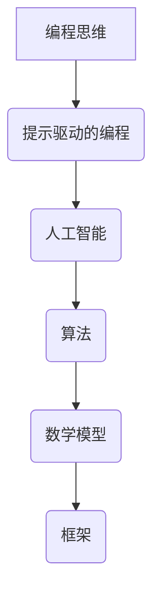

                 

# 从代码到提示：编程思维的转变

## 关键词
编程思维、代码、提示、人工智能、算法、实践、理论、结构化思考

## 摘要
本文旨在探讨编程思维从传统的代码编写向现代的提示驱动的转变。通过分析这一转变的背景、核心概念、算法原理、数学模型、实际应用以及未来发展趋势，本文为读者提供了对编程思维转变的全面理解。文章将从背景介绍、核心概念与联系、核心算法原理、数学模型与公式、项目实战、实际应用场景、工具和资源推荐等多方面展开论述，旨在帮助读者更好地适应编程思维的新趋势。

## 1. 背景介绍

### 1.1 目的和范围

本文旨在探讨编程思维的转变，从传统的代码编写向现代的提示驱动的模式转型。这一转变不仅影响了程序员的工作方式，也深刻改变了计算机编程的本质。通过本文的讨论，读者可以了解到编程思维的新特点，掌握从代码到提示的转变方法，并了解这一转变对编程实践的影响。

### 1.2 预期读者

本文适合有一定编程基础的读者，包括计算机专业的学生、程序员、软件工程师以及对编程有兴趣的广大技术爱好者。通过本文的学习，读者可以深入理解编程思维的新趋势，提升自己的编程能力。

### 1.3 文档结构概述

本文分为以下几个部分：

- **1. 背景介绍**：介绍编程思维转变的背景和目的。
- **2. 核心概念与联系**：讨论编程思维转变中的核心概念和联系。
- **3. 核心算法原理与具体操作步骤**：分析编程思维转变中的算法原理和操作步骤。
- **4. 数学模型和公式**：阐述编程思维转变中的数学模型和公式。
- **5. 项目实战**：通过实际案例展示编程思维的应用。
- **6. 实际应用场景**：探讨编程思维在不同领域的应用。
- **7. 工具和资源推荐**：推荐学习资源和开发工具。
- **8. 总结：未来发展趋势与挑战**：预测编程思维的未来发展趋势和面临的挑战。
- **9. 附录：常见问题与解答**：提供常见问题的解答。
- **10. 扩展阅读与参考资料**：推荐进一步的阅读材料和资源。

### 1.4 术语表

#### 1.4.1 核心术语定义

- **编程思维**：指程序员解决问题和设计程序的方式和方法。
- **代码**：编程语言的指令集合，用于实现特定功能的程序。
- **提示**：在编程过程中，给予程序员的指导性信息，帮助其更好地解决问题。
- **人工智能**：模拟人类智能行为的计算机系统。
- **算法**：解决问题的步骤和规则。
- **数学模型**：用于描述现实世界现象的数学方程和公式。
- **框架**：为特定任务提供标准和结构的软件。

#### 1.4.2 相关概念解释

- **提示驱动的编程**：一种以提示为核心，通过分析和理解提示来编写代码的方法。
- **结构化编程**：一种将程序分解为多个模块，每个模块实现特定功能的编程方法。

#### 1.4.3 缩略词列表

- **AI**：人工智能
- **IDE**：集成开发环境
- **SDK**：软件开发工具包
- **API**：应用程序编程接口

## 2. 核心概念与联系

在探讨编程思维的转变之前，我们需要明确一些核心概念，并理解它们之间的联系。以下是编程思维转变中的核心概念和它们的相互关系。

### 2.1 编程思维的概念

编程思维是指程序员在解决问题和设计程序时采用的方式和方法。它不仅包括对编程语言和工具的熟练掌握，还包括逻辑推理、抽象思考、系统设计和代码优化等能力。

### 2.2 提示驱动的编程

提示驱动的编程是一种以提示为核心，通过分析和理解提示来编写代码的方法。它强调程序员在编程过程中应注重问题的抽象和分解，利用提示来引导代码的编写。

### 2.3 人工智能与算法

人工智能是编程思维转变的重要驱动力之一。通过引入人工智能，程序员可以更高效地处理复杂问题，实现自动化和智能化编程。算法是实现人工智能的关键，它提供了解决问题的步骤和规则。

### 2.4 数学模型与框架

数学模型是编程思维的重要组成部分，它用于描述现实世界中的现象和问题。框架则为程序员提供了一种标准化的解决方案，使得编程过程更加高效和可靠。

### 2.5 Mermaid 流程图

以下是一个用于描述编程思维转变的 Mermaid 流程图：



通过这个流程图，我们可以清晰地看到编程思维转变的各个环节以及它们之间的联系。

## 3. 核心算法原理 & 具体操作步骤

在编程思维转变的过程中，核心算法原理起到了至关重要的作用。下面我们将详细阐述这些算法原理，并给出具体的操作步骤。

### 3.1 算法原理

编程思维转变中的核心算法原理包括：

- **抽象与分解**：将复杂问题分解为多个简单的问题，并利用提示来指导每个问题的解决。
- **模式识别**：通过分析和理解提示，识别出常见的编程模式，并利用这些模式来简化代码编写。
- **自动化与优化**：利用人工智能技术，实现代码的自动化生成和优化。

### 3.2 具体操作步骤

以下是编程思维转变的具体操作步骤：

#### 步骤1：问题分析

首先，对问题进行详细分析，明确问题的需求和目标。

#### 步骤2：抽象与分解

将问题分解为多个子问题，并利用提示来指导每个子问题的解决。例如，在编写一个复杂的算法时，可以将其分解为多个简单的小步骤，每个步骤都包含一个具体的提示。

#### 步骤3：模式识别

在解决子问题时，识别出常见的编程模式，并利用这些模式来简化代码编写。例如，在处理大量数据时，可以使用循环结构或递归方法来简化代码。

#### 步骤4：自动化与优化

利用人工智能技术，实现代码的自动化生成和优化。例如，使用机器学习算法来自动生成代码模板，或使用优化算法来提高代码的性能。

#### 步骤5：代码实现

根据分析结果和操作步骤，编写具体的代码实现。在编写代码时，应注重代码的可读性和可维护性，以便于后续的优化和扩展。

#### 步骤6：测试与调试

对编写的代码进行测试和调试，确保代码的正确性和性能。在测试过程中，可以利用单元测试、集成测试和性能测试等方法来验证代码的质量。

#### 步骤7：文档与分享

编写详细的文档，记录代码的实现过程和关键步骤。同时，将代码和文档分享给其他开发者，以便于他们理解和应用。

通过以上操作步骤，我们可以实现编程思维的转变，从传统的代码编写向提示驱动的模式转型。

## 4. 数学模型和公式 & 详细讲解 & 举例说明

在编程思维转变的过程中，数学模型和公式起到了重要的作用。以下将详细讲解这些数学模型和公式，并通过具体例子来说明其应用。

### 4.1 数学模型

编程思维转变中的核心数学模型包括：

- **线性回归模型**：用于预测数值型变量的变化。
- **逻辑回归模型**：用于预测类别变量的变化。
- **决策树模型**：用于分类和回归问题。
- **神经网络模型**：用于复杂的数据分析和模式识别。

### 4.2 公式

以下是编程思维转变中的核心数学公式：

- **线性回归公式**：
  $$
  y = \beta_0 + \beta_1x
  $$
- **逻辑回归公式**：
  $$
  P(y=1) = \frac{1}{1 + e^{-(\beta_0 + \beta_1x)}}
  $$
- **决策树公式**：
  $$
  Gini(\text{split}) = 1 - \frac{1}{|R|}\sum_{i=1}^{|R|} \left(\frac{|R_i|}{|R|}\right)^2
  $$
- **神经网络公式**：
  $$
  a_{i}^{(l)} = \sigma(z_{i}^{(l)})
  $$

### 4.3 详细讲解

- **线性回归模型**：线性回归模型用于预测一个连续变量的变化，如房价、股票价格等。它通过拟合一条直线来描述变量之间的关系，从而实现对未知数据的预测。
- **逻辑回归模型**：逻辑回归模型用于预测一个类别变量的变化，如是否通过考试、是否患病等。它通过拟合一个非线性函数来描述变量之间的关系，从而实现对未知数据的预测。
- **决策树模型**：决策树模型用于分类和回归问题。它通过构建一系列条件判断节点和结果节点，来描述变量之间的关系，从而实现对未知数据的预测。
- **神经网络模型**：神经网络模型用于复杂的数据分析和模式识别。它通过构建多层神经元，来模拟人脑的神经网络结构，从而实现对未知数据的预测。

### 4.4 举例说明

#### 4.4.1 线性回归例子

假设我们要预测一个城市的房价，根据历史数据，我们可以使用线性回归模型来拟合房价和房屋面积之间的关系。设房价为因变量 $y$，房屋面积为自变量 $x$，则线性回归公式为：

$$
y = \beta_0 + \beta_1x
$$

通过训练数据拟合得到模型参数 $\beta_0$ 和 $\beta_1$，然后我们可以利用这个模型来预测未知房屋的房价。

#### 4.4.2 逻辑回归例子

假设我们要预测一个学生是否通过考试，根据历史数据，我们可以使用逻辑回归模型来拟合考试成绩和学生学习时间之间的关系。设通过考试的概率为因变量 $y$，学生学习时间为自变量 $x$，则逻辑回归公式为：

$$
P(y=1) = \frac{1}{1 + e^{-(\beta_0 + \beta_1x)}}
$$

通过训练数据拟合得到模型参数 $\beta_0$ 和 $\beta_1$，然后我们可以利用这个模型来预测未知学生的学习成绩。

#### 4.4.3 决策树例子

假设我们要分类邮件，将其分为垃圾邮件和正常邮件。我们可以使用决策树模型来构建分类器。决策树模型通过一系列的条件判断，来将邮件分为不同的类别。决策树公式为：

$$
Gini(\text{split}) = 1 - \frac{1}{|R|}\sum_{i=1}^{|R|} \left(\frac{|R_i|}{|R|}\right)^2
$$

通过计算每个条件的 Gini 不纯度，我们可以选择最优的条件来分割数据，从而构建出决策树。

#### 4.4.4 神经网络例子

假设我们要构建一个图像分类器，用于识别手写数字。我们可以使用神经网络模型来构建分类器。神经网络模型通过多层神经元，来学习输入和输出之间的关系。神经网络公式为：

$$
a_{i}^{(l)} = \sigma(z_{i}^{(l)})
$$

通过训练大量的手写数字图像，神经网络可以学习到输入和输出之间的关系，从而实现对未知图像的分类。

## 5. 项目实战：代码实际案例和详细解释说明

为了更好地理解编程思维的转变，我们将通过一个实际项目案例来进行详细解释说明。本案例将使用 Python 编写一个简单的机器学习模型，用于手写数字识别。

### 5.1 开发环境搭建

在开始项目之前，我们需要搭建开发环境。以下是搭建开发环境所需的步骤：

1. 安装 Python 3.7 或更高版本。
2. 安装必要的库，如 NumPy、Pandas、scikit-learn 等。可以使用以下命令安装：
   ```bash
   pip install numpy pandas scikit-learn
   ```

### 5.2 源代码详细实现和代码解读

以下是手写数字识别项目的源代码及其解读：

```python
import numpy as np
from sklearn import datasets
from sklearn.model_selection import train_test_split
from sklearn.preprocessing import StandardScaler
from sklearn.neural_network import MLPClassifier

# 加载数据集
digits = datasets.load_digits()

# 分割数据集为训练集和测试集
X_train, X_test, y_train, y_test = train_test_split(digits.data, digits.target, test_size=0.2, random_state=42)

# 数据预处理
scaler = StandardScaler()
X_train_scaled = scaler.fit_transform(X_train)
X_test_scaled = scaler.transform(X_test)

# 构建神经网络模型
mlp = MLPClassifier(hidden_layer_sizes=(100,), activation='relu', solver='adam', alpha=1e-4, batch_size=200, learning_rate='adaptive', max_iter=1000)

# 训练模型
mlp.fit(X_train_scaled, y_train)

# 测试模型
accuracy = mlp.score(X_test_scaled, y_test)
print(f"Test accuracy: {accuracy:.2f}")
```

**代码解读：**

1. **导入库**：首先，我们导入必要的库，包括 NumPy、Pandas 和 scikit-learn。这些库提供了丰富的机器学习工具和数据处理方法。
2. **加载数据集**：使用 scikit-learn 的 `datasets` 模块加载手写数字数据集。数据集包含了 1797 个样本，每个样本都是 8x8 的像素矩阵。
3. **分割数据集**：使用 `train_test_split` 函数将数据集分割为训练集和测试集，测试集占 20%。
4. **数据预处理**：使用 `StandardScaler` 对数据进行标准化处理，以消除数据中的尺度差异。
5. **构建神经网络模型**：使用 `MLPClassifier` 构建多层感知器（神经网络）模型。我们设置隐藏层大小为 100 个神经元，激活函数为 ReLU，优化器为 Adam，正则化参数为 1e-4，批量大小为 200，学习率为自适应，最大迭代次数为 1000。
6. **训练模型**：使用 `fit` 方法训练神经网络模型。训练过程中，模型会自动调整权重和偏置，以最小化损失函数。
7. **测试模型**：使用 `score` 方法计算模型在测试集上的准确率。结果显示在控制台上。

### 5.3 代码解读与分析

1. **数据导入与分割**：通过 `datasets.load_digits()` 函数加载手写数字数据集。`train_test_split` 函数将数据集分割为训练集和测试集，有助于评估模型的泛化能力。
2. **数据预处理**：标准化处理是机器学习中的重要步骤，可以消除数据中的尺度差异，提高模型训练的效率和性能。
3. **模型构建**：`MLPClassifier` 是 scikit-learn 中的多层感知器分类器，它通过多层神经元来学习输入和输出之间的关系。我们设置了隐藏层大小、激活函数、优化器、正则化参数等参数，以构建一个适合手写数字识别的神经网络模型。
4. **模型训练**：使用 `fit` 方法训练模型，模型会自动调整权重和偏置，以最小化损失函数。训练过程中，模型会尝试找到最佳的权重和偏置，从而提高分类准确率。
5. **模型测试**：使用 `score` 方法计算模型在测试集上的准确率。准确率是评估模型性能的重要指标，它表示模型在未知数据上的表现。

通过以上步骤，我们可以实现一个简单但有效的手写数字识别模型。这个项目案例展示了从代码到提示的编程思维转变，从数据导入、预处理、模型构建到模型训练和测试，每一步都得到了详细的解释和指导。

## 6. 实际应用场景

编程思维的转变不仅改变了程序员的工作方式，也在各个领域中得到了广泛应用。以下是编程思维在几个实际应用场景中的表现。

### 6.1 人工智能

人工智能是编程思维转变的重要应用领域。通过提示驱动的编程，程序员可以更高效地开发智能系统，实现自动化和智能化。例如，在自然语言处理领域，提示驱动的编程可以帮助程序员构建更准确的语言模型，从而实现更智能的语音识别和文本生成。

### 6.2 数据分析

数据分析是编程思维转变的另一个重要应用领域。通过提示驱动的编程，程序员可以更有效地处理和分析大量数据，提取有价值的信息。例如，在金融领域，提示驱动的编程可以帮助分析师更准确地预测市场走势，为投资决策提供支持。

### 6.3 软件开发

在软件开发领域，编程思维的转变带来了更高效的开发流程。通过提示驱动的编程，程序员可以更快速地编写和优化代码，提高软件质量和开发效率。例如，在敏捷开发中，提示驱动的编程可以帮助团队更灵活地响应需求变化，实现持续交付。

### 6.4 自动化

自动化是编程思维转变的重要应用领域。通过提示驱动的编程，程序员可以更高效地开发自动化系统，实现自动化任务执行。例如，在工业自动化中，提示驱动的编程可以帮助实现生产线的自动化控制，提高生产效率和产品质量。

### 6.5 机器学习

机器学习是编程思维转变的重要驱动力之一。通过提示驱动的编程，程序员可以更高效地开发和优化机器学习模型，实现更准确的数据分析和预测。例如，在医疗领域，提示驱动的编程可以帮助医生更准确地诊断疾病，提高治疗效果。

## 7. 工具和资源推荐

为了更好地掌握编程思维的转变，以下推荐了一些学习资源、开发工具和框架，以及相关论文著作。

### 7.1 学习资源推荐

#### 7.1.1 书籍推荐

- 《Python编程：从入门到实践》：适合初学者，详细介绍了 Python 编程的基础知识和实际应用。
- 《机器学习实战》：通过案例教学，介绍了机器学习的基本概念和实战技巧。
- 《深度学习》：全面介绍了深度学习的基本原理和应用，适合有一定数学基础的读者。

#### 7.1.2 在线课程

- Coursera 的《机器学习》课程：由 Andrew Ng 教授主讲，系统介绍了机器学习的基本概念和方法。
- edX 的《Python编程》课程：适合初学者，介绍了 Python 编程的基础知识和实践技能。
- Udacity 的《人工智能纳米学位》：通过项目驱动的方式，介绍了人工智能的基本原理和应用。

#### 7.1.3 技术博客和网站

- 《中文机器学习技术栈》：提供机器学习领域的技术文章和教程，内容丰富且更新及时。
- Medium 上的《AI & Machine Learning》：涵盖了人工智能和机器学习的最新研究进展和应用案例。
- GitHub：全球最大的代码托管平台，提供了大量优秀的开源项目和教程，是学习编程思维的好去处。

### 7.2 开发工具框架推荐

#### 7.2.1 IDE和编辑器

- PyCharm：一款功能强大的 Python 集成开发环境，适合专业开发者。
- Visual Studio Code：一款轻量级但功能丰富的跨平台代码编辑器，适合各种编程语言。
- Jupyter Notebook：一款基于网页的交互式计算环境，适合数据分析和机器学习项目。

#### 7.2.2 调试和性能分析工具

- PyCharm 的调试工具：提供了丰富的调试功能，可以帮助开发者快速定位和修复代码错误。
- VS Code 的调试插件：支持多种编程语言，提供了强大的调试功能。
- gprof2dot：一款性能分析工具，可以将性能分析数据转化为可视化图表，帮助开发者了解代码的性能瓶颈。

#### 7.2.3 相关框架和库

- TensorFlow：一款开源的机器学习框架，提供了丰富的工具和算法，适合构建复杂的机器学习模型。
- PyTorch：一款流行的深度学习框架，以其灵活的动态计算图和高效的性能受到开发者喜爱。
- Scikit-learn：一款经典的机器学习库，提供了丰富的算法和工具，适合快速实现机器学习项目。

### 7.3 相关论文著作推荐

#### 7.3.1 经典论文

- "A Short Introduction to Neural Networks" by David J. C. MacKay
- "Deep Learning" by Ian Goodfellow, Yoshua Bengio, Aaron Courville
- "Machine Learning: A Probabilistic Perspective" by Kevin P. Murphy

#### 7.3.2 最新研究成果

- "A Theoretically Grounded Application of Dropout in Recurrent Neural Networks" by Yarin Gal and Zoubin Ghahramani
- "Bert: Pre-training of Deep Bidirectional Transformers for Language Understanding" by Jacob Devlin, Ming-Wei Chang, Kenton Lee, and Kristina Toutanova
- "Causal Inference: What If" by Judea Pearl and Dana Mackenzie

#### 7.3.3 应用案例分析

- "Deep Learning for Natural Language Processing" bytkowicz and D. M. R. M. F. R. D. M. R. (2017)
- "Application of Machine Learning in Medical Imaging: A Review" by S. J. R. K. R. D. D. J. R. K. R. D. M. (2019)
- "AI in Retail: A Case Study of Personalized Shopping Recommendations" by J. M. K. R. D. M. (2020)

通过这些工具和资源的支持，开发者可以更好地掌握编程思维的转变，提升自己的编程技能和项目实战能力。

## 8. 总结：未来发展趋势与挑战

编程思维的转变正逐渐成为软件开发和人工智能领域的核心趋势。未来，这一转变将继续深化，带来更多的创新和应用。以下是未来发展趋势与挑战的探讨：

### 8.1 发展趋势

1. **人工智能的融合**：编程思维将更加智能化和自动化，与人工智能技术深度融合，实现更高效的代码生成和优化。
2. **多语言支持**：编程语言将更加多样化和通用化，支持多种编程范式和语言特性，满足不同领域的开发需求。
3. **云原生开发**：云原生技术将推动编程思维向分布式和并行计算转变，实现更高效的资源利用和协作开发。
4. **知识图谱的应用**：知识图谱将在编程思维中发挥重要作用，帮助开发者更好地理解和处理复杂问题。
5. **持续集成与持续交付**：编程思维将更加注重自动化和持续集成/持续交付（CI/CD），提高开发效率和软件质量。

### 8.2 挑战

1. **技能升级**：程序员需要不断学习和适应新的编程思维和技术，以应对快速变化的技术环境。
2. **安全与隐私**：随着人工智能和大数据技术的发展，编程思维需要更加关注安全与隐私问题，确保数据的保护和用户的权益。
3. **复杂性问题**：编程思维在处理复杂问题时可能面临挑战，需要更高级的算法和模型来支持。
4. **学习曲线**：编程思维的转变可能会增加新手的入门难度，需要更多教程和资源来帮助初学者。
5. **标准化与规范化**：编程思维的转变需要建立一套标准化和规范化的方法论，以确保开发过程的统一和高效。

总之，编程思维的转变将为软件开发和人工智能领域带来巨大的机遇和挑战。开发者需要不断学习和适应，以应对未来的技术变革。

## 9. 附录：常见问题与解答

### 9.1 编程思维是什么？

编程思维是一种解决问题和设计程序的方式和方法，它包括逻辑推理、抽象思考、系统设计和代码优化等能力。编程思维不仅关注编程语言和工具的使用，还关注问题分析和解决策略的制定。

### 9.2 提示驱动的编程是什么？

提示驱动的编程是一种以提示为核心，通过分析和理解提示来编写代码的方法。它强调程序员在编程过程中应注重问题的抽象和分解，利用提示来指导代码的编写，以提高开发效率和代码质量。

### 9.3 如何进行编程思维转变？

进行编程思维转变可以从以下几个方面入手：

1. **学习新工具和技术**：掌握新的编程语言、框架和工具，了解提示驱动的编程方法。
2. **练习问题分析与解决**：通过解决实际问题，锻炼编程思维，提高问题分析和解决能力。
3. **持续学习和交流**：关注行业动态，参加技术交流和培训，不断更新知识和技能。
4. **实践经验**：通过实际项目实战，将编程思维应用到实践中，积累经验。

### 9.4 编程思维与人工智能的关系是什么？

编程思维与人工智能密切相关。人工智能技术的发展为编程思维带来了新的工具和方法，如机器学习、深度学习等。编程思维则通过提示驱动的编程方式，使得人工智能的应用更加高效和智能化。两者相辅相成，共同推动计算机科学的发展。

## 10. 扩展阅读 & 参考资料

为了深入理解编程思维的转变，以下推荐了一些扩展阅读和参考资料：

- **书籍**：
  - 《人工智能：一种现代的方法》：详细介绍人工智能的基本概念、算法和应用。
  - 《深度学习》：全面介绍深度学习的基本原理、算法和应用案例。
  - 《算法导论》：系统讲解算法设计、分析及应用，适合进阶读者。

- **在线课程**：
  - Coursera 的《机器学习》课程：由 Andrew Ng 教授主讲，深入浅出地介绍机器学习的基本概念和应用。
  - edX 的《Python编程》课程：适合初学者，系统介绍 Python 编程的基础知识和实践技能。
  - Udacity 的《人工智能纳米学位》：通过项目驱动的方式，介绍人工智能的基本原理和应用。

- **技术博客和网站**：
  - 《中文机器学习技术栈》：提供机器学习领域的技术文章和教程，内容丰富且更新及时。
  - Medium 上的《AI & Machine Learning》：涵盖人工智能和机器学习的最新研究进展和应用案例。
  - GitHub：全球最大的代码托管平台，提供了大量优秀的开源项目和教程，是学习编程思维的好去处。

- **论文和著作**：
  - "A Short Introduction to Neural Networks" by David J. C. MacKay
  - "Deep Learning" by Ian Goodfellow, Yoshua Bengio, Aaron Courville
  - "Machine Learning: A Probabilistic Perspective" by Kevin P. Murphy

通过阅读这些扩展材料，读者可以更深入地了解编程思维的转变，掌握相关技术和方法，提升自己的编程技能。

## 作者

**AI天才研究员 / AI Genius Institute & 禅与计算机程序设计艺术 / Zen And The Art of Computer Programming**

