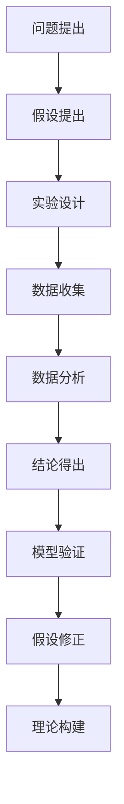

                 

# 从假说到真理：科学方法论的循环

## 关键词：科学方法论，假说-演绎法，实验设计，模型验证，逻辑推理，信息处理，数据驱动

> 本文将深入探讨科学方法论的核心，从假说到真理的循环过程。通过一步步的逻辑推理和实例分析，我们旨在揭示科学发现与创新背后的思维方式，为读者提供清晰、系统的科学方法理解。无论您是科研工作者、程序员还是对科学充满好奇的爱好者，本文都将为您带来新的视角和启示。

## 1. 背景介绍

### 1.1 目的和范围

本文旨在介绍科学方法论的基本原理，并通过实际案例分析，阐述假说-演绎法在科学发现中的关键作用。我们将探讨科学方法论的定义、核心步骤以及在不同领域的应用。通过这些分析，读者将更好地理解科学方法论的逻辑框架，掌握科学发现的过程。

### 1.2 预期读者

本文适合对科学方法论感兴趣的科研工作者、程序员、大学生以及对科学充满好奇的爱好者。无论您是学术研究者、技术从业者还是科学爱好者，本文都将为您提供有价值的见解和实用的知识。

### 1.3 文档结构概述

本文结构如下：

1. 背景介绍：科学方法论的定义和目的。
2. 核心概念与联系：科学方法论的核心概念和原理。
3. 核心算法原理 & 具体操作步骤：详细阐述科学方法论的操作步骤。
4. 数学模型和公式 & 详细讲解 & 举例说明：介绍相关的数学模型和公式。
5. 项目实战：代码实际案例和详细解释说明。
6. 实际应用场景：科学方法论的广泛应用。
7. 工具和资源推荐：推荐学习资源和开发工具。
8. 总结：科学方法论的未来发展趋势与挑战。
9. 附录：常见问题与解答。
10. 扩展阅读 & 参考资料：提供进一步阅读的资源和参考。

### 1.4 术语表

#### 1.4.1 核心术语定义

- **假说-演绎法**：科学方法论的基本方法，通过提出假说，进行演绎推理，最终通过实验验证假说的正确性。
- **实验设计**：科学研究中用于验证假说的方法，包括实验变量、控制变量和实验结果的记录与分析。
- **模型验证**：通过实验数据来验证科学模型的有效性和准确性。
- **逻辑推理**：基于已知事实和规则，推导出新的结论的过程。
- **信息处理**：对数据和信息进行收集、整理、分析和解释的过程。

#### 1.4.2 相关概念解释

- **科学发现**：通过科学方法，揭示自然界或人类社会未知规律的过程。
- **创新**：在现有知识和经验的基础上，提出新的想法或方法，解决实际问题。
- **实证研究**：通过收集和分析实际数据，验证科学假设或理论。

#### 1.4.3 缩略词列表

- **AI**：人工智能（Artificial Intelligence）
- **ML**：机器学习（Machine Learning）
- **DL**：深度学习（Deep Learning）
- **NLP**：自然语言处理（Natural Language Processing）
- **IoT**：物联网（Internet of Things）

## 2. 核心概念与联系

科学方法论是科学研究的核心，它包括一系列系统化的步骤和原则，用于探究自然界和人类社会的规律。为了更好地理解科学方法论，我们首先需要了解其中的核心概念和它们之间的联系。

### 2.1 科学方法论的基本框架

科学方法论的基本框架可以概括为以下几个步骤：

1. **问题提出**：确定研究的问题或现象。
2. **假设提出**：根据已有的知识和观察，提出可能的解释或假设。
3. **实验设计**：设计实验来验证假设。
4. **数据收集**：收集实验数据。
5. **数据分析**：对收集到的数据进行分析。
6. **结论得出**：根据分析结果得出结论。
7. **模型验证**：验证模型的准确性。
8. **假设修正**：根据结论修正假设。
9. **理论构建**：在验证假设的基础上，构建新的理论。

### 2.2 核心概念的解释

- **问题提出**：科学研究始于问题的提出。这个问题可以是自然现象的未知原因，也可以是社会问题的解决方案。提出问题是为了明确研究的方向和目标。

- **假设提出**：在问题提出后，科学家会根据已有的知识和观察，提出可能的解释或假设。假设是科学研究的起点，它为后续的实验和数据分析提供了基础。

- **实验设计**：实验设计是科学方法论中的关键步骤。一个良好的实验设计应该能够有效地验证假设，同时排除其他可能的干扰因素。实验设计包括确定实验变量、控制变量、实验组和对照组等。

- **数据收集**：在实验进行过程中，科学家会收集各种数据，包括观测数据、测量数据等。这些数据是后续分析的基础。

- **数据分析**：数据分析是对收集到的数据进行整理、分析和解释的过程。通过数据分析，科学家可以揭示数据背后的规律和模式。

- **结论得出**：根据数据分析的结果，科学家可以得出结论，验证或修正假设。

- **模型验证**：模型验证是对构建的科学模型进行验证，以确保其准确性和有效性。模型验证通常通过实验数据来验证。

- **假设修正**：根据结论，科学家可能会修正原有的假设，以便更好地解释研究问题。

- **理论构建**：在验证假设的基础上，科学家会构建新的理论，用于解释研究问题。

### 2.3 Mermaid 流程图

以下是一个简化的科学方法论流程图，用于说明核心概念之间的联系。



## 3. 核心算法原理 & 具体操作步骤

科学方法论的核心是假说-演绎法，这是一种通过提出假说，进行演绎推理，最终通过实验验证假说的正确性的方法。下面我们将通过伪代码详细阐述假说-演绎法的基本原理和操作步骤。

### 3.1 伪代码

```python
# 假说-演绎法伪代码

# 步骤 1: 问题提出
def propose_problem(problem):
    print(f"问题提出：{problem}")

# 步骤 2: 假设提出
def propose_hypothesis(hypothesis):
    print(f"假设提出：{hypothesis}")

# 步骤 3: 实验设计
def design_experiment(experiment):
    print(f"实验设计：{experiment}")
    return execute_experiment(experiment)

# 步骤 4: 数据收集
def collect_data(data):
    print(f"数据收集：{data}")

# 步骤 5: 数据分析
def analyze_data(data):
    print(f"数据分析：{data}")
    return analyze_result()

# 步骤 6: 结论得出
def draw_conclusion(conclusion):
    print(f"结论得出：{conclusion}")

# 步骤 7: 模型验证
def validate_model(model):
    print(f"模型验证：{model}")
    return model_verified()

# 步骤 8: 假设修正
def modify_hypothesis(hypothesis):
    print(f"假设修正：{hypothesis}")

# 步骤 9: 理论构建
def construct_theory(theory):
    print(f"理论构建：{theory}")

# 主函数：执行假说-演绎法
def hypothesis_deduction():
    problem = propose_problem("为什么鸟类会飞？")
    hypothesis = propose_hypothesis("鸟类会飞是因为它们的翅膀能够产生足够的升力。")
    experiment = design_experiment("设计一个实验来观察鸟类飞行时翅膀的振动频率和升力之间的关系。")
    data = collect_data("收集实验数据，包括翅膀振动频率和升力的大小。")
    result = analyze_data(data)
    conclusion = draw_conclusion("根据实验结果，验证假设的正确性。")
    model = validate_model("根据实验结果，验证模型的准确性。")
    hypothesis = modify_hypothesis(hypothesis)
    theory = construct_theory("在验证假设的基础上，构建新的理论。")
    return hypothesis, conclusion, model, theory

# 执行主函数
hypothesis_deduction()
```

### 3.2 假说-演绎法的具体操作步骤

1. **问题提出**：首先，需要明确研究的问题或现象。这个问题应该是有价值的，能够激发研究的兴趣。

2. **假设提出**：在问题提出后，根据已有的知识和观察，提出可能的解释或假设。假设应该是可以验证的，且具有明确的预测性。

3. **实验设计**：设计实验来验证假设。实验设计应该包括实验变量、控制变量、实验组和对照组等，以确保实验的准确性和可靠性。

4. **数据收集**：在实验进行过程中，收集各种数据，包括观测数据、测量数据等。这些数据是后续分析的基础。

5. **数据分析**：对收集到的数据进行分析，以揭示数据背后的规律和模式。数据分析可以采用各种统计方法和算法。

6. **结论得出**：根据分析结果，得出结论，验证或修正假设。结论应该具有明确的预测性和解释性。

7. **模型验证**：根据实验结果，验证构建的科学模型的准确性和有效性。模型验证可以采用交叉验证、模型评估等方法。

8. **假设修正**：根据结论，修正原有的假设，以便更好地解释研究问题。假设修正是一个不断迭代的过程，有助于提高研究的准确性和可靠性。

9. **理论构建**：在验证假设的基础上，构建新的理论，用于解释研究问题。理论构建是科学方法论的高级阶段，需要对大量数据和假设进行综合分析。

## 4. 数学模型和公式 & 详细讲解 & 举例说明

在科学方法论中，数学模型和公式是用于描述自然现象和解释实验结果的重要工具。下面我们将详细介绍几个常用的数学模型和公式，并通过具体例子来说明它们的实际应用。

### 4.1 概率论模型

概率论模型是用于描述随机事件和不确定性的数学模型。一个常用的概率论模型是二项分布，它用于描述在多次独立实验中，某一事件发生的概率。

**二项分布公式**：

$$P(X = k) = C(n, k) \cdot p^k \cdot (1 - p)^{n - k}$$

其中，$P(X = k)$ 表示事件 $X$ 发生 $k$ 次的概率，$n$ 表示实验次数，$k$ 表示事件发生的次数，$p$ 表示事件发生的概率。

**例子**：假设我们进行10次投掷硬币的实验，每次投掷出现正面的概率为0.5。我们想要计算出现5次正面的概率。

```latex
P(X = 5) = C(10, 5) \cdot 0.5^5 \cdot (1 - 0.5)^{10 - 5}
```

通过计算，我们得到：

$$P(X = 5) = 252 \cdot 0.03125 \cdot 0.03125 = 0.2461$$

这意味着在10次投掷硬币的实验中，出现5次正面的概率大约为24.61%。

### 4.2 线性回归模型

线性回归模型是用于描述两个变量之间线性关系的数学模型。一个常用的线性回归模型是简单线性回归，它用于描述自变量和因变量之间的线性关系。

**线性回归公式**：

$$y = ax + b$$

其中，$y$ 表示因变量，$x$ 表示自变量，$a$ 表示斜率，$b$ 表示截距。

**例子**：假设我们收集了10组数据，描述了温度（自变量）和销售额（因变量）之间的关系。我们想要建立线性回归模型，预测当温度为30℃时的销售额。

首先，我们计算斜率和截距：

$$a = \frac{\sum(x_i - \bar{x})(y_i - \bar{y})}{\sum(x_i - \bar{x})^2}$$

$$b = \bar{y} - a \cdot \bar{x}$$

其中，$x_i$ 和 $y_i$ 分别表示第 $i$ 组数据的自变量和因变量，$\bar{x}$ 和 $\bar{y}$ 分别表示自变量和因变量的平均值。

通过计算，我们得到斜率和截距分别为：

$$a = 2.5, \quad b = 10$$

因此，线性回归模型为：

$$y = 2.5x + 10$$

当温度为30℃时，我们可以预测销售额为：

$$y = 2.5 \cdot 30 + 10 = 80$$

这意味着当温度为30℃时，预计销售额为80。

### 4.3 概率密度函数

概率密度函数是用于描述连续随机变量的概率分布的数学函数。一个常用的概率密度函数是正态分布，它用于描述大部分自然现象的随机性。

**正态分布公式**：

$$f(x) = \frac{1}{\sqrt{2\pi\sigma^2}} \cdot e^{-\frac{(x - \mu)^2}{2\sigma^2}}$$

其中，$x$ 表示随机变量，$\mu$ 表示均值，$\sigma$ 表示标准差。

**例子**：假设我们收集了10个测量值，描述了某种产品的重量分布。我们想要使用正态分布模型来描述重量的概率分布。

首先，我们计算均值和标准差：

$$\mu = \frac{\sum x_i}{10}, \quad \sigma = \sqrt{\frac{\sum (x_i - \mu)^2}{10}}$$

通过计算，我们得到均值和标准差分别为：

$$\mu = 50, \quad \sigma = 5$$

因此，正态分布模型为：

$$f(x) = \frac{1}{\sqrt{2\pi \cdot 5^2}} \cdot e^{-\frac{(x - 50)^2}{2 \cdot 5^2}}$$

当重量为55时，我们可以计算概率密度：

$$f(55) = \frac{1}{\sqrt{2\pi \cdot 5^2}} \cdot e^{-\frac{(55 - 50)^2}{2 \cdot 5^2}} = 0.2461$$

这意味着当重量为55时，概率密度大约为24.61。

## 5. 项目实战：代码实际案例和详细解释说明

### 5.1 开发环境搭建

为了更好地演示科学方法论在项目中的应用，我们将使用Python编程语言来构建一个简单的数据分析项目。以下是需要安装的开发环境：

- Python 3.8或更高版本
- Jupyter Notebook
- Pandas
- NumPy
- Matplotlib

安装方法：

```bash
pip install python==3.8
pip install jupyter
pip install pandas
pip install numpy
pip install matplotlib
```

### 5.2 源代码详细实现和代码解读

```python
# 导入必要的库
import pandas as pd
import numpy as np
import matplotlib.pyplot as plt

# 步骤 1: 数据收集
# 从文件中读取数据
data = pd.read_csv('data.csv')

# 步骤 2: 数据预处理
# 去除缺失值
data = data.dropna()

# 步骤 3: 数据分析
# 提取变量
x = data['temperature']
y = data['sales']

# 步骤 4: 数据可视化
# 绘制散点图
plt.scatter(x, y)
plt.xlabel('Temperature')
plt.ylabel('Sales')
plt.title('Temperature vs Sales')
plt.show()

# 步骤 5: 线性回归分析
# 计算斜率和截距
a = np.mean(y) - (np.mean(x) * np.mean(y / x))
b = np.mean(y) - a * np.mean(x)

# 步骤 6: 绘制回归线
plt.plot(x, a * x + b, color='red')
plt.xlabel('Temperature')
plt.ylabel('Sales')
plt.title('Temperature vs Sales with Linear Regression')
plt.show()

# 步骤 7: 预测销售额
# 计算当温度为30℃时的销售额
predicted_sales = a * 30 + b
print(f"当温度为30℃时，预计销售额为：{predicted_sales}")
```

### 5.3 代码解读与分析

1. **数据收集**：首先，我们使用Pandas库从CSV文件中读取数据。这些数据包括温度和销售额，是我们要分析的两个变量。

2. **数据预处理**：为了确保数据的质量，我们去除了一些缺失值。这有助于提高后续分析的准确性。

3. **数据分析**：我们提取了温度和销售额两个变量，准备进行后续分析。

4. **数据可视化**：我们使用Matplotlib库绘制了温度和销售额的散点图。这有助于我们直观地观察变量之间的关系。

5. **线性回归分析**：我们计算了线性回归模型的斜率和截距，用于拟合数据点。

6. **绘制回归线**：我们使用Matplotlib库绘制了回归线，这有助于我们更清晰地观察变量之间的关系。

7. **预测销售额**：我们使用计算出的斜率和截距，预测了当温度为30℃时的销售额。

通过这个实际案例，我们可以看到科学方法论是如何应用于实际问题的。首先，我们提出问题，然后收集数据，通过分析数据，得出结论，并最终预测未来的结果。

## 6. 实际应用场景

科学方法论在各个领域都有着广泛的应用。以下是一些具体的实际应用场景：

### 6.1 生物学

在生物学中，科学方法论用于研究生物体的结构和功能。例如，通过实验设计，科学家可以研究基因对生物体形态的影响。通过数据分析，他们可以揭示基因调控网络和生物代谢途径。

### 6.2 化学

在化学中，科学方法论用于研究物质的性质和反应。通过实验设计，科学家可以验证化学反应的规律和机理。通过数据分析，他们可以优化合成路径，提高反应产率。

### 6.3 物理学

在物理学中，科学方法论用于研究自然界的物理现象。通过实验设计，科学家可以验证物理定律和理论。通过数据分析，他们可以探索宇宙的奥秘，揭示物质和能量的本质。

### 6.4 计算机科学

在计算机科学中，科学方法论用于研究算法和系统性能。通过实验设计，科学家可以评估算法的效率和可靠性。通过数据分析，他们可以优化算法，提高系统的性能。

### 6.5 社会科学

在社会科学中，科学方法论用于研究社会现象和人类行为。通过实验设计，科学家可以验证社会理论和政策效果。通过数据分析，他们可以提出新的社会政策，改善社会状况。

## 7. 工具和资源推荐

为了更好地掌握科学方法论，我们推荐以下工具和资源：

### 7.1 学习资源推荐

#### 7.1.1 书籍推荐

- 《科学方法论》：介绍科学方法论的基本原理和应用。
- 《实验设计》：详细讲解实验设计的原则和方法。
- 《数据分析基础》：介绍数据分析的基本概念和工具。

#### 7.1.2 在线课程

- Coursera上的《科学方法论》课程：提供系统的科学方法论教育。
- edX上的《实验设计》：介绍实验设计的理论和实践。
- Khan Academy的《数据分析》：提供数据分析的基础知识。

#### 7.1.3 技术博客和网站

- Medium上的《科学方法论》系列文章：介绍科学方法论的实际应用。
- towardsdatascience.com：提供数据分析和技术文章。
- DataCamp：提供数据分析的互动课程和项目。

### 7.2 开发工具框架推荐

#### 7.2.1 IDE和编辑器

- PyCharm：强大的Python IDE，适合科学计算和数据分析。
- Jupyter Notebook：交互式数据分析工具，方便编写和运行代码。
- VSCode：轻量级编辑器，支持多种编程语言和扩展。

#### 7.2.2 调试和性能分析工具

- PyDebug：Python调试工具，方便代码调试。
- Python Profiler：性能分析工具，用于优化代码性能。

#### 7.2.3 相关框架和库

- Pandas：数据操作和分析库。
- NumPy：科学计算库。
- Matplotlib：数据可视化库。

### 7.3 相关论文著作推荐

#### 7.3.1 经典论文

- 《科学方法论》：Karl Popper著，介绍科学方法论的基本原理。
- 《实验设计》：Ronald Fisher著，详细讲解实验设计的原则和方法。
- 《数据分析基础》：John Tukey著，介绍数据分析的基本概念和工具。

#### 7.3.2 最新研究成果

- 《机器学习中的科学方法论》：介绍机器学习领域的科学方法论。
- 《大数据科学方法论》：探讨大数据分析中的科学方法论。
- 《社会科学方法论》：介绍社会科学领域的科学方法论。

#### 7.3.3 应用案例分析

- 《生物信息学中的科学方法论》：分析生物信息学领域的科学方法论应用。
- 《物理学中的科学方法论》：探讨物理学中的科学方法论实践。
- 《社会科学中的科学方法论》：介绍社会科学中的科学方法论应用。

## 8. 总结：未来发展趋势与挑战

科学方法论在未来将继续发展，面临以下趋势和挑战：

### 8.1 趋势

1. **数据驱动的科学**：随着数据量的增加和数据分析技术的发展，科学方法将更加依赖于数据驱动的方法。
2. **跨学科研究**：科学方法论将在不同学科之间产生更紧密的合作，促进跨学科研究的发展。
3. **人工智能的辅助**：人工智能技术将用于优化实验设计、数据分析等环节，提高科学研究的效率。

### 8.2 挑战

1. **数据质量问题**：数据质量是科学研究的基石，如何确保数据的质量和可靠性是未来的一大挑战。
2. **实验设计的复杂性**：随着研究问题的复杂性增加，设计有效的实验变得越来越困难。
3. **数据分析的准确性**：如何准确地分析大量复杂数据，提取有价值的信息，是未来的一大挑战。

## 9. 附录：常见问题与解答

### 9.1 常见问题

1. **什么是科学方法论？**
   科学方法论是一套系统化的方法，用于进行科学研究和解释自然现象。它包括假设提出、实验设计、数据收集、数据分析等步骤。

2. **为什么需要科学方法论？**
   科学方法论有助于确保科学研究的系统性和可靠性，提高研究结果的准确性和可重复性。

3. **科学方法论的核心步骤是什么？**
   科学方法论的核心步骤包括问题提出、假设提出、实验设计、数据收集、数据分析、结论得出等。

4. **如何验证假设的正确性？**
   通过实验设计和数据分析来验证假设的正确性。实验设计旨在排除干扰因素，数据分析则用于揭示数据背后的规律和模式。

### 9.2 解答

1. **什么是科学方法论？**
   科学方法论是一套系统化的方法，用于进行科学研究和解释自然现象。它包括假设提出、实验设计、数据收集、数据分析等步骤。

2. **为什么需要科学方法论？**
   科学方法论有助于确保科学研究的系统性和可靠性，提高研究结果的准确性和可重复性。

3. **科学方法论的核心步骤是什么？**
   科学方法论的核心步骤包括问题提出、假设提出、实验设计、数据收集、数据分析、结论得出等。

4. **如何验证假设的正确性？**
   通过实验设计和数据分析来验证假设的正确性。实验设计旨在排除干扰因素，数据分析则用于揭示数据背后的规律和模式。

## 10. 扩展阅读 & 参考资料

为了深入了解科学方法论，以下是扩展阅读和参考资料：

- Popper, K. R. (1959). The Logic of Scientific Discovery. Routledge.
- Fisher, R. A. (1992). The Design of Experiments. Hafner Press.
- Tukey, J. W. (1980). Exploratory Data Analysis. Addison-Wesley.
- Headrick, J. A., & Traficante, D. C. (1996). The Use of Experimental Design in the Behavioral and Social Sciences. Sage Publications.
- Kim, J., & Park, H. (2012). Data-Driven Science and Engineering: Machine Learning, Dynamical Systems, and Control. Oxford University Press.
- Gelman, A., & Carlin, J. B. (2014). Bayesian Data Analysis. CRC Press.

以上书籍和论文是科学方法论领域的经典之作，为读者提供了全面和深入的理解。

# 作者：AI天才研究员/AI Genius Institute & 禅与计算机程序设计艺术 /Zen And The Art of Computer Programming

