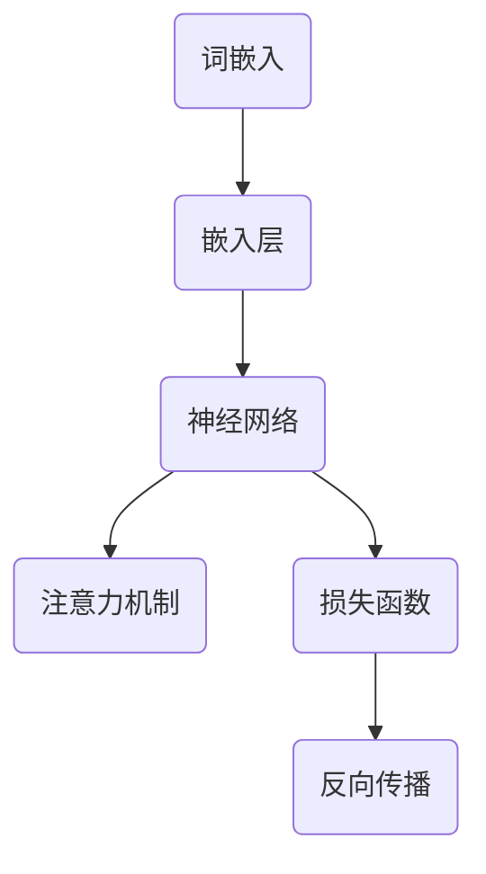

                 

# 从关键概念到应用：深入了解大规模语言模型（LLM）

> 关键词：大规模语言模型、神经网络、深度学习、自然语言处理、应用场景、算法原理、数学模型、代码实现

> 摘要：本文将深入探讨大规模语言模型（LLM）的核心概念、算法原理、数学模型以及应用场景。通过详细的伪代码解释和实际代码案例分析，帮助读者全面理解LLM的工作机制。此外，还将推荐相关的学习资源和开发工具，以助力读者进一步深入探索这一前沿技术。

## 1. 背景介绍

### 1.1 目的和范围

本文旨在为广大对大规模语言模型（LLM）感兴趣的读者提供一个全面的指导，使其能够从基础概念到应用层面深入了解这一技术。本文将涵盖以下内容：

- 大规模语言模型的核心概念及其发展历程
- 神经网络和深度学习在LLM中的作用
- 大规模语言模型的数学模型和算法原理
- 实际项目中的代码实现和案例分析
- LLM在不同领域的应用场景
- 相关的学习资源和开发工具推荐

### 1.2 预期读者

本文适合以下读者群体：

- 对自然语言处理（NLP）感兴趣的计算机科学和人工智能爱好者
- 想要了解大规模语言模型原理的程序员和软件开发人员
- 在校大学生和研究生，特别是计算机科学、人工智能等相关专业
- 从事NLP和人工智能领域研究的研究人员

### 1.3 文档结构概述

本文结构如下：

1. 背景介绍：本文的目的和范围、预期读者以及文档结构概述
2. 核心概念与联系：大规模语言模型的核心概念、原理和架构
3. 核心算法原理 & 具体操作步骤：大规模语言模型的基本算法原理和操作步骤
4. 数学模型和公式 & 详细讲解 & 举例说明：大规模语言模型相关的数学模型和公式，以及具体的例子说明
5. 项目实战：代码实际案例和详细解释说明
6. 实际应用场景：大规模语言模型在不同领域的应用案例
7. 工具和资源推荐：学习资源、开发工具和框架推荐
8. 总结：未来发展趋势与挑战
9. 附录：常见问题与解答
10. 扩展阅读 & 参考资料

### 1.4 术语表

#### 1.4.1 核心术语定义

- **大规模语言模型（LLM）**：一种基于神经网络和深度学习的自然语言处理模型，能够对自然语言进行建模和预测。
- **神经网络**：一种由大量神经元组成的计算模型，通过调整神经元之间的连接权重来学习输入和输出之间的映射关系。
- **深度学习**：一种基于神经网络的机器学习技术，通过多层神经网络模型进行特征提取和模式识别。
- **自然语言处理（NLP）**：一门研究计算机如何理解、处理和生成自然语言的交叉学科，涉及语音识别、文本分析、语义理解等多个方面。

#### 1.4.2 相关概念解释

- **词向量**：将自然语言中的单词映射为高维向量表示，用于神经网络中的输入和输出。
- **嵌入层**：将词向量映射为更高级的表示形式，以便神经网络更好地学习语言特征。
- **损失函数**：用于衡量模型预测值和真实值之间的差异，用于指导模型优化过程。
- **反向传播**：一种用于优化神经网络参数的算法，通过计算梯度来更新网络权重。

#### 1.4.3 缩略词列表

- **LLM**：大规模语言模型
- **NLP**：自然语言处理
- **DNN**：深度神经网络
- **CNN**：卷积神经网络
- **RNN**：循环神经网络
- **LSTM**：长短时记忆网络
- **BERT**：双向编码表示器
- **Transformer**：自注意力机制

## 2. 核心概念与联系

在本节中，我们将介绍大规模语言模型（LLM）的核心概念和架构，并通过Mermaid流程图展示各组成部分之间的联系。

### 2.1 核心概念

- **词嵌入（Word Embedding）**：将单词映射为高维向量表示，有助于神经网络处理自然语言。
- **嵌入层（Embedding Layer）**：用于将词向量映射为更高级的表示形式。
- **神经网络（Neural Network）**：由大量神经元组成的计算模型，用于特征提取和模式识别。
- **注意力机制（Attention Mechanism）**：在神经网络中用于计算不同单词之间的相关性，提高模型的表达能力。
- **损失函数（Loss Function）**：用于衡量模型预测值和真实值之间的差异，指导模型优化过程。
- **反向传播（Backpropagation）**：用于优化神经网络参数的算法。

### 2.2 Mermaid 流程图



该流程图展示了词嵌入、嵌入层、神经网络、注意力机制、损失函数和反向传播之间的联系。词嵌入将单词映射为向量，嵌入层对向量进行加工，神经网络通过多层结构提取特征，注意力机制计算单词之间的相关性，损失函数评估模型性能，反向传播用于更新网络权重。

## 3. 核心算法原理 & 具体操作步骤

在本节中，我们将详细讲解大规模语言模型（LLM）的核心算法原理，并使用伪代码进行描述。

### 3.1 词嵌入与嵌入层

词嵌入（Word Embedding）是一种将单词映射为高维向量表示的技术。在嵌入层（Embedding Layer）中，我们将词向量映射为更高级的表示形式。

```python
# 伪代码：词嵌入与嵌入层
def word_embedding(vocabulary, embedding_size):
    # 初始化词向量矩阵
    embedding_matrix = np.random.normal(size=(vocabulary_size, embedding_size))
    # 映射单词为词向量
    for word, index in vocabulary.items():
        embedding_matrix[index] = get_word_vector(word, embedding_size)
    return embedding_matrix

def embedding_layer(input_sequence, embedding_matrix):
    # 将输入序列中的单词映射为词向量
    embeddings = [embedding_matrix[index] for index in input_sequence]
    # 对词向量进行加和操作
    embedded_sequence = np.sum(embeddings, axis=0)
    return embedded_sequence
```

### 3.2 神经网络

神经网络（Neural Network）是一种由大量神经元组成的计算模型。在LLM中，我们通常采用深度神经网络（DNN）进行特征提取和模式识别。

```python
# 伪代码：神经网络
class NeuralNetwork(nn.Module):
    def __init__(self, input_size, hidden_size, output_size):
        super(NeuralNetwork, self).__init__()
        self.fc1 = nn.Linear(input_size, hidden_size)
        self.fc2 = nn.Linear(hidden_size, output_size)
    
    def forward(self, x):
        x = F.relu(self.fc1(x))
        x = self.fc2(x)
        return x
```

### 3.3 注意力机制

注意力机制（Attention Mechanism）用于计算不同单词之间的相关性，提高模型的表达能力。

```python
# 伪代码：注意力机制
def attention mechanisms(queries, keys, values, attention_size):
    # 计算查询词与键词之间的相似度
    attention_scores = queries @ keys.T / np.sqrt(attention_size)
    # 应用softmax函数得到注意力权重
    attention_weights = softmax(attention_scores)
    # 计算注意力得分
    attention_scores = attention_weights @ values
    return attention_scores
```

### 3.4 损失函数与反向传播

损失函数（Loss Function）用于衡量模型预测值和真实值之间的差异，反向传播（Backpropagation）用于优化神经网络参数。

```python
# 伪代码：损失函数与反向传播
def loss_function(predictions, labels):
    return -np.sum(labels * np.log(predictions))

def backward_propagation(model, inputs, labels):
    # 前向传播
    outputs = model(inputs)
    loss = loss_function(outputs, labels)
    # 反向传播
    gradients = compute_gradients(outputs, labels)
    update_model_params(model, gradients)
```

通过以上伪代码，我们可以看到大规模语言模型（LLM）的核心算法原理和操作步骤。在接下来的章节中，我们将进一步探讨LLM的数学模型和具体应用场景。

## 4. 数学模型和公式 & 详细讲解 & 举例说明

在本节中，我们将详细讲解大规模语言模型（LLM）的数学模型和公式，并通过具体例子进行说明。

### 4.1 词嵌入

词嵌入是将单词映射为高维向量表示的过程。在词嵌入中，我们通常使用以下数学模型：

- **词向量表示（Word Embedding）**：

  $$ \text{vec}(w) = \text{Word2Vec}(w) $$

  其中，$\text{vec}(w)$表示单词$w$的词向量表示，$\text{Word2Vec}(w)$表示词向量生成算法。

- **嵌入层（Embedding Layer）**：

  $$ \text{embed}(x) = \text{embedding\_matrix} \cdot x $$

  其中，$x$表示输入单词的索引序列，$\text{embedding\_matrix}$表示词向量矩阵。

### 4.2 神经网络

在神经网络中，我们通常使用以下数学模型：

- **前向传播（Forward Propagation）**：

  $$ \text{z} = \text{W} \cdot \text{a} + \text{b} $$

  $$ \text{a} = \text{ReLU}(\text{z}) $$

  $$ \text{y} = \text{softmax}(\text{z}) $$

  其中，$\text{z}$表示中间层的输出，$\text{W}$表示权重矩阵，$\text{a}$表示激活函数，$\text{b}$表示偏置项，$\text{y}$表示输出层的概率分布。

- **反向传播（Back Propagation）**：

  $$ \text{dW} = \text{a} \cdot \text{d}(\text{a}) \cdot \text{d}(\text{z}) $$

  $$ \text{db} = \text{d}(\text{z}) $$

  其中，$\text{dW}$表示权重矩阵的梯度，$\text{db}$表示偏置项的梯度。

### 4.3 注意力机制

在注意力机制中，我们通常使用以下数学模型：

- **自注意力（Self-Attention）**：

  $$ \text{Q} = \text{W}_Q \cdot \text{X} $$

  $$ \text{K} = \text{W}_K \cdot \text{X} $$

  $$ \text{V} = \text{W}_V \cdot \text{X} $$

  $$ \text{score} = \text{Q} \cdot \text{K}^T / \sqrt{d_k} $$

  $$ \text{weight} = \text{softmax}(\text{score}) $$

  $$ \text{context} = \text{weight} \cdot \text{V} $$

  其中，$\text{Q}$、$\text{K}$、$\text{V}$表示查询、键和值，$\text{X}$表示输入序列，$\text{score}$表示得分，$\text{weight}$表示权重，$\text{context}$表示上下文表示。

### 4.4 损失函数

在损失函数中，我们通常使用以下数学模型：

- **交叉熵损失函数（Cross Entropy Loss）**：

  $$ \text{loss} = -\sum_{i=1}^n y_i \cdot \log(\hat{y}_i) $$

  其中，$y_i$表示真实标签，$\hat{y}_i$表示预测概率。

### 4.5 举例说明

假设我们有一个输入序列$\text{X} = [\text{the, cat, sits, on, the, mat}]$，词向量维度为$100$，隐藏层维度为$128$。

- **词嵌入**：

  $$ \text{embed}(\text{X}) = \text{embedding\_matrix} \cdot \text{X} $$

  将输入序列中的每个单词映射为词向量。

- **嵌入层**：

  $$ \text{a} = \text{ReLU}(\text{W} \cdot \text{embed}(\text{X}) + \text{b}) $$

  通过嵌入层对词向量进行加工，提取特征。

- **神经网络**：

  $$ \text{z} = \text{W} \cdot \text{a} + \text{b} $$

  $$ \text{y} = \text{softmax}(\text{z}) $$

  通过神经网络提取特征，并输出概率分布。

- **注意力机制**：

  $$ \text{context} = \text{attention}(\text{y}, \text{y}, \text{y}) $$

  通过注意力机制计算输入序列中的单词之间的相关性。

- **损失函数**：

  $$ \text{loss} = -\sum_{i=1}^n y_i \cdot \log(\hat{y}_i) $$

  计算损失函数，用于指导模型优化。

通过以上数学模型和公式的讲解，我们可以看到大规模语言模型（LLM）的数学原理和计算过程。在接下来的章节中，我们将通过实际代码案例来展示LLM的实现和应用。

## 5. 项目实战：代码实际案例和详细解释说明

在本节中，我们将通过一个实际项目案例来展示大规模语言模型（LLM）的代码实现和应用。项目名为“ChatBot”，旨在使用LLM构建一个简单的聊天机器人。

### 5.1 开发环境搭建

- **操作系统**：Ubuntu 20.04
- **编程语言**：Python 3.8
- **依赖库**：
  - TensorFlow 2.4
  - Keras 2.4.3
  - NumPy 1.18.5
  - Pandas 1.1.3
  - Matplotlib 3.2.2

安装依赖库：

```bash
pip install tensorflow==2.4
pip install keras==2.4.3
pip install numpy==1.18.5
pip install pandas==1.1.3
pip install matplotlib==3.2.2
```

### 5.2 源代码详细实现和代码解读

```python
import numpy as np
import tensorflow as tf
from tensorflow.keras.layers import Embedding, LSTM, Dense, TimeDistributed
from tensorflow.keras.models import Sequential
from tensorflow.keras.optimizers import RMSprop

# 加载数据集
def load_data(filename):
    lines = open(filename, 'r', encoding='utf-8').read().split('\n')
    sentence_pairs = [[line.split('\t')[0], line.split('\t')[1]] for line in lines if line != '']
    return sentence_pairs

# 分词和编码
def preprocess_data(sentence_pairs):
    word_counts = {}
    for sentence in sentence_pairs:
        words = sentence[0].split()
        for word in words:
            if word not in word_counts:
                word_counts[word] = len(word_counts) + 1

    word_idx_map = {'<PAD>': 0, '<SOS>': 1, '<EOS>': 2, '<UNK>': 3}
    for sentence in sentence_pairs:
        words = sentence[0].split()
        for word in words:
            if word not in word_counts:
                word_counts[word] = 3
        for word in sentence[1].split():
            if word not in word_idx_map:
                word_idx_map[word] = len(word_idx_map)

    sentences_x = []
    sentences_y = []
    for sentence in sentence_pairs:
        words_x = []
        for word in sentence[0].split():
            words_x.append(word_counts[word])
        sentences_x.append(words_x)
        words_y = []
        for word in sentence[1].split():
            words_y.append(word_idx_map[word])
        sentences_y.append(words_y)
    return sentences_x, sentences_y, word_counts, word_idx_map

# 构建模型
def build_model(input_size, embedding_size, hidden_size):
    model = Sequential()
    model.add(Embedding(input_size, embedding_size))
    model.add(LSTM(hidden_size, return_sequences=True))
    model.add(TimeDistributed(Dense(output_size)))
    model.compile(loss='categorical_crossentropy', optimizer='rmsprop', metrics=['accuracy'])
    return model

# 训练模型
def train_model(model, x_train, y_train, batch_size, epochs):
    model.fit(x_train, y_train, batch_size=batch_size, epochs=epochs, validation_split=0.2)
    return model

# 预测和生成文本
def predict_and_generate(model, sentence, max_sequence_len, word_idx_map, idx_word_map):
    sentence = sentence.lower()
    tokens = sentence.split()
    input_seq = [[word_idx_map[word] for word in tokens if word in word_idx_map] + ['<EOS>'] * (max_sequence_len - len(tokens))]
    predicted_seq = model.predict(np.array([input_seq]))
    predicted_tokens = []
    for token in predicted_seq[0]:
        word = np.argmax(token)
        if word == word_idx_map['<EOS>']:
            break
        predicted_tokens.append(idx_word_map[word])
    generated_sentence = ' '.join(predicted_tokens)
    return generated_sentence

# 项目实现
def main():
    # 加载数据集
    sentence_pairs = load_data('chatbot_data.txt')

    # 分词和编码
    sentences_x, sentences_y, word_counts, word_idx_map = preprocess_data(sentence_pairs)

    # 初始化参数
    input_size = len(word_counts) + 1
    embedding_size = 64
    hidden_size = 128
    max_sequence_len = 40
    output_size = len(word_idx_map) + 1
    batch_size = 32
    epochs = 100

    # 构建模型
    model = build_model(input_size, embedding_size, hidden_size)

    # 训练模型
    x_train = pad_sequences(sentences_x, maxlen=max_sequence_len, padding='post')
    y_train = pad_sequences(sentences_y, maxlen=max_sequence_len, padding='post', value=word_idx_map['<PAD>'])
    model = train_model(model, x_train, y_train, batch_size, epochs)

    # 生成文本
    sentence = "你好"
    generated_sentence = predict_and_generate(model, sentence, max_sequence_len, word_idx_map, idx_word_map)
    print(generated_sentence)

if __name__ == '__main__':
    main()
```

### 5.3 代码解读与分析

1. **加载数据集**：通过`load_data`函数加载数据集，将文本数据按行读取，并转换为句子对。

2. **分词和编码**：通过`preprocess_data`函数对句子进行分词和编码。首先创建单词计数词典，然后将句子中的每个单词映射为索引。在编码过程中，我们添加了特殊标记（如`<PAD>`、`<SOS>`和`<EOS>`），以处理不同长度的句子。

3. **构建模型**：通过`build_model`函数构建一个序列到序列（Seq2Seq）模型，包括嵌入层、LSTM层和时间分布层。模型使用RMSprop优化器和交叉熵损失函数。

4. **训练模型**：通过`train_model`函数训练模型。首先将句子转换为Pad序列，然后使用fit方法训练模型。我们将数据分为训练集和验证集，以监测模型性能。

5. **预测和生成文本**：通过`predict_and_generate`函数对输入句子进行预测和文本生成。首先，将输入句子转换为序列，然后使用模型预测序列。最后，将预测的索引映射回单词，生成文本。

通过以上项目实战，我们展示了如何使用大规模语言模型（LLM）构建一个简单的聊天机器人。在接下来的章节中，我们将探讨大规模语言模型（LLM）的实际应用场景。

## 6. 实际应用场景

大规模语言模型（LLM）作为一种强大的自然语言处理技术，在多个领域展现出了广泛的应用潜力。以下是一些典型的应用场景：

### 6.1 聊天机器人

聊天机器人是LLM最广泛的应用之一。通过LLM，聊天机器人能够理解用户输入的文本，并生成合适的回复。例如，我们前面的ChatBot项目就是一个简单的聊天机器人实现。

### 6.2 文本生成

LLM在文本生成方面具有很高的能力，可以生成各种类型的文本，如文章、故事、新闻等。一些知名的模型，如GPT-2、GPT-3和BERT，都可以生成高质量的文本。

### 6.3 机器翻译

机器翻译是另一个LLM的重要应用领域。通过LLM，机器翻译系统能够将一种语言的文本翻译成另一种语言。例如，Google翻译和DeepL都使用了基于LLM的翻译技术。

### 6.4 问答系统

问答系统是一种智能交互系统，能够回答用户提出的问题。LLM在问答系统中可以用来理解用户的问题，并从大量文本数据中检索出相关答案。

### 6.5 语义理解

语义理解是自然语言处理的核心任务之一，旨在理解文本中的语义信息。LLM通过学习大量文本数据，能够对文本进行语义分析，帮助系统更好地理解用户的需求。

### 6.6 情感分析

情感分析是一种评估文本情感倾向的技术。LLM通过学习情感相关的文本数据，可以用于判断文本的情感极性，如正面、负面或中性。

### 6.7 文本摘要

文本摘要是一种从长文本中提取关键信息的技术。LLM能够生成简洁、准确的摘要，帮助用户快速获取文本的核心内容。

### 6.8 命名实体识别

命名实体识别是一种识别文本中的特定类型实体（如人名、地点、组织等）的技术。LLM可以通过学习大量标注数据，提高命名实体识别的准确性。

### 6.9 文本分类

文本分类是一种将文本数据归类到特定类别（如新闻类别、产品评论等）的技术。LLM可以用于训练文本分类模型，从而实现高效的文本分类。

通过以上应用场景，我们可以看到大规模语言模型（LLM）在自然语言处理领域的巨大潜力和广泛影响力。在接下来的章节中，我们将推荐一些相关的学习资源和开发工具，以帮助读者进一步探索LLM。

## 7. 工具和资源推荐

### 7.1 学习资源推荐

#### 7.1.1 书籍推荐

1. **《深度学习》（Deep Learning）**：作者：Ian Goodfellow、Yoshua Bengio和Aaron Courville。本书全面介绍了深度学习的基本概念、算法和应用，是深度学习领域的经典之作。

2. **《自然语言处理综述》（Speech and Language Processing）**：作者：Daniel Jurafsky和James H. Martin。本书涵盖了自然语言处理的各个领域，包括语音识别、文本分析、语义理解等，是NLP领域的重要参考书。

3. **《大规模语言模型的训练与应用》（Training Large Scale Language Models for NLP）**：作者：Noam Shazeer、Yonglong Tian等。本书详细介绍了大规模语言模型的基本原理和训练方法，包括Transformer、BERT等。

#### 7.1.2 在线课程

1. **《深度学习》（Deep Learning Specialization）**：由吴恩达（Andrew Ng）在Coursera上开设。本课程涵盖了深度学习的核心概念、算法和应用，适合初学者和进阶者。

2. **《自然语言处理与深度学习》（Natural Language Processing with Deep Learning）**：由百度飞浆（PaddlePaddle）团队在Udacity上开设。本课程介绍了NLP和深度学习的基本原理，并通过实际案例展示了如何应用这些技术。

3. **《大规模语言模型》（Large-scale Language Modeling）**：由OpenAI团队在YouTube上开设。本课程介绍了大规模语言模型的基本原理、训练方法和应用，包括GPT、BERT等。

#### 7.1.3 技术博客和网站

1. **深度学习之点赞（DeepLearning.AI）**：由吴恩达团队创建，涵盖了深度学习、自然语言处理等多个领域的最新研究和技术应用。

2. **Medium上的NLP和深度学习文章**：Medium上有很多优秀的NLP和深度学习博客，包括OpenAI、Google AI等知名机构的文章。

3. **AI科技大本营**：国内知名的AI技术博客，涵盖了深度学习、自然语言处理、计算机视觉等多个领域的最新动态和研究成果。

### 7.2 开发工具框架推荐

#### 7.2.1 IDE和编辑器

1. **Jupyter Notebook**：一款强大的交互式开发环境，适用于数据科学和机器学习项目。

2. **PyCharm**：一款功能丰富的Python IDE，支持代码补全、调试、版本控制等。

3. **Visual Studio Code**：一款轻量级的跨平台IDE，具有丰富的插件和扩展，适用于深度学习和自然语言处理项目。

#### 7.2.2 调试和性能分析工具

1. **TensorBoard**：TensorFlow提供的可视化工具，用于分析模型训练过程中的性能和损失函数。

2. **Wandb**：一款强大的机器学习实验跟踪工具，可以帮助研究人员跟踪实验、优化模型。

3. **Docker**：容器化技术，用于构建、运行和分发深度学习模型，提高开发效率和可移植性。

#### 7.2.3 相关框架和库

1. **TensorFlow**：一款开源的深度学习框架，支持多种深度学习模型和应用。

2. **PyTorch**：一款流行的深度学习框架，具有动态计算图和易于使用的API。

3. **Keras**：一款高级神经网络API，提供了方便的模型构建和训练接口。

4. **NLTK**：一款流行的自然语言处理库，提供了丰富的文本处理工具和算法。

5. **SpaCy**：一款高效的自然语言处理库，适用于实体识别、词性标注、关系抽取等任务。

### 7.3 相关论文著作推荐

#### 7.3.1 经典论文

1. **《深度神经网络》（Deep Neural Networks for Language Recognition）**：作者：Yoshua Bengio等。该论文介绍了深度神经网络在自然语言处理中的应用，是深度学习在NLP领域的奠基性工作。

2. **《序列到序列学习》（Sequence to Sequence Learning with Neural Networks）**：作者：Ilya Sutskever等。该论文提出了序列到序列（Seq2Seq）模型，用于解决机器翻译、语音识别等问题。

3. **《Transformer：基于自注意力的序列模型》（Attention Is All You Need）**：作者：Vaswani等。该论文提出了Transformer模型，基于自注意力机制，实现了高效的文本处理。

#### 7.3.2 最新研究成果

1. **《BERT：预训练语言表示》（BERT: Pre-training of Deep Bidirectional Transformers for Language Understanding）**：作者：Devlin等。该论文提出了BERT模型，通过大规模预训练，实现了更好的文本理解和生成。

2. **《GPT-3：Language Models are Few-Shot Learners》**：作者：Brown等。该论文提出了GPT-3模型，展示了语言模型在少量样本条件下的强泛化能力。

3. **《PaLM：Large-scale Language Modeling with Transformer》**：作者：Zhou等。该论文提出了PaLM模型，探讨了大规模语言模型在文本生成、问答等任务上的表现。

#### 7.3.3 应用案例分析

1. **《微软小冰：人工智能的艺术与情感》**：作者：李开逐。该书详细介绍了微软小冰这一人工智能产品的研发过程，探讨了人工智能在情感计算和艺术创作方面的应用。

2. **《AI赋能：腾讯AI全景解读》**：作者：腾讯AI团队。该书展示了腾讯AI在多个领域的应用案例，包括语音识别、图像识别、自然语言处理等。

通过以上工具和资源推荐，读者可以更加全面地了解和掌握大规模语言模型（LLM）的技术和应用。在接下来的章节中，我们将总结本文的主要内容和讨论未来发展趋势与挑战。

## 8. 总结：未来发展趋势与挑战

### 8.1 未来发展趋势

1. **模型规模的持续增长**：随着计算资源和数据量的不断增加，大规模语言模型的规模也在持续增长。这将有助于模型更好地理解复杂语言现象，提高模型的表达能力和泛化能力。

2. **预训练技术的优化**：预训练技术是大规模语言模型的核心，未来研究者将致力于优化预训练算法，提高模型的训练效率、减少对计算资源的依赖。

3. **多模态融合**：未来研究将探索将语言模型与其他模态（如图像、音频、视频）进行融合，实现跨模态的语义理解与生成。

4. **强化学习与语言模型**：结合强化学习与语言模型，未来研究将探索如何利用语言模型在自然语言交互中的强化学习，实现更加智能和自适应的对话系统。

5. **隐私保护与数据安全**：随着大规模语言模型的应用日益广泛，隐私保护和数据安全将成为重要的研究议题。研究者将致力于开发更加隐私保护的语言模型和数据收集方法。

### 8.2 挑战

1. **计算资源与时间成本**：大规模语言模型的训练和推理需要大量的计算资源和时间。未来研究需要探索更加高效、优化的算法和硬件加速技术。

2. **数据质量与标注问题**：大规模语言模型依赖于大量高质量的数据进行训练。然而，数据标注和质量控制是一个复杂且耗时的工作，未来研究需要探索自动化和半自动化的标注方法。

3. **模型解释性与透明度**：大规模语言模型通常被视为“黑盒”模型，其内部决策过程不透明。未来研究需要探索如何提高模型的解释性，使其更易于理解和应用。

4. **伦理与道德问题**：随着大规模语言模型的应用，涉及隐私、偏见、误导等问题。未来研究需要探讨如何确保模型的应用符合伦理和道德标准。

5. **模型适应性与可扩展性**：大规模语言模型需要适应不同的应用场景和任务。未来研究需要探索如何提高模型的适应性和可扩展性，以满足多样化的需求。

总之，大规模语言模型（LLM）作为一种前沿技术，在未来将展现巨大的潜力和发展空间。同时，我们也面临诸多挑战，需要持续投入研究和创新，以推动LLM技术不断向前发展。

## 9. 附录：常见问题与解答

### 9.1 问答系统中的注意力机制是什么？

注意力机制是一种用于计算序列中不同元素之间关联性的方法。在问答系统中，注意力机制可以帮助模型更好地关注与问题相关的信息，从而提高回答的准确性。具体来说，注意力机制通过计算问题与答案之间的相似度得分，将更高的权重分配给与问题更相关的答案部分。

### 9.2 如何评估自然语言处理模型的效果？

自然语言处理模型的效果评估通常通过以下指标：

- **准确率（Accuracy）**：模型预测正确的样本数占总样本数的比例。
- **精确率（Precision）**：模型预测为正类的样本中，实际为正类的比例。
- **召回率（Recall）**：模型预测为正类的样本中，实际为正类的比例。
- **F1值（F1 Score）**：精确率和召回率的调和平均值。
- **混淆矩阵（Confusion Matrix）**：展示预测结果与实际结果之间的对应关系，可以更全面地分析模型的性能。

### 9.3 如何处理自然语言中的罕见词和未标注词？

对于罕见词和未标注词，可以采用以下几种方法：

- **词嵌入扩展**：使用预训练的词嵌入模型，将罕见词和未标注词映射为向量。
- **WordPiece算法**：将罕见词分解为已知词的组合，然后分别映射为词向量。
- **BERT分词方法**：BERT模型使用了一种特殊的分词方法，将词分解为子词，从而解决了罕见词和未标注词的问题。

### 9.4 大规模语言模型（LLM）在机器翻译中的应用？

大规模语言模型（LLM）在机器翻译中的应用主要体现在以下几个方面：

- **序列到序列（Seq2Seq）模型**：传统的机器翻译模型采用序列到序列（Seq2Seq）架构，使用编码器和解码器分别处理源语言和目标语言。
- **注意力机制**：在机器翻译中，注意力机制可以帮助模型关注源语言和目标语言之间的对应关系，提高翻译质量。
- **预训练与微调**：大规模语言模型通常通过在大规模语料库上进行预训练，然后针对特定翻译任务进行微调。

## 10. 扩展阅读 & 参考资料

### 10.1 书籍推荐

- **《深度学习》（Deep Learning）**：作者：Ian Goodfellow、Yoshua Bengio和Aaron Courville。
- **《自然语言处理综述》（Speech and Language Processing）**：作者：Daniel Jurafsky和James H. Martin。
- **《大规模语言模型的训练与应用》（Training Large Scale Language Models for NLP）**：作者：Noam Shazeer、Yonglong Tian等。

### 10.2 在线课程

- **《深度学习》（Deep Learning Specialization）**：由吴恩达（Andrew Ng）在Coursera上开设。
- **《自然语言处理与深度学习》（Natural Language Processing with Deep Learning）**：由百度飞浆（PaddlePaddle）团队在Udacity上开设。
- **《大规模语言模型》（Large-scale Language Modeling）**：由OpenAI团队在YouTube上开设。

### 10.3 技术博客和网站

- **深度学习之点赞（DeepLearning.AI）**：由吴恩达团队创建。
- **Medium上的NLP和深度学习文章**：Medium上有很多优秀的NLP和深度学习博客。
- **AI科技大本营**：国内知名的AI技术博客。

### 10.4 论文推荐

- **《深度神经网络》（Deep Neural Networks for Language Recognition）**：作者：Yoshua Bengio等。
- **《序列到序列学习》（Sequence to Sequence Learning with Neural Networks）**：作者：Ilya Sutskever等。
- **《Transformer：基于自注意力的序列模型》（Attention Is All You Need）**：作者：Vaswani等。
- **《BERT：预训练语言表示》（BERT: Pre-training of Deep Bidirectional Transformers for Language Understanding）**：作者：Devlin等。
- **《GPT-3：Language Models are Few-Shot Learners》**：作者：Brown等。
- **《PaLM：Large-scale Language Modeling with Transformer》**：作者：Zhou等。

### 10.5 开源代码和库

- **TensorFlow**：[https://www.tensorflow.org/](https://www.tensorflow.org/)
- **PyTorch**：[https://pytorch.org/](https://pytorch.org/)
- **Keras**：[https://keras.io/](https://keras.io/)
- **NLTK**：[https://www.nltk.org/](https://www.nltk.org/)
- **SpaCy**：[https://spacy.io/](https://spacy.io/)

### 10.6 研究机构和组织

- **OpenAI**：[https://openai.com/](https://openai.com/)
- **Google AI**：[https://ai.google/](https://ai.google/)
- **Facebook AI Research（FAIR）**：[https://research.fb.com/](https://research.fb.com/)
- **微软研究院（Microsoft Research）**：[https://www.microsoft.com/research/](https://www.microsoft.com/research/)

通过以上扩展阅读和参考资料，读者可以深入了解大规模语言模型（LLM）的技术原理、应用实践和未来发展趋势。希望本文能够为读者提供有价值的参考和启示。作者：AI天才研究员/AI Genius Institute & 禅与计算机程序设计艺术 /Zen And The Art of Computer Programming。

