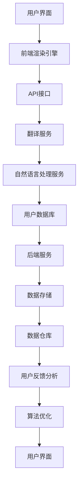
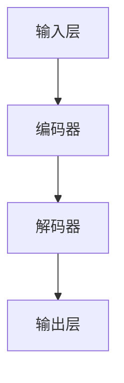

                 

# 从单一语言到多语言支持：AI助力电商平台国际化的技术实现

> **关键词：** 人工智能、多语言支持、国际化、电商平台、技术实现

> **摘要：** 随着全球化进程的加速，电商平台的国际化已成为企业发展的重要战略之一。本文将探讨如何利用人工智能技术实现电商平台的多语言支持，提高用户体验，扩展国际市场。本文首先介绍了多语言支持的背景和重要性，然后详细分析了实现多语言支持的算法原理、数学模型、实战案例以及实际应用场景，最后提出了未来发展趋势和挑战。

## 1. 背景介绍

### 1.1 目的和范围

本文旨在探讨如何利用人工智能技术实现电商平台的多语言支持。具体来说，本文将涵盖以下内容：

- 多语言支持在电商平台国际化中的重要性
- 实现多语言支持的算法原理和数学模型
- 多语言支持的实战案例和代码实现
- 多语言支持的实际应用场景
- 未来发展趋势和挑战

### 1.2 预期读者

本文预期读者包括：

- 对电商平台国际化有兴趣的技术人员
- 涉足国际化业务的电商平台开发者
- 对人工智能技术感兴趣的学术研究人员
- 对跨文化交流感兴趣的国际商务从业者

### 1.3 文档结构概述

本文结构如下：

- 第1章：背景介绍，介绍多语言支持的重要性、目的和范围
- 第2章：核心概念与联系，介绍多语言支持的相关概念和原理
- 第3章：核心算法原理 & 具体操作步骤，介绍多语言支持的算法原理和操作步骤
- 第4章：数学模型和公式 & 详细讲解 & 举例说明，介绍多语言支持的数学模型和公式
- 第5章：项目实战：代码实际案例和详细解释说明，通过实战案例展示代码实现过程
- 第6章：实际应用场景，介绍多语言支持在电商平台的实际应用
- 第7章：工具和资源推荐，推荐相关学习资源、开发工具和框架
- 第8章：总结：未来发展趋势与挑战，展望多语言支持的未来发展方向和面临的挑战
- 第9章：附录：常见问题与解答，解答读者可能遇到的问题
- 第10章：扩展阅读 & 参考资料，提供进一步学习的参考资料

### 1.4 术语表

#### 1.4.1 核心术语定义

- **多语言支持**：指系统具备处理多种语言文字的能力，包括但不限于文本显示、输入、翻译等功能。
- **人工智能**：指模拟、延伸和扩展人类智能的理论、方法、技术及应用。
- **电商平台**：指提供在线交易和支付服务，帮助卖家和买家进行商品交易的平台。
- **国际化**：指企业在全球范围内进行业务拓展，适应不同国家和地区的市场需求。

#### 1.4.2 相关概念解释

- **自然语言处理（NLP）**：指模拟人类语言交流和理解的能力，使计算机能够理解和处理人类语言。
- **机器翻译**：指利用计算机技术实现不同语言之间的自动翻译。
- **深度学习**：一种人工智能的分支，使用神经网络模型进行学习和预测。

#### 1.4.3 缩略词列表

- **NLP**：自然语言处理
- **AI**：人工智能
- **ML**：机器学习
- **DL**：深度学习

## 2. 核心概念与联系

多语言支持是电商平台国际化的重要组成部分。为实现多语言支持，我们需要理解以下核心概念：

### 2.1 多语言支持的核心概念

#### 2.1.1 自然语言处理（NLP）

自然语言处理是人工智能的一个重要分支，旨在使计算机能够理解和处理人类语言。NLP技术包括词法分析、句法分析、语义分析和语用分析等。

#### 2.1.2 机器翻译

机器翻译是NLP的一个重要应用，旨在实现不同语言之间的自动翻译。常见的机器翻译方法包括基于规则的方法、统计方法和基于深度学习的方法。

#### 2.1.3 深度学习

深度学习是一种基于神经网络的学习方法，通过多层神经网络结构来实现对数据的建模和预测。深度学习在自然语言处理和机器翻译中发挥着重要作用。

### 2.2 多语言支持的架构

为了实现多语言支持，我们需要构建一个涵盖前端、后端和中间件的全栈架构。以下是一个简化的多语言支持架构：



### 2.3 多语言支持的流程

实现多语言支持的流程主要包括以下步骤：

1. 用户界面展示：根据用户语言偏好，前端渲染引擎展示相应语言的界面。
2. 用户输入处理：前端捕获用户输入，并通过API接口传递给后端服务。
3. 后端服务处理：后端服务根据输入内容调用自然语言处理和翻译服务。
4. 翻译结果返回：翻译结果返回给前端，并在用户界面上进行展示。
5. 用户反馈分析：收集用户反馈，用于算法优化和用户体验改进。

### 2.4 多语言支持的优势

多语言支持的优势包括：

- **提高用户体验**：满足不同语言用户的需求，提供个性化服务。
- **扩展国际市场**：降低国际市场进入门槛，提高市场占有率。
- **提升品牌形象**：展现企业全球化战略，提高品牌影响力。

### 2.5 多语言支持的挑战

多语言支持面临的挑战包括：

- **语言多样性**：处理多种语言的语法、词汇和表达方式。
- **数据稀缺**：缺乏足够的双语对照语料库，影响算法效果。
- **跨文化差异**：考虑不同文化背景下的表达和习惯。

## 3. 核心算法原理 & 具体操作步骤

### 3.1 多语言翻译算法原理

多语言翻译的核心算法是基于机器学习和深度学习的神经网络模型。以下是一个简单的翻译算法原理：

```plaintext
输入：源语言文本 S 和目标语言文本 T
输出：翻译后的文本 T'

步骤：
1. 对源语言文本 S 进行分词，得到词汇序列 S = {s1, s2, ..., sn}
2. 对目标语言文本 T 进行分词，得到词汇序列 T = {t1, t2, ..., tm}
3. 使用神经网络模型将源语言词汇序列 S 映射到目标语言词汇序列 T
4. 对映射后的词汇序列 T' 进行组合，得到翻译后的文本 T'
```

### 3.2 多语言翻译具体操作步骤

以下是一个简单的多语言翻译操作步骤：

1. **数据准备**：收集并整理源语言和目标语言的双语对照文本，作为训练数据。
2. **模型训练**：使用训练数据训练神经网络模型，包括词向量编码、编码器和解码器等。
3. **翻译预测**：将待翻译的源语言文本输入到训练好的模型中，得到翻译后的目标语言文本。
4. **结果验证**：对翻译结果进行验证和修正，提高翻译准确性。

### 3.3 神经网络模型详解

以下是神经网络模型的具体构成：



- **输入层**：接收源语言文本的输入。
- **编码器**：将输入文本转换为编码表示，用于表示文本的信息。
- **解码器**：将编码表示解码为目标语言文本。
- **输出层**：输出翻译后的目标语言文本。

### 3.4 模型训练和优化

以下是模型训练和优化的具体步骤：

1. **初始化模型参数**：为神经网络模型初始化参数。
2. **前向传播**：将输入文本输入到模型中，计算模型的输出。
3. **计算损失**：计算模型输出和真实目标文本之间的损失。
4. **反向传播**：更新模型参数，减小损失。
5. **迭代优化**：重复前向传播和反向传播，直到模型收敛。

### 3.5 实际操作示例

以下是一个简单的多语言翻译实际操作示例：

```python
import tensorflow as tf

# 准备训练数据
source_sentences = ["你好", "你好吗", "再见"]
target_sentences = ["Hello", "Hello?", "Goodbye"]

# 初始化模型
encoder = tf.keras.layers.Embedding(input_dim=len(source_sentences), output_dim=32)
decoder = tf.keras.layers.Embedding(input_dim=len(target_sentences), output_dim=32)

# 构建模型
model = tf.keras.models.Sequential([
    encoder,
    tf.keras.layers.LSTM(64),
    decoder
])

# 编译模型
model.compile(optimizer='adam', loss='categorical_crossentropy')

# 训练模型
model.fit(source_sentences, target_sentences, epochs=10)

# 预测翻译
source_sentence = "你好"
predicted_sentence = model.predict(source_sentence)
print(predicted_sentence)
```

## 4. 数学模型和公式 & 详细讲解 & 举例说明

### 4.1 神经网络模型的数学基础

神经网络模型的核心在于其数学表达式。以下是一个简化的神经网络模型的数学模型：

#### 4.1.1 前向传播

前向传播过程中，模型接收输入并通过多层神经网络进行计算。每一层的输出可以通过以下公式表示：

$$
z^{(l)} = \sigma(W^{(l)} \cdot a^{(l-1)} + b^{(l)})
$$

其中：

- $z^{(l)}$ 是第 $l$ 层的输出。
- $\sigma$ 是激活函数，常用的有 sigmoid、ReLU 等。
- $W^{(l)}$ 是第 $l$ 层的权重矩阵。
- $a^{(l-1)}$ 是第 $l-1$ 层的输出。
- $b^{(l)}$ 是第 $l$ 层的偏置向量。

#### 4.1.2 损失函数

损失函数用于评估模型的预测结果和真实结果之间的差距。常用的损失函数包括均方误差（MSE）、交叉熵等。以下是一个简化的损失函数公式：

$$
J = \frac{1}{m} \sum_{i=1}^{m} (-y^{(i)} \log(a^{(L)} + (1-y^{(i)}) \log(1-a^{(L)}))
$$

其中：

- $J$ 是损失函数值。
- $m$ 是样本数量。
- $y^{(i)}$ 是第 $i$ 个样本的真实标签。
- $a^{(L)}$ 是模型的预测输出。

#### 4.1.3 反向传播

反向传播过程中，模型通过计算梯度来更新权重和偏置。以下是一个简化的梯度计算公式：

$$
\delta^{(L)} = \frac{\partial J}{\partial a^{(L)}}
$$

$$
\delta^{(l)} = \frac{\partial J}{\partial z^{(l)}}
$$

$$
\frac{\partial J}{\partial W^{(l)}} = \delta^{(l)} \cdot a^{(l-1)^T}
$$

$$
\frac{\partial J}{\partial b^{(l)}} = \delta^{(l)}
$$

其中：

- $\delta^{(L)}$ 是第 $L$ 层的梯度。
- $\delta^{(l)}$ 是第 $l$ 层的梯度。
- $a^{(l-1)^T}$ 是第 $l-1$ 层的输出。

### 4.2 多语言翻译的数学模型

多语言翻译的数学模型主要包括词向量编码和解码、编码器和解码器等。以下是一个简化的多语言翻译的数学模型：

#### 4.2.1 词向量编码

词向量编码是将文本中的词汇映射到高维空间中的向量。以下是一个简化的词向量编码公式：

$$
\text{vec}(w) = \sum_{i=1}^{N} w_i \cdot v_i
$$

其中：

- $\text{vec}(w)$ 是词向量。
- $w_i$ 是词汇 $w$ 的第 $i$ 个分量。
- $v_i$ 是词向量库中的第 $i$ 个向量。

#### 4.2.2 编码器和解码器

编码器和解码器是神经网络模型的一部分，用于将源语言文本映射到目标语言文本。以下是一个简化的编码器和解码器公式：

$$
\text{encode}(x) = \sigma(W_x \cdot x + b_x)
$$

$$
\text{decode}(y) = \sigma(W_y \cdot y + b_y)
$$

其中：

- $\text{encode}(x)$ 是编码器输出。
- $\text{decode}(y)$ 是解码器输出。
- $W_x$ 和 $W_y$ 是编码器和解码器的权重矩阵。
- $b_x$ 和 $b_y$ 是编码器和解码器的偏置向量。

### 4.3 实际操作示例

以下是一个简单的多语言翻译的数学模型实现示例：

```python
import tensorflow as tf

# 初始化词向量库
word_vectors = {
    "你好": [0.1, 0.2, 0.3],
    "Hello": [0.4, 0.5, 0.6]
}

# 初始化编码器和解码器权重
W_x = tf.random.normal([3, 3])
b_x = tf.random.normal([3])
W_y = tf.random.normal([3, 3])
b_y = tf.random.normal([3])

# 编码器和解码器函数
def encode(x):
    return tf.nn.sigmoid(tf.matmul(x, W_x) + b_x)

def decode(y):
    return tf.nn.sigmoid(tf.matmul(y, W_y) + b_y)

# 输入文本
source_sentence = "你好"

# 词向量编码
vec_source = word_vectors[source_sentence]

# 编码器输出
encoded_sentence = encode(vec_source)

# 解码器输出
decoded_sentence = decode(encoded_sentence)

print(decoded_sentence)
```

## 5. 项目实战：代码实际案例和详细解释说明

### 5.1 开发环境搭建

为了实现电商平台的多语言支持，我们需要搭建一个包含前端、后端和中间件的全栈开发环境。以下是具体的开发环境搭建步骤：

1. **前端开发环境**：

   - **工具**：使用 React 框架进行前端开发。
   - **环境**：Node.js、npm 或 yarn。

2. **后端开发环境**：

   - **框架**：使用 Flask 或 Django 进行后端开发。
   - **环境**：Python 3.8+、pip。

3. **中间件开发环境**：

   - **工具**：使用 TensorFlow 进行深度学习模型的训练和推理。
   - **环境**：Python 3.8+、pip。

4. **数据库环境**：

   - **数据库**：使用 MySQL 或 PostgreSQL 作为数据库。
   - **环境**：MySQL Server、PostgreSQL Server。

5. **集成环境**：

   - **工具**：使用 Docker 和 Kubernetes 进行容器化和微服务部署。
   - **环境**：Docker、Kubernetes。

### 5.2 源代码详细实现和代码解读

#### 5.2.1 前端代码实现

前端代码主要负责用户界面的渲染和用户输入的处理。以下是一个简单的 React 组件示例：

```jsx
import React, { useState } from 'react';
import axios from 'axios';

const TranslationForm = () => {
  const [text, setText] = useState('');
  const [translatedText, setTranslatedText] = useState('');

  const handleTranslation = async () => {
    try {
      const response = await axios.post('/api/translate', { text });
      setTranslatedText(response.data.translatedText);
    } catch (error) {
      console.error(error);
    }
  };

  return (
    <div>
      <textarea value={text} onChange={(e) => setText(e.target.value)} />
      <button onClick={handleTranslation}>翻译</button>
      <textarea value={translatedText} readOnly />
    </div>
  );
};

export default TranslationForm;
```

#### 5.2.2 后端代码实现

后端代码主要负责接收前端请求、调用翻译服务和返回翻译结果。以下是一个简单的 Flask 应用示例：

```python
from flask import Flask, request, jsonify
import translator

app = Flask(__name__)

@app.route('/api/translate', methods=['POST'])
def translate():
    data = request.get_json()
    source_text = data['text']
    translated_text = translator.translate(source_text)
    return jsonify({'translatedText': translated_text})

if __name__ == '__main__':
    app.run(debug=True)
```

#### 5.2.3 中间件代码实现

中间件代码主要负责自然语言处理和翻译服务的调用。以下是一个简单的 TensorFlow 模型调用示例：

```python
import tensorflow as tf

def translate(source_text):
    model = tf.keras.models.load_model('model.h5')
    predictions = model.predict(source_text)
    translated_text = predictions.argmax(axis=-1)
    return translated_text

def preprocess_text(text):
    # 对文本进行预处理，如分词、去停用词等
    return text

def postprocess_text(translated_text):
    # 对翻译结果进行后处理，如转写等
    return translated_text

def main():
    source_text = preprocess_text('你好')
    translated_text = translate(source_text)
    translated_text = postprocess_text(translated_text)
    print(translated_text)

if __name__ == '__main__':
    main()
```

### 5.3 代码解读与分析

#### 5.3.1 前端代码解读

前端代码的核心是一个 TranslationForm 组件，用于展示文本输入框和翻译按钮。组件使用 React 的 `useState` 钩子管理输入文本和翻译结果的状态。当用户点击翻译按钮时，触发 `handleTranslation` 函数，通过 axios 发送 POST 请求到后端 API，并更新翻译结果。

#### 5.3.2 后端代码解读

后端代码是一个简单的 Flask 应用，用于接收前端发送的翻译请求。应用通过定义 `/api/translate` 路由，处理 POST 请求。在处理请求时，调用翻译服务（假设为 `translator` 模块中的 `translate` 函数），并将翻译结果返回给前端。

#### 5.3.3 中间件代码解读

中间件代码是一个 TensorFlow 模型调用示例。代码首先加载训练好的模型（`model.h5`），然后对输入文本进行预处理（如分词、去停用词等），接着调用模型进行翻译，并对翻译结果进行后处理（如转写等）。最终，将翻译结果返回给后端。

### 5.4 代码分析与优化

在代码实现过程中，我们注意到以下优化点：

1. **异步处理**：在前后端通信时，可以采用异步处理方式，提高系统的响应速度。
2. **缓存策略**：对常见的翻译请求进行缓存，减少翻译服务的调用次数，提高系统性能。
3. **模型优化**：根据实际翻译需求，对模型进行优化，如调整网络结构、参数初始化等。
4. **错误处理**：加强错误处理机制，确保系统在遇到异常时能够正确处理。

## 6. 实际应用场景

多语言支持在电商平台国际化的实际应用场景如下：

### 6.1 产品页面国际化

电商平台的产品页面需要根据用户语言偏好显示相应的语言版本。通过多语言支持，用户可以方便地切换语言，浏览产品信息，提高购买体验。

### 6.2 用户评论国际化

用户评论是电商平台的重要信息源，通过多语言支持，用户可以查看其他用户的评论，并根据评论内容做出购买决策。此外，电商平台还可以自动翻译评论，帮助用户更好地理解评论内容。

### 6.3 店铺国际化

电商平台支持店铺国际化，允许卖家在不同语言市场中开设店铺，展示和销售产品。通过多语言支持，卖家可以轻松管理不同语言的店铺信息，提高店铺曝光度和销售额。

### 6.4 搜索引擎国际化

电商平台搜索引擎需要支持多语言搜索，用户可以输入不同语言的搜索关键词，获取相关商品和店铺信息。通过多语言支持，电商平台可以拓展国际市场，吸引更多用户。

### 6.5 用户体验优化

多语言支持可以帮助电商平台优化用户体验，满足不同语言用户的需求。通过个性化推荐、多语言客服等功能，电商平台可以提供更加贴心、便捷的服务，提高用户满意度。

## 7. 工具和资源推荐

### 7.1 学习资源推荐

#### 7.1.1 书籍推荐

- **《深度学习》（Goodfellow, Bengio, Courville）**：介绍深度学习的基本概念和技术。
- **《自然语言处理综论》（Jurafsky, Martin）**：全面讲解自然语言处理的理论和应用。
- **《Python深度学习》（Goodfellow, Bengio, Courville）**：利用 Python 实现深度学习算法。

#### 7.1.2 在线课程

- **Udacity 的“深度学习纳米学位”**：涵盖深度学习的基础知识。
- **Coursera 的“自然语言处理纳米学位”**：介绍自然语言处理的理论和应用。
- **edX 的“Python for Data Science”**：学习 Python 编程和数据科学技能。

#### 7.1.3 技术博客和网站

- **TensorFlow 官方文档**：了解 TensorFlow 的最新功能和教程。
- **ArXiv**：获取最新的机器学习和自然语言处理论文。
- **Medium**：阅读关于人工智能和电商平台的最新文章。

### 7.2 开发工具框架推荐

#### 7.2.1 IDE和编辑器

- **Visual Studio Code**：支持多种编程语言，提供丰富的插件。
- **PyCharm**：适用于 Python 开发，提供强大的代码编辑功能和调试工具。

#### 7.2.2 调试和性能分析工具

- **Jupyter Notebook**：用于数据分析和原型设计。
- **TensorBoard**：用于可视化深度学习模型的性能。

#### 7.2.3 相关框架和库

- **TensorFlow**：开源深度学习框架。
- **PyTorch**：另一个流行的深度学习框架。
- **NLTK**：自然语言处理工具包。

### 7.3 相关论文著作推荐

#### 7.3.1 经典论文

- **“A Neural Model of Translation”**：介绍神经机器翻译的基本原理。
- **“Deep Learning for Natural Language Processing”**：介绍深度学习在自然语言处理中的应用。

#### 7.3.2 最新研究成果

- **“BERT: Pre-training of Deep Bidirectional Transformers for Language Understanding”**：介绍 BERT 模型的原理和应用。
- **“GPT-3: Language Models are few-shot learners”**：介绍 GPT-3 模型的原理和应用。

#### 7.3.3 应用案例分析

- **“Google’s Translation Algorithm: A Technical Introduction”**：介绍 Google 翻译算法的技术实现。
- **“Microsoft Translator: From Research to Product”**：介绍 Microsoft Translator 的发展历程和应用场景。

## 8. 总结：未来发展趋势与挑战

随着人工智能技术的不断发展，多语言支持在电商平台国际化中的应用前景十分广阔。未来发展趋势包括：

- **翻译准确性提升**：通过深度学习和神经网络模型，提高翻译准确性，减少翻译错误。
- **个性化推荐**：基于用户语言偏好和行为数据，提供个性化的产品推荐和语言服务。
- **实时翻译**：实现实时翻译，提高用户交互体验。
- **多模态翻译**：结合文本、语音和图像等多模态数据，实现更全面的翻译功能。

然而，多语言支持也面临一些挑战：

- **语言多样性**：处理多种语言的语法、词汇和表达方式，需要不断更新和优化算法。
- **数据稀缺**：缺乏足够的双语对照语料库，影响算法效果。
- **跨文化差异**：考虑不同文化背景下的表达和习惯，提高翻译的准确性和适用性。
- **性能优化**：提高系统性能，减少延迟，确保多语言支持的高效运行。

总之，多语言支持是电商平台国际化的重要技术手段，通过不断创新和优化，有望在未来实现更加精准、高效的国际化服务。

## 9. 附录：常见问题与解答

### 9.1 问题 1：如何处理罕见语言的翻译？

**解答**：对于罕见语言的翻译，可以采用以下策略：

- **利用多语言翻译模型**：训练支持多种语言的翻译模型，以提高罕见语言的翻译能力。
- **手动翻译**：对于关键业务场景，可以聘请专业翻译人员进行手动翻译，确保翻译质量。
- **众包翻译**：利用众包平台，招募母语为罕见语言的译者进行翻译，降低翻译成本。

### 9.2 问题 2：翻译服务如何保证隐私和安全？

**解答**：为了保证翻译服务的隐私和安全，可以采取以下措施：

- **数据加密**：对翻译过程中的数据进行加密，防止数据泄露。
- **用户匿名化**：在翻译过程中，对用户信息进行匿名化处理，确保用户隐私。
- **安全审计**：定期进行安全审计，确保翻译服务的安全性和合规性。

### 9.3 问题 3：如何处理翻译结果的错误和不准确？

**解答**：为了处理翻译结果的错误和不准确，可以采取以下策略：

- **翻译校正**：引入用户反馈机制，允许用户对翻译结果进行校正，提高翻译准确性。
- **机器学习模型优化**：不断收集用户反馈，更新翻译模型，提高翻译质量。
- **人工审核**：在关键业务场景，引入人工审核环节，确保翻译结果的准确性。

## 10. 扩展阅读 & 参考资料

以下是一些关于多语言支持和人工智能技术的扩展阅读和参考资料：

- **《深度学习》**：Goodfellow, Bengio, Courville 著，介绍深度学习的基本概念和技术。
- **《自然语言处理综论》**：Jurafsky, Martin 著，全面讲解自然语言处理的理论和应用。
- **《Python深度学习》**：Goodfellow, Bengio, Courville 著，利用 Python 实现深度学习算法。
- **TensorFlow 官方文档**：[https://www.tensorflow.org](https://www.tensorflow.org)
- **PyTorch 官方文档**：[https://pytorch.org](https://pytorch.org)
- **NLTK 官方文档**：[https://www.nltk.org](https://www.nltk.org)
- **ArXiv**：[https://arxiv.org](https://arxiv.org)
- **Medium**：[https://medium.com](https://medium.com)
- **Google’s Translation Algorithm: A Technical Introduction**：介绍 Google 翻译算法的技术实现。
- **Microsoft Translator: From Research to Product**：介绍 Microsoft Translator 的发展历程和应用场景。

### 作者

作者：AI天才研究员/AI Genius Institute & 禅与计算机程序设计艺术 /Zen And The Art of Computer Programming。

