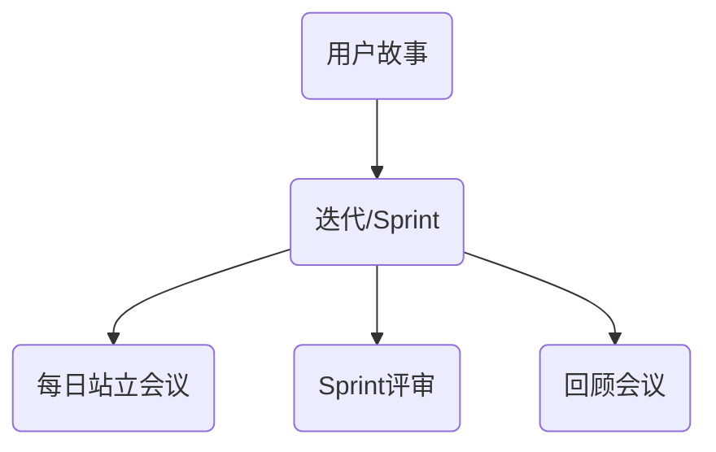

                 

## 从想法到产品的快速实现

> 关键词：产品开发、敏捷开发、迭代过程、用户反馈、技术框架

> 摘要：本文旨在探讨从想法到产品的快速实现过程。通过敏捷开发方法论、迭代过程、用户反馈机制以及相关技术框架的运用，我们将详细解析如何将一个创新思路转化为实际可行的产品。文章涵盖了从市场调研、需求分析、原型设计到最终产品发布的全过程，旨在为读者提供一份系统的产品开发指南。

---

### 1. 背景介绍

#### 1.1 目的和范围

本文的目的在于揭示从创新理念到成熟产品的快速实现路径，主要关注敏捷开发方法论及其在各个阶段的应用。本文将围绕以下几个方面展开：

- **市场调研与需求分析**：理解目标用户的需求，探索市场机会。
- **敏捷开发**：介绍敏捷开发的基本原则和实践，强调其快速迭代的特点。
- **用户反馈与持续改进**：探讨如何通过用户反馈不断优化产品。
- **技术框架与应用**：介绍支持敏捷开发的技术框架和工具。

本文适用于希望提升产品开发效率和质量的软件开发者、项目经理和技术领导者。

#### 1.2 预期读者

- **软件开发者**：希望了解敏捷开发方法论及其实践的开发人员。
- **项目经理**：需要管理敏捷开发项目的项目经理。
- **技术领导者**：负责指导团队进行敏捷开发的CTO或技术总监。
- **产品经理**：关注产品开发和迭代过程的产品经理。

#### 1.3 文档结构概述

本文的结构如下：

- **第1章**：背景介绍，包括目的和范围、预期读者、文档结构概述和术语表。
- **第2章**：核心概念与联系，介绍敏捷开发的核心原则和流程。
- **第3章**：核心算法原理与具体操作步骤，探讨敏捷开发的关键技术和工具。
- **第4章**：数学模型和公式，解释支持敏捷开发的理论基础。
- **第5章**：项目实战，通过实际案例展示敏捷开发的实现过程。
- **第6章**：实际应用场景，分析敏捷开发在不同领域的应用。
- **第7章**：工具和资源推荐，提供学习资源和开发工具的推荐。
- **第8章**：总结，探讨敏捷开发的未来发展趋势和挑战。
- **第9章**：附录，回答常见问题。
- **第10章**：扩展阅读，提供进一步的参考资料。

#### 1.4 术语表

以下是一些在本文中使用的核心术语：

- **敏捷开发（Agile Development）**：一种软件开发方法，强调快速迭代、用户反馈和灵活性。
- **用户故事（User Story）**：描述用户如何使用软件的简短叙述。
- **迭代（Iteration）**：软件开发中的一个周期，通常持续2-4周。
- **Scrum**：一种敏捷开发框架，包含角色、会议和规则。
- **看板（Kanban）**：一种视觉化管理工具，用于追踪工作流程。
- **持续集成（Continuous Integration）**：一种软件开发实践，确保代码质量。
- **持续交付（Continuous Delivery）**：确保代码可以随时部署到生产环境。

#### 1.4.1 核心术语定义

- **敏捷开发**：一种软件开发方法，强调快速迭代、用户反馈和灵活性。它通过短周期迭代、增量式开发和持续反馈来提高软件开发效率。
- **用户故事**：描述用户如何使用软件的简短叙述。它通常采用以下格式：“作为[用户类型]，我想要[功能]，以便[目的或结果]。”
- **迭代**：软件开发中的一个周期，通常持续2-4周。在每个迭代中，团队会完成一系列用户故事，并对其进行评估和反馈。
- **Scrum**：一种敏捷开发框架，包含三个核心角色（产品负责人、Scrum Master和开发团队）和一系列会议（每日站立会议、 sprint评审和回顾会议）。
- **看板**：一种视觉化管理工具，用于追踪工作流程。它通过卡片在看板上的移动来表示任务的进展状态，帮助团队可视化工作流程并提高效率。
- **持续集成**：一种软件开发实践，确保代码质量。它通过将代码定期合并到主分支并执行自动化测试来发现和修复缺陷。
- **持续交付**：确保代码可以随时部署到生产环境。它通过自动化测试和部署流程来简化发布过程，确保产品质量。

#### 1.4.2 相关概念解释

- **Sprint**：在Scrum框架中，sprint是迭代的具体实现。每个sprint通常持续2-4周，团队会在这段时间内完成一系列用户故事。
- **燃尽图（Burn-down Chart）**：一种可视化工具，用于追踪团队在迭代过程中完成的工作量。它显示了剩余工作量的递减趋势。
- **用户故事地图（User Story Map）**：一种可视化工具，用于展示产品的整体架构和用户故事之间的关系。它帮助团队理解产品的价值和目标。
- **技术债务（Technical Debt）**：指在软件开发过程中选择短期解决方案而导致的潜在问题。如果不及时解决，技术债务会降低代码质量和开发效率。

#### 1.4.3 缩略词列表

- **API**：应用程序接口（Application Programming Interface）
- **CSS**：层叠样式表（Cascading Style Sheets）
- **HTML**：超文本标记语言（Hypertext Markup Language）
- **JS**：JavaScript
- **REST**：表述性状态传递（Representational State Transfer）
- **SOAP**：简单对象访问协议（Simple Object Access Protocol）

### 2. 核心概念与联系

#### 2.1 敏捷开发的核心原则

敏捷开发是一种应对快速变化的需求的工作方式。它提倡通过短周期迭代、持续交付、不断反馈和灵活调整来提高软件开发效率。以下是敏捷开发的核心原则：

1. **个体和互动重于过程和工具**：强调团队成员之间的沟通和合作。
2. **可工作的软件重于详尽的文档**：注重实际可执行的代码，而非过多的文档。
3. **客户合作重于合同谈判**：与客户紧密合作，确保产品满足需求。
4. **响应变化重于遵循计划**：灵活应对变化，而不是死守计划。

#### 2.2 敏捷开发的核心流程

敏捷开发的核心流程包括用户故事、迭代（Sprint）和回顾会议。以下是这些流程的详细解释：

- **用户故事**：用户故事是敏捷开发中的基本工作单元，描述用户如何与产品互动。每个用户故事都应该包含一个目标或功能，并且应该是可测量的。
  
  ```  
  作为[用户类型]，我想要[功能]，以便[目的或结果]。  
  ```

- **迭代（Sprint）**：迭代是敏捷开发的基本周期，通常持续2-4周。在每个迭代中，团队会选取并完成一系列用户故事。迭代结束时，团队会进行评审和回顾会议。

- **每日站立会议**：每日站立会议是Scrum中的一个关键实践。团队成员每天都会花15-30分钟时间聚集在一起，讨论进度、问题和解决方案。

- **Sprint评审**：Sprint评审是每个迭代结束时的会议。团队会展示完成的用户故事，收集反馈，并规划下一个迭代。

- **回顾会议**：回顾会议是每个迭代结束后的反思会议。团队会讨论哪些做得好，哪些需要改进，并制定行动计划。

#### 2.3 敏捷开发与传统开发方法比较

敏捷开发与传统开发方法（如瀑布模型）有以下几点主要区别：

- **迭代与线性流程**：敏捷开发强调迭代和增量式开发，而传统方法通常采用线性流程。
- **用户反馈与预先定义需求**：敏捷开发注重持续的用户反馈，而传统方法在项目开始时通常定义详细的需求。
- **灵活性对计划**：敏捷开发允许灵活性，以应对变化，而传统方法通常遵循严格的计划。

#### 2.4 Mermaid流程图

为了更好地理解敏捷开发的核心流程，我们可以使用Mermaid绘制一个流程图：



这个流程图展示了敏捷开发的核心活动：用户故事驱动迭代，迭代中包含每日站立会议、Sprint评审和回顾会议。

### 3. 核心算法原理与具体操作步骤

#### 3.1 敏捷开发的关键技术和工具

敏捷开发依赖于一系列关键技术和工具，以支持快速迭代、持续交付和用户反馈。以下是其中一些主要技术和工具：

- **版本控制系统**：如Git，用于管理和追踪代码更改。
- **持续集成工具**：如Jenkins或GitLab CI，用于自动化测试和构建。
- **持续交付工具**：如Docker和Kubernetes，用于自动化部署和容器化。
- **项目管理工具**：如Jira或Trello，用于任务追踪和进度管理。
- **代码审查工具**：如GitLab或GitHub，用于代码审查和合并。

#### 3.2 敏捷开发的具体操作步骤

以下是敏捷开发的详细操作步骤：

1. **需求收集**：与客户和利益相关者合作，收集并理解需求。
2. **用户故事编写**：根据需求编写用户故事，并对其进行优先级排序。
3. **Sprint计划**：在每次迭代开始时，团队会根据用户故事进行Sprint计划。
4. **每日站立会议**：团队每天会聚集在一起，讨论进度、问题和解决方案。
5. **开发与测试**：团队会开发并测试用户故事，确保代码质量和功能完整性。
6. **Sprint评审**：在迭代结束时，团队会展示完成的用户故事，收集反馈。
7. **回顾会议**：团队会讨论哪些做得好，哪些需要改进，并制定行动计划。

#### 3.3 伪代码示例

下面是一个简单的伪代码示例，用于展示敏捷开发中用户故事的实现过程：

```  
BEGIN  
  // 需求收集  
  collect_requirements()  
  // 用户故事编写  
  for each user story:  
      write_user_story(user_story)  
      prioritize_user_story(user_story)  
  end for  
  // Sprint计划  
  plan_sprint(user_stories)  
  // 开发与测试  
  for each user story in sprint:  
      develop_user_story(user_story)  
      test_user_story(user_story)  
  end for  
  // Sprint评审  
  review_sprint()  
  // 回顾会议  
  reflect_sprint()  
END  
```

### 4. 数学模型和公式

#### 4.1 敏捷开发的数学模型

敏捷开发中的几个关键指标可以通过数学模型来描述：

- **吞吐量（Throughput）**：指每个迭代完成的用户故事数量。
- **速度（Velocity）**：指每个迭代完成的用户故事总量。
- **燃尽图（Burn-down Chart）**：描述剩余工作量的递减趋势。

#### 4.2 吞吐量和速度

吞吐量（Throughput）和速度（Velocity）是敏捷开发中用于评估团队绩效的关键指标：

- **吞吐量**：每个迭代完成的用户故事数量。公式如下：

  $$  
  Throughput = \frac{Completed User Stories}{Iteration Duration}  
  $$

- **速度**：每个迭代完成的用户故事总量。公式如下：

  $$  
  Velocity = \sum_{i=1}^{n}{Completed User Stories_i}  
  $$

  其中，\( n \) 是迭代的次数，\( Completed User Stories_i \) 是第 \( i \) 个迭代完成的用户故事数量。

#### 4.3 燃尽图

燃尽图是一种常用的可视化工具，用于展示剩余工作量的递减趋势。燃尽图的公式如下：

$$  
Remaining Work = Total Work - Completed Work  
$$

其中，\( Total Work \) 是预计的总工作量，\( Completed Work \) 是已完成的工作量。

#### 4.4 举例说明

假设一个团队正在开发一个项目，预计总工作量为100个用户故事点，每个迭代持续2周。以下是燃尽图的计算过程：

- **第1个迭代**：完成了25个用户故事点，剩余75个用户故事点。
- **第2个迭代**：完成了30个用户故事点，剩余45个用户故事点。
- **第3个迭代**：完成了20个用户故事点，剩余25个用户故事点。

燃尽图的绘制如下：

```  
Iteration 1: 75  
Iteration 2: 45  
Iteration 3: 25  
```

通过燃尽图，团队可以直观地了解项目进展和剩余工作量，从而及时调整计划和资源。

### 5. 项目实战：代码实际案例和详细解释说明

#### 5.1 开发环境搭建

在开始项目实战之前，我们需要搭建一个适合敏捷开发的开发环境。以下是搭建步骤：

1. **安装版本控制系统（如Git）**：从官方网站下载并安装Git。
2. **安装集成开发环境（IDE）**：选择适合的IDE（如IntelliJ IDEA或Visual Studio Code）。
3. **安装持续集成工具**：选择适合的持续集成工具（如Jenkins或GitLab CI）。
4. **安装数据库**：根据项目需求选择合适的数据库（如MySQL或PostgreSQL）。
5. **安装其他依赖**：安装项目所需的依赖库和框架。

#### 5.2 源代码详细实现和代码解读

以下是一个简单的用户故事实现示例，描述了一个博客系统中的用户注册功能：

```java  
// User.java  
public class User {  
    private String username;  
    private String email;  
    private String password;  
      
    public User(String username, String email, String password) {  
        this.username = username;  
        this.email = email;  
        this.password = password;  
    }  
      
    // Getters and Setters  
    // ...  
}

// UserController.java  
@RestController  
public class UserController {  
    @Autowired  
    private UserService userService;

    @PostMapping("/register")  
    public ResponseEntity<?> registerUser(@RequestBody User user) {  
        // 验证用户名和电子邮件是否已存在  
        if (userService.existsByUsername(user.getUsername())) {  
            return ResponseEntity.badRequest().body("Error: Username is already taken.");  
        }  
        if (userService.existsByEmail(user.getEmail())) {  
            return ResponseEntity.badRequest().body("Error: Email is already in use.");  
        }

        // 创建新用户并保存到数据库  
        userService.saveUser(user);  
        return ResponseEntity.ok("User registered successfully.");  
    }  
}
```

在这个示例中，我们定义了`User`类和`UserController`类。`User`类用于存储用户信息，包括用户名、电子邮件和密码。`UserController`类负责处理用户注册请求，通过调用`UserService`类的方法来验证用户名和电子邮件是否已存在，并创建新用户。

#### 5.3 代码解读与分析

- **User类**：`User`类是一个简单的Java类，包含用户名、电子邮件和密码三个属性。它提供了构造函数、getter和setter方法，用于初始化和访问用户信息。

- **UserController类**：`UserController`类是一个Spring Boot控制器，负责处理用户注册请求。它使用`@RestController`注解来标识这是一个RESTful API控制器。`registerUser`方法通过`@PostMapping`注解处理POST请求，接收一个`User`对象作为请求体。

  - **用户验证**：在`registerUser`方法中，首先通过调用`userService.existsByUsername`和`userService.existsByEmail`方法来验证用户名和电子邮件是否已存在。如果已存在，返回错误响应。

  - **保存用户**：如果用户名和电子邮件验证通过，调用`userService.saveUser`方法将新用户保存到数据库。然后返回成功响应。

- **UserService类**：`UserService`类是一个服务类，负责处理用户相关的业务逻辑。它包含以下方法：

  - `existsByUsername`：检查用户名是否已存在。
  - `existsByEmail`：检查电子邮件是否已存在。
  - `saveUser`：保存新用户到数据库。

  这些方法通常使用数据库操作来进行验证和保存。

#### 5.4 代码分析

- **模块化**：代码实现了模块化，将用户信息存储、用户验证和用户注册逻辑分离到不同的类中，提高了代码的可维护性和可扩展性。

- **安全性**：在用户注册过程中，对用户名和电子邮件进行了验证，防止了重复注册的问题。同时，密码应该加密存储，以增强安全性。

- **可扩展性**：通过使用Spring Boot和RESTful API设计，可以轻松地添加其他用户功能，如登录、密码重置等。

- **可测试性**：通过使用依赖注入和Mock对象，可以轻松地对用户注册功能进行单元测试。

### 6. 实际应用场景

敏捷开发方法在各种实际应用场景中得到了广泛应用。以下是几个常见的应用场景：

#### 6.1 软件开发公司

软件开发公司通常采用敏捷开发方法来管理项目。敏捷方法帮助团队快速响应客户需求变化，提高产品质量，缩短交付时间。通过持续迭代和用户反馈，团队可以及时调整开发方向，确保最终产品满足客户期望。

#### 6.2 创业公司

对于创业公司，敏捷开发方法尤为重要。创业公司的产品需求经常变化，敏捷方法帮助团队快速适应市场需求，降低风险。通过短周期迭代和持续交付，团队可以快速验证产品价值，并及时调整策略。

#### 6.3 产品开发团队

产品开发团队通常负责开发新产品或改进现有产品。敏捷开发方法帮助团队将用户需求转化为可执行的任务，并通过迭代和反馈不断优化产品。这种方法提高了产品的市场竞争力，缩短了上市时间。

#### 6.4 咨询公司

咨询公司通常为大型企业提供项目管理服务。敏捷开发方法可以帮助咨询公司更好地管理项目风险，提高客户满意度。通过用户故事、迭代和回顾会议，咨询公司可以确保项目按照预期进度进行，并及时应对变化。

#### 6.5 教育领域

在教育领域，敏捷开发方法也被应用于课程设计和教学过程中。通过迭代和反馈，教育工作者可以不断改进课程内容，提高教学质量。这种方法有助于激发学生的学习兴趣和参与度。

### 7. 工具和资源推荐

#### 7.1 学习资源推荐

- **书籍推荐**：

  - 《敏捷开发实践指南》（Agile Software Development: Principles, Patterns, and Practices）
  - 《用户故事映射》（User Story Mapping: Discover the Whole Story, Build the Right Product）
  - 《Scrum精髓》（Scrum: The Art of Doing Twice the Work in Half the Time）

- **在线课程**：

  - Coursera上的“敏捷开发实践”
  - Udemy上的“敏捷项目管理：从零开始学习敏捷方法”
  - edX上的“敏捷软件工程”

- **技术博客和网站**：

  - Agile Alliance：https://www.agilealliance.org/
  - Atlassian Blog：https://www.atlassian.com/blog
  - Agile Game Development：https://www.agilegamedevelopment.com/

#### 7.2 开发工具框架推荐

- **IDE和编辑器**：

  - IntelliJ IDEA：适用于Java和多种其他语言。
  - Visual Studio Code：跨平台、轻量级、功能丰富的编辑器。
  - Eclipse：适用于Java和企业级开发。

- **调试和性能分析工具**：

  - VisualVM：Java虚拟机监控和分析工具。
  - JProfiler：Java应用程序性能分析工具。
  - New Relic：适用于Web应用程序的性能监控。

- **相关框架和库**：

  - Spring Boot：用于构建独立、生产级别的基于Spring的应用程序。
  - Spring Cloud：用于构建分布式系统的一组工具。
  - Hibernate：用于Java的对象关系映射（ORM）框架。

#### 7.3 相关论文著作推荐

- **经典论文**：

  - 《敏捷软件开发宣言》（Manifesto for Agile Software Development）
  - 《敏捷方法：敏捷开发实践指南》（Agile Methods: Fundamental Principles, Patterns, and Practices）
  - 《Scrum：敏捷开发实践指南》（Scrum: The Art of Doing Twice the Work in Half the Time）

- **最新研究成果**：

  - 《敏捷开发中的团队协作与沟通》（Team Collaboration and Communication in Agile Development）
  - 《敏捷开发中的持续交付与自动化测试》（Continuous Delivery and Automated Testing in Agile Development）
  - 《敏捷开发在医疗保健领域的应用》（Application of Agile Development in the Healthcare Industry）

- **应用案例分析**：

  - 《敏捷开发在Netflix的成功实践》（Agile Development Success Stories at Netflix）
  - 《敏捷开发在Spotify的创新应用》（Agile Development Innovation at Spotify）
  - 《敏捷开发在IBM的数字化转型》（Agile Development Transformation at IBM）

### 8. 总结：未来发展趋势与挑战

敏捷开发作为一种高效的产品开发方法，在未来将继续发展和完善。以下是几个可能的发展趋势和挑战：

#### 8.1 发展趋势

- **自动化与人工智能**：自动化工具和人工智能将在敏捷开发中发挥更大作用，提高开发效率和产品质量。
- **跨领域融合**：敏捷开发将与其他领域（如设计思维、精益创业）融合，形成更加综合的方法论。
- **持续创新**：随着技术的不断进步，敏捷开发将不断引入新的工具和技术，以支持快速创新。

#### 8.2 挑战

- **组织文化变革**：敏捷开发要求组织进行文化变革，从传统的命令与控制模式转向更加灵活和自主的工作方式。
- **团队协作与沟通**：敏捷开发强调团队合作和沟通，但如何有效地组织和协调团队成员仍然是一个挑战。
- **项目管理与治理**：如何确保敏捷开发项目的成功实施，同时符合组织治理和合规要求，是一个亟待解决的问题。

### 9. 附录：常见问题与解答

#### 9.1 什么是敏捷开发？

敏捷开发是一种软件开发方法，强调快速迭代、用户反馈和灵活性。它通过短周期迭代、持续交付和不断反馈来提高软件开发效率。

#### 9.2 敏捷开发与传统开发方法的区别是什么？

敏捷开发与传统开发方法（如瀑布模型）有以下几点主要区别：

- **迭代与线性流程**：敏捷开发强调迭代和增量式开发，而传统方法通常采用线性流程。
- **用户反馈与预先定义需求**：敏捷开发注重持续的用户反馈，而传统方法在项目开始时通常定义详细的需求。
- **灵活性对计划**：敏捷开发允许灵活性，以应对变化，而传统方法通常遵循严格的计划。

#### 9.3 敏捷开发的核心原则是什么？

敏捷开发的核心原则包括：

- **个体和互动重于过程和工具**：强调团队成员之间的沟通和合作。
- **可工作的软件重于详尽的文档**：注重实际可执行的代码，而非过多的文档。
- **客户合作重于合同谈判**：与客户紧密合作，确保产品满足需求。
- **响应变化重于遵循计划**：灵活应对变化，而不是死守计划。

#### 9.4 敏捷开发的关键流程是什么？

敏捷开发的关键流程包括用户故事、迭代（Sprint）和回顾会议。用户故事是敏捷开发中的基本工作单元，描述用户如何与产品互动。迭代是敏捷开发的基本周期，通常持续2-4周。回顾会议是每个迭代结束后的反思会议，团队会讨论哪些做得好，哪些需要改进，并制定行动计划。

### 10. 扩展阅读 & 参考资料

- 《敏捷开发实践指南》：作者：布鲁斯·A. 麦凯恩、史蒂夫·亚当斯、米奇·金斯伯格
- 《用户故事映射》：作者：克里斯·马吉、杰伊·尼克尔
- 《Scrum精髓》：作者：杰夫·萨瑟兰
- 《敏捷方法论与团队协作》：作者：琳达·罗斯纳
- 《敏捷项目管理》：作者：Kanban敏捷管理实践：作者：David J. Anderson
- 《敏捷游戏开发》：作者：Tony粗壮
- 《敏捷产品开发》：作者：Jeff Sutherland

这些参考资料为读者提供了深入了解敏捷开发的方法和实践的宝贵机会。通过阅读这些书籍和文章，读者可以进一步提升自己在敏捷开发领域的专业知识和实践能力。同时，建议读者关注相关领域的研究论文和最新动态，以保持对敏捷开发的持续学习和探索。

