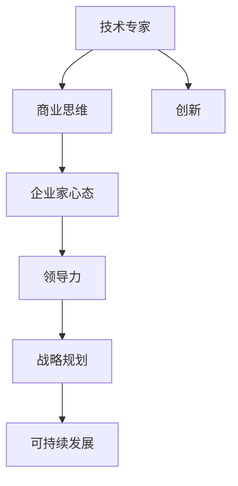

                 

# 从技术专家到企业家的心态转变

## 关键词：技术专家，企业家，心态转变，商业思维，领导力，战略规划，创新，可持续发展

> 本文旨在探讨从技术专家向企业家转变过程中，所需的心态转变及商业思维的培养。通过逻辑清晰、结构紧凑的分析，帮助读者理解这一转变的重要性和实际操作步骤，以期为IT领域的专业人士提供有价值的参考。

## 1. 背景介绍

### 1.1 目的和范围

本文的目标是帮助技术专家理解并实现从技术角色到企业家的转变。我们将探讨在这一过程中，所需的心态调整、商业思维的培养以及领导力的提升。本文将涵盖以下几个方面：

- 技术专家与企业家角色的区别
- 商业思维的核心要素
- 企业家心态的培养
- 领导力在企业家成功中的关键作用
- 战略规划和可持续发展的必要性

### 1.2 预期读者

本文适合以下读者群体：

- 有志于从技术专家转向企业家的IT专业人士
- 担任技术领导角色的IT从业者
- 对创业和企业管理有浓厚兴趣的技术爱好者

### 1.3 文档结构概述

本文结构如下：

- **背景介绍**：阐述本文的目的、预期读者和文档结构。
- **核心概念与联系**：介绍从技术专家到企业家转变的核心概念，并通过Mermaid流程图展示其关联。
- **核心算法原理 & 具体操作步骤**：讲解企业家心态培养的步骤和方法。
- **数学模型和公式 & 详细讲解 & 举例说明**：利用数学模型和公式，解释企业家决策过程中的关键因素。
- **项目实战：代码实际案例和详细解释说明**：通过实战案例展示从技术专家到企业家的具体操作。
- **实际应用场景**：探讨企业家心态和商业思维在不同环境中的应用。
- **工具和资源推荐**：推荐学习和实践所需的工具和资源。
- **总结：未来发展趋势与挑战**：总结企业家心态转变的重要性，并展望未来的发展趋势与挑战。
- **附录：常见问题与解答**：解答读者可能遇到的常见问题。
- **扩展阅读 & 参考资料**：提供进一步阅读的建议和参考资料。

### 1.4 术语表

#### 1.4.1 核心术语定义

- **技术专家**：在特定技术领域拥有丰富知识和实践经验的专业人士。
- **企业家**：具有创新精神和商业头脑，能够识别和抓住市场机会，通过创业活动创造价值的人。
- **商业思维**：一种思考模式，涉及市场分析、商业模式构建、财务管理和市场营销等商业活动的理解。
- **领导力**：激励、指导和影响他人实现共同目标的能力。
- **战略规划**：长期目标的制定和实现过程，涉及资源分配、市场定位和竞争策略等。

#### 1.4.2 相关概念解释

- **心态转变**：从一种思维模式向另一种思维模式的转变，涉及认知、情感和行为的变化。
- **可持续性**：满足当前需求而不损害后代满足自身需求的能力。

#### 1.4.3 缩略词列表

- **IT**：信息技术（Information Technology）
- **IDE**：集成开发环境（Integrated Development Environment）
- **IoT**：物联网（Internet of Things）

## 2. 核心概念与联系

在探讨从技术专家到企业家转变的过程中，我们需要明确几个核心概念，并理解它们之间的联系。以下是一个简化的Mermaid流程图，用于展示这些核心概念及其相互关系。

### 2.1 技术专家与商业思维的转换

技术专家通常专注于解决技术问题，而企业家则需要具备商业思维，这包括市场分析、商业模式构建、财务管理和市场营销等。商业思维不仅关注技术实现，更关注技术如何转化为商业价值。技术专家需要逐步培养这种跨领域的思维方式。

### 2.2 企业家心态的培养

企业家心态是一种敢于冒险、持续学习和敢于承担责任的思维方式。它要求技术专家摆脱固有的思维定势，勇敢面对不确定性，勇于尝试新事物。

### 2.3 领导力的重要性

领导力在企业家成功中扮演着关键角色。企业家需要能够激励团队成员、建立团队文化和处理复杂的人际关系。领导力不仅涉及个人品质，还包括战略规划和决策能力。

### 2.4 战略规划与可持续发展

战略规划是企业家成功的关键。它涉及长期目标的制定和实现，包括市场定位、资源分配和竞争策略。可持续发展是企业家必须考虑的另一个重要因素，它关乎企业的长期成功和社

