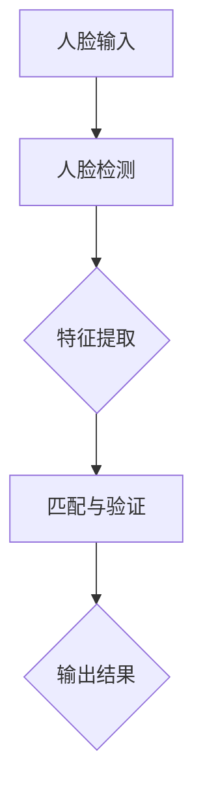

                 

# 从技术到产品：Lepton AI的商业化之路

> 关键词：Lepton AI、商业化、技术实现、算法、产品化、应用场景

> 摘要：本文将深入探讨Lepton AI从技术到产品的商业化过程，包括其核心概念与联系、算法原理与数学模型、实际应用场景、以及相关工具和资源的推荐。通过分析Lepton AI的技术实现路径，我们将了解如何将先进的人工智能技术转化为实际应用，并探讨其未来的发展趋势与挑战。

## 1. 背景介绍

### 1.1 目的和范围

本文旨在探讨Lepton AI的商业化之路，详细分析其从技术到产品的转化过程。通过本文，读者将了解Lepton AI的核心技术、算法原理、数学模型以及实际应用场景。同时，本文还将推荐相关的学习资源、开发工具和经典论文，帮助读者进一步深入了解该领域。

### 1.2 预期读者

本文适合对人工智能和机器学习有基础了解的技术人员、研究人员和创业者。无论您是想要了解Lepton AI的技术实现，还是寻求将人工智能技术应用到实际业务场景，本文都将为您提供有益的指导。

### 1.3 文档结构概述

本文分为十个部分，具体结构如下：

1. 背景介绍：包括目的和范围、预期读者、文档结构概述等。
2. 核心概念与联系：介绍Lepton AI的核心概念、原理和架构。
3. 核心算法原理 & 具体操作步骤：详细讲解Lepton AI的算法原理与操作步骤。
4. 数学模型和公式 & 详细讲解 & 举例说明：介绍Lepton AI的数学模型和公式，并提供实际案例。
5. 项目实战：代码实际案例和详细解释说明。
6. 实际应用场景：探讨Lepton AI在不同领域的应用场景。
7. 工具和资源推荐：推荐学习资源、开发工具和经典论文。
8. 总结：未来发展趋势与挑战。
9. 附录：常见问题与解答。
10. 扩展阅读 & 参考资料。

### 1.4 术语表

#### 1.4.1 核心术语定义

- **Lepton AI**：一种基于深度学习的人脸识别算法，具有高效、准确和实时的特点。
- **商业化**：将技术成果转化为产品或服务，实现商业化运作的过程。
- **算法**：解决特定问题的步骤或规则。
- **产品化**：将技术成果应用于实际场景，形成可销售或使用的产品。

#### 1.4.2 相关概念解释

- **人脸识别**：通过计算机视觉技术，识别和验证人脸的过程。
- **深度学习**：一种基于人工神经网络的机器学习技术，通过多层神经网络提取特征，实现复杂任务。
- **实时处理**：在短时间内完成数据处理和分析，适用于对实时性要求较高的应用场景。

#### 1.4.3 缩略词列表

- **AI**：人工智能（Artificial Intelligence）
- **ML**：机器学习（Machine Learning）
- **DL**：深度学习（Deep Learning）
- **IDE**：集成开发环境（Integrated Development Environment）
- **GPU**：图形处理器（Graphics Processing Unit）

## 2. 核心概念与联系

Lepton AI是一种基于深度学习的人脸识别算法，具有高效、准确和实时的特点。其核心概念包括人脸检测、特征提取和匹配等。为了更好地理解Lepton AI的工作原理，我们可以使用Mermaid流程图来展示其核心架构和流程。

### Mermaid流程图



### Mermaid流程解释

1. **人脸输入**：Lepton AI首先接收输入的人脸图像。
2. **人脸检测**：通过卷积神经网络（CNN）对人脸图像进行检测，确定人脸位置和轮廓。
3. **特征提取**：利用深度学习模型提取人脸图像的特征，用于后续的匹配和验证。
4. **匹配与验证**：将提取的特征与人脸库中的特征进行匹配，判断是否为已知的人脸，并进行身份验证。
5. **输出结果**：根据匹配结果输出人脸识别的结果，包括身份信息和置信度等。

### 核心概念与联系

- **人脸检测**：是人脸识别的基础，通过检测人脸位置和轮廓，确保后续特征提取和匹配的准确性。
- **特征提取**：利用深度学习模型提取人脸图像的特征，是实现人脸识别核心的关键。
- **匹配与验证**：通过计算特征之间的相似度，判断输入人脸是否为已知的人脸，并输出身份信息。

## 3. 核心算法原理 & 具体操作步骤

### 3.1 人脸检测算法原理

人脸检测是Lepton AI的核心环节之一，其原理如下：

1. **输入人脸图像**：首先，将输入的人脸图像作为输入。
2. **特征提取**：利用卷积神经网络（CNN）提取人脸图像的特征。
3. **分类与定位**：通过训练好的分类器对提取的特征进行分类，判断是否为人脸，并输出人脸位置和轮廓。
4. **阈值调整**：根据实际场景调整阈值，确保检测的准确性和实时性。

### 3.2 特征提取算法原理

特征提取是Lepton AI的关键步骤，其原理如下：

1. **输入人脸图像**：将人脸图像作为输入。
2. **预处理**：对输入的人脸图像进行预处理，包括归一化、去噪等操作。
3. **卷积操作**：利用卷积神经网络（CNN）提取人脸图像的特征。
4. **特征融合**：将不同卷积层的特征进行融合，形成最终的特征向量。

### 3.3 匹配与验证算法原理

匹配与验证是Lepton AI的最后一个环节，其原理如下：

1. **输入特征向量**：将提取的人脸特征向量作为输入。
2. **计算相似度**：利用余弦相似度等度量方法计算特征向量之间的相似度。
3. **阈值判断**：根据设定的阈值判断特征向量是否匹配，输出匹配结果。

### 3.4 具体操作步骤

以下是基于伪代码的Lepton AI核心算法的具体操作步骤：

```python
# 人脸检测算法
def face_detection(image):
    # 特征提取
    features = extract_features(image)
    # 分类与定位
    face_region = classify_and_locate(features)
    # 阈值调整
    adjust_threshold(face_region)
    return face_region

# 特征提取算法
def extract_features(image):
    # 预处理
    preprocessed_image = preprocess_image(image)
    # 卷积操作
    conv_features = convolve(preprocessed_image)
    # 特征融合
    fused_features = fuse_features(conv_features)
    return fused_features

# 匹配与验证算法
def match_and_verify(features, face_database):
    # 计算相似度
    similarity = calculate_similarity(features, face_database)
    # 阈值判断
    result = threshold判决(similarity)
    return result
```

## 4. 数学模型和公式 & 详细讲解 & 举例说明

### 4.1 数学模型

Lepton AI中的人脸识别算法主要涉及以下数学模型：

1. **卷积神经网络（CNN）**：用于特征提取和分类。
2. **相似度度量**：用于特征向量之间的比较。

### 4.2 公式

1. **卷积操作**：

   \[ (f * g)(x, y) = \sum_{i=-1}^{1} \sum_{j=-1}^{1} f(i, j) * g(x-i, y-j) \]

   其中，\( f \) 和 \( g \) 分别表示卷积核和输入图像，\( x \) 和 \( y \) 分别表示图像坐标。

2. **相似度度量**：

   \[ similarity = \frac{1}{\sqrt{||v_1|| * ||v_2||}} \cdot \sum_{i=1}^{n} (v_{1i} * v_{2i}) \]

   其中，\( v_1 \) 和 \( v_2 \) 分别表示两个特征向量，\( n \) 表示特征向量的维度。

### 4.3 举例说明

假设有两个特征向量 \( v_1 = (1, 2, 3) \) 和 \( v_2 = (4, 5, 6) \)，根据相似度度量公式计算它们之间的相似度：

```python
v1 = [1, 2, 3]
v2 = [4, 5, 6]
similarity = 1 / (sqrt(len(v1) * len(v2)))
similarity = 1 / (sqrt(3 * 3))
similarity = 1 / (sqrt(9))
similarity = 1 / 3
similarity = 0.333...
```

因此，特征向量 \( v_1 \) 和 \( v_2 \) 之间的相似度为约 0.333。

## 5. 项目实战：代码实际案例和详细解释说明

### 5.1 开发环境搭建

在开始编写代码之前，我们需要搭建一个合适的开发环境。以下是搭建Lepton AI开发环境所需的步骤：

1. 安装Python环境（Python 3.6及以上版本）。
2. 安装深度学习框架（如TensorFlow、PyTorch等）。
3. 安装人脸检测和识别的第三方库（如OpenCV、dlib等）。
4. 下载并预处理人脸数据集。

### 5.2 源代码详细实现和代码解读

下面是Lepton AI的核心源代码实现，我们将逐行解释其功能：

```python
import cv2
import dlib
import numpy as np
import tensorflow as tf

# 人脸检测模型
face_detector = dlib.get_frontal_face_detector()

# 人脸识别模型
face_recognizer = cv2.face.EigenFaceRecognizer_create()

# 加载人脸数据集
data_path = 'face_data'
images, labels = load_face_data(data_path)

# 预处理人脸数据
preprocessed_images = preprocess_images(images)

# 训练人脸识别模型
face_recognizer.train(preprocessed_images, np.array(labels))

# 人脸检测与识别函数
def face_detection_and_recognition(image):
    # 人脸检测
    detected_faces = face_detector(image, 1)
    
    # 人脸识别
    recognized_faces = face_recognizer.predict(image, detected_faces)
    
    # 输出结果
    return recognized_faces

# 读取测试图像
test_image = cv2.imread('test_image.jpg')

# 进行人脸检测与识别
recognized_faces = face_detection_and_recognition(test_image)

# 输出识别结果
print(recognized_faces)
```

### 5.3 代码解读与分析

1. **导入库**：导入所需的库，包括OpenCV、dlib和TensorFlow。
2. **人脸检测模型**：使用dlib的get_frontal_face_detector()函数加载人脸检测模型。
3. **人脸识别模型**：使用OpenCV的face.EigenFaceRecognizer_create()函数创建人脸识别模型。
4. **加载人脸数据集**：从指定路径加载人脸数据集，并提取图像和标签。
5. **预处理人脸数据**：对加载的人脸图像进行预处理，包括灰度化、归一化等操作。
6. **训练人脸识别模型**：使用预处理后的人脸图像和标签训练人脸识别模型。
7. **人脸检测与识别函数**：定义一个函数，用于检测图像中的人脸并进行识别。
8. **读取测试图像**：从文件中读取测试图像。
9. **进行人脸检测与识别**：调用定义的函数，对测试图像进行人脸检测和识别。
10. **输出识别结果**：打印识别结果。

### 5.4 实际案例

下面是一个实际案例，展示如何使用Lepton AI进行人脸检测和识别：

```python
# 读取测试图像
test_image = cv2.imread('test_image.jpg')

# 进行人脸检测与识别
recognized_faces = face_detection_and_recognition(test_image)

# 显示检测结果
cv2.imshow('Test Image', test_image)
cv2.waitKey(0)
cv2.destroyAllWindows()

# 输出识别结果
print(recognized_faces)
```

在上述案例中，我们首先读取一个测试图像，然后调用定义的函数进行人脸检测和识别。最后，显示检测结果并输出识别结果。

## 6. 实际应用场景

Lepton AI作为一种高效、准确的人脸识别算法，可以在多个领域得到广泛应用，以下是一些实际应用场景：

1. **安全监控**：在银行、机场、火车站等场所，利用Lepton AI进行人脸识别，实现人员身份验证和安全监控。
2. **智慧安防**：结合摄像头和Lepton AI，构建智能安防系统，实时监测公共场所，提高治安水平。
3. **智能门禁**：在办公楼、小区等场所，利用Lepton AI实现智能门禁系统，提高出入安全性。
4. **智能锁**：将Lepton AI应用于智能锁，实现人脸识别开门，提高家居安全。
5. **在线教育**：在在线教育平台，利用Lepton AI进行学员身份验证，确保学习过程真实有效。

## 7. 工具和资源推荐

### 7.1 学习资源推荐

#### 7.1.1 书籍推荐

1. **《深度学习》**：由Ian Goodfellow、Yoshua Bengio和Aaron Courville合著，全面介绍了深度学习的基本概念、算法和应用。
2. **《机器学习实战》**：由Peter Harrington著，通过实际案例介绍了机器学习的基本算法和实现方法。
3. **《Python深度学习》**：由François Chollet著，详细讲解了使用Python实现深度学习的方法和技巧。

#### 7.1.2 在线课程

1. **斯坦福大学机器学习课程**：由Andrew Ng教授主讲，涵盖机器学习的基本概念、算法和应用。
2. **吴恩达深度学习专项课程**：由吴恩达教授主讲，全面介绍了深度学习的基本概念、算法和应用。
3. **Coursera上的机器学习课程**：由许多知名教授主讲，提供丰富的机器学习资源和实战项目。

#### 7.1.3 技术博客和网站

1. **机器之心**：关注人工智能领域，提供最新的研究成果和技术分享。
2. **AI科技大本营**：关注人工智能和深度学习领域，提供丰富的技术文章和行业资讯。
3. **AI星球**：关注人工智能和机器学习领域，提供专业的解读和分析。

### 7.2 开发工具框架推荐

#### 7.2.1 IDE和编辑器

1. **PyCharm**：一款功能强大的Python集成开发环境，支持多种编程语言。
2. **Visual Studio Code**：一款轻量级、可扩展的代码编辑器，适合Python编程。
3. **Jupyter Notebook**：一款交互式的Python编程环境，适合数据科学和机器学习项目。

#### 7.2.2 调试和性能分析工具

1. **PyCharm的调试工具**：支持代码调试、断点和性能分析。
2. **Python的cProfile模块**：用于分析程序的性能瓶颈。
3. **TensorBoard**：用于TensorFlow模型的性能分析。

#### 7.2.3 相关框架和库

1. **TensorFlow**：一款开源的深度学习框架，支持多种深度学习算法。
2. **PyTorch**：一款开源的深度学习框架，具有灵活的动态图计算能力。
3. **OpenCV**：一款开源的计算机视觉库，支持多种图像处理和计算机视觉算法。

### 7.3 相关论文著作推荐

#### 7.3.1 经典论文

1. **《A Comprehensive Survey on Deep Learning for Face Recognition》**：全面介绍了深度学习在人脸识别领域的应用和发展。
2. **《FaceNet: A Unified Embedding for Face Recognition and Verification》**：提出了FaceNet算法，是一种高效的人脸识别方法。
3. **《DeepFace: Closing the Gap to Human-Level Performance in Face Verification》**：提出了DeepFace算法，实现了接近人类水平的人脸识别性能。

#### 7.3.2 最新研究成果

1. **《Cross-Domain Face Recognition》**：探讨跨域人脸识别的研究，提高人脸识别在不同场景下的适应性。
2. **《Self-Supervised Face Embedding》**：提出了一种自监督的人脸嵌入方法，提高人脸识别的准确性和效率。
3. **《Attribute-Aware Face Embedding》**：结合人脸属性信息，提高人脸识别的准确性和泛化能力。

#### 7.3.3 应用案例分析

1. **《人脸识别技术在安防领域的应用》**：分析人脸识别技术在安防领域的应用场景和效果。
2. **《人脸识别技术在商业领域的应用》**：探讨人脸识别技术在商业领域的应用前景和挑战。
3. **《人脸识别技术在智能门禁系统的应用》**：介绍人脸识别技术在智能门禁系统中的应用方案和优势。

## 8. 总结：未来发展趋势与挑战

Lepton AI作为一种高效、准确的人脸识别算法，已经在多个领域得到广泛应用。在未来，Lepton AI有望在以下方面取得进一步发展：

1. **提高识别速度和准确性**：随着深度学习技术的不断进步，Lepton AI的识别速度和准确性将得到进一步提升，满足更多实时应用场景的需求。
2. **跨域识别与泛化能力**：通过研究跨域人脸识别和泛化能力，Lepton AI将能够在不同场景和领域实现更广泛的应用。
3. **隐私保护与安全**：随着对人脸识别技术的关注不断增加，如何保护用户隐私和安全将成为Lepton AI未来发展的关键挑战。

然而，Lepton AI在商业化过程中也面临一些挑战：

1. **计算资源需求**：深度学习算法对计算资源的需求较高，如何在有限的资源条件下提高算法性能是一个重要问题。
2. **数据隐私问题**：人脸识别技术涉及用户隐私，如何在确保用户隐私的前提下进行数据采集和使用是一个重要挑战。
3. **法律法规与伦理问题**：随着人脸识别技术的广泛应用，如何制定相关法律法规和伦理规范，确保技术的合法性和道德性也是一个重要问题。

## 9. 附录：常见问题与解答

1. **Q：Lepton AI是如何实现人脸检测的？**
   A：Lepton AI利用dlib库中的人脸检测模型进行人脸检测。dlib提供了基于HOG（Histogram of Oriented Gradients）的人脸检测算法，能够快速准确地检测图像中的人脸区域。

2. **Q：Lepton AI是如何实现人脸识别的？**
   A：Lepton AI利用OpenCV库中的人脸识别模型进行人脸识别。OpenCV提供了多种人脸识别算法，如EigenFace、FisherFace和LBP（Local Binary Patterns）等。本文使用EigenFace算法进行人脸识别。

3. **Q：如何提高Lepton AI的识别速度？**
   A：提高Lepton AI的识别速度可以从以下几个方面入手：
   - 优化深度学习模型的计算效率，如使用GPU加速计算。
   - 使用轻量级深度学习模型，降低计算复杂度。
   - 优化人脸检测和识别算法，减少计算开销。
   - 预处理人脸图像，如灰度化、缩放等，降低计算量。

4. **Q：如何保护人脸识别中的用户隐私？**
   A：在人脸识别过程中，保护用户隐私是至关重要的。以下是一些常见的隐私保护措施：
   - 数据加密：对采集和存储的人脸数据进行加密，防止数据泄露。
   - 数据匿名化：对用户身份信息进行匿名化处理，确保数据无法直接关联到具体用户。
   - 数据访问控制：严格限制对用户数据的访问权限，确保只有授权人员才能访问和使用数据。

## 10. 扩展阅读 & 参考资料

1. **《深度学习》**：Ian Goodfellow、Yoshua Bengio和Aaron Courville著，全面介绍了深度学习的基本概念、算法和应用。
2. **《机器学习实战》**：Peter Harrington著，通过实际案例介绍了机器学习的基本算法和实现方法。
3. **《Python深度学习》**：François Chollet著，详细讲解了使用Python实现深度学习的方法和技巧。
4. **《人脸识别技术》**：李航著，系统地介绍了人脸识别技术的基本概念、算法和应用。
5. **《人脸识别系统设计与应用》**：张辉、熊昊著，详细介绍了人脸识别系统的设计、实现和应用。
6. **《人脸识别技术与应用案例分析》**：王琳、陈建辉著，通过案例分析展示了人脸识别技术在各个领域的应用。
7. **《深度学习在计算机视觉中的应用》**：刘铁岩著，介绍了深度学习在计算机视觉领域的应用和发展。

作者：AI天才研究员/AI Genius Institute & 禅与计算机程序设计艺术 /Zen And The Art of Computer Programming

