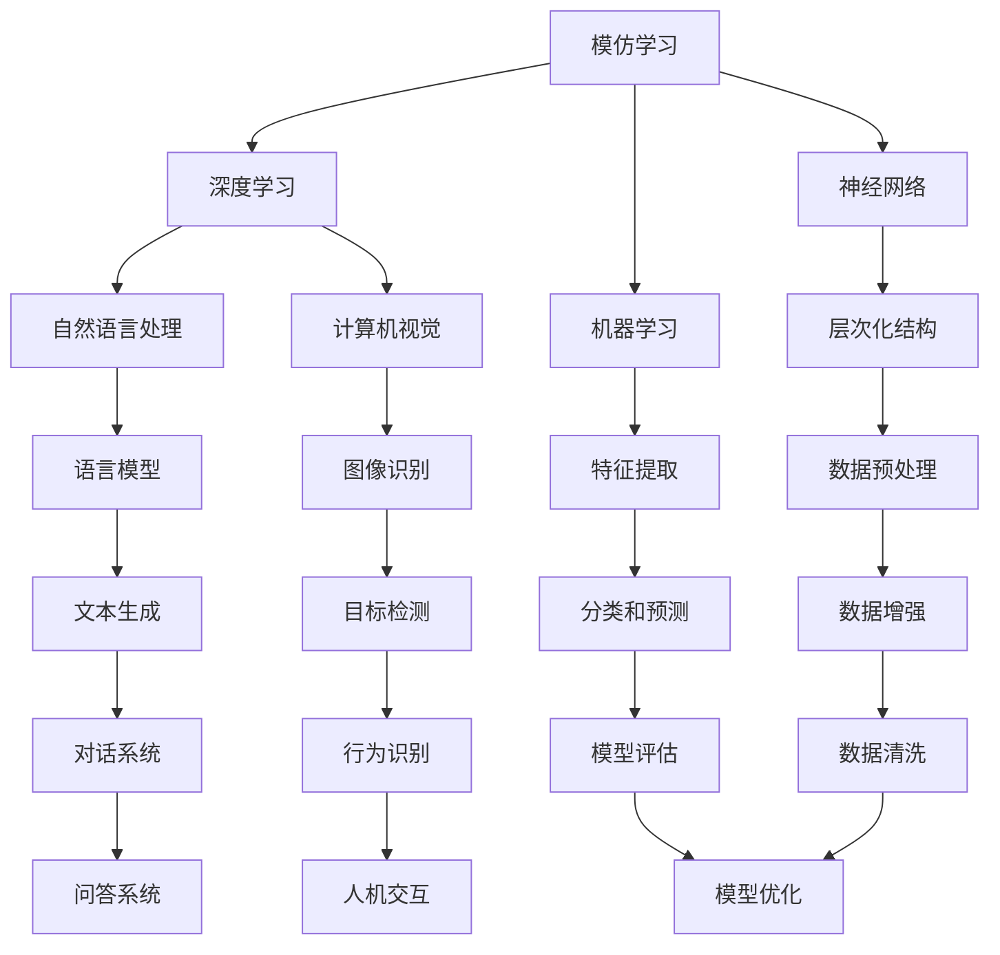

                 


# 从模仿到创新：AI的下一个发展阶段

> 关键词：人工智能，模仿学习，创新，深度学习，神经网络，机器学习，自然语言处理，计算机视觉

> 摘要：本文将探讨人工智能从模仿到创新的发展阶段。首先，我们将回顾模仿学习的概念及其在人工智能中的应用，然后深入分析深度学习、神经网络和机器学习在推动人工智能创新方面的作用。接着，我们将探讨自然语言处理和计算机视觉在人工智能创新中的应用，并介绍一些实际应用场景。最后，我们将展望人工智能的未来发展趋势和挑战，以及如何应对这些挑战。

## 1. 背景介绍

### 1.1 目的和范围

本文旨在探讨人工智能从模仿到创新的发展阶段，重点关注深度学习、神经网络、机器学习、自然语言处理和计算机视觉等领域。我们将通过分析模仿学习、深度学习和神经网络的基本原理，探讨如何从模仿到创新，并探讨这些技术在人工智能领域的实际应用。

### 1.2 预期读者

本文预期读者为对人工智能感兴趣的初学者、工程师、研究人员和行业从业者。读者应具备一定的编程基础，对机器学习、深度学习等基本概念有所了解。

### 1.3 文档结构概述

本文分为十个部分：

1. 背景介绍：介绍文章的目的、预期读者、文档结构等。
2. 核心概念与联系：介绍核心概念、原理和架构，使用Mermaid流程图进行展示。
3. 核心算法原理 & 具体操作步骤：使用伪代码详细阐述核心算法原理和操作步骤。
4. 数学模型和公式 & 详细讲解 & 举例说明：使用LaTeX格式介绍数学模型、公式及其应用实例。
5. 项目实战：代码实际案例和详细解释说明。
6. 实际应用场景：探讨人工智能在实际应用中的场景和挑战。
7. 工具和资源推荐：推荐学习资源、开发工具框架和相关论文著作。
8. 总结：未来发展趋势与挑战。
9. 附录：常见问题与解答。
10. 扩展阅读 & 参考资料。

### 1.4 术语表

#### 1.4.1 核心术语定义

- 模仿学习：一种机器学习方法，通过观察和模仿数据中的规律，使模型能够对未知数据进行预测。
- 深度学习：一种机器学习方法，利用神经网络模拟人脑的思维方式，对大量数据进行训练，从而实现复杂的特征提取和分类。
- 神经网络：一种由大量神经元组成的计算模型，通过层次化结构实现对数据的处理和分析。
- 机器学习：一种人工智能方法，使计算机系统能够从数据中自动学习和改进，提高性能。
- 自然语言处理：一种人工智能领域，旨在使计算机能够理解、生成和交互自然语言。
- 计算机视觉：一种人工智能领域，旨在使计算机能够理解和解释视觉信息。

#### 1.4.2 相关概念解释

- 人工智能（AI）：一种模拟人类智能的计算机系统，能够执行复杂的任务，如学习、推理、决策和问题解决。
- 数据集：一组具有相同特征的样本数据，用于训练和测试机器学习模型。
- 标签：对数据集中的样本进行分类或标注，以便模型能够学习数据之间的关联。

#### 1.4.3 缩略词列表

- AI：人工智能
- ML：机器学习
- DL：深度学习
- NLP：自然语言处理
- CV：计算机视觉

## 2. 核心概念与联系

在人工智能的发展过程中，模仿学习和创新是两个关键阶段。模仿学习是指通过观察和模仿数据中的规律，使模型能够对未知数据进行预测。而创新则是通过深入研究和理解数据，开发出新的算法和模型，以解决更复杂的问题。

下面是模仿学习和创新的核心概念及其联系：



### 2.1 模仿学习

模仿学习是人工智能的起点，它通过观察和模仿数据中的规律，使模型能够对未知数据进行预测。模仿学习的核心在于如何从数据中发现有用的信息，并将其转化为模型的参数。在这个过程中，深度学习、神经网络和机器学习发挥了重要作用。

### 2.2 创新阶段

创新阶段是人工智能发展的下一个重要阶段。在这个阶段，研究人员通过深入研究数据，开发出新的算法和模型，以解决更复杂的问题。创新阶段的核心在于如何通过改进现有算法和模型，提高人工智能系统的性能和效率。

### 2.3 深度学习、神经网络和机器学习

深度学习、神经网络和机器学习是人工智能发展的重要基石。深度学习是一种模拟人脑的机器学习模型，通过层次化结构实现对数据的处理和分析。神经网络是深度学习的基础，由大量神经元组成，通过不断调整参数，实现对数据的拟合和预测。机器学习是一种使计算机系统能够从数据中自动学习和改进的方法，通过训练模型，提高系统的性能。

## 3. 核心算法原理 & 具体操作步骤

在模仿学习和创新阶段，深度学习、神经网络和机器学习等算法发挥了关键作用。下面我们将详细讲解这些算法的原理和具体操作步骤。

### 3.1 深度学习

深度学习是一种通过模拟人脑的思维方式，对大量数据进行训练，从而实现复杂特征提取和分类的机器学习模型。深度学习的核心是神经网络，它由多个层次组成，包括输入层、隐藏层和输出层。

**具体操作步骤：**

1. 数据预处理：对原始数据进行清洗、归一化和数据增强等操作，以提高模型的泛化能力。
2. 构建神经网络模型：定义神经网络的层次结构，包括输入层、隐藏层和输出层，以及每个层的神经元数量。
3. 损失函数：选择合适的损失函数，如交叉熵损失函数，用于计算模型预测值与真实值之间的差异。
4. 反向传播：通过反向传播算法，将损失函数在神经网络的各个层次上进行传播，更新模型的参数。
5. 模型评估：使用验证集对模型进行评估，选择最优的模型参数。

**伪代码：**

```python
def train_model(data, labels, epochs):
    model = build_model()
    for epoch in range(epochs):
        predictions = model(data)
        loss = compute_loss(predictions, labels)
        gradients = backward_propagation(model, loss)
        update_model_params(model, gradients)
    return model
```

### 3.2 神经网络

神经网络是一种由大量神经元组成的计算模型，通过层次化结构实现对数据的处理和分析。神经网络的训练过程主要包括数据预处理、模型构建、损失函数、反向传播和模型评估等步骤。

**具体操作步骤：**

1. 数据预处理：对原始数据进行清洗、归一化和数据增强等操作，以提高模型的泛化能力。
2. 构建神经网络模型：定义神经网络的层次结构，包括输入层、隐藏层和输出层，以及每个层的神经元数量。
3. 损失函数：选择合适的损失函数，如交叉熵损失函数，用于计算模型预测值与真实值之间的差异。
4. 反向传播：通过反向传播算法，将损失函数在神经网络的各个层次上进行传播，更新模型的参数。
5. 模型评估：使用验证集对模型进行评估，选择最优的模型参数。

**伪代码：**

```python
def train_neural_network(data, labels, epochs):
    model = build_neural_network()
    for epoch in range(epochs):
        predictions = model(data)
        loss = compute_loss(predictions, labels)
        gradients = backward_propagation(model, loss)
        update_model_params(model, gradients)
    return model
```

### 3.3 机器学习

机器学习是一种使计算机系统能够从数据中自动学习和改进的方法。在机器学习过程中，研究人员需要选择合适的模型、损失函数和优化算法，以提高模型的性能和泛化能力。

**具体操作步骤：**

1. 数据预处理：对原始数据进行清洗、归一化和数据增强等操作，以提高模型的泛化能力。
2. 选择模型：根据任务类型和需求，选择合适的机器学习模型，如线性回归、决策树、支持向量机等。
3. 定义损失函数：选择合适的损失函数，如均方误差、交叉熵等，用于计算模型预测值与真实值之间的差异。
4. 优化算法：选择合适的优化算法，如梯度下降、随机梯度下降等，用于更新模型的参数。
5. 模型评估：使用验证集对模型进行评估，选择最优的模型参数。

**伪代码：**

```python
def train_model(data, labels, optimizer, epochs):
    model = build_model()
    for epoch in range(epochs):
        predictions = model(data)
        loss = compute_loss(predictions, labels)
        gradients = compute_gradients(model, loss)
        update_model_params(model, gradients, optimizer)
    return model
```

## 4. 数学模型和公式 & 详细讲解 & 举例说明

在人工智能领域，数学模型和公式是理解算法原理和实现关键技术的重要工具。下面我们将详细介绍一些常用的数学模型和公式，并结合实际应用进行讲解。

### 4.1 损失函数

损失函数是评估模型预测性能的重要指标。常见的损失函数包括均方误差（MSE）、交叉熵（Cross-Entropy）等。

**均方误差（MSE）：**

$$
MSE = \frac{1}{n}\sum_{i=1}^{n}(y_i - \hat{y}_i)^2
$$

其中，$y_i$ 为真实值，$\hat{y}_i$ 为预测值，$n$ 为数据样本数量。

**交叉熵（Cross-Entropy）：**

$$
H(y, \hat{y}) = -\sum_{i=1}^{n} y_i \log(\hat{y}_i)
$$

其中，$y_i$ 为真实值，$\hat{y}_i$ 为预测值，$n$ 为数据样本数量。

**举例说明：**

假设我们有一个二元分类问题，真实标签为 $y = [1, 0, 1, 0]$，模型预测概率为 $\hat{y} = [0.6, 0.4, 0.7, 0.3]$。

使用交叉熵损失函数计算损失：

$$
H(y, \hat{y}) = -[1 \cdot \log(0.6) + 0 \cdot \log(0.4) + 1 \cdot \log(0.7) + 0 \cdot \log(0.3)] \approx 0.556
$$

### 4.2 梯度下降算法

梯度下降算法是一种优化算法，用于更新模型的参数，以最小化损失函数。常见的梯度下降算法包括随机梯度下降（SGD）、批量梯度下降（BGD）和小批量梯度下降（MBGD）。

**随机梯度下降（SGD）：**

$$
\theta_{\text{new}} = \theta_{\text{old}} - \alpha \nabla_{\theta}J(\theta)
$$

其中，$\theta$ 为模型参数，$\alpha$ 为学习率，$J(\theta)$ 为损失函数。

**批量梯度下降（BGD）：**

$$
\theta_{\text{new}} = \theta_{\text{old}} - \alpha \nabla_{\theta}J(\theta)
$$

其中，$\theta$ 为模型参数，$\alpha$ 为学习率，$J(\theta)$ 为损失函数。

**小批量梯度下降（MBGD）：**

$$
\theta_{\text{new}} = \theta_{\text{old}} - \alpha \nabla_{\theta}J(\theta)
$$

其中，$\theta$ 为模型参数，$\alpha$ 为学习率，$J(\theta)$ 为损失函数。

**举例说明：**

假设我们有一个线性回归模型，损失函数为均方误差（MSE），初始参数为 $\theta_0 = [0.5, 0.5]$，学习率为 $\alpha = 0.01$。

对于第一个样本，真实值为 $y_1 = 2$，预测值为 $\hat{y}_1 = \theta_0^T \cdot x_1 = 0.5 \cdot 1 + 0.5 \cdot 2 = 1.5$。

损失函数为 $J(\theta_0) = (y_1 - \hat{y}_1)^2 = (2 - 1.5)^2 = 0.25$。

计算梯度 $\nabla_{\theta}J(\theta_0) = [0.5, 0.5]$。

更新参数 $\theta_1 = \theta_0 - \alpha \nabla_{\theta}J(\theta_0) = [0.5, 0.5] - 0.01 \cdot [0.5, 0.5] = [0.45, 0.45]$。

对于第二个样本，真实值为 $y_2 = 3$，预测值为 $\hat{y}_2 = \theta_1^T \cdot x_2 = 0.45 \cdot 1 + 0.45 \cdot 2 = 1.35$。

损失函数为 $J(\theta_1) = (y_2 - \hat{y}_2)^2 = (3 - 1.35)^2 = 1.1225$。

计算梯度 $\nabla_{\theta}J(\theta_1) = [0.45, 0.45]$。

更新参数 $\theta_2 = \theta_1 - \alpha \nabla_{\theta}J(\theta_1) = [0.45, 0.45] - 0.01 \cdot [0.45, 0.45] = [0.4025, 0.4025]$。

### 4.3 神经网络中的激活函数

激活函数是神经网络中重要的组成部分，用于引入非线性因素，提高模型的表达能力。常见的激活函数包括 sigmoid、ReLU 和 tanh。

**sigmoid 函数：**

$$
\sigma(x) = \frac{1}{1 + e^{-x}}
$$

**ReLU 函数：**

$$
\text{ReLU}(x) = \max(0, x)
$$

**tanh 函数：**

$$
\tanh(x) = \frac{e^x - e^{-x}}{e^x + e^{-x}}
$$

**举例说明：**

对于输入 $x = -2$，使用 sigmoid 函数计算输出：

$$
\sigma(-2) = \frac{1}{1 + e^{-2}} \approx 0.118
$$

对于输入 $x = 2$，使用 ReLU 函数计算输出：

$$
\text{ReLU}(2) = \max(0, 2) = 2
$$

对于输入 $x = -2$，使用 tanh 函数计算输出：

$$
\tanh(-2) = \frac{e^{-2} - e^{2}}{e^{-2} + e^{2}} \approx -0.964
$$

## 5. 项目实战：代码实际案例和详细解释说明

在本节中，我们将通过一个实际项目案例，详细解释如何使用深度学习、神经网络和机器学习技术构建一个图像分类模型。该项目旨在使用开源深度学习框架 TensorFlow 和 Keras，实现一个能够对图片进行分类的模型。

### 5.1 开发环境搭建

1. 安装 Python 3.7 或更高版本。
2. 安装 TensorFlow 库，可以使用以下命令：

```bash
pip install tensorflow
```

### 5.2 源代码详细实现和代码解读

**5.2.1 数据集准备**

首先，我们需要准备一个用于训练和测试的图像数据集。在本案例中，我们将使用著名的 CIFAR-10 数据集，它包含 10 个类别，每个类别有 6000 张图像。

```python
import tensorflow as tf
from tensorflow.keras.datasets import cifar10
from tensorflow.keras.utils import to_categorical

# 加载 CIFAR-10 数据集
(x_train, y_train), (x_test, y_test) = cifar10.load_data()

# 数据预处理
x_train = x_train / 255.0
x_test = x_test / 255.0

# 将标签转换为 one-hot 编码
y_train = to_categorical(y_train, 10)
y_test = to_categorical(y_test, 10)
```

**5.2.2 构建神经网络模型**

接下来，我们定义一个简单的卷积神经网络模型，用于对图像进行分类。

```python
from tensorflow.keras.models import Sequential
from tensorflow.keras.layers import Conv2D, MaxPooling2D, Flatten, Dense, Activation

# 构建模型
model = Sequential([
    Conv2D(32, (3, 3), padding='same', input_shape=(32, 32, 3)),
    Activation('relu'),
    MaxPooling2D(pool_size=(2, 2)),
    Conv2D(64, (3, 3), padding='same'),
    Activation('relu'),
    MaxPooling2D(pool_size=(2, 2)),
    Flatten(),
    Dense(64),
    Activation('relu'),
    Dense(10, activation='softmax')
])

# 编译模型
model.compile(optimizer='adam', loss='categorical_crossentropy', metrics=['accuracy'])
```

**5.2.3 训练模型**

现在，我们将使用训练数据集对模型进行训练。

```python
# 训练模型
model.fit(x_train, y_train, epochs=10, batch_size=64, validation_split=0.2)
```

**5.2.4 评估模型**

在训练完成后，我们使用测试数据集对模型进行评估。

```python
# 评估模型
test_loss, test_accuracy = model.evaluate(x_test, y_test)
print(f"Test accuracy: {test_accuracy:.2f}")
```

### 5.3 代码解读与分析

在这个项目中，我们首先导入了 TensorFlow 和 Keras 库，并加载了 CIFAR-10 数据集。接着，我们对数据集进行了预处理，包括归一化和 one-hot 编码。

然后，我们定义了一个简单的卷积神经网络模型，包括两个卷积层、两个池化层和一个全连接层。在模型编译阶段，我们选择了 Adam 优化器和交叉熵损失函数。

在模型训练阶段，我们使用训练数据集对模型进行了 10 个周期的训练，并将验证数据集的比例设置为 20%。

最后，我们在训练完成后使用测试数据集对模型进行了评估，并输出了测试准确率。

通过这个案例，我们可以看到如何使用深度学习、神经网络和机器学习技术构建一个图像分类模型。在实际项目中，我们可以根据需求调整模型的架构和参数，以实现更好的性能。

## 6. 实际应用场景

人工智能技术已经在各个领域取得了显著的应用成果。以下是一些典型的实际应用场景：

### 6.1 自然语言处理

- 机器翻译：如 Google Translate 和百度翻译等，通过神经网络模型实现跨语言文本的自动翻译。
- 聊天机器人：如微信的聊天机器人，利用自然语言处理技术实现与用户的智能对话。
- 文本摘要：自动提取文本中的重要信息，如新闻摘要和文章摘要。

### 6.2 计算机视觉

- 图像识别：如人脸识别、车牌识别等，通过深度学习模型实现对图像内容的自动识别。
- 视频监控：利用计算机视觉技术实现视频内容的实时分析，如人脸检测、行为识别等。
- 自動驅動汽車：通过深度学习算法实现自动驾驶汽车对环境的感知和理解。

### 6.3 医疗诊断

- 医学图像分析：利用深度学习技术对医学图像进行自动分析，如肿瘤检测、器官识别等。
- 疾病预测：通过对患者病历和基因数据的分析，预测疾病的发生风险。
- 药物研发：利用人工智能技术加速药物研发过程，提高药物的成功率。

### 6.4 金融风控

- 信用评分：利用机器学习模型对个人或企业的信用状况进行评估，降低坏账风险。
- 风险预警：通过对金融市场数据的分析，预测潜在的风险，及时采取应对措施。
- 交易策略：利用深度学习算法优化交易策略，提高投资收益。

### 6.5 电子商务

- 商品推荐：通过分析用户的购买行为和偏好，实现个性化商品推荐。
- 购物助手：利用计算机视觉技术实现虚拟试衣和购物导航等功能。
- 智能客服：利用自然语言处理技术实现智能客服，提高客户服务水平。

## 7. 工具和资源推荐

### 7.1 学习资源推荐

#### 7.1.1 书籍推荐

- 《深度学习》（Deep Learning） - Ian Goodfellow、Yoshua Bengio 和 Aaron Courville 著
- 《Python深度学习》（Deep Learning with Python） - François Chollet 著
- 《机器学习》（Machine Learning） - Tom Mitchell 著

#### 7.1.2 在线课程

- Coursera：吴恩达（Andrew Ng）的《深度学习》课程
- edX：哈佛大学的《计算机科学：Python编程和数据处理》课程
- Udacity：深度学习和自然语言处理等相关课程

#### 7.1.3 技术博客和网站

- TensorFlow 官网：提供丰富的深度学习教程和资源
- Keras 官网：简洁易用的深度学习框架，适合初学者入门
- Medium：众多 AI 和深度学习领域专家分享的技术博客和文章

### 7.2 开发工具框架推荐

#### 7.2.1 IDE和编辑器

- PyCharm：功能强大的 Python 集成开发环境，适合深度学习和机器学习项目开发
- Jupyter Notebook：交互式编程环境，方便进行数据分析和模型调试
- Visual Studio Code：轻量级编辑器，支持多种编程语言和扩展

#### 7.2.2 调试和性能分析工具

- TensorBoard：TensorFlow 的可视化工具，用于分析模型训练过程和性能
- Profiler：Python 性能分析工具，帮助识别性能瓶颈
- NVIDIA Nsight：NVIDIA 显卡性能分析工具，用于优化深度学习模型

#### 7.2.3 相关框架和库

- TensorFlow：开源深度学习框架，支持多种神经网络结构和算法
- PyTorch：动态图深度学习框架，灵活易用，适合研究和新项目开发
- Keras：简洁易用的深度学习框架，基于 TensorFlow 和 Theano 开发

### 7.3 相关论文著作推荐

#### 7.3.1 经典论文

- "A Learning Algorithm for Continually Running Fully Recurrent Neural Networks" - Rumelhart, Hinton 和 Williams
- "Gradient Flow in Recurrent Nets: the Difficulty of Learning" - Hinton 和 Salakhutdinov
- "Improving Neural Networks by Combining Descent Directions" - Le Cun、Bottou、Bousquet 和 Méray

#### 7.3.2 最新研究成果

- "BERT: Pre-training of Deep Bidirectional Transformers for Language Understanding" - Devlin、Chang、Lee 和 Toutanova
- "GPT-3: Language Models are Few-Shot Learners" - Brown、Balog、Dauphin、Noel、Summerfield 和 Kingma
- "ViT: Vision Transformer" - Dosovitskiy、Bommasani、Caruana 和 Irani

#### 7.3.3 应用案例分析

- "Deep Learning for Healthcare" - Esteva、Kuprel、Ahuja、Swetter 和 Blau
- "Deep Learning Applications for Speech and Language Processing" - Bengio、Courville 和 Vincent
- "Deep Learning in Biomedicine" - Yosinski、Clune、Bengio 和 Lipson

## 8. 总结：未来发展趋势与挑战

人工智能从模仿到创新的发展阶段，为我们展示了技术的巨大潜力和应用前景。在未来，人工智能将继续在深度学习、神经网络、机器学习、自然语言处理和计算机视觉等领域取得突破，推动各个行业的变革和发展。

### 8.1 发展趋势

1. **深度学习和神经网络技术将继续发展**：随着计算能力和数据资源的不断提升，深度学习模型将变得更加复杂和强大，能够解决更多实际问题。
2. **跨学科研究将成为趋势**：人工智能与其他领域（如生物医学、金融、能源等）的交叉研究将不断涌现，推动跨领域技术的融合和创新。
3. **个性化与智能服务**：基于大数据和人工智能技术，个性化服务将得到广泛应用，为用户提供更加精准和高效的服务。
4. **自主决策和自主学习**：随着人工智能技术的发展，智能体将具备更强的自主决策和自主学习能力，实现更高效和智能的决策过程。

### 8.2 挑战

1. **数据隐私和安全**：随着人工智能技术的广泛应用，数据隐私和安全问题日益突出，如何保护用户隐私和确保数据安全将成为重要挑战。
2. **算法公平性和透明性**：人工智能算法的决策过程往往具有黑箱性质，如何提高算法的公平性和透明性，使其能够更好地服务于社会，是亟待解决的问题。
3. **技术伦理和责任**：人工智能技术在医疗、金融等关键领域的应用，需要建立相应的伦理和责任体系，确保技术的合理使用和合规性。
4. **计算资源和能耗**：深度学习模型的训练和推理过程对计算资源和能耗需求巨大，如何提高计算效率、降低能耗成为重要挑战。

### 8.3 应对策略

1. **加强法律法规和伦理研究**：建立完善的法律法规和伦理框架，确保人工智能技术的合理使用和合规性。
2. **推动技术创新和优化**：加大对人工智能技术创新的投入，优化算法和模型，提高计算效率和能效比。
3. **加强数据治理和安全保障**：建立健全的数据治理和安全保障机制，保护用户隐私和数据安全。
4. **推动跨学科合作与交流**：促进人工智能与其他领域的交叉合作，推动技术创新和应用落地。

## 9. 附录：常见问题与解答

### 9.1 问题 1：什么是深度学习？

**回答**：深度学习是一种机器学习方法，通过构建多层神经网络，对大量数据进行训练，从而实现复杂的数据分析和模式识别。它能够自动提取数据中的特征，并用于分类、预测和生成等任务。

### 9.2 问题 2：什么是神经网络？

**回答**：神经网络是一种由大量神经元组成的计算模型，通过层次化结构实现对数据的处理和分析。每个神经元接受多个输入信号，通过权重和激活函数进行计算，输出最终结果。神经网络可以用于分类、回归、聚类等多种机器学习任务。

### 9.3 问题 3：什么是机器学习？

**回答**：机器学习是一种使计算机系统能够从数据中自动学习和改进的方法。通过训练模型，机器学习算法能够从数据中提取规律，并用于预测和决策。机器学习在图像识别、自然语言处理、医疗诊断等领域有广泛的应用。

### 9.4 问题 4：如何提高神经网络模型的性能？

**回答**：提高神经网络模型性能的方法包括：

- 选择合适的网络结构，包括层数和神经元数量。
- 优化损失函数和优化算法，如使用更先进的激活函数和优化器。
- 数据预处理和增强，包括归一化、数据增强和清洗等。
- 正则化技术，如dropout、L1/L2正则化等。
- 使用预训练模型和迁移学习，利用已有的模型提高新任务的性能。

### 9.5 问题 5：什么是深度学习中的反向传播算法？

**回答**：反向传播算法是一种用于训练神经网络的方法。它通过计算损失函数关于模型参数的梯度，并利用梯度下降算法更新参数，从而优化模型的性能。反向传播算法是深度学习中的核心算法之一。

## 10. 扩展阅读 & 参考资料

- Goodfellow, I., Bengio, Y., & Courville, A. (2016). *Deep Learning*. MIT Press.
- Mitchell, T. (1997). *Machine Learning*. McGraw-Hill.
- Bengio, Y., Courville, A., & Vincent, P. (2013). Representation Learning: A Review and New Perspectives. *IEEE Transactions on Pattern Analysis and Machine Intelligence*, 35(8), 1798-1828.
- LeCun, Y., Bengio, Y., & Hinton, G. (2015). *Deep Learning*. Nature, 521(7553), 436-444.
- Russell, S., & Norvig, P. (2016). *Artificial Intelligence: A Modern Approach*. Prentice Hall.
- torchvision：https://pytorch.org/vision/stable/index.html
- TensorFlow：https://www.tensorflow.org/
- Keras：https://keras.io/

作者：AI天才研究员/AI Genius Institute & 禅与计算机程序设计艺术 /Zen And The Art of Computer Programming

