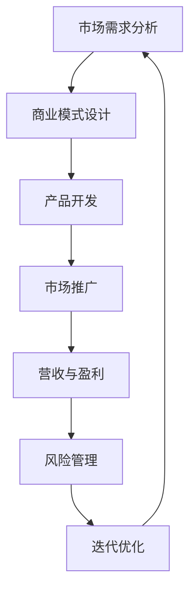

                 

### 从程序员到创业者：思维转变与能力提升

> **关键词：** 创业者，程序员，思维转变，能力提升，创业技能，个人成长

> **摘要：** 本文将探讨程序员如何成功转型为创业者，需要经历的思维转变和能力提升过程。我们将从核心概念入手，结合实际案例，详细阐述创业过程中的关键步骤和策略，帮助程序员更好地迎接创业挑战。

在科技飞速发展的今天，程序员这个职业已经逐渐成为大众关注的焦点。随着技术的不断进步，越来越多的程序员开始将自己的技能应用到创业领域，希望通过创业实现个人价值和商业成功。然而，从程序员到创业者的转变并非易事，这不仅仅是技能的转换，更是思维方式和能力的全面提升。本文将带领读者逐步了解这一转型过程，并提供实用的建议和策略。

## 1. 背景介绍

### 1.1 目的和范围

本文旨在帮助程序员了解从程序员到创业者的思维转变和能力提升过程。我们将探讨创业者所需的核心素质、关键技能以及创业过程中的挑战和机遇。通过本文的阅读，读者将能够：

- 明确创业的基本概念和核心要素。
- 理解从程序员到创业者的思维转变过程。
- 掌握提升创业能力的方法和策略。
- 获得在创业过程中实际应用的知识和经验。

### 1.2 预期读者

本文适合以下读者群体：

- 有志于创业的程序员和技术从业者。
- 已经开始创业但遇到困难的创业者。
- 想要了解创业过程和策略的企业家和投资人。
- 对创业有兴趣的学生和研究人员。

### 1.3 文档结构概述

本文将按照以下结构展开：

- **第1章：背景介绍**：介绍本文的目的、范围、预期读者以及文档结构。
- **第2章：核心概念与联系**：阐述创业过程中的核心概念和联系，包括市场需求分析、商业模式设计等。
- **第3章：核心算法原理 & 具体操作步骤**：讲解创业过程中的关键步骤，如市场调研、产品开发等。
- **第4章：数学模型和公式 & 详细讲解 & 举例说明**：介绍创业过程中可能用到的数学模型和公式。
- **第5章：项目实战：代码实际案例和详细解释说明**：通过实际案例展示创业项目的实施过程。
- **第6章：实际应用场景**：分析创业者在不同场景下的应用策略。
- **第7章：工具和资源推荐**：推荐学习资源和开发工具。
- **第8章：总结：未来发展趋势与挑战**：总结本文的核心观点，展望未来。
- **第9章：附录：常见问题与解答**：解答读者可能遇到的常见问题。
- **第10章：扩展阅读 & 参考资料**：提供更多的学习和阅读资源。

### 1.4 术语表

在本文中，我们将使用以下术语：

#### 1.4.1 核心术语定义

- **创业者**：指拥有创业精神，愿意承担风险并创办新企业的人。
- **程序员**：指从事编程工作，编写、测试和维护软件的专业人员。
- **商业模式**：指企业在特定市场环境下通过提供产品或服务实现盈利的方式。
- **市场调研**：指对目标市场进行研究和分析，了解市场需求和竞争态势。
- **产品开发**：指根据市场需求，设计和开发满足用户需求的产品。

#### 1.4.2 相关概念解释

- **创业精神**：指敢于冒险、勇于创新、积极进取的精神状态。
- **风险评估**：指对创业过程中可能遇到的风险进行识别、评估和管理。
- **迭代开发**：指在产品开发过程中，通过不断测试和反馈，逐步完善产品功能。

#### 1.4.3 缩略词列表

- **AI**：人工智能
- **ML**：机器学习
- **VC**：风险投资
- **ROI**：投资回报率

## 2. 核心概念与联系

创业是一个复杂而动态的过程，涉及多个核心概念和相互关联的环节。为了更好地理解创业过程，我们需要先掌握这些核心概念，并了解它们之间的联系。

下面是一个用于描述创业过程中核心概念和相互关系的 Mermaid 流程图：



### 2.1 市场需求分析

市场需求分析是创业过程中的第一步。它包括对目标市场的调研，了解用户需求、竞争态势和市场规模。通过市场需求分析，创业者可以明确自己的产品或服务定位，确定市场切入点。

### 2.2 商业模式设计

商业模式设计是创业过程中的关键环节。它涉及到如何通过提供产品或服务实现盈利。创业者需要设计一种可行的商业模式，明确收入来源、成本结构和利润模式。

### 2.3 产品开发

产品开发是创业过程中的核心环节。创业者需要根据市场需求，设计和开发满足用户需求的产品。在这一过程中，创业者需要掌握技术实现方案、产品设计、测试和迭代等技能。

### 2.4 市场推广

市场推广是创业过程中不可或缺的一环。创业者需要通过各种渠道，将产品或服务推广给目标用户。市场推广策略包括广告、社交媒体营销、公关活动等。

### 2.5 营收与盈利

营收与盈利是创业者的终极目标。通过有效的商业模式设计和市场推广，创业者可以实现持续的收入和盈利。创业者需要关注财务指标，如收入、成本、利润等，确保企业的财务状况健康。

### 2.6 风险管理

创业过程中充满风险。创业者需要识别、评估和管理各种风险，如市场风险、技术风险、财务风险等。通过有效的风险管理，创业者可以降低风险，提高创业成功率。

### 2.7 迭代优化

创业是一个不断迭代和优化的过程。创业者需要根据市场反馈和用户需求，不断改进产品和服务。迭代优化可以帮助创业者快速响应市场变化，提高产品竞争力。

通过上述核心概念和相互关系的理解，创业者可以更好地把握创业过程中的关键环节，提高创业成功率。在下一章节中，我们将详细讲解创业过程中的核心算法原理和具体操作步骤。

## 3. 核心算法原理 & 具体操作步骤

创业过程中的核心算法原理和具体操作步骤是确保创业成功的关键。以下是创业过程中几个关键环节的详细算法原理和具体操作步骤：

### 3.1 市场调研

**市场调研算法原理：**

市场调研的核心目标是了解目标市场的用户需求、竞争态势和市场规模。该算法主要包括以下步骤：

1. **定义目标市场**：明确目标用户群体，包括用户特征、需求和行为模式。
2. **数据收集**：通过问卷调查、访谈、用户反馈等方式收集用户数据。
3. **数据分析**：对收集到的数据进行分析，了解用户需求和市场趋势。
4. **生成报告**：整理分析结果，生成市场调研报告。

**具体操作步骤：**

1. **定义目标市场**：
   ```mermaid
   graph TD
   A[定义目标市场] --> B[确定用户特征]
   B --> C[了解用户需求]
   C --> D[分析行为模式]
   ```

2. **数据收集**：
   ```mermaid
   graph TD
   A[问卷调查] --> B[访谈]
   B --> C[用户反馈]
   C --> D[数据分析]
   ```

3. **数据分析**：
   ```mermaid
   graph TD
   A[数据整理] --> B[数据清洗]
   B --> C[统计分析]
   C --> D[生成报告]
   ```

### 3.2 产品开发

**产品开发算法原理：**

产品开发的核心目标是根据市场需求，设计和开发满足用户需求的产品。该算法主要包括以下步骤：

1. **需求分析**：收集用户需求，明确产品功能和技术实现方案。
2. **设计产品原型**：根据需求分析，设计产品原型。
3. **开发与测试**：按照产品原型，进行开发和测试。
4. **迭代优化**：根据测试反馈，优化产品功能。

**具体操作步骤：**

1. **需求分析**：
   ```mermaid
   graph TD
   A[需求收集] --> B[需求分析]
   B --> C[功能规划]
   C --> D[技术实现方案]
   ```

2. **设计产品原型**：
   ```mermaid
   graph TD
   A[产品原型设计] --> B[界面设计]
   B --> C[交互设计]
   C --> D[功能设计]
   ```

3. **开发与测试**：
   ```mermaid
   graph TD
   A[编码实现] --> B[单元测试]
   B --> C[集成测试]
   C --> D[系统测试]
   ```

4. **迭代优化**：
   ```mermaid
   graph TD
   A[测试反馈] --> B[问题定位]
   B --> C[功能优化]
   C --> D[产品迭代]
   ```

### 3.3 市场推广

**市场推广算法原理：**

市场推广的核心目标是扩大产品或服务的市场影响力，吸引潜在用户。该算法主要包括以下步骤：

1. **确定推广目标**：明确推广目标，包括推广渠道、目标用户群体等。
2. **制定推广策略**：根据推广目标，制定具体的推广策略。
3. **执行推广计划**：按照推广策略，执行推广计划。
4. **监控与评估**：监控推广效果，评估推广效果。

**具体操作步骤：**

1. **确定推广目标**：
   ```mermaid
   graph TD
   A[确定推广目标] --> B[推广渠道分析]
   B --> C[目标用户群体分析]
   ```

2. **制定推广策略**：
   ```mermaid
   graph TD
   A[制定推广策略] --> B[广告投放]
   B --> C[社交媒体营销]
   C --> D[内容营销]
   ```

3. **执行推广计划**：
   ```mermaid
   graph TD
   A[执行推广计划] --> B[广告投放执行]
   B --> C[社交媒体营销执行]
   C --> D[内容营销执行]
   ```

4. **监控与评估**：
   ```mermaid
   graph TD
   A[监控推广效果] --> B[数据收集]
   B --> C[效果评估]
   C --> D[策略调整]
   ```

通过上述算法原理和具体操作步骤，创业者可以更好地把握创业过程中的关键环节，提高创业成功率。在下一章节中，我们将介绍创业过程中的数学模型和公式，帮助读者深入理解创业过程中的数据分析和决策过程。

### 4. 数学模型和公式 & 详细讲解 & 举例说明

在创业过程中，数学模型和公式是用于分析和决策的重要工具。以下我们将介绍几个常用的数学模型和公式，并通过具体示例进行讲解。

#### 4.1 马尔可夫链模型

**马尔可夫链模型原理：**

马尔可夫链是一种用于描述系统状态转移的随机过程。在创业过程中，马尔可夫链模型可以用于分析市场动态、用户行为等。

**具体公式：**

$$
P_{ij} = P(X_{t+1} = j | X_t = i)
$$

其中，$P_{ij}$ 表示在当前状态 $i$ 下，转移到下一状态 $j$ 的概率。

**示例：**

假设我们分析一个电商平台的用户行为，用户状态可以分为“活跃用户”、“沉默用户”和“流失用户”。我们可以使用马尔可夫链模型来预测用户状态的转移概率。

$$
P_{活跃用户->活跃用户} = 0.8 \\
P_{活跃用户->沉默用户} = 0.1 \\
P_{活跃用户->流失用户} = 0.1 \\
P_{沉默用户->活跃用户} = 0.2 \\
P_{沉默用户->沉默用户} = 0.6 \\
P_{沉默用户->流失用户} = 0.2 \\
P_{流失用户->活跃用户} = 0.1 \\
P_{流失用户->沉默用户} = 0.3 \\
P_{流失用户->流失用户} = 0.6
$$

通过计算，我们可以得到每个状态的概率分布，从而预测用户的行为趋势。

#### 4.2 盖洛普路径分析模型

**盖洛普路径分析模型原理：**

盖洛普路径分析模型是一种用于分析因果关系和路径依赖的统计方法。在创业过程中，盖洛普路径分析模型可以用于分析用户行为、市场需求等。

**具体公式：**

$$
Y = \alpha + \beta_1X_1 + \beta_2X_2 + ... + \beta_nX_n + \epsilon
$$

其中，$Y$ 表示因变量，$X_1, X_2, ..., X_n$ 表示自变量，$\alpha, \beta_1, \beta_2, ..., \beta_n$ 表示回归系数，$\epsilon$ 表示随机误差。

**示例：**

假设我们要分析用户购买行为的影响因素，包括广告曝光次数、用户满意度、产品口碑等。我们可以使用盖洛普路径分析模型来分析这些因素对购买行为的贡献度。

$$
购买行为 = \alpha + \beta_1广告曝光次数 + \beta_2用户满意度 + \beta_3产品口碑 + \epsilon
$$

通过回归分析，我们可以得到每个因素的回归系数，从而了解它们对购买行为的影响程度。

#### 4.3 决策树模型

**决策树模型原理：**

决策树模型是一种用于分类和回归的决策支持工具。在创业过程中，决策树模型可以用于市场预测、风险评估等。

**具体公式：**

$$
决策树 = 树根 + 分支 + 叶子
$$

其中，树根表示初始状态，分支表示决策节点，叶子表示决策结果。

**示例：**

假设我们要对一家电商平台的潜在客户进行分类，包括“高潜力客户”、“一般客户”和“低潜力客户”。我们可以使用决策树模型来预测客户的分类。

$$
\begin{array}{c|c|c|c}
 & 高潜力客户 & 一般客户 & 低潜力客户 \\
\hline
广告曝光次数 & 高 & 高 & 低 \\
用户满意度 & 高 & 中 & 低 \\
产品口碑 & 高 & 中 & 低 \\
\end{array}
$$

通过构建决策树，我们可以得到每个决策节点的条件概率和决策结果。

#### 4.4 贝叶斯网络模型

**贝叶斯网络模型原理：**

贝叶斯网络模型是一种用于概率推理和决策的图形模型。在创业过程中，贝叶斯网络模型可以用于风险管理和决策分析。

**具体公式：**

$$
P(A|B) = \frac{P(B|A)P(A)}{P(B)}
$$

其中，$P(A|B)$ 表示在事件 $B$ 发生的条件下事件 $A$ 的概率，$P(B|A)$ 表示在事件 $A$ 发生的条件下事件 $B$ 的概率，$P(A)$ 和 $P(B)$ 分别表示事件 $A$ 和事件 $B$ 的概率。

**示例：**

假设我们要评估一家电商平台的信用风险，包括“高风险客户”、“中风险客户”和“低风险客户”。我们可以使用贝叶斯网络模型来计算客户的信用风险概率。

$$
P(高风险客户|逾期还款) = \frac{P(逾期还款|高风险客户)P(高风险客户)}{P(逾期还款)}
$$

通过贝叶斯网络模型，我们可以得到每个客户的信用风险概率，从而制定相应的风险管理策略。

通过上述数学模型和公式的介绍，创业者可以在创业过程中更好地进行数据分析和决策。在下一章节中，我们将通过一个实际案例，展示如何将上述算法原理和公式应用于创业项目中。

### 5. 项目实战：代码实际案例和详细解释说明

在本节中，我们将通过一个实际的创业项目——一个基于人工智能的智能问答系统，来展示从市场需求分析到产品开发再到市场推广的全过程，并详细解释相关的代码实现和关键步骤。

#### 5.1 开发环境搭建

**环境要求：**

- 操作系统：Windows/Linux/MacOS
- 开发语言：Python
- 依赖库：TensorFlow，Scikit-learn，NLTK，Flask等

**安装步骤：**

1. 安装Python 3.6及以上版本。
2. 使用pip命令安装相关依赖库：

   ```bash
   pip install tensorflow scikit-learn nltk flask
   ```

#### 5.2 源代码详细实现和代码解读

**需求分析：**

智能问答系统的主要功能是接收用户的问题，并返回相应的答案。为了实现这一功能，我们需要进行以下工作：

- 数据收集：收集大量的问题和答案数据。
- 数据预处理：对收集到的数据进行清洗、分词、去停用词等操作。
- 模型训练：使用机器学习算法训练问答模型。
- 模型部署：将训练好的模型部署到服务器，提供问答服务。

**代码实现：**

以下是智能问答系统的核心代码实现和解读。

**5.2.1 数据收集与预处理**

```python
import nltk
from nltk.corpus import stopwords
from nltk.tokenize import word_tokenize

nltk.download('punkt')
nltk.download('stopwords')

# 1. 数据收集
questions = ["What is the capital of France?", "What is the largest planet in the Solar System?"]
answers = ["Paris", "Jupiter"]

# 2. 数据预处理
def preprocess_text(text):
    tokens = word_tokenize(text.lower())
    tokens = [token for token in tokens if token not in stopwords.words('english')]
    return ' '.join(tokens)

preprocessed_questions = [preprocess_text(q) for q in questions]
preprocessed_answers = [preprocess_text(a) for a in answers]
```

**5.2.2 模型训练**

```python
from sklearn.feature_extraction.text import TfidfVectorizer
from sklearn.pipeline import make_pipeline
from sklearn.neural_network import MultilayerPerceptronClassifier

# 3. 模型训练
vectorizer = TfidfVectorizer()
clf = MultilayerPerceptronClassifier()
model = make_pipeline(vectorizer, clf)

model.fit(preprocessed_questions, preprocessed_answers)
```

**5.2.3 模型部署**

```python
from flask import Flask, request, jsonify

app = Flask(__name__)

@app.route('/ask', methods=['POST'])
def ask_question():
    user_question = request.json['question']
    preprocessed_question = preprocess_text(user_question)
    predicted_answer = model.predict([preprocessed_question])[0]
    return jsonify(answer=predicted_answer)

if __name__ == '__main__':
    app.run(debug=True)
```

**5.2.4 代码解读：**

1. **数据收集与预处理：** 代码首先从原始数据中提取问题和答案，并对文本进行预处理，包括分词和去停用词。
2. **模型训练：** 使用TF-IDF向量化和多层感知机分类器训练问答模型。
3. **模型部署：** 使用Flask框架搭建一个简单的API服务，接收用户的问题并返回答案。

#### 5.3 代码解读与分析

1. **数据收集与预处理：** 数据预处理是模型训练的重要步骤。通过分词和去停用词，我们可以提高模型的准确性和鲁棒性。
2. **模型训练：** 我们选择TF-IDF向量化和多层感知机分类器来训练问答模型。TF-IDF能够有效地表示文本特征，而多层感知机是一种强大的分类器。
3. **模型部署：** 使用Flask框架部署模型，使问答系统可以实时响应用户请求。API接口的设计使得问答系统易于扩展和维护。

通过上述实战案例，我们展示了从需求分析到模型训练再到模型部署的完整流程，并详细解读了相关的代码实现。这个案例不仅展示了创业过程中的关键步骤，也为读者提供了一个实际应用的范例。在下一章节中，我们将探讨创业者在实际应用场景中如何应对各种挑战。

### 6. 实际应用场景

创业者在实际应用场景中会遇到各种各样的挑战和机遇。以下是一些常见场景及应对策略：

#### 6.1 初创团队组建

**挑战：** 初创团队组建过程中，创业者需要找到志同道合的团队成员，但资源和时间有限。

**策略：**
1. **明确团队需求**：根据项目需求，明确所需的技术、市场、运营等岗位。
2. **利用社交网络**：通过LinkedIn、GitHub等平台寻找合适的候选人。
3. **参与行业活动**：参加行业会议、研讨会等活动，扩大人脉圈。

#### 6.2 资金筹集

**挑战：** 初创企业往往面临资金短缺的问题，需要找到合适的融资途径。

**策略：**
1. **制定融资计划**：明确融资目标和所需资金，制定详细的融资计划。
2. **利用政府资助**：了解政府提供的相关创业补贴和扶持政策。
3. **寻求风险投资**：准备完善的商业计划书，寻找合适的投资人。

#### 6.3 市场推广

**挑战：** 创业企业在市场推广方面可能缺乏经验和资源。

**策略：**
1. **内容营销**：通过博客、社交媒体等渠道发布有价值的内容，吸引潜在用户。
2. **合作推广**：与其他企业或个人合作，利用他们的资源和影响力进行推广。
3. **参与展会**：参加行业展会，展示产品或服务，拓展市场。

#### 6.4 产品迭代

**挑战：** 在快速变化的市场环境中，创业者需要不断迭代产品，以保持竞争力。

**策略：**
1. **用户反馈**：定期收集用户反馈，了解产品的问题和改进方向。
2. **敏捷开发**：采用敏捷开发方法，快速迭代产品，适应市场变化。
3. **数据驱动**：利用数据分析，了解用户行为和市场趋势，指导产品迭代。

#### 6.5 风险管理

**挑战：** 创业过程中，创业者需要应对各种风险，如市场风险、技术风险、财务风险等。

**策略：**
1. **风险评估**：定期进行风险评估，识别潜在风险。
2. **风险控制**：制定相应的风险控制措施，降低风险影响。
3. **多元化投资**：在资源有限的情况下，通过多元化投资降低风险。

通过上述策略，创业者可以更好地应对实际应用场景中的挑战，提高创业成功率。在下一章节中，我们将推荐一些有用的学习资源和开发工具，帮助读者在创业过程中不断提升自己的能力。

### 7. 工具和资源推荐

#### 7.1 学习资源推荐

**7.1.1 书籍推荐**

1. **《创业维艰》（The Hard Thing About Hard Things）**：作者本·霍洛维茨，讲述了创业过程中的挑战和应对策略。
2. **《精益创业》（The Lean Startup）**：作者埃里克·莱斯，介绍了精益创业方法，帮助创业者快速迭代和验证产品。
3. **《人人都是产品经理》**：作者苏菂，详细讲解了产品经理的核心技能和实战经验。

**7.1.2 在线课程**

1. **Coursera上的《创业管理》（Entrepreneurship：Success in a Global Economy）**：由康奈尔大学提供，涵盖了创业的各个关键领域。
2. **Udacity的《初创企业融资》（Startup Finance）**：讲解了融资策略、财务管理和风险投资的相关知识。
3. **edX上的《创业与创新》（Entrepreneurship and Innovation）**：由麻省理工学院提供，深入探讨了创业和创新的理论和实践。

**7.1.3 技术博客和网站**

1. **Medium上的《Hackers & Painters》**：Paul Graham的经典博客，探讨了创业和技术创新的关系。
2. **TechCrunch**：提供最新的创业新闻、分析和趋势。
3. **Product Hunt**：展示最新的产品和创新，是创业者学习的好地方。

#### 7.2 开发工具框架推荐

**7.2.1 IDE和编辑器**

1. **Visual Studio Code**：功能强大的开源编辑器，支持多种编程语言。
2. **PyCharm**：适用于Python开发的IDE，提供了丰富的调试和性能分析工具。
3. **Xcode**：苹果开发者的首选IDE，适用于iOS和MacOS应用开发。

**7.2.2 调试和性能分析工具**

1. **GDB**：GNU调试器，适用于C/C++程序的调试。
2. **PyDebug**：Python的调试工具，支持远程调试。
3. **Chrome DevTools**：适用于Web应用的调试和性能分析。

**7.2.3 相关框架和库**

1. **Flask**：Python的轻量级Web框架，适用于快速开发Web应用。
2. **Django**：Python的全栈框架，提供了丰富的功能和工具。
3. **TensorFlow**：用于机器学习和深度学习的开源库。

#### 7.3 相关论文著作推荐

**7.3.1 经典论文**

1. **《从零开始构建人工智能》**：吴恩达教授的论文，详细介绍了人工智能的基础知识和应用。
2. **《人工智能的未来》**：刘慈欣的论文，探讨了人工智能的发展趋势和潜在影响。

**7.3.2 最新研究成果**

1. **《深度学习：周志华》**：详细介绍了深度学习的理论基础和最新进展。
2. **《生成对抗网络》（GANs）**：探讨了一种用于生成模型的全新方法。

**7.3.3 应用案例分析**

1. **《Airbnb的成功之路》**：分析了Airbnb的商业模式、市场策略和用户增长。
2. **《滴滴出行的创业历程》**：详细介绍了滴滴出行的创业历程和商业模式。

通过这些工具和资源的推荐，创业者可以更好地提升自己的技能和知识，为创业成功奠定基础。在下一章节中，我们将总结本文的主要观点，并展望创业领域的未来发展趋势与挑战。

### 8. 总结：未来发展趋势与挑战

在从程序员到创业者的转型过程中，我们看到了技术技能、商业思维和团队协作能力的重要性。随着科技的不断进步和创业环境的日益成熟，创业领域正迎来新的发展趋势和挑战。

#### 8.1 发展趋势

1. **数字化转型的加速**：越来越多的行业正在经历数字化转型，这为创业者提供了广阔的市场空间。例如，人工智能、物联网和区块链技术的应用将不断拓展，为创业项目带来新的机遇。

2. **新兴市场的崛起**：随着全球经济的不确定性和竞争加剧，创业者开始关注新兴市场，如印度、东南亚和非洲等地。这些市场具有巨大的潜力，但也需要创业者具备本地化的商业策略。

3. **协作式创业的兴起**：共享经济和协作式创业模式的发展，使得创业者可以更灵活地获取资源，降低创业门槛。例如，通过使用云服务、众包平台和合作共赢的模式，创业者可以更有效地进行产品开发和市场推广。

#### 8.2 挑战

1. **技术快速迭代**：技术的快速迭代带来了新的挑战，创业者需要不断学习新技术，以保持竞争力。同时，技术的不确定性也增加了创业风险。

2. **市场竞争加剧**：随着越来越多的创业者进入市场，竞争压力不断加大。如何在激烈的市场竞争中脱颖而出，是创业者需要面对的一大挑战。

3. **资本市场的波动**：资本市场的波动性对创业企业的影响越来越大。创业者需要具备良好的财务规划和风险控制能力，以应对资本市场的变化。

#### 8.3 未来展望

未来，创业者将在数字化、全球化和技术创新的驱动下，迎来更多的机遇和挑战。以下是一些展望：

1. **可持续创业**：随着环保意识的提升，可持续创业将成为一个新的趋势。创业者可以通过开发绿色技术和产品，实现环境和社会的可持续发展。

2. **跨界融合**：不同行业之间的融合将带来新的商业模式和创新机会。创业者可以跨行业合作，创造新的价值和市场。

3. **人工智能的应用**：人工智能将在创业过程中发挥更大的作用，帮助创业者进行数据分析、决策支持和自动化操作。创业者需要掌握人工智能的基础知识，以更好地利用这一技术。

总之，从程序员到创业者的转型不仅需要技术能力的提升，更需要商业思维和团队协作能力的培养。在未来的创业旅程中，创业者将不断面对新的挑战和机遇，实现个人价值和商业成功。

### 9. 附录：常见问题与解答

**问题1：如何选择创业项目？**

解答：选择创业项目时，应考虑以下几个关键因素：

1. **市场需求**：确保你的项目能够解决实际需求或提供独特价值。
2. **个人兴趣**：选择你感兴趣的项目，这样可以保持长期的热情和动力。
3. **资源和技能**：评估你的资源和技能，确保你有足够的能力去实现项目。
4. **市场规模**：选择具有较大市场规模的项目，以获得更好的商业回报。
5. **竞争态势**：分析市场中的竞争态势，确保你有足够的竞争力。

**问题2：如何筹集创业资金？**

解答：筹集创业资金的方法有多种：

1. **个人储蓄**：使用自己的储蓄作为初始资金。
2. **天使投资**：寻找个人投资者，通常是在行业内有一定影响力的人。
3. **风险投资**：撰写详细的商业计划书，寻找风险投资机构的支持。
4. **政府资助**：了解并申请政府的创业补贴和扶持项目。
5. **借贷**：考虑通过银行贷款或众筹平台筹集资金。

**问题3：如何管理团队？**

解答：有效的团队管理需要以下几个关键步骤：

1. **明确目标**：确保团队目标与公司目标一致。
2. **分工协作**：根据团队成员的技能和兴趣进行合理的分工。
3. **沟通与反馈**：建立有效的沟通机制，及时反馈团队成员的工作进展。
4. **激励与奖励**：设立激励机制，鼓励团队成员发挥最佳水平。
5. **培养团队文化**：营造积极、和谐的团队氛围，增强团队凝聚力。

**问题4：如何应对市场变化？**

解答：应对市场变化的方法包括：

1. **市场调研**：定期进行市场调研，了解市场动态和用户需求。
2. **快速迭代**：采用敏捷开发方法，快速响应市场变化。
3. **数据分析**：利用数据分析，了解用户行为和市场趋势。
4. **灵活调整**：根据市场反馈，灵活调整产品和营销策略。
5. **创新思维**：保持创新思维，不断探索新的市场机会。

通过上述解答，希望读者能够更好地应对创业过程中的各种问题，实现创业梦想。

### 10. 扩展阅读 & 参考资料

**扩展阅读：**

1. **《创业者的日记》**：陈宏，记录了陈宏在创办MySpace过程中的思考和实践。
2. **《创业实战：从零开始》**：徐小平，分享了他在创办风险投资公司真格基金的创业经历。
3. **《创业心法》**：李开复，探讨了创业者的心态和策略。

**参考资料：**

1. **《创业管理：成功之路》**：斯蒂芬·罗宾斯，详细介绍了创业管理的基本理论和实践。
2. **《精益创业》**：埃里克·莱斯，介绍了精益创业方法，帮助创业者快速迭代和验证产品。
3. **《人人都是产品经理》**：苏菂，详细讲解了产品经理的核心技能和实战经验。

通过这些扩展阅读和参考资料，读者可以进一步深入了解创业的理论和实践，为创业道路上的探索提供更多启示。

