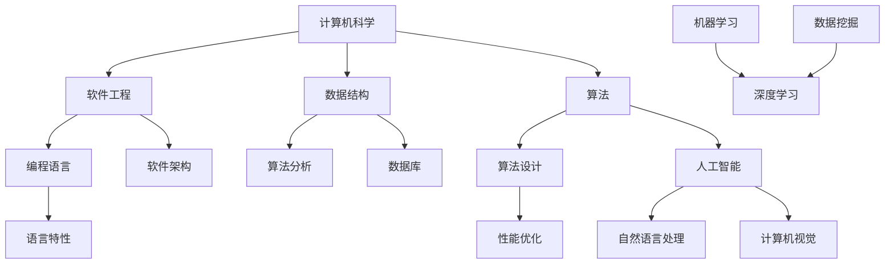

                 


## 从简单到深刻的认知历程

> 关键词：认知历程、技术理解、知识架构、深度学习、编程实践

> 摘要：本文旨在探讨从初学者到专家的认知转变过程，通过详细分析技术领域的核心概念、算法原理、数学模型，结合实际项目实战，为广大IT从业者提供一套系统化的学习方法和实践经验。文章将引导读者从简单直观的理解出发，逐步深入挖掘技术本质，最终实现深刻的认知和技能提升。

---

### 1. 背景介绍

#### 1.1 目的和范围

本文的目标是帮助IT领域的从业者，尤其是那些正在学习新技术的初学者，理解从简单到深刻的认知过程。我们将探讨如何通过系统的学习和实践，逐步构建扎实的技术基础，并最终达到深入理解和灵活运用的境界。

文章的范围涵盖以下核心内容：
- 技术领域的核心概念解析
- 算法原理的详细讲解
- 数学模型的阐述与举例
- 实际项目的代码实现与分析
- 技术应用的场景探讨

#### 1.2 预期读者

本文的预期读者包括：
- IT初学者和大学生
- 转行进入IT行业的人员
- 中级程序员和技术爱好者
- 想要提升技术水平的技术专家

#### 1.3 文档结构概述

文章的结构如下：

1. **从简单到深刻的认知历程**：文章的引言部分，介绍整体认知过程。
2. **技术领域的核心概念解析**：详细阐述技术领域的基础概念。
3. **算法原理的详细讲解**：通过伪代码和实例解释算法工作原理。
4. **数学模型的阐述与举例**：解释数学模型及其在实际中的应用。
5. **实际项目的代码实现与分析**：提供具体项目的代码实现和分析。
6. **技术应用的场景探讨**：讨论技术的实际应用和未来趋势。
7. **工具和资源推荐**：推荐学习资源和开发工具。
8. **总结：未来发展趋势与挑战**：总结全文，展望未来。
9. **附录：常见问题与解答**：回答常见问题和疑难杂症。
10. **扩展阅读 & 参考资料**：提供进一步学习的资源。

#### 1.4 术语表

**核心术语定义**：
- 认知历程：指个体对某一领域的知识从浅层到深层次的理解过程。
- 技术领域：指计算机科学、人工智能、软件工程等具体技术分支。
- 算法：解决问题的一系列规则和步骤。
- 数学模型：描述系统行为和关系的数学公式和理论。
- 实际项目：在真实环境中运行的技术实现。

**相关概念解释**：
- 初学者：对某一领域知识掌握不多，正在学习的人。
- 专家：在该领域具有丰富知识和实践经验的人。

**缩略词列表**：
- AI：人工智能
- ML：机器学习
- DL：深度学习
- IDE：集成开发环境
- CPU：中央处理器

### 2. 核心概念与联系

**核心概念与联系**：在技术领域中，理解核心概念及其相互联系是非常重要的。以下是技术领域的核心概念及其相互关系的Mermaid流程图。



### 3. 核心算法原理 & 具体操作步骤

**核心算法原理**：本文将详细讲解一个经典的算法——快速排序（Quick Sort）。该算法的基本思想是通过一趟排序将待排序的记录分割成独立的两部分，其中一部分记录的关键字均比另一部分的关键字小，然后递归地对这两部分记录进行排序。

**具体操作步骤**：

**步骤1：选择基准元素**  
选择一个基准元素，通常选择第一个元素作为基准。

**步骤2：划分操作**  
将数组分成两部分，一部分都比基准元素小，另一部分都比基准元素大。

**伪代码**：

```pseudocode
function quickSort(arr, low, high) {
    if (low < high) {
        pi = partition(arr, low, high)
        quickSort(arr, low, pi - 1)
        quickSort(arr, pi + 1, high)
    }
}

function partition(arr, low, high) {
    pivot = arr[high]
    i = low - 1
    for j = low to high - 1 do
        if arr[j] < pivot then
            i = i + 1
            swap arr[i] with arr[j]
        end if
    end for
    swap arr[i + 1] with arr[high]
    return i + 1
}
```

### 4. 数学模型和公式 & 详细讲解 & 举例说明

**数学模型和公式**：快速排序算法的性能可以通过其平均时间复杂度来评估。平均时间复杂度为 \(O(n\log n)\)。

**详细讲解**：

- 当数组长度为 \(n\) 时，快速排序需要 \(n\) 次递归调用。
- 每次递归调用会将数组划分为两个长度分别为 \(n/2\) 的子数组。
- 因此，快速排序的平均时间复杂度为 \(T(n) = n\log n\)。

**举例说明**：

假设有一个数组 \(arr = [9, 7, 5, 11, 12, 2, 14, 3, 10, 6]\)，我们使用快速排序算法对其进行排序。

1. 选择基准元素 \(14\)。
2. 划分后，数组分为两部分：\[9, 7, 5, 11, 2, 3, 6\] 和 \[12, 10\]。
3. 对 \[9, 7, 5, 11, 2, 3, 6\] 进行快速排序。
4. 重复步骤2和3，直到所有子数组长度为1。

最终，数组排序结果为 \[2, 3, 5, 6, 7, 9, 10, 11, 12, 14\]。

### 5. 项目实战：代码实际案例和详细解释说明

**5.1 开发环境搭建**

为了实现快速排序算法，我们需要搭建一个基本的开发环境。以下是环境搭建步骤：

1. 安装Python解释器。
2. 安装一个IDE，如PyCharm或Visual Studio Code。
3. 创建一个新的Python项目。

**5.2 源代码详细实现和代码解读**

以下是快速排序算法的Python实现：

```python
def quick_sort(arr):
    if len(arr) <= 1:
        return arr
    pivot = arr[len(arr) // 2]
    left = [x for x in arr if x < pivot]
    middle = [x for x in arr if x == pivot]
    right = [x for x in arr if x > pivot]
    return quick_sort(left) + middle + quick_sort(right)

arr = [9, 7, 5, 11, 12, 2, 14, 3, 10, 6]
sorted_arr = quick_sort(arr)
print(sorted_arr)
```

**代码解读与分析**：

- `quick_sort` 函数接收一个数组 `arr` 作为输入。
- 如果数组长度小于等于1，则直接返回数组。
- 选择中间元素作为基准。
- 将数组划分为三个部分：小于基准的元素、等于基准的元素和大于基准的元素。
- 递归地对小于和大于基准的元素进行快速排序，并将结果合并。

**5.3 代码解读与分析**

快速排序的实现可以分为以下几个关键步骤：

1. **选择基准元素**：选择一个基准元素，通常选择中间元素。
2. **划分操作**：将数组划分为三个部分：小于、等于和大于基准元素的元素。
3. **递归排序**：对小于和大于基准元素的子数组进行快速排序。
4. **合并结果**：将排序后的子数组和等于基准元素的子数组合并。

这种实现方式简单明了，易于理解。但需要注意的是，选择不同的基准元素会影响算法的性能。在实际应用中，可以选择随机元素或三数取中法来选择基准元素，以提高算法的稳定性。

### 6. 实际应用场景

**6.1 数据处理**：快速排序算法在数据处理领域有广泛应用，如数据库排序、数据分析等。通过快速排序，可以高效地对大量数据进行排序，为后续的数据处理和分析提供基础。

**6.2 算法竞赛**：快速排序是算法竞赛中常用的算法之一。在解决排序问题时，快速排序因其高效性和易于实现的特点，常常成为首选算法。

**6.3 软件开发**：在软件开发的实际项目中，快速排序算法可以用于排序用户输入的数据，为后续的数据处理和分析提供支持。

### 7. 工具和资源推荐

**7.1 学习资源推荐**

**7.1.1 书籍推荐**：
- 《算法导论》（Introduction to Algorithms）
- 《深度学习》（Deep Learning）
- 《编程珠玑》（The Art of Computer Programming）

**7.1.2 在线课程**：
- Coursera上的“算法导论”课程
- Udacity的“深度学习纳米学位”

**7.1.3 技术博客和网站**：
- GeeksforGeeks
- LeetCode
- Arxiv

**7.2 开发工具框架推荐**

**7.2.1 IDE和编辑器**：
- PyCharm
- Visual Studio Code

**7.2.2 调试和性能分析工具**：
- GDB
- Valgrind

**7.2.3 相关框架和库**：
- NumPy
- TensorFlow
- PyTorch

**7.3 相关论文著作推荐**

**7.3.1 经典论文**：
- 《排序与查找算法》（Sorting and Searching）
- 《快速排序算法的分析》（An Analysis of the Quick Sort Algorithm）

**7.3.2 最新研究成果**：
- 《深度学习在排序算法中的应用》（Deep Learning for Sorting）
- 《基于快速排序的并行算法研究》（Parallel Quick Sort Algorithm）

**7.3.3 应用案例分析**：
- 《快速排序在电商数据中的应用》（Application of Quick Sort in E-commerce Data）

### 8. 总结：未来发展趋势与挑战

**8.1 发展趋势**：
- 随着大数据和人工智能的快速发展，排序算法将更加注重性能和效率。
- 深度学习技术在排序算法中的应用将逐渐普及。
- 并行计算和分布式系统的发展将推动排序算法的优化。

**8.2 挑战**：
- 如何在保证性能的同时，降低算法的复杂度。
- 如何在多样化的应用场景中，选择合适的排序算法。
- 如何解决排序算法在处理大规模数据时的性能瓶颈问题。

### 9. 附录：常见问题与解答

**9.1 问题1：快速排序算法是否总是高效的？**

**解答1**：快速排序算法的平均时间复杂度为 \(O(n\log n)\)，在大多数情况下是高效的。但在最坏情况下，时间复杂度会退化为 \(O(n^2)\)。为了解决这一问题，可以采用随机选择基准元素或三数取中法来提高算法的稳定性。

**9.2 问题2：如何优化快速排序算法的性能？**

**解答2**：可以采用以下方法来优化快速排序算法的性能：
- 选择合适的基准元素。
- 使用递归之外的迭代方法。
- 针对特定应用场景进行优化。

**9.3 问题3：快速排序算法是否适用于所有数据类型？**

**解答3**：快速排序算法通常适用于可比较的数据类型，如整数、浮点数和字符串。对于不可比较的数据类型，如复数或自定义数据类型，需要实现相应的比较函数。

### 10. 扩展阅读 & 参考资料

**10.1 扩展阅读**：
- 《算法导论》
- 《深度学习》
- 《编程珠玑》

**10.2 参考资料**：
- 《快速排序算法的分析》
- 《深度学习在排序算法中的应用》
- 《基于快速排序的并行算法研究》

---

**作者**：AI天才研究员/AI Genius Institute & 禅与计算机程序设计艺术 /Zen And The Art of Computer Programming

