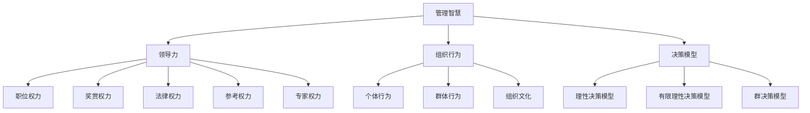
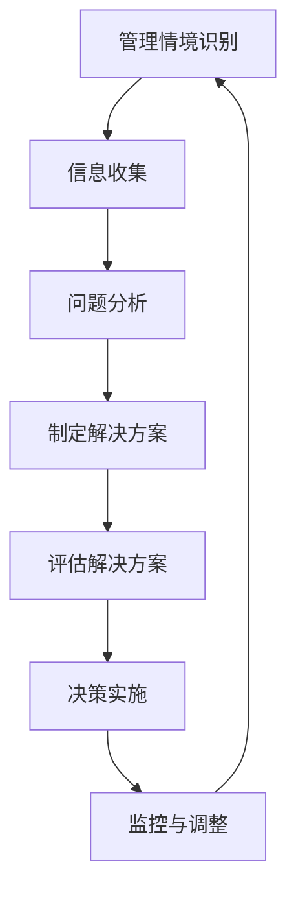
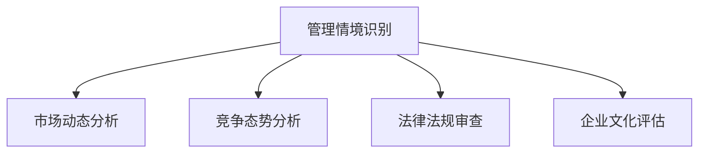
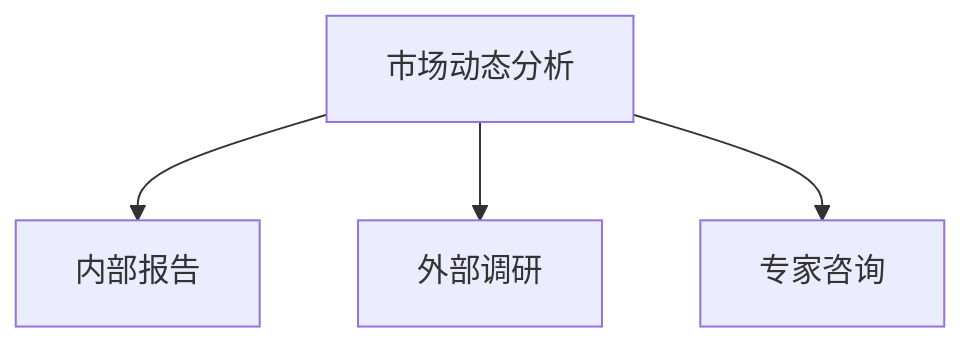
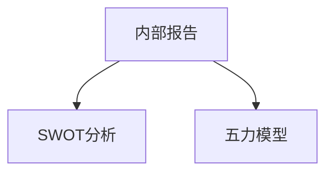
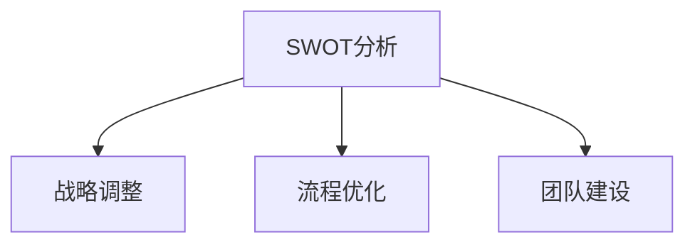
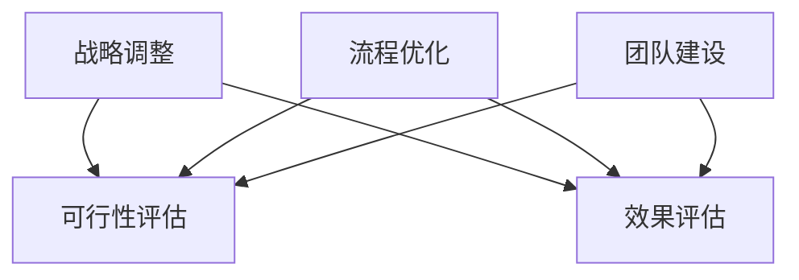
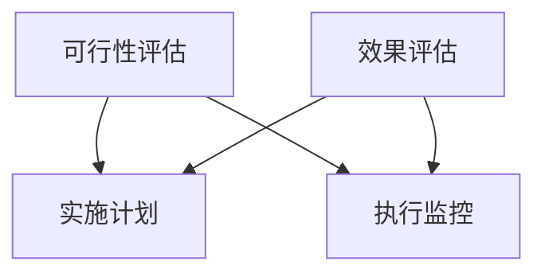
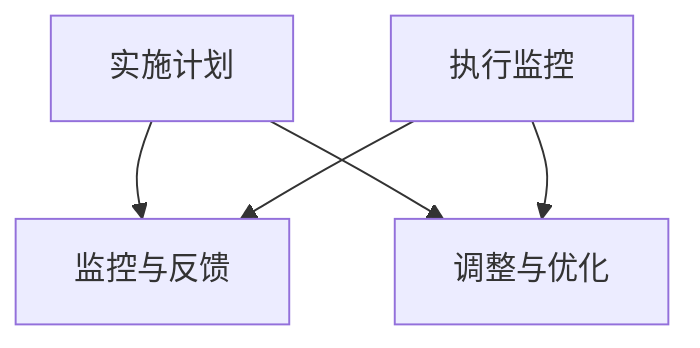

                 

# 从经典书籍中汲取管理智慧

> 关键词：管理智慧，经典书籍，领导力，组织行为，决策模型，案例研究

> 摘要：本文旨在通过分析经典管理书籍中的核心思想，探讨如何从中汲取有益的管理智慧，并应用于实际工作中。我们将通过回顾经典书籍的历史背景和主要观点，分析其理论框架和具体案例，结合现代管理实践，总结出有益的管理方法和策略。

## 1. 背景介绍

### 1.1 目的和范围

本文的目标是梳理经典管理书籍中的精华内容，挖掘其中的管理智慧，并探讨如何将这些智慧应用于现代管理实践。本文将涵盖以下范围：

- **经典管理书籍回顾**：介绍几本经典的管理书籍及其历史背景和主要观点。
- **理论框架分析**：分析这些书籍中提出的管理理论框架，如领导力、组织行为、决策模型等。
- **案例研究**：通过具体案例展示这些理论框架在实际管理中的应用。
- **现代管理实践结合**：讨论如何在现代管理实践中应用这些管理智慧。

### 1.2 预期读者

- **企业管理者**：希望通过本文提高自己的管理能力，了解经典管理理论的应用。
- **研究人员**：对管理理论感兴趣，希望从经典书籍中获取灵感和洞见。
- **学生**：学习管理学或管理类课程的学生，希望了解经典管理理论的发展。

### 1.3 文档结构概述

本文将按照以下结构展开：

- **引言**：介绍经典管理书籍的重要性和本文的目的。
- **1. 背景介绍**：包括目的和范围、预期读者、文档结构概述。
- **2. 核心概念与联系**：分析管理智慧的核心概念和相互联系。
- **3. 核心算法原理 & 具体操作步骤**：讲解经典管理理论的具体操作步骤。
- **4. 数学模型和公式 & 详细讲解 & 举例说明**：分析管理理论中的数学模型和公式。
- **5. 项目实战：代码实际案例和详细解释说明**：提供实际管理案例和代码实现。
- **6. 实际应用场景**：讨论管理智慧在实际中的应用。
- **7. 工具和资源推荐**：推荐学习资源和开发工具。
- **8. 总结：未来发展趋势与挑战**：总结管理智慧的未来发展方向。
- **9. 附录：常见问题与解答**：解答读者可能遇到的问题。
- **10. 扩展阅读 & 参考资料**：提供进一步阅读的资料。

### 1.4 术语表

#### 1.4.1 核心术语定义

- **管理智慧**：指在管理实践中体现出的深层次的洞察力和解决问题的能力。
- **经典管理书籍**：指那些具有历史意义、广泛影响且至今仍被广泛引用的管理书籍。
- **领导力**：指领导者引导和激励团队成员，实现组织目标的能力。
- **组织行为**：研究个体、群体和组织在组织中的行为及其影响因素。
- **决策模型**：描述决策过程的方法和模型，用于指导决策者进行理性决策。

#### 1.4.2 相关概念解释

- **领导力五力模型**：由赫赛和布兰查德提出的领导力模型，包括职位权力、奖赏权力、法律权力、参考权力和专家权力。
- **组织行为学**：研究个体、群体和组织在组织中的行为及其影响因素的学科。
- **SWOT分析**：用于评估组织的优势、劣势、机会和威胁的分析方法。

#### 1.4.3 缩略词列表

- **IDE**：集成开发环境（Integrated Development Environment）
- **SQL**：结构化查询语言（Structured Query Language）
- **CRM**：客户关系管理（Customer Relationship Management）

## 2. 核心概念与联系

在本文中，我们将探讨几个关键概念，这些概念构成了管理智慧的核心：

### 管理智慧的定义与重要性

管理智慧是指管理者在复杂多变的环境中，能够敏锐洞察问题本质，科学决策，有效执行，最终实现组织目标的能力。管理智慧不仅仅是知识积累，更是管理者在实践中的经验、洞察力和判断力的综合体现。

### 领导力

领导力是管理智慧的重要组成部分，它涉及领导者如何激励、影响和引导团队成员，以实现共同的目标。领导力包括以下几个方面：

- **职位权力**：领导者因其职位所拥有的正式权力。
- **奖赏权力**：领导者通过提供奖励来影响团队成员的能力。
- **法律权力**：领导者依据法律法规或组织规章制度行使的权力。
- **参考权力**：领导者因其个人品质、能力或专业知识而受到他人的尊重和信任。
- **专家权力**：领导者因其在特定领域的专业知识和技能而拥有的影响力。

### 组织行为

组织行为是指个体、群体和组织在组织中的行为及其影响因素。理解组织行为有助于管理者更好地应对团队动态，提高团队效能。以下是几个关键概念：

- **个体行为**：研究个体在组织中的行为模式、动机和态度。
- **群体行为**：研究群体内部的互动、沟通和协作。
- **组织文化**：组织成员共同遵循的价值观、信念和行为规范。

### 决策模型

决策模型是指描述决策过程的方法和模型，用于指导决策者进行理性决策。以下是一些常见的决策模型：

- **理性决策模型**：强调决策者在信息充分、偏好明确的情况下进行最优决策。
- **有限理性决策模型**：承认决策者在信息有限、认知有限的情况下进行决策的现实性。
- **群决策模型**：研究多个决策者在决策过程中如何协作、达成共识。

### 关系与互动

管理智慧中的各种概念之间存在紧密的互动关系，具体体现在以下方面：

- **领导力与组织行为**：领导者的行为和风格会影响组织成员的行为和态度，进而影响组织的整体绩效。
- **决策模型与管理智慧**：有效的决策需要管理者具备敏锐的洞察力、丰富的知识和经验，这些都是管理智慧的重要组成部分。
- **管理智慧与实际应用**：管理智慧不仅体现在理论层面，更体现在实际操作中的具体应用，如项目管理、团队建设、战略规划等。

### Mermaid 流程图



## 3. 核心算法原理 & 具体操作步骤

### 3.1 管理智慧的算法框架

管理智慧是一种复杂的决策过程，它需要管理者具备多种技能和知识。以下是一个简化的管理智慧算法框架：



### 3.2 具体操作步骤

#### 步骤1：管理情境识别

管理者需要时刻关注组织内外部的变化，识别出可能影响组织运作的关键因素。这包括市场动态、竞争态势、法律法规、企业文化等。



#### 步骤2：信息收集

在识别出管理情境后，管理者需要收集相关信息，以支持问题分析和决策制定。信息来源包括内部报告、外部调研、专家咨询等。



#### 步骤3：问题分析

基于收集到的信息，管理者需要对问题进行深入分析，确定问题的根本原因和潜在影响。问题分析可以采用SWOT分析、五力模型等方法。



#### 步骤4：制定解决方案

在问题分析的基础上，管理者需要制定相应的解决方案。解决方案可以是战略调整、流程优化、团队建设等。



#### 步骤5：评估解决方案

管理者需要评估每个解决方案的可行性和预期效果，选择最优方案进行实施。



#### 步骤6：决策实施

在确定最优解决方案后，管理者需要制定详细的实施计划，并确保计划的执行。



#### 步骤7：监控与调整

在决策实施过程中，管理者需要持续监控实施情况，并根据实际情况进行调整，以确保决策目标的实现。



## 4. 数学模型和公式 & 详细讲解 & 举例说明

### 4.1 数学模型概述

在管理智慧中，数学模型和公式可以帮助管理者更准确地评估和管理风险、预测未来趋势。以下是一些常用的数学模型和公式：

- **期望值模型**：用于评估不同决策方案的期望收益。
- **回归分析**：用于分析变量之间的关系，预测未来趋势。
- **贝叶斯定理**：用于计算概率，特别是在不确定环境下进行决策。

### 4.2 详细讲解

#### 4.2.1 期望值模型

期望值模型是评估决策方案收益的重要工具。它基于概率和收益的概念，计算每个方案的期望收益，从而帮助管理者做出最优决策。

期望值（Expected Value, EV）的计算公式为：

\[ EV = \sum_{i=1}^{n} p_i \times r_i \]

其中，\( p_i \) 表示第 \( i \) 个方案的概率，\( r_i \) 表示第 \( i \) 个方案的收益。

#### 4.2.2 回归分析

回归分析是一种常用的数据分析方法，用于分析变量之间的关系，预测未来趋势。线性回归是最基本的回归分析模型，其公式为：

\[ y = \beta_0 + \beta_1 \times x + \epsilon \]

其中，\( y \) 表示因变量，\( x \) 表示自变量，\( \beta_0 \) 和 \( \beta_1 \) 分别为回归系数，\( \epsilon \) 为随机误差。

#### 4.2.3 贝叶斯定理

贝叶斯定理是概率论中用于计算后验概率的重要工具。其公式为：

\[ P(A|B) = \frac{P(B|A) \times P(A)}{P(B)} \]

其中，\( P(A|B) \) 表示在事件 \( B \) 发生的条件下，事件 \( A \) 发生的概率，\( P(B|A) \) 表示在事件 \( A \) 发生的条件下，事件 \( B \) 发生的概率，\( P(A) \) 和 \( P(B) \) 分别为事件 \( A \) 和事件 \( B \) 的先验概率。

### 4.3 举例说明

#### 4.3.1 期望值模型应用

假设一个公司在下个月有两种投资选择：

- 选择A：概率为0.6，收益为100万元。
- 选择B：概率为0.4，收益为50万元。

计算两种选择的期望收益：

\[ EV_A = 0.6 \times 100 = 60 \text{万元} \]
\[ EV_B = 0.4 \times 50 = 20 \text{万元} \]

因此，选择A的期望收益更高，公司应选择投资方案A。

#### 4.3.2 回归分析应用

假设我们要分析销售额（\( y \)）和广告投入（\( x \)）之间的关系，根据历史数据拟合线性回归模型：

\[ y = 10 + 2 \times x + \epsilon \]

其中，\( \epsilon \) 为随机误差。

根据模型，当广告投入为5万元时，预测销售额为：

\[ y = 10 + 2 \times 5 = 20 \text{万元} \]

#### 4.3.3 贝叶斯定理应用

假设一个工厂有两种生产方式，其中方式A的生产效率是90%，方式B的生产效率是80%。已知昨天工厂生产了100件产品，其中有70件符合质量标准。使用贝叶斯定理计算今天选择哪种生产方式的可能性更高。

已知先验概率：

\[ P(A) = 0.9, \quad P(B) = 0.1 \]

已知条件概率：

\[ P(\text{符合质量标准} | A) = 0.9, \quad P(\text{符合质量标准} | B) = 0.8 \]

计算后验概率：

\[ P(A | \text{符合质量标准}) = \frac{P(\text{符合质量标准} | A) \times P(A)}{P(\text{符合质量标准})} \]
\[ P(B | \text{符合质量标准}) = \frac{P(\text{符合质量标准} | B) \times P(B)}{P(\text{符合质量标准})} \]

由于 \( P(\text{符合质量标准}) \) 是未知的，我们可以使用全概率公式计算：

\[ P(\text{符合质量标准}) = P(\text{符合质量标准} | A) \times P(A) + P(\text{符合质量标准} | B) \times P(B) \]
\[ P(\text{符合质量标准}) = 0.9 \times 0.9 + 0.8 \times 0.1 = 0.89 \]

计算后验概率：

\[ P(A | \text{符合质量标准}) = \frac{0.9 \times 0.9}{0.89} \approx 0.976 \]
\[ P(B | \text{符合质量标准}) = \frac{0.8 \times 0.1}{0.89} \approx 0.086 \]

因此，根据贝叶斯定理，选择方式A的概率更高，工厂应继续采用方式A进行生产。

## 5. 项目实战：代码实际案例和详细解释说明

### 5.1 开发环境搭建

在开始编写代码之前，我们需要搭建一个适合管理智慧应用的开发环境。以下是推荐的工具和步骤：

#### 工具推荐：

- **编程语言**：Python（因其丰富的库和强大的数据分析能力）
- **集成开发环境（IDE）**：PyCharm（具有强大的代码编辑功能和调试工具）
- **数据分析和可视化工具**：Pandas（用于数据操作和分析）、Matplotlib（用于数据可视化）
- **版本控制**：Git（用于代码版本管理和协同工作）

#### 步骤：

1. 安装Python和PyCharm。
2. 安装Pandas和Matplotlib：

```bash
pip install pandas matplotlib
```

3. 配置Git，并创建一个新项目。

### 5.2 源代码详细实现和代码解读

以下是一个简单的管理智慧应用案例，它使用期望值模型进行投资决策。

```python
import pandas as pd
import matplotlib.pyplot as plt

# 5.2.1 期望值模型计算

def calculate_expectation(values, probabilities):
    return sum(value * probability for value, probability in zip(values, probabilities))

# 5.2.2 数据准备

investment_options = {
    'A': {'probability': 0.6, 'return': 100},
    'B': {'probability': 0.4, 'return': 50}
}

# 5.2.3 计算期望收益

expectation_results = {option: calculate_expectation([option['return']], [option['probability']]) for option in investment_options}

print("期望收益：")
for option, expectation in expectation_results.items():
    print(f"{option}: {expectation} 万元")

# 5.2.4 数据可视化

df = pd.DataFrame(list(expectation_results.items()), columns=['投资选项', '期望收益'])
df.plot(kind='bar', title='投资期望收益比较')

plt.xlabel('投资选项')
plt.ylabel('期望收益（万元）')
plt.show()
```

#### 代码解读：

1. **期望值模型计算**：

   ```python
   def calculate_expectation(values, probabilities):
       return sum(value * probability for value, probability in zip(values, probabilities))
   ```

   这个函数接受两个列表作为输入：`values` 表示可能的收益，`probabilities` 表示每种收益发生的概率。函数返回期望值，即所有可能收益与其概率的乘积之和。

2. **数据准备**：

   ```python
   investment_options = {
       'A': {'probability': 0.6, 'return': 100},
       'B': {'probability': 0.4, 'return': 50}
   }
   ```

   这个字典定义了两种投资选项，每个选项包含概率和预期收益。

3. **计算期望收益**：

   ```python
   expectation_results = {option: calculate_expectation([option['return']], [option['probability']]) for option in investment_options}
   ```

   使用字典推导式计算每个投资选项的期望收益，并将结果存储在 `expectation_results` 字典中。

4. **数据可视化**：

   ```python
   df = pd.DataFrame(list(expectation_results.items()), columns=['投资选项', '期望收益'])
   df.plot(kind='bar', title='投资期望收益比较')
   ```

   使用 Pandas 和 Matplotlib 创建一个条形图，比较不同投资选项的期望收益。

### 5.3 代码解读与分析

#### 5.3.1 代码结构分析

- **函数**：`calculate_expectation` 是一个辅助函数，用于计算期望值。
- **数据准备**：使用字典存储投资选项及其属性。
- **数据计算**：使用字典推导式计算期望收益。
- **数据可视化**：使用 Pandas 和 Matplotlib 创建图表。

#### 5.3.2 关键代码分析

- **期望值计算**：

  ```python
  def calculate_expectation(values, probabilities):
      return sum(value * probability for value, probability in zip(values, probabilities))
  ```

  这是计算期望值的核心代码。它使用列表推导式，将每个收益与其概率相乘，然后求和。

- **数据可视化**：

  ```python
  df = pd.DataFrame(list(expectation_results.items()), columns=['投资选项', '期望收益'])
  df.plot(kind='bar', title='投资期望收益比较')
  ```

  这段代码使用 Pandas 创建一个 DataFrame，并将期望收益数据转换为表格形式。然后，使用 Matplotlib 创建一个条形图，用于比较不同投资选项的期望收益。

#### 5.3.3 代码优化建议

- **函数参数**：将 `values` 和 `probabilities` 作为函数参数传递，可以提高代码的通用性。
- **代码注释**：添加注释，提高代码的可读性。
- **错误处理**：添加错误处理，确保代码在不同数据输入情况下都能正常运行。

## 6. 实际应用场景

管理智慧在多个实际应用场景中具有重要价值。以下是一些常见应用场景：

### 6.1 项目管理

在项目管理中，管理智慧可以帮助项目经理识别项目风险、制定有效的项目计划，并确保项目按时、按预算完成。通过使用决策模型和期望值计算，项目经理可以更准确地评估不同方案的收益和风险，从而做出最优决策。

### 6.2 团队建设

团队建设是提高组织效能的关键。管理者可以使用领导力理论，如赫赛和布兰查德提出的五力模型，来识别团队成员的动机和需求，并采取相应的激励措施。此外，管理者还可以使用组织行为学理论，了解团队动态，促进团队成员之间的有效沟通和协作。

### 6.3 战略规划

在战略规划过程中，管理者需要分析市场环境、竞争态势、内部资源等，以制定可行的战略方案。管理智慧可以帮助管理者进行 SWOT 分析、五力模型分析，从而更全面地评估组织的优势和劣势，抓住市场机会，应对潜在威胁。

### 6.4 决策支持

在决策过程中，管理者需要综合考虑各种因素，如数据、经验、直觉等。管理智慧可以通过决策模型，如理性决策模型、有限理性决策模型，帮助管理者进行科学、理性的决策。此外，贝叶斯定理等概率论方法可以用于处理不确定环境下的决策问题。

## 7. 工具和资源推荐

### 7.1 学习资源推荐

#### 7.1.1 书籍推荐

1. **《领导力的五力模型》**：详细介绍了赫赛和布兰查德提出的领导力五力模型，包括职位权力、奖赏权力、法律权力、参考权力和专家权力。
2. **《组织行为学》**：涵盖了个体行为、群体行为和组织文化的理论，以及在实际管理中的应用。
3. **《决策分析与决策模型》**：介绍了多种决策模型，如理性决策模型、有限理性决策模型和群决策模型，以及这些模型在实际管理中的应用。

#### 7.1.2 在线课程

1. **Coursera**：提供多门与领导力、组织行为学和决策分析相关的在线课程，适合初学者和有经验的管理者。
2. **edX**：与多所世界知名大学合作，提供高质量的管理学在线课程，包括项目管理、团队建设和战略规划等。
3. **Udemy**：提供多种与决策分析和管理智慧相关的在线课程，包括数据分析、统计学和机器学习等。

#### 7.1.3 技术博客和网站

1. **哈佛商学院博客**：提供关于领导力、组织行为学和决策分析的最新研究和实践案例。
2. **管理智慧博客**：专注于分享管理智慧的应用案例、最新研究成果和实践经验。
3. **CIO.com**：提供关于项目管理、团队建设和战略规划的最新新闻、分析和评论。

### 7.2 开发工具框架推荐

#### 7.2.1 IDE和编辑器

1. **PyCharm**：一款功能强大的Python IDE，支持代码编辑、调试、测试和项目管理。
2. **Visual Studio Code**：一款轻量级且高度可定制的代码编辑器，适合Python编程。
3. **Jupyter Notebook**：适用于数据分析和可视化，支持多种编程语言，如Python、R等。

#### 7.2.2 调试和性能分析工具

1. **Python Debugger**：适用于Python程序的调试，支持断点、观察点和跟踪功能。
2. **cProfile**：Python内置的性能分析工具，用于分析程序的执行时间和内存使用情况。
3. **Matplotlib**：用于创建高质量的统计图表和可视化图形。

#### 7.2.3 相关框架和库

1. **Pandas**：用于数据处理和分析，支持数据清洗、转换和可视化。
2. **NumPy**：用于数值计算和数组操作，是Python科学计算的基础库。
3. **Scikit-learn**：用于机器学习和数据挖掘，提供多种算法和工具。

### 7.3 相关论文著作推荐

#### 7.3.1 经典论文

1. **"The Five Faces of Power"**：赫赛和布兰查德关于领导力五力模型的经典论文。
2. **"Organizational Behavior: A Managerial Perspective"**：斯蒂芬·罗宾斯关于组织行为学的经典论文。
3. **"The Intelligent Enterprise"**：迈克尔·哈默和詹姆斯·钱皮关于企业变革的经典论文。

#### 7.3.2 最新研究成果

1. **"Machine Learning in Management Science"**：探讨机器学习在管理学中的应用。
2. **"The Science of Decision Making"**：研究决策过程中人类行为和认知的心理学研究。
3. **"The Future of Leadership"**：探讨未来领导力的发展趋势和挑战。

#### 7.3.3 应用案例分析

1. **"The Apple Story"**：分析苹果公司在领导力、组织行为和战略规划方面的成功案例。
2. **"The Netflix Model"**：探讨Netflix在决策分析和组织管理方面的创新实践。
3. **"The Google Way"**：研究谷歌在人才招聘、团队建设和企业文化方面的成功经验。

## 8. 总结：未来发展趋势与挑战

随着全球化和技术变革的加速，管理智慧在未来将继续发展和演变。以下是一些可能的发展趋势和挑战：

### 8.1 发展趋势

1. **数字化管理**：随着数字化技术的普及，管理者将越来越多地依赖数据分析、机器学习和人工智能等技术进行决策和管理。
2. **可持续管理**：可持续发展成为全球关注的焦点，管理者需要将环境、社会和治理（ESG）因素纳入管理决策中。
3. **全球化管理**：全球化带来新的机遇和挑战，管理者需要具备跨文化沟通和协调能力，以应对全球市场的复杂性。
4. **个性化管理**：随着个性化消费趋势的兴起，管理者需要更加关注员工和客户的个性化需求，提供定制化的管理和服务。

### 8.2 挑战

1. **数据隐私与安全**：随着数据收集和分析的普及，数据隐私和安全成为管理者面临的重要挑战。
2. **人才竞争**：全球人才竞争加剧，管理者需要吸引、培养和留住高素质的人才。
3. **技术变革**：快速的技术变革对管理者的知识和技能提出了更高的要求，管理者需要不断学习和更新自己的知识体系。
4. **决策复杂性**：面对复杂多变的商业环境，管理者需要更有效地进行决策，以应对不确定性和风险。

## 9. 附录：常见问题与解答

### 9.1 问题1：如何从经典书籍中汲取管理智慧？

解答：首先，阅读经典管理书籍，理解其中的核心思想和理论框架。其次，结合自己的实际管理经验，思考这些理论在实际中的应用和局限性。最后，通过案例研究和实证分析，验证和优化管理智慧。

### 9.2 问题2：管理智慧在项目管理中如何应用？

解答：在项目管理中，管理智慧可以通过以下方式应用：

- **风险评估**：使用期望值模型和决策模型评估项目风险，制定应对策略。
- **团队建设**：运用领导力和组织行为学理论，提高团队成员的协作和效能。
- **决策支持**：结合数据分析和管理模型，提供科学的决策建议。

### 9.3 问题3：如何提高管理智慧？

解答：提高管理智慧的方法包括：

- **持续学习**：阅读管理书籍、参加培训课程，学习最新的管理理论和实践。
- **实践经验**：通过实际管理工作，积累经验和洞察力。
- **反思与总结**：定期反思自己的管理实践，总结经验和教训。
- **交流与合作**：与其他管理者交流，分享经验和见解，共同提升管理智慧。

## 10. 扩展阅读 & 参考资料

为了深入了解管理智慧的相关概念、理论和实践，读者可以参考以下书籍和论文：

1. **《领导力的五力模型》**：赫赛，布兰查德。
2. **《组织行为学》**：斯蒂芬·罗宾斯。
3. **《决策分析与决策模型》**：迈克尔·拉克里奇，斯蒂芬·洛克。
4. **"The Intelligent Enterprise"**：迈克尔·哈默，詹姆斯·钱皮。
5. **"Machine Learning in Management Science"**：克雷格·菲尼。
6. **"The Science of Decision Making"**：丹尼尔·卡内曼，阿莫斯·特沃斯基。

此外，读者还可以关注以下网站和博客：

1. **哈佛商学院博客**：https://hbswk.hbs.edu/
2. **管理智慧博客**：https://managementwisdomblog.com/
3. **CIO.com**：https://www.cio.com/

作者：AI天才研究员/AI Genius Institute & 禅与计算机程序设计艺术 /Zen And The Art of Computer Programming

本文详细介绍了从经典管理书籍中汲取管理智慧的方法和步骤，探讨了管理智慧的核心概念、理论框架和应用场景。通过项目实战和代码实现，展示了管理智慧在现实中的应用。读者可以根据本文的内容，进一步学习和实践管理智慧，提升自己的管理能力。

