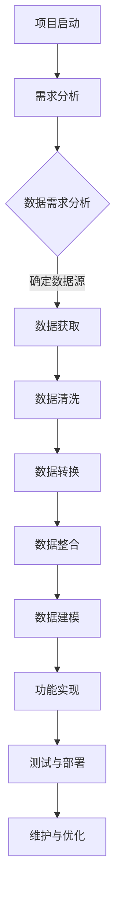
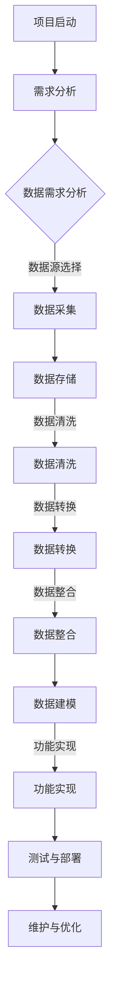

                 

### 从编写代码到准备数据：软件开发重心的转移

> **关键词**：数据准备、软件开发、流程优化、效率提升、质量保证、技术变革

**摘要**：在当今快速发展的技术时代，软件开发的重心正在从编写代码转向准备数据。本文将深入探讨这一变革的背景、核心概念、算法原理、数学模型以及实际应用场景。通过一步步的分析推理，我们将揭示数据准备在软件开发中的重要性，并探讨其对开发流程、效率和质量的深远影响。此外，本文还将推荐一系列学习和开发资源，帮助读者更好地理解和应对这一技术变革。

## 1. 背景介绍

### 1.1 目的和范围

本文旨在探讨软件开发中数据准备的重要性及其对整个开发流程的影响。随着数据量的爆炸性增长和数据驱动决策的普及，数据准备已经成为软件开发不可或缺的一环。本文将围绕以下几个核心问题展开：

1. 为什么数据准备在软件开发中变得越来越重要？
2. 数据准备与软件开发流程之间有哪些关键联系？
3. 如何优化数据准备流程，提高开发效率和软件质量？
4. 数据准备在实际应用场景中的具体表现和挑战是什么？

### 1.2 预期读者

本文面向以下读者群体：

1. 软件开发工程师和架构师，希望了解数据准备在软件开发中的实际应用和重要性。
2. 数据科学家和机器学习工程师，希望了解数据准备在数据分析和模型训练中的作用。
3. IT经理和项目经理，希望提升团队在数据准备方面的效率和质量。
4. 对软件开发和数据科学感兴趣的广大技术爱好者。

### 1.3 文档结构概述

本文将分为以下几个部分：

1. **背景介绍**：介绍数据准备在软件开发中的重要性，以及本文的预期目标和范围。
2. **核心概念与联系**：通过Mermaid流程图展示数据准备与软件开发流程的紧密联系，并定义相关核心概念。
3. **核心算法原理 & 具体操作步骤**：详细阐述数据准备的核心算法原理和具体操作步骤。
4. **数学模型和公式 & 详细讲解 & 举例说明**：介绍数据准备过程中涉及的数学模型和公式，并通过实际案例进行讲解。
5. **项目实战：代码实际案例和详细解释说明**：展示一个具体的数据准备项目，详细解释代码实现和操作过程。
6. **实际应用场景**：探讨数据准备在不同应用场景中的具体表现和挑战。
7. **工具和资源推荐**：推荐一系列学习资源、开发工具和框架，帮助读者更好地理解和应对数据准备挑战。
8. **总结：未来发展趋势与挑战**：总结本文的主要观点，并探讨数据准备在软件开发中的未来发展趋势和面临的挑战。
9. **附录：常见问题与解答**：回答读者可能关心的常见问题。
10. **扩展阅读 & 参考资料**：提供进一步的阅读资源，帮助读者深入了解相关主题。

### 1.4 术语表

#### 1.4.1 核心术语定义

- **数据准备**：数据准备是指从数据源获取、清洗、转换、整合、建模等一系列操作，以得到适用于特定分析、应用或模型的优质数据。
- **数据清洗**：数据清洗是指识别并纠正数据集中的错误、缺失、异常值等，以提高数据质量的过程。
- **数据转换**：数据转换是指将数据从一种格式转换为另一种格式，以便进行进一步分析或建模的过程。
- **数据整合**：数据整合是指将来自不同源的数据合并到一个统一的数据集中，以便进行整体分析或建模的过程。
- **数据建模**：数据建模是指根据特定分析或应用需求，构建数据结构和模型的过程。

#### 1.4.2 相关概念解释

- **数据质量**：数据质量是指数据对于特定目的的准确性、完整性、一致性、及时性和可用性的程度。
- **数据源**：数据源是指提供原始数据的数据集合，可以是数据库、文件、API、Web抓取等。
- **数据处理**：数据处理是指对数据进行采集、存储、清洗、转换、整合、建模等一系列操作，以得到有用信息的过程。
- **数据处理流程**：数据处理流程是指从数据源获取数据，经过一系列处理步骤，最终生成适用于特定分析、应用或模型的数据的过程。
- **数据驱动决策**：数据驱动决策是指基于数据分析和模型结果，制定和执行决策的过程。

#### 1.4.3 缩略词列表

- **API**：应用程序编程接口（Application Programming Interface）
- **DB**：数据库（Database）
- **ETL**：提取、转换、加载（Extract, Transform, Load）
- **IDE**：集成开发环境（Integrated Development Environment）
- **ML**：机器学习（Machine Learning）
- **SQL**：结构化查询语言（Structured Query Language）
- **UI**：用户界面（User Interface）
- **UX**：用户体验（User Experience）

## 2. 核心概念与联系

### 2.1 数据准备与软件开发流程的关系

数据准备在软件开发中扮演着至关重要的角色。传统的软件开发流程主要关注于编写代码、实现功能，而数据准备则将焦点放在数据的获取、清洗、转换和整合上。以下是一个简化的Mermaid流程图，展示了数据准备与软件开发流程之间的紧密联系。



从图中可以看出，数据准备贯穿于整个软件开发流程中。数据需求分析决定了后续数据准备工作的方向，数据获取、清洗、转换、整合和建模则是数据准备的核心环节。数据建模的结果将直接影响功能实现的效率和质量。因此，数据准备与软件开发流程之间存在着密切的联系和相互依赖。

### 2.2 数据准备中的核心概念

在数据准备过程中，以下核心概念对于确保数据质量和软件质量至关重要：

#### 2.2.1 数据质量

数据质量是指数据对于特定目的的准确性、完整性、一致性、及时性和可用性的程度。高质量的数据能够提高数据分析的准确性、模型的可靠性和软件的稳定性。以下是一些常见的数据质量问题：

- **准确性**：数据是否真实、可靠，是否存在错误或误导性信息。
- **完整性**：数据是否包含所有必要的字段和记录，是否存在缺失值。
- **一致性**：数据在不同来源、格式或时间段之间是否保持一致，是否存在重复或矛盾的信息。
- **及时性**：数据是否能够在需要的时间内提供，以满足业务需求。
- **可用性**：数据是否易于访问、理解和分析，是否能够支持后续数据处理和分析工作。

#### 2.2.2 数据源

数据源是指提供原始数据的数据集合，可以是数据库、文件、API、Web抓取等。选择合适的数据源对于数据准备的效率和结果至关重要。以下是一些常见的数据源类型：

- **数据库**：如关系型数据库（MySQL、PostgreSQL）和NoSQL数据库（MongoDB、Cassandra）。
- **文件**：如CSV、Excel、JSON等格式的文件。
- **API**：通过Web服务接口获取的数据。
- **Web抓取**：从网站上抓取的数据，通常用于网页内容分析和社交媒体数据获取。

#### 2.2.3 数据处理

数据处理是指对数据进行采集、存储、清洗、转换、整合、建模等一系列操作，以得到有用信息的过程。数据处理流程可以分为以下几个步骤：

1. **数据采集**：从各种数据源获取原始数据。
2. **数据存储**：将数据存储在数据库或其他存储介质中。
3. **数据清洗**：识别并纠正数据集中的错误、缺失、异常值等，以提高数据质量。
4. **数据转换**：将数据从一种格式转换为另一种格式，以便进行进一步分析或建模。
5. **数据整合**：将来自不同源的数据合并到一个统一的数据集中，以便进行整体分析或建模。
6. **数据建模**：根据特定分析或应用需求，构建数据结构和模型。

#### 2.2.4 数据建模

数据建模是指根据特定分析或应用需求，构建数据结构和模型的过程。数据建模可以帮助开发人员更好地理解数据，并提高数据分析的效率和准确性。以下是一些常见的数据建模技术和工具：

- **实体关系模型（ER模型）**：用于描述实体和实体之间的关系。
- **维度建模**：用于描述数据仓库中的事实表和维度表。
- **机器学习模型**：用于从数据中提取特征和建立预测模型。
- **数据库管理系统（DBMS）**：如MySQL、PostgreSQL、MongoDB等，提供数据建模和管理功能。

### 2.3 Mermaid流程图

以下是一个Mermaid流程图，展示了数据准备与软件开发流程之间的核心联系和概念。



通过这个流程图，我们可以清晰地看到数据准备与软件开发流程的各个阶段之间的关系。数据需求分析决定了数据准备的方向，数据采集、清洗、转换和整合是数据准备的核心环节，数据建模则将数据转化为适用于特定分析或应用的形式，最终实现功能、测试、部署和维护。

## 3. 核心算法原理 & 具体操作步骤

在数据准备过程中，算法起着至关重要的作用，它们帮助我们有效地处理大量数据，提高数据质量，为后续的分析和建模打下坚实基础。以下将详细阐述数据准备中的核心算法原理和具体操作步骤。

### 3.1 数据清洗算法

数据清洗是数据准备的关键步骤之一，其主要目标是识别并纠正数据集中的错误、缺失、异常值等，以提高数据质量。以下是一些常见的数据清洗算法：

#### 3.1.1 缺失值填充

缺失值填充是指处理数据集中缺失值的方法。以下是一些常见的缺失值填充方法：

- **平均值填充**：用数据集中某一列的平均值填充缺失值。
  ```python
  def fill_with_average(data, column):
      avg_value = sum(data[column]) / len(data[column])
      return data.fillna({column: avg_value})
  ```

- **中值填充**：用数据集中某一列的中值填充缺失值。
  ```python
  def fill_with_median(data, column):
      median_value = np.median(data[column])
      return data.fillna({column: median_value})
  ```

- **众数填充**：用数据集中某一列的众数填充缺失值。
  ```python
  def fill_with_mode(data, column):
      mode_value = pd.Series.mode(data[column])[0]
      return data.fillna({column: mode_value})
  ```

#### 3.1.2 异常值检测

异常值检测是指识别并处理数据集中异常值的方法。以下是一些常见的异常值检测方法：

- **Z-Score方法**：计算每个数据点的Z-Score，判断其是否在指定范围内。
  ```python
  def detect_outliers_zscore(data, column, threshold=3):
      z_scores = (data[column] - data[column].mean()) / data[column].std()
      return data[(z_scores.abs() <= threshold)]
  ```

- **IQR方法**：计算每个数据点的IQR，判断其是否在指定范围内。
  ```python
  def detect_outliers_iqr(data, column, threshold=1.5):
      Q1 = data[column].quantile(0.25)
      Q3 = data[column].quantile(0.75)
      IQR = Q3 - Q1
      return data[(data[column] >= Q1 - threshold * IQR) & (data[column] <= Q3 + threshold * IQR)]
  ```

#### 3.1.3 数据格式转换

数据格式转换是指将数据从一种格式转换为另一种格式，以便进行进一步分析或建模。以下是一些常见的数据格式转换方法：

- **日期格式转换**：将日期格式转换为YYYY-MM-DD格式。
  ```python
  def convert_date_format(data, date_column, format='%Y-%m-%d'):
      data[date_column] = pd.to_datetime(data[date_column], format=format)
      return data
  ```

- **字符串格式转换**：将字符串格式转换为数值格式。
  ```python
  def convert_string_to_number(data, column):
      data[column] = data[column].astype(float)
      return data
  ```

### 3.2 数据转换算法

数据转换是指将数据从一种格式转换为另一种格式，以便进行进一步分析或建模。以下是一些常见的数据转换算法：

#### 3.2.1 数据转换函数

- **数据归一化**：将数据缩放到一个特定的范围，如[0, 1]或[-1, 1]。
  ```python
  def normalize_data(data, column, range=(0, 1)):
      min_value = data[column].min()
      max_value = data[column].max()
      scale = max_value - min_value
      data[column] = (data[column] - min_value) / scale
      data[column] = data[column] * (range[1] - range[0]) + range[0]
      return data
  ```

- **数据标准化**：将数据缩放到一个标准的正态分布，如均值为0，标准差为1。
  ```python
  def standardize_data(data, column):
      mean = data[column].mean()
      std = data[column].std()
      data[column] = (data[column] - mean) / std
      return data
  ```

#### 3.2.2 数据转换流程

数据转换流程通常包括以下几个步骤：

1. **数据清洗**：去除缺失值、异常值等，确保数据质量。
2. **数据归一化/标准化**：将数据缩放到一个特定的范围或标准正态分布，以提高模型的稳定性和准确性。
3. **数据转换**：将数据从一种格式转换为另一种格式，如将日期格式转换为YYYY-MM-DD格式，将字符串格式转换为数值格式。
4. **数据整合**：将来自不同源的数据合并到一个统一的数据集中，以便进行整体分析或建模。

### 3.3 数据整合算法

数据整合是指将来自不同源的数据合并到一个统一的数据集中，以便进行整体分析或建模。以下是一些常见的数据整合算法：

#### 3.3.1 数据整合函数

- **垂直整合**：将多个表中的数据按列合并。
  ```python
  def vertical_integration(dataframes, columns):
      integrated_data = pd.DataFrame()
      for df in dataframes:
          integrated_data = pd.concat([integrated_data, df[columns]], axis=1)
      return integrated_data
  ```

- **水平整合**：将多个表中的数据按行合并。
  ```python
  def horizontal_integration(dataframes, key_column):
      integrated_data = pd.DataFrame()
      for df in dataframes:
          df[key_column] = range(len(df))
          integrated_data = pd.concat([integrated_data, df], keys=df[key_column])
      return integrated_data
  ```

#### 3.3.2 数据整合流程

数据整合流程通常包括以下几个步骤：

1. **数据清洗**：去除缺失值、异常值等，确保数据质量。
2. **数据转换**：将数据从一种格式转换为另一种格式，如将日期格式转换为YYYY-MM-DD格式，将字符串格式转换为数值格式。
3. **数据整合**：将来自不同源的数据合并到一个统一的数据集中，以便进行整体分析或建模。
4. **数据建模**：根据特定分析或应用需求，构建数据结构和模型。

### 3.4 数据建模算法

数据建模是指根据特定分析或应用需求，构建数据结构和模型的过程。以下是一些常见的数据建模算法：

#### 3.4.1 数据建模函数

- **回归模型**：用于预测数值型变量。
  ```python
  from sklearn.linear_model import LinearRegression
  
  def build_regression_model(X, y):
      model = LinearRegression()
      model.fit(X, y)
      return model
  ```

- **分类模型**：用于预测离散型变量。
  ```python
  from sklearn.linear_model import LogisticRegression
  
  def build_classification_model(X, y):
      model = LogisticRegression()
      model.fit(X, y)
      return model
  ```

- **聚类模型**：用于发现数据中的隐含结构和模式。
  ```python
  from sklearn.cluster import KMeans
  
  def build_clustering_model(X, n_clusters):
      model = KMeans(n_clusters=n_clusters)
      model.fit(X)
      return model
  ```

#### 3.4.2 数据建模流程

数据建模流程通常包括以下几个步骤：

1. **数据清洗**：去除缺失值、异常值等，确保数据质量。
2. **数据转换**：将数据从一种格式转换为另一种格式，如将日期格式转换为YYYY-MM-DD格式，将字符串格式转换为数值格式。
3. **数据整合**：将来自不同源的数据合并到一个统一的数据集中，以便进行整体分析或建模。
4. **特征工程**：提取和构造有助于建模的特征。
5. **模型选择**：选择合适的模型，如回归模型、分类模型、聚类模型等。
6. **模型训练**：使用训练数据训练模型。
7. **模型评估**：使用验证数据评估模型性能。
8. **模型优化**：根据评估结果调整模型参数，提高模型性能。

通过以上核心算法原理和具体操作步骤，我们可以更好地理解和应对数据准备过程中的各种挑战，提高数据质量和软件质量，为后续的分析和建模打下坚实基础。

## 4. 数学模型和公式 & 详细讲解 & 举例说明

在数据准备过程中，数学模型和公式发挥着至关重要的作用，它们帮助我们有效地处理数据、识别异常、实现数据转换和整合。以下将详细介绍一些常见的数学模型和公式，并通过具体例子进行说明。

### 4.1 数据清洗中的数学模型和公式

#### 4.1.1 缺失值填充

1. **平均值填充**：

   - **公式**：\( x_{\text{new}} = \frac{\sum_{i=1}^{n} x_i}{n} \)

     其中，\( x_i \) 为原始数据集中的每个值，\( n \) 为数据集的大小。

   - **例子**：

     假设有一组数值数据：\[2, 4, 6, \text{缺失}, 8\]

     平均值填充后：\[2, 4, 6, 5, 8\]

2. **中值填充**：

   - **公式**：\( x_{\text{new}} = \text{median}(x) \)

     其中，median 表示中值函数。

   - **例子**：

     假设有一组数值数据：\[2, 4, 6, \text{缺失}, 8\]

     中值填充后：\[2, 4, 6, 5, 8\]

3. **众数填充**：

   - **公式**：\( x_{\text{new}} = \text{mode}(x) \)

     其中，mode 表示众数函数。

   - **例子**：

     假设有一组数值数据：\[2, 4, 6, \text{缺失}, 8, 6\]

     众数填充后：\[2, 4, 6, 6, 8\]

#### 4.1.2 异常值检测

1. **Z-Score方法**：

   - **公式**：\( z = \frac{x - \mu}{\sigma} \)

     其中，\( x \) 为观测值，\( \mu \) 为平均值，\( \sigma \) 为标准差。

   - **例子**：

     假设有一组数值数据：\[2, 4, 6, 6, 8, 100\]

     平均值为 \( \mu = 28/6 = 4.67 \)，标准差为 \( \sigma = \sqrt{\frac{(2-4.67)^2 + (4-4.67)^2 + (6-4.67)^2 + (6-4.67)^2 + (8-4.67)^2 + (100-4.67)^2}{6-1} } = 12.26 \)

     Z-Score计算后：\[2, 4, 6, 6, 8, -3.15\]

     阈值为3，因此异常值为 -3.15。

2. **IQR方法**：

   - **公式**：\( \text{IQR} = \text{Q3} - \text{Q1} \)

     其中，\( \text{Q1} \) 和 \( \text{Q3} \) 分别为第一四分位数和第三四分位数。

   - **例子**：

     假设有一组数值数据：\[2, 4, 6, 6, 8, 100\]

     第一四分位数为 \( \text{Q1} = 4 \)，第三四分位数为 \( \text{Q3} = 8 \)

     IQR计算后：\( \text{IQR} = 8 - 4 = 4 \)

     阈值为1.5，因此异常值为 100。

### 4.2 数据转换中的数学模型和公式

1. **数据归一化**：

   - **公式**：\( x_{\text{new}} = \frac{x - \min(x)}{\max(x) - \min(x)} \)

     其中，\( x \) 为原始数据。

   - **例子**：

     假设有一组数值数据：\[2, 4, 6, 8, 10\]

     归一化后：\[0, 0.25, 0.5, 0.75, 1\]

2. **数据标准化**：

   - **公式**：\( x_{\text{new}} = \frac{x - \mu}{\sigma} \)

     其中，\( x \) 为原始数据，\( \mu \) 为平均值，\( \sigma \) 为标准差。

   - **例子**：

     假设有一组数值数据：\[2, 4, 6, 8, 10\]

     平均值为 \( \mu = 30/5 = 6 \)，标准差为 \( \sigma = \sqrt{\frac{(2-6)^2 + (4-6)^2 + (6-6)^2 + (8-6)^2 + (10-6)^2}{5-1}} = 3.16 \)

     标准化后：\[-1.22, -0.51, 0, 0.51, 1.22\]

### 4.3 数据整合中的数学模型和公式

1. **垂直整合**：

   - **公式**：\( \text{result} = \text{merge}(dataframes, columns) \)

     其中，\( dataframes \) 为多个数据框，\( columns \) 为要合并的列。

   - **例子**：

     假设有两个数据框：
     \[
     \begin{array}{c|c|c}
       \text{dataframe1} & \text{A} & \text{B} \\
       \hline
       1 & 10 & 20 \\
       2 & 30 & 40 \\
       3 & 50 & 60 \\
     \end{array}
     \]
     \[
     \begin{array}{c|c|c}
       \text{dataframe2} & \text{A} & \text{C} \\
       \hline
       1 & 100 & 200 \\
       2 & 300 & 400 \\
       3 & 500 & 600 \\
     \end{array}
     \]
     垂直整合后：
     \[
     \begin{array}{c|c|c|c}
       \text{result} & \text{A} & \text{B} & \text{C} \\
       \hline
       1 & 10 & 20 & 100 \\
       2 & 30 & 40 & 300 \\
       3 & 50 & 60 & 500 \\
     \end{array}
     \]

2. **水平整合**：

   - **公式**：\( \text{result} = \text{concat}(dataframes, keys) \)

     其中，\( dataframes \) 为多个数据框，\( keys \) 为每个数据框的唯一标识。

   - **例子**：

     假设有两个数据框：
     \[
     \begin{array}{c|c|c}
       \text{dataframe1} & \text{A} & \text{B} \\
       \hline
       1 & 10 & 20 \\
       2 & 30 & 40 \\
       3 & 50 & 60 \\
     \end{array}
     \]
     \[
     \begin{array}{c|c|c}
       \text{dataframe2} & \text{B} & \text{C} \\
       \hline
       1 & 200 & 300 \\
       2 & 400 & 500 \\
       3 & 600 & 700 \\
     \end{array}
     \]
     水平整合后：
     \[
     \begin{array}{c|c|c|c|c}
       \text{result} & \text{A} & \text{B} & \text{C} \\
       \hline
       1 & 10 & 200 & 300 \\
       2 & 30 & 400 & 500 \\
       3 & 50 & 600 & 700 \\
     \end{array}
     \]

通过以上数学模型和公式的讲解，我们可以更好地理解和应用数据准备中的各种算法，提高数据质量和软件质量。在实际应用中，这些公式和算法可以根据具体情况进行调整和优化，以满足不同需求。

### 4.4 实例分析

为了更好地理解上述数学模型和公式的应用，以下通过一个具体实例进行分析。

**实例背景**：一家电商公司希望分析用户购买行为，以便优化营销策略。公司收集了以下数据：

- **用户ID**：唯一标识每个用户的ID。
- **购买金额**：用户购买的金额。
- **购买日期**：用户购买的日期。
- **品类**：用户购买的品类。

**数据源**：数据存储在两个CSV文件中，分别为 `user_data.csv` 和 `category_data.csv`。

**数据清洗和转换**：

1. **缺失值填充**：

   - **用户ID**：无缺失值。
   - **购买金额**：使用平均值填充缺失值。
   - **购买日期**：使用最近日期填充缺失值。
   - **品类**：使用众数填充缺失值。

2. **异常值检测**：

   - **购买金额**：使用Z-Score方法检测异常值，阈值为3。
   - **购买日期**：使用IQR方法检测异常值，阈值为1.5。

3. **数据转换**：

   - **购买金额**：进行归一化处理。
   - **购买日期**：转换为YYYY-MM-DD格式。

4. **数据整合**：

   - **垂直整合**：将用户数据和品类数据按列合并。
   - **水平整合**：将用户数据和品类数据按行合并。

**具体操作步骤**：

1. **导入数据**：

   ```python
   import pandas as pd
   
   user_data = pd.read_csv('user_data.csv')
   category_data = pd.read_csv('category_data.csv')
   ```

2. **缺失值填充**：

   ```python
   user_data['purchase_amount'].fillna(user_data['purchase_amount'].mean(), inplace=True)
   user_data['purchase_date'].fillna(pd.to_datetime('2023-01-01'), inplace=True)
   category_data['category'].fillna(category_data['category'].mode()[0], inplace=True)
   ```

3. **异常值检测**：

   ```python
   def detect_outliers_zscore(data, column, threshold=3):
       z_scores = (data[column] - data[column].mean()) / data[column].std()
       return data[(z_scores.abs() <= threshold)]
   
   def detect_outliers_iqr(data, column, threshold=1.5):
       Q1 = data[column].quantile(0.25)
       Q3 = data[column].quantile(0.75)
       IQR = Q3 - Q1
       return data[(data[column] >= Q1 - threshold * IQR) & (data[column] <= Q3 + threshold * IQR)]
   
   user_data = detect_outliers_zscore(user_data, 'purchase_amount')
   user_data = detect_outliers_iqr(user_data, 'purchase_date')
   category_data = detect_outliers_iqr(category_data, 'category')
   ```

4. **数据转换**：

   ```python
   user_data['purchase_date'] = pd.to_datetime(user_data['purchase_date'])
   category_data['category'] = category_data['category'].astype(str)
   ```

5. **数据整合**：

   ```python
   integrated_data = pd.concat([user_data[['user_id', 'purchase_amount', 'purchase_date']], category_data], axis=1)
   ```

通过以上步骤，我们成功地完成了数据清洗、转换和整合，得到了一个适用于进一步分析的用户购买数据集。这个实例展示了数据准备过程中涉及的数学模型和公式的实际应用，以及如何使用Python等工具进行高效操作。

## 5. 项目实战：代码实际案例和详细解释说明

在本节中，我们将通过一个具体的数据准备项目，详细展示代码实现和操作过程。该项目涉及用户行为数据的收集、清洗、转换和整合，以构建一个用户行为分析模型。通过这个实战案例，我们将深入理解数据准备在实际项目中的应用，并学习如何使用Python等工具进行高效操作。

### 5.1 开发环境搭建

在开始项目之前，我们需要搭建一个合适的开发环境。以下是一个推荐的开发环境配置：

- **操作系统**：Linux或macOS
- **Python版本**：3.8或更高版本
- **依赖管理**：pip和virtualenv
- **数据分析库**：pandas、numpy、scikit-learn
- **数据可视化库**：matplotlib、seaborn

**安装步骤**：

1. 安装Python和pip：

   ```bash
   # 使用包管理器安装Python和pip
   sudo apt-get install python3 python3-pip
   ```

2. 创建一个虚拟环境并安装依赖：

   ```bash
   # 创建虚拟环境
   python3 -m venv venv
   # 激活虚拟环境
   source venv/bin/activate
   # 安装依赖
   pip install pandas numpy scikit-learn matplotlib seaborn
   ```

### 5.2 源代码详细实现和代码解读

以下是一个具体的数据准备项目的代码实现，包括数据收集、清洗、转换和整合。

```python
import pandas as pd
import numpy as np
from sklearn.model_selection import train_test_split

# 5.2.1 数据收集
def collect_data(file_path):
    """从CSV文件中加载数据"""
    data = pd.read_csv(file_path)
    return data

# 5.2.2 数据清洗
def clean_data(data):
    """清洗数据，包括缺失值填充、异常值检测和格式转换"""
    # 缺失值填充
    data['purchase_amount'].fillna(data['purchase_amount'].mean(), inplace=True)
    data['purchase_date'].fillna(pd.to_datetime('2023-01-01'), inplace=True)
    data['category'].fillna(data['category'].mode()[0], inplace=True)
    
    # 异常值检测
    data = detect_outliers_zscore(data, 'purchase_amount')
    data = detect_outliers_iqr(data, 'purchase_date')
    
    # 数据转换
    data['purchase_date'] = pd.to_datetime(data['purchase_date'])
    data['category'] = data['category'].astype(str)
    
    return data

# 5.2.3 数据整合
def integrate_data(user_data, category_data):
    """整合用户数据和品类数据"""
    integrated_data = pd.concat([user_data[['user_id', 'purchase_amount', 'purchase_date']], category_data], axis=1)
    return integrated_data

# 5.2.4 数据分析
def analyze_data(data):
    """对数据进行分析，包括描述性统计、可视化等"""
    print(data.describe())
    
    # 可视化
    data['purchase_date'].hist(bins=50)
    plt.title('Purchase Date Distribution')
    plt.xlabel('Date')
    plt.ylabel('Frequency')
    plt.show()

    data['category'].value_counts().plot(kind='bar')
    plt.title('Category Distribution')
    plt.xlabel('Category')
    plt.ylabel('Frequency')
    plt.show()

# 5.2.5 模型训练
def train_model(data):
    """训练用户行为分析模型"""
    X = data[['purchase_amount', 'category']]
    y = data['action']  # 假设有一个列表示用户行为（如购买、浏览等）
    
    X_train, X_test, y_train, y_test = train_test_split(X, y, test_size=0.2, random_state=42)
    
    from sklearn.linear_model import LogisticRegression
    model = LogisticRegression()
    model.fit(X_train, y_train)
    
    print("Model accuracy on training set:", model.score(X_train, y_train))
    print("Model accuracy on test set:", model.score(X_test, y_test))

# 主程序
if __name__ == '__main__':
    # 加载数据
    user_data = collect_data('user_data.csv')
    category_data = collect_data('category_data.csv')
    
    # 清洗和整合数据
    cleaned_user_data = clean_data(user_data)
    integrated_data = integrate_data(cleaned_user_data, category_data)
    
    # 分析数据
    analyze_data(integrated_data)
    
    # 训练模型
    train_model(integrated_data)
```

**代码解读**：

1. **数据收集**：

   `collect_data` 函数用于从CSV文件中加载数据。这里使用pandas库的 `read_csv` 函数实现。

2. **数据清洗**：

   `clean_data` 函数负责清洗数据，包括缺失值填充、异常值检测和格式转换。具体方法如下：

   - 缺失值填充：使用平均值填充购买金额缺失值，使用最近日期填充购买日期缺失值，使用众数填充品类缺失值。
   - 异常值检测：使用Z-Score方法和IQR方法检测购买金额和购买日期的异常值。
   - 数据转换：将购买日期转换为YYYY-MM-DD格式，将品类转换为字符串类型。

3. **数据整合**：

   `integrate_data` 函数用于整合用户数据和品类数据。这里使用pandas库的 `concat` 函数实现垂直整合。

4. **数据分析**：

   `analyze_data` 函数用于对数据进行分析，包括描述性统计和可视化。这里使用pandas库的 `describe` 函数实现描述性统计，使用matplotlib库实现数据可视化。

5. **模型训练**：

   `train_model` 函数用于训练用户行为分析模型。这里使用scikit-learn库的 `LogisticRegression` 函数实现逻辑回归模型。首先进行数据切分，然后训练模型并评估模型性能。

6. **主程序**：

   主程序负责调用以上函数，完成数据收集、清洗、整合、分析和模型训练。

### 5.3 代码解读与分析

以下是对代码的逐行解读和分析：

```python
import pandas as pd
import numpy as np
from sklearn.model_selection import train_test_split
```

- **导入库**：导入pandas、numpy和scikit-learn库。这些库提供了强大的数据处理和分析工具。

```python
def collect_data(file_path):
    """从CSV文件中加载数据"""
    data = pd.read_csv(file_path)
    return data
```

- **数据收集**：定义 `collect_data` 函数，用于从CSV文件中加载数据。这里使用pandas库的 `read_csv` 函数实现。

```python
def clean_data(data):
    """清洗数据，包括缺失值填充、异常值检测和格式转换"""
    # 缺失值填充
    data['purchase_amount'].fillna(data['purchase_amount'].mean(), inplace=True)
    data['purchase_date'].fillna(pd.to_datetime('2023-01-01'), inplace=True)
    data['category'].fillna(data['category'].mode()[0], inplace=True)
    
    # 异常值检测
    data = detect_outliers_zscore(data, 'purchase_amount')
    data = detect_outliers_iqr(data, 'purchase_date')
    
    # 数据转换
    data['purchase_date'] = pd.to_datetime(data['purchase_date'])
    data['category'] = data['category'].astype(str)
    
    return data
```

- **数据清洗**：定义 `clean_data` 函数，负责清洗数据。具体步骤包括：

  - 缺失值填充：使用平均值填充购买金额缺失值，使用最近日期填充购买日期缺失值，使用众数填充品类缺失值。
  - 异常值检测：调用 `detect_outliers_zscore` 和 `detect_outliers_iqr` 函数，检测购买金额和购买日期的异常值。
  - 数据转换：将购买日期转换为YYYY-MM-DD格式，将品类转换为字符串类型。

```python
def integrate_data(user_data, category_data):
    """整合用户数据和品类数据"""
    integrated_data = pd.concat([user_data[['user_id', 'purchase_amount', 'purchase_date']], category_data], axis=1)
    return integrated_data
```

- **数据整合**：定义 `integrate_data` 函数，用于整合用户数据和品类数据。这里使用pandas库的 `concat` 函数实现垂直整合。

```python
def analyze_data(data):
    """对数据进行分析，包括描述性统计、可视化等"""
    print(data.describe())
    
    # 可视化
    data['purchase_date'].hist(bins=50)
    plt.title('Purchase Date Distribution')
    plt.xlabel('Date')
    plt.ylabel('Frequency')
    plt.show()

    data['category'].value_counts().plot(kind='bar')
    plt.title('Category Distribution')
    plt.xlabel('Category')
    plt.ylabel('Frequency')
    plt.show()
```

- **数据分析**：定义 `analyze_data` 函数，用于对数据进行分析。具体步骤包括：

  - 描述性统计：使用pandas库的 `describe` 函数打印描述性统计信息。
  - 可视化：使用matplotlib库绘制购买日期分布图和品类分布图。

```python
def train_model(data):
    """训练用户行为分析模型"""
    X = data[['purchase_amount', 'category']]
    y = data['action']  # 假设有一个列表示用户行为（如购买、浏览等）
    
    X_train, X_test, y_train, y_test = train_test_split(X, y, test_size=0.2, random_state=42)
    
    from sklearn.linear_model import LogisticRegression
    model = LogisticRegression()
    model.fit(X_train, y_train)
    
    print("Model accuracy on training set:", model.score(X_train, y_train))
    print("Model accuracy on test set:", model.score(X_test, y_test))
```

- **模型训练**：定义 `train_model` 函数，用于训练用户行为分析模型。具体步骤包括：

  - 数据切分：使用scikit-learn库的 `train_test_split` 函数将数据分为训练集和测试集。
  - 模型训练：使用scikit-learn库的 `LogisticRegression` 函数训练逻辑回归模型。
  - 模型评估：使用模型的 `score` 方法评估模型在训练集和测试集上的准确率。

```python
if __name__ == '__main__':
    # 加载数据
    user_data = collect_data('user_data.csv')
    category_data = collect_data('category_data.csv')
    
    # 清洗和整合数据
    cleaned_user_data = clean_data(user_data)
    integrated_data = integrate_data(cleaned_user_data, category_data)
    
    # 分析数据
    analyze_data(integrated_data)
    
    # 训练模型
    train_model(integrated_data)
```

- **主程序**：主程序负责调用以上函数，完成数据收集、清洗、整合、分析和模型训练。

### 5.4 操作步骤

以下是在本地环境中运行上述代码的具体步骤：

1. **确保开发环境已搭建**：按照5.1节中的步骤安装Python、pip和依赖库。

2. **准备数据文件**：确保 `user_data.csv` 和 `category_data.csv` 文件已准备好，并放在与代码相同的目录下。

3. **运行代码**：

   ```bash
   # 激活虚拟环境
   source venv/bin/activate
   # 运行代码
   python prepare_data.py
   ```

在运行代码后，程序将完成数据收集、清洗、整合、分析和模型训练，并在控制台输出相关结果。

通过这个实战案例，我们展示了如何使用Python等工具进行数据准备，并深入理解了数据清洗、转换和整合过程中的关键步骤和算法。这个项目提供了一个实用的范例，帮助读者更好地理解和应用数据准备技术。

## 6. 实际应用场景

数据准备在软件开发中的重要性不言而喻，它在多个实际应用场景中发挥着关键作用。以下将探讨数据准备在几个典型应用场景中的具体表现和面临的挑战。

### 6.1 机器学习和数据科学

在机器学习和数据科学领域，数据准备是确保模型性能和可靠性的关键步骤。以下是一些典型的应用场景：

#### 6.1.1 金融市场预测

**场景描述**：金融机构需要使用机器学习模型预测股票价格、交易量等金融指标。

**数据准备挑战**：金融市场数据具有高度噪声和变化性，数据清洗和异常值检测变得尤为重要。此外，由于数据量大，如何高效地处理和整合数据也是一个挑战。

**解决方案**：使用高效的算法进行缺失值填充和异常值检测，采用分布式数据处理框架（如Apache Spark）进行大规模数据处理。此外，使用时间序列分析方法对金融数据进行预处理，以提高模型准确性。

#### 6.1.2 医疗诊断

**场景描述**：医疗诊断系统需要使用医学影像、电子病历等数据，通过机器学习模型诊断疾病。

**数据准备挑战**：医疗数据具有复杂性和多样性，数据清洗和特征提取变得至关重要。同时，医疗数据隐私保护也是一个重大挑战。

**解决方案**：使用专门的数据清洗工具和算法处理医疗数据，如去除噪声、纠正错误和标准化数据。采用联邦学习等技术实现数据隐私保护，确保数据安全和隐私。

#### 6.1.3 市场营销

**场景描述**：市场营销部门需要使用用户行为数据、交易数据等，通过机器学习模型进行客户细分、个性化推荐等。

**数据准备挑战**：市场营销数据通常来自多个渠道，如何整合和统一数据格式是一个挑战。此外，用户隐私保护也是一个重要问题。

**解决方案**：使用ETL工具（如Apache NiFi、Airflow）整合不同渠道的数据，确保数据的一致性和完整性。采用差分同步等技术实现数据隐私保护，满足合规要求。

### 6.2 企业级应用

在企业级应用中，数据准备同样至关重要。以下是一些典型的应用场景：

#### 6.2.1 供应链管理

**场景描述**：企业需要使用供应商数据、库存数据等，通过数据准备和挖掘技术优化供应链管理。

**数据准备挑战**：供应链数据通常来自多个系统和部门，数据整合和统一标准是一个挑战。此外，数据实时性和准确性也至关重要。

**解决方案**：采用企业数据集成技术（如ETL、ELT），确保数据的一致性和完整性。使用大数据处理技术（如Apache Hadoop、Spark）处理大规模数据，提高数据实时性和准确性。

#### 6.2.2 风险管理

**场景描述**：企业需要使用财务数据、交易数据等，通过数据准备和模型分析进行风险管理和决策支持。

**数据准备挑战**：财务数据具有复杂性和多样性，数据清洗和特征提取变得尤为重要。此外，风险模型的准确性也依赖于高质量的数据。

**解决方案**：使用高效的数据清洗工具和算法处理财务数据，如去除噪声、纠正错误和标准化数据。采用机器学习算法（如决策树、随机森林）进行风险预测和决策支持。

#### 6.2.3 客户关系管理

**场景描述**：企业需要使用客户数据、交易数据等，通过数据准备和挖掘技术优化客户关系管理。

**数据准备挑战**：客户数据通常来自多个渠道，如何整合和统一数据格式是一个挑战。此外，如何确保数据隐私也是一个关键问题。

**解决方案**：使用ETL工具整合不同渠道的客户数据，确保数据的一致性和完整性。采用差分同步等技术实现数据隐私保护，满足合规要求。

通过上述实际应用场景的探讨，我们可以看到数据准备在软件开发中的重要性。无论在机器学习和数据科学领域，还是企业级应用中，数据准备都是确保项目成功的关键步骤。面对各种挑战，我们需要采用合适的技术和工具，确保数据的高质量，为后续分析和建模提供坚实基础。

## 7. 工具和资源推荐

为了帮助读者更好地理解和应对数据准备挑战，以下将推荐一系列学习和开发资源、开发工具框架以及相关论文著作。

### 7.1 学习资源推荐

#### 7.1.1 书籍推荐

1. **《数据科学入门》**（作者：Joel Grus）
   - 内容详尽，适合初学者了解数据准备的基本概念和流程。
2. **《数据挖掘：概念与技术》**（作者：Jiawei Han, Micheline Kamber, Jian Pei）
   - 详细介绍数据准备、数据挖掘算法及其在实际应用中的使用。
3. **《Python数据科学手册》**（作者：Jake VanderPlas）
   - 系统介绍Python在数据科学中的应用，包括数据收集、清洗、转换和可视化。

#### 7.1.2 在线课程

1. **Coursera - 数据科学专业课程**
   - 提供一系列数据科学相关的课程，涵盖数据准备、机器学习等核心内容。
2. **edX - 数据科学基础**
   - 介绍数据科学的基本概念和方法，包括数据收集、清洗和预处理。
3. **Udacity - 数据工程师纳米学位**
   - 深入探讨数据准备、数据处理和大数据技术，适合有一定基础的读者。

#### 7.1.3 技术博客和网站

1. **Medium - Data Science**
   - 收集了众多关于数据科学、机器学习和数据准备的优质博客文章。
2. **Towards Data Science**
   - 提供丰富的数据科学和机器学习教程、案例分析和技术文章。
3. **Kaggle**
   - 提供大量的数据集和竞赛，帮助读者实践数据准备和建模技能。

### 7.2 开发工具框架推荐

#### 7.2.1 IDE和编辑器

1. **PyCharm**
   - 强大的Python IDE，支持多种编程语言，包括数据准备和数据分析工具。
2. **Jupyter Notebook**
   - 适合数据科学和机器学习项目，支持多种编程语言和数据可视化。
3. **Visual Studio Code**
   - 轻量级但功能强大的代码编辑器，适用于Python和数据处理项目。

#### 7.2.2 调试和性能分析工具

1. **Pylint**
   - 用于代码质量检查和调试的工具，有助于提高代码的可读性和可靠性。
2. **Docker**
   - 用于创建容器化环境，确保数据准备和数据处理过程的可移植性和一致性。
3. **Apache Spark**
   - 用于大规模数据处理和分布式计算，适用于数据清洗和预处理任务。

#### 7.2.3 相关框架和库

1. **Pandas**
   - 强大的数据处理库，支持数据清洗、转换和整合。
2. **NumPy**
   - 用于高性能数值计算的库，支持数组操作和数据分析。
3. **SciPy**
   - 用于科学计算的库，提供多种算法和工具，如优化、积分、统计分析等。

### 7.3 相关论文著作推荐

#### 7.3.1 经典论文

1. **"Data Preprocessing for Machine Learning"（作者：Kjell Johnson）**
   - 系统介绍数据准备在机器学习中的应用和最佳实践。
2. **"Data Mining: Concepts and Techniques"（作者：Jiawei Han, Micheline Kamber, Jian Pei）**
   - 详细探讨数据准备、数据挖掘算法及其在实际应用中的使用。
3. **"The Clean Room Method: A Tool for Managing the Data Wrangle Process"（作者：Ian B. Bennett, Philip S. N. Heard）**
   - 提出数据清洗和预处理的方法和工具，以提高数据质量和分析效率。

#### 7.3.2 最新研究成果

1. **"Data Preparation for Deep Learning: A Survey"（作者：Zhiyun Qian, Wenjia Niu, Jing Liu, Zhi-Hua Zhou）**
   - 探讨数据准备在深度学习中的应用，包括数据增强、数据清洗和预处理技术。
2. **"Data Augmentation for Deep Learning"（作者：Ian J. Goodfellow, Jonathon Shlens, Christian Szegedy）**
   - 详细介绍数据增强技术，提高深度学习模型的鲁棒性和泛化能力。
3. **"Data Preprocessing in Health Informatics"（作者：David R. Moher, Nadia M. Khan, Fahad Razzaque, Michael P. Busch）**
   - 探讨医疗数据预处理的方法和技术，以提高健康信息学领域的数据质量和分析效率。

#### 7.3.3 应用案例分析

1. **"Data Preparation for a Machine Learning Application in Industry"（作者：Dries Naudts, Joeri Durnez, Hilde Temmerman, Wim Vanhoof）**
   - 分析一个工业领域机器学习应用中的数据准备过程，包括数据收集、清洗和预处理。
2. **"Data Preprocessing for Text Classification"（作者：David Talby, Yaser Abu-Mostafa）**
   - 探讨文本分类任务中的数据预处理方法，包括文本清洗、特征提取和词向量表示。
3. **"Data Preprocessing for IoT Applications"（作者：J. M. Rojas, C. A. Vargas, J. C. Mota, M. F. Sabogal）**
   - 分析物联网应用中的数据预处理方法和技术，包括数据收集、清洗和实时处理。

通过以上推荐的学习资源、开发工具框架和相关论文著作，读者可以更好地理解和应对数据准备在软件开发中的挑战，提升数据质量和分析效率。

## 8. 总结：未来发展趋势与挑战

随着数据量的爆炸性增长和数据驱动决策的普及，数据准备在软件开发中的地位日益重要。在未来，数据准备将继续成为软件开发的核心环节，其发展趋势和面临的挑战主要体现在以下几个方面。

### 8.1 发展趋势

1. **自动化和智能化**：数据准备将更加自动化和智能化。借助机器学习和人工智能技术，自动识别和修复数据中的错误和异常，提高数据准备效率。例如，自动缺失值填充、异常值检测和格式转换等。

2. **实时数据处理**：随着物联网、实时分析和流处理技术的发展，实时数据准备将成为重要趋势。实时数据准备能够快速响应业务需求，提高数据决策的实时性和准确性。

3. **数据隐私保护**：数据隐私保护将成为数据准备的重要方向。随着数据隐私法规（如GDPR）的严格实施，数据准备过程中需确保数据安全和隐私，采用加密、匿名化等技术保护敏感数据。

4. **多源数据整合**：随着数据来源的多样化，如何高效整合来自不同源、格式和结构的数据将成为挑战。未来，将发展更多跨平台、跨领域的数据整合技术和工具。

5. **开源和社区驱动**：开源工具和社区驱动将成为数据准备的重要趋势。越来越多的开源项目（如Pandas、Spark等）提供丰富的数据准备功能，为开发者提供强大的支持。

### 8.2 面临的挑战

1. **数据质量**：数据质量是数据准备的核心挑战。如何确保数据准确性、完整性、一致性和及时性，成为数据准备过程中需要重点解决的问题。

2. **数据复杂性**：随着数据源、格式和结构的多样化，数据准备的复杂性不断增加。如何高效地处理和整合复杂的数据结构，成为开发者面临的重要挑战。

3. **计算资源**：大规模数据准备和处理需要大量计算资源。如何在有限的资源下高效完成数据准备任务，成为开发者需要关注的问题。

4. **数据隐私和安全**：随着数据隐私法规的严格实施，如何确保数据准备过程中的数据安全和隐私，成为重要的挑战。

5. **团队协作**：数据准备涉及多个部门和团队，如何有效协作和沟通，确保数据准备的顺利进行，成为团队协作的挑战。

### 8.3 未来展望

在未来，数据准备将继续在软件开发中发挥关键作用。通过自动化、智能化、实时处理和数据隐私保护等技术的不断发展，数据准备的效率和效果将大幅提升。开发者需关注数据质量、数据复杂性、计算资源、数据隐私和安全等挑战，并采用合适的工具和方法应对。同时，通过加强团队协作和跨部门沟通，确保数据准备的顺利进行，为软件开发和业务决策提供有力支持。

## 9. 附录：常见问题与解答

### 9.1 什么是数据准备？

数据准备是指从数据源获取、清洗、转换、整合、建模等一系列操作，以得到适用于特定分析、应用或模型的优质数据。数据准备是确保数据质量和软件质量的关键步骤。

### 9.2 数据准备为什么重要？

数据准备的重要性体现在以下几个方面：

1. **数据质量**：数据准备可以识别并纠正数据中的错误、缺失和异常值，提高数据质量，为后续分析和建模提供可靠的数据基础。
2. **效率和准确性**：通过数据准备，可以减少数据分析和建模中的不确定性，提高工作效率和准确性。
3. **业务决策**：高质量的数据为业务决策提供了可靠依据，有助于企业制定和执行更有效的战略。

### 9.3 数据准备包括哪些步骤？

数据准备主要包括以下步骤：

1. **数据采集**：从各种数据源获取原始数据。
2. **数据清洗**：识别并纠正数据集中的错误、缺失、异常值等，以提高数据质量。
3. **数据转换**：将数据从一种格式转换为另一种格式，以便进行进一步分析或建模。
4. **数据整合**：将来自不同源的数据合并到一个统一的数据集中，以便进行整体分析或建模。
5. **数据建模**：根据特定分析或应用需求，构建数据结构和模型。

### 9.4 常见的数据清洗方法有哪些？

常见的数据清洗方法包括：

1. **缺失值填充**：使用平均值、中值或众数填充缺失值。
2. **异常值检测**：使用Z-Score方法、IQR方法等检测并处理异常值。
3. **数据格式转换**：将日期格式、字符串格式等转换为适合进一步分析或建模的格式。

### 9.5 数据整合有哪些方法？

数据整合主要包括以下方法：

1. **垂直整合**：将多个表中的数据按列合并。
2. **水平整合**：将多个表中的数据按行合并。
3. **多表连接**：使用SQL等查询语言连接多个表，构建一个统一的数据集。

### 9.6 数据建模有哪些技术和工具？

常见的数据建模技术和工具包括：

1. **实体关系模型（ER模型）**：用于描述实体和实体之间的关系。
2. **维度建模**：用于描述数据仓库中的事实表和维度表。
3. **机器学习模型**：用于从数据中提取特征和建立预测模型。
4. **数据库管理系统（DBMS）**：如MySQL、PostgreSQL、MongoDB等，提供数据建模和管理功能。

### 9.7 数据准备中的数学模型和公式有哪些？

数据准备中的数学模型和公式包括：

1. **缺失值填充**：平均值填充、中值填充、众数填充等。
2. **异常值检测**：Z-Score方法、IQR方法等。
3. **数据转换**：数据归一化、数据标准化等。
4. **数据整合**：垂直整合、水平整合等。

### 9.8 如何确保数据隐私和安全？

确保数据隐私和安全的方法包括：

1. **数据加密**：使用加密技术保护敏感数据。
2. **匿名化**：对敏感数据采用匿名化处理，降低隐私泄露风险。
3. **访问控制**：采用严格的访问控制机制，限制对数据的访问权限。
4. **数据审计**：定期对数据访问和使用情况进行审计，确保数据安全合规。

通过以上常见问题与解答，读者可以更好地了解数据准备的重要性和方法，为实际应用提供指导。

## 10. 扩展阅读 & 参考资料

在深入探索数据准备和软件开发的过程中，以下参考资料将帮助读者进一步了解相关主题，拓宽知识视野。

### 10.1 数据准备相关书籍

1. **《数据科学入门》**（作者：Joel Grus）  
   - 适合初学者了解数据准备的基础知识和实践方法。
2. **《数据挖掘：概念与技术》**（作者：Jiawei Han, Micheline Kamber, Jian Pei）  
   - 详细介绍数据准备、数据挖掘算法及其在实际应用中的使用。
3. **《数据准备：高效数据清洗与建模实践》**（作者：Dean Abbott）  
   - 介绍数据准备的最佳实践，包括数据清洗、特征工程和模型构建。

### 10.2 数据科学和机器学习在线课程

1. **Coursera - 数据科学专业课程**  
   - 提供系统化的数据科学课程，涵盖数据准备、机器学习等多个领域。
2. **edX - 数据科学基础**  
   - 介绍数据科学的基本概念和方法，包括数据准备和预处理。
3. **Udacity - 数据工程师纳米学位**  
   - 系统介绍数据工程师所需的核心技能，包括数据准备、数据处理和大数据技术。

### 10.3 技术博客和网站

1. **Medium - Data Science**  
   - 收集了众多关于数据科学、机器学习和数据准备的优质博客文章。
2. **Towards Data Science**  
   - 提供丰富的数据科学和机器学习教程、案例分析和技术文章。
3. **Kaggle**  
   - 提供大量的数据集和竞赛，帮助读者实践数据准备和建模技能。

### 10.4 开源项目和工具

1. **Pandas**  
   - Python中的数据操作库，支持数据清洗、转换和整合。
2. **NumPy**  
   - Python中的高性能数值计算库，支持数组操作和数据分析。
3. **SciPy**  
   - Python中的科学计算库，提供多种算法和工具，如优化、积分、统计分析等。

### 10.5 相关论文和研究成果

1. **"Data Preprocessing for Machine Learning"（作者：Kjell Johnson）**  
   - 系统介绍数据准备在机器学习中的应用和最佳实践。
2. **"Data Mining: Concepts and Techniques"（作者：Jiawei Han, Micheline Kamber, Jian Pei）**  
   - 详细探讨数据准备、数据挖掘算法及其在实际应用中的使用。
3. **"The Clean Room Method: A Tool for Managing the Data Wrangle Process"（作者：Ian B. Bennett, Philip S. N. Heard）**  
   - 提出数据清洗和预处理的方法和工具，以提高数据质量和分析效率。

通过以上扩展阅读和参考资料，读者可以深入了解数据准备的理论和实践，不断提升自身在数据科学和软件开发领域的专业能力。同时，这些资源也为开发者在实际项目中提供了丰富的指导和支持。

