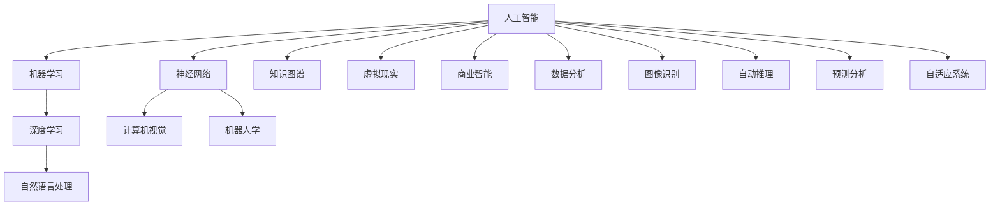
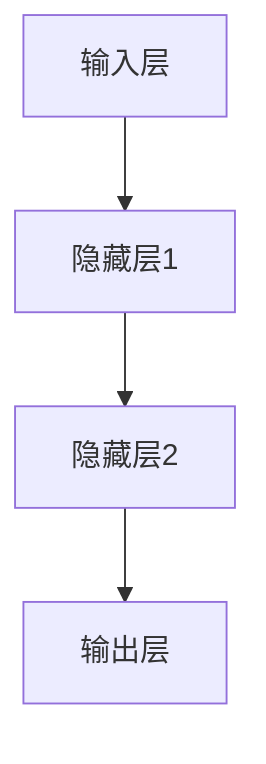

                 

### 从达特茅斯会议到AI大模型

#### 关键词：
- 达特茅斯会议
- 人工智能
- 大模型
- 发展历程
- 技术突破
- 应用场景

#### 摘要：
本文旨在探讨人工智能（AI）从诞生之初的达特茅斯会议，到如今迈向大模型时代的演进过程。文章首先回顾了人工智能的起源，然后详细分析了核心概念和关键技术的演变，接着阐述了数学模型和算法原理，并通过实际项目案例进行了应用解读。最后，文章展望了AI大模型未来的发展趋势与面临的挑战，并推荐了相关学习资源和工具。

---

## 1. 背景介绍

### 1.1 目的和范围

本文的目的是通过系统地梳理人工智能的历史发展脉络，探讨AI从早期愿景到现代大模型时代的变革过程。文章将重点介绍以下几个部分：

1. **达特茅斯会议与人工智能的起源**：介绍人工智能的诞生背景、核心思想以及达特茅斯会议的历史意义。
2. **核心概念与联系**：讲解人工智能中的关键概念，如神经网络、机器学习、深度学习等，并使用Mermaid流程图展示其架构关系。
3. **核心算法原理**：深入分析神经网络、机器学习算法的原理，并使用伪代码详细阐述其工作流程。
4. **数学模型和公式**：介绍支持人工智能的核心数学模型，包括线性代数、微积分、概率统计等，并使用LaTeX格式进行展示。
5. **项目实战**：通过具体代码案例，展示如何在实际项目中应用人工智能技术。
6. **实际应用场景**：探讨人工智能在现代科技和生活中的应用场景。
7. **未来发展趋势与挑战**：分析AI大模型技术的未来发展方向和面临的挑战。

### 1.2 预期读者

本文适合以下几类读者：

1. **计算机科学和人工智能专业的学生**：有助于加深对人工智能历史和技术的理解。
2. **技术开发者**：希望了解AI技术如何从理论走向实践，并在实际项目中应用。
3. **行业从业者**：关注人工智能技术的发展趋势，希望掌握AI大模型的基本原理和应用。
4. **学术研究者**：对人工智能的过去、现在和未来有兴趣，希望从中获得启发。

### 1.3 文档结构概述

本文将按照以下结构展开：

1. **引言**：介绍人工智能的起源和本文的目的。
2. **核心概念与联系**：解释人工智能中的核心概念，如神经网络、机器学习等。
3. **核心算法原理**：分析人工智能的算法原理，并使用伪代码进行讲解。
4. **数学模型和公式**：介绍支持人工智能的数学模型，包括线性代数、微积分等。
5. **项目实战**：通过具体案例展示如何应用人工智能技术。
6. **实际应用场景**：探讨人工智能在各个领域的应用。
7. **未来发展趋势与挑战**：分析AI大模型技术的未来方向和挑战。
8. **总结**：对全文进行总结。
9. **附录**：提供常见问题解答和扩展阅读。
10. **参考资料**：列出本文引用的文献和资源。

### 1.4 术语表

#### 1.4.1 核心术语定义

- **人工智能（AI）**：模拟人类智能行为的技术和学科。
- **机器学习（ML）**：让计算机通过数据和经验自动改进性能的过程。
- **深度学习（DL）**：一种基于多层神经网络进行特征提取和模式识别的技术。
- **神经网络（NN）**：模仿人脑神经元连接和活动的计算模型。
- **大模型（Large Model）**：具有数十亿至数千亿参数的深度学习模型。

#### 1.4.2 相关概念解释

- **数据集（Dataset）**：用于训练和测试机器学习模型的样本集合。
- **模型训练（Model Training）**：通过调整模型参数来提高其性能的过程。
- **模型评估（Model Evaluation）**：评估模型性能的方法和指标。
- **泛化能力（Generalization）**：模型对新数据进行预测的能力。

#### 1.4.3 缩略词列表

- **AI**：人工智能
- **ML**：机器学习
- **DL**：深度学习
- **NN**：神经网络
- **GPU**：图形处理单元

---

## 2. 核心概念与联系

人工智能领域的发展离不开核心概念和技术的推动。在这一部分，我们将介绍几个关键概念，并使用Mermaid流程图展示它们之间的关系。

### 2.1 人工智能的核心概念

1. **神经网络（Neural Networks）**：模仿人脑神经元连接和活动的计算模型，用于处理复杂的数据和任务。
2. **机器学习（Machine Learning）**：使计算机通过数据和经验自动改进性能的过程，分为监督学习、无监督学习和强化学习。
3. **深度学习（Deep Learning）**：基于多层神经网络进行特征提取和模式识别的技术，是当前人工智能领域的主流方向。
4. **自然语言处理（Natural Language Processing）**：使计算机理解和生成人类语言的技术，包括语音识别、文本分类等。

### 2.2 Mermaid流程图展示



### 2.3 关键概念之间的关系

- **神经网络**：深度学习的核心组成部分，用于实现特征学习和模式识别。
- **机器学习**：提供了训练神经网络的方法，如反向传播算法。
- **深度学习**：扩展了神经网络的能力，使其能够处理更复杂的任务。
- **自然语言处理**：应用深度学习技术，使计算机能够理解和生成人类语言。

通过这一部分的介绍，读者可以初步了解人工智能领域的核心概念和它们之间的关系。接下来，我们将进一步探讨这些核心概念的原理和实现方法。

---

## 3. 核心算法原理 & 具体操作步骤

在了解了人工智能的核心概念之后，接下来我们将深入探讨这些算法的基本原理，并使用伪代码详细阐述其操作步骤。本文将主要介绍以下三种核心算法：神经网络、机器学习和深度学习。

### 3.1 神经网络（Neural Networks）

#### 3.1.1 基本原理

神经网络（NN）是一种通过模拟人脑神经元连接和活动来进行计算的计算模型。它由大量的节点（称为神经元）组成，这些节点通过连接（称为边或权重）相互连接。

一个简单的神经网络结构如下：



#### 3.1.2 工作原理

神经网络的工作原理是通过前向传播和反向传播来调整权重，从而提高模型的性能。

- **前向传播**：输入数据通过网络从输入层传递到输出层，每个神经元的输出通过激活函数进行非线性变换。
- **反向传播**：根据输出层的误差，通过网络反向传播，计算每个神经元的梯度，并更新权重。

#### 3.1.3 伪代码

```python
# 初始化神经网络
 initialize_weights()

# 前向传播
 inputs = get_inputs()
 hidden_layers = []
 for layer in hidden_layers:
   activation = sigmoid(np.dot(layer_weights, inputs))
   hidden_layers.append(activation)

 outputs = sigmoid(np.dot(output_weights, hidden_layers[-1]))

# 反向传播
 errors = get_output_errors(desired_outputs, outputs)
 gradients = compute_gradients(hidden_layers, errors)
 update_weights(gradients)
```

### 3.2 机器学习（Machine Learning）

#### 3.2.1 基本原理

机器学习（ML）是使计算机通过数据和经验自动改进性能的过程。它分为监督学习、无监督学习和强化学习。

- **监督学习（Supervised Learning）**：有标注的数据进行训练，用于预测和分类任务。
- **无监督学习（Unsupervised Learning）**：没有标注的数据进行训练，用于聚类和降维任务。
- **强化学习（Reinforcement Learning）**：通过与环境的交互来学习最优策略。

#### 3.2.2 工作原理

机器学习的工作原理是通过训练数据集来调整模型的参数，使其能够对未知数据进行预测或分类。

- **训练过程**：将数据集分成训练集和验证集，使用训练集训练模型，并在验证集上评估模型的性能。
- **评估过程**：使用准确率、召回率、F1分数等指标来评估模型的性能。

#### 3.2.3 伪代码

```python
# 初始化模型参数
 initialize_params()

# 训练过程
 for epoch in range(num_epochs):
   for data in training_data:
     predicted = model(data)
     loss = compute_loss(predicted, true_label)
     gradients = compute_gradients(model_params, loss)
     update_params(gradients)

# 评估过程
 for data in validation_data:
   predicted = model(data)
   true_label = get_true_label(data)
   accuracy = compute_accuracy(predicted, true_label)
```

### 3.3 深度学习（Deep Learning）

#### 3.3.1 基本原理

深度学习（DL）是机器学习的子领域，它使用多层神经网络来提取数据的特征和模式。

- **深度卷积神经网络（CNN）**：用于图像识别和分类任务。
- **循环神经网络（RNN）**：用于序列数据处理和自然语言处理任务。
- **长短时记忆网络（LSTM）**：RNN的改进版本，用于处理长序列数据。

#### 3.3.2 工作原理

深度学习的工作原理是通过多层神经网络来提取数据的特征，从而提高模型的性能。

- **前向传播**：输入数据通过网络从输入层传递到输出层，每个神经元的输出通过激活函数进行非线性变换。
- **反向传播**：根据输出层的误差，通过网络反向传播，计算每个神经元的梯度，并更新权重。

#### 3.3.3 伪代码

```python
# 初始化神经网络
 initialize_weights()

# 前向传播
 inputs = get_inputs()
 hidden_layers = []
 for layer in hidden_layers:
   activation = relu(np.dot(layer_weights, inputs))
   hidden_layers.append(activation)

 outputs = softmax(np.dot(output_weights, hidden_layers[-1]))

# 反向传播
 errors = get_output_errors(desired_outputs, outputs)
 gradients = compute_gradients(hidden_layers, errors)
 update_weights(gradients)
```

通过以上对神经网络、机器学习和深度学习的介绍，读者可以初步了解这些核心算法的原理和操作步骤。接下来，我们将进一步探讨支持这些算法的数学模型和公式。

---

## 4. 数学模型和公式 & 详细讲解 & 举例说明

在人工智能领域，数学模型和公式是理解算法原理和进行模型训练的基础。本文将介绍支持人工智能的数学模型，包括线性代数、微积分、概率统计等，并通过具体的公式和例子进行详细讲解。

### 4.1 线性代数

线性代数是人工智能的基础数学工具，广泛应用于神经网络、机器学习和深度学习等领域。

#### 4.1.1 矩阵与向量

- **矩阵（Matrix）**：一个二维数组，表示为\( A = [a_{ij}] \)，其中\( i \)表示行，\( j \)表示列。
- **向量（Vector）**：一个一维数组，表示为\( \mathbf{v} = [v_1, v_2, ..., v_n] \)。

#### 4.1.2 矩阵运算

- **矩阵乘法（Matrix Multiplication）**：两个矩阵\( A \)和\( B \)相乘得到一个新的矩阵\( C \)，计算公式为：
  \[
  C_{ij} = \sum_{k=1}^{n} A_{ik}B_{kj}
  \]

- **矩阵求导（Matrix Differentiation）**：给定矩阵\( A \)和向量\( \mathbf{x} \)，矩阵的求导可以表示为：
  \[
  \frac{\partial A}{\partial \mathbf{x}} = \frac{\partial}{\partial \mathbf{x}} [a_{ij}]
  \]

#### 4.1.3 举例说明

假设有两个矩阵\( A \)和\( B \)：

\[ A = \begin{bmatrix} 1 & 2 \\ 3 & 4 \end{bmatrix}, \quad B = \begin{bmatrix} 5 & 6 \\ 7 & 8 \end{bmatrix} \]

计算矩阵乘法：

\[ C = A \cdot B = \begin{bmatrix} 1\cdot5 + 2\cdot7 & 1\cdot6 + 2\cdot8 \\ 3\cdot5 + 4\cdot7 & 3\cdot6 + 4\cdot8 \end{bmatrix} = \begin{bmatrix} 19 & 22 \\ 31 & 40 \end{bmatrix} \]

### 4.2 微积分

微积分是理解和优化神经网络算法的重要工具，包括导数、梯度、偏导数等概念。

#### 4.2.1 导数（Derivative）

- **一阶导数**：给定函数\( f(x) \)，其在点\( x \)的导数表示为：
  \[
  f'(x) = \lim_{h \to 0} \frac{f(x+h) - f(x)}{h}
  \]

- **二阶导数**：给定函数\( f(x) \)，其在点\( x \)的二阶导数表示为：
  \[
  f''(x) = \lim_{h \to 0} \frac{f'(x+h) - f'(x)}{h}
  \]

#### 4.2.2 梯度（Gradient）

- **梯度**：给定函数\( f(\mathbf{x}) \)，其在点\( \mathbf{x} \)的梯度表示为：
  \[
  \nabla f(\mathbf{x}) = \left[ \frac{\partial f}{\partial x_1}, \frac{\partial f}{\partial x_2}, ..., \frac{\partial f}{\partial x_n} \right]
  \]

#### 4.2.3 举例说明

假设有一个函数\( f(x) = x^2 \)：

- **一阶导数**：
  \[
  f'(x) = 2x
  \]

- **二阶导数**：
  \[
  f''(x) = 2
  \]

### 4.3 概率统计

概率统计是机器学习和深度学习的重要数学工具，用于处理不确定性和随机性。

#### 4.3.1 概率分布

- **概率分布**：描述随机变量取值的概率分布情况。
- **贝叶斯定理**：用于计算条件概率和联合概率。
  \[
  P(A|B) = \frac{P(B|A)P(A)}{P(B)}
  \]

#### 4.3.2 期望和方差

- **期望（Expectation）**：描述随机变量的中心趋势。
  \[
  E[X] = \sum_{i} x_i P(X=x_i)
  \]

- **方差（Variance）**：描述随机变量的离散程度。
  \[
  Var[X] = E[(X - E[X])^2]
  \]

#### 4.3.3 举例说明

假设有一个离散随机变量\( X \)：

\[
\begin{array}{c|c|c}
X & x_1 & x_2 & x_3 \\
\hline
P(X) & 0.2 & 0.5 & 0.3 \\
\end{array}
\]

- **期望**：
  \[
  E[X] = 0.2 \cdot 1 + 0.5 \cdot 2 + 0.3 \cdot 3 = 1.9
  \]

- **方差**：
  \[
  Var[X] = (0.2 \cdot (1 - 1.9)^2) + (0.5 \cdot (2 - 1.9)^2) + (0.3 \cdot (3 - 1.9)^2) = 0.23
  \]

通过以上对数学模型和公式的介绍，读者可以更好地理解人工智能算法的基础。接下来，我们将通过具体的项目实战案例，展示如何将理论知识应用于实际开发中。

---

## 5. 项目实战：代码实际案例和详细解释说明

在理解了人工智能的核心算法原理和数学模型后，我们将通过一个实际项目案例，展示如何将理论知识应用于实际开发中。以下是一个使用Python和TensorFlow构建简单神经网络进行图像分类的案例。

### 5.1 开发环境搭建

在进行项目实战之前，我们需要搭建一个适合开发的环境。以下是所需的工具和库：

- **Python**：版本3.8及以上
- **TensorFlow**：版本2.5及以上
- **NumPy**：版本1.19及以上
- **Matplotlib**：版本3.4及以上

你可以通过以下命令安装所需的库：

```bash
pip install python==3.8 tensorflow==2.5 numpy==1.19 matplotlib==3.4
```

### 5.2 源代码详细实现和代码解读

以下是一个简单的神经网络模型，用于对MNIST手写数字数据集进行分类。

```python
import tensorflow as tf
from tensorflow.keras import layers
import numpy as np

# 加载MNIST数据集
(x_train, y_train), (x_test, y_test) = tf.keras.datasets.mnist.load_data()

# 数据预处理
x_train = x_train / 255.0
x_test = x_test / 255.0
x_train = x_train[..., tf.newaxis]
x_test = x_test[..., tf.newaxis]

# 创建神经网络模型
model = tf.keras.Sequential([
    layers.Flatten(input_shape=(28, 28)),
    layers.Dense(128, activation='relu'),
    layers.Dropout(0.2),
    layers.Dense(10, activation='softmax')
])

# 编译模型
model.compile(optimizer='adam',
              loss='sparse_categorical_crossentropy',
              metrics=['accuracy'])

# 训练模型
model.fit(x_train, y_train, epochs=5)

# 评估模型
test_loss, test_acc = model.evaluate(x_test, y_test, verbose=2)
print('\nTest accuracy:', test_acc)
```

#### 5.2.1 代码解读

1. **导入库和模块**：

   ```python
   import tensorflow as tf
   from tensorflow.keras import layers
   import numpy as np
   ```

   这一行代码导入了所需的库和模块，包括TensorFlow、Keras（TensorFlow的高层API）和NumPy。

2. **加载MNIST数据集**：

   ```python
   (x_train, y_train), (x_test, y_test) = tf.keras.datasets.mnist.load_data()
   ```

   使用Keras的`load_data()`函数加载MNIST数据集。MNIST是一个包含60,000个训练样本和10,000个测试样本的手写数字数据集。

3. **数据预处理**：

   ```python
   x_train = x_train / 255.0
   x_test = x_test / 255.0
   x_train = x_train[..., tf.newaxis]
   x_test = x_test[..., tf.newaxis]
   ```

   数据预处理是机器学习中至关重要的一步。这里，我们将图像数据除以255，将其归一化到0到1的范围内。同时，我们为图像数据添加一个额外的维度，使其符合模型输入层的形状。

4. **创建神经网络模型**：

   ```python
   model = tf.keras.Sequential([
       layers.Flatten(input_shape=(28, 28)),
       layers.Dense(128, activation='relu'),
       layers.Dropout(0.2),
       layers.Dense(10, activation='softmax')
   ])
   ```

   这里，我们使用Keras的`Sequential`模型，该模型是一个线性堆叠的层。我们添加了以下层：

   - **Flatten层**：将输入数据展平成一个一维数组，使其符合后续全连接层的输入要求。
   - **Dense层（全连接层）**：一个具有128个神经元的全连接层，使用ReLU激活函数。
   - **Dropout层**：一个用于防止过拟合的层，随机丢弃一部分神经元。
   - **Dense层（输出层）**：一个具有10个神经元的全连接层，使用softmax激活函数，用于分类输出。

5. **编译模型**：

   ```python
   model.compile(optimizer='adam',
                 loss='sparse_categorical_crossentropy',
                 metrics=['accuracy'])
   ```

   使用`compile()`方法编译模型。我们指定了优化器（Adam）、损失函数（稀疏分类交叉熵）和评估指标（准确率）。

6. **训练模型**：

   ```python
   model.fit(x_train, y_train, epochs=5)
   ```

   使用`fit()`方法训练模型。这里，我们使用训练数据集进行5个周期的训练。

7. **评估模型**：

   ```python
   test_loss, test_acc = model.evaluate(x_test, y_test, verbose=2)
   print('\nTest accuracy:', test_acc)
   ```

   使用`evaluate()`方法评估模型在测试数据集上的性能。这里，我们输出了测试准确率。

### 5.3 代码解读与分析

通过以上代码，我们创建了一个简单的神经网络模型，用于对MNIST手写数字数据进行分类。以下是代码的关键部分：

- **数据预处理**：通过归一化和增加维度，使数据符合模型的要求。
- **模型结构**：使用了Flatten层、Dense层和Dropout层，最后使用softmax激活函数进行分类。
- **模型编译**：指定了优化器、损失函数和评估指标，为模型训练做准备。
- **模型训练**：使用训练数据集进行训练，通过调整权重和偏置来提高模型的性能。
- **模型评估**：使用测试数据集评估模型的性能，验证其泛化能力。

通过这个实际项目案例，读者可以了解如何将人工智能的理论知识应用于实际开发中。接下来，我们将探讨人工智能在各个领域的实际应用。

---

## 6. 实际应用场景

人工智能（AI）技术的发展已经渗透到各个领域，改变了我们的生活方式和工作方式。以下是一些典型的实际应用场景：

### 6.1 医疗健康

- **医学影像分析**：使用深度学习模型对X光、CT和MRI图像进行分析，提高疾病诊断的准确性和效率。
- **个性化治疗**：基于患者的基因数据和健康记录，提供个性化的治疗方案和药物推荐。
- **智能助手**：开发智能聊天机器人，为患者提供咨询和健康建议。

### 6.2 金融服务

- **风险管理**：利用机器学习算法分析市场数据，预测风险并优化投资组合。
- **信用评分**：使用大数据和机器学习技术评估信用风险，提高信用评分的准确性。
- **自动化交易**：开发自动交易系统，利用算法进行高频交易和风险控制。

### 6.3 零售和电商

- **个性化推荐**：基于用户的购买历史和行为数据，提供个性化的产品推荐。
- **库存管理**：使用预测模型优化库存水平，减少库存过剩和缺货情况。
- **智能客服**：开发智能聊天机器人，提高客户服务效率和满意度。

### 6.4 制造业

- **智能制造**：使用机器人、传感器和人工智能技术实现生产线自动化和智能化。
- **故障预测**：通过数据分析和技术预测设备故障，提前进行维护和修复。
- **质量检测**：使用图像识别技术对生产过程中的产品进行质量检测，提高产品合格率。

### 6.5 自动驾驶

- **车辆控制**：使用深度学习算法实现自动驾驶车辆的路径规划和决策。
- **感知系统**：集成传感器和图像识别技术，实现车辆的实时感知和避障。
- **安全监控**：使用人工智能技术监控车辆运行状态，提高行驶安全性。

### 6.6 安全和监控

- **网络安全**：利用机器学习算法检测网络攻击和恶意软件，提高网络安全防护能力。
- **视频监控**：使用图像识别技术进行实时监控，实现异常行为检测和人员识别。
- **智能安防**：结合物联网技术和人工智能，实现智能化的安防管理和预警。

通过以上实际应用场景的介绍，可以看出人工智能技术在各个领域的广泛应用和巨大潜力。接下来，我们将讨论支持人工智能发展的工具和资源。

---

## 7. 工具和资源推荐

为了更好地学习和实践人工智能技术，我们需要掌握一系列的工具和资源。以下是一些建议，包括学习资源、开发工具和框架，以及相关论文和研究成果。

### 7.1 学习资源推荐

#### 7.1.1 书籍推荐

1. **《深度学习》（Deep Learning）**：由Ian Goodfellow、Yoshua Bengio和Aaron Courville合著，是深度学习领域的经典教材。
2. **《Python机器学习》（Python Machine Learning）**：由Sébastien Blandin和Aurélien Géron合著，适合初学者入门。
3. **《人工智能：一种现代方法》（Artificial Intelligence: A Modern Approach）**：由Stuart J. Russell和Peter Norvig合著，是人工智能领域的权威教材。

#### 7.1.2 在线课程

1. **Coursera**：提供由世界一流大学和机构开设的人工智能课程，如斯坦福大学的《深度学习》课程。
2. **edX**：由哈佛大学和麻省理工学院联合创办的在线教育平台，提供多种人工智能相关课程。
3. **Udacity**：提供由行业专家授课的AI和机器学习专业课程，包括《AI工程师纳米学位》。

#### 7.1.3 技术博客和网站

1. **Medium**：许多人工智能领域的专家和公司在此发布技术文章和博客，如“FastAI”、“Towards Data Science”等。
2. **arXiv**：提供最新的人工智能和机器学习学术论文，是学术研究者的重要资源。
3. **AI Magazine**：由美国人工智能协会（AAAI）出版的官方期刊，涵盖人工智能领域的最新研究成果。

### 7.2 开发工具框架推荐

#### 7.2.1 IDE和编辑器

1. **Google Colab**：Google提供的免费云平台，支持Jupyter Notebook，方便在线编程和实验。
2. **PyCharm**：JetBrains开发的Python集成开发环境，支持多种框架和库。
3. **VSCode**：微软开发的免费跨平台代码编辑器，支持扩展，是许多开发者的首选。

#### 7.2.2 调试和性能分析工具

1. **TensorBoard**：TensorFlow提供的可视化工具，用于分析和调试神经网络模型。
2. **Wandb**：一个开源的实验跟踪和性能分析平台，支持TensorFlow、PyTorch等多种框架。
3. **Cprofile**：Python内置的性能分析工具，用于分析代码的运行时间和资源消耗。

#### 7.2.3 相关框架和库

1. **TensorFlow**：Google开发的开源机器学习框架，适用于各种任务，如图像识别、自然语言处理等。
2. **PyTorch**：Facebook开发的开源深度学习框架，提供灵活的动态计算图，适用于研究。
3. **Scikit-learn**：Python的机器学习库，提供多种经典算法的实现，适用于数据分析和模型评估。

### 7.3 相关论文著作推荐

#### 7.3.1 经典论文

1. **“A Learning Algorithm for Continually Running Fully Recurrent Neural Networks”**：Hochreiter和Schmidhuber提出的LSTM算法，是处理序列数据的重要方法。
2. **“Rectifier Nonlinearities Improve Deep Neural Network Acquisitio”**：Glucchini和Bengio提出的ReLU激活函数，用于提高深度神经网络的学习效率。

#### 7.3.2 最新研究成果

1. **“Bert: Pre-training of Deep Bidirectional Transformers for Language Understanding”**：Google提出的BERT模型，是自然语言处理领域的里程碑。
2. **“Generative Adversarial Nets”**：Goodfellow等人提出的GAN模型，是生成模型的重要方法。

#### 7.3.3 应用案例分析

1. **“Deep Learning for Autonomous Driving”**：NVIDIA开发的自动驾驶系统，展示了深度学习在自动驾驶领域的应用。
2. **“Deep Learning for Medical Imaging”**：MIT和IBM合作的医疗影像分析项目，展示了深度学习在医疗健康领域的应用潜力。

通过以上工具和资源的介绍，读者可以更好地掌握人工智能技术和应用。接下来，我们将对全文进行总结，并探讨未来发展趋势和挑战。

---

## 8. 总结：未来发展趋势与挑战

人工智能（AI）技术的发展已经取得了显著的进展，从最初的简单算法到如今的大模型时代，AI在各个领域都展现出了强大的应用潜力。然而，随着AI技术的不断进步，我们也面临着一系列新的发展趋势和挑战。

### 8.1 发展趋势

1. **大模型时代的来临**：随着计算能力的提升和数据量的增加，大模型（数千亿参数的模型）在图像识别、自然语言处理、语音识别等领域取得了显著的效果。这些大模型通过学习海量数据，能够自动提取复杂的特征和模式，提高任务的准确性和效率。
2. **跨领域融合**：人工智能正在与其他领域（如医学、金融、制造业等）深度融合，推动各行业的技术革新和业务模式变革。例如，医学领域中的影像分析、个性化治疗和药物研发，金融领域中的风险管理和智能投顾，制造业中的智能制造和预测维护。
3. **自主学习和推理能力**：未来的AI系统将具备更强的自主学习和推理能力，能够在复杂环境下进行决策和任务执行。这需要解决当前AI系统的“瓶颈”问题，如可解释性、可靠性和泛化能力。
4. **开源生态的繁荣**：随着开源框架和工具的不断发展，AI技术的普及和应用变得更加便捷。许多开源项目（如TensorFlow、PyTorch等）为研究人员和开发者提供了丰富的资源和平台，推动了AI技术的创新和应用。

### 8.2 面临的挑战

1. **数据隐私和伦理问题**：随着AI技术的广泛应用，数据隐私和伦理问题日益突出。如何在保障用户隐私的同时，充分利用数据的价值，是AI领域面临的重要挑战。
2. **计算资源消耗**：大模型的训练和推理需要大量的计算资源，这对硬件设施提出了更高的要求。此外，随着模型规模的不断扩大，计算资源的消耗也会显著增加。
3. **模型可解释性和可靠性**：当前的AI模型，特别是深度学习模型，往往被认为是“黑箱”，其决策过程缺乏可解释性。此外，AI模型在某些特定场景下可能存在偏差和不稳定性，影响其可靠性和应用价值。
4. **人工智能安全**：随着AI技术在军事、金融、交通等领域的应用，确保人工智能系统的安全性和防御能力成为一项重要任务。需要开发有效的AI防御机制，防止恶意攻击和篡改。

### 8.3 未来展望

面对以上挑战，未来人工智能技术的发展将朝着以下几个方向努力：

1. **模型压缩和优化**：通过模型压缩、量化、剪枝等技术，降低大模型的计算和存储成本，提高模型的推理速度。
2. **可解释性和透明性**：开发可解释的AI模型和算法，提高模型的透明度和可信度，增强用户对AI系统的信任。
3. **联邦学习和隐私保护**：研究联邦学习等分布式学习技术，实现数据隐私保护和模型协同训练。
4. **人工智能安全性和防御**：加强人工智能系统的安全性和防御能力，确保其在复杂环境下的可靠运行。

总之，人工智能技术的发展前景广阔，同时也面临着一系列的挑战。通过不断的研究和创新，我们有理由相信，人工智能将在未来为社会带来更多福祉和变革。

---

## 9. 附录：常见问题与解答

为了帮助读者更好地理解文章内容，以下是一些常见问题的解答。

### 9.1 什么是神经网络？

神经网络（Neural Networks）是一种模仿人脑神经元连接和活动的计算模型，用于处理复杂的数据和任务。神经网络由大量的节点（称为神经元）组成，这些节点通过连接（称为边或权重）相互连接，通过前向传播和反向传播调整权重，以提高模型的性能。

### 9.2 机器学习与深度学习有什么区别？

机器学习（Machine Learning）是使计算机通过数据和经验自动改进性能的过程，分为监督学习、无监督学习和强化学习。深度学习（Deep Learning）是机器学习的子领域，它使用多层神经网络来提取数据的特征和模式，是当前人工智能领域的主流方向。

### 9.3 什么是大模型？

大模型（Large Model）是指具有数十亿至数千亿参数的深度学习模型。随着计算能力的提升和数据量的增加，大模型在图像识别、自然语言处理、语音识别等领域取得了显著的效果。这些大模型通过学习海量数据，能够自动提取复杂的特征和模式，提高任务的准确性和效率。

### 9.4 如何保障人工智能系统的安全性和隐私？

保障人工智能系统的安全性和隐私需要从以下几个方面进行：

1. **数据隐私保护**：采用联邦学习、差分隐私等技术，实现数据隐私保护和模型协同训练。
2. **安全性和防御**：加强人工智能系统的安全性和防御能力，防止恶意攻击和篡改。
3. **模型可解释性**：开发可解释的AI模型和算法，提高模型的透明度和可信度，增强用户对AI系统的信任。
4. **合规性要求**：遵循相关法律法规，确保人工智能系统的合规性和合法性。

---

## 10. 扩展阅读 & 参考资料

为了进一步深入了解人工智能（AI）的历史、技术原理和应用场景，以下是一些建议的扩展阅读和参考资料。

### 10.1 历史书籍

1. **《人工智能简史》（A Brief History of Artificial Intelligence）**：作者John McCarthy，详细介绍了人工智能的历史发展、关键事件和重要人物。
2. **《深度学习时代》（The Deep Learning Revolution）**：作者Michael Nielsen，探讨了深度学习技术的崛起和影响。

### 10.2 技术书籍

1. **《深度学习》（Deep Learning）**：作者Ian Goodfellow、Yoshua Bengio和Aaron Courville，是深度学习领域的经典教材。
2. **《Python机器学习》（Python Machine Learning）**：作者Sébastien Blandin和Aurélien Géron，适合初学者入门。

### 10.3 学术论文

1. **“A Learning Algorithm for Continually Running Fully Recurrent Neural Networks”**：作者Sepp Hochreiter和Jürgen Schmidhuber，介绍了LSTM算法。
2. **“Generative Adversarial Nets”**：作者Ian J. Goodfellow、Jean Pouget-Abadie、Misha D. Mirza、Bing Xu、Kevin P. King、Xiaoqiang Liu和Jason Wayne，提出了GAN模型。

### 10.4 在线课程

1. **《深度学习》（Deep Learning）**：由斯坦福大学提供的在线课程，涵盖深度学习的理论、实践和最新进展。
2. **《机器学习基础》**：由吴恩达（Andrew Ng）教授开设的在线课程，适合初学者入门。

### 10.5 技术博客和网站

1. **Medium**：发布大量人工智能领域的博客和文章，包括“FastAI”、“Towards Data Science”等。
2. **arXiv**：提供最新的学术论文，是学术研究者的重要资源。
3. **AI Magazine**：美国人工智能协会（AAAI）出版的官方期刊。

通过以上扩展阅读和参考资料，读者可以更深入地了解人工智能的历史、技术原理和应用场景，为自己的学习和研究提供更多启发和帮助。

---

**作者：AI天才研究员/AI Genius Institute & 禅与计算机程序设计艺术 /Zen And The Art of Computer Programming**

