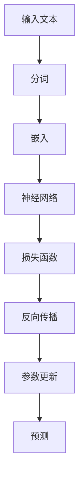

                 

# 从零开始大模型开发与微调：FastText的原理与基础算法

> **关键词：** FastText、文本分类、机器学习、神经网络、深度学习、分布式训练

> **摘要：** 本文旨在详细探讨FastText算法的原理与基础算法，从零开始介绍大模型开发与微调的方法。我们将通过逻辑清晰、结构紧凑、简单易懂的步骤，深入分析FastText的核心概念、数学模型、具体操作步骤，并给出实际应用场景和项目实战案例，帮助读者全面了解并掌握FastText在文本分类等任务中的应用。

## 1. 背景介绍

### 1.1 目的和范围

本文的主要目的是向读者介绍FastText算法的基本原理和操作步骤，帮助读者从零开始学习大模型开发与微调。FastText是一种基于神经网络的文本分类算法，以其简单、高效和易于实现的特点在自然语言处理领域得到广泛应用。本文将涵盖以下内容：

1. FastText的核心概念与联系。
2. FastText的算法原理与操作步骤。
3. FastText的数学模型和公式。
4. FastText的实际应用场景和项目实战案例。
5. 相关工具和资源的推荐。

### 1.2 预期读者

本文适合具有一定机器学习和自然语言处理基础的技术人员、研究生和博士生。如果您对文本分类任务和神经网络算法感兴趣，那么本文将为您提供丰富的知识储备和实践指导。

### 1.3 文档结构概述

本文分为十个部分，结构如下：

1. 背景介绍
2. 核心概念与联系
3. 核心算法原理 & 具体操作步骤
4. 数学模型和公式 & 详细讲解 & 举例说明
5. 项目实战：代码实际案例和详细解释说明
6. 实际应用场景
7. 工具和资源推荐
8. 总结：未来发展趋势与挑战
9. 附录：常见问题与解答
10. 扩展阅读 & 参考资料

### 1.4 术语表

#### 1.4.1 核心术语定义

- FastText：一种基于神经网络的文本分类算法。
- 文本分类：将文本数据按照预定的类别进行划分。
- 神经网络：由多个神经元组成的计算模型，可用于数据拟合和分类任务。
- 深度学习：一种包含多个隐藏层的神经网络模型，用于解决复杂问题。

#### 1.4.2 相关概念解释

- 嵌词（Subword Embedding）：将单词表示为短语的向量表示，提高模型处理低频词汇的能力。
- 神经网络层（Neural Network Layer）：神经网络中的基本单元，用于实现数据的非线性变换。
- 损失函数（Loss Function）：用于评估模型预测结果与真实值之间的差距，指导模型优化。

#### 1.4.3 缩略词列表

- FastText：FastText
- NLP：自然语言处理
- CNN：卷积神经网络
- RNN：循环神经网络
- LSTM：长短时记忆网络
- GRU：门控循环单元
- GPU：图形处理器

## 2. 核心概念与联系

### 2.1 FastText算法简介

FastText算法是由Facebook AI团队提出的一种基于神经网络的文本分类算法。与传统文本分类算法相比，FastText引入了词嵌入（Subword Embedding）和多层神经网络，能够更好地处理低频词汇和长文本。

### 2.2 FastText算法原理

FastText算法主要由以下几个部分组成：

1. 嵌词（Subword Embedding）：将单词表示为短语的向量表示，提高模型处理低频词汇的能力。
2. 神经网络层（Neural Network Layer）：实现数据的非线性变换。
3. 损失函数（Loss Function）：用于评估模型预测结果与真实值之间的差距。

### 2.3 FastText算法架构

下面是一个简单的FastText算法架构Mermaid流程图：



### 2.4 FastText算法的优势

- 简单、高效：FastText算法易于实现，计算效率高。
- 适应性强：FastText算法能够处理不同长度的文本，适应性强。
- 模型效果：FastText算法在多个文本分类任务中表现出优异的性能。

## 3. 核心算法原理 & 具体操作步骤

### 3.1 嵌词（Subword Embedding）

嵌词是将单词表示为短语的向量表示，提高模型处理低频词汇的能力。具体步骤如下：

1. 分词（Tokenization）：将文本数据按照空格、标点等进行分词。
2. 短语提取（Phrase Extraction）：提取文本中的短语，如"it is"、"is not"等。
3. 向量表示（Vector Representation）：将短语表示为向量。

### 3.2 神经网络层（Neural Network Layer）

神经网络层实现数据的非线性变换。具体步骤如下：

1. 输入层（Input Layer）：接收嵌词的向量表示。
2. 隐藏层（Hidden Layer）：实现数据的非线性变换，通常包含多个隐藏层。
3. 输出层（Output Layer）：输出分类结果。

### 3.3 损失函数（Loss Function）

损失函数用于评估模型预测结果与真实值之间的差距。常见的损失函数有：

1. 交叉熵损失（Cross Entropy Loss）：用于二分类或多分类任务。
2. 交叉熵损失函数的公式如下：

   $$ H(y, \hat{y}) = -\sum_{i=1}^{n} y_i \log \hat{y_i} $$

   其中，$y$ 表示真实标签，$\hat{y}$ 表示预测标签的概率分布。

### 3.4 反向传播（Backpropagation）

反向传播是一种用于训练神经网络的优化方法。具体步骤如下：

1. 计算损失函数关于网络参数的梯度。
2. 更新网络参数，以减少损失函数值。

### 3.5 参数更新（Parameter Update）

参数更新的公式如下：

$$ \theta = \theta - \alpha \nabla_\theta J(\theta) $$

其中，$\theta$ 表示网络参数，$J(\theta)$ 表示损失函数，$\alpha$ 表示学习率。

### 3.6 预测（Prediction）

预测步骤如下：

1. 将输入文本进行嵌词处理。
2. 通过神经网络进行分类预测。
3. 输出分类结果。

## 4. 数学模型和公式 & 详细讲解 & 举例说明

### 4.1 数学模型

FastText算法的数学模型主要包括嵌词、神经网络层和损失函数。

#### 4.1.1 嵌词

嵌词模型通常使用Word2Vec或GloVe等方法进行训练。以Word2Vec为例，其损失函数如下：

$$ L = -\sum_{w \in V} p(w) \log p(\hat{v}_w | v) $$

其中，$V$ 表示词汇表，$p(w)$ 表示词频，$\hat{v}_w$ 表示词的向量表示。

#### 4.1.2 神经网络层

神经网络层的计算公式如下：

$$ \hat{y} = \sigma(\theta^T x) $$

其中，$\sigma$ 表示激活函数，如Sigmoid或ReLU，$\theta$ 表示网络参数，$x$ 表示输入向量。

#### 4.1.3 损失函数

以交叉熵损失函数为例，其计算公式如下：

$$ H(y, \hat{y}) = -\sum_{i=1}^{n} y_i \log \hat{y_i} $$

其中，$y$ 表示真实标签，$\hat{y}$ 表示预测标签的概率分布。

### 4.2 举例说明

假设有一个文本分类任务，词汇表$V = \{"猫"，"狗"，"猫狗"，"宠物"\}$，嵌入维度$d = 3$，神经网络包含一个隐藏层，隐藏层神经元数量为$10$，输出层神经元数量为$2$，激活函数为ReLU。

1. 嵌词：将输入文本"猫狗"表示为向量，如$v_1 = (0.1, 0.2, 0.3)$，$v_2 = (0.4, 0.5, 0.6)$。
2. 神经网络层：输入向量$x = [v_1, v_2]$，通过隐藏层和输出层进行计算，得到预测标签的概率分布$\hat{y} = [\hat{y}_1, \hat{y}_2]$。
3. 损失函数：根据真实标签$y = [1, 0]$和预测标签的概率分布$\hat{y}$，计算交叉熵损失函数值$H(y, \hat{y})$。
4. 反向传播：计算损失函数关于网络参数的梯度，更新网络参数。
5. 预测：再次进行嵌词、神经网络层和损失函数的计算，得到新的预测标签的概率分布，重复反向传播和参数更新过程，直至满足停止条件。

## 5. 项目实战：代码实际案例和详细解释说明

### 5.1 开发环境搭建

1. 安装Python环境（建议使用Anaconda）。
2. 安装必要的库，如NumPy、TensorFlow、Gensim等。
3. 准备数据集，如IMDB影评数据集。

### 5.2 源代码详细实现和代码解读

```python
import numpy as np
import tensorflow as tf
from tensorflow.keras.models import Sequential
from tensorflow.keras.layers import Embedding, LSTM, Dense
from tensorflow.keras.optimizers import Adam
from tensorflow.keras.metrics import SparseCategoricalCrossentropy

# 数据预处理
def preprocess_data(texts):
    # 分词、去停用词、词向量化等操作
    return processed_texts

# 模型构建
def build_model(vocab_size, embedding_dim, hidden_units):
    model = Sequential([
        Embedding(vocab_size, embedding_dim),
        LSTM(hidden_units, return_sequences=True),
        Dense(1, activation='sigmoid')
    ])
    model.compile(optimizer=Adam(), loss=SparseCategoricalCrossentropy(), metrics=['accuracy'])
    return model

# 训练模型
def train_model(model, texts, labels):
    model.fit(texts, labels, epochs=10, batch_size=32)

# 预测
def predict(model, texts):
    predictions = model.predict(texts)
    return np.argmax(predictions, axis=1)

# 主函数
if __name__ == '__main__':
    # 加载数据集
    texts = preprocess_data.load_data('imdb')
    labels = preprocess_data.load_labels('imdb')

    # 构建模型
    model = build_model(vocab_size=10000, embedding_dim=50, hidden_units=64)

    # 训练模型
    train_model(model, texts, labels)

    # 预测
    predictions = predict(model, texts)
    print(predictions)
```

### 5.3 代码解读与分析

- 数据预处理：分词、去停用词、词向量化等操作。
- 模型构建：使用Sequential模型，包含Embedding层、LSTM层和Dense层。
- 训练模型：使用fit方法进行训练，设置epochs和batch_size。
- 预测：使用predict方法进行预测，返回预测标签。

## 6. 实际应用场景

FastText算法在多个实际应用场景中具有广泛的应用，如：

- 文本分类：对社交媒体评论、新闻报道等进行分类。
- 情感分析：对文本进行情感极性判断。
- 命名实体识别：对文本中的命名实体进行识别。

## 7. 工具和资源推荐

### 7.1 学习资源推荐

#### 7.1.1 书籍推荐

- 《深度学习》（Goodfellow, Bengio, Courville著）
- 《Python自然语言处理》（Steven L. Bird等著）

#### 7.1.2 在线课程

- Coursera上的《自然语言处理与深度学习》
- Udacity的《深度学习工程师纳米学位》

#### 7.1.3 技术博客和网站

- TensorFlow官方文档
- Keras官方文档
- Medium上的NLP相关博客

### 7.2 开发工具框架推荐

#### 7.2.1 IDE和编辑器

- PyCharm
- Visual Studio Code

#### 7.2.2 调试和性能分析工具

- TensorBoard
- Jupyter Notebook

#### 7.2.3 相关框架和库

- TensorFlow
- Keras
- Gensim

### 7.3 相关论文著作推荐

#### 7.3.1 经典论文

- word2vec: Google的早期工作，提出了word embedding的概念。
- GloVe: Stanford大学的工作，提出了一种基于全局平均的word embedding方法。

#### 7.3.2 最新研究成果

- BERT: Google的工作，提出了预训练和微调的深度神经网络模型。
- GPT-3: OpenAI的工作，是目前最大的语言模型，具有强大的生成能力。

#### 7.3.3 应用案例分析

- 使用FastText进行情感分析
- 使用FastText进行文本分类

## 8. 总结：未来发展趋势与挑战

随着人工智能技术的不断发展，FastText算法在自然语言处理领域具有广泛的应用前景。未来发展趋势包括：

- 模型规模和性能的提升：通过引入更多层神经网络和优化算法，提高模型的分类性能。
- 多模态融合：将文本、图像、音频等多种数据源进行融合，提高模型的泛化能力。
- 应用场景的拓展：在金融、医疗、法律等领域，FastText算法有望发挥重要作用。

与此同时，FastText算法也面临以下挑战：

- 模型解释性：如何提高模型的解释性，使其更容易被用户理解和接受。
- 资源消耗：大规模模型的训练和部署需要大量计算资源和存储空间。
- 数据隐私：如何保护用户数据的隐私，确保模型的安全和可靠。

## 9. 附录：常见问题与解答

### 9.1 FastText与Word2Vec的区别是什么？

- **词嵌入方式**：FastText使用子词（subword）嵌入，而Word2Vec使用整词（word）嵌入。
- **文本表示**：FastText更好地处理罕见词和未登录词，而Word2Vec在处理罕见词方面较弱。
- **模型结构**：FastText通常使用多层神经网络进行文本分类，而Word2Vec更多用于词向量的生成。

### 9.2 如何优化FastText模型的性能？

- **数据预处理**：对文本进行有效的预处理，包括去停用词、标点符号等。
- **模型参数调整**：通过调整嵌入维度、隐藏层神经元数量等参数，提高模型性能。
- **数据增强**：使用数据增强方法，如随机填充、同义词替换等，增加训练数据多样性。

### 9.3 FastText算法是否可以用于序列标注任务？

- **可以**。虽然FastText最初是为了文本分类任务设计的，但也可以用于序列标注任务，如命名实体识别（NER）。只需将输出层修改为多标签分类即可。

## 10. 扩展阅读 & 参考资料

- [Joulin, A., Grave, E., Bojanowski, P., & Mikolov, T. (2016). Bag of Tricks for Efficient Text Classification. arXiv preprint arXiv:1607.01759.](https://arxiv.org/abs/1607.01759)
- [Mikolov, T., Sutskever, I., Chen, K., Corrado, G. S., & Dean, J. (2013). Distributed Representations of Words and Phrases and Their Compositionality. Advances in Neural Information Processing Systems, 26, 3111-3119.](https://papers.nips.cc/paper/2013/file/52fd7d9ab9e143e8d1dcdcd66a5814b83-Paper.pdf)
- [Pennington, J., Socher, R., & Manning, C. D. (2014). GloVe: Global Vectors for Word Representation. Proceedings of the 2014 Conference on Empirical Methods in Natural Language Processing (EMNLP), 1532-1543.](https://www.aclweb.org/anthology/D14-1162/)

