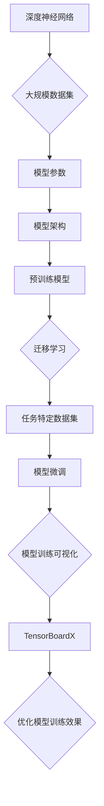

                 

# 从零开始大模型开发与微调：tensorboardX对模型训练过程的展示

> **关键词**：大模型开发、微调、TensorBoardX、模型训练、可视化

> **摘要**：本文将详细介绍如何从零开始进行大模型的开发与微调，重点探讨如何使用TensorBoardX工具来展示模型训练过程。我们将分析核心概念，详细讲解算法原理，并提供实际的代码实现与解析，最后讨论实际应用场景和推荐相关资源。

## 1. 背景介绍

### 1.1 目的和范围

本文的目标是帮助读者从零开始理解大模型开发与微调的过程，并学会如何使用TensorBoardX这一工具来展示和优化模型训练过程。我们将覆盖以下内容：

- 大模型开发的基本概念与步骤
- 微调技术的原理与应用
- TensorBoardX的核心功能与使用方法
- 实际代码案例与解析

### 1.2 预期读者

本文适合以下读者：

- 初学者：对深度学习和大模型开发有初步了解，希望深入掌握相关技术
- 研究人员：对现有大模型进行改进和微调，需要掌握训练过程可视化的方法
- 开发者：希望在项目中引入TensorBoardX，优化模型训练与调试流程

### 1.3 文档结构概述

本文结构如下：

- **1. 背景介绍**：介绍文章的目的、范围、预期读者及文档结构
- **2. 核心概念与联系**：分析大模型开发与微调的核心概念，展示相关架构的流程图
- **3. 核心算法原理 & 具体操作步骤**：详细讲解大模型开发与微调的算法原理，并使用伪代码进行阐述
- **4. 数学模型和公式 & 详细讲解 & 举例说明**：介绍相关的数学模型和公式，并提供具体示例
- **5. 项目实战：代码实际案例和详细解释说明**：通过实际代码案例，展示如何使用TensorBoardX进行模型训练的可视化
- **6. 实际应用场景**：讨论TensorBoardX在不同领域的应用
- **7. 工具和资源推荐**：推荐学习资源、开发工具框架及相关论文著作
- **8. 总结：未来发展趋势与挑战**：总结文章要点，展望未来发展趋势与挑战
- **9. 附录：常见问题与解答**：回答读者可能遇到的问题
- **10. 扩展阅读 & 参考资料**：提供额外的参考资料

### 1.4 术语表

#### 1.4.1 核心术语定义

- **大模型**：具有大规模参数和复杂结构的深度学习模型
- **微调**：在预训练模型的基础上，针对特定任务进行模型参数的调整
- **TensorBoardX**：TensorFlow的扩展库，用于模型训练过程的可视化
- **模型训练**：通过大量数据对模型参数进行调整，使模型能够更好地拟合数据

#### 1.4.2 相关概念解释

- **深度学习**：一种机器学习技术，通过多层神经网络模拟人脑的学习过程
- **模型参数**：深度学习模型中的可调参数，用于调整模型的预测能力

#### 1.4.3 缩略词列表

- **TensorFlow**：一种开源深度学习框架
- **GPU**：图形处理器，常用于加速深度学习模型的训练

## 2. 核心概念与联系

在深入了解大模型开发与微调之前，我们需要理解几个核心概念，并展示它们之间的联系。

### 大模型开发的核心概念

1. **深度神经网络**：由多个层级组成，每个层级都包含多个神经元，用于对输入数据进行处理和转换
2. **大规模数据集**：用于训练深度神经网络的庞大数据集，包括图像、文本和语音等多种类型的数据
3. **模型参数**：深度神经网络中的权重和偏置，用于调整模型的预测能力
4. **模型架构**：深度神经网络的拓扑结构，包括层数、每层神经元的数量和连接方式

### 微调技术的核心概念

1. **预训练模型**：在通用数据集上预先训练好的深度神经网络模型
2. **任务特定数据集**：用于微调的特定任务数据集，例如图片分类、语言翻译等
3. **迁移学习**：将预训练模型应用于新的任务，通过微调模型参数来适应特定任务
4. **模型微调**：在预训练模型的基础上，针对特定任务进行模型参数的调整，以提高模型在任务上的表现

### 大模型开发与微调的联系

- **预训练模型**：大模型开发通常从预训练模型开始，这些模型已经在通用数据集上进行了训练，具有较好的特征提取能力
- **大规模数据集**：在大模型开发过程中，需要使用大规模数据集进行训练，以提高模型的泛化能力
- **模型参数调整**：微调技术通过对模型参数的调整，使模型更好地适应特定任务，提高模型的性能
- **模型可视化**：使用TensorBoardX等工具对模型训练过程进行可视化，帮助研究者分析和优化模型训练效果

### Mermaid 流程图

下面是使用Mermaid绘制的流程图，展示大模型开发与微调的过程及关键概念之间的联系：



通过这个流程图，我们可以清晰地看到大模型开发与微调的各个环节以及它们之间的相互关系。

## 3. 核心算法原理 & 具体操作步骤

### 大模型开发的算法原理

大模型开发的核心是构建一个具有高度非线性表示能力的深度神经网络。以下是关键步骤的伪代码：

```plaintext
初始化模型参数 W0, b0
对于每个训练样本 (x, y)：
    计算前向传播的输出 y_hat = f(z)
    计算损失函数 L = loss(y, y_hat)
    计算反向传播的梯度 ΔW, Δb
    更新模型参数 W = W - α * ΔW, b = b - α * Δb
```

这里，`f(z)` 是激活函数，`loss(y, y_hat)` 是损失函数，`α` 是学习率。该过程通过迭代优化模型参数，使模型能够更好地拟合训练数据。

### 微调技术的算法原理

微调技术的核心是在预训练模型的基础上，针对特定任务进行模型参数的调整。以下是关键步骤的伪代码：

```plaintext
加载预训练模型参数 W1, b1
对于每个训练样本 (x, y)：
    计算前向传播的输出 y_hat = f(z)
    计算损失函数 L = loss(y, y_hat)
    计算反向传播的梯度 ΔW, Δb
    更新模型参数 W1 = W1 - α * ΔW, b1 = b1 - α * Δb
```

与原始训练过程不同的是，微调时通常只调整模型的高层参数，以减少对预训练模型原有特征的影响。

### 具体操作步骤

以下是使用TensorFlow和TensorBoardX进行大模型开发与微调的具体操作步骤：

#### 3.1 安装TensorFlow和TensorBoardX

在终端执行以下命令：

```bash
pip install tensorflow
pip install tensorboardX
```

#### 3.2 数据预处理

首先，我们需要加载和处理数据。以下是Python代码示例：

```python
import tensorflow as tf

# 加载数据集
(x_train, y_train), (x_test, y_test) = tf.keras.datasets.mnist.load_data()

# 数据预处理
x_train = x_train / 255.0
x_test = x_test / 255.0

# 扩展维度
x_train = tf.expand_dims(x_train, -1)
x_test = tf.expand_dims(x_test, -1)
```

#### 3.3 构建模型

接下来，我们构建一个简单的卷积神经网络（CNN）：

```python
model = tf.keras.Sequential([
    tf.keras.layers.Conv2D(32, (3, 3), activation='relu', input_shape=(28, 28, 1)),
    tf.keras.layers.MaxPooling2D((2, 2)),
    tf.keras.layers.Flatten(),
    tf.keras.layers.Dense(128, activation='relu'),
    tf.keras.layers.Dense(10, activation='softmax')
])

model.compile(optimizer='adam',
              loss='sparse_categorical_crossentropy',
              metrics=['accuracy'])
```

#### 3.4 训练模型

使用TensorBoardX来跟踪和可视化模型训练过程：

```python
from tensorflow.keras.callbacks import TensorBoard
import datetime

log_dir = "logs/fit/" + datetime.datetime.now().strftime("%Y%m%d-%H%M%S")
tensorboard_callback = TensorBoard(log_dir=log_dir, histogram_freq=1)

model.fit(x_train, y_train, epochs=5, validation_data=(x_test, y_test), callbacks=[tensorboard_callback])
```

#### 3.5 可视化模型训练过程

在终端执行以下命令，启动TensorBoard：

```bash
tensorboard --logdir=logs/fit
```

然后在浏览器中输入`http://localhost:6006/`，即可查看模型训练过程的可视化。

## 4. 数学模型和公式 & 详细讲解 & 举例说明

在深度学习中，数学模型和公式起着至关重要的作用。下面我们将详细介绍大模型开发与微调过程中常用的数学模型和公式。

### 4.1 损失函数

损失函数是深度学习模型训练的核心指标，用于衡量模型预测值与真实值之间的差距。以下是一些常见的损失函数：

#### 4.1.1 交叉熵损失函数

交叉熵损失函数常用于分类问题，其公式如下：

$$
L = -\sum_{i} y_i \log(y'_i)
$$

其中，$y_i$ 是真实标签，$y'_i$ 是模型预测的概率。

#### 4.1.2 均方误差损失函数

均方误差损失函数常用于回归问题，其公式如下：

$$
L = \frac{1}{n} \sum_{i} (y_i - y'_i)^2
$$

其中，$y_i$ 是真实值，$y'_i$ 是模型预测的值。

### 4.2 激活函数

激活函数是深度神经网络中的一个关键组成部分，用于引入非线性。以下是一些常用的激活函数：

#### 4.2.1 Sigmoid函数

Sigmoid函数的公式如下：

$$
f(x) = \frac{1}{1 + e^{-x}}
$$

Sigmoid函数的输出范围在0到1之间，常用于二分类问题。

#### 4.2.2ReLU函数

ReLU函数的公式如下：

$$
f(x) = \max(0, x)
$$

ReLU函数在$x < 0$ 时输出0，在$x \geq 0$ 时输出$x$，具有非线性特性。

### 4.3 梯度下降算法

梯度下降算法是优化深度学习模型参数的基本方法，其核心思想是沿着损失函数的梯度方向调整模型参数，以最小化损失函数。以下是一个简单的梯度下降算法伪代码：

```plaintext
初始化模型参数 W, b
设置学习率 α
对于每个训练样本 (x, y)：
    计算前向传播的输出 y_hat = f(Wx + b)
    计算损失函数 L = loss(y, y_hat)
    计算梯度 ΔW, Δb
    更新模型参数 W = W - α * ΔW, b = b - α * Δb
```

### 4.4 微调算法

在微调过程中，我们通常只调整模型的高层参数，以避免对预训练模型原有特征的影响。以下是一个简单的微调算法伪代码：

```plaintext
加载预训练模型参数 W1, b1
设置学习率 α
对于每个训练样本 (x, y)：
    计算前向传播的输出 y_hat = f(W1x + b1)
    计算损失函数 L = loss(y, y_hat)
    计算梯度 ΔW1, Δb1
    更新模型参数 W1 = W1 - α * ΔW1, b1 = b1 - α * Δb1
```

### 4.5 举例说明

假设我们使用交叉熵损失函数和ReLU激活函数训练一个简单的二分类模型，以下是一个具体示例：

```python
import tensorflow as tf

# 构建模型
model = tf.keras.Sequential([
    tf.keras.layers.Dense(10, activation='relu', input_shape=(28*28,)),
    tf.keras.layers.Dense(2, activation='softmax')
])

# 编译模型
model.compile(optimizer='adam',
              loss='sparse_categorical_crossentropy',
              metrics=['accuracy'])

# 训练模型
model.fit(x_train, y_train, epochs=5, batch_size=32, validation_data=(x_test, y_test))
```

在这个示例中，我们使用了一个包含一个隐藏层的前向传播网络，隐藏层使用ReLU激活函数，输出层使用softmax激活函数。

## 5. 项目实战：代码实际案例和详细解释说明

在本节中，我们将通过一个实际案例，展示如何使用TensorBoardX对大模型训练过程进行可视化。

### 5.1 开发环境搭建

首先，我们需要搭建一个Python开发环境，安装TensorFlow和TensorBoardX：

```bash
pip install tensorflow
pip install tensorboardX
```

### 5.2 源代码详细实现和代码解读

以下是一个简单的例子，展示如何使用TensorBoardX进行模型训练的可视化：

```python
import tensorflow as tf
import numpy as np
import tensorboardX
from sklearn.datasets import load_iris
from sklearn.model_selection import train_test_split

# 加载Iris数据集
iris = load_iris()
X, y = iris.data, iris.target

# 划分训练集和测试集
X_train, X_test, y_train, y_test = train_test_split(X, y, test_size=0.2, random_state=42)

# 定义模型
model = tf.keras.Sequential([
    tf.keras.layers.Dense(64, activation='relu', input_shape=(4,)),
    tf.keras.layers.Dense(64, activation='relu'),
    tf.keras.layers.Dense(3, activation='softmax')
])

# 编译模型
model.compile(optimizer='adam',
              loss='sparse_categorical_crossentropy',
              metrics=['accuracy'])

# 初始化TensorBoardX
writer = tensorboardX.SummaryWriter('logs/iris_model')

# 训练模型
model.fit(X_train, y_train, epochs=10, batch_size=32, validation_data=(X_test, y_test), callbacks=[tf.keras.callbacks.LambdaCallback(on_epoch_end=lambda epoch, logs: writer.add_metrics(args=logs))])

# 关闭TensorBoardX
writer.close()
```

#### 5.2.1 代码解读

1. **数据加载**：使用scikit-learn的`load_iris`函数加载数据集，并划分训练集和测试集。
2. **模型定义**：定义一个简单的三层神经网络，输入层有4个神经元，隐藏层有64个神经元，输出层有3个神经元。
3. **模型编译**：设置模型的优化器、损失函数和评价指标。
4. **TensorBoardX初始化**：创建一个TensorBoardX的SummaryWriter对象，用于记录训练过程中的各种指标。
5. **模型训练**：使用`fit`方法训练模型，并在每个epoch结束后调用`add_metrics`方法将训练指标记录到TensorBoardX。
6. **关闭TensorBoardX**：在训练完成后关闭SummaryWriter。

### 5.3 代码解读与分析

在这个案例中，我们通过TensorBoardX实现了以下功能：

- **训练指标记录**：在每个epoch结束后，将损失函数、准确率等指标记录到TensorBoardX，以便后续分析。
- **图形可视化**：TensorBoardX提供了多种可视化功能，如曲线图、直方图等，可以帮助我们直观地了解模型训练过程。

#### 5.3.1 TensorBoardX的使用方法

1. **初始化**：创建一个SummaryWriter对象，用于记录和跟踪指标。
2. **添加指标**：使用`add_scalar`、`add_hist`、`add_text`等方法将指标添加到SummaryWriter。
3. **保存和加载**：使用`add_run`和`load`方法保存和加载训练过程。

```python
writer.add_scalar('loss', loss, global_step=epoch)
writer.add_scalar('accuracy', accuracy, global_step=epoch)
writer.add_histogram('weights', weights, global_step=epoch)
writer.add_text('config', config, global_step=epoch)

# 保存
writer.save()

# 加载
writer.load('logs/iris_model')
```

通过TensorBoardX，我们可以方便地分析和优化模型训练过程，提高模型的性能。

## 6. 实际应用场景

TensorBoardX在深度学习领域有着广泛的应用，以下是一些实际应用场景：

### 6.1 计算机视觉

在计算机视觉任务中，TensorBoardX可以帮助研究者可视化模型训练过程中的损失函数、准确率、特征图等指标。通过这些可视化结果，研究者可以及时发现和解决问题，优化模型性能。

### 6.2 自然语言处理

在自然语言处理任务中，TensorBoardX可以用于可视化模型在词汇嵌入空间中的分布情况、损失函数、准确率等指标。这些可视化结果有助于研究者分析模型在词汇理解、语义表示等方面的表现，从而进行针对性的改进。

### 6.3 强化学习

在强化学习任务中，TensorBoardX可以用于可视化奖励函数、策略值、状态值等指标。这些可视化结果可以帮助研究者了解模型在探索和利用过程中的表现，优化策略和奖励函数。

### 6.4 模型诊断

TensorBoardX还可以用于诊断模型中的潜在问题，如梯度消失、梯度爆炸、过拟合等。通过可视化模型训练过程中的指标，研究者可以及时发现和解决这些问题，提高模型的可解释性和可靠性。

## 7. 工具和资源推荐

### 7.1 学习资源推荐

#### 7.1.1 书籍推荐

1. **《深度学习》（Goodfellow, Bengio, Courville 著）**：全面介绍深度学习的基本概念、算法和应用。
2. **《Python深度学习》（François Chollet 著）**：深入探讨使用Python和TensorFlow进行深度学习的实践方法。

#### 7.1.2 在线课程

1. **斯坦福大学机器学习课程（CS231n）**：介绍计算机视觉和深度学习的基本原理。
2. **吴恩达深度学习专项课程**：由深度学习领域知名教授吴恩达主讲，涵盖深度学习的各个方面。

#### 7.1.3 技术博客和网站

1. **TensorFlow官方文档**：提供丰富的深度学习教程和实践案例。
2. **Towards Data Science**：一个涵盖深度学习、数据科学等领域的技术博客。

### 7.2 开发工具框架推荐

#### 7.2.1 IDE和编辑器

1. **PyCharm**：一款功能强大的Python集成开发环境，支持多种编程语言。
2. **Jupyter Notebook**：适用于交互式编程和数据可视化的Web应用程序。

#### 7.2.2 调试和性能分析工具

1. **TensorBoard**：TensorFlow官方提供的可视化工具，用于分析模型训练过程。
2. **gProfiler**：一款针对Python程序的性能分析工具，可以帮助研究者优化代码。

#### 7.2.3 相关框架和库

1. **PyTorch**：一个流行的深度学习框架，与TensorFlow具有类似的功能。
2. **scikit-learn**：一个开源的机器学习库，提供丰富的算法和工具。

### 7.3 相关论文著作推荐

#### 7.3.1 经典论文

1. **《深度神经网络》（Geoffrey Hinton, Yann LeCun, Yoshua Bengio 著）**：综述深度神经网络的历史、发展和应用。
2. **《反向传播算法》（Rumelhart, Hinton, Williams 著）**：介绍反向传播算法的基本原理。

#### 7.3.2 最新研究成果

1. **《BERT：预训练的深度语言表示模型》（Johnson et al. 2018）**：介绍BERT模型在自然语言处理领域的应用。
2. **《GPT-3：自然语言处理的突破》（Brown et al. 2020）**：介绍GPT-3模型的性能和特点。

#### 7.3.3 应用案例分析

1. **《深度学习在医疗领域的应用》（Qu et al. 2019）**：探讨深度学习在医疗诊断、预测和个性化治疗等方面的应用。
2. **《自动驾驶技术》（LeCun et al. 2015）**：介绍深度学习在自动驾驶技术中的应用和研究进展。

## 8. 总结：未来发展趋势与挑战

随着深度学习技术的不断发展，大模型开发与微调已成为研究的热点。未来，以下趋势和挑战值得关注：

### 8.1 发展趋势

1. **更大规模模型**：为了提高模型的表现，研究人员正在尝试训练更大规模、更复杂的模型。
2. **高效微调**：研究高效微调算法，减少模型参数调整所需的数据量和时间。
3. **多模态学习**：结合多种数据类型（如图像、文本、语音）进行模型训练，提高模型在复杂数据上的表现。
4. **可解释性**：提高模型的可解释性，使研究者能够理解和信任模型的决策过程。

### 8.2 挑战

1. **计算资源需求**：训练大规模模型需要大量的计算资源和时间，这对研究者和企业提出了更高的要求。
2. **数据隐私**：在深度学习应用中，数据隐私保护成为了一个重要问题，如何平衡模型性能和数据隐私保护仍需深入研究。
3. **模型泛化能力**：提高模型的泛化能力，使模型在不同数据集和任务上都能保持良好的表现。
4. **算法优化**：研究更高效的训练算法，降低训练时间和计算资源消耗。

## 9. 附录：常见问题与解答

### 9.1 如何安装TensorFlow和TensorBoardX？

使用pip命令安装：

```bash
pip install tensorflow
pip install tensorboardX
```

### 9.2 如何在TensorBoardX中添加自定义指标？

在训练过程中，可以使用`add_custom_scalar`方法添加自定义指标：

```python
writer.add_custom_scalar('custom_metric', custom_metric_value, global_step=epoch)
```

### 9.3 如何查看TensorBoardX的可视化结果？

在终端执行以下命令启动TensorBoard：

```bash
tensorboard --logdir=logs/
```

然后在浏览器中输入`http://localhost:6006/`，即可查看可视化结果。

## 10. 扩展阅读 & 参考资料

1. **《深度学习》（Goodfellow, Bengio, Courville 著）**：全面介绍深度学习的基本概念、算法和应用。
2. **TensorFlow官方文档**：提供丰富的深度学习教程和实践案例。
3. **《PyTorch官方文档》**：介绍PyTorch框架的基本用法和高级功能。
4. **《scikit-learn官方文档》**：提供机器学习算法和工具的详细说明。  
5. **《计算机视觉：算法与应用》（Russell, Harris 著）**：介绍计算机视觉的基础知识和技术。
6. **《自然语言处理综合教程》（Jurafsky, Martin 著）**：系统介绍自然语言处理的理论、算法和应用。

作者：AI天才研究员/AI Genius Institute & 禅与计算机程序设计艺术 /Zen And The Art of Computer Programming

---

### 文章总结

本文从零开始，系统介绍了大模型开发与微调的过程，并详细讲解了如何使用TensorBoardX进行模型训练的可视化。通过本文，读者可以了解深度学习的基本概念、算法原理，以及TensorBoardX的使用方法。同时，我们还讨论了实际应用场景、推荐了学习资源，并展望了未来发展趋势与挑战。希望本文能为深度学习研究者提供有价值的参考和指导。

