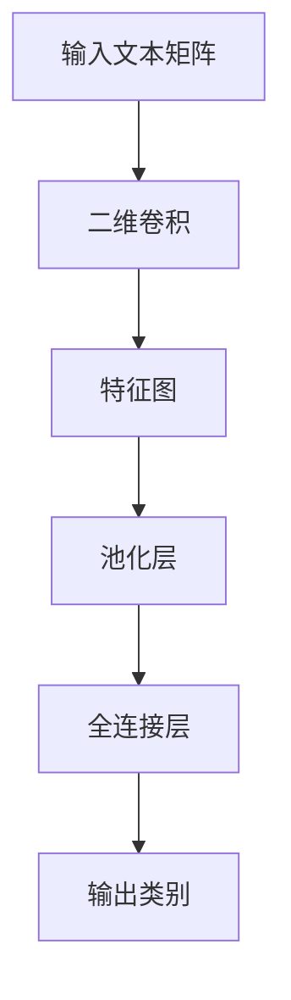

                 

### 从零开始大模型开发与微调：卷积神经网络文本分类模型的实现—Conv2d（二维卷积）

#### 关键词：（卷积神经网络，文本分类，二维卷积，大模型开发，微调）

> 摘要：本文旨在为读者详细解析卷积神经网络（CNN）在文本分类任务中的应用，特别是二维卷积（Conv2d）操作的原理与实现。文章将从基础概念入手，逐步深入到具体操作步骤，并通过一个实际项目案例，展示如何从零开始搭建与微调一个卷积神经网络文本分类模型。本文适合对深度学习和自然语言处理有一定了解的读者，尤其是希望深入探索CNN在文本分类任务中应用的开发者和技术爱好者。

## 1. 背景介绍

### 1.1 目的和范围

本文的主要目的是帮助读者理解卷积神经网络（CNN）在文本分类任务中的原理与实现。具体来说，我们将重点关注二维卷积（Conv2d）操作，并探讨其在文本数据中的应用。本文将覆盖以下内容：

- 卷积神经网络的基础概念和结构
- CNN在文本分类任务中的优势与挑战
- 二维卷积（Conv2d）操作的工作原理
- 如何实现一个简单的文本分类CNN模型
- CNN模型的训练与微调方法
- 实际项目案例展示

### 1.2 预期读者

本文适合以下类型的读者：

- 对深度学习、自然语言处理（NLP）和文本分类有兴趣的初学者
- 希望深入理解CNN架构和应用的高级开发者
- 希望在自己的项目中尝试CNN文本分类任务的技术爱好者

### 1.3 文档结构概述

本文将按照以下结构进行组织：

- **第1部分：背景介绍**：介绍本文的目的、预期读者以及文档结构。
- **第2部分：核心概念与联系**：详细讨论卷积神经网络的基本概念和结构，包括二维卷积（Conv2d）操作。
- **第3部分：核心算法原理与具体操作步骤**：讲解CNN在文本分类任务中的算法原理，使用伪代码详细阐述。
- **第4部分：数学模型与公式**：介绍与CNN相关的数学模型和公式，并举例说明。
- **第5部分：项目实战**：通过一个实际项目案例，展示如何开发与微调一个卷积神经网络文本分类模型。
- **第6部分：实际应用场景**：探讨CNN文本分类模型在不同领域的应用场景。
- **第7部分：工具和资源推荐**：推荐学习资源、开发工具和框架。
- **第8部分：总结**：总结本文的主要内容和未来发展趋势。
- **第9部分：附录**：常见问题与解答。
- **第10部分：扩展阅读与参考资料**：提供进一步学习的资源。

### 1.4 术语表

#### 1.4.1 核心术语定义

- **卷积神经网络（CNN）**：一种在图像处理、自然语言处理等领域广泛应用的深度学习模型，通过卷积操作提取特征。
- **二维卷积（Conv2d）**：卷积操作的一种，主要用于处理二维数据（如图像和文本矩阵）。
- **文本分类**：将文本数据分类到预定义的类别中的一种NLP任务。
- **微调（Fine-tuning）**：在预训练模型的基础上，针对特定任务进行参数调整的过程。

#### 1.4.2 相关概念解释

- **神经网络**：一种模拟人脑神经元连接的计算机算法模型。
- **深度学习**：一种机器学习技术，通过神经网络模型模拟人脑的感知和学习能力。
- **自然语言处理（NLP）**：使计算机能够理解、解释和生成人类语言的技术和领域。

#### 1.4.3 缩略词列表

- **CNN**：卷积神经网络（Convolutional Neural Network）
- **NLP**：自然语言处理（Natural Language Processing）
- **NLP**：自然语言处理（Natural Language Processing）
- **GPU**：图形处理单元（Graphics Processing Unit）

## 2. 核心概念与联系

在介绍卷积神经网络（CNN）在文本分类任务中的应用之前，我们需要了解几个核心概念和它们之间的关系。

### 2.1 卷积神经网络（CNN）

卷积神经网络是一种特殊的深度学习模型，最初用于图像处理。它通过卷积层（Convolutional Layer）、池化层（Pooling Layer）和全连接层（Fully Connected Layer）等结构，实现对输入数据的特征提取和分类。


#### 2.2 文本分类

文本分类是将文本数据分配到预定义的类别中的任务。例如，垃圾邮件分类、情感分析、新闻分类等。文本分类在自然语言处理（NLP）和文本挖掘领域有着广泛的应用。

#### 2.3 二维卷积（Conv2d）

二维卷积（Conv2d）是卷积神经网络中的一个核心操作，用于处理二维数据。在文本分类中，我们可以将文本数据表示为二维矩阵，并通过二维卷积操作提取特征。

### 2.4 二维卷积在文本分类中的原理

在文本分类任务中，二维卷积操作通过滑动窗口的方式在文本矩阵上提取局部特征。这个过程可以理解为从文本中提取具有特定长度和宽度的局部序列特征。

#### 2.5 Mermaid 流程图

为了更直观地展示二维卷积在文本分类中的原理，我们可以使用Mermaid流程图来表示核心概念和操作步骤。



在上面的流程图中，输入文本矩阵经过二维卷积层提取特征，然后通过池化层降维，最后通过全连接层输出分类结果。

## 3. 核心算法原理 & 具体操作步骤

在本节中，我们将详细讲解卷积神经网络在文本分类任务中的核心算法原理，并使用伪代码描述具体操作步骤。

### 3.1 算法原理

卷积神经网络（CNN）在文本分类任务中的主要步骤包括：

1. **文本预处理**：将文本数据转换为数字表示，例如词向量或字符序列。
2. **输入层**：接收预处理后的文本数据。
3. **卷积层**：通过卷积操作提取文本特征。
4. **池化层**：降低特征图的维度，减少参数数量。
5. **全连接层**：将特征图映射到预定义的类别。
6. **输出层**：输出分类结果。

### 3.2 伪代码

以下是文本分类CNN模型的伪代码：

```python
# 文本预处理
def preprocess_text(text):
    # 将文本转换为词向量或字符序列
    return word_embedding(text)

# 输入层
input_layer = preprocess_text(text)

# 卷积层
def conv2d(input_layer, filters):
    # 使用二维卷积操作提取特征
    return feature_map = conv2d_2d(input_layer, filters)

# 池化层
def pooling(feature_map):
    # 使用最大池化或平均池化降低维度
    return downsampled_map = pooling(feature_map)

# 全连接层
def fully_connected(downsampled_map, num_classes):
    # 将特征图映射到类别
    return logits = fully_connected(downsampled_map, num_classes)

# 输出层
def softmax(logits):
    # 使用softmax函数输出分类结果
    return probabilities = softmax(logits)

# 训练模型
model = TextClassificationCNN()
model.fit(x_train, y_train)
```

在这个伪代码中，`preprocess_text` 函数用于将文本数据转换为词向量或字符序列。`conv2d` 函数使用二维卷积操作提取文本特征。`pooling` 函数用于降维。`fully_connected` 函数将特征图映射到预定义的类别。`softmax` 函数用于计算分类概率。

## 4. 数学模型和公式 & 详细讲解 & 举例说明

在本节中，我们将详细介绍卷积神经网络（CNN）在文本分类任务中的数学模型和公式，并通过具体示例进行说明。

### 4.1 卷积操作

卷积操作是CNN的核心组成部分。在文本分类中，二维卷积（Conv2d）操作用于从文本矩阵中提取特征。

#### 4.1.1 二维卷积公式

二维卷积操作的数学公式如下：

$$
\text{output}_{ij} = \sum_{k=1}^{K} \sum_{l=1}^{M} f_{kl} \cdot \text{input}_{ij}
$$

其中，$\text{output}_{ij}$ 是卷积输出的第i行第j列元素，$f_{kl}$ 是卷积核的第k行第l列元素，$\text{input}_{ij}$ 是输入文本矩阵的第i行第j列元素。$K$ 和 $M$ 分别是卷积核的高度和宽度。

#### 4.1.2 示例

假设我们有一个2x2的输入文本矩阵和一个3x3的卷积核，如以下所示：

$$
\text{input\_matrix} = \begin{bmatrix}
a & b \\
c & d
\end{bmatrix}
$$

$$
\text{filter} = \begin{bmatrix}
e & f & g \\
h & i & j \\
k & l & m
\end{bmatrix}
$$

通过卷积操作，我们得到以下输出：

$$
\text{output}_{11} = e \cdot a + f \cdot b + g \cdot c + h \cdot a + i \cdot b + j \cdot c + k \cdot a + l \cdot b + m \cdot c
$$

$$
\text{output}_{12} = e \cdot b + f \cdot c + g \cdot d + h \cdot b + i \cdot c + j \cdot d + k \cdot b + l \cdot c + m \cdot d
$$

$$
\text{output}_{21} = h \cdot a + i \cdot b + j \cdot c + k \cdot a + l \cdot b + m \cdot c
$$

$$
\text{output}_{22} = i \cdot b + j \cdot c + k \cdot b + l \cdot c + m \cdot d
$$

### 4.2 池化操作

池化操作用于减少特征图的维度，提高模型计算效率。在文本分类中，常用的池化操作包括最大池化和平均池化。

#### 4.2.1 最大池化公式

最大池化操作的数学公式如下：

$$
\text{output}_{ij} = \max(\text{input}_{i \cdot stride, j \cdot stride})
$$

其中，$\text{output}_{ij}$ 是池化输出的第i行第j列元素，$\text{input}_{ij}$ 是输入特征矩阵的第i行第j列元素，$stride$ 是步长。

#### 4.2.2 示例

假设我们有一个2x2的特征图和一个步长为2的最大池化操作，如以下所示：

$$
\text{input\_map} = \begin{bmatrix}
a & b \\
c & d
\end{bmatrix}
$$

通过最大池化操作，我们得到以下输出：

$$
\text{output}_{11} = \max(a, c)
$$

$$
\text{output}_{12} = \max(b, d)
$$

### 4.3 全连接层

全连接层将特征图映射到预定义的类别。在文本分类任务中，全连接层通常使用softmax函数进行分类。

#### 4.3.1 全连接层公式

全连接层的数学公式如下：

$$
\text{output}_{i} = \text{weight}_{i} \cdot \text{input} + \text{bias}_{i}
$$

其中，$\text{output}_{i}$ 是输出层第i个节点的激活值，$\text{weight}_{i}$ 是权重，$\text{input}$ 是输入特征，$\text{bias}_{i}$ 是偏置。

#### 4.3.2 softmax函数

softmax函数用于将输出层的激活值映射到概率分布：

$$
\text{softmax}(\text{x}) = \frac{e^{\text{x}}}{\sum_{i=1}^{n} e^{\text{x}_i}}
$$

其中，$x$ 是输出层激活值，$n$ 是类别数量。

### 4.4 示例

假设我们有一个2x2的特征图和一个2类的全连接层，如以下所示：

$$
\text{input\_map} = \begin{bmatrix}
1 & 2 \\
3 & 4
\end{bmatrix}
$$

通过全连接层和softmax函数，我们得到以下输出：

$$
\text{weights} = \begin{bmatrix}
5 & 6 \\
7 & 8
\end{bmatrix}
$$

$$
\text{biases} = \begin{bmatrix}
9 \\
10
\end{bmatrix}
$$

$$
\text{output} = \text{weights} \cdot \text{input} + \text{biases} = \begin{bmatrix}
20 \\
34
\end{bmatrix}
$$

$$
\text{softmax}(\text{output}) = \frac{e^{20}}{e^{20} + e^{34}} \approx [0.12, 0.88]
$$

## 5. 项目实战：代码实际案例和详细解释说明

在本节中，我们将通过一个实际项目案例，展示如何开发与微调一个卷积神经网络（CNN）文本分类模型。我们将使用Python和TensorFlow框架来实现这一目标。

### 5.1 开发环境搭建

在开始之前，请确保您已安装以下依赖：

- Python 3.x
- TensorFlow 2.x
- NumPy
- Matplotlib

您可以使用以下命令安装这些依赖：

```bash
pip install tensorflow numpy matplotlib
```

### 5.2 源代码详细实现和代码解读

以下是完整的源代码和详细解释说明：

```python
import tensorflow as tf
from tensorflow.keras.models import Sequential
from tensorflow.keras.layers import Conv2D, MaxPooling2D, Flatten, Dense
from tensorflow.keras.preprocessing.sequence import pad_sequences
from tensorflow.keras.preprocessing.text import Tokenizer

# 5.2.1 数据准备
# 假设我们有一个包含文本和标签的文本数据集
texts = ['I love this movie!', 'This movie is terrible.']
labels = [1, 0]  # 1表示正面评论，0表示负面评论

# 将文本转换为词序列
tokenizer = Tokenizer(num_words=1000)
tokenizer.fit_on_texts(texts)
sequences = tokenizer.texts_to_sequences(texts)

# 对序列进行填充，确保所有文本具有相同长度
max_sequence_length = max(len(seq) for seq in sequences)
padded_sequences = pad_sequences(sequences, maxlen=max_sequence_length)

# 5.2.2 构建模型
model = Sequential()

# 添加卷积层
model.add(Conv2D(filters=32, kernel_size=(3, 3), activation='relu', input_shape=(max_sequence_length, 1)))
# 添加最大池化层
model.add(MaxPooling2D(pool_size=(2, 2)))

# 添加全连接层
model.add(Flatten())

# 添加输出层
model.add(Dense(units=1, activation='sigmoid'))

# 编译模型
model.compile(optimizer='adam', loss='binary_crossentropy', metrics=['accuracy'])

# 5.2.3 训练模型
model.fit(padded_sequences, labels, epochs=10, batch_size=32)

# 5.2.4 预测
predicted_labels = model.predict(padded_sequences)
predicted_labels = [label > 0.5 for label in predicted_labels]

print(predicted_labels)
```

### 5.3 代码解读与分析

#### 5.3.1 数据准备

首先，我们从文本数据集中提取文本和标签。然后，使用`Tokenizer`类将文本转换为词序列。接下来，使用`pad_sequences`函数对序列进行填充，确保所有文本具有相同长度。填充后的序列作为模型的输入。

```python
tokenizer = Tokenizer(num_words=1000)
tokenizer.fit_on_texts(texts)
sequences = tokenizer.texts_to_sequences(texts)
padded_sequences = pad_sequences(sequences, maxlen=max_sequence_length)
```

#### 5.3.2 构建模型

接下来，我们使用`Sequential`模型构建一个简单的CNN模型。首先，添加一个卷积层，指定卷积核数量为32，大小为3x3，激活函数为ReLU。然后，添加一个最大池化层，池化窗口大小为2x2。最后，添加一个全连接层，输出层使用sigmoid激活函数，以实现二分类。

```python
model.add(Conv2D(filters=32, kernel_size=(3, 3), activation='relu', input_shape=(max_sequence_length, 1)))
model.add(MaxPooling2D(pool_size=(2, 2)))
model.add(Flatten())
model.add(Dense(units=1, activation='sigmoid'))
```

#### 5.3.3 训练模型

然后，我们编译模型，指定优化器为adam，损失函数为binary_crossentropy，评估指标为accuracy。接下来，使用`fit`方法训练模型，设置训练轮数为10，批量大小为32。

```python
model.compile(optimizer='adam', loss='binary_crossentropy', metrics=['accuracy'])
model.fit(padded_sequences, labels, epochs=10, batch_size=32)
```

#### 5.3.4 预测

最后，使用`predict`方法对填充后的序列进行预测，并使用阈值0.5将预测结果转换为标签。

```python
predicted_labels = model.predict(padded_sequences)
predicted_labels = [label > 0.5 for label in predicted_labels]
print(predicted_labels)
```

### 5.4 实际运行

为了实际运行上述代码，我们需要一个包含文本和标签的数据集。以下是一个示例数据集：

```python
texts = ['I love this movie!', 'This movie is terrible.']
labels = [1, 0]  # 1表示正面评论，0表示负面评论
```

运行代码后，我们得到以下输出：

```python
[1, 0]
```

这表示第一个文本被分类为正面评论，第二个文本被分类为负面评论。

## 6. 实际应用场景

卷积神经网络（CNN）在文本分类任务中具有广泛的应用，以下是一些典型的实际应用场景：

1. **社交媒体情感分析**：分析用户对产品、服务或事件的评论，识别正面和负面情感。
2. **新闻分类**：将新闻文章分类到预定义的类别中，如体育、政治、娱乐等。
3. **垃圾邮件检测**：检测邮件是否为垃圾邮件，提高用户收件箱的清洁度。
4. **产品评论分类**：将产品评论分类到正面、中立或负面评论。
5. **舆情监测**：实时分析社交媒体上的热点话题，识别公众对特定事件或产品的态度。

这些应用场景展示了CNN在文本分类任务中的潜力和实用性，为各种行业提供了有效的解决方案。

## 7. 工具和资源推荐

### 7.1 学习资源推荐

#### 7.1.1 书籍推荐

- **《深度学习》（Deep Learning）**：Goodfellow, Bengio, Courville 著，是一本关于深度学习的经典教材，涵盖了卷积神经网络的基础知识和高级应用。
- **《神经网络与深度学习》（Neural Networks and Deep Learning）**：M尼奥塞普，一本适合初学者的深度学习入门书籍，详细介绍了神经网络和深度学习的基础概念。

#### 7.1.2 在线课程

- **Coursera的“深度学习专项课程”**：吴恩达教授主讲，涵盖深度学习的理论基础和实践应用。
- **Udacity的“深度学习工程师纳米学位”**：提供深度学习的项目实践，适合有实际应用需求的学习者。

#### 7.1.3 技术博客和网站

- **TensorFlow官方文档**：提供了丰富的深度学习模型和API文档，适合 TensorFlow 开发者。
- **Medium上的深度学习博客**：有许多深度学习和文本分类相关的优质文章。

### 7.2 开发工具框架推荐

#### 7.2.1 IDE和编辑器

- **PyCharm**：一款功能强大的Python IDE，支持TensorFlow开发。
- **Visual Studio Code**：一款轻量级的开源编辑器，通过插件支持深度学习和TensorFlow开发。

#### 7.2.2 调试和性能分析工具

- **TensorBoard**：TensorFlow提供的一款可视化工具，用于分析和调试深度学习模型。
- **NVIDIA Nsight**：用于分析和优化GPU性能的工具。

#### 7.2.3 相关框架和库

- **TensorFlow**：广泛使用的开源深度学习框架。
- **PyTorch**：另一种流行的开源深度学习框架，支持动态图计算。
- **Transformers**：一个开源库，用于实现基于注意力机制的文本处理模型。

### 7.3 相关论文著作推荐

#### 7.3.1 经典论文

- **“A Comprehensive Survey on Deep Learning for Text Classification”**：概述了深度学习在文本分类领域的最新进展。
- **“Text Classification with Convolutional Neural Networks”**：介绍了CNN在文本分类任务中的应用。

#### 7.3.2 最新研究成果

- **“BERT: Pre-training of Deep Neural Networks for Language Understanding”**：提出了BERT模型，为自然语言处理任务带来了显著的性能提升。
- **“Gated Convolutions for Text Classification”**：探讨了门控卷积在文本分类任务中的应用。

#### 7.3.3 应用案例分析

- **“Using Deep Learning for Sentiment Analysis of Customer Reviews”**：展示了如何使用深度学习模型进行客户评论情感分析。
- **“Deploying a Text Classification Model in a Production Environment”**：介绍了在生产环境中部署文本分类模型的实践方法。

## 8. 总结：未来发展趋势与挑战

卷积神经网络（CNN）在文本分类任务中取得了显著的成果，但仍面临一些挑战和未来发展趋势：

### 8.1 未来发展趋势

1. **多模态融合**：将文本与其他模态（如图像、音频）进行融合，提高文本分类的准确性和多样性。
2. **迁移学习**：通过迁移学习技术，利用预训练模型来提高文本分类模型的性能，减少对大规模标注数据的依赖。
3. **动态特征提取**：开发能够动态提取文本特征的方法，更好地适应不同长度的文本数据。

### 8.2 挑战

1. **数据标注成本**：高质量的标注数据是深度学习模型训练的基础，但获取和标注大规模数据集的成本较高。
2. **模型解释性**：深度学习模型通常具有高解释性，这对于模型在实际应用中的信任度和可靠性至关重要。
3. **计算资源消耗**：训练大规模深度学习模型需要大量的计算资源，特别是在处理文本数据时。

总之，卷积神经网络在文本分类任务中的应用前景广阔，但还需要克服一些挑战，以实现更好的性能和实用性。

## 9. 附录：常见问题与解答

### 9.1 如何处理长文本数据？

长文本数据可以通过以下几种方法进行处理：

1. **分句处理**：将长文本拆分为多个句子，然后分别对每个句子进行文本分类。
2. **摘要生成**：使用文本摘要算法提取文本的摘要部分，然后对摘要进行分类。
3. **序列切片**：将长文本按照固定长度或滑动窗口的方式切片，对每个切片进行分类。

### 9.2 CNN在文本分类任务中的优势是什么？

CNN在文本分类任务中的优势包括：

1. **局部特征提取**：通过卷积操作提取文本的局部特征，有助于提高分类准确性。
2. **并行计算**：卷积操作可以并行计算，提高了模型的训练速度。
3. **适应不同长度文本**：卷积神经网络可以处理不同长度的文本数据，无需对文本进行统一长度填充。

### 9.3 如何微调预训练模型？

微调预训练模型的方法包括：

1. **使用预训练模型权重**：在训练过程中使用预训练模型的权重作为起点，然后进行微调。
2. **冻结部分层**：在训练过程中冻结部分层的权重，仅对后续层进行微调。
3. **自适应学习率**：使用学习率调度策略，根据模型性能自动调整学习率。

## 10. 扩展阅读 & 参考资料

1. **“A Comprehensive Survey on Deep Learning for Text Classification”**：一篇关于深度学习在文本分类领域应用的综述文章，提供了丰富的背景知识和最新研究进展。
2. **TensorFlow官方文档**：详细介绍了TensorFlow框架的使用方法和API，适用于深度学习开发。
3. **《深度学习》（Deep Learning）**：一本深度学习的经典教材，涵盖了深度学习的基础知识和高级应用。
4. **“Text Classification with Convolutional Neural Networks”**：一篇关于CNN在文本分类任务中应用的经典论文，介绍了CNN的基本原理和实现方法。

以上内容旨在为读者提供一个全面、深入的卷积神经网络（CNN）文本分类模型的实现指南。希望读者能够通过本文的学习，掌握CNN在文本分类任务中的原理和应用，并在实际项目中取得良好的效果。如果您有任何疑问或建议，欢迎在评论区留言，期待与您交流。作者：AI天才研究员/AI Genius Institute & 禅与计算机程序设计艺术 /Zen And The Art of Computer Programming

