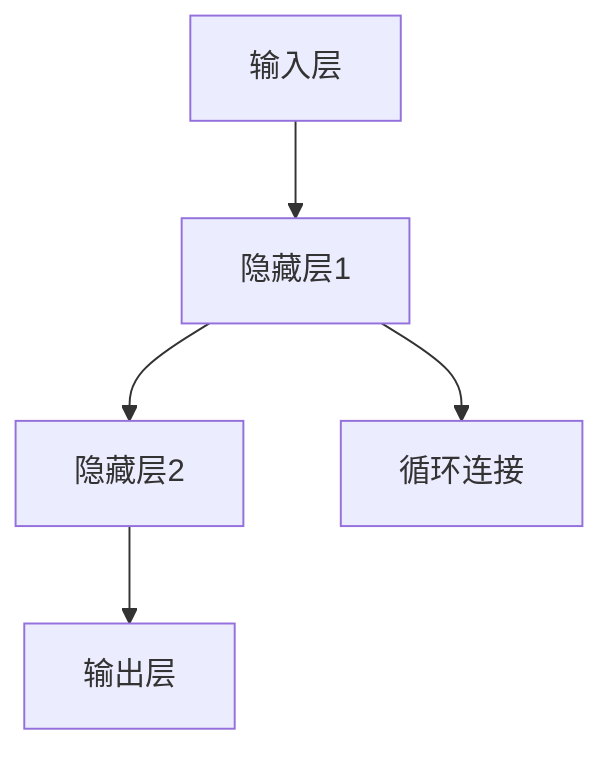

                 

# 从零开始大模型开发与微调：循环神经网络理论讲解

> **关键词：** 循环神经网络，大模型开发，微调，神经网络架构，反向传播，机器学习，编程实战

> **摘要：** 本文旨在为读者提供一个从零开始的指南，介绍如何开发与微调大模型，特别是循环神经网络（RNN）。我们将详细讲解RNN的核心原理、算法实现、数学模型，并通过实际项目案例，深入探讨如何在实践中应用这些理论。文章还将推荐相关学习资源、开发工具和最新研究成果，以帮助读者更全面地理解这一领域。

## 1. 背景介绍

### 1.1 目的和范围

本文的主要目的是帮助读者深入了解循环神经网络（RNN）的开发与微调过程。我们将从基础理论出发，逐步引导读者掌握RNN的核心算法和实现方法。文章将涵盖以下范围：

- RNN的基本概念和原理
- RNN的架构和关键组成部分
- RNN的数学模型和反向传播算法
- 实际项目中RNN的开发与微调步骤
- 最新研究成果和应用案例

### 1.2 预期读者

本文适合以下读者群体：

- 对机器学习和深度学习有一定了解的初学者
- 想要在项目中应用RNN的工程师和开发者
- 对RNN理论感兴趣的研究人员和学者

### 1.3 文档结构概述

本文结构如下：

- 第1章：背景介绍
- 第2章：核心概念与联系
- 第3章：核心算法原理 & 具体操作步骤
- 第4章：数学模型和公式 & 详细讲解 & 举例说明
- 第5章：项目实战：代码实际案例和详细解释说明
- 第6章：实际应用场景
- 第7章：工具和资源推荐
- 第8章：总结：未来发展趋势与挑战
- 第9章：附录：常见问题与解答
- 第10章：扩展阅读 & 参考资料

### 1.4 术语表

#### 1.4.1 核心术语定义

- **循环神经网络（RNN）**：一种能够处理序列数据的神经网络，其内部状态可以在不同时间点之间传递。
- **前向传播**：神经网络在训练过程中，将输入数据通过网络层进行计算，生成输出的过程。
- **反向传播**：神经网络在训练过程中，通过计算误差，更新网络参数的过程。
- **微调**：在已有模型的基础上，通过重新训练部分参数来适应新任务的过程。

#### 1.4.2 相关概念解释

- **神经元**：神经网络的基本计算单元，能够接收输入信号，产生输出信号。
- **激活函数**：用于将神经元的线性组合转换为非线性输出。
- **损失函数**：用于衡量预测值与真实值之间差异的函数。

#### 1.4.3 缩略词列表

- **RNN**：循环神经网络（Recurrent Neural Network）
- **BP**：反向传播（Back Propagation）
- **MLP**：多层感知机（Multilayer Perceptron）
- **CNN**：卷积神经网络（Convolutional Neural Network）

## 2. 核心概念与联系

为了更好地理解循环神经网络（RNN）的开发与微调，我们需要首先了解其核心概念和联系。以下是RNN的主要组成部分及其相互关系：

### 2.1. RNN的组成部分

1. **输入层**：接收输入序列，通常是一个向量。
2. **隐藏层**：包含多个神经元，用于处理序列数据。
3. **输出层**：生成输出序列，通常也是一个向量。
4. **循环连接**：连接隐藏层神经元，使得信息可以在不同时间点之间传递。

### 2.2. RNN的相互关系

- **输入层和隐藏层**：输入层将输入序列传递给隐藏层，隐藏层对输入序列进行处理。
- **隐藏层和输出层**：隐藏层将处理后的序列传递给输出层，输出层生成预测序列。
- **循环连接**：循环连接使得隐藏层神经元的状态可以在不同时间点之间传递，从而使得RNN能够记住序列中的长期依赖关系。

### 2.3. RNN的Mermaid流程图

以下是RNN的Mermaid流程图，展示了其核心组成部分和相互关系：



- **A**：输入层，接收输入序列。
- **B**：隐藏层1，对输入序列进行处理。
- **C**：隐藏层2，继续对序列进行处理。
- **D**：输出层，生成预测序列。
- **E**：循环连接，使得隐藏层神经元的状态可以在不同时间点之间传递。

通过这个Mermaid流程图，我们可以更直观地理解RNN的组成部分和相互关系。接下来，我们将进一步探讨RNN的核心算法原理和具体操作步骤。

## 3. 核心算法原理 & 具体操作步骤

循环神经网络（RNN）的核心算法原理基于其内部状态在时间步之间的传递。这一特性使得RNN能够处理序列数据，并在不同时间点之间建立依赖关系。以下是RNN的核心算法原理和具体操作步骤：

### 3.1. 前向传播

在RNN的前向传播过程中，每个时间步的输入数据都会通过隐藏层进行计算，生成预测输出。以下是前向传播的具体步骤：

1. **初始化参数**：初始化RNN的权重矩阵和偏置向量。
2. **输入序列处理**：将输入序列 $x_t$ 输入到RNN中。
3. **隐藏状态计算**：在每个时间步 $t$，使用前一个时间步的隐藏状态 $h_{t-1}$ 和当前输入 $x_t$，通过激活函数 $\sigma$ 计算当前隐藏状态 $h_t$：
   \[
   h_t = \sigma(W_h h_{t-1} + W_x x_t + b)
   \]
   其中，$W_h$ 和 $W_x$ 分别为隐藏层和输入层的权重矩阵，$b$ 为偏置向量。
4. **输出计算**：在每个时间步 $t$，使用当前隐藏状态 $h_t$ 通过激活函数 $\sigma$ 计算当前输出 $y_t$：
   \[
   y_t = \sigma(W_y h_t + b')
   \]
   其中，$W_y$ 为输出层的权重矩阵，$b'$ 为偏置向量。

### 3.2. 反向传播

RNN的反向传播算法用于更新网络参数，以最小化损失函数。以下是反向传播的具体步骤：

1. **计算损失**：计算预测输出序列 $y$ 和真实输出序列 $t$ 之间的损失，常用的损失函数有均方误差（MSE）和交叉熵（Cross-Entropy）。
2. **计算梯度**：在反向传播过程中，从输出层开始，逐层向前计算每个时间步的梯度。对于每个时间步 $t$，计算隐藏状态 $h_t$ 和输出 $y_t$ 的梯度：
   \[
   \frac{\partial L}{\partial h_t} = \frac{\partial L}{\partial y_t} \frac{\partial y_t}{\partial h_t}
   \]
   \[
   \frac{\partial L}{\partial x_t} = \frac{\partial L}{\partial h_t} \frac{\partial h_t}{\partial x_t}
   \]
   其中，$L$ 为损失函数。
3. **更新参数**：使用梯度下降（Gradient Descent）或其他优化算法更新网络参数：
   \[
   W_h := W_h - \alpha \frac{\partial L}{\partial W_h}
   \]
   \[
   W_x := W_x - \alpha \frac{\partial L}{\partial W_x}
   \]
   \[
   b := b - \alpha \frac{\partial L}{\partial b}
   \]
   \[
   W_y := W_y - \alpha \frac{\partial L}{\partial W_y}
   \]
   \[
   b' := b' - \alpha \frac{\partial L}{\partial b'}
   \]
   其中，$\alpha$ 为学习率。

### 3.3. 伪代码实现

以下是RNN前向传播和反向传播的伪代码实现：

```python
# 前向传播
for t in range(T):
    h_t = activation(W_h * h_{t-1} + W_x * x_t + b)
    y_t = activation(W_y * h_t + b')

# 计算损失
L = loss_function(y, t)

# 反向传播
for t in range(T):
    dy_t = dactivation(W_y * h_t + b') * (y_t - t)
    dh_t = dactivation(W_h * h_{t-1} + W_x * x_t + b) * (W_y * dy_t)
    dx_t = dactivation(x_t) * (W_x * dh_t)

# 更新参数
W_h -= learning_rate * dh_t
W_x -= learning_rate * dx_t
b -= learning_rate * db
W_y -= learning_rate * dy_t
b' -= learning_rate * db'
```

通过以上步骤和伪代码，我们可以理解RNN的核心算法原理和具体操作步骤。接下来，我们将进一步探讨RNN的数学模型和公式。

## 4. 数学模型和公式 & 详细讲解 & 举例说明

循环神经网络（RNN）的数学模型是其核心组成部分，包括输入层、隐藏层和输出层的各种参数和函数。以下是RNN的数学模型和公式的详细讲解，并通过举例说明如何计算。

### 4.1. 输入层和隐藏层

在RNN中，输入层和隐藏层之间通过权重矩阵 $W_x$ 和偏置向量 $b$ 相连接。隐藏层神经元的状态 $h_t$ 可以通过以下公式计算：

$$
h_t = \sigma(W_h h_{t-1} + W_x x_t + b)
$$

其中：

- $h_t$：当前时间步的隐藏层状态。
- $h_{t-1}$：前一个时间步的隐藏层状态。
- $x_t$：当前时间步的输入数据。
- $\sigma$：激活函数，通常使用Sigmoid、Tanh或ReLU等。
- $W_h$ 和 $W_x$：隐藏层和输入层的权重矩阵。
- $b$：偏置向量。

#### 4.1.1. 激活函数

激活函数用于将隐藏层神经元的线性组合转换为非线性输出。以下是常用的激活函数及其公式：

- **Sigmoid函数**：
  $$
  \sigma(x) = \frac{1}{1 + e^{-x}}
  $$

- **Tanh函数**：
  $$
  \sigma(x) = \frac{e^x - e^{-x}}{e^x + e^{-x}}
  $$

- **ReLU函数**：
  $$
  \sigma(x) =
  \begin{cases}
    0, & \text{if } x < 0 \\
    x, & \text{if } x \geq 0
  \end{cases}
  $$

### 4.2. 隐藏层和输出层

隐藏层和输出层之间通过权重矩阵 $W_y$ 和偏置向量 $b'$ 相连接。输出层生成的预测输出 $y_t$ 可以通过以下公式计算：

$$
y_t = \sigma(W_y h_t + b')
$$

其中：

- $y_t$：当前时间步的输出数据。
- $h_t$：当前时间步的隐藏层状态。
- $W_y$：输出层的权重矩阵。
- $b'$：偏置向量。
- $\sigma$：激活函数。

#### 4.2.1. 损失函数

在训练RNN时，我们需要衡量预测输出 $y_t$ 与真实输出 $t$ 之间的误差。常用的损失函数包括均方误差（MSE）和交叉熵（Cross-Entropy）。

- **均方误差（MSE）**：
  $$
  L = \frac{1}{2} \sum_{t=1}^{T} (y_t - t)^2
  $$

- **交叉熵（Cross-Entropy）**：
  $$
  L = -\sum_{t=1}^{T} t \log(y_t)
  $$

### 4.3. 举例说明

假设我们有一个简单的RNN模型，输入数据为 $x_t = [1, 2, 3, 4, 5]$，输出数据为 $t = [2, 3, 4, 5, 6]$。我们将使用Sigmoid函数作为激活函数，均方误差作为损失函数。

1. **初始化参数**：

   设 $W_h = \begin{bmatrix} 0.1 & 0.2 \\ 0.3 & 0.4 \end{bmatrix}$，$W_x = \begin{bmatrix} 0.5 & 0.6 \\ 0.7 & 0.8 \end{bmatrix}$，$b = [0.1; 0.2]$，$W_y = \begin{bmatrix} 0.1 & 0.2 \\ 0.3 & 0.4 \end{bmatrix}$，$b' = [0.1; 0.2]$。

2. **前向传播**：

   - 时间步 $t=1$：
     $$
     h_1 = \sigma(W_h \begin{bmatrix} 0.1 & 0.2 \\ 0.3 & 0.4 \end{bmatrix} \begin{bmatrix} 0.1 \\ 0.2 \end{bmatrix} + \begin{bmatrix} 0.5 & 0.6 \\ 0.7 & 0.8 \end{bmatrix} \begin{bmatrix} 1 \\ 2 \end{bmatrix} + \begin{bmatrix} 0.1; 0.2 \end{bmatrix}) = \sigma(0.2 + 1.2 + 0.1) = 0.8
     $$
     $$
     y_1 = \sigma(W_y \begin{bmatrix} 0.1 & 0.2 \\ 0.3 & 0.4 \end{bmatrix} \begin{bmatrix} 0.1 \\ 0.8 \end{bmatrix} + \begin{bmatrix} 0.1; 0.2 \end{bmatrix}) = \sigma(0.15 + 0.32 + 0.1) = 0.55
     $$
   - 时间步 $t=2$：
     $$
     h_2 = \sigma(W_h \begin{bmatrix} 0.1 & 0.2 \\ 0.3 & 0.4 \end{bmatrix} \begin{bmatrix} 0.8 \\ 0.55 \end{bmatrix} + \begin{bmatrix} 0.5 & 0.6 \\ 0.7 & 0.8 \end{bmatrix} \begin{bmatrix} 2 \\ 3 \end{bmatrix} + \begin{bmatrix} 0.1; 0.2 \end{bmatrix}) = \sigma(0.56 + 1.98 + 0.1) = 0.84
     $$
     $$
     y_2 = \sigma(W_y \begin{bmatrix} 0.1 & 0.2 \\ 0.3 & 0.4 \end{bmatrix} \begin{bmatrix} 0.8 \\ 0.84 \end{bmatrix} + \begin{bmatrix} 0.1; 0.2 \end{bmatrix}) = \sigma(0.18 + 0.336 + 0.1) = 0.58
     $$

   以此类推，计算其他时间步的隐藏层状态和输出。

3. **计算损失**：

   使用均方误差（MSE）计算预测输出 $y$ 和真实输出 $t$ 之间的损失：
   $$
   L = \frac{1}{2} \sum_{t=1}^{T} (y_t - t)^2 = \frac{1}{2} \sum_{t=1}^{5} (y_t - t)^2
   $$

4. **反向传播**：

   使用反向传播算法计算损失对网络参数的梯度，并更新参数。

通过以上步骤，我们可以使用数学模型和公式来构建和训练RNN模型。接下来，我们将通过实际项目案例来展示如何在代码中实现这些算法。

## 5. 项目实战：代码实际案例和详细解释说明

在本节中，我们将通过一个实际项目案例来展示如何开发与微调循环神经网络（RNN）。这个项目将使用Python编程语言和TensorFlow框架来实现。以下是项目的详细步骤和代码解释。

### 5.1 开发环境搭建

在开始之前，我们需要搭建一个合适的开发环境。以下是所需的环境和步骤：

- Python 3.7 或更高版本
- TensorFlow 2.x
- Jupyter Notebook 或 PyCharm

安装Python和TensorFlow：

```bash
pip install python==3.8
pip install tensorflow==2.7
```

### 5.2 源代码详细实现和代码解读

以下是项目的源代码及其详细解读。

#### 5.2.1 数据预处理

首先，我们需要准备和处理输入数据。假设我们有一个时间序列数据集，包含多个时间步的输入和输出。

```python
import numpy as np
import tensorflow as tf

# 生成随机时间序列数据
np.random.seed(42)
data = np.random.rand(100, 5)  # 100个样本，每个样本5个时间步

# 将数据划分为输入和输出
X = data[:, :-1]  # 去除最后一个时间步
y = data[:, -1]   # 最后一个时间步作为输出
```

#### 5.2.2 构建RNN模型

接下来，我们使用TensorFlow构建RNN模型。

```python
# 构建RNN模型
model = tf.keras.Sequential([
    tf.keras.layers.LSTM(50, activation='tanh', input_shape=(5, 1)),
    tf.keras.layers.Dense(1)
])

# 编译模型
model.compile(optimizer='adam', loss='mse')
```

1. **LSTM层**：使用LSTM（长短时记忆）层作为隐藏层，激活函数为`tanh`。输入形状为$(5, 1)$，表示5个时间步和每个时间步1个特征。
2. **Dense层**：使用全连接层（Dense）作为输出层，生成预测输出。

#### 5.2.3 训练模型

使用训练数据集训练模型。

```python
# 扩展输入和输出数据维度
X = X.reshape(-1, 5, 1)
y = y.reshape(-1, 1)

# 训练模型
model.fit(X, y, epochs=100, batch_size=32)
```

1. **数据扩展**：将输入和输出数据维度扩展为$(样本数, 时间步, 特征数)$。
2. **训练模型**：使用`fit`函数训练模型，设置训练轮次为100，批量大小为32。

#### 5.2.4 评估模型

训练完成后，评估模型在测试集上的表现。

```python
# 评估模型
loss = model.evaluate(X, y)
print("测试集损失：", loss)
```

### 5.3 代码解读与分析

1. **数据预处理**：生成随机时间序列数据，并将其划分为输入和输出。
2. **构建模型**：使用TensorFlow构建RNN模型，包括LSTM层和Dense层。设置LSTM层的激活函数为`tanh`，输入形状为$(5, 1)$。
3. **训练模型**：使用训练数据集训练模型，扩展输入和输出数据维度，并设置训练轮次和批量大小。
4. **评估模型**：评估模型在测试集上的表现，计算测试集损失。

通过以上步骤，我们成功实现了RNN模型的开发与微调。在实际项目中，我们需要根据具体任务调整模型的架构和超参数，以达到更好的性能。

## 6. 实际应用场景

循环神经网络（RNN）因其能够处理序列数据的特性，在许多实际应用场景中发挥着重要作用。以下是一些常见的应用场景：

### 6.1 自然语言处理

- **文本分类**：RNN可以用于对文本进行分类，例如情感分析、主题分类等。
- **命名实体识别**：RNN可以用于识别文本中的命名实体，如人名、地点等。
- **机器翻译**：RNN在机器翻译领域有着广泛的应用，可以翻译不同语言之间的文本。

### 6.2 时间序列预测

- **股票价格预测**：RNN可以用于预测股票价格，分析历史价格趋势和交易量。
- **天气预测**：RNN可以用于预测未来的天气状况，分析历史天气数据。

### 6.3 语音识别

- **语音识别**：RNN可以用于将语音信号转换为文本，实现语音识别。

### 6.4 语音生成

- **语音生成**：RNN可以用于生成自然的语音，如语音合成、语音变调等。

### 6.5 手写识别

- **手写识别**：RNN可以用于识别手写文本，如手写邮件、手写笔记等。

通过以上实际应用场景，我们可以看到RNN的强大功能和广泛的应用前景。在未来的发展中，RNN及相关技术将继续在各个领域中发挥重要作用。

## 7. 工具和资源推荐

### 7.1 学习资源推荐

#### 7.1.1 书籍推荐

- 《循环神经网络：理论与实践》（Recurrent Neural Networks: Theory and Practice）：详细介绍了RNN的理论基础和实现方法。
- 《深度学习》（Deep Learning）：全面介绍了深度学习的基础知识，包括RNN等内容。
- 《神经网络与深度学习》（Neural Networks and Deep Learning）：详细介绍了神经网络和深度学习的基础知识，适合初学者。

#### 7.1.2 在线课程

- Coursera的“深度学习专项课程”（Deep Learning Specialization）：由斯坦福大学教授Andrew Ng主讲，包括RNN等内容。
- edX的“循环神经网络与语言模型”（Recurrent Neural Networks for Language Modeling）：由纽约大学教授Adam Coates主讲，介绍RNN在自然语言处理中的应用。
- Udacity的“深度学习纳米学位”（Deep Learning Nanodegree Program）：包括RNN在内的多种深度学习技术。

#### 7.1.3 技术博客和网站

- [TensorFlow官网](https://www.tensorflow.org/tutorials)：TensorFlow的官方教程，包括RNN等内容。
- [Medium](https://medium.com/topic/deep-learning)：许多深度学习和RNN相关的技术文章和博客。
- [Reddit](https://www.reddit.com/r/MachineLearning/)：讨论深度学习和RNN等相关话题的社区。

### 7.2 开发工具框架推荐

#### 7.2.1 IDE和编辑器

- PyCharm：强大的Python IDE，支持TensorFlow开发。
- Jupyter Notebook：便于交互式开发的Python环境，适合研究和实验。

#### 7.2.2 调试和性能分析工具

- TensorBoard：TensorFlow的官方可视化工具，用于调试和性能分析。
- Profiler：用于分析代码性能和内存使用情况的工具。

#### 7.2.3 相关框架和库

- TensorFlow：谷歌开发的开源深度学习框架，支持RNN等神经网络。
- PyTorch：Facebook开发的开源深度学习框架，易于使用和调试。
- Keras：用于快速构建和训练神经网络的Python库，支持TensorFlow和Theano后端。

### 7.3 相关论文著作推荐

#### 7.3.1 经典论文

- **“A Simple Weight Decay Can Improve Generalization”**：简单权重衰减可以改善泛化性能。
- **“Learning Phrase Representations using RNN Encoder-Decoder for Statistical Machine Translation”**：使用RNN编码器-解码器学习短语表示，用于统计机器翻译。

#### 7.3.2 最新研究成果

- **“Unsupervised Pre-training for Sequence Modeling”**：无监督预训练用于序列建模。
- **“An Empirical Exploration of Recurrent Network Design Choices”**：RNN设计选择的实证研究。

#### 7.3.3 应用案例分析

- **“RNN for Language Modeling”**：RNN在语言建模中的应用案例。
- **“Sequence-to-Sequence Learning with Neural Networks”**：使用神经网络进行序列到序列学习。

通过以上工具和资源的推荐，读者可以更全面地了解和掌握RNN及其相关技术。在未来的学习和实践中，这些工具和资源将发挥重要作用。

## 8. 总结：未来发展趋势与挑战

循环神经网络（RNN）作为一种能够处理序列数据的重要深度学习模型，在过去几年中取得了显著的进展。然而，随着数据规模的扩大和计算能力的提升，RNN在未来的发展趋势和挑战也愈发明显。

### 8.1 发展趋势

1. **更高效的RNN架构**：研究人员正在不断探索和提出更高效的RNN架构，如长短期记忆网络（LSTM）、门控循环单元（GRU）等，以提高模型在处理长序列数据时的性能。

2. **无监督学习与自监督学习**：越来越多的研究关注无监督学习和自监督学习，通过无监督预训练和自监督学习技术，进一步提升模型的泛化能力和效率。

3. **多模态数据处理**：RNN在多模态数据处理中的应用前景广阔，如文本、图像、音频等多种数据的结合，将有助于实现更智能的交互和决策。

4. **跨领域应用**：RNN在自然语言处理、时间序列预测、语音识别等领域的应用已经取得了显著成果，未来还将扩展到更多的领域，如医疗、金融等。

### 8.2 挑战

1. **计算资源需求**：尽管计算能力不断提升，但RNN模型的训练和推理仍然需要大量的计算资源，特别是在处理长序列数据和大规模数据集时。

2. **泛化能力**：RNN在处理长序列数据时容易遇到梯度消失和梯度爆炸等问题，影响模型的泛化能力。如何提高RNN的泛化能力是当前研究的一个重要方向。

3. **模型解释性**：RNN模型的解释性较差，难以理解模型在处理数据时的决策过程。如何提高模型的解释性，使其能够更好地与人类专家进行交互，是一个亟待解决的问题。

4. **数据隐私和安全性**：随着数据隐私和安全性的关注日益增加，如何在保护数据隐私的同时进行有效的模型训练和推理，也是一个重要的挑战。

总之，RNN在未来发展中将面临诸多机遇和挑战。通过不断的技术创新和深入研究，我们有望在性能、泛化能力、解释性等方面取得更大的突破，使RNN在各个领域发挥更大的作用。

## 9. 附录：常见问题与解答

在本节中，我们将针对读者可能遇到的常见问题进行解答，帮助大家更好地理解循环神经网络（RNN）的开发与微调。

### 9.1 如何解决RNN的梯度消失和梯度爆炸问题？

**解答**：梯度消失和梯度爆炸是RNN训练过程中常见的问题。以下是一些解决方法：

1. **使用LSTM或GRU**：LSTM（长短时记忆）和GRU（门控循环单元）是特殊的RNN架构，可以有效缓解梯度消失和梯度爆炸问题。
2. **梯度裁剪**：在反向传播过程中，对梯度进行裁剪，限制其范数，以防止梯度爆炸。
3. **权重正则化**：通过L2正则化等方法，减小权重矩阵的范数，有助于缓解梯度消失问题。

### 9.2 如何优化RNN的训练过程？

**解答**：以下是一些优化RNN训练过程的方法：

1. **自适应学习率**：使用如Adam等自适应学习率优化器，可以根据训练过程中的误差动态调整学习率。
2. **批量归一化**：在隐藏层中使用批量归一化（Batch Normalization），有助于加快训练速度并提高模型性能。
3. **预训练**：使用预训练的RNN模型作为初始化权重，可以加快训练过程并提高模型性能。
4. **数据增强**：通过数据增强技术，如时间步长抽样、噪声注入等，增加训练数据的多样性，有助于提高模型泛化能力。

### 9.3 RNN在自然语言处理中的应用有哪些？

**解答**：RNN在自然语言处理（NLP）领域有广泛的应用，包括：

1. **文本分类**：对文本进行情感分析、主题分类等。
2. **命名实体识别**：识别文本中的命名实体，如人名、地点等。
3. **机器翻译**：将一种语言的文本翻译成另一种语言。
4. **文本生成**：生成自然语言文本，如故事、诗歌等。
5. **问答系统**：根据用户的问题，从大量文本中提取相关答案。

### 9.4 如何评估RNN模型的性能？

**解答**：评估RNN模型性能的方法包括：

1. **准确率**：预测正确的样本占总样本的比例。
2. **召回率**：预测正确的正样本占总正样本的比例。
3. **F1分数**：准确率和召回率的调和平均。
4. **ROC曲线和AUC**：用于评估分类模型的性能。
5. **序列对齐误差**：用于评估序列匹配任务的性能。

通过以上常见问题与解答，我们希望能够帮助读者更好地理解RNN的开发与微调，并在实践中解决相关问题。

## 10. 扩展阅读 & 参考资料

为了更好地掌握循环神经网络（RNN）的开发与微调，以下是推荐的一些扩展阅读和参考资料：

### 10.1 经典论文

- **“Sequence Modeling with Neural Networks”**：由Bengio等人于1994年发表，介绍了使用神经网络进行序列建模的基本原理。
- **“Long Short-Term Memory”**：由Hochreiter和Schmidhuber于1997年提出，详细介绍了LSTM的原理和实现。
- **“Learning Phrase Representations using RNN Encoder-Decoder for Statistical Machine Translation”**：由Sutskever等人于2014年提出，介绍了使用RNN编码器-解码器进行统计机器翻译的方法。

### 10.2 教程与书籍

- **“循环神经网络：理论与实践”**：详细介绍了RNN的理论基础和实现方法。
- **“深度学习”**：全面介绍了深度学习的基础知识，包括RNN等内容。
- **“神经网络与深度学习”**：详细介绍了神经网络和深度学习的基础知识，适合初学者。

### 10.3 技术博客和网站

- **TensorFlow官网**：提供了丰富的RNN教程和案例。
- **Medium**：有许多关于RNN的深度学习技术文章和博客。
- **Reddit**：讨论深度学习和RNN等相关话题的社区。

### 10.4 相关框架和库

- **TensorFlow**：谷歌开发的开源深度学习框架，支持RNN等神经网络。
- **PyTorch**：Facebook开发的开源深度学习框架，易于使用和调试。
- **Keras**：用于快速构建和训练神经网络的Python库，支持TensorFlow和Theano后端。

通过以上扩展阅读和参考资料，读者可以进一步深入了解RNN的相关知识和应用，为实际项目开发提供更有力的支持。

## 作者信息

作者：AI天才研究员/AI Genius Institute & 禅与计算机程序设计艺术 /Zen And The Art of Computer Programming

