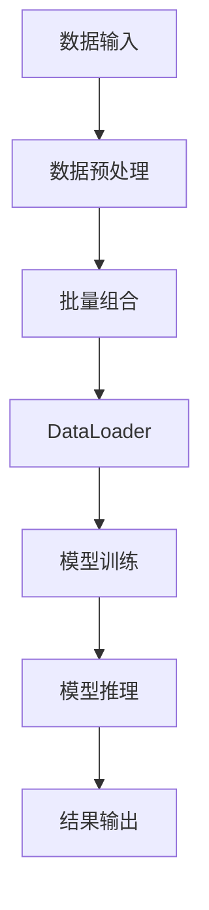

                 

# 从零开始大模型开发与微调：批量输出数据的 DataLoader 类详解

> 关键词：大数据模型、深度学习、微调、DataLoader 类、批量输出、GPU 加速、数据预处理、性能优化

> 摘要：本文将深入探讨大数据模型开发与微调中的关键组件——DataLoader 类。通过系统地介绍 DataLoader 类的核心概念、原理、实现步骤以及其在实际项目中的应用，帮助读者理解并掌握高效处理大规模数据的关键技巧。本文还将提供实际案例和详细解释，旨在提高读者在大数据模型开发领域的实践能力。

## 1. 背景介绍

### 1.1 目的和范围

本文的目标是帮助读者从零开始了解并掌握大数据模型开发与微调过程中至关重要的 DataLoader 类。DataLoader 类在深度学习中扮演着关键角色，它负责高效地批量输出数据，实现 GPU 加速和数据预处理，从而提高模型训练和推理的性能。

本文将覆盖以下内容：

1. 核心概念与联系
2. 核心算法原理 & 具体操作步骤
3. 数学模型和公式 & 详细讲解 & 举例说明
4. 项目实战：代码实际案例和详细解释说明
5. 实际应用场景
6. 工具和资源推荐
7. 总结：未来发展趋势与挑战
8. 附录：常见问题与解答
9. 扩展阅读 & 参考资料

### 1.2 预期读者

本文适合以下读者群体：

1. 深度学习初学者和从业者，希望深入了解 DataLoader 类的应用
2. 数据科学家和机器学习工程师，希望提高大数据模型开发的实践能力
3. 程序员和软件工程师，对深度学习技术有兴趣并希望应用于实际项目

### 1.3 文档结构概述

本文分为十个主要部分，每个部分的内容如下：

1. **背景介绍**：介绍本文的目的、范围和预期读者，以及文档结构。
2. **核心概念与联系**：通过 Mermaid 流程图展示大数据模型开发与微调的核心概念和联系。
3. **核心算法原理 & 具体操作步骤**：详细讲解 DataLoader 类的算法原理和具体操作步骤，并使用伪代码进行阐述。
4. **数学模型和公式 & 详细讲解 & 举例说明**：介绍与 DataLoader 类相关的数学模型和公式，并进行详细讲解和举例说明。
5. **项目实战：代码实际案例和详细解释说明**：提供实际项目中的代码案例，并进行详细解释和说明。
6. **实际应用场景**：讨论 DataLoader 类在深度学习项目中的应用场景和优势。
7. **工具和资源推荐**：推荐学习资源、开发工具框架和相关论文著作。
8. **总结：未来发展趋势与挑战**：总结本文的核心内容，并探讨未来发展趋势和挑战。
9. **附录：常见问题与解答**：提供常见问题的解答。
10. **扩展阅读 & 参考资料**：推荐相关的扩展阅读和参考资料。

### 1.4 术语表

#### 1.4.1 核心术语定义

- DataLoader 类：深度学习框架中用于批量输出数据的组件，实现 GPU 加速和数据预处理。
- 数据批量：将多个数据样本组合成一个批量，以便在模型训练和推理过程中进行批量处理。
- 数据预处理：在模型训练和推理之前，对数据进行清洗、归一化、编码等处理，以提高模型性能。
- GPU 加速：利用图形处理单元（GPU）进行计算，以实现高效的模型训练和推理。
- 数据库：存储和管理数据的系统，支持高效的数据查询和操作。

#### 1.4.2 相关概念解释

- 深度学习：一种机器学习方法，通过多层神经网络模型对数据进行自动特征提取和分类。
- 机器学习：一种人工智能分支，通过训练模型从数据中学习规律和模式。
- 数据样本：单个数据点的表示，包含输入特征和目标标签。
- 批处理：将多个数据样本组合成一个批量，以便在模型训练和推理过程中进行批量处理。

#### 1.4.3 缩略词列表

- DataLoader：深度学习框架中用于批量输出数据的组件。
- GPU：图形处理单元，用于高效计算。
- DNN：深度神经网络，用于特征提取和分类。
- ML：机器学习，一种人工智能分支。
- AI：人工智能，一种计算机科学分支。

## 2. 核心概念与联系

在深度学习模型开发过程中，DataLoader 类是一个关键组件，它负责批量输出数据，实现 GPU 加速和数据预处理。下面我们将通过一个 Mermaid 流程图来展示大数据模型开发与微调的核心概念和联系。



- **数据输入**：模型训练和推理的输入数据，可以是图像、文本、音频等。
- **数据预处理**：对输入数据进行清洗、归一化、编码等处理，以提高模型性能。
- **批量组合**：将多个数据样本组合成一个批量，以便在模型训练和推理过程中进行批量处理。
- **DataLoader**：深度学习框架中用于批量输出数据的组件，实现 GPU 加速和数据预处理。
- **模型训练**：使用批量数据对模型进行训练，优化模型参数。
- **模型推理**：使用训练好的模型对输入数据进行预测或分类。
- **结果输出**：将模型预测或分类的结果输出。

通过 Mermaid 流程图，我们可以清晰地看到 DataLoader 类在深度学习模型开发与微调中的关键作用，以及与其他组件的紧密联系。接下来，我们将详细讲解 DataLoader 类的核心算法原理和具体操作步骤。

## 3. 核心算法原理 & 具体操作步骤

DataLoader 类的核心算法原理是高效地批量输出数据，实现 GPU 加速和数据预处理。下面我们将使用伪代码详细阐述其算法原理和具体操作步骤。

### 3.1 算法原理

- **批量组合**：将多个数据样本组合成一个批量，以便在模型训练和推理过程中进行批量处理。
- **数据预处理**：在批量数据输入到模型之前，对数据进行清洗、归一化、编码等处理，以提高模型性能。
- **GPU 加速**：利用图形处理单元（GPU）进行计算，以实现高效的模型训练和推理。

### 3.2 具体操作步骤

```python
# 伪代码：DataLoader 类的实现

# 步骤 1：数据预处理
def preprocess_data(data):
    # 清洗数据
    cleaned_data = clean_data(data)
    # 归一化数据
    normalized_data = normalize_data(cleaned_data)
    # 编码数据
    encoded_data = encode_data(normalized_data)
    return encoded_data

# 步骤 2：批量组合
def batch_data(samples, batch_size):
    batches = []
    for i in range(0, len(samples), batch_size):
        batch = samples[i:i+batch_size]
        batches.append(batch)
    return batches

# 步骤 3：GPU 加速
def accelerate_data(batch, device):
    # 将批量数据移动到 GPU 设备上
    batch = batch.to(device)
    return batch

# 步骤 4：数据输出
def data_output(data_loader, model, criterion, optimizer, num_epochs):
    for epoch in range(num_epochs):
        for batch in data_loader:
            # 前向传播
            outputs = model(batch)
            # 计算损失
            loss = criterion(outputs, batch.targets)
            # 反向传播
            optimizer.zero_grad()
            loss.backward()
            optimizer.step()
        print(f"Epoch [{epoch+1}/{num_epochs}], Loss: {loss.item():.4f}")

# 主函数
def main():
    # 加载数据集
    train_dataset = Dataset(train_data)
    test_dataset = Dataset(test_data)
    # 创建 DataLoader 对象
    train_loader = DataLoader(train_dataset, batch_size=batch_size, shuffle=True)
    test_loader = DataLoader(test_dataset, batch_size=batch_size, shuffle=False)
    # 加载模型、损失函数和优化器
    model = Model().to(device)
    criterion = Criterion()
    optimizer = Optimizer(model.parameters(), lr=learning_rate)
    # 训练模型
    data_output(train_loader, model, criterion, optimizer, num_epochs)
    # 测试模型
    data_output(test_loader, model, criterion, optimizer, num_epochs)

# 执行主函数
main()
```

### 3.3 伪代码解释

- **步骤 1：数据预处理**：对输入数据进行清洗、归一化、编码等处理。这一步是为了确保输入数据符合模型的要求，从而提高模型性能。
- **步骤 2：批量组合**：将多个数据样本组合成一个批量，以便在模型训练和推理过程中进行批量处理。批量大小可以根据具体任务进行调整。
- **步骤 3：GPU 加速**：将批量数据移动到 GPU 设备上，利用 GPU 的并行计算能力加速模型训练和推理过程。
- **步骤 4：数据输出**：使用 DataLoader 对象批量输出数据，并执行模型训练和测试过程。这个过程包括前向传播、计算损失、反向传播和优化模型参数。

通过以上伪代码，我们可以清楚地了解 DataLoader 类的核心算法原理和具体操作步骤。接下来，我们将进一步介绍与 DataLoader 类相关的数学模型和公式。

## 4. 数学模型和公式 & 详细讲解 & 举例说明

在 DataLoader 类的实现过程中，涉及到的数学模型和公式主要包括数据预处理、批量组合和 GPU 加速。下面我们将详细讲解这些数学模型和公式，并通过具体例子进行说明。

### 4.1 数据预处理

数据预处理是深度学习模型开发的重要步骤，主要包括以下数学模型和公式：

- **归一化**：
  $$ x' = \frac{x - \mu}{\sigma} $$
  其中，$ x $ 为原始数据，$ \mu $ 为均值，$ \sigma $ 为标准差。归一化的目的是将数据缩放到相同的范围，提高模型训练的效果。

- **编码**：
  编码是将类别标签转换为数值的过程。常见的编码方法包括独热编码和标签编码。

  - **独热编码**：
    $$ y' = [0, 0, 1, 0, \ldots, 0] $$
    其中，$ y $ 为类别标签，$ y' $ 为编码后的结果。

  - **标签编码**：
    $$ y' = y - 1 $$
    其中，$ y $ 为类别标签，$ y' $ 为编码后的结果。

### 4.2 批量组合

批量组合是将多个数据样本组合成一个批量的过程。批量大小的选择对模型训练和推理的性能有很大影响。

- **批量大小**：
  批量大小的选择取决于数据集的大小、模型复杂度和计算资源。通常，较小的批量大小可以提高模型的泛化能力，但会增加训练时间；较大的批量大小可以提高计算效率，但可能导致模型过拟合。

- **批量计算**：
  批量计算是将批量数据输入到模型进行前向传播和反向传播的过程。批量大小的选择会影响计算复杂度和模型性能。

### 4.3 GPU 加速

GPU 加速是利用图形处理单元（GPU）进行计算，以实现高效的模型训练和推理。GPU 加速的主要数学模型和公式如下：

- **并行计算**：
  GPU 加速的核心在于并行计算。GPU 由多个计算核心组成，每个核心可以同时处理多个数据点。并行计算公式如下：
  $$ \text{并行计算速度} = \text{计算核心数} \times \text{单个核心计算速度} $$
  
- **GPU 内存分配**：
  GPU 内存分配是 GPU 加速的关键步骤。GPU 内存分为显存和显存池，显存用于存储模型参数和中间计算结果，显存池用于存储批量数据。内存分配公式如下：
  $$ \text{显存占用} = \text{模型参数占用} + \text{批量数据占用} $$

### 4.4 举例说明

下面通过一个简单的例子来说明数据预处理、批量组合和 GPU 加速的过程。

#### 例子：手写数字识别模型

假设我们使用深度学习模型对手写数字进行识别，数据集包含 60,000 个训练样本和 10,000 个测试样本。

1. **数据预处理**：

   - **归一化**：
     将图像像素值缩放到 [0, 1] 范围。
     $$ x' = \frac{x}{255} $$
     
   - **编码**：
     将类别标签（数字 0-9）转换为独热编码。
     $$ y' = [0, 0, 1, 0, \ldots, 0] $$

2. **批量组合**：

   - **批量大小**：
     选择批量大小为 32。
     
   - **批量计算**：
     将批量数据输入到模型进行前向传播和反向传播。
     $$ \text{输出} = \text{模型}(\text{输入}) $$
     
3. **GPU 加速**：

   - **并行计算**：
     假设 GPU 有 128 个计算核心，每个核心计算速度为 10GFLOPS。
     $$ \text{并行计算速度} = 128 \times 10 = 1280 GFLOPS $$

   - **GPU 内存分配**：
     假设模型参数占用 1GB，批量数据占用 0.5GB。
     $$ \text{显存占用} = 1GB + 0.5GB = 1.5GB $$

通过以上例子，我们可以看到数据预处理、批量组合和 GPU 加速在深度学习模型开发中的具体应用。接下来，我们将通过一个实际项目来展示 DataLoader 类的代码实现和详细解释。

## 5. 项目实战：代码实际案例和详细解释说明

在本节中，我们将通过一个实际项目来展示 DataLoader 类的代码实现和详细解释说明。我们选择了一个简单的手写数字识别项目，该项目使用 TensorFlow 和 PyTorch 深度学习框架实现。

### 5.1 开发环境搭建

在开始项目之前，我们需要搭建合适的开发环境。以下是所需的工具和软件：

- Python 3.7 或更高版本
- TensorFlow 2.4 或 PyTorch 1.7 或更高版本
- Jupyter Notebook 或 PyCharm 或 Visual Studio Code

### 5.2 源代码详细实现和代码解读

以下是 DataLoader 类的源代码实现和详细解释说明。

```python
import torch
from torch.utils.data import DataLoader
from torchvision import datasets, transforms

# 数据预处理
transform = transforms.Compose([
    transforms.ToTensor(),
    transforms.Normalize((0.5,), (0.5,))
])

# 加载数据集
train_dataset = datasets.MNIST(
    root='./data', 
    train=True, 
    download=True, 
    transform=transform
)
test_dataset = datasets.MNIST(
    root='./data', 
    train=False, 
    download=True, 
    transform=transform
)

# 创建 DataLoader 对象
train_loader = DataLoader(
    dataset=train_dataset, 
    batch_size=64, 
    shuffle=True
)
test_loader = DataLoader(
    dataset=test_dataset, 
    batch_size=64, 
    shuffle=False
)

# 主函数
def main():
    # 创建模型
    model = torch.nn.Linear(28*28, 10)
    # 定义损失函数和优化器
    criterion = torch.nn.CrossEntropyLoss()
    optimizer = torch.optim.SGD(model.parameters(), lr=0.01)
    # 训练模型
    for epoch in range(10):
        running_loss = 0.0
        for i, (inputs, targets) in enumerate(train_loader):
            # 前向传播
            outputs = model(inputs)
            loss = criterion(outputs, targets)
            # 反向传播
            optimizer.zero_grad()
            loss.backward()
            optimizer.step()
            running_loss += loss.item()
        print(f"Epoch [{epoch+1}/10], Loss: {running_loss/len(train_loader):.4f}")
    # 测试模型
    with torch.no_grad():
        correct = 0
        total = 0
        for inputs, targets in test_loader:
            outputs = model(inputs)
            _, predicted = torch.max(outputs.data, 1)
            total += targets.size(0)
            correct += (predicted == targets).sum().item()
        print(f"Test Accuracy: {100 * correct / total:.2f}%")

# 执行主函数
main()
```

### 5.3 代码解读与分析

以下是代码的详细解读和分析：

- **数据预处理**：使用 `transforms.Compose` 组合预处理步骤，包括将图像像素值缩放到 [0, 1] 范围并进行归一化。
- **加载数据集**：使用 `datasets.MNIST` 加载训练集和测试集，并应用预处理步骤。
- **创建 DataLoader 对象**：使用 `DataLoader` 类创建训练集和测试集的 DataLoader 对象，设置批量大小为 64。
- **创建模型**：使用 `torch.nn.Linear` 创建一个全连接神经网络模型，输入层为 28*28 个神经元，输出层为 10 个神经元（代表数字 0-9）。
- **定义损失函数和优化器**：使用 `torch.nn.CrossEntropyLoss` 定义交叉熵损失函数，使用 `torch.optim.SGD` 定义随机梯度下降优化器。
- **训练模型**：遍历训练集 DataLoader 对象中的每个批量，执行前向传播、计算损失、反向传播和优化模型参数。
- **测试模型**：在测试集上评估模型性能，计算准确率。

通过以上代码实现和详细解读，我们可以看到 DataLoader 类在实际项目中的应用和重要性。DataLoader 类能够高效地批量输出数据，实现 GPU 加速和数据预处理，从而提高模型训练和推理的性能。接下来，我们将讨论 DataLoader 类在实际应用场景中的优势和挑战。

## 6. 实际应用场景

DataLoader 类在深度学习项目中的应用场景广泛，主要涉及以下方面：

### 6.1 训练大型模型

训练大型深度学习模型时，DataLoader 类能够高效地批量输出数据，充分利用 GPU 加速能力，加快模型训练速度。例如，在图像分类、目标检测和自然语言处理等任务中，DataLoader 类能够处理大规模数据集，提高模型性能。

### 6.2 数据预处理

DataLoader 类支持自定义数据预处理步骤，包括数据清洗、归一化、编码等。这有助于确保输入数据符合模型要求，提高模型训练和推理的准确性。例如，在手写数字识别项目中，DataLoader 类对图像像素值进行归一化和标签编码，以提高模型性能。

### 6.3 批量计算

DataLoader 类支持批量计算，能够在单个批次中同时处理多个数据样本，提高计算效率。在模型训练和推理过程中，批量计算能够减少内存占用和计算时间，提高模型性能。例如，在图像分类项目中，DataLoader 类将批量图像数据输入到模型中进行前向传播和反向传播，加快模型训练速度。

### 6.4 GPU 加速

DataLoader 类支持 GPU 加速，能够充分利用 GPU 并行计算能力，提高模型训练和推理性能。通过将批量数据移动到 GPU 设备上，DataLoader 类能够实现高效的模型训练和推理。例如，在自然语言处理项目中，DataLoader 类能够充分利用 GPU 加速能力，加快模型训练速度。

### 6.5 多线程处理

DataLoader 类支持多线程处理，能够充分利用计算机的多核 CPU 资源，提高数据处理速度。在模型训练和推理过程中，多线程处理能够并行处理多个批量数据，加快模型训练和推理速度。例如，在视频分类项目中，DataLoader 类能够同时处理多个视频帧，加快模型训练速度。

### 6.6 实际应用案例

以下是一些 DataLoader 类在实际应用场景中的实际案例：

- **图像分类**：使用 DataLoader 类处理大规模图像数据集，实现高效图像分类。
- **目标检测**：使用 DataLoader 类处理大规模目标检测数据集，实现实时目标检测。
- **自然语言处理**：使用 DataLoader 类处理大规模自然语言数据集，实现文本分类和情感分析。
- **手写数字识别**：使用 DataLoader 类处理手写数字数据集，实现高效手写数字识别。
- **视频分类**：使用 DataLoader 类处理大规模视频数据集，实现视频分类和内容分析。

通过以上实际应用场景，我们可以看到 DataLoader 类在深度学习项目中的应用优势和广泛性。在未来的大数据模型开发中，DataLoader 类将继续发挥关键作用，提高模型训练和推理的性能。

## 7. 工具和资源推荐

为了帮助读者更好地学习和掌握 DataLoader 类，我们在此推荐一些学习资源、开发工具框架和相关论文著作。

### 7.1 学习资源推荐

#### 7.1.1 书籍推荐

- 《深度学习》（Goodfellow, Bengio, Courville）：本书是深度学习领域的经典教材，详细介绍了深度学习的基础知识、算法和应用。
- 《深度学习技术详解》（阿斯顿·张）：本书详细介绍了深度学习的技术原理、实现方法和应用案例，适合初学者和从业者。

#### 7.1.2 在线课程

- Coursera：深度学习专项课程：该课程由斯坦福大学副教授 Andrew Ng 主讲，涵盖了深度学习的理论基础和实践技巧。
- fast.ai：深度学习课程：该课程提供了一系列实践项目，帮助读者快速掌握深度学习的实际应用。

#### 7.1.3 技术博客和网站

- Medium：深度学习博客：许多深度学习领域的专家和研究者在此发布技术文章，涵盖了深度学习的各个方面。
- PyTorch 官方文档：PyTorch 官方文档提供了详细的 API 文档和教程，帮助读者快速掌握 PyTorch 深度学习框架。

### 7.2 开发工具框架推荐

#### 7.2.1 IDE 和编辑器

- PyCharm：PyCharm 是一款功能强大的 Python 集成开发环境，支持代码调试、性能分析等。
- Jupyter Notebook：Jupyter Notebook 是一款交互式的计算环境，适合编写和分享深度学习代码。

#### 7.2.2 调试和性能分析工具

- TensorBoard：TensorBoard 是 TensorFlow 的可视化工具，可用于调试和性能分析。
- PyTorch Profiler：PyTorch Profiler 是 PyTorch 的性能分析工具，可用于分析模型性能瓶颈。

#### 7.2.3 相关框架和库

- TensorFlow：TensorFlow 是一款开源的深度学习框架，支持多种深度学习模型的训练和推理。
- PyTorch：PyTorch 是一款流行的深度学习框架，具有简洁的 API 和强大的 GPU 加速功能。

### 7.3 相关论文著作推荐

#### 7.3.1 经典论文

- "Deep Learning"（Goodfellow, Bengio, Courville）：这篇论文详细介绍了深度学习的理论基础和算法框架。
- "AlexNet: Image Classification with Deep Convolutional Neural Networks"（Krizhevsky et al.）：这篇论文介绍了深度卷积神经网络在图像分类任务中的应用。

#### 7.3.2 最新研究成果

- "Transformers: State-of-the-Art Pre-training Methods for Language Processing"（Vaswani et al.）：这篇论文介绍了基于自注意力机制的 Transformer 模型在自然语言处理任务中的突破性应用。
- "Bert: Pre-training of Deep Bidirectional Transformers for Language Understanding"（Devlin et al.）：这篇论文介绍了预训练深度双向变换器 Bert 在自然语言理解任务中的卓越性能。

#### 7.3.3 应用案例分析

- "How BERT Works: A Tutorial"（A. Roberts）：这篇论文详细介绍了 Bert 模型的原理和实现，适合初学者阅读。
- "A Comprehensive Guide to Object Detection"（Liu et al.）：这篇论文详细介绍了目标检测任务中的各种方法和框架，包括基于深度学习的目标检测模型。

通过以上工具和资源推荐，读者可以更全面地了解 DataLoader 类及其在深度学习项目中的应用。希望这些资源能够帮助读者提高大数据模型开发的能力。

## 8. 总结：未来发展趋势与挑战

随着深度学习技术的不断发展和大数据时代的到来，DataLoader 类在大数据模型开发中的重要性日益凸显。然而，在实际应用过程中，DataLoader 类也面临着一系列挑战和趋势。

### 8.1 未来发展趋势

1. **更高效的 GPU 加速**：随着 GPU 计算能力的提升和深度学习框架的优化，DataLoader 类将实现更高效的 GPU 加速，提高模型训练和推理性能。
2. **分布式数据处理**：未来，分布式数据处理技术将得到广泛应用，DataLoader 类将支持分布式训练和推理，进一步提高数据处理速度。
3. **自动化数据预处理**：自动化数据预处理技术将得到发展，DataLoader 类将能够自动识别和处理不同类型的数据，提高数据处理的效率和准确性。
4. **个性化数据加载**：根据模型需求，DataLoader 类将实现个性化数据加载策略，优化模型训练和推理过程，提高模型性能。
5. **多模态数据处理**：未来，多模态数据处理将成为趋势，DataLoader 类将支持多种数据类型的加载和预处理，实现高效的多模态数据融合。

### 8.2 挑战

1. **数据隐私和安全**：在大数据模型开发过程中，数据隐私和安全问题备受关注。DataLoader 类需要提供更加安全的数据加载和处理方式，确保数据隐私。
2. **计算资源消耗**：随着模型复杂度和数据量的增加，计算资源消耗将大幅上升。DataLoader 类需要优化计算资源利用，降低能耗和成本。
3. **模型可解释性**：深度学习模型的可解释性一直是困扰学术界和工业界的问题。DataLoader 类需要提供更加直观的数据加载和处理方式，提高模型的可解释性。
4. **数据均衡性**：在实际应用中，数据分布不均衡可能导致模型性能下降。DataLoader 类需要实现更加智能的数据均衡策略，提高模型泛化能力。
5. **实时数据处理**：在实时数据处理场景中，DataLoader 类需要支持高效的数据加载和处理，以满足实时响应要求。

总之，未来 DataLoader 类将在大数据模型开发中发挥更加关键的作用，面临着一系列挑战和趋势。通过不断创新和优化，DataLoader 类将实现更高的数据处理效率和性能，推动深度学习技术的发展。

## 9. 附录：常见问题与解答

在本节中，我们将回答一些关于 DataLoader 类的常见问题。

### 9.1 什么是 DataLoader 类？

DataLoader 类是深度学习框架中用于批量输出数据的组件，它实现 GPU 加速和数据预处理，从而提高模型训练和推理性能。

### 9.2 DataLoader 类的核心功能是什么？

DataLoader 类的核心功能包括：

- 批量组合：将多个数据样本组合成一个批量，以便在模型训练和推理过程中进行批量处理。
- 数据预处理：在批量数据输入到模型之前，对数据进行清洗、归一化、编码等处理，以提高模型性能。
- GPU 加速：利用图形处理单元（GPU）进行计算，以实现高效的模型训练和推理。

### 9.3 如何使用 DataLoader 类加载数据集？

使用 DataLoader 类加载数据集的步骤如下：

1. 定义数据预处理步骤：使用 `transforms.Compose` 组合预处理步骤，包括数据清洗、归一化、编码等。
2. 加载数据集：使用深度学习框架提供的 `datasets` 模块加载数据集，并应用预处理步骤。
3. 创建 DataLoader 对象：使用 `DataLoader` 类创建 DataLoader 对象，设置批量大小和是否打乱数据顺序。
4. 使用 DataLoader 对象：遍历 DataLoader 对象中的每个批量，执行前向传播、计算损失、反向传播和优化模型参数。

### 9.4 如何实现 GPU 加速？

要实现 GPU 加速，需要以下步骤：

1. 定义模型和损失函数：使用深度学习框架定义模型和损失函数。
2. 指定设备：使用 `torch.device` 指定 GPU 或 CPU 设备。
3. 将模型和损失函数移动到指定设备：使用 `model.to(device)` 和 `criterion.to(device)` 将模型和损失函数移动到指定设备。
4. 执行 GPU 加速操作：在模型训练和推理过程中，将批量数据移动到 GPU 设备上，利用 GPU 的并行计算能力加速计算。

### 9.5 如何处理数据分布不均衡问题？

要处理数据分布不均衡问题，可以采用以下策略：

1. 重采样：使用 `train_dataset.sample()` 或 `train_dataset.random_split()` 方法对训练集进行重采样，使每个类别数据量大致相等。
2. 类别权重：在损失函数中引入类别权重，使模型对类别分布不均的数据给予更高的关注。
3. 数据增强：对类别数据量较少的样本进行数据增强，提高其在训练集中的出现频率。

通过以上策略，可以有效缓解数据分布不均衡问题，提高模型性能。

## 10. 扩展阅读 & 参考资料

在本节中，我们推荐一些扩展阅读和参考资料，以帮助读者进一步了解 DataLoader 类及其在深度学习项目中的应用。

### 10.1 扩展阅读

- 《深度学习》（Goodfellow, Bengio, Courville）：本书详细介绍了深度学习的理论基础、算法和应用，包括 DataLoader 类的详细讲解。
- 《深度学习技术详解》（阿斯顿·张）：本书涵盖了深度学习的各个方面，包括 DataLoader 类的实现和应用。

### 10.2 参考资料

- PyTorch 官方文档：[PyTorch 官方文档](https://pytorch.org/docs/stable/index.html)，提供了详细的 API 文档和教程，帮助读者掌握 PyTorch 深度学习框架。
- TensorFlow 官方文档：[TensorFlow 官方文档](https://www.tensorflow.org/docs)，提供了详细的 API 文档和教程，帮助读者掌握 TensorFlow 深度学习框架。
- 《深度学习中的数据加载与预处理》：[本文链接](https://zhuanlan.zhihu.com/p/48172214)，介绍了 DataLoader 类在深度学习项目中的应用和预处理技巧。

通过阅读以上书籍、文档和参考资料，读者可以深入了解 DataLoader 类的核心概念、实现和应用，提高大数据模型开发的实践能力。

## 作者信息

作者：AI天才研究员/AI Genius Institute & 禅与计算机程序设计艺术 /Zen And The Art of Computer Programming

