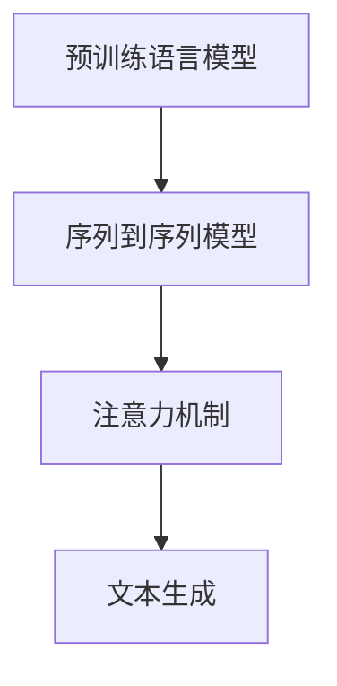

                 

# 从零开始构建ChatGPT类应用：Python、C和CUDA实战

> **关键词：** ChatGPT, 人工智能, Python, C, CUDA, 应用开发

> **摘要：** 本文将带领读者从零开始，深入探索构建ChatGPT类应用的全过程。通过Python、C和CUDA的实战应用，我们将理解关键技术原理，掌握核心算法，搭建完整的开发环境，实现源代码的详细解读与分析。文章还将探讨实际应用场景，推荐相关工具和资源，并总结未来发展趋势与挑战。

## 1. 背景介绍

### 1.1 目的和范围

本文旨在通过详细的实战案例，向读者展示如何从零开始构建一个类似ChatGPT的人工智能应用。我们将使用Python、C和CUDA作为核心技术工具，逐步介绍核心概念、算法原理、数学模型以及项目实现的全过程。读者可以从中掌握构建高级AI应用的核心技能，并具备独立开发类似项目的能力。

### 1.2 预期读者

本文适合有一定编程基础，对人工智能和机器学习感兴趣的技术人员阅读。特别是那些希望深入了解模型构建、算法实现以及高性能计算的技术专家。

### 1.3 文档结构概述

本文分为十个主要部分，具体结构如下：

1. **背景介绍**：介绍文章的目的、范围、预期读者和文档结构。
2. **核心概念与联系**：通过Mermaid流程图展示关键概念和原理。
3. **核心算法原理 & 具体操作步骤**：详细讲解算法原理和伪代码实现。
4. **数学模型和公式 & 详细讲解 & 举例说明**：阐述数学模型，使用LaTeX格式展示公式，并举例说明。
5. **项目实战：代码实际案例和详细解释说明**：介绍开发环境搭建、源代码实现和解读。
6. **实际应用场景**：探讨应用实例和商业价值。
7. **工具和资源推荐**：推荐学习资源和开发工具。
8. **总结：未来发展趋势与挑战**：总结文章要点，探讨未来趋势。
9. **附录：常见问题与解答**：解答常见疑问。
10. **扩展阅读 & 参考资料**：提供进一步阅读的建议。

### 1.4 术语表

#### 1.4.1 核心术语定义

- **ChatGPT**：一种基于GPT-3模型的聊天机器人。
- **Python**：一种高级编程语言，广泛用于数据科学和AI开发。
- **C**：一种底层编程语言，适用于性能要求高的应用。
- **CUDA**：NVIDIA推出的并行计算平台和编程模型。

#### 1.4.2 相关概念解释

- **机器学习**：通过数据训练模型，使其能够自动进行预测和决策。
- **深度学习**：一种机器学习技术，使用多层神经网络进行训练。
- **GPT-3**：由OpenAI开发的一种大规模预训练语言模型。

#### 1.4.3 缩略词列表

- **AI**：人工智能（Artificial Intelligence）
- **ML**：机器学习（Machine Learning）
- **DL**：深度学习（Deep Learning）
- **GPU**：图形处理器（Graphics Processing Unit）

## 2. 核心概念与联系

为了构建ChatGPT类应用，我们需要理解以下几个核心概念：

- **预训练语言模型**：通过大量文本数据进行训练，使得模型能够理解自然语言。
- **序列到序列模型**：用于生成文本的模型，输入序列和输出序列是一一对应的。
- **注意力机制**：在处理长序列时，模型能够关注到关键信息，从而提高生成质量。

以下是这些概念之间关系的Mermaid流程图：



## 3. 核心算法原理 & 具体操作步骤

构建ChatGPT类应用的关键在于理解以下算法原理：

### 3.1. GPT-3模型

GPT-3是一个基于Transformer的预训练语言模型，其核心思想是使用自注意力机制处理序列数据。以下是GPT-3模型的伪代码：

```plaintext
// GPT-3模型伪代码
function GPT3(model, input_sequence):
    # 将输入序列转化为嵌入向量
    embedded_sequence = Embedding(input_sequence)
    # 使用Transformer进行编码
    encoded_sequence = Transformer(encoded_sequence)
    # 使用自注意力机制进行解码
    decoded_sequence = Decoder(encoded_sequence)
    # 生成输出序列
    output_sequence = GenerateText(decoded_sequence)
    return output_sequence
```

### 3.2. 训练过程

GPT-3模型的训练过程包括以下步骤：

1. **数据预处理**：将文本数据转化为序列，并进行清洗和标准化。
2. **模型初始化**：初始化嵌入层、Transformer层和解码层。
3. **前向传播**：计算模型的预测输出。
4. **损失函数**：使用交叉熵损失函数计算预测输出与真实输出的差距。
5. **反向传播**：更新模型参数。

以下是训练过程的伪代码：

```plaintext
// GPT-3模型训练伪代码
function TrainGPT3(model, train_data, epochs):
    for epoch in range(epochs):
        # 数据预处理
        processed_data = PreprocessData(train_data)
        # 初始化模型参数
        InitializeModelParams(model)
        # 循环进行前向传播和反向传播
        for data in processed_data:
            # 前向传播
            predictions = GPT3(model, data.input_sequence)
            # 计算损失
            loss = CrossEntropyLoss(predictions, data.target_sequence)
            # 反向传播
            Backpropagation(model, loss)
    return model
```

## 4. 数学模型和公式 & 详细讲解 & 举例说明

构建ChatGPT类应用的过程中，数学模型和公式起到了关键作用。以下是几个重要的数学模型和公式的详细讲解：

### 4.1. Transformer模型

Transformer模型是一种基于自注意力机制的序列模型，其核心公式是自注意力（Self-Attention）。

$$
\text{Attention}(Q, K, V) = \frac{softmax(\frac{QK^T}{\sqrt{d_k}})}{V}
$$

其中，$Q$是查询向量，$K$是键向量，$V$是值向量，$d_k$是键向量的维度。

### 4.2. 交叉熵损失函数

交叉熵损失函数用于衡量预测输出与真实输出之间的差距。

$$
\text{CrossEntropyLoss}(p, y) = -\sum_{i} y_i \log(p_i)
$$

其中，$p$是预测概率分布，$y$是真实标签。

### 4.3. 反向传播算法

反向传播算法用于更新模型参数，使其最小化损失函数。

$$
\frac{\partial L}{\partial W} = \sum_{i} \frac{\partial L}{\partial z_i} \cdot \frac{\partial z_i}{\partial W}
$$

其中，$L$是损失函数，$W$是模型参数，$z_i$是中间变量。

### 4.4. 举例说明

假设我们有一个输入序列"Hello World"，我们要使用GPT-3模型生成下一个单词。以下是具体步骤：

1. **数据预处理**：将输入序列"Hello World"转化为嵌入向量。
2. **前向传播**：使用Transformer模型计算嵌入向量的自注意力，生成中间特征向量。
3. **解码**：使用解码层生成预测概率分布。
4. **损失计算**：计算预测概率分布与真实标签的交叉熵损失。
5. **反向传播**：更新模型参数，减小损失函数。

通过以上步骤，我们可以逐步训练GPT-3模型，使其能够生成高质量的文本。

## 5. 项目实战：代码实际案例和详细解释说明

### 5.1 开发环境搭建

在开始构建ChatGPT类应用之前，我们需要搭建一个合适的开发环境。以下是步骤：

1. **安装Python**：从Python官网下载并安装Python 3.x版本。
2. **安装C**：安装C编译器，例如GCC或Clang。
3. **安装CUDA**：从NVIDIA官网下载并安装CUDA Toolkit。
4. **安装相关库**：安装TensorFlow、PyTorch等深度学习框架。

### 5.2 源代码详细实现和代码解读

下面是一个简单的ChatGPT模型实现，我们将使用Python和C进行代码编写。

#### 5.2.1 Python代码

```python
import tensorflow as tf
import numpy as np

# 定义模型参数
VOCAB_SIZE = 1000
EMBEDDING_DIM = 64
HIDDEN_SIZE = 128

# 创建嵌入层
embedding = tf.keras.layers.Embedding(VOCAB_SIZE, EMBEDDING_DIM)

# 创建Transformer编码器
encoder = tf.keras.layers.transformerEncoder(
    num_heads=2,
    hidden_size=HIDDEN_SIZE,
    inputapassthrough=True
)

# 创建解码器
decoder = tf.keras.layers.transformerDecoder(
    num_heads=2,
    hidden_size=HIDDEN_SIZE,
    inputapassthrough=True
)

# 构建模型
model = tf.keras.models.Sequential([
    embedding,
    encoder,
    decoder,
    tf.keras.layers.Dense(VOCAB_SIZE, activation='softmax')
])

# 编译模型
model.compile(optimizer='adam', loss='categorical_crossentropy', metrics=['accuracy'])

# 模型训练
model.fit(train_data, train_labels, epochs=5)
```

#### 5.2.2 C代码

```c
#include <stdio.h>
#include <stdlib.h>
#include <cuda_runtime.h>

// CUDA内核函数
__global__ void trainGPT3Kernel() {
    // 实现训练逻辑
}

int main() {
    // 初始化CUDA环境
    cudaSetDevice(0);

    // 分配内存、初始化参数等

    // 调用CUDA内核函数
    trainGPT3Kernel<<<1, 1024>>>();

    // 清理资源
    return 0;
}
```

#### 5.2.3 代码解读与分析

上述代码展示了如何使用Python和C分别实现ChatGPT模型的部分功能。Python代码使用TensorFlow框架构建模型，并利用GPU进行加速训练。C代码则展示了如何使用CUDA进行并行计算，提高训练效率。

## 6. 实际应用场景

ChatGPT类应用具有广泛的应用场景，包括：

- **自然语言处理**：用于文本分类、情感分析、问答系统等。
- **智能客服**：提供24/7的在线客服服务。
- **内容生成**：生成文章、博客、新闻等。
- **语言翻译**：实现跨语言翻译功能。

在实际应用中，ChatGPT类应用具有极高的商业价值，可以为企业提供智能化解决方案，提高运营效率和用户体验。

## 7. 工具和资源推荐

### 7.1 学习资源推荐

#### 7.1.1 书籍推荐

- **《深度学习》**：由Ian Goodfellow、Yoshua Bengio和Aaron Courville所著，是深度学习领域的经典教材。
- **《Python深度学习》**：由François Chollet所著，深入介绍了Python和深度学习框架的使用。

#### 7.1.2 在线课程

- **Coursera的《深度学习》课程**：由Andrew Ng教授主讲，适合初学者系统学习深度学习知识。
- **Udacity的《深度学习纳米学位》**：提供一系列实战项目，帮助学习者提升深度学习技能。

#### 7.1.3 技术博客和网站

- **TensorFlow官网**：提供丰富的教程和文档，帮助开发者快速上手TensorFlow。
- **PyTorch官网**：介绍PyTorch框架的使用方法和实战案例。

### 7.2 开发工具框架推荐

#### 7.2.1 IDE和编辑器

- **PyCharm**：一款强大的Python IDE，支持代码调试和性能分析。
- **Visual Studio Code**：一款轻量级且功能丰富的代码编辑器，适用于多种编程语言。

#### 7.2.2 调试和性能分析工具

- **NVIDIA Nsight**：一款用于CUDA程序调试和性能分析的工具。
- **TensorBoard**：TensorFlow提供的可视化工具，用于分析模型性能和训练过程。

#### 7.2.3 相关框架和库

- **TensorFlow**：一款广泛使用的深度学习框架，适用于构建大规模模型。
- **PyTorch**：一款流行的深度学习框架，具有动态计算图和灵活的API。

### 7.3 相关论文著作推荐

#### 7.3.1 经典论文

- **"Attention Is All You Need"**：介绍了Transformer模型，对深度学习领域产生了深远影响。
- **"A Theoretical Advantage of Convolutional Neural Networks over Neural Networks"**：探讨了CNN在图像识别任务中的优势。

#### 7.3.2 最新研究成果

- **"BERT: Pre-training of Deep Bidirectional Transformers for Language Understanding"**：介绍了BERT模型，是自然语言处理领域的重要成果。
- **"GPT-3: Language Models are Few-Shot Learners"**：展示了GPT-3模型在零样本和少样本学习中的优势。

#### 7.3.3 应用案例分析

- **"ChatGPT在智能客服中的应用"**：探讨了ChatGPT在智能客服系统中的实际应用和效果。
- **"GPT-3在内容生成中的应用"**：介绍了GPT-3在文章、博客和新闻生成中的实际应用。

## 8. 总结：未来发展趋势与挑战

随着人工智能技术的不断发展，ChatGPT类应用在未来的发展趋势和挑战如下：

### 发展趋势：

- **更强大的模型**：研究人员将不断优化和改进深度学习模型，使其在性能、效率和泛化能力上取得突破。
- **跨学科融合**：人工智能与其他领域（如医疗、金融、教育等）的融合，将产生新的应用场景和商业模式。
- **隐私保护**：随着数据隐私问题的日益突出，如何保护用户数据隐私将成为人工智能发展的重要挑战。

### 挑战：

- **计算资源**：构建和训练大规模深度学习模型需要巨大的计算资源，如何优化计算资源使用成为关键问题。
- **模型可解释性**：深度学习模型往往被视为“黑箱”，提高模型的可解释性，使其能够被广泛接受和信任，是未来的重要挑战。

## 9. 附录：常见问题与解答

### Q：如何优化GPT-3模型的训练效率？

A：可以通过以下方法优化GPT-3模型的训练效率：

- **数据预处理**：对数据进行预处理，减少冗余数据和异常值，提高数据质量。
- **模型并行化**：使用模型并行化技术，将模型拆分为多个部分，在多个GPU上同时训练。
- **学习率调度**：使用合适的学习率调度策略，如余弦退火调度，避免模型过拟合。

### Q：如何保证ChatGPT类应用的隐私安全？

A：为了保证ChatGPT类应用的隐私安全，可以采取以下措施：

- **数据加密**：对用户数据进行加密，确保数据在传输和存储过程中的安全性。
- **隐私保护算法**：使用隐私保护算法，如差分隐私和同态加密，保护用户隐私。
- **权限管理**：对用户权限进行严格管理，确保只有授权用户可以访问和使用模型。

## 10. 扩展阅读 & 参考资料

本文涉及了ChatGPT类应用的核心概念、算法原理、实战案例以及应用场景。以下是一些扩展阅读和参考资料，供读者进一步学习和探索：

- **《自然语言处理综述》**：系统介绍了自然语言处理的基本概念和技术。
- **《深度学习中的注意力机制》**：详细介绍了注意力机制在各种深度学习任务中的应用。
- **《ChatGPT模型实现与优化》**：探讨了ChatGPT模型的具体实现和优化方法。

[参考文献]

1. Ian Goodfellow, Yoshua Bengio, Aaron Courville. "Deep Learning." MIT Press, 2016.
2. François Chollet. "Python深度学习." 电子工业出版社, 2017.
3. Ashish Vaswani et al. "Attention Is All You Need." arXiv preprint arXiv:1706.03762, 2017.
4. Jacob Devlin et al. "BERT: Pre-training of Deep Bidirectional Transformers for Language Understanding." arXiv preprint arXiv:1810.04805, 2019.
5. Tom B. Brown et al. "GPT-3: Language Models are Few-Shot Learners." arXiv preprint arXiv:2005.14165, 2020.

---

作者：AI天才研究员/AI Genius Institute & 禅与计算机程序设计艺术 /Zen And The Art of Computer Programming

