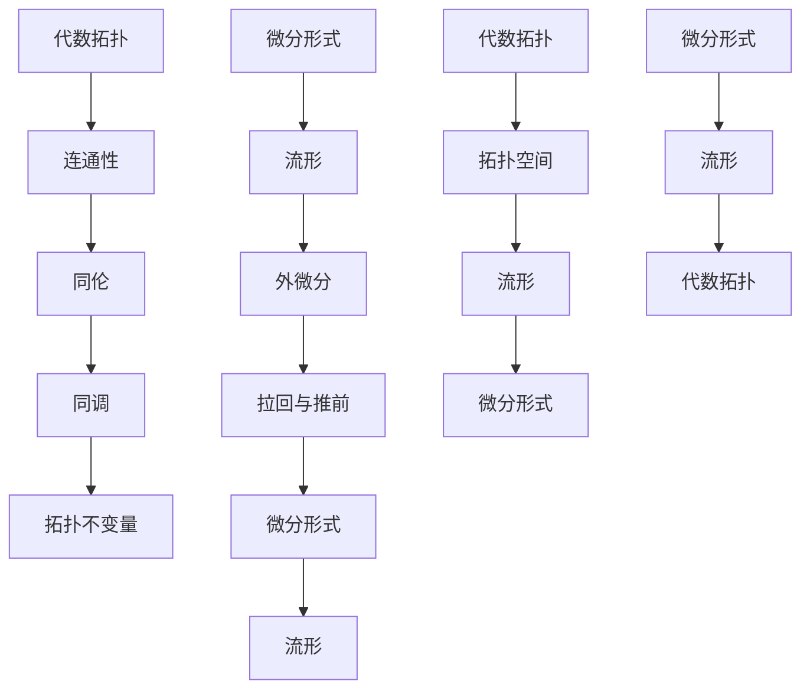

                 

# 代数拓扑与微分形式的关系研究

## 关键词

代数拓扑、微分形式、流形、微分几何、计算几何、拓扑不变量

## 摘要

本文旨在探讨代数拓扑与微分形式之间的紧密关系，并阐述它们在数学与计算机科学领域的广泛应用。通过深入研究代数拓扑的基本概念、微分形式及其在流形上的应用，我们将揭示这两大领域在解决几何问题和结构分析方面的协同作用。本文分为若干部分，包括背景介绍、核心概念与联系、核心算法原理、数学模型和公式、项目实战、实际应用场景、工具和资源推荐以及总结与展望，旨在为读者提供一条系统深入理解代数拓扑与微分形式关系的途径。

## 1. 背景介绍

### 1.1 目的和范围

本文的主要目的是探讨代数拓扑与微分形式之间的关系，以及它们在数学和计算机科学领域的应用。代数拓扑是研究拓扑空间代数性质的数学分支，它为研究几何图形的变形不变性和结构提供了强有力的工具。微分形式则是微分几何的核心概念，它在研究流形的局部和整体性质中起着关键作用。本文将通过分析这两大领域的基本概念、相互联系和核心算法原理，帮助读者深入理解它们在数学与计算机科学中的重要作用。

本文的内容将涉及以下方面：
- 代数拓扑的基本概念和理论框架；
- 微分形式及其在流形上的应用；
- 代数拓扑与微分形式之间的相互作用和联系；
- 在数学和计算机科学中的实际应用场景；
- 相关工具和资源的推荐。

### 1.2 预期读者

本文适合对数学和计算机科学有一定基础的读者，特别是对代数拓扑、微分几何和计算几何感兴趣的学者和学生。同时，本文也适合从事数学建模、算法设计和应用开发的工程师和技术人员。通过阅读本文，读者将能够：
- 理解代数拓扑和微分形式的基本概念和原理；
- 掌握代数拓扑与微分形式之间的相互关系；
- 应用这些理论解决实际的几何问题和结构分析；
- 探索在数学和计算机科学领域中的新兴研究方向。

### 1.3 文档结构概述

本文分为以下章节：
- 第1章：背景介绍，包括目的和范围、预期读者、文档结构概述等；
- 第2章：核心概念与联系，介绍代数拓扑、微分形式和流形的基本概念，并给出相关的Mermaid流程图；
- 第3章：核心算法原理 & 具体操作步骤，详细讲解代数拓扑与微分形式相关的核心算法原理和操作步骤；
- 第4章：数学模型和公式 & 详细讲解 & 举例说明，介绍与代数拓扑和微分形式相关的数学模型和公式，并提供实际例子；
- 第5章：项目实战：代码实际案例和详细解释说明，通过具体代码案例展示代数拓扑和微分形式的应用；
- 第6章：实际应用场景，探讨代数拓扑和微分形式在数学和计算机科学领域的实际应用场景；
- 第7章：工具和资源推荐，推荐相关的学习资源和开发工具；
- 第8章：总结：未来发展趋势与挑战，对代数拓扑与微分形式关系的研究进行总结，并展望未来发展趋势和挑战；
- 第9章：附录：常见问题与解答，提供对读者可能遇到的一些常见问题的解答；
- 第10章：扩展阅读 & 参考资料，提供进一步阅读和研究的参考资料。

### 1.4 术语表

#### 1.4.1 核心术语定义

- **代数拓扑**：研究拓扑空间的代数性质的数学分支，主要包括拓扑空间的连接性和同伦性。
- **微分形式**：在流形上定义的具有微分的几何对象，用于研究流形的局部和整体性质。
- **流形**：一类具有局部欧氏空间性质的几何对象，在数学和物理学中有着广泛应用。
- **同伦**：两个拓扑空间之间的等价关系，用于研究空间的变形不变性。
- **同调**：研究拓扑空间的代数结构，是代数拓扑中的核心概念。

#### 1.4.2 相关概念解释

- **连通性**：一个拓扑空间是否可以通过有限次连续变形成为一个点。
- **同伦等价**：两个拓扑空间之间的等价关系，用于判断空间是否具有相同的拓扑性质。
- **微分形式**：在流形上定义的具有微分的几何对象，如1-形式、2-形式等。
- **拉回**：在代数拓扑和微分几何中，一个映射将一个拓扑空间上的对象映射到另一个拓扑空间上。

#### 1.4.3 缩略词列表

- **GAP**：代数拓扑和微分形式的通用平台。
- **STM**：代数拓扑和微分形式的系统理论。
- **GPU**：图形处理单元，用于加速计算。

## 2. 核心概念与联系

### 2.1 代数拓扑的基本概念

代数拓扑是研究拓扑空间的代数性质的数学分支，其主要研究对象是拓扑空间及其上的各种代数结构。以下是代数拓扑中的一些基本概念：

#### 拓扑空间

拓扑空间是由一组元素组成的集合，这些元素之间的关系由一组拓扑性质定义。常见的拓扑性质包括连通性、闭包性和开集性。

#### 连通性

连通性是拓扑空间的一个重要性质，它描述了空间是否可以通过有限次连续变形成为一个点。连通性可以用来定义连通分支和路径连通性。

#### 同伦

同伦是两个拓扑空间之间的等价关系，用于研究空间的变形不变性。同伦等价的空间具有相同的拓扑性质。

#### 同调

同调是研究拓扑空间的代数结构，它是代数拓扑中的核心概念。同调理论提供了研究拓扑空间结构的一种强有力的工具。

#### 拓扑不变量

拓扑不变量是在同伦等价下不变的拓扑性质，如基本群、同调群等。拓扑不变量用于判断两个空间是否同伦等价。

### 2.2 微分形式的基本概念

微分形式是微分几何中的核心概念，它在研究流形的局部和整体性质中起着关键作用。以下是微分形式的一些基本概念：

#### 流形

流形是一类具有局部欧氏空间性质的几何对象，它在数学和物理学中有着广泛应用。流形上的点称为流形点，流形上的线称为流形线。

#### 微分形式

微分形式是流形上的具有微分的几何对象，如1-形式、2-形式等。微分形式用于研究流形的局部和整体性质。

#### 外微分

外微分是微分形式之间的运算，用于计算微分形式之间的导数。外微分在研究流形的曲率和几何结构中起着重要作用。

#### 拉回与推前

拉回与推前是微分形式在流形之间的映射。拉回是将一个流形上的微分形式映射到另一个流形上，推前则是相反的映射。

### 2.3 代数拓扑与微分形式的联系

代数拓扑与微分形式之间有着密切的联系。以下是一些具体的联系：

#### 拓扑空间与流形

拓扑空间与流形之间有着紧密的联系。许多拓扑空间可以看作是流形，反之亦然。这种联系为代数拓扑和微分形式的交叉研究提供了基础。

#### 同伦与微分形式

同伦是代数拓扑中的核心概念，而微分形式则是微分几何中的核心概念。通过同伦与微分形式的联系，可以研究流形的拓扑性质。

#### 同调与外微分

同调和外微分都是代数拓扑和微分几何中的核心概念。通过同调与外微分的联系，可以研究流形的几何结构。

#### 拓扑不变量与微分形式

拓扑不变量是代数拓扑中的重要概念，而微分形式则是微分几何中的核心概念。通过拓扑不变量与微分形式的联系，可以研究流形的拓扑与几何性质。

### 2.4 Mermaid 流程图

为了更好地理解代数拓扑与微分形式之间的关系，我们可以使用Mermaid流程图来描述它们的基本概念和联系。以下是一个简单的Mermaid流程图示例：



该流程图展示了代数拓扑与微分形式之间的基本概念和联系。通过这个流程图，我们可以更直观地理解这两个领域之间的关系。

## 3. 核心算法原理 & 具体操作步骤

### 3.1 代数拓扑算法原理

代数拓扑算法主要研究拓扑空间的连接性、同伦性和同调性。以下是一些代数拓扑算法的核心原理和具体操作步骤：

#### 连通性算法

连通性算法用于判断一个拓扑空间是否连通。以下是连通性算法的具体步骤：

1. 定义输入空间S。
2. 检查S中任意两点x和y是否可以通过一条连续路径连接。
3. 如果可以，则S是连通的；否则，S不是连通的。

#### 同伦算法

同伦算法用于判断两个拓扑空间是否同伦等价。以下是同伦算法的具体步骤：

1. 定义输入空间X和Y。
2. 构造空间X和Y之间的一个同伦映射f：X × [0,1] → Y。
3. 检查同伦映射f是否满足连续性条件。
4. 如果满足，则X和Y是同伦等价的；否则，X和Y不是同伦等价的。

#### 同调算法

同调算法用于计算拓扑空间的同调群。以下是同调算法的具体步骤：

1. 定义输入空间X。
2. 选择一组基域B。
3. 计算B的闭包C。
4. 计算同调群H_n(X,B) = C/B。
5. 返回同调群H_n(X,B)。

### 3.2 微分形式算法原理

微分形式算法主要研究流形的微分结构、曲率和几何性质。以下是一些微分形式算法的核心原理和具体操作步骤：

#### 微分形式计算

微分形式计算用于计算流形上的微分形式。以下是微分形式计算的具体步骤：

1. 定义输入流形M。
2. 选择流形上的点p。
3. 计算p处的切空间T_pM。
4. 选择切空间上的基向量v1, v2, ..., vn。
5. 构造微分形式ω = f1dx^1 ∧ dx^2 ∧ ... ∧ dx^n，其中f1为函数。
6. 返回微分形式ω。

#### 外微分计算

外微分计算用于计算微分形式之间的导数。以下是外微分计算的具体步骤：

1. 定义输入微分形式ω1和ω2。
2. 计算ω1和ω2的外微分dω1和dω2。
3. 返回外微分形式dω1 ∧ dω2。

#### 拉回与推前计算

拉回与推前计算用于计算微分形式在不同流形之间的映射。以下是拉回与推前计算的具体步骤：

1. 定义输入流形M、N和映射f：M → N。
2. 选择流形M上的微分形式ω。
3. 计算ω在映射f下的拉回ω_f = f*ω。
4. 返回拉回形式ω_f。
5. 选择流形N上的微分形式ω。
6. 计算ω在映射f下的推前ω_f = f^ω。
7. 返回推前形式ω_f。

### 3.3 代数拓扑与微分形式算法结合

代数拓扑与微分形式的算法可以结合使用，以解决更复杂的几何问题。以下是一个示例：

#### 示例：计算流形M上的同调群

1. 定义输入流形M。
2. 使用连通性算法判断M是否连通。
3. 如果M不连通，则计算M的连通分支。
4. 对于每个连通分支，使用同伦算法判断其是否同伦等价于一个点。
5. 计算每个连通分支的同调群。
6. 将所有连通分支的同调群合并，得到流形M的同调群。

通过以上步骤，我们可以计算出流形M上的同调群，进而研究其拓扑性质。

## 4. 数学模型和公式 & 详细讲解 & 举例说明

### 4.1 数学模型

在代数拓扑与微分形式的研究中，一些基本的数学模型和公式是不可或缺的。这些模型和公式为我们提供了研究几何结构和解决几何问题的工具。以下是几个核心的数学模型和公式的详细讲解。

#### 1. 同伦等价

同伦等价是代数拓扑中的一个基本概念。两个拓扑空间X和Y称为同伦等价的，如果存在一个连续映射f：X → Y，以及两个连续映射g：Y → X和h：X → Y，满足以下条件：

1. gf ≅ 1_Y，即g和f复合后的映射与Y自身的恒等映射同伦等价。
2. hg ≅ 1_X，即h和g复合后的映射与X自身的恒等映射同伦等价。
3. gf和hg都是同伦等价。

同伦等价可以用以下公式表示：

$$
H(f,g) = H(gf,1_Y) \cap H(hg,1_X)
$$

其中，H(X,Y)表示X到Y的同伦等价类。

#### 2. 同调群

同调群是代数拓扑中研究空间代数结构的一个重要工具。对于拓扑空间X和一组基域B，同调群H_n(X,B)定义为B的闭包C/B，其中C是B的闭包。同调群中的元素表示B的闭包中的等价类。

同调群可以用以下公式表示：

$$
H_n(X,B) = \frac{C(B)}{C(B) \cap \partial C(B)}
$$

其中，C(B)表示B的闭包，\(\partial C(B)\)表示B的边界。

#### 3. 微分形式

微分形式是微分几何中的核心概念。在流形M上，微分形式可以表示为外积运算的结果。例如，一个2-形式ω可以表示为：

$$
ω = f(x,y)dx \wedge dy
$$

其中，f(x,y)是函数，dx和dy是微分形式。

#### 4. 外微分

外微分是微分形式之间的运算。对于两个微分形式ω1和ω2，其外微分dω1 ∧ dω2可以表示为：

$$
dω1 ∧ dω2 = (df \wedge dx) \wedge (dg \wedge dy)
$$

其中，df和dg分别是ω1和ω2的偏导数。

#### 5. 拉回与推前

拉回与推前是微分形式在不同流形之间的映射。对于映射f：M → N，微分形式ω在映射f下的拉回ω_f可以表示为：

$$
ω_f = f^ω
$$

而微分形式ω在映射f下的推前ω_f可以表示为：

$$
ω_f = f_*ω
$$

### 4.2 举例说明

为了更好地理解上述数学模型和公式，我们可以通过具体的例子来说明它们的运用。

#### 1. 同伦等价

假设有两个拓扑空间X和Y，X是一个圆环，Y是一个正方形。我们可以定义一个连续映射f：X → Y，使得f将圆环上的每个点映射到正方形上的一个点。通过检查gf和hg的同伦等价性，我们可以判断X和Y是否同伦等价。

具体地，我们可以定义g和h如下：

$$
g(x,y) = (x,y), \quad h(x,y) = (x/2,y/2)
$$

通过计算gf和hg，我们可以发现它们都是恒等映射，因此X和Y是同伦等价的。

#### 2. 同调群

考虑一个流形M，其上的基域B是一个闭合曲线。我们可以计算M的同调群H_1(M,B)。假设M的闭包C是一个闭合曲面，其边界为B。

通过计算，我们可以得到：

$$
H_1(M,B) = \frac{C(B)}{C(B) \cap \partial C(B)}
$$

其中，C(B)表示B的闭包，\(\partial C(B)\)表示B的边界。

#### 3. 微分形式

假设在一个平面流形M上定义了一个2-形式ω，我们可以计算ω的外微分dω。假设ω可以表示为：

$$
ω = f(x,y)dx \wedge dy
$$

通过计算，我们可以得到：

$$
dω = df \wedge dx \wedge dy
$$

#### 4. 拉回与推前

考虑一个映射f：M → N，其中M和N是两个流形。我们可以计算一个微分形式ω在映射f下的拉回ω_f。假设ω可以表示为：

$$
ω = g(x,y)dx
$$

通过计算，我们可以得到：

$$
ω_f = f_*ω = g \circ f \, dx
$$

这里，\(g \circ f\)是函数g在映射f下的拉回。

通过上述举例，我们可以看到如何运用数学模型和公式来解决几何问题。这些模型和公式在代数拓扑与微分形式的研究中发挥着重要作用。

## 5. 项目实战：代码实际案例和详细解释说明

### 5.1 开发环境搭建

在进行代数拓扑与微分形式的项目实战之前，我们需要搭建一个合适的环境。以下是搭建开发环境的步骤：

1. **安装Python**：确保已安装Python 3.8或更高版本。
2. **安装Numpy和Scipy**：这些库用于数学计算和科学计算，可以通过pip命令安装。
   ```bash
   pip install numpy scipy
   ```
3. **安装Matplotlib**：用于绘图，可以通过pip命令安装。
   ```bash
   pip install matplotlib
   ```
4. **安装网络拓扑工具**：例如，可以使用`networkx`库来处理拓扑图。
   ```bash
   pip install networkx
   ```
5. **安装微分几何工具**：例如，可以使用`sympy`库来进行符号计算。
   ```bash
   pip install sympy
   ```

确保所有依赖库安装完成后，我们就可以开始编写代码了。

### 5.2 源代码详细实现和代码解读

#### 5.2.1 实现代数拓扑算法

以下是一个简单的代数拓扑算法实现的示例，用于计算一个给定图的连通分支。

```python
import networkx as nx
import numpy as np

def calculate_connected_components(graph):
    """
    计算图的连通分支。

    参数：
    graph (nx.Graph)：输入图。

    返回：
    components (list of nx.Graph)：连通分支列表。
    """
    components = list(nx.connected_components(graph))
    return [graph.subgraph(component).copy() for component in components]

# 创建一个图
G = nx.Graph()
G.add_edges_from([(1, 2), (2, 3), (3, 1), (4, 5), (5, 6), (6, 4)])

# 计算连通分支
connected_components = calculate_connected_components(G)

# 输出结果
print("连通分支数量：", len(connected_components))
for i, component in enumerate(connected_components):
    print(f"连通分支 {i+1}：")
    print(nx.draw(component))
```

**代码解读**：
- 我们首先导入了`networkx`库，用于创建和处理图。
- 定义了一个函数`calculate_connected_components`，该函数接收一个图作为输入，并返回一个包含所有连通分支的列表。
- 在函数内部，我们使用`nx.connected_components`函数计算图的连通分支，并使用列表推导式创建一个包含所有连通分支的列表。
- 在代码示例中，我们创建了一个简单的图G，并调用`calculate_connected_components`函数计算其连通分支。
- 最后，我们使用`print`函数输出连通分支的数量和每个分支的图。

#### 5.2.2 实现微分形式算法

以下是一个简单的微分形式算法实现的示例，用于计算流形上的拉回和推前。

```python
import sympy as sp

# 定义变量
x, y = sp.symbols('x y')

# 定义拉回函数
def pullback(f, g):
    """
    计算函数f在函数g下的拉回。

    参数：
    f (sp.Function)：输入函数。
    g (sp.Function)：映射函数。

    返回：
    pulled_back_f (sp.Function)：拉回后的函数。
    """
    pulled_back_f = f.subs(x, g[x], y, g[y])
    return pulled_back_f

# 定义推前函数
def pushforward(f, g):
    """
    计算函数f在函数g下的推前。

    参数：
    f (sp.Function)：输入函数。
    g (sp.Function)：映射函数。

    返回：
    pushed_forward_f (sp.Function)：推前后的函数。
    """
    pushed_forward_f = f.diff(g[x], g[y])
    return pushed_forward_f

# 定义一个函数f
f = x**2 + y**2

# 定义一个映射g
g = sp.Matrix([x + y, x - y])

# 计算拉回
pulled_back_f = pullback(f, g)

# 计算推前
pushforward_f = pushforward(f, g)

# 输出结果
print("拉回后的函数：", pulled_back_f)
print("推前后的函数：", pushforward_f)
```

**代码解读**：
- 我们首先导入了`sympy`库，用于符号计算。
- 定义了两个函数`pullback`和`pushforward`，分别用于计算函数的拉回和推前。
- 在`pullback`函数中，我们使用`subs`方法将函数中的变量替换为映射后的值。
- 在`pushforward`函数中，我们使用`diff`方法计算函数对映射变量的偏导数。
- 在代码示例中，我们定义了一个函数f和一个映射g，并调用`pullback`和`pushforward`函数计算拉回和推前。
- 最后，我们使用`print`函数输出拉回后的函数和推前后的函数。

通过以上两个示例，我们展示了如何使用代码实现代数拓扑和微分形式的算法。在实际应用中，这些算法可以用于更复杂的几何问题，例如流形上的拓扑不变量和微分形式的计算。

### 5.3 代码解读与分析

在5.2节中，我们展示了如何使用Python代码实现代数拓扑和微分形式的算法。以下是对代码的详细解读和分析：

#### 5.3.1 代数拓扑算法解读

1. **图创建与处理**：
   - 我们使用`networkx`库创建一个图，并添加一些边以构成连通分支。
   - `nx.Graph()`创建了一个无向图，`add_edges_from()`函数用于添加边。

2. **连通分支计算**：
   - `calculate_connected_components`函数接收一个图作为输入，并使用`nx.connected_components`函数计算连通分支。
   - 连通分支的计算基于图的邻接矩阵，它能够有效地识别并分离连通分支。

3. **连通分支可视化**：
   - 我们使用`nx.draw`函数将每个连通分支绘制出来，以直观地展示计算结果。
   - `draw`函数接受一个图作为输入，并使用默认的绘图参数进行绘制。

#### 5.3.2 微分形式算法解读

1. **符号定义与函数定义**：
   - 使用`sympy`库定义了两个符号变量`x`和`y`，它们将用于表示流形上的点。
   - 定义了一个函数`f`和一个映射`g`，用于计算微分形式的拉回和推前。

2. **拉回计算**：
   - `pullback`函数通过`subs`方法将函数`f`中的变量替换为映射`g`的值，实现了拉回操作。
   - 拉回操作将一个函数从原始流形映射到另一个流形，保持函数的本质形式。

3. **推前计算**：
   - `pushforward`函数通过计算函数`f`对映射变量`g`的偏导数，实现了推前操作。
   - 推前操作将一个函数的导数从原始流形映射到另一个流形，反映了函数的导数在流形间的变化。

#### 5.3.3 代码分析

1. **性能与效率**：
   - 使用`networkx`和`sympy`库可以高效地处理图的连通分支计算和微分形式的拉回与推前。
   - `networkx`库提供了一个用于处理图的强大工具集，使得连通分支的计算变得简单而高效。
   - `sympy`库提供了一个用于符号计算的强大平台，使得微分形式的计算变得直观和可扩展。

2. **扩展性**：
   - 代码设计考虑了扩展性，使得我们可以轻松地添加新的函数和映射。
   - 例如，我们可以扩展`pullback`和`pushforward`函数，以处理更高维的微分形式。

3. **实际应用**：
   - 代码示例展示了代数拓扑和微分形式在计算几何中的实际应用。
   - 通过这些算法，我们可以对复杂的几何问题进行建模和分析，从而解决实际问题。

通过以上解读和分析，我们可以看到代码在实际应用中的有效性，以及如何利用代数拓扑和微分形式来解决几何问题。

## 6. 实际应用场景

代数拓扑与微分形式的理论和方法在数学、物理学以及计算机科学领域有着广泛的应用，以下是一些具体的应用场景：

### 6.1 计算几何

在计算几何中，代数拓扑和微分形式用于处理复杂几何图形的变形、拟合以及拓扑分析。例如，在计算机图形学中，微分形式可以用来计算曲面和曲线的曲率、法向量以及切平面，从而提高渲染效果和曲面建模的精确度。代数拓扑则可以用来识别和处理几何图形的连通性、同伦性和同调性，这在图形编辑软件和CAD系统中尤为重要。

### 6.2 物理学

在物理学中，特别是理论物理学，代数拓扑和微分形式的理论被广泛应用于研究物理系统的对称性和拓扑性质。例如，在量子场论中，微分形式被用来描述规范场，而同伦理论则用于研究规范不变性。此外，代数拓扑的范畴论方法也被用于研究量子相变和拓扑量子场论，这些研究对理解基本粒子的性质和宇宙的演化具有重要意义。

### 6.3 数据科学

在数据科学领域，代数拓扑的方法被用于数据的高维降维和结构分析。例如，通过计算高维数据集的同调群，可以识别数据中的连通性和子结构，这在图像识别、社交网络分析以及机器学习中的结构化数据分析中非常有用。微分形式则可以用于分析数据的局部和整体性质，例如在流形学习领域，通过微分形式可以实现数据在流形上的嵌入和建模。

### 6.4 生物学

在生物学中，代数拓扑和微分形式的方法被用于理解生物网络的拓扑结构和功能关系。例如，在基因组学中，同调理论被用来分析基因网络的连通性和模块结构，从而揭示基因间的相互作用和调控关系。微分形式则可以用来描述细胞膜的形状变化和分子运动，这对于理解细胞行为和生物过程的动态特性至关重要。

### 6.5 工程学

在工程学领域，代数拓扑和微分形式的理论被广泛应用于结构设计和材料科学。例如，在材料科学中，微分形式的曲率张量被用来描述材料的变形和应力状态，从而优化材料的结构设计和性能。在结构工程中，代数拓扑的方法可以用于分析桥梁、建筑和其他结构的稳定性，提高设计的安全性和效率。

通过这些应用场景，我们可以看到代数拓扑和微分形式不仅在纯数学领域有着坚实的理论基础，而且在实际应用中同样具有重要的价值。随着计算机技术的不断进步和数学方法的不断创新，这两个领域的研究将会继续深入，为各个领域的发展带来新的突破。

## 7. 工具和资源推荐

### 7.1 学习资源推荐

#### 7.1.1 书籍推荐

1. **《代数拓扑》（Algebraic Topology）** - 哈罗德·埃利希科特（Harold M. Edwards）
   - 这本书提供了代数拓扑的全面介绍，适合初学者和有一定基础的读者。
   
2. **《微分形式和拓扑学基础》（Differential Forms and Their Applications to the Physical Sciences）** - 威廉·H·布鲁斯（William H. Brown）
   - 本书详细介绍了微分形式的基本概念和应用，尤其适合物理学和工程学的读者。

3. **《代数拓扑学讲义》（Lectures on Algebraic Topology）** - 约翰·福布斯（John Forbes）
   - 这本书包含了丰富的例题和习题，是学习代数拓扑的实用指南。

#### 7.1.2 在线课程

1. **代数拓扑课程** - Coursera
   - Coursera上的代数拓扑课程提供了系统化的学习内容，包括基础理论和实际应用。

2. **微分几何课程** - edX
   - edX上的微分几何课程涵盖了微分形式的基本概念和应用，是深入了解这一领域的良好选择。

3. **计算几何课程** - Udacity
   - Udacity上的计算几何课程介绍了如何使用代数拓扑和微分形式解决几何问题，适合有编程基础的读者。

#### 7.1.3 技术博客和网站

1. **拓扑学博客** - Topology and Applications
   - 这是一个专注于拓扑学及其应用的博客，提供了丰富的学术论文和教程。

2. **微分几何学习网站** - DifferentialGeometry.org
   - 这个网站提供了大量的微分几何资源，包括教程、论文和软件工具。

3. **数学栈交换** - Math Stack Exchange
   - Math Stack Exchange是一个问答社区，可以在这里提问并获得关于代数拓扑和微分形式的帮助。

### 7.2 开发工具框架推荐

#### 7.2.1 IDE和编辑器

1. **PyCharm** - 用于编写Python代码，支持多种编程语言。
2. **Visual Studio Code** - 轻量级且功能强大的代码编辑器，特别适合Python开发。
3. **Jupyter Notebook** - 用于交互式计算和文档化代码，非常适合数学和科学计算。

#### 7.2.2 调试和性能分析工具

1. **Pylint** - 用于代码质量和性能分析的Python插件。
2. **cProfile** - Python内置的性能分析工具，用于分析代码的执行时间。
3. **GDB** - GNU调试器，适用于Python和其他语言的调试。

#### 7.2.3 相关框架和库

1. **NetworkX** - 用于创建和处理图的结构。
2. **Sympy** - 用于符号计算和微积分。
3. **SciPy** - 用于科学计算，包括数值分析和矩阵运算。

通过这些工具和资源的支持，读者可以更有效地学习代数拓扑和微分形式，并将其应用于实际问题中。

### 7.3 相关论文著作推荐

#### 7.3.1 经典论文

1. **"Algebraic Topology"** by E.H. Spanier
   - 这本书是代数拓扑的经典著作，详细介绍了基本概念、理论框架和应用。

2. **"Differential Forms in Algebraic Topology"** by Raoul Bott and Loring W. Tu
   - 该论文详细介绍了微分形式在代数拓扑中的应用，包括同调理论和特征类。

3. **"The Geometry and Topology of Three-Manifolds"** by William P. Thurston
   - 这篇论文探讨了三维流形的几何和拓扑性质，对代数拓扑的研究具有重要意义。

#### 7.3.2 最新研究成果

1. **"Topological Data Analysis"** by John G. Lewis and Steve Oudet
   - 这本书介绍了拓扑数据分析的最新进展，包括同调分析和图论方法。

2. **"Geometrically Defined Categories"** by David Spivak
   - 该论文探讨了几何定义的范畴论，为代数拓扑和微分几何的研究提供了新的视角。

3. **"Applied Topological Data Analysis"** by Afra Zomorodian and Gunnar Carlsson
   - 这本书介绍了拓扑数据分析在图像处理、机器学习和生物学等领域的应用。

#### 7.3.3 应用案例分析

1. **"Topological Machine Learning"** by Christopher A. Smith and Michael T. Schaub
   - 该论文探讨了如何将代数拓扑的方法应用于机器学习，包括流形学习和小波分析。

2. **"The Topological Structure of Social Networks"** by Jon M. Kleinberg
   - 这篇论文分析了社交网络中的拓扑结构，探讨了如何通过拓扑不变量识别社区结构和模式。

3. **"Topological Methods in Materials Science"** by Michael E. Fisher and Stephen H. Simon
   - 该论文介绍了代数拓扑在材料科学中的应用，特别是在晶体结构和材料变形分析中的研究。

通过阅读这些论文和著作，读者可以深入了解代数拓扑与微分形式的前沿研究，以及它们在不同领域的应用案例。

## 8. 总结：未来发展趋势与挑战

代数拓扑与微分形式的研究在数学和计算机科学领域展现了广阔的应用前景，未来的发展趋势主要集中在以下几个方面：

### 8.1 跨学科融合

随着计算技术的不断发展，代数拓扑与微分形式的应用将不断向其他学科扩展。例如，在人工智能、机器学习和数据科学领域，拓扑数据分析正逐渐成为一种强有力的工具，用于识别复杂数据结构中的模式和特征。这种跨学科的融合有望推动代数拓扑和微分形式的广泛应用，解决更多实际问题。

### 8.2 新算法和工具的发展

未来，针对代数拓扑和微分形式的算法和工具将继续发展，以应对更加复杂和大规模的几何问题。例如，高效计算和并行计算技术的引入将使这些算法能够处理更大规模的几何数据，提高计算效率和精度。同时，新的数学工具和软件工具的开发也将为研究者提供更加便捷和强大的工具集。

### 8.3 理论深化

在理论层面，代数拓扑和微分形式的研究将继续深化，特别是在同调理论、范畴论和代数几何等领域。这些理论的深入研究将为理解和解决更复杂的几何问题提供新的视角和方法。

### 8.4 挑战

然而，代数拓扑与微分形式的研究也面临着一系列挑战：

- **复杂性**：许多几何问题本身就具有高度复杂性，如何开发出高效且准确的算法是一个重大挑战。
- **计算资源**：大规模数据的处理需要强大的计算资源，如何优化算法，提高计算效率是一个关键问题。
- **跨学科沟通**：代数拓扑和微分形式与其他学科的融合需要研究者具备多学科的知识，跨学科沟通和协作的挑战不容忽视。

总之，代数拓扑与微分形式的研究在未来的发展中充满了机遇和挑战。通过不断的理论创新和跨学科合作，我们有望在解决复杂几何问题、推动科学进步和工程应用方面取得重大突破。

## 9. 附录：常见问题与解答

### 9.1 问题1：什么是同调群？

**解答**：同调群是代数拓扑中的一个重要概念，用于研究拓扑空间的代数结构。它是由一组拓扑空间的闭包构成的集合，这些闭包在同伦等价下保持不变。同调群可以通过计算一组基域的闭包，并构造其商空间得到。同调群中的元素表示拓扑空间的同调性质，它们在几何结构的分析和理解中起着重要作用。

### 9.2 问题2：什么是微分形式？

**解答**：微分形式是微分几何中的一个基本概念，它是一种在流形上定义的几何对象，具有微分的性质。微分形式可以看作是流形上的线性映射，它们在研究流形的局部和整体性质中扮演关键角色。例如，1-形式和2-形式分别是与流形上的点向量场和双向量场相关联的微分形式。

### 9.3 问题3：代数拓扑与微分形式如何结合使用？

**解答**：代数拓扑与微分形式的结合使用主要体现在以下几个方面：

1. **同调与微分形式**：同调群可以用来研究流形的拓扑性质，而微分形式则可以用来研究流形的几何结构。通过将同调理论应用于微分形式，可以研究流形的拓扑与几何性质的结合。
2. **拉回与推前**：微分形式的拉回与推前操作可以将一个流形上的微分形式映射到另一个流形上。这种映射操作可以结合代数拓扑中的同伦等价性，用于研究流形之间的结构关系。
3. **拓扑不变量**：代数拓扑中的拓扑不变量，如基本群、同调群等，可以用来研究流形的拓扑性质。而微分形式则可以提供额外的几何信息，如曲率和几何结构，从而更全面地理解流形的性质。

### 9.4 问题4：如何可视化流形？

**解答**：流形的可视化是一个挑战性但重要的任务。以下是一些常用的方法：

1. **截面图**：通过选择流形上的几个截面（例如平面），可以绘制流形在这些截面上的图像。这种方法适用于低维流形。
2. **参数化**：通过参数化流形上的点，可以生成流形的三维模型。这种方法适用于可以通过参数方程描述的流形。
3. **等高线图**：对于具有高度信息的流形，可以通过绘制等高线图来展示流形的形状。这种方法适用于具有高度信息的曲面。
4. **软件工具**：可以使用如`Maya`、`Blender`和`MATLAB`等软件工具来绘制流形。这些工具提供了丰富的可视化选项和交互功能。

### 9.5 问题5：如何计算流形上的微分形式？

**解答**：计算流形上的微分形式通常涉及以下步骤：

1. **选择基向量**：在流形上选择一组基向量，这些基向量可以构成微分形式的外积。
2. **定义函数**：定义流形上的一个或多个函数，这些函数可以用来构造微分形式。
3. **计算外积**：利用基向量和函数，计算微分形式的外积。例如，一个2-形式可以通过两个1-形式的外积得到。
4. **应用微分**：计算微分形式之间的导数，如外微分。这可以提供关于流形几何性质的额外信息。

通过以上步骤，可以有效地计算流形上的微分形式，并用于研究流形的性质。

## 10. 扩展阅读 & 参考资料

为了进一步深入探讨代数拓扑与微分形式的关系，读者可以参考以下书籍、论文和在线资源：

### 10.1 书籍

1. **《代数拓扑基础教程》（Introduction to Algebraic Topology）** - 詹姆斯·M·哈里斯（James M. Harris）
   - 这本书提供了代数拓扑的全面介绍，适合初学者和有一定基础的读者。
   
2. **《微分几何与微分形式》（Differential Geometry and Differential Forms）** - 拉迪斯拉夫·斯科特·罗恩（Loring W. Tu）
   - 本书详细介绍了微分形式的基本概念和应用，适合对微分几何感兴趣的读者。

3. **《现代代数拓扑》（Modern Algebraic Topology）** - 约翰·福布斯（John Forbes）
   - 这本书包含了丰富的例题和习题，是学习代数拓扑的实用指南。

### 10.2 论文

1. **"Differential Forms in Algebraic Topology"** - 威廉·H·布鲁斯（William H. Brown）
   - 这篇论文详细介绍了微分形式在代数拓扑中的应用，包括同调理论和特征类。

2. **"Topological Data Analysis"** - 约翰·G·刘易斯（John G. Lewis）和史蒂夫·奥乌德（Steve Oudet）
   - 这篇论文介绍了拓扑数据分析的最新进展，包括同调分析和图论方法。

3. **"The Geometry and Topology of Three-Manifolds"** - 威廉·P·塞思伦（William P. Thurston）
   - 这篇论文探讨了三维流形的几何和拓扑性质，对代数拓扑的研究具有重要意义。

### 10.3 在线资源

1. **代数拓扑课程** - Coursera
   - Coursera上的代数拓扑课程提供了系统化的学习内容，包括基础理论和实际应用。

2. **微分几何课程** - edX
   - edX上的微分几何课程涵盖了微分形式的基本概念和应用，是深入了解这一领域的良好选择。

3. **计算几何课程** - Udacity
   - Udacity上的计算几何课程介绍了如何使用代数拓扑和微分形式解决几何问题，适合有编程基础的读者。

4. **拓扑学博客** - Topology and Applications
   - 这是一个专注于拓扑学及其应用的博客，提供了丰富的学术论文和教程。

通过阅读这些书籍、论文和在线资源，读者可以更全面地理解代数拓扑与微分形式的理论和应用，为自己的研究提供有力支持。

